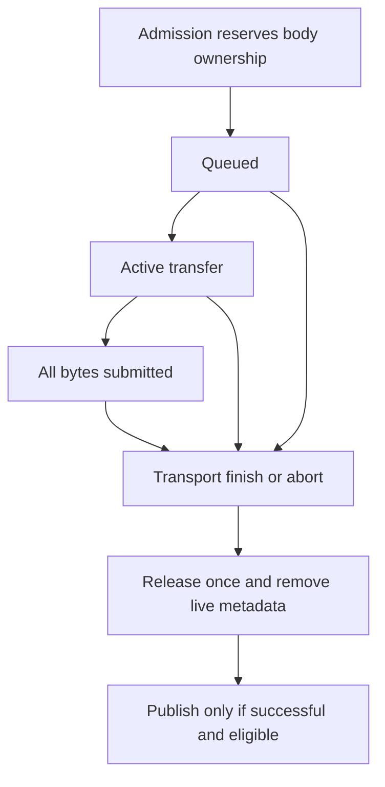

# Bounded Asynchronous Systems: Cancellation, Ownership and Measurement

An asynchronous operation can finish correctly and still be irrelevant to the interface that requested it. A user may have moved to another time interval, a recording revision may have changed, or authorization may have been revoked. Cancelling the old operation can reduce wasted work, but cancellation alone cannot establish whether a completion is permitted to publish.

A robust design needs three independent contracts: which work may be admitted, who owns its resources until termination, and which completed results remain eligible for current use. Measurement must then distinguish successful progress from merely running callbacks. This chapter develops those contracts with a deterministic scheduler whose limits and terminal states are executable assertions.

Series: [[PROJ - Engineering Temporal Systems - Textbook Series]]. The [scheduler implementation](_assets/temporal-systems/scheduler.py), [tests](_assets/temporal-systems/tests/test_scheduler.py), [experiment output](_assets/temporal-systems/outputs/scheduler-demo.json) and [test log](_assets/temporal-systems/outputs/scheduler-tests.log) are educational additions, not product code. The implementation investigation is described separately in [[ARTICLE - Video Observatory - Building a Synthetic Lab That Exercises the Real Product]]. Chapter 8 will apply these lifetime rules to frame presentation.

## 1. Completion is not permission to publish

A task identity needs more than a URL. Consider a numeric resource requested for generation 12 under authority A and revision R. By the time its response arrives, the viewport may be on generation 13. Even if the bytes are valid for R and reusable in a cache, they are not automatically the representation the current interface should display.

Use distinct fields for distinct questions:

| Identity component | Question answered |
|---|---|
| Resource key | Which logical tile, image or segment is this? |
| Revision | Which immutable content version do these bytes represent? |
| Authority scope/lifetime | Under which access decision were they admitted? |
| Intent generation | Which current interaction requested their publication? |
| Operation identity | Which individual asynchronous attempt owns this completion? |

The educational publication predicate is, with subscript $c$ denoting current state,

$$
\begin{aligned}
\operatorname{publish}(j)&=\operatorname{success}(j)\land\neg\operatorname{cancelled}(j)\\
&\quad\land(g_j,r_j,A_j)=(g_c,r_c,A_c).
\end{aligned}
$$

This is a model predicate, not a complete authorization implementation. A production system may need session identity, expiry, selected view, catalog revision and other admission checks. The important principle is that the predicate is evaluated when publication is attempted, not only when the request starts.

MDN's `AbortController` documentation describes a signal used to abort asynchronous operations, including fetch and response-body consumption. It does not define the application's current intent or revoke a result already placed in another queue. Abort signals should stop supported work; generation and authority checks should prevent obsolete publication. These are complementary mechanisms.

### 1.1 A completion race with an explicit result

The test admits two 256-byte jobs and submits both bodies. It then changes the current generation, revision and authority. One job finishes normally; cancellation is requested for the other while it is active, and that job also finishes. Both are counted as completed transport bodies and rejected as stale for publication. Their ownership is released exactly once.

A late duplicate finish call returns false and changes no counters. A queued job cancelled before activation is instead terminated immediately as aborted. Those distinctions let measurements answer separately whether cancellation was requested, whether transport completed, whether a result was stale, and whether resources were actually released.

The cache question can have a different answer from the UI question. Immutable bytes may remain reusable across viewport generations if the authority/content contract permits it. They must not be reused across authority changes merely because their URL text happens to match. Cache compatibility should be an explicit predicate, not an accidental consequence of key equality.

## 2. Model ownership through the terminal event

A resource lifetime begins when the system accepts responsibility for its storage. It ends when the last relevant owner has released it, not necessarily when a method named `send` returns or the last byte has been submitted to a downstream buffer.



A real completed result may transfer to a cache or renderer lease rather than being destroyed. Ending the transport owner's responsibility does not end those other owners' responsibilities. The model counts publication outcomes without retaining payloads; it is not a complete memory model for the downstream interface.

The scheduler reserves each job's entire declared body size until a modeled finish or abort event. As bytes are submitted, `remaining` decreases but `owned` does not. This makes it impossible to admit a replacement body by pretending that bytes buffered downstream have disappeared from the application's responsibility.

Node's stream documentation makes the distinction concrete. `write()` can buffer data internally, and its boolean return value communicates whether the producer should continue writing. The `highWaterMark` is a backpressure threshold, not a general strict memory limit. A caller needs its own admission/accounting policy if exceeding a particular owned-byte budget is forbidden.

The product's `LabTransport` retains each response body until `finish` or `close`, removes listeners at termination and guards cleanup with a `done` flag. Its byte counter measures bytes submitted to Node's response stream, not bytes physically delivered on a network link. The educational scheduler similarly labels submission rather than pretending to measure wire throughput.

### 2.1 Leases protect current working sets

A cache entry may be old by recency but still required by an active renderer. A lease records that dependency. Eviction must skip pinned entries; otherwise cache management can dispose an image or texture still in use.

The example `PinnedCache` tracks size and pin count, updates recency when acquiring a lease, and returns an idempotent release closure. If an eight-byte cache contains one pinned eight-byte entry, installing another eight-byte entry fails without deleting the current entry. After release, installation succeeds and evicts the now-unpinned entry. Calling the same release closure twice does not decrement the count twice.

Refusal is a legitimate cache policy. Alternatives include deferring the request or explicitly replacing a current working set, but silently exceeding the budget is not a bounded policy. Nor should a failed admission evict unrelated entries before discovering that pinned bytes still prevent success. The example precomputes reclaimable bytes and refuses atomically when necessary.

Encoded bytes, decoded arrays, queued images and graphics textures have different owners. Converting one representation into another can temporarily require both. A cache budget for compressed images therefore cannot be used as a bound on decoded-image or texture residency. Even precise application accounting does not include every driver allocation, browser process buffer or Python object overhead.

## 3. Bound admission independently of backpressure

Backpressure communicates that a downstream consumer is not currently accepting more work at the producer's desired rate. Admission decides whether a new work item may enter the system at all. If admission remains unlimited while every consumer is blocked, the queue still grows without bound.

The executable scheduler uses these defaults:

| Limit | Value | Counted owner |
|---|---:|---|
| Active jobs | 2 | Includes bodies awaiting terminal finish |
| Active jobs per key | 1 | Prevents one resource group from occupying every slot |
| Waiting jobs | 4 | Jobs not yet activated |
| Reserved body bytes | 8,192 | Full declared sizes of all admitted live jobs |
| Chunk submission | At most 256 bytes per serviced job per pump | Application submission work |
| Event queue | 256 callbacks | Injected deterministic event-clock entries |
| Retained trace | Last 256 events | Diagnostic history |
| Latency window | Last 64 successful completions | Explicit rolling measurement cohort |

Count and byte bounds solve different problems. Four queued requests can still be enormous if each declares a gigabyte body. Conversely, many tiny requests can consume substantial metadata and scheduling time even when their combined body sizes are small. The example checks both before accepting ownership.

At most six live jobs can exist under the default active/waiting limits. The implementation scans waiting jobs and computes active per-key counts; with $Q$ waiting and $A$ active jobs, activation costs $O(QA)$ in this deliberately simple implementation. Transfer service costs $O(A)$. Its metadata is bounded by admitted jobs plus the fixed event/diagnostic windows. Declared body ownership is bounded by the byte limit; no actual body arrays are allocated by the simulation.

### 3.1 Scheduling policy determines where blocking occurs

The activation scan can skip a job whose key already has an active operation and activate a later job for a different key. This avoids one form of queue head-of-line blocking. It does not eliminate all blocking: if both active destinations remain stalled, their slots remain occupied and waiting work cannot start.

Transfer service rotates the starting active job on each pump. Blocked destinations are skipped, and eligible destinations share the remaining byte allowance. This gives service opportunities among unblocked active jobs when tokens and pump calls continue. It is not a proof of bounded waiting under permanently blocked consumers, arbitrary arrivals or unlimited job sizes.

An operation whose cancellation is not immediate can continue consuming a slot until finish or explicit abort. That models an important real case: requesting cancellation does not necessarily reclaim capacity synchronously. Production systems may need timeouts and forceful disposal when cooperative cancellation is insufficient. The educational workload uses explicit terminal cleanup and verifies that every admitted body reaches a terminal owner state.

## 4. Share one bandwidth allowance across the workload

Per-connection throttling does not establish an aggregate workload cap. If four connections each receive one megabyte per second, the application can submit four megabytes per second. A shared limiter must account for all participating transfers against the same state.

Let $R$ be refill rate in bytes per second, $B$ maximum burst credit and $T$ current tokens. After elapsed time $\Delta t$,

$$
T'=\min(B,T+R\Delta t).
$$

Submitting $c$ bytes requires $c\le T'$ and leaves $T'-c$ tokens. Since tokens never exceed $B$, total submitted bytes over an interval of duration $t$ are bounded by

$$
C(t)\le B+Rt,
$$

assuming all participating submissions consume tokens and no other path bypasses the limiter. RFC 3290 Appendix A.2 gives this token-bucket conformance bound and discusses packetization consequences in A.3. The example applies byte-level credit to chunks rather than implementing packet policing.

With $R=1024$ bytes/second and $B=512$, at most 768 bytes can be submitted during the first quarter-second, and at most 1,536 during the first second. Those are upper bounds, not promises of progress. A blocked destination can consume zero bytes while fully respecting the limit.

The model keeps fractional credit exactly with `Fraction` and takes only whole-byte credit for each chunk. Its tests check cumulative consumption against burst plus refill after every ten-millisecond pump in a blocked/unblocked scenario. The product uses a different scale: a shared 16 KiB burst allowance and a ten-millisecond pump for impaired response bodies. Control/static paths and some direct failures are outside that workload cap. The chapter does not reinterpret it as a cap on every byte served by the process.

### 4.1 Make failures reproducible, but state the ordering dependency

The model can fail every Nth submission attempt by ordinal. Its ordinal includes rejected attempts, and that detail is part of its explicit model. The product has its own request-attempt boundary and impairment path. Neither policy means that a specific resource key always fails.

Changing request concurrency, cache state or arrival order changes which resource receives a given ordinal. A fixed random seed or failure interval is therefore not enough to reproduce a network trace unless the relevant request schedule is also controlled or recorded. The deterministic `EventClock` orders equal-time callbacks by insertion serial; seeded tests record deterministic choices and use no wall-clock sleeps.

Latency, failure injection and bandwidth are separate dimensions. The scheduler's latency delays activation eligibility; blocked destinations delay acceptance of chunks; ordinal failure affects terminal outcome. A production transport can fail before generating a body, after partial delivery or during authorization checks. The example deliberately models a smaller set of outcomes and does not claim to simulate every HTTP failure path.

## 5. Measure useful work rather than only activity

A short rendering callback interval can coexist with an empty display. A low median latency among completed requests can coexist with many requests that never completed. Choose metrics according to the question, and report unknown rather than zero when the question has no observations.

| Measurement | What it answers | What it does not establish |
|---|---|---|
| Pump or animation callbacks | Whether scheduled callbacks ran | Useful resource completion |
| Bytes submitted | Application transfer progress | Physical wire delivery |
| Successful latency | Elapsed time for completed operations in the named cohort | Latency of missing or failed work |
| Published result count | Completions accepted by the current predicate | Physical visibility of a video frame |
| Owned-byte count | Resources currently retained by this owner | Total process memory |
| Sampled maximum | Largest inspected snapshot value | A continuously observed high-water mark |

The scheduler maintains a continuous logical high-water value because every reservation passes through its admission function. That statement does not apply to a product report assembled from occasional snapshots. The retained P5 campaign's sampled resource maxima remain sampled observations, not a complete memory census.

### 5.1 Name cache-reset cohorts precisely

“Cold” can mean empty browser encoded cache, empty decoded arrays, empty textures, empty server cache, or a new process. These states are not interchangeable. A client-only reset with a warm server measures a different path from a fully cold server-and-client start. A warm return can include different still-pinned resources than a return after disposal.

Record which owners were reset and which lifetimes remained. Resetting a rolling browser measurement window does not reset persistent server counters. Combining them without cohort labels can falsely attribute earlier failures or cache hits to a later experiment. Numeric generation during manifest preparation can also create server cache hits before the browser's resource fetch, so those hits are not evidence of browser caching.

### 5.2 Percentiles cannot be averaged into a global percentile

Use a concrete nearest-rank definition: sort $n$ observations and select rank $\lceil0.95n\rceil$ for p95. Consider one hundred zero-millisecond observations and a second cohort of one hundred 100-millisecond observations. Their p95 values are zero and one hundred; their average is fifty. The combined two-hundred-observation p95 is one hundred.

The companion computes this counterexample. Averaging p95 values discards the distribution information needed to determine the combined rank. Unequal cohort sizes create another problem, and overlapping rolling windows count observations repeatedly. Report per-window percentiles as per-window statistics, or retain raw observations needed to compute the intended aggregate.

### 5.3 The observer can change the workload

In the retained P5 investigation, opening diagnostics moved players offscreen and affected visibility recovery. The textured four-video screenshot consequently contains covers during recovery; it should not be described as four exposed decoded frames. A separate P4 capture provides the distinct-frame evidence.

Likewise, rAF intervals near 16.7 milliseconds during injected failures showed continuing foreground scheduling, not complete data delivery. The retained error snapshot contained 64 injected failures and explicit missing detail. These observations motivate the experiment below but do not numerically calibrate it: a deterministic model is not a new browser benchmark.

## 6. Execute two equally active but differently useful workloads

The experiment admits four 1,024-byte bodies and schedules 61 pump callbacks from time zero through six seconds. In one run destinations accept data. In the other, all destinations remain blocked beyond the experiment's end. Both use identical callback schedules and byte/rate limits. Terminal finish is modeled fifty milliseconds after body submission.

Run from the companion directory:

```sh
PYTHONDONTWRITEBYTECODE=1 python3 -m unittest discover -s tests -v
python3 scheduler.py
```

The executed result is:

| Before terminal cleanup | Useful run | Blocked run |
|---|---:|---:|
| Pump callbacks | 61 | 61 |
| Admitted bodies | 4 | 4 |
| Bytes submitted | 4,096 | 0 |
| Published results | 4 | 0 |
| Reserved body bytes | 0 | 4,096 |
| Successful-completion p95 | 3,550 ms | Unknown |
| Logical owned-byte high-water | 4,096 | 4,096 |

An activity-only metric cannot distinguish these runs. The blocked run is not faster because it has no latency observations; its latency is unknown because nothing completed. At experiment termination, explicit abort cleanup releases all remaining bodies, and both runs finish with zero owned bytes.

Eighteen tests pass across the shared examples. Scheduler-specific tests verify stale publication rejection, queue/byte admission, ownership after body submission, idempotent terminal cleanup, queued cancellation, token consumption, per-key/global invariants, pinned-cache refusal and equal-time event ordering. Twenty seeded interleaving runs mix admission, cancellation, authority/generation changes and ordinal failures; every run ends with admitted count equal to disposal count and zero retained bodies.

These checks are deterministic state tests. They do not exercise actual Node sockets, measure Python heap usage, establish starvation freedom under every arrival pattern or validate an authorization server. The retained event trace is bounded diagnostic evidence; its 256-entry limit intentionally prevents tracing itself from creating unbounded retention.

## 7. The reusable design contract

Bounded asynchronous correctness requires more than a concurrency semaphore. Count admission bounds metadata; byte admission bounds declared storage; backpressure controls ongoing production; terminal ownership controls cleanup; publication eligibility controls whether a result can affect the current interface.

- Cancellation reduces obsolete work but does not replace current-intent and authority checks.
- Submitted bytes can remain owned until downstream termination; release accounting must follow the actual lifetime.
- Pinned working sets can force admission refusal. Eviction must not silently invalidate active users or exceed the budget.
- A bandwidth bound limits consumption but does not guarantee useful progress.
- Measurements need explicit cohorts and owners; callback activity and final percentiles alone can hide starvation or missing evidence.

These mechanisms provide the generic foundation for Chapter 8's presentation state machine. The next chapters first establish which historical bytes should be selected and how those bytes become browser media, before applying authorization and visibility checks to their frames.

### Source and reference notes

Product source pin: `ee51ca7b3091d96f9428199412038c1285099085`. Re-inspected `web-ui/lab/impairments.ts` for full-body retention, finish/close cleanup, backpressure and shared credit. Related implementations are `src/data/scheduler.ts`, `cache.ts`, `tile-loader.ts`, `app/useTileResources.ts`, `render/atlases.ts` and `src/lab/measurements.ts`. Retained P5 findings are reported in the linked original project article, with the original campaign and validation assets preserved alongside it.

External material read September 10, 2026: [RFC 3290 Appendix A.2–A.3](https://www.rfc-editor.org/rfc/rfc3290.html#appendix-A.2), [MDN AbortController](https://developer.mozilla.org/en-US/docs/Web/API/AbortController), and the official [Node v24.0.0 stream documentation, Buffering](https://github.com/nodejs/node/blob/v24.0.0/doc/api/stream.md#buffering). The Node website extraction timed out; the version-pinned official source was read instead. No unread WHATWG passage is presented as verified evidence.
