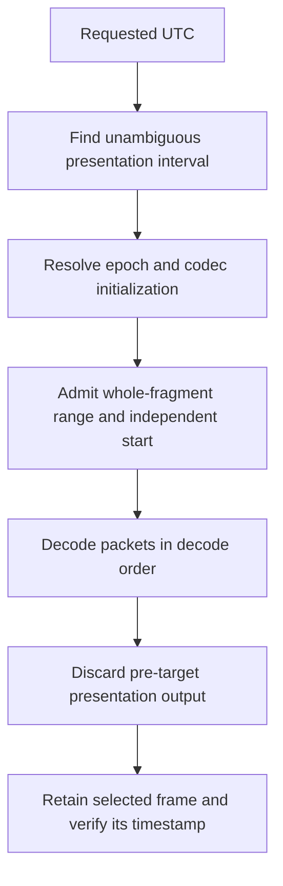
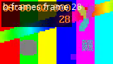

# From UTC to a Decodable Frame: Indexing Historical Video

A historical timestamp identifies the image a user wants to inspect. It does not directly identify a file offset from which a decoder can begin. The desired image may depend on earlier pictures, codec configuration may live in a separate initialization object, and media timestamps may have restarted since the previous recording. A correct index must describe both presentation meaning and the resources needed to decode it.

This chapter resolves a concrete UTC target into initialization data, a whole-fragment byte range and a decode-start position. It then executes that plan on generated H.264 media and verifies the first retained frame. The example deliberately includes a no-B-frame recording and a reordered recording, so PTS/DTS differences are observed rather than hypothetical.

Series: [[PROJ - Engineering Temporal Systems - Textbook Series]]. This begins the historical sequence: indexing, delivery, coordination, then presentation eligibility. The [index library](_assets/temporal-systems/archive_index.py), [media generator](_assets/temporal-systems/build_media.py), [tests](_assets/temporal-systems/tests/test_archive_index.py) and [generation audit](_assets/temporal-systems/outputs/media/generation-audit.json) are new educational artifacts. They are more sample-aware than the existing product's fragment/PDT path and must not be mistaken for that implementation.

## 1. Separate the codec from the container

A codec defines how compressed pictures are represented and decoded. A container organizes encoded samples, timing and track metadata into files or streams. H.264 is the codec used here; fragmented MP4 is the container structure. An MP4 file can contain different codecs, and H.264 can be carried in containers other than MP4.

A track is a sequence of related media samples, such as one video stream. A video sample commonly carries encoded data associated with a picture, but its bytes are not necessarily a standalone image file. The decoder may need initialization information and reference pictures before it can produce the sample's output.

For AVC/H.264, parameter sets describe decoding configuration such as dimensions and coding parameters. MP4 initialization metadata identifies the sample entry and carries codec configuration appropriate to that entry. The initialization object's identity is therefore part of a decode plan, not optional descriptive text.

A fragmented MP4 presentation commonly separates initialization metadata from media fragments. In the W3C ISO BMFF byte-stream format note, the initialization segment consists of `ftyp` and `moov`; media fragments contain `moof` metadata followed by `mdat` payload, with an optional `styp`. The note also defines requirements for fragment-relative addressing and decode-time metadata. This chapter uses these structures as actual files; Chapter 6 follows them through browser delivery.

### 1.1 Presentation order can differ from decode order

PTS identifies presentation time; DTS identifies decode time. If one picture references a later-presented picture, the reference must reach the decoder first. The sample stream can therefore advance in decode order while its PTS values move backward and forward.

The reordered fixture's second fragment begins with these actual ffprobe packet rows. Its timescale is 10,240 ticks per second:

| Decode-order packet | PTS | DTS | ffprobe key flag |
|---|---:|---:|---|
| 0 | 22,528 | 20,480 | Yes |
| 1 | 25,600 | 21,504 | No |
| 2 | 23,552 | 22,528 | No |
| 3 | 24,576 | 23,552 | No |
| 4 | 28,672 | 24,576 | No |
| 5 | 26,624 | 25,600 | No |

The DTS sequence increases. The PTS sequence does not. Sorting these packets by PTS before decoding would change the required input order. Conversely, using DTS to label the displayed frame would confuse decode scheduling with presentation meaning.

The generated reordered clip contains 36 B pictures according to decoded-frame metadata. All sixty packets have differing PTS and DTS. These are not contradictory facts: the number of packets with timestamp offsets is not the number of B pictures. Reordering can shift the timing relationship for reference pictures too.

### 1.2 A key flag is not a universal independence certificate

A group of pictures, or GOP, organizes pictures around prediction structure and access points. A random-access point must satisfy the decoder's requirements for starting without unavailable preceding dependencies. An intra-coded picture and an independently decodable start are related concepts, but they are not interchangeable for every codec and GOP structure.

The educational encoder is configured for closed GOPs, a twenty-frame GOP length, disabled scene-cut insertion and at most two B frames in the reordered variant. At ten frames per second, this gives intended two-second access intervals. The generated fragments are probed and independently decoded with their initialization object. Their first packet's key flag is checked as one index invariant; the example does not treat arbitrary untrusted key flags as proof that any archive fragment is independently decodable.

A general index may need a dependency interval beginning in a preceding segment. The deliberately restricted resolver here rejects fragments that do not satisfy its admitted independent-start contract. It does not silently claim to solve open-GOP dependency analysis.

## 2. Index presentation meaning separately from decode instructions

Each educational segment records a media identity and exact file size, epoch identity, configuration identity, UTC presentation interval, PTS anchor, timescale and packet samples in decode order. A sample records PTS, DTS and the probed key indication.

| Field | Meaning |
|---|---|
| `start_us`, `end_us` | Half-open UTC presentation coverage |
| `pts_anchor` | Presentation tick corresponding to `start_us` |
| `timescale` | Ticks per second |
| `epoch` | Identity of a continuous timestamp interpretation |
| `configuration` | Initialization object required for decoding |
| `samples` | PTS/DTS metadata in decode order |
| `asset`, `size` | Scoped media identifier and admitted whole-file length |

For presentation tick $q$, anchor tick $q_0$, UTC anchor $u_0$ and timescale $f$,

$$
u(q)=u_0+\operatorname{round}\left((q-q_0)\frac{10^6}{f}\right).
$$

The calculation subtracts the tick origin before scaling, and the implementation uses rational arithmetic before rounding to integer microseconds. The arithmetic is exact up to the stated rounding operation. It does not establish that a camera's physical clock was accurate or that the UTC anchor describes exposure rather than ingestion. Those are provenance and uncertainty questions developed in Chapter 2.

DTS remains a decode-axis coordinate in the returned plan. It must not be converted into a physical acquisition instant simply by applying a PTS anchor. The plan reports both `decode_start_dts` and `decode_start_pts` so the difference remains visible.

### 2.1 Gaps and resets require separate identities

Suppose one epoch presents UTC `[0,2)` seconds and a later epoch presents `[4,6)`, while both use local PTS zero at their starts. A request for UTC 4.1 belongs to the later epoch, not to the first recording's local time 4.1. A request at UTC 2.0 belongs to the gap because the first interval is half-open.

The deterministic tests construct exactly this case. A later-epoch request selects a frame at UTC 4.5; requests at 2.0 and just below 4.0 return gap. Overlapping presentation intervals are rejected because this example has no policy for choosing among alternate recordings. A production archive that permits overlaps must specify selection semantics rather than relying on whichever entry happens to be encountered first.

A timestamp epoch and a codec configuration are different identities. A device can restart its timestamps while retaining the same codec parameters, or change resolution/encoding configuration while UTC progression remains continuous. The index should represent both independently. The example keys initialization objects by a SHA-256 digest of their complete generated bytes; it does not assume that every segment forever uses the same initialization.

## 3. Resolve a target into an explicit plan

The resolver first finds a segment whose presentation interval contains the target. It then selects the earliest sample PTS whose mapped UTC is at or after that target. The selection policy is explicit: **first frame at or after the request, within the selected segment**.

That policy is not the only useful one. A surveillance interface might instead choose the frame whose display interval contains the target, or the nearest frame within a tolerance. Each policy requires its own boundary behavior. Here, if the target is later than the segment's final frame PTS, the result is `no-frame-before-segment-end`; the resolver does not silently move backward or cross into another segment.

Once a frame is selected, the restricted closed-GOP contract determines decode start: begin at the fragment's first independently admitted packet, not at the selected packet. Return initialization first, followed by the complete fragment. The decoder can then process dependencies in DTS order and suppress output preceding the requested presentation threshold.



### 3.1 Byte ranges must say which bytes they describe

The plan's ranges use `range_start` and `range_length`, a half-open byte interval. A whole 21,450-byte fragment is `[0,21450)`. If translated to an HTTP Range header, the inclusive form would be `bytes=0-21449`, subject to the server's grant and range policy.

These are whole-fragment ranges, not sample payload ranges. ffprobe's packet `pos` fields in the retained probes refer to the temporary concatenation of initialization plus fragment used for probing. They must not be copied blindly into a range request against the standalone fragment. Nor can a program normally concatenate arbitrary packet payload slices and expect the surrounding MP4 sample tables and offsets to remain valid.

The model validates positive bounded lengths, known configuration identities, safe bundle-local asset names, decode ordering and presentation membership. It admits at most 64 segments, sixteen configurations, one thousand samples per segment and four MiB per admitted initialization or fragment. Lookup scans the admitted segments, and sample selection sorts at most one segment's admitted samples: $O(S+P\log P)$ time with $O(P)$ temporary candidate storage.

These are structural checks, not authorization. Before fetching any asset, a real client must validate session identity, expiry, allowed origin, redirect policy and byte grants. A public media identity should not expose the server's filesystem path. The local example uses bundle-relative names and rejects path traversal; it does not implement an authorization server.

## 4. Generate and inspect the actual media

The companion generator creates two six-second, 160×90, ten-frame-per-second H.264 clips. Both are fragmented into three two-second media files with separate initialization. A drawtext label identifies the variant and source frame number. All generation and probe subprocesses have thirty-second timeouts, and the script checks a four-MiB total per variant after generation.

The principal encoder/muxer options are:

```text
-c:v libx264 -preset veryfast -crf 24 -pix_fmt yuv420p
-g 20 -keyint_min 20 -sc_threshold 0
-bf 0   # no-b variant
-bf 2   # reordered variant
-x264-params open-gop=0:b-adapt=0
-f hls -hls_time 2 -hls_playlist_type vod
-hls_segment_type fmp4
```

The complete argument arrays and tool versions are retained in the generation audit. The executed versions were FFmpeg and ffprobe `6.1.1-3ubuntu5`. These fixtures are generated teaching media, not captured camera evidence. Their exact compressed sizes can vary with encoder versions and build settings; the resolver consumes newly probed lengths rather than relying on the numbers printed in this chapter.

Run from the example directory:

```sh
PYTHONDONTWRITEBYTECODE=1 python3 build_media.py
PYTHONDONTWRITEBYTECODE=1 python3 -m unittest discover -s tests -v
```

For each fragment the generator concatenates initialization plus media in a temporary file, runs ffprobe for stream/packet metadata and decoded-frame metadata, and verifies twenty frames. The concatenation is valid for these generated fragment-relative files; the chapter does not generalize that operation to arbitrary fragmented recordings with incompatible addressing or configuration.

The temporary probe input is deleted, while initialization, media files, playlists, packet/frame JSON and selected PNGs remain in the published example directory. Both variants therefore support the browser-delivery experiment without generating an unrelated second set of media.

## 5. Follow one UTC target through decoding

The experiment defines an educational UTC anchor at `1788912000000000` microseconds and requests anchor plus 2.75 seconds. At ten frames per second, that request lies between source frame 27 at 2.7 seconds and frame 28 at 2.8 seconds. The first-at-or-after policy selects frame 28, fifty milliseconds after the target.

The two returned plans differ in their media coordinates but agree in UTC:

| Plan field | No B frames | Reordered |
|---|---:|---:|
| Initialization length | 812 bytes | 825 bytes |
| Media object | `fragment-01.m4s` | `fragment-01.m4s` |
| Whole-fragment length | 21,450 bytes | 20,379 bytes |
| Timescale | 10,240 | 10,240 |
| Decode-start DTS | 20,480 | 20,480 |
| Decode-start PTS | 20,480 | 22,528 |
| Selected PTS | 28,672 | 30,720 |
| Selected local PTS seconds | 2.8 | 3.0 |
| Selected UTC offset | 2.8 seconds | 2.8 seconds |
| Pre-target frames discarded | 8 | 8 |

The reordered clip's first presentation timestamp is shifted by 0.2 seconds relative to its educational UTC anchor. Its selected PTS of three seconds therefore maps to UTC offset 2.8, not three. A universal “media seconds equal UTC offset” rule would be wrong even for these two clips generated from the same source.

The plan begins decoding at the second fragment's admitted access point, representing source frame 20. Frames 20 through 27 precede the target and are discarded. Packet order remains unchanged; the decoder handles reference dependencies and presentation reordering. The implementation retrieves the whole fragment, including bytes beyond the selected presentation frame when necessary, rather than asserting that a prefix ending at the target PTS is always sufficient.

### 5.1 Verify the frame after decoding, not just the plan

For the reordered variant, the actual decode command retains input timestamps with `-copyts`, decodes the initialization-plus-fragment input, then applies a select filter at PTS 30,720 followed by `showinfo`. Only the first retained image is written. Selection happens after decoding; it is not an attempt to feed the decoder only one non-keyframe packet.

The retained `decode.log` reports first retained PTS 30,720 and `pts_time` 3.0. Mapping that observed PTS gives UTC `1788912002800000`, matching the plan's selected frame and exceeding the request by exactly 50,000 microseconds. The no-B-frame run similarly reports PTS 28,672 and `pts_time` 2.8. The generator asserts these values rather than merely displaying expected output.



*Actual retained decoded image from the reordered educational clip. The small source image includes its frame-28 label. Timestamp evidence comes from the retained probe/decode metadata, not from interpreting the pixels as a physical-clock measurement.*

The [reordered decode plan](_assets/temporal-systems/outputs/media/b-frames/decode-plan.json) and [no-B-frame plan](_assets/temporal-systems/outputs/media/no-b/decode-plan.json) preserve initialization identity, range lengths, decode start, discard threshold and observed retained timestamp. A plan that looks internally consistent is weaker evidence than a plan whose bytes were actually decoded and checked.

## 6. Index invariants and limits

Twenty-one shared tests pass. Index-specific tests cover half-open lookup, explicit gaps, timestamp resets, first-at-or-after selection, unknown configuration, invalid sizes and initialization ranges, unsafe paths, reversed decode ordering, missing independent start and ambiguous presentation overlap. The generated-media test reopens the retained indexes, checks actual media file sizes and verifies the planned PTS against the observed decode result.

The implementation is intentionally not a general video archive parser. It does not infer open-GOP dependency chains, parse every MP4 sample table, validate every codec transition or resolve alternate overlapping recordings. It is a sample-aware planner over bounded, independently generated and probed fragments. Supporting a wider archive requires extending those contracts, not merely increasing an array limit.

The existing product is different again. Its synthetic generator uses no B frames, its segment sample arrays are empty, and the browser principally binds HLS fragment program-date-time and local fragment timing. The teaching index demonstrates information that a more general archive planner can retain; it is not evidence that the current client already performs all of this sample-level work.

Most importantly, correct indexing does not establish correct browser presentation. The browser still has to fetch authorized bytes, append them in a valid order, coordinate playback and reject obsolete frames. The next chapter follows those delivery responsibilities through HLS, fragmented MP4 and MSE.

### Sources and evidence

Product source pin: `ee51ca7b3091d96f9428199412038c1285099085`; relevant paths are `web-ui/lab/playback.ts`, `src/playback/session.ts` and `time-map.ts`, with the existing lab/index contract tests. Current source behavior and educational extensions are separated throughout.

The W3C [ISO BMFF byte-stream format Group Note, July 23, 2024](https://www.w3.org/TR/2024/NOTE-mse-byte-stream-format-isobmff-20240723/) was read for initialization/media segment structure and random-access constraints. Installed FFprobe help was inspected for stream, packet and frame JSON output, and FFmpeg HLS muxer help for fMP4 options. The complete executed generation/probe/decode commands and actual versions are in the linked audit. No unread codec specification is claimed as a proof of arbitrary random-access behavior; the closed-GOP fixture is qualified by its controlled encoding and executed independent decoding.
