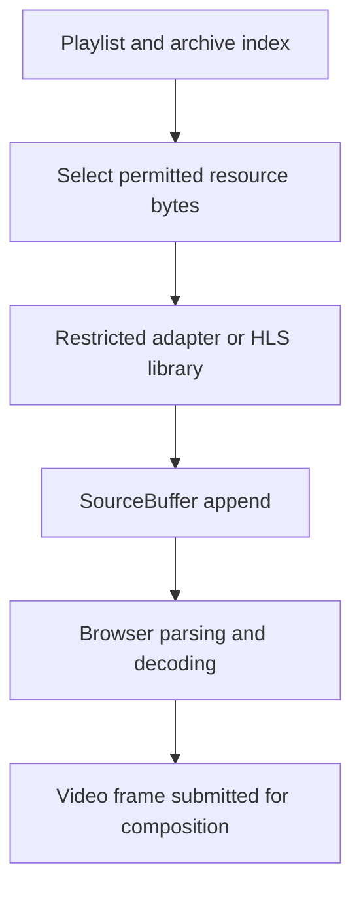
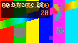

# Streaming an Archive Through the Browser: HLS, Fragmented MP4 and MSE

An archive index can identify the right recording without making that recording playable in a browser. Delivery still has to provide codec initialization, describe segment timing, fetch the permitted bytes and assemble a valid media timeline. Each step has its own failure conditions. A successful HTTP response does not imply a successful append, and a successful append does not prove that the requested frame was presented.

This chapter follows the actual fragments generated in Chapter 5 through a small browser experiment. We construct a playlist with a declared recording gap, fetch its resources, append them through Media Source Extensions, observe frames on both sides of the gap and release the media resources. The experiment exposes each boundary directly rather than treating a playback library as an unexplained operation.

Series: [[PROJ - Engineering Temporal Systems - Textbook Series]]. Prerequisite: [[ARTICLE - Engineering Temporal Systems - 05 - Indexing Historical Video]]. Executable companions are [media-browser.html](_assets/temporal-systems/media-browser.html) and [run-media-browser.cjs](_assets/temporal-systems/run-media-browser.cjs), with [observed events and box metadata](_assets/temporal-systems/outputs/media-browser.json). This is a deliberately restricted fixture adapter, not a general HLS implementation or production authorization service.

## 1. Identify the bytes the browser will parse

Fragmented MP4 separates relatively stable initialization information from successive groups of media samples. The initialization describes the tracks, sample entries and codec configuration. Fragments describe and carry encoded samples, including information required to locate and time them.

The retained fixture contains these actual top-level boxes:

```text
init.mp4
  ftyp
  moov

fragment-00.m4s, fragment-01.m4s, fragment-02.m4s
  styp
  sidx
  moof
  mdat
```

A box begins with its size and type. Some boxes use an extended 64-bit size; a zero size extends to the end of the containing byte range. Parsing therefore requires more than advancing by a presumed fixed header length. The educational walker checks header availability, safe integer sizes, minimum box size and containment before advancing. It rejects malformed four-byte boxes and boxes whose declared lengths extend past the input.

The walker recurses into selected structural containers, including `moov`, `trak`, `mdia`, `moof` and `traf`. It records offsets relative to the current container. It does not parse every sample-description field or certify a codec bitstream. Its limits are four MiB per input, depth eight and at most 512 boxes per parsed container; those are explicitly scoped parser limits, not a complete MP4 validation policy.

Within the movie metadata, a video sample entry describes the codec configuration. Within a movie fragment, track-fragment metadata describes the samples. In this family of files, `tfdt` provides fragment decode timing and `trun` provides sample-run information, potentially including sample sizes, durations and composition offsets. Defaults can live elsewhere in the initialization or fragment metadata, so treating every sample record as a fixed standalone structure would be incorrect.

The W3C ISO BMFF byte-stream format note defines initialization as `ftyp` followed by `moov`, and media segments in terms of optional `styp`, `moof` and one or more `mdat` boxes. It permits other valid boxes, such as `sidx`, between segments. The observed `sidx` is therefore not a reason to discard this fixture as malformed.

### 1.1 Initialization is not a decoded frame

The first append in the browser experiment contains 812 initialization bytes. It produces an `updateend` event but no buffered media range. That is expected: the browser has learned how subsequent media should be interpreted, but no picture-bearing fragment has yet been appended.

The sample entry's AVC configuration yields codec string `avc1.64000a` for this fixture. The harness asks `MediaSource.isTypeSupported` about the corresponding `video/mp4` MIME type before creating a SourceBuffer. This checks advertised support, not whether arbitrary forthcoming bytes are valid. Actual append and decode checks are still required.

The fixture adapter locates the known initialization's AVC configuration marker to extract that string. A production parser should follow the sample-entry structure rather than search arbitrary untrusted bytes for a marker. The bounded box walker is diagnostic and does not turn that fixture-specific extraction into a general codec parser.

## 2. Describe a presentation with HLS

An HLS media playlist describes an ordered presentation through tags and resource references. It is not the compressed video itself. For fragmented MP4, `EXT-X-MAP` identifies the initialization section needed by following media segments. `EXTINF` states each segment's duration, while `EXT-X-TARGETDURATION` constrains the segment durations according to HLS rules. A VOD playlist is fixed, and `EXT-X-ENDLIST` indicates that no more media segments will be added.

The [executed playlist](_assets/temporal-systems/outputs/delivery.m3u8) includes this structure:

```m3u8
#EXTM3U
#EXT-X-VERSION:7
#EXT-X-TARGETDURATION:2
#EXT-X-PLAYLIST-TYPE:VOD
#EXT-X-MAP:URI="init.mp4"
#EXT-X-PROGRAM-DATE-TIME:2026-09-09T00:00:00.000Z
#EXTINF:2.000,
fragment-00.m4s
#EXT-X-DISCONTINUITY
#EXT-X-PROGRAM-DATE-TIME:2026-09-09T00:00:04.000Z
#EXTINF:2.000,
fragment-01.m4s
#EXT-X-PROGRAM-DATE-TIME:2026-09-09T00:00:06.000Z
#EXTINF:2.000,
fragment-02.m4s
#EXT-X-ENDLIST
```

RFC 8216 specifies that program-date-time associates an absolute date/time with the first sample of the next media segment. It is not a file creation timestamp. Its meaning must agree with the archive's timing provenance. The experiment supplies one explicit PDT for every fragment, avoiding the need to implement extrapolation rules in its restricted parser.

The source fragments contain six seconds of encoded video. Their declared archive coverage is `[0,2)`, `[4,6)` and `[6,8)` seconds relative to the first PDT. This is a synthetic recording gap in the teaching presentation, not a claim that the original test-pattern generator experienced a camera outage.

### 2.1 A discontinuity does not synthesize missing media

RFC 8216 requires a discontinuity indication for certain changes, including timestamp sequence and track characteristics, and recommends it for changes such as encoding parameters. The tag identifies a boundary; it does not supply the bytes missing from an interval, repair invalid dependencies or guarantee seamless codec switching.

Likewise, an independent-segments claim requires media that satisfies the claim. The generated closed-GOP fragments were independently decoded in Chapter 5, but the example playlist does not need to assert a universal property about arbitrary archived segments. An intra-coded sample or a filename ending in `.m4s` is not sufficient proof of independent decodability.

A client may choose a local media timeline that differs from archive UTC elapsed time. The sum of our `EXTINF` durations is six seconds, while the deliberately constructed MSE timeline spans eight seconds with a two-second hole. The next section explains the adapter's explicit policy. Do not infer that every HLS client will create the same local hole merely because these PDT values appear in its playlist.

## 3. Assemble a browser media timeline with MSE

Media Source Extensions lets application code provide encoded media bytes to a media element. A `MediaSource` manages the media presentation, a `SourceBuffer` accepts a supported byte-stream format, and the video element exposes playback controls and frame-related observations. The browser remains responsible for decoding and its media pipeline.



The harness creates an object URL for a MediaSource, attaches it to a video element, waits for `sourceopen` and adds one video SourceBuffer. It then appends initialization followed by the three media fragments. Only one append or removal is in flight at a time.

The critical sequence is:

```javascript
const completed = once(sourceBuffer, 'updateend');
sourceBuffer.appendBuffer(bytes);
await completed;
```

The listener must exist before the operation can complete. The actual helper also rejects error events and enforces a finite timeout. MDN documents both synchronous append failures, such as `InvalidStateError` while `updating` is true or `QuotaExceededError`, and asynchronous failures reported after the method returns. An application must handle both paths.

`updateend` means the update operation ended; it is not a frame-presentation event. In the successful trace, initialization and each fragment receive a corresponding `updateend`. Error handling remains a separate condition rather than assuming every ended update succeeded.

### 3.1 Timestamp offsets express an explicit mapping policy

For each segment, let $P_i$ be its declared PDT, $P_0$ the initial PDT, and $m_i$ its original first presentation timestamp in seconds. The restricted adapter chooses

$$
\operatorname{offset}_i=(P_i-P_0)-m_i,
$$

with all differences expressed in seconds. Appended sample timestamp $m$ then occupies local MSE time

$$
m'=m+\operatorname{offset}_i.
$$

The first fragment starts at original media time zero and declared offset zero, so its timestamp offset is zero. The second starts at original media time two but declared offset four, giving an offset of two. The third starts at original media time four and declared offset six, again giving two. The actual buffered ranges confirm this mapping.

Offsets must be changed while no incompatible SourceBuffer update is in progress. They move timestamps; they do not transcode media, create absent frames or repair references to pictures that were never supplied. When an archive resets timestamps or changes configuration, the delivery layer needs a valid mapping and a decoding strategy for that boundary, not merely a numeric offset.

### 3.2 What a playback library normally handles

The installed hls.js version is 1.7.1. Its README describes an HLS client built on HTML video and MSE, with support for fMP4 and transmuxing of formats such as MPEG-2 TS into MP4 fragments. Transmuxing changes the container representation without necessarily decoding and re-encoding the compressed pictures.

A general HLS client handles far more than this experiment: playlist parsing, segment scheduling, supported format processing and buffering policy, potentially with adaptation and encryption support. The product delegates HLS playback work to hls.js while retaining application-specific session, grant, UTC mapping and presentation eligibility responsibilities.

This experiment uses no hls.js instance. Its `fetched`, `append` and `frame` records are harness observations, not invented library events. It supports exactly three known fragments, one initialization map and one PDT per fragment; it does not implement general HLS parsing, variant selection, live updates or DRM. That restriction makes the measured MSE behavior easier to inspect without misrepresenting the adapter as production-ready.

## 4. Bound fetched bytes and buffered media separately

The bytes returned by `fetch`, encoded data accepted by MSE, decoded frames and GPU resources occupy different lifetimes. Their sizes are not interchangeable. A SourceBuffer's buffered time intervals do not report its total memory consumption.

The server in this experiment serves only an exact whitelist of known local resources on an ephemeral loopback port. The media assets were bounded during generation. The browser helper also rejects a fetched body larger than four MiB, but it performs that check after `arrayBuffer()` completes. That is a post-fetch check, not a streaming pre-allocation bound. A production client should combine grant validation, response-length checks, streaming limits and cancellation where needed.

A production append queue also needs admission. If network requests continue finishing while MSE is busy or quota-limited, holding every resulting ArrayBuffer can exhaust application memory even when append calls are correctly serialized. Bound both queued objects and queued bytes; release or transfer ownership after the downstream operation no longer needs the resource.

Cancellation can stop unnecessary fetches, but a late response still needs generation and authority checks before entering the append queue. Aborting a SourceBuffer operation is not equivalent to retracting every sample already appended, nor to revoking permission to display a previously decoded frame. Chapter 8 makes that presentation distinction explicit.

### 4.1 Eviction requires an interval policy

A media buffer usually retains some history behind the cursor and some data ahead. The policy should name the current position, back-buffer allowance, forward-buffer goal and protected decode interval. Removing bytes needed by an active seek can cause rebuffering or prevent the next frame from decoding.

The browser experiment waits until it has observed the post-gap frame at media time 4.8, then removes `[0,2)`. It waits for the removal's `updateend` and records that only `[4,8)` remains. This demonstrates one safe operation on the fixture, not a universal eviction algorithm for arbitrary GOP dependencies or audio/video combinations.

`QuotaExceededError` requires a bounded response: evict according to policy and retry an eligible operation, reduce admission, or fail visibly. Repeatedly retrying without changing ownership can make no progress. This small experiment does not deliberately exhaust browser quota and therefore supplies no measured quota threshold.

### 4.2 Codec transitions are not universally seamless

Supported MIME types and codec profiles depend on the browser and platform. New initialization information, track changes or different codec parameters may require additional validation, an appropriate type transition or a new MediaSource/player lifetime. The existence of `changeType` on some implementations is not proof that every transition preserves seamless playback.

The executed case uses one supported H.264 configuration and does not test codec switching. Native HLS is also not qualified by this MSE run. When an application's supported path is MSE plus a specific codec, failure of that capability check should be reported rather than silently treating an unverified native fallback as equivalent.

## 5. Decide whether stored compressed video can be reused

Remuxing copies encoded media into a different container structure while preserving its compressed picture content. Transcoding decodes and re-encodes, potentially changing the codec, resolution, bitrate or prediction structure. These operations have different costs and capabilities.

| Source condition | Possible strategy | Required qualification |
|---|---|---|
| Supported codec with suitable access points | Remux or reuse existing fragments | Verify timestamps, initialization, dependencies and output container compatibility |
| Supported codec but awkward recording boundaries | Include earlier dependencies or prepare new boundaries | Stream copy cannot invent independently decodable pictures |
| Unsupported codec/profile | Transcode or reject that playback path | Re-encoding cost and resulting support must be tested |
| Configuration or timestamp discontinuity | Explicit boundary and new mapping/configuration as required | A tag or timestamp offset alone does not fix invalid media |

A command using `-c copy` requests stream copy; it does not prove that every source recording can become independently seekable two-second fragments. Segment boundaries depend on available access points. Generating new keyframes at arbitrary target positions requires encoding or another dependency-aware strategy.

Chapter 5's fixtures were transcoded from a synthetic source into H.264 because the experiment needed controlled GOPs and a reordered comparison. Chapter 6 reuses those compressed files without re-encoding. The generator's CPU cost is not the browser's decode cost, and neither is measured by network transfer length alone. No remux performance comparison is claimed here.

## 6. Inspect the executed delivery trace

Run the harness from a checkout containing the published fixtures, supplying the installed Playwright module path:

```sh
node run-media-browser.cjs /absolute/path/to/web-ui/node_modules/playwright
```

It creates a separate headless browser and an ephemeral loopback server, never attaches to user tabs, and closes both in `finally`. The executed browser was Chromium 151.0.7922.34. Resource fetch records contain lengths and SHA-256 hashes so observed inputs can be matched to the archive assets.

| Resource | Observed body bytes | Role |
|---|---:|---|
| `presentation.m3u8` | 379 | Restricted HLS presentation description |
| `init.mp4` | 812 | Track and codec initialization |
| `fragment-00.m4s` | 18,940 | First two seconds |
| `fragment-01.m4s` | 21,450 | Media placed at local `[4,6)` |
| `fragment-02.m4s` | 20,452 | Media placed at local `[6,8)` |

The sequence was observed, not inferred from a screenshot:

1. Initialization append completed with no buffered range.
2. First-fragment append completed with `[0,2)` buffered.
3. Second-fragment append at offset two produced `[0,2)` and `[4,6)`.
4. Third-fragment append extended the latter interval to `[4,8)`.
5. A seek to 0.8 completed, followed by a frame callback with `mediaTime=0.8`.
6. The application rejected target three because it lay in the declared unbuffered interval.
7. A seek to 4.8 completed, followed by a frame callback with `mediaTime=4.8`.
8. Removing `[0,2)` left `[4,8)`; the source was ended and then detached.
9. Cleanup observed zero video elements, a closed MediaSource and zero SourceBuffers.

The gap result is an application decision made from the inspected coverage. The harness did not assign `currentTime=3` and then claim a browser-specific gap-seek outcome. It verified playback on both sides while refusing to invent coverage between them.



*Actual post-gap browser frame copied to a canvas after the frame callback. Source frame 28 occupies media time 4.8 under this delivery mapping. The image and callback demonstrate this browser path, not physical capture synchronization or a hardware display timing guarantee.*

The box walker rejected two malformed-size inputs, and the browser completed without page errors. The existing 21-test Python suite covers the shared models and source-media index; the separate browser harness supplies delivery evidence that those Python tests cannot establish. Its trace, playlist and PNG are retained with the chapter.

## 7. Delivery establishes inputs, not final eligibility

A valid delivery path makes the selected encoded media available to the browser under an explicit timeline mapping. It does not decide whether a frame belongs to the latest user intent or current authorization lifetime. It also does not synchronize several independently buffered players merely by appending their bytes.

- HLS describes resources and timing; MSE accepts supported encoded media bytes. They are different interfaces.
- Initialization, append completion, buffered intervals and frame callbacks provide different evidence.
- Timestamp offsets express mappings but cannot create coverage or decode dependencies.
- Fetched-byte and buffered-media ownership need separate bounds and cancellation policies.
- The observed Chromium result qualifies this fixture and path, not every codec, browser or native-HLS fallback.

Chapter 7 applies the shared clock foundation to historical sessions. Chapter 8 then asks when a decoded frame is still eligible to become visible as intent, authorization and visibility change.

### References and provenance

Product source pin: `ee51ca7b3091d96f9428199412038c1285099085`. The experiment is separate from `web-ui/lab/playback.ts`, `src/playback/loader.ts` and `HistoricalPlayer.tsx`; it does not alter the application or its persistent lab server.

Read sources: [RFC 8216 §§4.3.2.3, 4.3.2.5 and 4.3.2.6](https://www.rfc-editor.org/rfc/rfc8216.html); the [W3C ISO BMFF byte-stream format Group Note](https://www.w3.org/TR/2024/NOTE-mse-byte-stream-format-isobmff-20240723/); [MDN SourceBuffer.appendBuffer](https://developer.mozilla.org/en-US/docs/Web/API/SourceBuffer/appendBuffer); and the installed hls.js 1.7.1 README introduction/features. The executed MSE trace supplies the specific offset, range, seek, eviction and cleanup observations. Codec-transition and quota limitations are stated rather than presented as unperformed tests.
