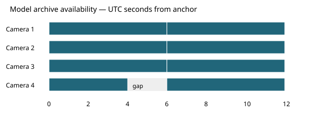
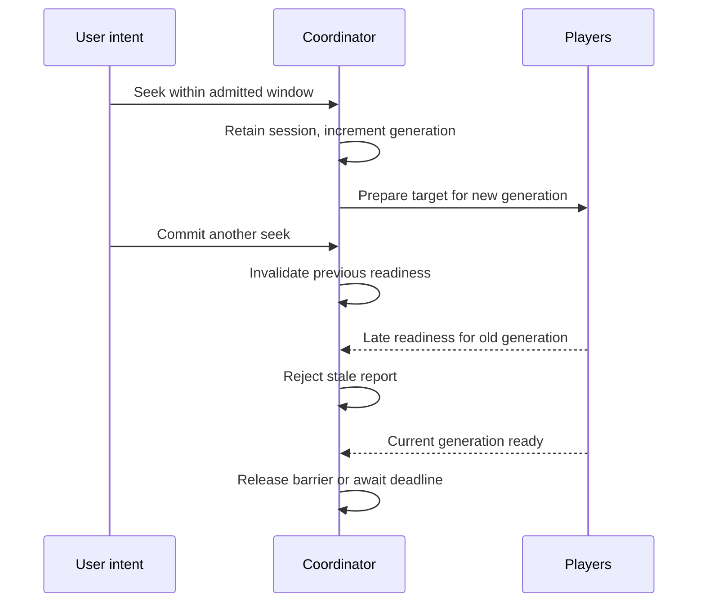

# Coordinating Historical Playback: Clock Mapping and Synchronization Control

A historical investigation begins with a common question: what did several cameras record around the same UTC instant? The answers can arrive at different times and may have different coverage. One camera can lack the requested interval while the others have it; a slow player can become ready after the group has already started. Coordination must preserve the common question without pretending those differences do not exist.

This chapter applies the clock foundation to archive sessions and committed seeks. We will reuse a session for an admitted in-window target, replace it for an outside-window target, reject readiness from superseded seeks and continue through a gap in one camera. The worked example is a distinct four-camera historical scenario, not a second derivation of generic feedback theory.

Series: [[PROJ - Engineering Temporal Systems - Textbook Series]]. Foundations: [[ARTICLE - Engineering Temporal Systems - 02 - Temporal Coordination]], [[ARTICLE - Engineering Temporal Systems - 05 - Indexing Historical Video]] and [[ARTICLE - Engineering Temporal Systems - 06 - HLS fMP4 and MSE]]. The executable [historical coordinator](_assets/temporal-systems/historical.py), [tests](_assets/temporal-systems/tests/test_historical.py) and [retained trace](_assets/temporal-systems/outputs/historical-demo.json) are educational models, not a new browser or camera measurement.

## 1. Express the investigation as an admitted interval

The user's intent contains a camera set, desired UTC, selected view and playback rate. A session then admits a bounded interval and the resources needed to investigate it. These are not the same object: a target is one instant, while the session interval defines where a subsequent seek may reuse the current admission.

The model opens four cameras at UTC anchor `1788912000000000` and admits a twelve-second window. Its sample-aware indexes describe more archive time than that window, but the current session does not thereby authorize every indexed resource. The coordinator checks the current session interval separately from archive availability.

| Constraint | Shared or camera-specific? | Example |
|---|---|---|
| User target UTC | Shared | Anchor plus 6.7 seconds |
| Session window | Shared admission in this model | `[anchor, anchor+12 s)` |
| Recording availability | Camera-specific | Camera 4 lacks `[anchor+4 s, anchor+6 s)` |
| Media epoch and position | Camera-specific | The same UTC maps into each camera's current segment epoch |
| Buffer/readiness delay | Camera-specific | Camera 2 initially takes 2.6 seconds |
| Playback control intent | Shared | Paused or running at the selected rate |

Choosing camera 1's media element as the master would make every other camera depend on camera 1's stalls and missing data. Instead, use an independent application clock. A camera follows the common timeline when it can; it does not define that timeline merely because its data happened to arrive first.

The model's admitted window is twelve seconds for readability. The product derives its own bounded playback interval through `playbackIntent`; the teaching duration is not a change to the production session contract.

## 2. Establish the time mapping before measuring drift

A local media timestamp needs an identified epoch. For a presentation tick $q$, timescale $f$, UTC anchor $u_0$ and corresponding tick $q_0$,

$$
u(q)=u_0+\operatorname{round}\left((q-q_0)\frac{10^6}{f}\right).
$$

A reset can give two different epochs the same local tick values while UTC continues forward. The epoch identity and presentation interval disambiguate them. A gap returns unavailable coverage, not a guessed interpolation between the previous and next recordings.

The model reuses `ArchiveIndex` from Chapter 5. Its generated index records are model identifiers and declared lengths, not actual byte metadata from the FFmpeg experiment. Each interval begins with an admitted independent sample and exposes ten sample opportunities per second. UTC target resolution uses the existing first-at-or-after sample policy, introducing up to one sample period of selection displacement for a covered target with a following sample.



*Availability generated from the model indexes for the first twelve UTC seconds. Camera 4 has an explicit gap; the white boundary at six seconds separates model epochs. This is not a recording-availability measurement from real cameras.*

### 2.1 Bind only resources admitted by the current session

In the product, `MediaTimeMap.bind` checks a fragment's resource identity, program-date-time and presentation bounds against the admitted index. It rejects ambiguous local overlaps and lets indexed gaps override candidate mappings. A fragment from another session or view cannot become valid merely because its timestamp looks plausible.

The model has no HTTP grants. It represents admission with session identity and a half-open window, and marks media state unavailable when the target is outside coverage. It also stops master progression at the admitted window boundary rather than silently treating the next indexed interval as authorized. A real implementation additionally needs expiry, origin, byte-range and authorization checks before loading bytes.

Timestamp mapping and capture accuracy remain separate. A perfectly mapped UTC label can still inherit clock error from the recorder or uncertainty about exposure time. Preserve that basis and uncertainty when available; do not translate microsecond integer precision into a claim of microsecond physical synchronization.

## 3. Treat a committed seek as a new generation of evidence

During ordinary playback, let $U_0$ be anchor UTC, $p_0$ monotonic milliseconds and $r$ rate. The independent master is

$$
U(p)=U_0+\operatorname{round}\bigl(1000r(p-p_0)\bigr).
$$

Pause and rate changes first evaluate the old clock at the transition time, then reanchor there. A committed user seek intentionally installs a new UTC target. Chapter 2 derives these continuity rules; here they determine when sessions and readiness may be reused.

An in-window seek retains the admitted session but creates a new seek generation. It pauses the master, resets per-player correction history, invalidates readiness from the previous generation and requests the new target. An outside-window seek releases the old session and opens a new one before using new resources.

The product implements this distinction in `PlaybackPanel.commitSeek`: compare the target with `requested_start_us` and `requested_end_us`, begin a new barrier inside the window, and reopen outside it. A clock-driven cursor update is not a committed user seek; treating every moving cursor update as a seek would repeatedly interrupt playback.



### 3.1 Session, seek and per-player preparation identities differ

A session can survive several user seeks. A seek generation can include several per-player preparations, for example when one player needs a corrective seek while the others continue. The model therefore checks session identity, seek generation and a per-player preparation version on every delayed readiness or observation callback.

This is not redundant bookkeeping. A callback can be stale while its session is still current, or stale for one player's replacement operation while the group seek remains current. The checks reject results according to the lifetime that actually changed.

On close, the model clears the session, advances the generation, advances every player version and conceals/clears all player states. Already scheduled callbacks may still execute, but cannot restore media state. Chapter 8 will turn that principle into a presentation and resource-lifetime state machine with explicit authorization races.

## 4. Release group waiting without claiming every player is ready

The model starts a two-second barrier with all four camera identities. Initial preparation delays are 40, 2,600, 200 and 100 milliseconds. At the deadline, cameras 1, 3 and 4 are ready; camera 2 is still pending.

At simulation time 2,000 milliseconds the barrier releases with reason `deadline`, ready members `[1,3,4]` and missing member `[2]`. The master begins advancing. At time 2,500 it is at UTC offset 0.5 seconds; the three ready cameras are also at 0.5, while camera 2 remains covered and pending. A deadline limits group waiting. It does not make the absent frame ready.

Camera 2 becomes ready at 2,600 milliseconds, after the master has advanced. Its old requested position is behind the current target, so subsequent correction is needed. The barrier remains released; one late member does not force all already progressing members to restart.

The scenario also commits seeks at 6,500 and 6,550 milliseconds. Both are inside the original session window, but the latter invalidates readiness and observations belonging to the former. The new barrier is generation three; it releases all-ready at 6,800 milliseconds. A test verifies stale callbacks are rejected rather than accidentally satisfying the new barrier.

The model polls barriers on a 100-millisecond schedule. Its observed release time can therefore be later than the last readiness callback by less than a polling period. This is part of the discrete model, not a precision guarantee for browser timers.

## 5. Correct drift using observations from the right instant

Define drift as mapped player UTC minus master UTC. Positive drift means the player is ahead. Before applying a correction, establish when the player observation was made.

Observations in this simulation are continuous modeled playback positions, not outputs from a video decoder. The index supplies discrete target selection, but rate progression can produce intermediate positions such as 3.935 seconds. The model's `visible` flag is therefore a coordination-policy state, not proof that a frame with that exact timestamp exists or reached a compositor. Chapter 6 supplies real browser-frame evidence; Chapter 8 separates presentation eligibility explicitly.

Camera 3's reports are delayed by 200 milliseconds during part of the scenario. Each delayed report retains the player UTC and master UTC sampled at the same observation instant. The controller therefore computes

$$
e=\frac{u_{observed}-U_{at\ observation}}{1000}
\quad\text{milliseconds},
$$

not the old observation minus the master at callback arrival. Comparing an old frame to a newer master would introduce an apparent lag even if both were aligned when observed.

This removes one measurement error; it does not remove feedback delay. The action is still applied later. The model uses the shared controller on arrival and does not claim a stability proof for arbitrary delays. Old-generation or old-preparation observations are rejected before reaching that controller.

| Policy quantity | Inspected product example | Historical model |
|---|---|---|
| Small-error deadband | At most 50 ms | Reuses the shared threshold |
| Rate-correction range | Above 50 through 200 ms | 0.95×/1.05× at master rate 1× |
| Sustained large error | Above 200 ms for 500 ms | Reuses the shared timer |
| Group deadline | Two seconds | Two seconds, polled at 100 ms |
| Reveal tolerance | 150 ms admission gate | Continuously checked visibility predicate |
| Observation delay | Browser-dependent | Selected 200 ms camera-3 report delay |

The last two rows are important differences. The product's reveal tolerance is not a continuously enforced synchronization invariant, while this educational model reevaluates its visibility predicate each tick. The model's selected delay is not a measured browser latency.

### 5.1 Let one camera have a gap without stopping the master

At simulation time six seconds, the master reaches UTC offset four seconds. Camera 4's recording gap begins, so its mapped UTC becomes unknown and its frame is concealed. Cameras 1 and 3 remain at offset four; camera 2 is at 3.935 and correcting at 1.05×.

The missing interval is a camera-specific constraint, not a reason to stop all streams. A coordinator can locate the next admitted coverage from the index and prepare it when the target becomes covered, or respond to a user seek that moves beyond the gap. This model polls target coverage on each tick; the committed seek to 6.7 seconds moves camera 4 into its next epoch explicitly.

At simulation time seven seconds, all four cameras report UTC offset 6.9 in their epoch-one intervals. The trace preserves the preceding gap rather than replacing it with an apparently continuous camera-4 history.

### 5.2 Recovery must be allowed to make progress

Chapter 2 demonstrated a controller that repeatedly seeks a paused player to a moving target. With 120 milliseconds to apply the seek and another 200 to decode, every paused attempt produces a frame 320 milliseconds behind. The next attempt repeats the same delay.

The historical example reuses that exact function and adds camera/session identities plus requested and observed UTC to its output. Its paused policy yields five `covered-retry` states. Allowing progression behind cover after seek application produces a first frame only 120 milliseconds behind, and the selected 150-millisecond gate admits it.

This is not an extra independently implemented controller or a second measurement. It is the same controlled delay model expressed in archive coordinates. It explains why concealing old imagery need not mean pausing all decoding/progression. Different application delay, decoding capacity or observation delay can still prevent convergence.

The product's historical-player recovery fix addressed this class of moving-target failure. Retained browser evidence supports the implemented fix within its synthetic lab scope; the new simulation does not convert that evidence into a universal browser or camera timing guarantee.

## 6. Read the full historical scenario

Run from the companion directory:

```sh
PYTHONDONTWRITEBYTECODE=1 python3 -m unittest discover -s tests -v
python3 historical.py
```

The scenario reuses `MasterClock`, `DriftController` and `Barrier` from `clocks.py`, `EventClock` from `scheduler.py`, and `ArchiveIndex` from `archive_index.py`. It does not duplicate those mathematical foundations. New code specifies historical admission and event orchestration.

| Simulation time | Executed event | Result |
|---|---|---|
| 0 ms | Open at UTC anchor | Session 1 admits offsets `[0,12)` |
| 2,000 ms | Initial deadline | Three ready cameras proceed; camera 2 remains covered |
| 2,600 ms | Camera 2 ready | Joins after group release, then needs correction |
| 6,000 ms | Master reaches offset 4 | Camera 4 enters its gap; others continue |
| 6,500 / 6,550 ms | Two in-window seeks | Session reused twice; old reports rejected |
| 6,800 ms | Generation-three barrier | All four ready |
| 7,600 ms | Pause | UTC offset 7.5 retained |
| 8,000 ms | Resume at 2× | Same UTC anchor, then faster progression |
| 9,000 ms | Seek to offset 20 | Release session 1, open session 2 for `[20,32)` |
| 9,200 ms | New barrier releases | All four proceed under session 2 |
| 12,000 ms | Close | Clear media state and release final session |

The retained counters show two created sessions, two releases, two in-window reuses, sixteen rejected stale reports, one hard drift-correction seek and one deadline release. The stale counter includes invalidated readiness/observation callbacks, not sixteen transport failures. Counts are model outcomes with deterministic event ordering.

At time 10.5 seconds, all four cameras report UTC offset 22.6 at rate 2× under session 2. At the end, all player UTC values are cleared, none is visible or pending, and the event queue is empty. Cleanup does not rely on waiting an arbitrary real-time interval: the injected event clock executes through the defined scenario end.

The shared suite contains 24 tests. Historical-specific checks cover session-window reuse and half-open reopening, late readiness after a newer seek, readiness after deadline, camera-specific gap/epoch recovery, rate bounds, observation-time pairing, pause/rate continuity and terminal cleanup. The index resources are fictional model assets; their declared lengths are not actual FFmpeg file evidence.

## 7. What the result does and does not establish

Historical coordination combines an admitted resource lifetime with an independent clock and per-camera availability. The common target stays well defined even when one camera has no recording or has not yet produced a usable frame. Generations prevent prior intent from satisfying current readiness; observation timestamps prevent callback delay from being misreported as contemporaneous drift.

The model still has finite-resolution steps, selected delays and simplified decoding. It assumes indexed media can become available according to those schedules. It does not simulate network grants, physical camera clock synchronization, audio/video interleave or GPU presentation. Its trace cap is 512 entries and its event queue inherits the bounded shared implementation; those are educational bounds, not process-memory measurements.

Even when all four labels match, physical capture may differ by the recorders' clock and acquisition uncertainty. Even when a frame callback matches the target, physical display timing is not measured. The retained lab campaign's nineteen session renewals and zero sessions at close are separate browser/server observations, not outputs of this thirteen-second simulation.

The next chapter completes the distinction between owning bytes and being permitted to show their frames. It will test what happens when a seek completes after closure or authorization changes while decoded material remains buffered.

### Source and reference notes

Source pin: `ee51ca7b3091d96f9428199412038c1285099085`. Re-read `PlaybackPanel.tsx` for in-window reuse, outside-window reopening, identity-preserving renewal and barrier release. Shared source policies are in `time-map.ts`, `barrier.ts` and `HistoricalPlayer.tsx`; commit `4c96bff` includes the recovery correction. The original [[ARTICLE - Video Observatory - Synchronizing Four Video Players Against One UTC Clock]] documents the implementation and retained evidence in more detail.

Clock semantics, HLS PDT and callback evidence reuse the verified readings documented in Chapters 2 and 6: W3C High Resolution Time §§2.1–2.2, RFC 8216 program-date-time/discontinuity sections and the WICG/MDN frame-callback descriptions. This chapter applies those semantics; it does not claim new physical-clock or browser-performance qualification.
