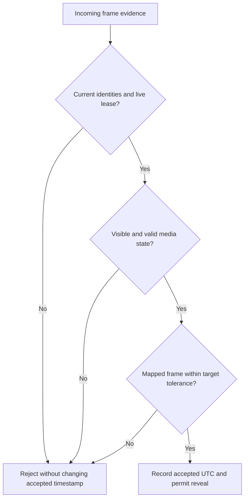
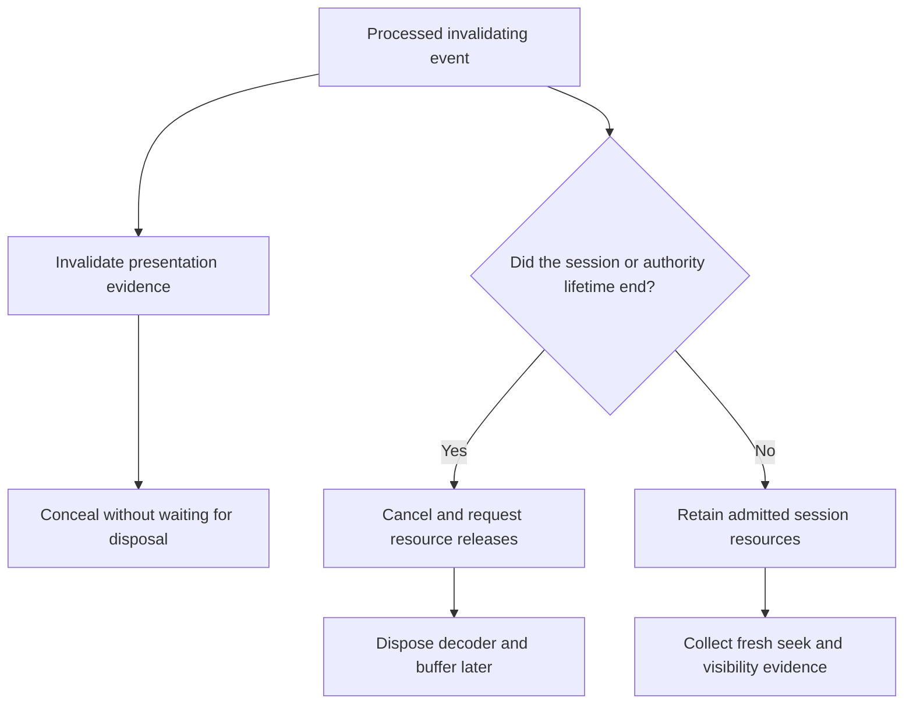
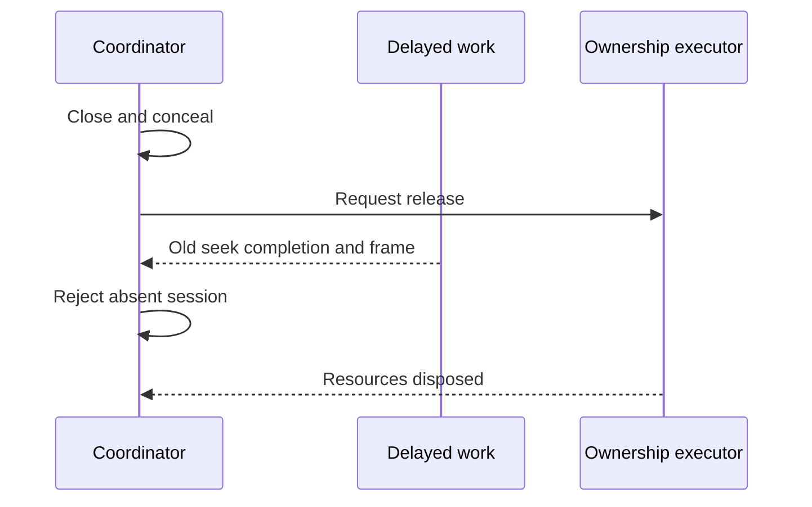

# When Is a Frame Safe to Show? Playback State Machines and Resource Lifetimes

A successful download does not establish permission to display its contents forever. Between requesting historical media and receiving a frame callback, the user can seek elsewhere, close the session, switch views or lose authorization. Correct playback therefore requires two separate answers: who still owns each resource, and which evidence may currently justify exposing a frame?

We will specify that distinction as an executable state machine. Its tests deliberately retain a buffer after revocation and deliver callbacks after closure. The intended property is not that cancellation prevents every callback. It is that obsolete callbacks cannot restore eligibility, even while cleanup is unfinished.

Series: [[PROJ - Engineering Temporal Systems - Textbook Series]]. Earlier chapters establish [[ARTICLE - Engineering Temporal Systems - 04 - Bounded Asynchronous Systems|ownership]], [[ARTICLE - Engineering Temporal Systems - 05 - Indexing Historical Video|indexing]], [[ARTICLE - Engineering Temporal Systems - 06 - HLS fMP4 and MSE|browser delivery]] and [[ARTICLE - Engineering Temporal Systems - 07 - Coordinating Historical Playback|historical coordination]]. This chapter closes the sequence with presentation correctness. The [pure transition model](_assets/temporal-systems/presentation.py), [race tests](_assets/temporal-systems/tests/test_presentation.py) and [executed traces](_assets/temporal-systems/outputs/presentation-demo.json) are educational policy artifacts, not a decoder implementation or a browser security certification.

## 1. Identify the evidence before naming a frame ready

A requested position describes intent. A fetched response supplies bytes. A buffered interval describes data admitted to a media timeline. Decoding produces pictures from compressed data and reference dependencies. Submission to a compositor is another event, and physical display is outside the direct observation supplied by the browser APIs used here.

| Observation | What it contributes | What it does not establish |
|---|---|---|
| Assign `currentTime` | Requests a position on the media timeline | A corresponding frame has already appeared |
| Read `currentTime` | Reads a playback-position value | Identity of the last submitted picture |
| Receive `seeked` | Seek completed; `seeking` became false | Physical display or current authorization |
| `readyState >= 2` | Current-position data is available | Sustained future playback or a frame's authority |
| Receive a video frame callback | Media timestamp and compositor-submission-related metadata | A physical exposure or photon timestamp |
| Receive a successful HTTP response | Bytes arrived under that request's conditions | Continued authority after the response |

MDN describes `requestVideoFrameCallback` as running when a new frame is sent to the compositor. Its `mediaTime` identifies a presentation timestamp on the media timeline; `presentationTime` describes submission for composition; `expectedDisplayTime` is an expectation. Callbacks and composition can execute on different threads, and callbacks can arrive late. The API does not provide a synchronous interception point that can retract pixels already physically displayed.

Consequently, concealment must begin when intent or authority becomes invalid, not only when the next callback reveals the problem. Frame metadata helps decide when to remove an existing cover. It is not a substitute for keeping the cover in place during an unresolved seek.

The Chapter 6 browser experiment recorded real callbacks at media times 0.8 and 4.8 seconds and verified removal of an earlier buffered range. Those observations support its narrow delivery example. They do not prove the revocation properties of the new Python machine.

## 2. Keep identity dimensions separate

The model uses an immutable token with six fields:

```python
Token(session, lifetime, authority, generation, visibility, media)
```

The session names an admitted lease. The lifetime distinguishes replacements, including a hypothetical reused session name. Authority identifies the permission context. Generation identifies a committed seek. Visibility identifies the period in which fresh presentation evidence is being collected. Media identifies the camera/epoch being interpreted.

Two callbacks can carry equal media timestamps but belong to different seek generations. Two session objects can have the same textual identifier but different modeled lifetimes. Comparing the timestamp or session name alone cannot resolve either case.

The state stores `target` and `accepted` separately. `target` is desired UTC in integer microseconds. `accepted` is the last frame UTC admitted by the policy, or unknown. A seek changes the target and clears accepted evidence; it never relabels a previous frame with the new target.

### 2.1 Derive eligibility as a conjunction

For an incoming callback, require all of the following:

- Its token equals the current session, lifetime, authority, seek, visibility and media identities.
- A live session exists, and monotonic model time is strictly before its deadline.
- The element and document are considered visible by the policy.
- The modeled buffer is ready, seek completion has been observed, and the event reports readiness with no seek in progress.
- The media timestamp has a valid mapping; the machine is not in a gap, unmapped or hidden phase.
- The evidence kind is a frame callback, rather than a `currentTime` reading or `seeked` event alone.
- Its mapped UTC is sufficiently close to the target.

With mapped frame UTC $u_f$, target $U$ and tolerance $\epsilon$, the last condition is

$$
|u_f-U|\leq\epsilon,
\qquad\epsilon=150000\text{ microseconds}.
$$

The tolerance is a selected example policy inherited from the project's reveal gate. It is not a physical synchronization accuracy claim. A test rejects offset 150,001 microseconds and admits offset 150,000, making the boundary explicit.



This predicate controls admission. It is not an assertion that every future image stays within tolerance. The product uses a reveal gate followed by correction, and the model keeps a fixed target between explicit seeks. A rejected stale callback does not itself revoke previously valid evidence; an actual authority, seek or visibility transition does.

## 3. Make invalidation an explicit transition

The pure function `transition(state, event, now)` returns a new immutable state and resource effects. It does not fetch bytes, mutate a video element or wait for a timer. The executor records and applies effects separately.

| Input | State change | Important effects |
|---|---|---|
| Completed `open` admission | New lifetime, loading, accepted UTC unknown | Acquire session/request/decoder/buffer slots; start fetch |
| `seek` | New generation and target; clear readiness and accepted UTC | Conceal; cancel prior seek work |
| `buffer` | Mark current modeled buffer ready | Record buffering, not reveal |
| `seeked` | Mark current seek complete | Record completion, not reveal |
| Eligible `frame` | Record accepted UTC; admitted phase | Permit reveal |
| `gap` / `unmapped` | Distinct unavailable phase; invalidate generation | Conceal and clear evidence |
| Visibility loss | New visibility epoch; clear accepted evidence | Conceal; stop appropriate work |
| Visibility return | New visibility epoch; fresh readiness required | Resume appropriate work |
| `renew` | Extend matching live lease | Retain media ownership |
| `close` / expiry / failure | Terminal state, no live session | Conceal, cancel and request releases |
| `revoke` | New authority; terminal revoked state | Revoke grants, conceal, cancel and request releases |

The model's `open` means trusted completed admission. It does not simulate an asynchronous session-creation response. The product handles that additional race: after `createPlayback` resolves, `PlaybackPanel` checks cancellation and generation; a stale successful creation is released rather than installed. Pending player descriptors are polled until ready, instead of allocating a player from a descriptor with no playable resources.

Known absence and unknown mapping deserve different states. A gap is an indexed absence of recording. An unmapped timestamp lacks a valid interpretation. Neither is equivalent to still loading, and neither is permission to infer the missing UTC from nearby pictures.

### 3.1 Inspect the source's callback fence

At the pinned product revision, the relevant callback body in `HistoricalPlayer.tsx` is:

```ts
frame = element!.requestVideoFrameCallback((_now, metadata) => {
  if (controller.signal.aborted || failed || epoch !== frameEpoch) return;
  displayed = metadata.mediaTime;
  watchFrame(epoch);
});
```

Before a mapped seek, the component pauses, conceals, clears `displayed` and increments `frameEpoch`. It cancels the prior registration, then registers a callback for the new epoch. Cancellation reduces unnecessary work; the identity test protects against obsolete completion.

The callback does not reveal directly. A later control tick maps the recorded media timestamp to UTC and checks the target tolerance, `readyState >= 2` and `!element.seeking` before revealing and reporting readiness. When frame callbacks are unavailable, the source falls back to mapping `currentTime`. That path has weaker evidence. The educational machine deliberately rejects that evidence kind rather than claiming it proves a submitted frame.

## 4. Keep permission changes independent from disposal

A revoked buffer can still occupy memory while becoming ineligible for display. If eligibility depends only on whether the buffer exists, cleanup latency becomes an authorization delay. Instead, process the authority change in the logical state first, conceal, and dispose resources afterward.

The model executor owns four identifiable slots per admitted session: session, request, decoder and buffer. They are logical resources, not a measurement of bytes or actual Python/video allocations. Terminal transitions remove the active state's references and emit one release per resource. The executor deliberately delays each disposal by two model milliseconds.



The diagram represents distinct lifetimes, not a claim that ownership implies permission. The trace can therefore show `revealed=false` and four still-owned resources simultaneously. That state is intentional and is the critical observation in the revocation test.

Client concealment cannot erase previously authorized pixels from an external recording. Dropping references, removing `src`, calling `load`, destroying hls.js and aborting requests also do not establish forensic erasure of decoder, driver or operating-system memory. The claim here concerns application eligibility after a processed invalidating event, not retroactive confidentiality or a hardened DRM boundary.

## 5. Scope the session and every byte request

The product's `validateSession` compares the response to the admitted generation, view, stream and requested interval. It verifies the requested camera set, scoped descriptor paths, coverage ordering and expiration. A ready descriptor must have a manifest and index.

`loadPlaybackIndex` bounds pagination to eight pages and accumulated entries to 2,048 segments, 50,000 samples and 256 configurations. It constructs exact authorized resource URLs from the session index. Example grant limits are 256 KiB for the playlist, 4 MiB for initialization and at most 32 MiB for an admitted media object.

The custom hls.js loader then checks URL membership, range validity, response type and bounded response length. It requests same-origin credentials and rejects redirects. For a ranged request it requires a matching 206 response range prefix and actual returned length. A media resource from a different session is not accepted merely because its codec or timestamps fit.

These client checks supplement server authorization; they do not replace it. A previously fetched buffer also does not automatically disappear when subsequent requests receive 401 or 403. The authorization-failure path must invalidate display eligibility and session ownership as well as stop future fetches.

### 5.1 Renewal is not a new seek

A valid renewal extends the existing session, while a user seek can change its presentation generation. The model therefore validates renewal against session, lifetime and authority, not against seek generation. Tests allow renewal across a seek but reject it after replacement, even when the textual session name is reused.

The model deadline is exclusive: at exactly the deadline, expiration precedes renewal or frame admission. It schedules deterministic expiration ticks and rechecks the deadline before processing events. An old expiration timer after renewal is harmless because it examines the current deadline.

The product uses UTC expiration compared with `Date.now()` and checks it in a 100-millisecond interval. It renews on a separate maintenance schedule and checks renewal identity. Its sampled wall-clock expiration behavior is not the model's exact monotonic deadline guarantee, especially when browser timers are delayed. The educational formalization is intentionally explicit about this stronger assumption.

## 6. Visibility return requires fresh evidence

An element's intersection with the viewport is not the same as the document being visible, nor does geometric intersection necessarily establish that no other content obscures it. MDN defines Intersection Observer as asynchronous observation of intersection changes. It should not be described as an instantaneous physical visibility sensor.

The inspected component uses `IntersectionObserver`. On leaving the viewport, it pauses media, stops hls.js loading, conceals, clears the displayed timestamp, advances the callback epoch and cancels the registered callback. On return it loads or seeks again. The retained P5 investigation exposed this behavior when opening diagnostics moved player elements offscreen; its textured screenshot shows recovery covers, not four simultaneously exposed frames.

The model independently tracks `onscreen` and `document_visible`. Either becoming false invalidates accepted evidence. Returning requires a fresh token, fresh seek completion and an eligible callback; the old callback cannot become valid again simply because visibility changed back to true.

The explicit document-visibility transition is an educational extension. `HistoricalPlayer.tsx` does not itself install a document `visibilitychange` handler. Do not attribute that stronger two-axis policy to the component or infer it from its intersection observer.

## 7. Execute the races rather than wait for them

Run the shared examples from their directory:

```sh
PYTHONDONTWRITEBYTECODE=1 python3 -m unittest discover -s tests -v
python3 presentation.py
```

The model reuses Chapter 4's `EventClock`. Equal-time events run in insertion order. There are no real-time sleeps, browser decoder callbacks or network requests in this experiment.

### 7.1 Seek completion after closure

At model time 10 milliseconds, close the session. At 11 milliseconds, deliver its old `seeked` and frame events. At 12, finish disposal.

| Model time | Input/effect | Active eligibility | Resources still owned |
|---|---|---|---:|
| 10 ms | Close, conceal, cancel, request releases | Closed; accepted UTC unknown | 4 |
| 11 ms | Old seek completion | Rejected: no live session | 4 |
| 11 ms | Old frame callback | Rejected: no live session | 4 |
| 12 ms | Four disposal callbacks | Still closed | 0 |

The late completion cannot reconstruct a session or accepted timestamp. The test checks the state and ledger, not merely that a rejection message exists.



### 7.2 Authority changes while a frame is buffered

The second scenario first buffers, completes the seek and admits a frame at UTC 1,000,000 microseconds. At 10 milliseconds it revokes authority; at 11 the old frame callback arrives. Four resources remain owned during the rejection, proving that the result does not depend on disposal having already happened.

The retained trace records `revoke-grants`, concealment, cancellation and four release requests at revocation. The late callback is rejected. All four resources are released once, the terminal phase remains revoked and the event queue is empty after draining through 102 milliseconds. The final drain includes the obsolete original expiry timer; it does not reopen anything.

### 7.3 Enumerate a bounded set of interleavings

The permutation test executes all $5!=120$ orders of buffer, seek completion, frame, revoke and close at the same model time. Some orders legitimately admit a frame before revocation. Every order ends concealed with no owned resources, and the invariants run after every transition and disposal.

This is exhaustive for that five-event set, not for all possible executions. Additional focused tests cover every token identity field, stale readiness after an equal-target seek, visibility round trips, renewal after replacement, exact-deadline expiry, pending work, distinct gap/unmapped/failure states and repeated close. The shared suite now has 30 passing tests.

The executor admits at most 16 owned resource slots, 256 queued events, 256 retained trace rows and 64 released-resource identities. Event and resource admission failures raise before committing the attempted transition. Callers must respect these fixture limits. A production revocation path must reserve cleanup/control capacity or execute invalidation independently of a saturated work queue; this small executor is not a production authorization service.

## 8. Review the state and the ownership ledger together

A screenshot can show that footage was covered at one instant. It cannot establish that every stale callback is rejected, every resource is released once or an expired lease never becomes active again. Those properties need explicit state, identity and event-order checks.

Conversely, a pure machine's passing assertions cannot establish browser presentation timing. Its `reveal` effect is a policy decision, not a measured DOM/compositor action. The machine assumes trustworthy event metadata and processed invalidation events. A remote revocation not yet delivered to the client remains an external detection problem.

The series' historical path is now explicit: the index selects the recording and decode dependencies; delivery assembles a media timeline; coordination supplies the desired UTC; presentation policy admits evidence only under current identities and authority. Resource cleanup follows its own accountable lifetime. None of these mechanisms eliminates capture-clock uncertainty or provides physical display measurements by itself.

### Sources and verification limits

Product source inspected at `ee51ca7b3091d96f9428199412038c1285099085`: `HistoricalPlayer.tsx`, `PlaybackPanel.tsx`, `session.ts` and `loader.ts`. The frame-epoch snippet above is from that component. The existing [[ARTICLE - Video Observatory - Synchronizing Four Video Players Against One UTC Clock]] preserves the implementation investigation and browser-evidence scope.

Read on September 10: MDN [seeked event](https://developer.mozilla.org/en-US/docs/Web/API/HTMLMediaElement/seeked_event), [readyState](https://developer.mozilla.org/en-US/docs/Web/API/HTMLMediaElement/readyState), [IntersectionObserver](https://developer.mozilla.org/en-US/docs/Web/API/IntersectionObserver) and the previously retained [video frame callback documentation](https://developer.mozilla.org/en-US/docs/Web/API/HTMLVideoElement/requestVideoFrameCallback). WICG callback semantics and AbortController references were inspected for earlier chapters.

A fresh Defuddle request for the full WHATWG media chapter timed out at 60 seconds; the chained Intersection Observer specification request was therefore not reached. Those full specification readings are not claimed here. The cited MDN pages were successfully retrieved and read. This chapter introduces no new actual-browser revocation measurement and no product behavior change.
