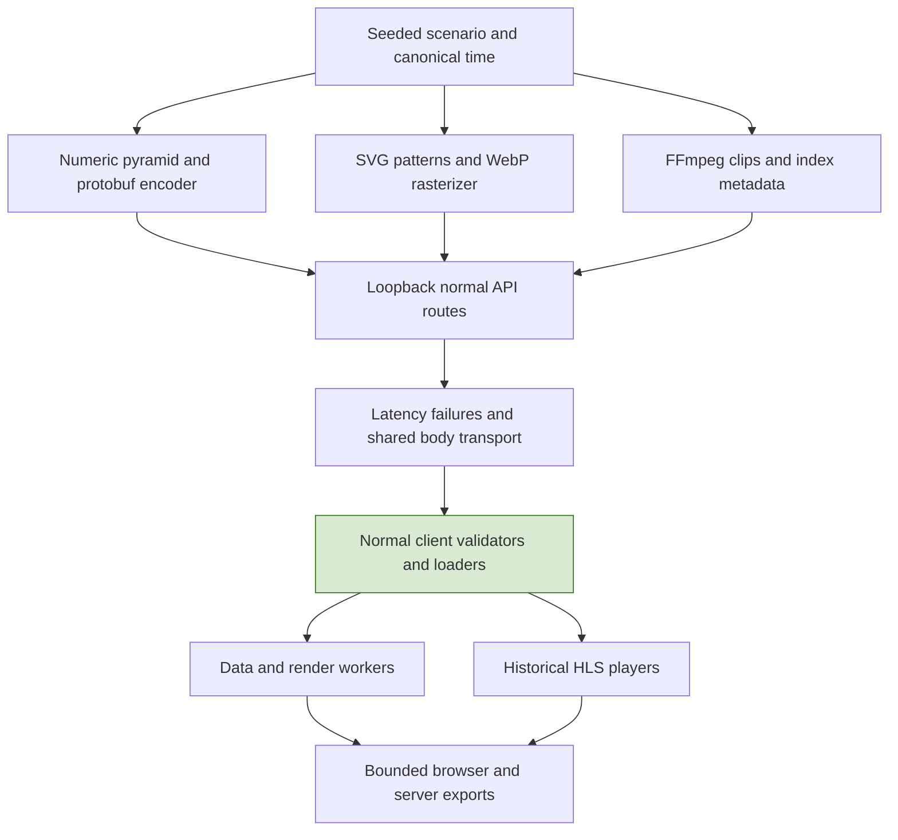
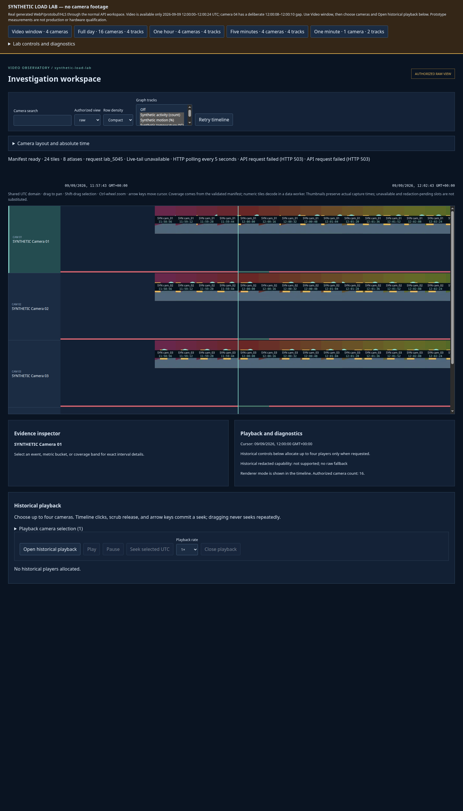
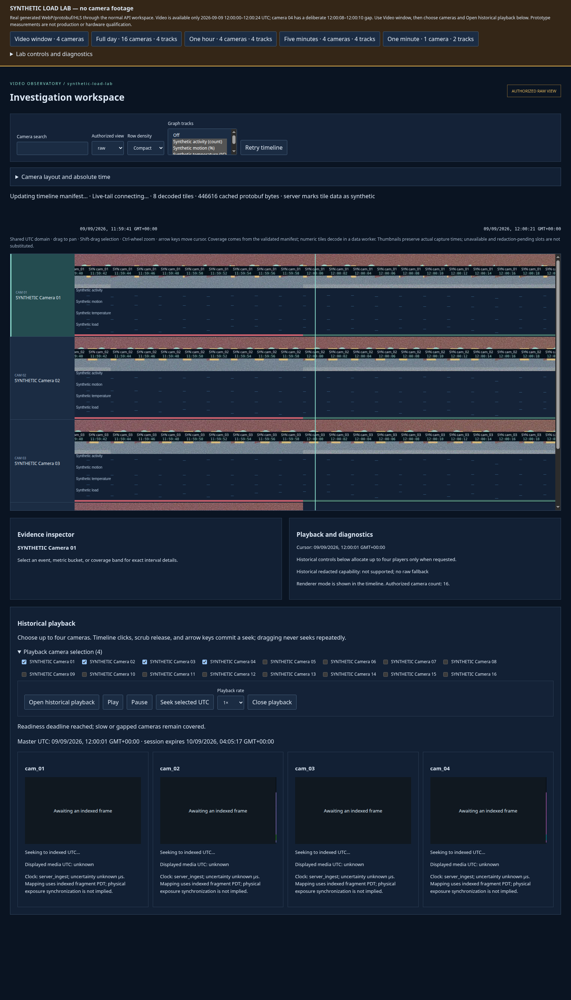

# Building a Synthetic Lab That Exercises the Real Product

A timeline demonstration can bypass precisely the work that makes a timeline difficult. Supplying ready-made JavaScript arrays omits binary decoding and validation. Drawing flat placeholders omits image decoding and texture uploads. Sharing one short movie across four players omits camera-specific media preparation. A visually convincing demo may therefore establish very little about the application's real loading and ownership behavior.

Video Observatory's synthetic lab instead replaces the source of data while preserving the normal application path. A loopback server answers the same discovery, manifest, tile, atlas and historical-playback interfaces. The browser still validates contracts, decodes protobuf and WebP, manages workers and textures, and plays indexed HLS. This article explains how the lab keeps that path meaningful, bounds its own cost, and interprets a fifteen-minute investigation without turning observations into unsupported benchmark claims.

> [!summary]
> - Synthetic content is useful when it exercises real resource and lifecycle boundaries.
> - Generator cost, server transport cost, browser scheduling and resource readiness must be measured separately.
> - Cold/warm labels require an explicit inventory of which owners were reset.
> - A measured slowdown can justify another investigation without identifying its cause or certifying a workstation.

Series: [[PROJ - Video Observatory - Technical Deep Dive Series]]. Project background: [[PROJ - Video Observatory - Evidence Correctness in a Browser Video Timeline]].

## 1. Replace the data source, not the client implementation

The server in `web-ui/lab/server.ts` serves a lab-enabled production bundle and the normal API shapes on one loopback origin. It has no dependency on the separate backend's database, camera ingest, model services or archive deployment. A synthetic banner makes that distinction visible. Failed API requests do not silently switch the browser into its explicit fixture workspace. [S1]



A same-origin process is also a practical boundary for browser experiments: it avoids adding a development proxy or cross-origin exception that production-facing loaders do not use. The server binds to `127.0.0.1`, checks loopback Host values, rejects cross-origin/cross-site requests and requires the mutation header for POST. Static paths are resolved and checked against the build directory, including real-path containment. These checks are local-lab admission, not a replacement for production identity and authorization infrastructure.

Persistent snapshots use separate ports and output directories. The verified HLS snapshot used port 5184 and `.lab/dist-p4`; ordinary isolated smoke tests used 5181 and `.lab/test-dist`; the longer campaign used its own server on 5185. Rebuilding into a directory served by another snapshot can change that snapshot even if its process is untouched. Browser isolation therefore needs build-output isolation as well as a separate tab or process.

## 2. Make workload identity reproducible

The dataset has sixteen cameras, four tracks and a fixed 2026-09-09 UTC day with two-second observation opportunities. Seeded value functions include regular patterns, bursts, noise-like variation, valid zeros and separate deterministic dropout. The generator is large enough to exercise multiresolution selection without needing millions of stored source rows. [S2]

A content run is identified by a truncated SHA-256 hash of canonical seed/complexity settings. Numeric resource identity additionally includes camera, level, canonical index and sorted/deduplicated track-set identity. Changing selection order does not change the represented track set; changing seed or complexity does change the run.

This gives a clear experiment rule: transport impairment changes do not alter content identity, while content changes do. The scenario endpoint requires idle workload/atlas/media preparation and closed sessions before changing the run and clearing retained data/media ownership. Existing tabs observing that server reload client ownership when they detect a new run. Old-run resource URLs are no longer accepted.

Reproducibility here means deterministic inputs and content under the recorded toolchain. It does not promise identical image/video bytes across arbitrary future FFmpeg, font or rasterizer versions. A useful experiment records both the scenario and the environment instead of treating the seed as its entire provenance.

## 3. Generate resources that perform the work under investigation

### Numeric resources

`numericTile` encodes the generated canonical protobuf schema, with exactly 256 buckets, bitmap validity, sufficient statistics and actual sample offsets. The normal client runs wire-allocation preflight, generated decoding and semantic checks. The server constructs numeric bytes while preparing a manifest because references include real byte lengths and ETags; this makes some generation cost part of manifest latency. [S3]

That detail also affects counters. `numericCacheHits` counts server resource lookups, including reuse while preparing manifests and serving tile requests. It is not a count of browser cache hits. In the cold overview, the manifest has already generated resources before subsequent tile GETs find them cached. Naming the observation correctly matters as much as collecting it.

### Image resources

Each WebP atlas is 1,280×360 pixels: an 8×4 arrangement of 160×90 cells. Camera identity and actual time are burned into the cell, along with deterministic geometry. Textured mode adds seeded SVG turbulence before sharp encodes the WebP at quality 75. Missing slots have no invented capture timestamp. A partial overview slot retains its canonical nominal interval while selecting an actual time within the scenario. [S4]

These are real image decode/upload workloads, not footage extracted from a recording. The thumbnail generator and the HLS generator produce independent synthetic patterns. The lab does not claim that a thumbnail is the decoded source frame of its corresponding movie.

### Media resources

The media generator produces distinct camera/seed-labeled H.264/fMP4 clips at 320×180, 10 fps, two-second GOPs and no B-frames. FFprobe reads stream timebase and packet anchors; initialization bytes supply the AVC configuration. The index and playlist use actual generated media lengths and timings. [S5]

Only 24 seconds are available at noon. Camera 04's 8–10-second segment is omitted, with a discontinuity and later epoch in the served metadata. This is deliberately not a whole-day movie repeated under different UTC labels. The recording coverage tells the truth about the generated window even while synthetic analytics and images cover the day.

Tests decode one and four players and compare frame captures for distinct pixels. Other checks exercise index grants, exact media lengths, ranges, HEAD, renewals and release. Having four DOM elements alone would not establish that four distinct resources decoded correctly.

## 4. Bound the generator so it does not dominate without explanation

A browser experiment can accidentally become an unbounded server-generation experiment. The lab therefore makes generation queues and retained owners explicit:

| Component | Implemented boundary |
|---|---|
| Concurrent manifest work | Eight admitted manifests |
| Atlas generation | One serial rasterizer; 32 coalesced pending entries maximum |
| Media preparation | One serial generation job; eight coalesced outstanding entries maximum |
| FFmpeg subprocess | Thirty-second timeout, bounded diagnostic output |
| Encoded atlas cache | 128 MiB |
| Encoded numeric cache | 64 MiB |
| Numeric pyramid typed arrays | 64 MiB |
| Generated clip cache | 64 MiB and sixteen entries |
| Active workload requests | 128 |
| Transport body ownership | 128 bodies and 32 MiB |

Pending maps coalesce requests for the same resource. Serial promises recover from a failed job so later work is not permanently blocked by a rejected predecessor. Manifest construction yields to I/O between resources and checks disconnects, rather than monopolizing the event loop through an entire large request. [S1, S5]

The server records generator duration separately from queue wait. Queue waits are per-job values: summing four jobs' wait times does not produce one user's wall-clock delay. The clip cache pins entries referenced by active sessions. Closing a session removes its authority, but an already-admitted bounded generation job can finish into cache; the system does not claim per-session CPU cancellation it does not implement.

Temporary generation directories are removed on success or failure. The media cache counts retained buffers, not temporary/native subprocess memory. The same distinction applies to sharp, decoded arrays and graphics textures. A cache ceiling is an ownership boundary, not a process-RSS limit.

## 5. Throttle one workload, not each connection independently

If eight concurrent downloads each receive a 256-KiB/s limit, aggregate capacity can approach 2 MiB/s. That does not simulate a shared 256-KiB/s connection. `LabTransport` therefore gives all admitted response bodies one token allowance. [S6]

For configured byte rate $R$ and elapsed interval $\Delta t$, its finite-rate allowance evolves approximately as

$$
T\leftarrow\min(16384,T+R\Delta t).
$$

Writes consume tokens; each finite-rate write is at most 16 KiB. A ten-millisecond timer pumps transfers and rotates the starting transfer to avoid always favoring the same stream. A response whose `write()` reports backpressure is skipped until `drain`. Unlimited mode is a separate path, so it does not accidentally retain a small per-tick cap.

The measured `bodyBytesSubmitted` counts bytes submitted to Node's response stream. It is not a physical network measurement. The transport retains ownership of each body until `finish` or `close`, not merely until its final write has been submitted. Otherwise accounting could drop a large buffer while Node still owns the transfer.

The cap is applied to timeline/playback response bodies, not all traffic. Controls, static assets, discovery and the directly returned injected-error bodies are excluded. The playback adapter also routes its own replies through the transport, so this is not a blanket claim that every possible application error body is exempt. It is a deliberate application-body impairment layer, not a packet-level network emulator.

Latency is an abortable delay before eligible work. Failures use the eligible request ordinal: every Nth request fails, with zero disabling injection and one rejected as an unsupported setting. The ordinal is deterministic for a given admitted request sequence, not a stable resource hash. Changing concurrency or navigation can change which URL receives an error even when N is unchanged.

## 6. Specify which cache is cold

The phrase “cold load” is incomplete unless it identifies the owners that were cleared. This system has browser numeric cache, decoded arrays, renderer images/textures, server encoded resources, server pyramids and generated media. Reloading one owner does not necessarily clear the others.

| Operation | What it establishes |
|---|---|
| Workload preset | Changes actual domain/cameras/tracks in place; retains caches |
| Client cache reset | Remounts client resource/rendering ownership; leaves server caches |
| Idle server data reset | Clears encoded atlases, numeric resources and pyramids; leaves clients and media cache |
| Content-run change | Requires idle preparation/closed playback, clears content ownership and reloads clients |
| Fresh isolated campaign server/browser | New initial application owners for the recorded experiment |

Server data reset returns 409 while workload requests or atlas generation are active. That prevents a reset from announcing a cold cache while admitted work immediately repopulates it. Reset does not erase measurement history. The history records what happened so exports can be interpreted afterward. [S1, S7]

A warm comparison should state both its reset operation and its selected domain. Returning to a different panned day window can legitimately require different tiles. In the final campaign, the last day view was not the original midnight interval; the report instead compares earlier samples with exactly matching domains to establish observed settling.

## 7. Collect bounded measurements with explicit units and cohorts

`LabMeasurements` retains at most 600 rAF intervals and 128 manifest durations, long tasks and events. A snapshot copies these arrays and records actual workspace selection, manifest levels/reference counts, client resource counters, renderer estimates and allocated video elements. Unsupported long-task measurement is null rather than zero. [S7]

Foreground rAF measurement resets its previous timestamp on visibility changes; it does not interpret time spent hidden as a very long foreground frame. Long-task attribution checks the recorded visibility interval. Each distribution sorts the current bounded sample set and selects quantiles using its implemented index rule. These are bounded recent windows, not lifetime histograms.

Consequently, averaging sixty exported p95 values would not produce the p95 of the campaign. The windows overlap, can omit intervals between captures, and may belong to different browser lifetimes. The content change midway through the campaign resets browser measurements while server counters continue; comparing them as one uninterrupted cohort would be incorrect.

The distinction between observed and estimated values is equally important:

- Manifest durations are measured completion/validation intervals in the instrumented client path, not time-to-last-visible-pixel.
- Texture bytes are application estimates, not graphics-driver allocations.
- Video-element counts describe mounted application elements, not hardware decoder allocation.
- GPU elapsed time was null in the recorded exports; no zero-cost GPU claim follows.

## 8. Read the fifteen-minute campaign as an experiment, not a score

The retained campaign ran for **907,110 ms** and produced **sixty exports** with no page errors. It used headed Chromium on a separate Xvfb display, a 1600×2800 viewport, DPR 1 and a reported Chrome 151 user agent. Every export asserted software visibility as visible. The large viewport allowed timeline and players to coexist, but it is not a claim about a typical physical monitor. Host contention was uncontrolled. [E1]

The first approximately four minutes covered cold/warm loads and repeated day/hour/five-minute/minute pan/zoom. Later phases applied slow transport and failures, cleared impairments, changed from seed 71/simple to seed 91/textured, repeatedly played four videos while navigating, and closed playback before the final observations.

### Cold generation and warm reuse

The first captured day state had 96 decoded tiles, six resident atlases and no missing/pending renderer resources. Its first validated manifest took 810 ms. First-generation numeric work accumulated about 769 ms over 96 resources; six simple atlases accumulated about 480 ms. Manifest generation includes constructing numeric metadata/bytes, so the cold manifest delay cannot be attributed entirely to browser rendering.

The warm-return export contained six manifest observations with a 15.7-ms median and 31.1-ms p95, but its maximum remained 810 ms because the cold observation was still retained. The capture approximately five seconds after navigation also includes a deliberate three-second wait in the harness. It is an observation point, not a precisely instrumented time-to-detail measurement.

A client-only reset then increased server atlas-cache hits by six without generating new atlases. That is concrete evidence of cold client ownership against warm server imagery.

### Repeated domains settled in the sampled owners

Samples `p5-pan-7`, `p5-pan-11` and `p5-pan-15` share start `1788915848552339` microseconds, the same day width and workload. They all contain 18,218,338 encoded-cache bytes, 6,078,464 decoded-array bytes and 14,745,600 estimated texture bytes. That supports settling for this repeated working set.

Across all exports, the maximum sampled texture estimate was 42,393,600 bytes, server numeric cache 19,672,452 bytes and pyramid typed arrays 65,301,876 bytes. The pyramid is close to its 64-MiB budget because it retains reusable camera/track summaries. These are sampled maxima; neither transient spikes nor process-wide leak freedom were established.

## 9. Smooth animation can accompany missing evidence

The slow phase applied 700-ms latency and a shared 256-KiB/s cap, then reset client resources. The initial export had no decoded tiles/textures. The later minute view had two decoded tiles, 54,272 numeric-array bytes and one estimated 1,843,200-byte texture.

The error phase used 500-ms latency, failure of every second eligible request and the same cap. At the retained error snapshot, the server had injected 64 failures and recorded 27 aborted transfers. The screenshot displayed HTTP 503 errors, incomplete imagery and absent numeric detail. [E1]



*The application still responds while resources fail. Its visible error and missing regions are intentional evidence, not a screenshot to relabel as a loaded success.*

The recent rAF p95 at that snapshot was approximately **16.7 ms**, while retained manifest-duration p95 was **717.4 ms** and maximum **1,235.8 ms**. This demonstrates why a single smoothness metric cannot establish loading success. Scheduling callbacks regularly is compatible with having very little valid work to draw. Clearing impairments and retrying restored the decoded minute workload.

## 10. Four-video work changed scheduling, but the cause remains unisolated

The textured phase generated four distinct clips successfully. Serial generation duration summed to about **1,432.7 ms**; per-job queue waits summed to **2,101.1 ms**. The clips occupied **3,100,068 cached bytes**. The active session renewed nineteen times during repeated playback/navigation.

Selected recent-window measurements show the change in browser scheduling:

| Capture | rAF p50 | rAF p95 | Window maximum |
|---|---:|---:|---:|
| Cold day | 16.7 ms | 16.7 ms | 50.1 ms |
| Warm day | 16.7 ms | 16.7 ms | 50.0 ms |
| Client reset / warm server | 16.7 ms | 16.8 ms | 199.9 ms |
| Late four-video window (`p5-media-50`) | 33.3 ms | 33.4 ms | 483.3 ms |
| Final closed-player day | 16.7 ms | 16.8 ms | 33.4 ms |

These are observations in an automated virtual-display environment. They do not isolate software compositing, video decoding, render callbacks or main-thread scheduling as the cause. The four-video row also comes from a different content run than the initial simple day. The return toward shorter intervals after closing players is useful evidence for a targeted follow-up, not a controlled causal proof.

At the end, allocated video elements and server sessions were both zero. Workload requests, media-generation work and transport-body queues were idle. The four clips remained cached as intended. This establishes observed lifecycle cleanup, not erasure of every native/browser allocation.

## 11. The diagnostic interface can change visibility

The script verified four ready textured players before exporting. Opening the diagnostics panel then pushed them outside the viewport. The player intersection observer paused loading/playback and concealed the surfaces. Closing the panel triggered normal indexed-frame recovery, and the immediately captured screenshot showed opaque covers. [S8]



*This image shows textured atlases and four allocated players during visibility recovery. It is not exposed-frame evidence. The playback article includes the separate four-distinct-frame capture.*

This is a precise limitation of the observation method. An earlier readiness assertion and a later screenshot can both be correct while describing different states. Moving controls into a fixed surface or waiting for a renewed presentation condition would produce a better exposed-frame capture, but hiding the cover for a screenshot would invalidate the test.

The campaign also recorded a textured atlas generation maximum near 839 ms, compared with an earlier simple maximum near 147 ms. Those are different samples, not a controlled image-complexity benchmark. Together with serial atlas work and media scheduling changes, they identify worthwhile follow-up transitions for a short browser/driver trace. Such a trace was not collected in this campaign.

## 12. What this lab qualifies—and what it does not

The retained final functional batch passed 25 production-build browser cases, eight lab-browser cases and 92 unit/property tests, including generated contract checks, typecheck, lint and both builds. “Production-build browser cases” means tests against the ordinary built client; it does not mean acceptance against the deployed production backend. [E2]

The lab found concrete lifecycle bugs: authorization ownership crossing render effects, focus-induced timeline movement, and a seek path that paused while chasing a running master. Fixing those causes was more useful than increasing every cache or suppressing visible errors. The original failed production-browser batch and isolated reproductions remain in the ticket alongside the later passing batch.

This is a completed synthetic experiment, not an exhaustive benchmark framework. It establishes that normal resource paths run, explicit failures remain observable, selected ownership settles, sessions renew/release, and media coexistence changes observed scheduling. It does not establish real-camera fidelity, production orchestration, physical synchronization, universal FPS targets or total-memory leak freedom. Those claims require different evidence, not more confident wording.

## Reproduce the experiment

From the source repository:

```bash
cd web-ui
npm ci
npm run lab

# Existing functional validation:
npm run check
npm run test:e2e:production
npm run lab:smoke

# Optional long investigation after the isolated assets are built:
xvfb-run -a npx playwright test --config playwright.investigation.config.ts
```

FFmpeg/ffprobe, libx264 and drawtext/hue/noise filters are required for media generation; the source uses `/usr/share/fonts/truetype/dejavu/DejaVuSans.ttf`. `LAB_PORT` and `LAB_DIST` isolate servers and output snapshots. Do not rebuild a live snapshot's output directory unless changing that snapshot is intended. These are reproduction instructions; application tests were not rerun for this documentation-only publication.

## Source and evidence guide

| Reference | Source at the pinned repository checkpoint |
|---|---|
| S1 | `web-ui/lab/server.ts`: routes, admission, `manifest`, `image`, reset/scenario handling |
| S2 | `web-ui/lab/scenario.ts`: canonical content settings and immutable run identity |
| S3 | `web-ui/lab/pyramid.ts`, `tiles.ts`: real numeric data and encoder |
| S4 | `web-ui/lab/atlases.ts`: actual slot times, SVG content and WebP encoding |
| S5 | `web-ui/lab/playback.ts`: bounded FFmpeg generation and real indexed gaps |
| S6 | `web-ui/lab/impairments.ts`: `LabTransport.before`, `send`, `pump` |
| S7 | `web-ui/src/lab/measurements.ts`, `LoadLabPanel.tsx`: bounded windows and controls |
| S8 | `web-ui/e2e-lab-investigation/foreground.spec.ts`, `playwright.investigation.config.ts`; `src/playback/HistoricalPlayer.tsx` |
| E1 | [Complete vault-local campaign](_assets/vo-deep-dive-campaign.json), sixty original combined exports |
| E2 | [Executed functional validation](_assets/vo-deep-dive-validation.log); WEBUI-LAB-001 `sources/p5-foreground-validation.log` records the separate 15.1-minute pass |

The source ticket is `ttmp/2026/09/09/WEBUI-LAB-001--prototype-synthetic-24-hour-video-timeline-and-browser-load-lab`. Its final findings and diary provide the full chronological record. The earlier [[PROJ - Video Observatory Backend - Verified Recording and Authenticated Playback|backend report]] describes a different subsystem/checkpoint and should not be read as proof of browser integration at this one.

## Continue the series

[[ARTICLE - Video Observatory - Scrolling Through a Day of Video Without Loading a Day of Video|Timeline scrolling]], [[ARTICLE - Video Observatory - Synchronizing Four Video Players Against One UTC Clock|UTC playback]] and [[ARTICLE - Video Observatory - Preserving Meaning While Aggregating Millions of Observations|aggregation correctness]] explain the client mechanisms that this lab deliberately leaves in place. The experiment is useful because it makes their costs and failure states observable rather than substituting a cheaper implementation.
