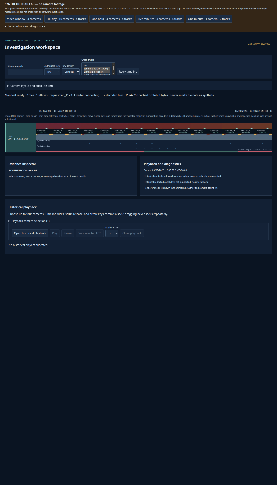

# Preserving Meaning While Aggregating Millions of Observations

A graph can be wrong without containing a malformed number. A missing measurement can become zero, a mean can give a sparse interval the same influence as a dense one, and a bucket boundary can be presented as the timestamp of an observation that never occurred there. All requests may succeed, the decoder may accept the bytes, and the renderer may draw exactly the geometry it was given.

Video Observatory treats the numeric representation as part of the evidence model. Its multiresolution tiles preserve sufficient statistics, explicit validity and actual sample times. Its decoder checks relationships between fields, not just their types. Its inspector retains distinctions that a reduced graph cannot communicate alone. This article derives the aggregation rules and follows their meaning from the deterministic source dataset to a clicked graph lane.

> [!summary]
> - Aggregate the quantities needed to derive a result, rather than recursively averaging derived results.
> - Missingness is explicit even when missing storage and a valid value both contain zero.
> - Bucket extent, observation time, observed duration and recording coverage are different facts.
> - A semantically valid resource still needs the right camera, view, catalog and request lifetime.

Series: [[PROJ - Video Observatory - Technical Deep Dive Series]]. Project background: [[PROJ - Video Observatory - Evidence Correctness in a Browser Video Timeline]].

## 1. Define what the dataset actually contains

The lab's day begins at `1788912000000000` microseconds, 2026-09-09 00:00:00 UTC. Its duration is 86,400 seconds and its observation opportunity period is two seconds. Each camera/track pair therefore has 43,200 possible positions. Sixteen cameras and four tracks yield 2,764,800 opportunities—not necessarily that many valid observations. [S1]

The four tracks are activity, motion, temperature and load. They use deterministic functions of camera, sample position and seed. Some valid samples deliberately equal zero. Separately, `isObserved` excludes a deterministic portion of positions using camera/track-dependent modular arithmetic. This distinction is essential: the value generator answers what an observation would measure; the observation predicate answers whether an observation exists.

There is no continuous real-world signal reconstructed by these functions. They are synthetic point observations intended to exercise the application's semantics and resource path. The availability of a synthetic thumbnail at a time does not imply the existence of an analytics observation or a recording segment at that time.

## 2. Derive the quantities a parent summary needs

Let a bucket contain valid observations $x_1,\ldots,x_n$. A useful summary retains

$$
C=n,\quad S=\sum_{i=1}^{n}x_i,\quad m=\min_i x_i,\quad M=\max_i x_i.
$$

The mean is derived as $S/C$ when $C>0$. Actual first and last observation times, and the value of the last observation, carry additional temporal information. These quantities are sufficient for the operations this lab supports: sample-weighted mean, count, envelope and last value. They are not sufficient for arbitrary quantiles, variance or reconstruction of the original sequence.

For two adjacent summaries $A$ and $B$ with observations:

$$
C_{A\cup B}=C_A+C_B,\qquad S_{A\cup B}=S_A+S_B,
$$

$$
m_{A\cup B}=\min(m_A,m_B),\qquad M_{A\cup B}=\max(M_A,M_B).
$$

The first observation comes from the earliest nonempty child; the last comes from the latest nonempty child. Empty children contribute neither extrema nor timestamps. Adding a stored zero from an empty child to an extrema comparison would introduce a false minimum whenever all actual values are positive.

### Why means of means fail

Consider a constructed example, not a captured lab sample. Child A contains nine observations with value 10; child B contains one observation with value 100. Their means are 10 and 100. Averaging those means produces 55, but the mean of the observations is

$$
\frac{9\cdot10+1\cdot100}{9+1}=19.
$$

An unweighted mean of child means implicitly treats children as the units being averaged, regardless of how many observations they contain. That may answer a different statistical question, but it does not answer the requested sample mean. Dropout makes the error observable because adjacent intervals need not have equal counts.

The encoded series separates `sum` and `weight`. In this lab's `sample_minmax` reducer, weight equals sample count. A duration-weighted reducer would require weights and sums derived from durations; retaining a field named `weight` does not make the current point-sample generator duration-weighted. The decoder accepts several reducer identifiers, but the lab's four tracks use sample aggregation. [S2, S3]

## 3. Build a globally aligned pyramid

Numeric tile level $L$ has span $64\,\mathrm{s}\times2^L$ and exactly 256 buckets. A bucket therefore spans $0.25\,\mathrm{s}\times2^L$. Level 3 has a two-second bucket, matching one source opportunity. Coarser levels merge adjacent aligned children. Finer levels place an observation in its containing fine bucket and leave other buckets invalid. [S2]

At the base observation layer, the implementation keeps arrays for values, counts and first/last sample indices. The base minimum, maximum and sum share the same values array because a nonempty base position has exactly one observation. Parent layers allocate independent extrema/sum/count/index arrays. Their byte accounting counts the shared base values once rather than once for each alias.

A parent starts at a globally derived index. It is not formed by blindly grouping consecutive in-memory elements in pairs. The first child in a local slice might correspond to the second half of a globally aligned pair. `floorDiv` determines the parent's first and last indexes, and child positions are calculated relative to those global indexes. This preserves canonical alignment at slice boundaries.

```text
for each globally aligned parent bucket:
    count = 0
    sum = 0
    first_sample = absent
    last_sample = absent

    for its two child buckets in temporal order:
        if child is outside this array or child.count == 0:
            continue
        if count == 0:
            first_sample = child.first_sample
            minimum = child.minimum
            maximum = child.maximum
        else:
            minimum = min(minimum, child.minimum)
            maximum = max(maximum, child.maximum)
        count += child.count
        sum += child.sum
        last_sample = child.last_sample

    if count > 0:
        store valid aggregate and actual sample indices
    else:
        leave invalid canonical storage
```

This is explanatory pseudocode for `lab/pyramid.ts`, not an alternate implementation. The actual generator constructs needed camera/track pyramids lazily and keeps retained typed arrays in a 64-MiB cache. A rebuild can occur after eviction; the data remains reproducible because the run identity and generator inputs are fixed. Arithmetic merges have the intended mathematical grouping behavior, although arbitrary floating-point datasets would still require attention to summation order and numerical error.

## 4. Fine buckets are not continuous measurements

Suppose the canonical tile begins at time $T$ and contains observations at $T$, $T+2$ seconds and $T+4$ seconds. At level 0, each bucket is 250 ms wide. The first three observations fall into buckets 0, 8 and 16. The seven intervening buckets are not valid zeros and are not interpolated observations.

A level-0 tile therefore can look sparse even when every scheduled two-second observation exists. Increasing zoom reveals the sampling model. It should not cause the application to fabricate a dense signal merely to make the graph appear continuous.

At coarser levels, a bucket may contain observations only near one end. The bucket interval describes where its summary applies; the actual first and last sample times describe where measurements occurred. If a bucket spans [12:00:00, 12:00:16) but its first observation is 12:00:06, displaying the left bucket edge as “first sample” would be false.

The generator stores sample offsets relative to the tile origin, not relative to the bucket's left edge. The inspector reconstructs an actual time as `track.originUs + firstSampleOffsetUs[index]`. The validator checks that each offset lies inside the corresponding bucket and that first does not exceed last. [S3, S4]

## 5. Encode validity independently of numeric storage

Every numeric series has a 32-byte validity bitmap for 256 buckets. A clear validity bit means all numeric fields and offsets for that bucket must contain zero storage. A set bit means the count and weight must be positive and the statistics must pass consistency checks. [S3, S4]

This convention avoids leaving arbitrary stale values in invalid slots, but it also means storage cannot be interpreted without validity:

| State | Valid bit | Count | Mean | Interpretation |
|---|---:|---:|---:|---|
| Missing bucket | 0 | 0 | 0 | No observation |
| Valid measured zero | 1 | 1 or more | 0 | Observations exist and their mean is zero |
| Valid nonzero bucket | 1 | Positive | Finite value | An admitted numeric summary |

A valid first sample offset can itself be zero when the sample occurs at the tile origin. That is another reason zero is not a universal absence marker.

`buildGeometry` skips invalid numeric buckets. For line rendering it resets the previous point at an invalid bucket rather than connecting a line across the missing interval. The lab currently uses envelope rendering, while the general scene supports other modes. In every mode, drawing logic must consult validity instead of deriving it from value magnitude. [S5]

## 6. Coverage has more than one meaning

The numeric protocol includes `observedCoverageUs`, and coverage bands include available, missing and unknown duration. These are not interchangeable with counts or first/last sample times.

The lab's point-sample numeric series leaves reported observed coverage at zero. That does not negate a positive observation count. An instantaneous sample does not by itself establish a continuously observed duration, and subtracting first from last does not prove the time between them was observed. The inspector says this explicitly. [S3, S6]

Each coverage-band bucket must satisfy

$$
\text{availableUs}+\text{missingUs}+\text{unknownUs}=\text{bucketUs}.
$$

The lab's `lab.scenario` numeric coverage band marks the overlap with the synthetic scenario domain as available and the remainder unknown. It is not a recording-availability band. Recording coverage comes from the media scenario and is missing outside the 24-second generated window, including the deliberate camera-04 gap. Analytics dropout is separate from both.

Three questions therefore need different answers: Is this part of the synthetic scenario? Is there an analytics observation? Is there video to play? Collapsing them into a single green band would make one subsystem's availability claim appear to authorize another subsystem's evidence.

## 7. Validate before and after protobuf decoding

A binary transport contract needs two kinds of validation: bounds on what decoding can allocate, and semantic checks on what the decoded object claims. A validator that runs only after allocating attacker-controlled repeated arrays is too late to enforce the first. [S4]

`decodeTile` first rejects empty bodies and bodies over 8 MiB. A custom wire preflight rejects protobuf groups, bounds recognized repeated structures and array element counts, and limits known metadata fields before calling the generated protobuf decoder. Unknown fields are not retained. Generated decoding establishes wire structure; the subsequent semantic validator establishes relationships.

```mermaid
flowchart LR
  Bytes[Bounded encoded body] --> Preflight[Wire allocation preflight]
  Preflight --> Decode[Generated protobuf decoder]
  Decode --> Identity[Grid and manifest identity checks]
  Identity --> Statistics[Validity and statistics checks]
  Statistics --> Catalog[Track catalog and view checks]
  Catalog --> Arrays[Typed scene arrays]
  Arrays --> Inspector[Rendering and inspection]
  style Statistics fill:#d9ead3,stroke:#38761d
```



The semantic checks include exactly 256 buckets, supported schema/level, canonical tile origin and bucket duration, manifest identity agreement, view agreement and policy revision when an expectation is supplied. Arrays must have exactly 256 entries, numeric values must be finite, series IDs must be unique, and invalid buckets must have zero storage. Valid buckets need positive count/weight, ordered extrema and sample offsets within their bucket.

The mean check derives `sum / weight` and compares it with the transmitted mean using relative tolerance:

$$
|\text{mean}-\text{sum}/\text{weight}|
\leq10^{-6}\max(1,|\text{sum}/\text{weight}|).
$$

This detects inconsistent sufficient statistics while allowing bounded floating-point discrepancy. It does not prove that the sum matches an unseen source dataset. Similarly, the validator checks extrema ordering, not every possible relation a malicious producer could violate. Application validation and trusted generator verification answer different questions.

Track conversion then checks catalog membership, allowed views and version agreement before constructing scene arrays. The series retains a name, unit, reducer and model/catalog revision. A numeric value without that interpretation is not enough to populate an inspector correctly.

## 8. Make independent track selection semantically independent

A multitrack row has one shared time axis but several different vertical interpretations. `trackLane` assigns each selected track a distinct lane, and `hitRow` uses those same boundaries to identify the clicked track and bucket. The selected time determines the bucket; the vertical coordinate determines which variable is being inspected. [S5]

The inspector displays the bucket interval, reducer, unit, revision, count, extrema and mean. When available, it separately displays actual first/last sample UTC and reported observed duration. An invalid bucket says “No observation. Missing values are not measured zero.” Missing temporal metadata is labeled unavailable rather than reconstructed from bucket edges. [S6]



*One-camera minute-scale view from the retained campaign. Distinct thumbnail times coexist with sparse numeric marks. The screenshot establishes rendered layout; the inspector source and lane tests establish how clicks select semantic details.*

The same principle applies to neighboring evidence types. Event evidence intervals remain distinct from reporting time, and a similarity score is not labeled as a probability. The article focuses on numeric data, but these distinctions explain why one generic tooltip with a time and number would be an inadequate inspection interface.

## 9. Valid data still needs the right authority and lifetime

Imagine two individually valid tiles for different cameras. If an asynchronous response for camera A is inserted into camera B's row, every statistic can pass its internal checks while the screen is wrong. Resource identity must therefore be checked against the manifest, not merely validated in isolation.

Likewise, a previously valid raw-view result cannot be reused because its bytes are already cached after a view/authorization change. Tile keys include view, camera, identity, revision, ETag and URL. Worker request IDs reject obsolete completions. The React resource layer retains a previous validated numeric batch only while there is a non-null manifest and compatible catalog, view and reset lifetime. It is not a blanket cross-authorization cache. [S7]

Content-run identity solves a related problem in the synthetic server. The run ID hashes canonical seed/complexity settings; tile identity additionally hashes the sorted, deduplicated selected track set. Reversing track-selection order therefore produces the same content identity instead of unnecessary duplicate resources. Changing content creates new run URLs and clears ownership after idle admission. [S1, S3]

No one check replaces the others. Wire validation answers whether bytes are structurally admissible. Semantic validation answers whether fields are mutually consistent. Catalog validation supplies interpretation. Manifest/request/authority checks establish whether the result belongs in this display now.

## 10. Verify aggregation against the source, not another aggregate

The lab tests directly enumerate source observations and compare counts and sums at selected fine, overview and day-covering levels. Another test exercises all levels 0–14, four tracks and representative buckets, comparing count, sum, minimum, maximum and last value against direct enumeration. Reversed track order must produce identical bytes. Coverage durations must conserve bucket time. [S8]

These tests are stronger than comparing one pyramid level with another generated by the same merge routine: two consistently wrong aggregates could agree. They are still finite tests. The implementation's merge rules explain why the result should generalize, while direct-source comparisons catch errors in indexing, dropout and boundary handling.

Other tests verify that out-of-scenario tiles preserve canonical bounds and invalid storage, and that a partial overview thumbnail slot can retain a nominal start before the scenario while reporting the first actual observation inside it. Deterministic WebP tests check real dimensions and camera/time differences. The validated binary path and end-to-end lane inspection together cover different parts of the evidence chain.

The result is not a promise that every future producer is truthful. It is a representation and admission process in which missingness, time, identity and reduction semantics remain inspectable rather than disappearing during optimization.

## Source and evidence guide

| Reference | Source at the pinned repository checkpoint |
|---|---|
| S1 | `web-ui/lab/scenario.ts`: opportunity cadence, `sample`, `isObserved`, run identity |
| S2 | `web-ui/lab/pyramid.ts`: `build`, `bucketSummary`, aligned merge and retained array accounting |
| S3 | `web-ui/lab/tiles.ts`: `trackSignature`, `numericTile`, sample offsets and scenario coverage |
| S4 | `web-ui/src/data/tiles.ts`: `preflight`, `decodeTile`, `validateTile`, `tileTracks` |
| S5 | `web-ui/src/engine/scene.ts`: `NumericTrack`, `trackLane`, `hitRow`; `src/render/geometry.ts` |
| S6 | `web-ui/src/app/Inspector.tsx`: validity, reducer, actual sample and observed-duration presentation |
| S7 | `web-ui/src/data/tile-loader.ts`, `src/app/useTileResources.ts`, `src/workers/data.worker.ts` |
| S8 | `web-ui/tests/lab.test.ts`, `tests/tiles.test.ts`, `e2e-lab/timeline.spec.ts` |
| E1 | [Retained executed validation](_assets/vo-deep-dive-validation.log), not a new test run for this article |
| E2 | [Campaign exports](_assets/vo-deep-dive-campaign.json): actual selected tracks, levels and decoded-array ownership |

The canonical schema source is `video_platform_v1/contracts/timeline.proto`; generated TypeScript lives under `web-ui/src/generated/`. The source ticket's guide and diary document the migration from a narrow fixture to independent tracks and dropout-preserving summaries.

## Continue the series

[[ARTICLE - Video Observatory - Scrolling Through a Day of Video Without Loading a Day of Video|Timeline scrolling]] explains how these summaries are chosen and drawn at different scales. [[ARTICLE - Video Observatory - Synchronizing Four Video Players Against One UTC Clock|Historical playback]] preserves meaning across a different time representation. [[ARTICLE - Video Observatory - Building a Synthetic Lab That Exercises the Real Product|The load lab]] shows why real encoded resources and deliberately incomplete data are necessary to test both paths.
