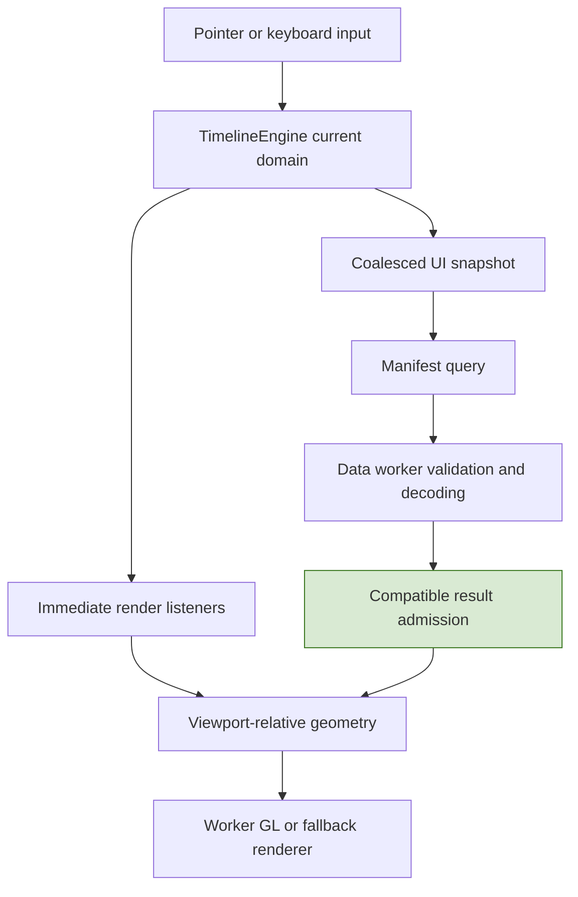

# Scrolling Through a Day of Video Without Loading a Day of Video

A timeline should respond to a drag immediately, even when the data needed for the new interval has not arrived. That requirement creates two separate problems. The application must update geometry quickly, and it must decide which previously loaded resources remain valid in the new geometry. Solving only the first produces a responsive display of stale evidence. Solving only the second produces a correct interface that waits for the network on every movement.

Video Observatory addresses the problems with an immediate time-domain engine, canonical multiresolution resources, virtualized camera rows, bounded worker/rendering ownership, and explicit rules for reusing validated data. This article derives those rules and follows them through the TypeScript implementation. The implementation discussed is the September 10 checkpoint above, not a claim of production deployment or qualified hardware performance.

> [!summary]
> - The viewport changes synchronously; resource replacement is asynchronous and generation-checked.
> - Numeric buckets and thumbnails use different resolutions on the same canonical time grid.
> - Validated old detail can remain visible only within compatible authority and at its actual temporal position.
> - Rendering speed, data readiness and total machine memory require different measurements.

Series: [[PROJ - Video Observatory - Technical Deep Dive Series]]. Project background: [[PROJ - Video Observatory - Evidence Correctness in a Browser Video Timeline]].

## 1. Begin with the amount of information, not the rendering API

The synthetic dataset contains sixteen cameras, a twenty-four-hour domain and one observation opportunity every two seconds. That is 43,200 opportunities per camera, 691,200 across cameras, and 2,764,800 across four numeric tracks before deterministic dropout. Displaying every observation as a separate image or DOM element is unnecessary at overview scale. A 1,400-pixel-wide timeline cannot communicate 43,200 distinguishable horizontal sample positions.

The question is therefore not how to draw all the source data faster. It is which representation preserves useful information at the current display scale, and how to load only the representations the user needs. Numeric summaries preserve counts and extrema across larger intervals. Thumbnail atlases provide a bounded set of labeled representative images. Historical video is allocated only when explicitly requested; merely displaying sixteen timeline rows does not create sixteen video decoders.

There is an important implementation limit to state early. Camera-row virtualization bounds visible scene and atlas work, but the numeric loader receives all numeric references in the admitted manifest. The cold sixteen-camera overview decoded 96 numeric tiles while only six atlases were resident for its virtual window. Virtualization is not evidence that every layer is restricted to visible cameras. The manifest and numeric loader have their own admission limits. [S2, S4]

## 2. Keep absolute time out of floating-point drawing coordinates

The authoritative time type is a signed microsecond integer represented by JavaScript `bigint`. A domain is a half-open interval $[a,b)$ with positive duration $D=b-a$. For a timeline width $W$, the horizontal coordinate of time $t$ is

$$
x(t)=W\frac{t-a}{b-a}.
$$

`timeToX` subtracts the domain origin in integer arithmetic before converting the difference and bounded duration to `Number`. The renderer receives small, viewport-relative coordinates rather than absolute epoch values. This matters particularly when geometry eventually enters `Float32Array`: a large absolute timestamp would lose the precision needed to distinguish nearby observations. [S1, S5]

The reverse operation is

$$
t(x)=a+\operatorname{round}\left(\frac{xD}{W}\right).
$$

Rounding occurs at the conversion from a continuous pointer coordinate to discrete microseconds. An integer time representation does not make a pointer infinitely precise. It makes the conversion point explicit, after which the selected UTC can be preserved exactly.

### Cursor-anchored zoom is a constraint, not a visual adjustment

Suppose the user zooms at horizontal coordinate $x$, and the new duration is $D'$. First compute the time beneath the pointer, $q=t(x)$. Then choose the new origin as

$$
a'=q-\operatorname{round}(xD'/W),\qquad b'=a'+D'.
$$

The same UTC stays beneath the same pointer coordinate, subject to integer rounding. `zoomDomain` clamps the new duration between four seconds and seven days before converting back to `bigint`. Clamping before conversion also prevents an extreme finite zoom factor from producing an invalid integer conversion.

As a worked example, place the pointer one quarter of the way across a 3,600-second window. It identifies the time 900 seconds after the start. Zooming to a 1,800-second window should place its new start 450 seconds before that anchor, not simply keep the old left boundary. This is why zooming around the domain center and subsequently moving the cursor is not equivalent.

Pan calculations similarly refer to the gesture's initial snapshot. Each pointer move computes displacement from the original pointer/domain pair, rather than accumulating rounded deltas from successive events. Canceling a gesture restores the original geometry but advances generation; it must not restore an old request identity. [S1, S2]

## 3. Derive resource resolution from display resolution

All tile levels use a canonical span:

$$
S_L=64\,\mathrm{s}\times 2^L,\qquad 0\leq L\leq14.
$$

Numeric tiles contain 256 buckets, so their bucket duration is $0.25\,\mathrm{s}\times2^L$. Atlases contain 32 slots, so their nominal slot duration is $2\,\mathrm{s}\times2^L$. A tile index is $\lfloor t/S_L\rfloor$, with its origin derived from that index—not from the current viewport's left edge. `floorDiv` handles negative times correctly; ordinary integer truncation toward zero would assign pre-epoch times to the wrong tile. [S1]

Canonical alignment provides resource reuse. Two overlapping viewports request many of the same tile identities. If each viewport generated resources beginning at its own left edge, even a one-pixel pan could create entirely different cache keys.

Numeric and image resolution are selected independently. `chooseLevel` computes seconds per CSS pixel and targets approximately 0.75 pixels per numeric bucket but 80 pixels per thumbnail slot. It rounds a logarithmic level estimate and clamps it to supported levels. The helper also supports retaining a supplied previous level while the target step remains within 80–120% of its step. However, the current lab server calls it without that optional previous-level argument. The helper's hysteresis support should not be presented as an active lab-server behavior; the lab's manifest choices use the rounded estimate on each query.

For a one-day view at an illustrative width of 1,400 pixels:

| Quantity | Numeric | Thumbnail |
|---|---:|---:|
| Seconds per pixel | 61.71 | 61.71 |
| Target temporal step | 46.29 s | 4,937.14 s |
| Base step | 0.25 s | 2 s |
| Rounded level | 8 | 11 |
| Actual step at that level | 64 s | 4,096 s |

The cold campaign export independently records numeric level 8 and atlas level 11. The calculation explains that observation without pretending the experiment used exactly the illustrative width. [E1]

At fine scale, numeric buckets may be only 250 ms wide while observation opportunities remain two seconds apart. Empty fine buckets are expected. Changing the tile grid to eliminate those blanks would change the data contract rather than improve the resolution policy.

## 4. Separate immediate interaction from React publication

`TimelineEngine` maintains current state and two subscriber groups. Rendering listeners are notified immediately when the domain or cursor changes. React-facing listeners receive a coalesced state snapshot on a 100-ms timer. This prevents every pointer event from requiring a complete React update before geometry can change. It does not mean the renderer itself runs only at ten frames per second. [S2]



The engine distinguishes cursor movement from committed seeking. Moving a cursor for rendering does not have to recreate a video session or issue a media seek. `commitCursor` notifies explicit seek listeners; `setCursor` alone does not. This separation becomes essential when a running playback clock updates the timeline cursor periodically: otherwise the clock would recursively trigger new seeks.

## 5. Virtualize rows without changing the coordinate system

`visibleRows` computes the camera interval intersecting the scroll viewport, then adds a bounded overscan region—two rows by default. The result describes which rows need scene work and where they belong in the larger scroll extent. The labels, canvas and pointer interpretation must agree about that offset. [S3]

Within each row, imagery and graphs occupy different lanes. The compact row reserves 96 pixels for thumbnails, each numeric track gets 32 pixels, and coverage occupies the bottom region. Four tracks yield a 232-pixel compact row including the additional coverage/layout allocation. Expanded imagery is 160 pixels high. These sizes are not merely cosmetic: changing a row's height changes virtualization, label placement, hit testing and scroll calculations.

`trackLane` centralizes the lane boundaries used by drawing and inspection. `buildGeometry` uses the same CSS-relative time transformation for WebGL and Canvas fallback. Drawing a temperature graph in one region while interpreting pointer coordinates with an independently hard-coded row layout would make accurate selection impossible. Sharing a GPU buffer is less important than sharing the coordinate rules.

A concrete bug demonstrated another dependency. Focusing a tall canvas during pointer-down caused the browser to scroll before pointer-up. The user's intended metric click then resolved against a different row/thumbnail region. The fix used `focus({ preventScroll: true })`, stabilized the status area's height and disabled scroll anchoring in the relevant timeline layout. Correct hit-testing equations cannot compensate for an unaccounted viewport movement during the gesture. [S7]


*The final campaign's cold day view. Sixteen cameras and four tracks are selected, but the camera region is virtualized. The export reports 96 decoded numeric tiles and six resident atlases, not sixteen simultaneous video players.*

## 6. Cancellation reduces work; identity checks establish correctness

A resource response can arrive after the user pans again. Aborting the old request is useful, but cancellation alone is insufficient: data may already have completed, a callback may already be queued, or the work may occur in another worker lifetime.

The implementation uses multiple identities with different responsibilities. Manifest generation describes a viewport request. Worker request IDs identify the load currently eligible to publish. Resource identities include view, camera, tile ID, revision, ETag and URL. Track-catalog and reset lifetimes determine whether previously validated arrays remain meaningful. These identities should not be compressed into a single vague “latest” boolean. [S4]

`TileLoader.load` cancels its previous batch, bounds manifest reference and track counts, deduplicates resource keys, pins the requested encoded working set, and schedules bounded downloads. It checks cancellation both before and after decode/semantic validation. The default scheduler admits eight jobs globally and two per camera. Its encoded cache is 64 MiB. The current loader returns a batch with `Promise.all`, so one failure aborts that batch; this is not an implementation that streams each numeric tile into the scene independently.

`useTileResources` can display at most the last completed numeric batch while its replacement loads, but only when the new manifest is non-null and the track-catalog identity, view and retry/reset lifetime match. The old arrays retain their original origins and steps, so the renderer shows only their actual overlap with the new domain. The UI labels this as previous validated resolution, not newly loaded detail.

```text
on replacement manifest:
    invalidate previous request eligibility
    cancel its outstanding work
    begin a new request

while replacement loads:
    if authority exists and catalog/view/reset lifetime match:
        retain one completed numeric batch at its original coordinates
    else:
        display no retained numeric batch

on completion:
    accept only the currently eligible request
```

This is explanatory pseudocode for the admission pattern, not a replacement API. It deliberately does not say “keep the old picture until something new appears.” Imagery has separate leases and authorization checks. A previous defect allowed a renderer's layout effect to see next-authority imagery before its passive teardown; the application now checks captured authorization for both drawing and asynchronous loading. [S7]

## 7. Give each expensive representation a budget

A WebP's compressed size is not its texture size. An RGBA estimate for a 1,280×360 atlas is $1280\times360\times4=1,843,200$ bytes, regardless of whether the encoded image is visually simple and compresses to a small file.

| Owner | Implemented boundary |
|---|---|
| Encoded numeric cache | 64 MiB |
| Texture manager | 192 MiB estimated texture storage |
| Decoded images awaiting upload | 8 MiB |
| Frame upload allowance | 4 MiB, coordinated with primitive uploads |
| Render instances | 50,000 combined primitives/thumbnails |
| Device-pixel ratio | Capped at 2 for renderer allocation |

`AtlasManager` admits decoded images, pins current imagery, evicts unpinned texture entries when possible and limits upload work per frame. Closing image ownership and releasing worker-side leases are explicit operations. The renderer host supports worker WebGL, main-thread WebGL probing and Canvas fallback, with recovery tested against worker failure. A fallback preserves usability; it is not evidence that the preferred rendering path met a performance target. [S5, S6]

These budgets constrain application-owned resources. They exclude browser implementation details, transient native allocations and graphics-driver memory. Nor do sampled values prove a continuous high-water mark. During the campaign, the largest sampled texture estimate was 42,393,600 bytes. That number is useful precisely because it names the owner and the sampling method. [E1]

## 8. What the measurements establish

The first full-day capture had 5,210,112 bytes of decoded numeric arrays and 11,059,200 estimated texture bytes. Its first validated manifest took 810 ms. A later warm-return window retained that slow sample while adding faster manifests; its median was 15.7 ms. Calling the entire window a pure warm-cache latency benchmark would be wrong.

Repeated identical panned-day domains provide a better resource-settling comparison. Campaign samples `p5-pan-7`, `p5-pan-11` and `p5-pan-15` have the same start time and day width. All report 18,218,338 encoded-cache bytes, 6,078,464 decoded-array bytes and 14,745,600 estimated texture bytes. This demonstrates settling of observed application owners for that working set, not process-wide leak freedom.

The full-day display remained useful because geometry could move independently of resource completion, resolution matched display scale, and old results could not acquire a new identity merely by arriving late. The same architecture also leaves visible limitations: serial atlas loading can produce temporary blanks, numeric replacement is batch-oriented, and a smooth animation loop says nothing by itself about whether imagery is ready.

## Source and evidence guide

Paths are relative to the repository in the frontmatter and were inspected at the pinned commit. Citations refer to implementation symbols, not to changing line numbers.

| Reference | Inspect |
|---|---|
| S1 | `web-ui/src/engine/time.ts`: `timeToX`, `xToTime`, `zoomDomain`, `floorDiv`, `chooseLevel` |
| S2 | `web-ui/src/engine/timeline.ts`: `TimelineEngine.publish`, gesture and seek methods |
| S3 | `web-ui/src/engine/rows.ts`, `src/app/VirtualTimeline.tsx`, `src/app/ApiWorkspace.tsx` |
| S4 | `web-ui/src/app/useTileResources.ts`, `src/data/tile-loader.ts`, `src/data/scheduler.ts` |
| S5 | `web-ui/src/engine/scene.ts`: `trackLane`; `src/render/geometry.ts`, `gl.ts` |
| S6 | `web-ui/src/render/atlases.ts`, `textures.ts`, `host.ts`; `e2e/recovery.spec.ts` |
| S7 | WEBUI-LAB-001 diary Steps 1–8; commits `5ad4575`, `9cf6c9e`, `30c8416`; `e2e-lab/timeline.spec.ts` |
| E1 | [Vault-local campaign](_assets/vo-deep-dive-campaign.json), sixty exports over 907,110 ms |
| E2 | [Retained validation output](_assets/vo-deep-dive-validation.log): 25 production-browser, eight lab-browser and 92 unit/property passes at this checkpoint |

The ticket lives at `ttmp/2026/09/09/WEBUI-LAB-001--prototype-synthetic-24-hour-video-timeline-and-browser-load-lab`. The tests are implementation evidence, not a certification of every browser or physical workstation.

## Continue the series

[[ARTICLE - Video Observatory - Synchronizing Four Video Players Against One UTC Clock|The playback article]] applies explicit time and identity boundaries to independently buffered media. [[ARTICLE - Video Observatory - Preserving Meaning While Aggregating Millions of Observations|The aggregation article]] explains why a correctly positioned graph can still be semantically wrong. [[ARTICLE - Video Observatory - Building a Synthetic Lab That Exercises the Real Product|The lab article]] examines how to measure these mechanisms without bypassing them.
