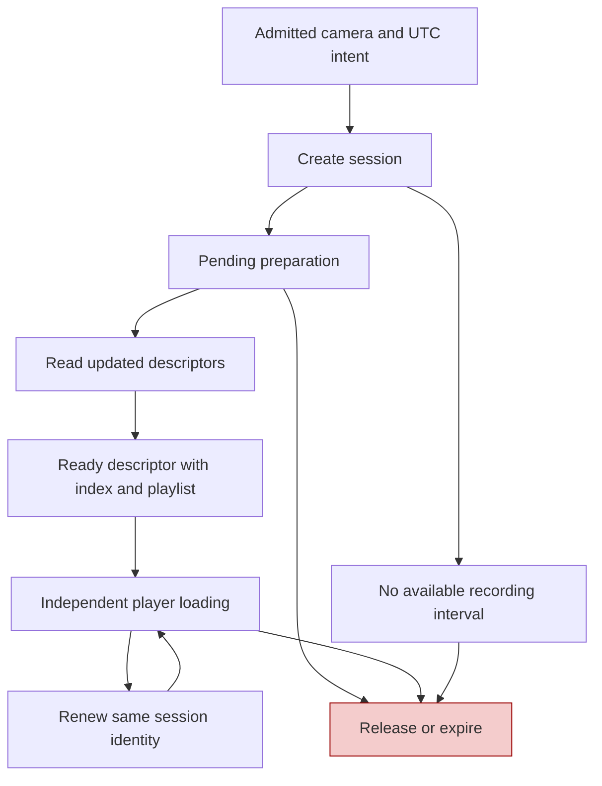
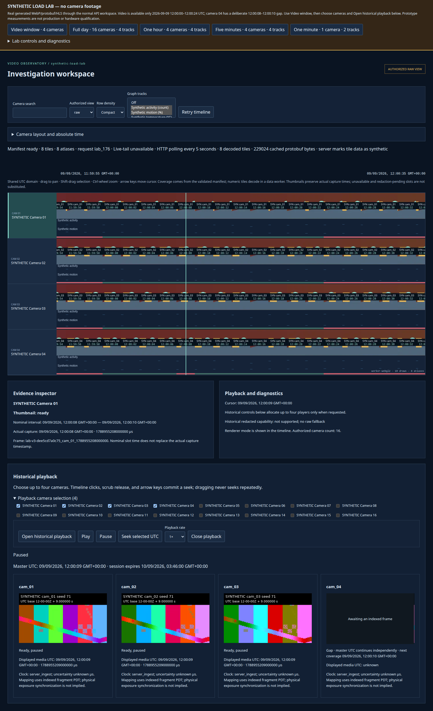
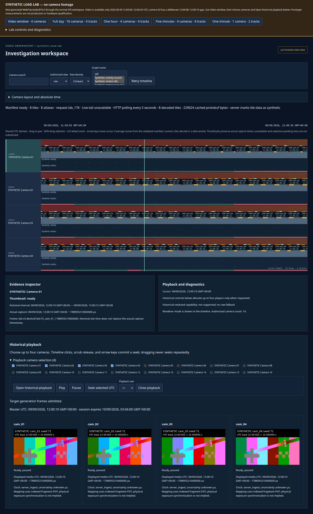

# Synchronizing Four Video Players Against One UTC Clock

Four HTML video elements can be playing at once while showing four different moments. Each has its own media timeline, buffering history, decode state and scheduling delays. A shared Play button establishes an action, not a temporal relationship. Historical investigation requires a stronger model: the application chooses one UTC target, each player maps that target into authorized local media time, and the interface distinguishes valid footage from a gap or an obsolete frame.

Video Observatory implements that model with HLS/MSE, an independent monotonic master clock, session-scoped indexes, fragment-local UTC mappings and explicit presentation readiness. The interesting part is not invoking `play()` four times. It is deciding what a frame means and when displaying it is justified. This article follows the implementation at the pinned September 10 checkpoint and a real seek-recovery defect found during its validation.

> [!summary]
> - UTC is the coordination domain; `video.currentTime` is local to a particular media mapping.
> - A session authorizes resources, an index describes them, and a verified fragment binds them to the player timeline.
> - A bounded readiness barrier permits progress without declaring slow or gapped players ready.
> - Decoding can proceed behind an opaque cover while presentation remains subject to temporal validation.

Series: [[PROJ - Video Observatory - Technical Deep Dive Series]]. Earlier project report: [[PROJ - Video Observatory - Evidence Correctness in a Browser Video Timeline]].

## 1. Distinguish the clocks before trying to synchronize them

The system uses several time quantities that cannot be substituted for one another:

| Quantity | Meaning |
|---|---|
| UTC microseconds | The requested historical instant and indexed media intervals |
| Media seconds | Position within the HLS/MSE media timeline used by a video element |
| Encoded PTS ticks | Presentation timestamps interpreted using a codec configuration's timescale |
| Monotonic browser milliseconds | Elapsed time used to advance the application master clock |
| Wall-clock milliseconds | Current calendar time used for session expiry checks |

Encoded presentation timestamps do not inherently identify UTC. Conversely, a UTC target does not say which local `currentTime` should be assigned after a gap, timestamp reset or discontinuity. The relationship needs explicit metadata and a defined validity interval.

The lab's clock quality is labeled `server_ingest`, with unknown uncertainty and source offset. Its generated movie labels and indexed UTC are synthetic construction. Even exact agreement between displayed indexed times would not prove that real cameras exposed their sensors simultaneously. That separate physical-clock question is not answered by browser synchronization. [S1, S5]

## 2. Sessions are bounded authorization and resource lifetimes

Opening playback begins with an admitted intent, not direct access to an arbitrary playlist URL. `playbackIntent` checks that the requested camera IDs are unique, authorized and within the smaller of four players or the server limit. It rejects unsupported views, including a historical redacted view when the server does not advertise that capability. It requests the `sub` stream and the `hls_mse` player mode. [S1]

The usual requested interval begins ten seconds before the target and ends 120 seconds after it, for a total of 130 seconds, subject to the server's maximum span. That is a request window, not a promise of continuous recording. The lab advertises generated media only for 2026-09-09 12:00:00–12:00:24 UTC. A session can validly contain missing coverage over most of its requested interval.

The returned session must match the intent's generation, view, stream and requested bounds. Its player descriptors must match the requested cameras, and ready players must supply both manifest and index URLs under the correct session/camera paths. An expired session is rejected. Schema validation alone would not establish these relationships.



The lab limits active sessions to eight and admits no more than four cameras per session. Sessions expire after sixty seconds; renewal extends them only within a thirty-minute total lifetime. The panel checks maintenance every second, renews after twenty seconds and polls pending descriptors between renewals. Nineteen actual renewals occurred during the longer four-player campaign. [S2, S5, E1]

Closing cancels current request eligibility, pauses the clock, cancels the barrier, removes the player components and attempts session release. A late create response is released rather than adopted into a newer interaction. Renewal responses are checked against the current session identity; unchanged descriptors are retained so renewal does not unnecessarily rebuild decoders. These are lifecycle rules, not optional cleanup conveniences.

## 3. Turn an index into explicit media grants

A ready descriptor leads first to `loadPlaybackIndex`. The loader bounds pagination to eight pages and limits the merged result to 2,048 segments, 50,000 sample entries and 256 configurations. It rejects repeated cursors and checks camera/request-window scope on every page. [S1]

The resulting grant map identifies which URLs the HLS loader may fetch and how much data each may return. The playlist has a 256-KiB allowance, initialization assets a 4-MiB allowance, and each media segment an indexed byte length with a 32-MiB maximum. A segment URL must agree with its media ID and session path and reference a known codec configuration. Overlapping indexed presentation intervals are rejected rather than guessed through.

The custom HLS loader rejects ungranted URLs before networking, uses same-origin credentials, refuses redirects and validates byte-range responses. Its tests distinguish a legitimate zero-range sentinel from an actual partial request and reject a server that ignores a requested range. A 403 triggers authorization handling instead of quietly retrying as a less restricted view. [S6]

This design narrows the behavior delegated to hls.js. The library still handles HLS/MSE mechanics, but it cannot freely expand the application's resource authority just because a playlist mentions another URL.

## 4. Map time locally, not with one offset for the whole session

For one verified fragment, let $u_0$ be its UTC presentation start in microseconds and $m_0$ its corresponding local media start in seconds. Inside that fragment's valid interval,

$$
u(m)=u_0+\operatorname{round}((m-m_0)10^6).
$$

The inverse is

$$
m(u)=m_0+(u-u_0)/10^6.
$$

These formulas are simple. The difficult work is proving that the fragment and interval are the correct ones.

`MediaTimeMap.bind` resolves the fragment URL through the authorized URL rules, derives UTC from playlist program-date-time, and matches it against an indexed segment with that exact asset URL. It checks finite timing, positive bounded duration and UTC agreement, allowing millisecond-level boundary tolerance around indexed decode/end bounds. It clips the entry to indexed presentation coverage and rejects ambiguous overlap in local media time. Binding is updated after fragments are buffered, using hls.js timing information. [S3, S4]

The current client primarily binds fragment PDT plus local fragment start/startPTS. The generated index also records PTS/UTC anchors and codec timescale, but this is not a client that computes every displayed timestamp directly from per-sample tick records. The lab's segment sample arrays are empty. Distinguishing the fields available in a protocol from the fields a playback path actually consumes prevents an inflated description of the implementation.

### A discontinuity makes a global offset incorrect

The unit-test fixture gives a precise example:

| Fragment | Local media interval | UTC interval relative to base |
|---|---|---|
| A | [0, 4) seconds | [0, 4) seconds |
| B | [4, 8) seconds | [10, 14) seconds |

At local media time 4 seconds, the correct UTC is base plus 10 seconds. A global offset derived from fragment A would report base plus 4 seconds, incorrectly filling a six-second gap. `toMedia(base + 5 seconds)` therefore returns null; `toUtc(4)` returns base plus 10 seconds. The test property-checks integer-microsecond round trips within both fragments. [S7]

This is a didactic fixture, not a claim that the real HLS engine always concatenates media timestamps this way. The production-facing rule is independent of that detail: select a verified fragment mapping at the current media position, and return unknown when no valid entry exists. Explicit declared gaps override otherwise available mappings, including gaps inside a fragment.

## 5. Advance UTC independently of the cameras

`MasterClock` stores an anchor UTC, an anchor from `performance.now()`, a playback rate and a running flag. While running,

$$
U(p)=U_a+\operatorname{round}((p-p_a)1000r).
$$

Here $p$ is monotonic milliseconds and $r$ is the selected playback rate. Pausing stores the current UTC as a new anchor. Changing rate also first stores the current UTC, preventing a rate change from reinterpreting all elapsed time since the previous seek. [S3]

No camera is elected as the master. If one camera has a gap, the application clock can continue and other cameras can display valid footage. A camera's decode stall similarly does not redefine the requested historical moment for every other player.

The master clock drives timeline cursor updates through `setCursor`, not through the seek-commit callback. User commits—timeline clicks, scrub release or keyboard steps—enter a separate coordinated seek path. This avoids the application treating its own clock updates as new user seek requests. [S2]

## 6. Coordinate seeks without waiting forever

A committed seek inside the existing request window pauses and reanchors the master, increments a seek generation and starts a `SeekBarrier` for the selected cameras. A target outside the window creates a new session for the same player set. The panel remembers whether playback should resume after the barrier. [S2]

Each ready report carries the camera and seek generation. Reports from an earlier seek cannot satisfy the current barrier. The barrier releases when every camera reports ready or after two seconds. Releasing on the deadline does not mark the remaining cameras ready; they remain covered or gapped while the master may resume. The deadline is a bound on collective waiting, not a guarantee of two-second decoding. [S8]

The distinction is visible in the UI: “readiness deadline reached” means the group stopped waiting, not that all frame evidence was accepted.

## 7. Treat frame presentation as a separate state

Assigning `currentTime` does not guarantee that the visible image has changed. A seek can be in progress while the video surface still contains a previous frame. `HistoricalPlayer` therefore starts concealed and invalidates displayed-frame state on new seeks, gaps and visibility transitions. [S4]

When supported, `requestVideoFrameCallback` supplies the media timestamp associated with a presented frame. A local frame epoch invalidates callbacks from earlier seeks. Before revealing a seeking/concealed player, the implementation requires a non-null mapped UTC within 150,000 microseconds of the current target, at least current frame data (`readyState >= 2`) and no active seek.

```text
new seek:
    pause and conceal
    clear displayed-frame timestamp
    increment frame epoch
    resolve target through current fragment mappings
    if target is absent: report gap or mapping unavailable
    otherwise assign local media time and request fresh frames

fresh-frame readiness:
    require current callback epoch
    map presented media timestamp into indexed UTC
    reveal only when target tolerance and media readiness checks pass
```

This pseudocode summarizes the transition; the running-master recovery behavior is described below. On browsers without video-frame callbacks, the code falls back to element media time and readiness rather than possessing equivalent direct frame-callback evidence. That path should not be described as the same observability guarantee. Separately, unsupported HLS/MSE does not fall back to native HLS, because native multi-camera mapping has not been qualified.

The 150-ms check is a reveal/readiness condition, not an invariant enforced by covering every continuously playing frame whenever drift exceeds 150 ms. Once revealed, drift is handled by the correction policy. This distinction matters when interpreting synchronization claims.

## 8. Correct drift without making every discrepancy a seek

Define drift as mapped player UTC minus master UTC. Positive drift means the player is ahead. `DriftController` implements three ranges:

| Absolute drift | Action |
|---|---|
| At most 50 ms | Use the requested rate |
| Above 50 ms through 200 ms | At 1×, slow an ahead player to 0.95× or speed a behind player to 1.05× |
| Above 200 ms | Seek after the excessive drift persists for 500 ms |

At 0.5×, 2× or 4×, the intermediate range does not add the ±5% nudge. Returning within 200 ms resets the sustained-drift timer. Unknown mapped time resets it and produces a gap action rather than a fabricated drift value. [S3]

A 100-ms behind player at 1× receives rate 1.05. In an ideal uninterrupted interval, an extra 0.05 seconds per real second would remove that error in about two seconds. This is an explanatory calculation, not a measured convergence guarantee under browser scheduling, buffering or repeated user input.

## 9. The moving-target seek defect

The first broad P4 production-browser run failed its four-player six-second fixture: one player remained covered until the clip ended, after which all players were gaps. Two isolated repeats passed. That result showed load sensitivity, not proof that the broad failure was harmless. [E2]

The recovery path was pausing media while repeatedly moving it toward a running master. Consider a simplified timing example: the player seeks to a target, but by the time a frame becomes observable the master has advanced beyond the reveal tolerance. The next recovery check moves the stationary media target again. Under sufficient delay, each otherwise valid frame is obsolete before admission. Faster seeking alone does not remove this structural problem.

Commit `4c96bff` changed recovery so a running master permits `element.play()` while the video remains covered. Hidden decoding can advance with elapsed time, and the bounded drift controller decides when a hard correction is needed. Paused-master seeks still pause and converge on a fixed target. The code did not enlarge the readiness tolerance, disable the opaque cover or lengthen the old fixture to manufacture a pass.

The following comprehensive batch passed 25 production-browser cases, eight lab-browser cases and 92 unit/property tests. That is evidence for the changed implementation, not a universal assertion that every machine recovers without delay. [E2]

## 10. Gaps and visibility are normal states

Camera 04's lab clip omits the actual segment covering 12:00:08–12:00:10. Later media is associated with another epoch and a playlist discontinuity. At 12:00:09, the correct display is a cover with unknown displayed UTC and the next coverage boundary, while the other cameras remain usable.



*Only camera 04 is concealed in the deliberate missing interval. The other players show indexed frames. This tests an absent segment, not a visual imitation of a recording gap.*



*After seeking into the next interval, all four generated clips are ready. The test also compares canvas captures and requires four distinct pixel payloads. Agreement of indexed UTC is not physical camera synchronization.*

Intersection visibility has its own lifecycle. Offscreen players pause, stop loading, conceal, clear observed frame state and invalidate callbacks. Returning onscreen reloads an unfinished manifest or seeks to the current master before revealing. An unexpected consequence appeared during measurement: opening a tall diagnostics panel moved videos offscreen. Closing it caused legitimate recovery, so a screenshot taken immediately afterward showed covers despite an earlier all-ready assertion. A measurement action changed the state being measured.

Closing playback destroys hls.js, cancels callbacks/timers, disconnects observers, clears the element source and releases the session. The final campaign had zero video elements, zero active sessions and idle generation/transfer queues. Four clips remained in the bounded warm server cache by design; session release is not cache erasure. [E1]

## Source and evidence guide

| Reference | Source at the pinned repository checkpoint |
|---|---|
| S1 | `web-ui/src/playback/session.ts`: `playbackIntent`, `validateSession`, `loadPlaybackIndex` |
| S2 | `web-ui/src/playback/PlaybackPanel.tsx`: `open`, `commitSeek`, renewal and tick effects |
| S3 | `web-ui/src/playback/time-map.ts`: `MediaTimeMap`, `MasterClock`, `DriftController` |
| S4 | `web-ui/src/playback/HistoricalPlayer.tsx`: `seekTarget`, callback epochs, observer and readiness interval |
| S5 | `web-ui/lab/playback.ts`: generated sessions, actual omitted segment and renewal limits |
| S6 | `web-ui/src/playback/loader.ts`; `tests/playback.test.ts`: URL, range and authorization checks |
| S7 | `web-ui/tests/playback.test.ts`: local-fragment round-trip and gap properties |
| S8 | `web-ui/src/playback/barrier.ts`: generation-checked two-second barrier |
| E1 | [Campaign exports](_assets/vo-deep-dive-campaign.json), including nineteen renewals and final cleanup |
| E2 | [Final validation](_assets/vo-deep-dive-validation.log); source ticket `sources/p4-final-contract-production-validation.log` and `p4-production-gap-reproduction.log` preserve the preceding failure and repeats |

The WEBUI-LAB-001 ticket and commits `4ac4855` and `4c96bff` record the historical-player implementation and recovery change. Application tests were not rerun merely to write this article; the retained executed evidence is identified as such.

## Continue the series

[[ARTICLE - Video Observatory - Scrolling Through a Day of Video Without Loading a Day of Video|Timeline scrolling]] explains the coordinate and request-generation model that feeds user seeks. [[ARTICLE - Video Observatory - Preserving Meaning While Aggregating Millions of Observations|Aggregation correctness]] applies explicit validity to numeric observations. [[ARTICLE - Video Observatory - Building a Synthetic Lab That Exercises the Real Product|The synthetic lab]] explains how the media and failure scenarios were produced and measured.
