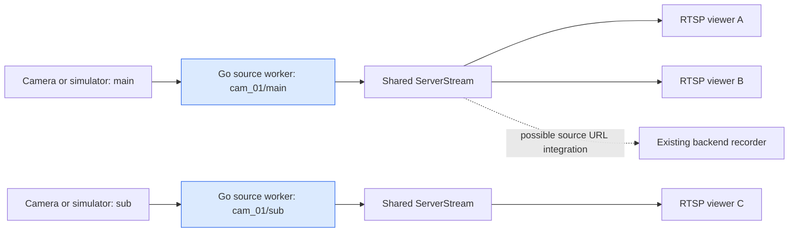
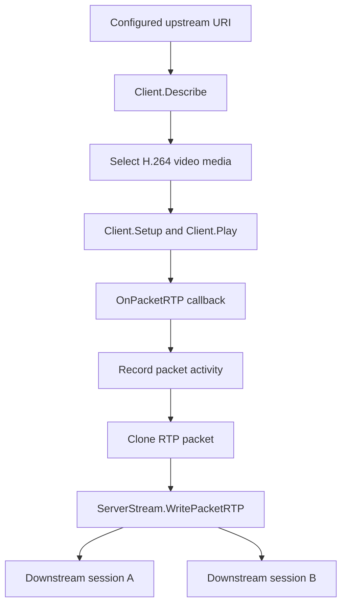
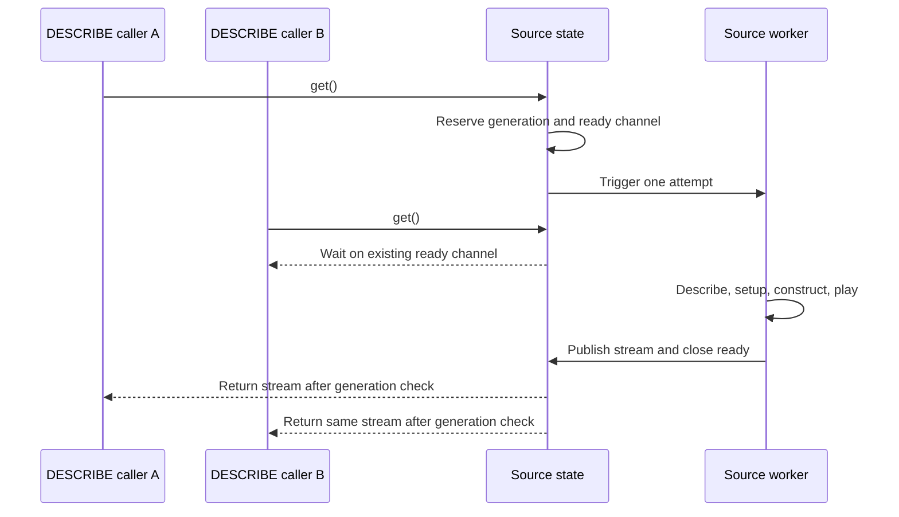
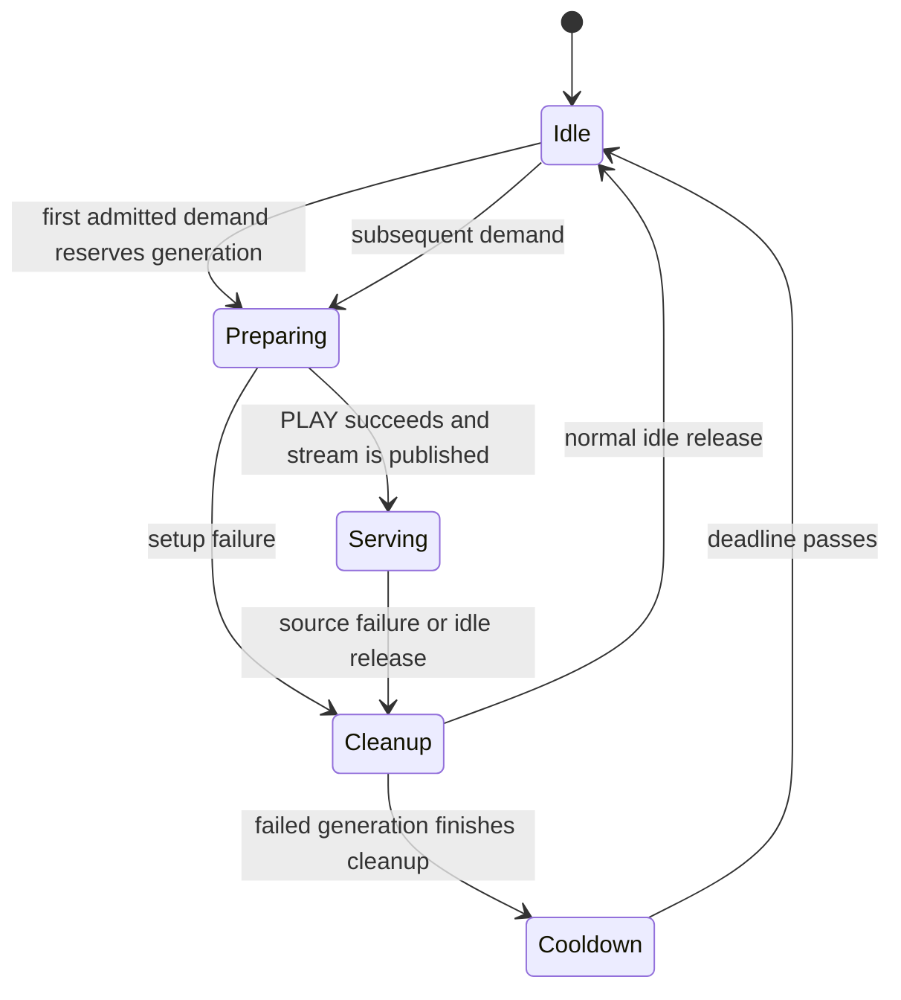

# Go RTSP Relay: Encoded Forwarding, Concurrent Demand, and Source Recovery

A camera relay can distribute H.264 video without decoding the images. The source has already encoded the video and packetized it for transport. A relay that understands RTSP, SDP, and RTP can establish an upstream session, receive those packets, and deliver them through independent downstream sessions. The difficult application logic is deciding when an upstream producer may exist, who retains it, and when it is safe to replace it.

The Go relay implements that logic with gortsplib, a persistent worker per configured presentation, and explicit synchronization between request handlers and source lifetimes. It runs beside the native GStreamer version in the September 7 streaming-system workspace. This report documents the Go implementation and its September 10 validation, explains its differences from the native version, and examines a test failure that would otherwise have overstated the disconnect evidence.

> [!summary]
> - The media path uses gortsplib v5.6.5 and forwards encoded H.264 RTP. No GStreamer runtime, decoder, or encoder is needed inside the relay.
> - Concurrent demand shares one preparation result. A source worker owns construction and teardown, and replacement remains demand-driven after cleanup and cooldown.
> - Twenty receivers decoded successfully; source restart preserved independent-camera playback. A corrected churn test required an actual SIGKILL rather than merely recording that a kill was attempted.

The preceding native implementation report is [[PROJ - RTSP Relay - Shared Media Producer Ownership and Recovery]]. This note preserves the subsequent Go work as a separate historical report. It does not replace that earlier account or imply identical behavior between the implementations.

## 1. What the Go version preserves

The service exposes stable mounts such as `/cameras/cam_01/main`. Several clients can read a mount while the relay maintains one upstream producer for that presentation. Main and sub are distinct presentations because they can contain different encoded streams. Each therefore has its own source URL, worker, shared downstream stream, and retry history.

The intended ownership rule is local and concrete: construction of a replacement for a presentation cannot begin until the preceding generation has completed its cleanup. This rule is stronger than merely looking at how many viewers are currently playing. A source can be preparing with no playing viewers, and a failed connection can be closing while a new request arrives. The application has to represent those intervals explicitly.

The Go implementation keeps the internal-testing scope of the native relay. It serves H.264 over TCP, binds an explicit loopback address, and accepts credential-free `rtsp://` upstream URLs. It does not record video, supply a browser application, implement authentication, or reload the registry in place. The existing backend and browser projects retain their responsibilities.



The backend edge is a possible integration point rather than a completed recorder test. A shared upstream reduces repeated camera pulls, while outbound traffic still scales with the number of consumers. This project has not measured a comparative CPU, memory, or latency advantage over the native implementation or another relay.

## 2. Why this path does not need GStreamer

RTSP is the session-control protocol. SDP describes the media and its formats. RTP transports encoded media packets. Decoding H.264 into images is a separate operation from parsing any of those structures. The Go relay needs the protocol operations and packet distribution, so gortsplib can provide its input and output without a native media-processing framework.

The upstream client performs DESCRIBE, selects an H.264 video format, performs SETUP for the selected media, and starts PLAY. The downstream server exposes a new description and independent client sessions. These upstream and downstream sessions do not become one transparent network connection: the library owns downstream protocol state and transport identity.

The application constructs a new downstream `description.Media` containing the chosen H.264 format and a `ServerStream` containing that media. It does not forward every media section from the upstream SDP. Audio and other codecs are outside the selected data path. An upstream presentation without an H.264 video format is rejected; multiple matching formats are also rejected rather than selected arbitrarily.



Cloning the packet is an ownership choice. In the pinned gortsplib implementation, the server stream writer assigns its local SSRC into the supplied RTP header before marshaling it. Passing a clone keeps that output-side mutation from changing the packet object received by the upstream callback. The encoded payload remains encoded; the relay adds neither an H.264 encoder nor decoder.

This also establishes a timing limitation. The code calls `WritePacketRTP`, whose server implementation supplies its current time for sender-report bookkeeping. It does not explicitly forward upstream RTCP sender reports or supply verified original capture timestamps through `WritePacketRTPWithNTP`. Successful decoding therefore does not establish original capture-time provenance. That qualification remains necessary before treating the relay as a trusted timestamp source for recording.

## 3. A separate module with an explicit input contract

The workspace had two existing sibling modules and no repository-root Go module. A standalone `rtsp-relay-go/go.mod` was created after explicit authorization. It leaves the native implementation and sibling module boundaries intact. The resolved dependency graph uses Go 1.26.1 as its minimum declaration and pins the Go 1.26.8 toolchain; gortsplib is v5.6.5 and Glazed is v1.4.3.

The configuration establishes all source identities before the server starts:

```json
{
  "version": 1,
  "address": "127.0.0.1",
  "port": 8555,
  "sources": [
    {
      "camera_id": "cam_01",
      "profile_id": "main",
      "upstream_uri": "rtsp://127.0.0.1:8554/cam_01/main"
    }
  ]
}
```

`ParseConfig` uses `encoding/json` with `DisallowUnknownFields`, rejects a second trailing JSON value, and validates the decoded structure. The file reader bounds input by reading at most 65,537 bytes; the parser rejects anything over 64 KiB. Version must be 1, the listener must be an explicit loopback IP, the port must be between 1 and 65535, and the registry must contain one to sixty-four sources.

Camera IDs match `[A-Za-z0-9_-]{1,64}`. Profiles are `main` or `sub`. The upstream URI must have an RTSP scheme and host, contain no credentials or fragment, and fit the configured length bound. Duplicate mounts and exact duplicate upstream URI strings are errors. Exact string comparison does not establish that two different hostnames identify the same physical camera.

The native `latency_ms` field is deliberately absent. It controls GStreamer's jitter buffer, and the Go relay exposes no equivalent setting. Accepting it and doing nothing would create a misleading configuration contract, so the Go parser rejects it as unknown. The two implementations share presentation semantics but do not promise interchangeable configuration files.

Duplicate JSON-key detection is not separately implemented; the standard decoder resolves repeated keys according to its behavior. Configuration validation is useful input checking for the current internal service, not a claim that every possible ambiguous JSON representation has a dedicated rejection path.

## 4. Request handlers locate presentations; workers own connections

`Server` holds an immutable map from mount paths to source objects. DESCRIBE and SETUP first reject userinfo and downstream query strings, including an explicitly empty query. They then locate the presentation using the path supplied by the library. Unknown paths return 404; rejected URL forms return 400. A presentation that cannot provide current media returns 503.

Track-path parsing belongs partly to gortsplib. Its downstream description advertises `trackID=0`, and SETUP dispatch supplies a presentation path after parsing the track control. The application therefore does not use GStreamer's `/stream=0` convention. The tested rejection cases cover a query, an extra suffix, and an unknown mount; they are not an exhaustive statement about every normalization performed by the library.

A DESCRIBE request can start the upstream before any SETUP session exists. That is necessary because a downstream description depends on the selected upstream format. It also creates a lifecycle obligation: a client that requests a description and disappears must not retain the source forever without further demand.

The source object separates the relevant state:

| Field | Responsibility |
|---|---|
| `active` | A generation has been reserved and has not completed cleanup. |
| `stopping` | Handler admission should no longer return the current stream. |
| `generation` | Monotonic application ID for a producer lifetime. |
| `ready` | Notification that this generation's preparation attempt has completed. |
| `trigger` | Buffered request for the persistent worker to run a generation. |
| `stream` | Current prepared downstream stream, when available. |
| `sessions` | SETUP sessions associated with their generation. |
| `lastDemand` | Time of the latest admitted DESCRIBE or SETUP demand. |
| `next`, `attempts` | Cooldown deadline and capped retry history. |

These fields are protected by the source mutex. The immutable source registry needs no replacement protocol during a run, because configuration reload is not implemented.

## 5. Concurrent callers share one preparation result

The central request method is `source.get`. Under the mutex, it rejects stopping media or an unexpired cooldown and records the demand time. If no generation is active, it reserves one, increments the generation number, creates a fresh `ready` channel, and sends one trigger to the worker. Subsequent callers see that active generation and wait on the same channel.

The reservation occurs before releasing the lock. If it happened afterward, two callers could both observe an inactive source and each request construction. The worker is the only constructor, but serial execution alone would not prevent those duplicate requests from creating unnecessary sequential lifetimes. The reservation establishes that one preparation attempt satisfies the concurrent group.

```go
if !p.active {
    p.active = true
    p.generation++
    p.ready = make(chan struct{})
    p.trigger <- struct{}{}
}
ready := p.ready
generation := p.generation
p.mu.Unlock()
```

The caller waits for server cancellation, a twelve-second timer, or readiness. It then reacquires the mutex and verifies that the source is not stopping, that the generation still matches, and that the stream is non-nil. Only then can it return the stream and record a SETUP session.

The `ready` channel is a completion notification, not a promise of success. Failed preparation also closes it so waiting requests do not remain asleep until their timers expire. Those callers observe a nil stream or changed generation and receive unavailability. This distinction allows the same notification mechanism to handle successful preparation and failed attempts without inventing separate waiting protocols.



A request's twelve-second wait is not the total lifetime of the generation. The underlying protocol operations have their own timeouts, and the worker belongs to the service rather than one downstream connection. A requester timing out does not immediately cancel a shared attempt that another requester could still use. Unused successful media is subsequently eligible for idle release.

## 6. One worker serializes complete source lifetimes

A worker is started for each configured source through the server's `errgroup`. It waits for either cancellation or a trigger. After a trigger, it executes `runGeneration` synchronously and does not consume another trigger until that call and its deferred cleanup finish. Under the source lock it then clears the published stream and active state, records cooldown when appropriate, and releases any remaining readiness waiters.

This organization differs from the native callback graph. The C++ implementation needs explicit generation checks across several GObject-owned callbacks and a separate retry gate. The Go implementation still uses generation IDs for request/session consistency, but the persistent worker itself serializes creation and cleanup. There is no application reconnect goroutine racing the previous source worker to install a replacement.

```text
worker:
    wait for demand or service cancellation
    run one generation through completion and cleanup
    lock source state
    clear active, stopping, and published stream
    if this was a source failure rather than service cancellation:
        compute cooldown from retry history
        set next allowed demand time
    close readiness notification if preparation never published
    unlock
    repeat
```

The map from sessions to generation IDs prevents PLAY from treating a session associated with an older lifetime as current. A valid PLAY requires a non-nil stream, a non-stopping source, and a session entry matching the current generation. Session-close callbacks remove their entries from the source maps.

A generation number is an application identity rather than an RTP SSRC or RTSP session identifier. Those protocol identifiers have their own library-managed meaning. Keeping the concepts separate makes logs and stale-state checks useful without pretending that all identity is represented by one number.

## 7. Recovery begins with cleanup and ends with renewed demand

`runGeneration` starts a gortsplib client, installs cancellation-driven client closure, negotiates the upstream, initializes a downstream stream, and registers an RTP callback. It publishes the stream after the upstream PLAY request succeeds. A local errgroup runs `client.Wait`; a buffered result channel lets the control loop observe termination alongside cancellation, periodic checks, and packet-write errors.

The RTP callback records packet activity, clones the packet, and writes it to the downstream stream. A failed stream write is sent through a one-element error channel without blocking the packet callback. The control loop can then fail the generation. Reader-specific write failures take another path: `OnStreamWriteError` closes that reader's session and logs `reader_write_error`, rather than deliberately stopping the camera source.

Source termination, packet silence, preparation timeout, and forwarding errors leave `runGeneration` through its cleanup. The defers close the upstream client, wait for its reader loop, mark the stream stopping, and close the downstream stream. There are repeated client-close calls on different cleanup paths; they converge on the library's close operation. The application retains `active` until all these defers return.

This last condition is the replacement invariant. Request handlers may encounter media that is becoming unavailable, but they cannot reserve another producer while the old worker is still cleaning up. Once `ServerStream.Close` has closed affected downstream sessions and `runGeneration` has returned, the worker may release ownership and publish retry state.

The Go cooldown starts when cleanup has returned to the worker. This differs from the native retry gate, which records its deadline when failure is first observed and separately waits for ownership release. Both approaches prevent replacement before release, but the same nominal retry delay can produce different elapsed recovery times when cleanup is slow.

## 8. Retry policy is demand-driven

The delay sequence is 1, 2, 4, 8, 16, then 30 seconds, remaining capped at 30. The worker computes this delay for a failed generation and stores a deadline. Requests during cooldown return unavailable. They do not increment the attempt counter simply by arriving; another attempt requires a new generation after the cooldown expires.

```go
func retryDelay(attempt uint) time.Duration {
    if attempt >= 5 {
        return 30 * time.Second
    }
    return time.Second * time.Duration(1<<attempt)
}
```

The implementation has no background retry timer that keeps reopening a failed idle source. Once the previous attempt ends, the worker waits for another request. Existing viewers lose the failed downstream stream and reconnect. This preserves the explicit internal policy of closing failed consumers instead of attempting transparent track replacement underneath them.



The diagram describes application transitions, not the library's entire RTSP state machine. For example, cooldown expiration does not itself send a trigger, and a prepared stream can exist before a downstream receiver has decoded a frame.

## 9. Packet timing and idle retention answer different questions

The generation establishes a local `epoch := time.Now()`. Packet callbacks store `time.Since(epoch).Nanoseconds()` in atomic first/last counters. The watchdog compares elapsed durations against those counters. This uses Go's monotonic elapsed-time behavior rather than subtracting wall-clock timestamps that could change when the system clock is adjusted.

A one-second ticker checks packet freshness. After PLAY starts, ten seconds without a packet produces an initial-packet timeout. After packets have arrived, more than five seconds of silence fails the source. The client also has a five-second read timeout and two-second write timeout. These settings overlap but serve different parts of the path; none should be presented as a single hard total recovery deadline.

Retry history resets when more than thirty seconds have elapsed since the first packet and the current watchdog iteration has not already failed for silence. This is an activity heuristic. It is not proof of continuously changing images, nor does the code decode video to detect frozen content. The same limit applies to the native packet probe.

Idle release examines downstream ownership instead of packet age. It releases a presentation when there are no recorded SETUP sessions and the latest DESCRIBE/SETUP demand is older than five seconds. A stream can therefore keep receiving perfectly healthy packets and still close because no session needs it.

The five-second interval is measured from demand, not from the moment the last viewer leaves. If a viewer has been active for a minute and then exits, that last demand is already old; the next ticker may release the now-unused source. Conversely, a DESCRIBE-only request briefly retains the source without creating a SETUP session. This precise condition matters when writing tests that expect an idle generation to disappear between scenarios.

The server uses a thirty-second idle session timeout. Abrupt connection loss and normal TEARDOWN can have different cleanup timing inside the library, while session-close callbacks eventually remove application bookkeeping. The verified churn scenario demonstrates continued playback for an independent stable viewer through the exercised disconnect patterns.

## 10. Cancellation reaches blocking protocol operations

The command entrypoint uses `signal.NotifyContext` for SIGINT and SIGTERM. `Run` derives a service context, starts source workers, waits for the server through an errgroup task, and starts another task that closes the server when the context ends. An unexpected server termination cancels the source workers; normal cancellation allows the group to finish without reporting the expected close as an application error.

Each started upstream client registers `context.AfterFunc(ctx, client.Close)`. That is necessary because the worker can be inside a blocking library operation such as DESCRIBE while cancellation arrives. Merely checking `ctx.Done()` in the later playback loop would not interrupt that earlier call. Closing the client gives those operations a termination path.

The function-level cleanup also closes the client and waits for `client.Wait` where that reader task exists. Only after workers finish does `Run` log `stopped`. A passing shutdown log is evidence that this run reached the end of its cleanup path; the implementation does not claim a formal worst-case bound over every native network or scheduler condition.

The retained integration logs were checked after shutdown for `stopped`, `DATA RACE`, and panic output. Those checks supplement the race-enabled unit tests because the real source/receiver scenario exercises callback interleavings absent from small state tests.

## 11. Glazed supplies the CLI and embedded help

The executable exposes `--config`, `--check-config`, and `--log-level`. The command is a Glazed `BareCommand`, appropriate for a long-running service that reports events to stderr rather than emitting a result table. Its settings struct uses Glazed tags, and the command builder owns Cobra parsing.

The parser uses the explicit Cobra/default middleware chain. No application environment loader is added. JSON is loaded from the named file, and zerolog is constructed from the parsed log-level choice. This keeps command settings explicit while still using the framework's field definitions, validation, and help integration.

The embedded Markdown entry is read through a `go:embed` string, parsed with `help.LoadSectionFromMarkdown`, registered with the help system, and connected to the Cobra root. Unlike the native executable's separately browsed Glazed entries, the Go executable directly serves its topic through the help command.

From `rtsp-relay-go/`:

```sh
go run ./cmd/rtsp-relay-go --config config/example-local.json --check-config
go run ./cmd/rtsp-relay-go help rtsp-relay-go-guide
```

Normal serving removes `--check-config` and runs in a managed tmux window. The configuration check opens no camera connection and no listener. Unlike the native check, it does not need to verify installed GStreamer elements. Top-level errors propagate to `main`, which prints the error and exits with code 2; normal completion returns zero.

`make lint` builds the Glazed analyzer from the module's selected dependency and runs it through `go vet`, followed by ordinary vet. The analyzer binary lives under `/tmp`, and build artifacts remain ignored. Pinning the analyzer to the dependency prevents command-authoring checks from silently using a different framework API version.

## 12. Reusing the simulator made the comparison concrete

The existing integration harness gained an `--implementation go` choice. It keeps the fixture, camera processes, receiver processes, and core assertions, while selecting a Go configuration and launching the Go relay through `go run -race`. The native path remains available. This avoids claiming comparable results from unrelated test setups.

The simulator is an independently executed Go source backed by encoded fixtures. FFmpeg provides independent decoding. Although the simulator and Go relay both use gortsplib, the receiver checks are not simply observations of another object in the relay process. That gives useful local interoperability evidence, while real-camera differences still need separate testing.

The first registry checkpoint decoded main and sub on camera 1 and main on camera 2. Each active profile had a sampled upstream reader peak of one, while unused camera 2 sub remained at zero. Invalid downstream requests were tested during valid shared-media activity. The later full checkpoint added twenty receivers, churn, and source recovery.

| Measurement | Retained Go result |
|---|---|
| Full registry frame counts | 116 main, 78 sub, 112 second-camera frames; all exits zero. |
| Invalid URLs | Query returned 400; unsupported suffix and unknown mount returned 404. |
| Fan-out | Twenty overlapping active decoders; all exited zero with 169–174 frames. |
| Source sampling during fan-out | Peak one upstream playing reader. |
| Source unavailable | Immediate unavailable request and real offline attempt failed. |
| Restored source | New receiver decoded 63 frames after restart. |
| Independent camera during recovery | Receiver decoded 376 frames. |
| Corrected abrupt churn | Killed receiver exited -9; stable receiver decoded 237 frames; two normal peers decoded 25 and 17. |
| Producer count during corrected churn | Exactly one generation served the interval. |

The table combines the full run and the corrected focused churn run. They are separate retained artifacts, rather than a rewritten claim that one original execution proved everything.

## 13. A test named “abrupt disconnect” did not initially prove one

The first full Go run returned success, but result review found an inconsistency: the transient receiver was labeled `abrupt_disconnect: true` and had exit code 0. The test started a two-second receiver, waited for frames, and called `kill`. By then the receiver had already completed normally. Attempting a kill was not evidence that SIGKILL terminated it.

The correction made that receiver long-lived and asserted both the precondition and the result:

```python
process = self.decoder(name, 'cam_01/main', 60 if i == 0 else 2)
if i == 0:
    self.wait_for_frames(name, process)
    assert process.poll() is None, 'abrupt receiver exited before SIGKILL'
    process.kill()
    process.wait()
    assert process.returncode == -signal.SIGKILL, process.returncode
```

A new focused `--case churn` path ran the corrected scenario without repeating already-successful fan-out and source-restart work. It recorded exit -9 for the killed receiver, continued decoding for the stable viewer, successful normal peers, and one producer generation. The original full summary remains preserved with its exit-0 result; the focused result supplies the missing abrupt-disconnect evidence.

This was a harness defect rather than a demonstrated relay failure. It changed what could legitimately be concluded from a passing result. Keeping the exact exit status in the artifact made that defect discoverable. A boolean scenario label alone would have concealed it.

## 14. What the tests establish, and what they leave open

`TestConcurrentDemandSharesGeneration` starts twenty concurrent calls to `get`, publishes one stream after observing a single trigger, and checks that every caller receives the same stream and only one generation was created. This is a focused state-synchronization test. It does not establish actual network sharing by itself; the simulator and independent decoder tests supply that separate evidence.

The configuration tests reject unknown fields, public listener binding, credentialed URLs, invalid profiles, missing required values, oversized input, trailing JSON, and duplicate sources. Other tests check retry delays, admission responses, Glazed config/help execution, and invalid log levels. The cancellation test uses a context canceled before `get` begins; it should not be described as exhaustive testing of cancellation at every preparation stage.

The fan-out harness counts still-running receiver processes with positive reported frame counts. Its overlap metric demonstrates concurrent receiver lifetimes that have decoded frames, not continuous frame progress at every instant. The simulator counts playing readers in one-second snapshots, which can miss a short allocated-session overlap. The serial source-worker design supplies an ownership mechanism, but a lossless source allocation/close trace would give stronger external evidence of its transient behavior.

The race detector passed the tested unit and media scenarios. It does not prove every possible execution race-free. Likewise, no slow-reader resource budget, overnight leak bound, H.265 path, authenticated deployment, or original capture-clock qualification is implied by the current smoke results. These are concrete future measurements when the intended use requires them.

Writing this report did not rerun the media scenarios. Its numerical claims come from the committed implementation diary and retained artifacts associated with `68ee932` and `ba97f1a`.

## 15. Running and extending the implementation

A useful working sequence from the module directory is:

```sh
make test
make lint
python3 ../rtsp-relay/tests/integration.py --implementation go \
  --case registry --output build/registry-review-1
```

For source lifecycle changes, use `--case recovery`. For disconnect handling, use `--case churn`. `make smoke` selects the final scenario and a fresh timestamped output directory. The harness creates a unique tmux server, owns its test ports and processes, preserves logs, and cleans up its services. Output directories must be new so failed evidence is not overwritten by a retry.

The next implementation choice should follow the consumer being added. Recorder integration needs explicit timestamp tests and backend recording checks. Additional codecs require format selection and downstream description changes. Stronger ownership qualification needs allocation/close instrumentation. A configurable jitter buffer would be a new Go feature with defined semantics, not a reason to silently accept the native `latency_ms` field.

The Go implementation provides a compact place to study the application's actual concurrency requirements. Protocol handling belongs to the library; source ownership belongs to one worker; callers share preparation through a channel and validate publication under a mutex. That arrangement explains both why concurrent readers share one producer and why source replacement waits for cleanup.

## Source map, evidence, and implementation history

The source repository is `/home/manuel/code/wesen/2026-09-07--streaming-system`. Paths below are relative to that checkout. Raw logs and validation artifacts remain in the source repository; this report includes the relevant measurements and explanatory excerpts without exporting those files into the vault.

| File | Reading purpose |
|---|---|
| `rtsp-relay-go/cmd/rtsp-relay-go/main.go` | Signal context, command execution, top-level exit handling. |
| `rtsp-relay-go/internal/relay/command.go` | Glazed field definitions, logger creation, config checking and embedded help. |
| `rtsp-relay-go/internal/relay/config.go` | Bounded JSON loading, identity rules and registry validation. |
| `rtsp-relay-go/internal/relay/server.go` | Handlers, source state, concurrent demand and retry-delay calculation. |
| `rtsp-relay-go/internal/relay/source.go` | Worker, upstream negotiation, RTP forwarding, watchdog and cleanup. |
| `rtsp-relay-go/internal/relay/server_test.go` | Concurrent preparation and command/admission checks. |
| `rtsp-relay-go/internal/relay/config_test.go` | Invalid-input cases and delay sequence. |
| `rtsp-relay-go/internal/relay/help.md` | Embedded usage and lifecycle entry. |
| `rtsp-relay-go/Makefile` | Race tests, build, module-matched analyzer and smoke commands. |
| `rtsp-relay/tests/integration.py` | Shared native/Go simulator scenarios and corrected SIGKILL assertion. |
| `rtsp-relay/tests/fanout.py` | Independent receiver progress and source-sampling definitions. |

The pinned library implementation was inspected locally under `/home/manuel/go/pkg/mod/github.com/bluenviron/gortsplib/v5@v5.6.5/`, including `client.go`, `server_stream.go`, `server_stream_format.go`, `server_session.go`, and the proxy example. These files ground the statements about client closure, track controls, stream closure, and output SSRC mutation.

The ticket directory is `ttmp/2026/09/10/RTSP-RELAY-001--design-fourth-project-rtsp-camera-relay/`. Its `reference/01-investigation-diary.md` contains the chronological implementation record. Step 9 documents module authorization, architecture and the first Go registry checkpoint. Step 10 documents twenty-reader recovery and the corrected churn test. The retained artifacts are `artifacts/go-registry.json`, `artifacts/go-final-smoke.json`, and `artifacts/go-churn-verified.json`.

Commit `68ee932` introduced the Go module, implementation, CLI, help and first evidence. Commit `ba97f1a` recorded final validation and corrected abrupt-disconnect testing. The earlier native report remains linked at the start of this note so a future contributor can compare the two implementations without losing their distinct histories.
