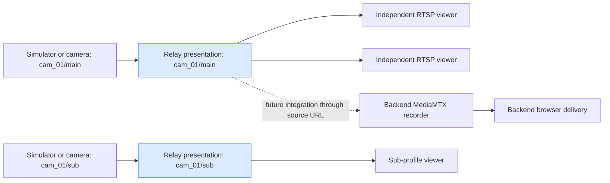
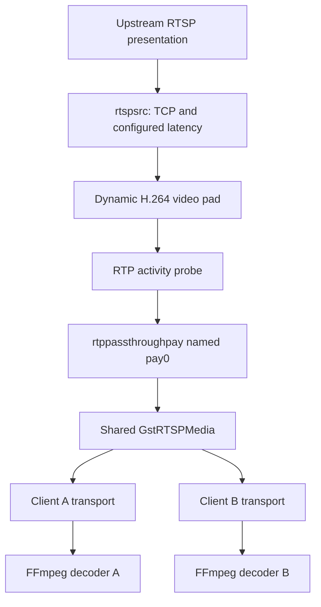
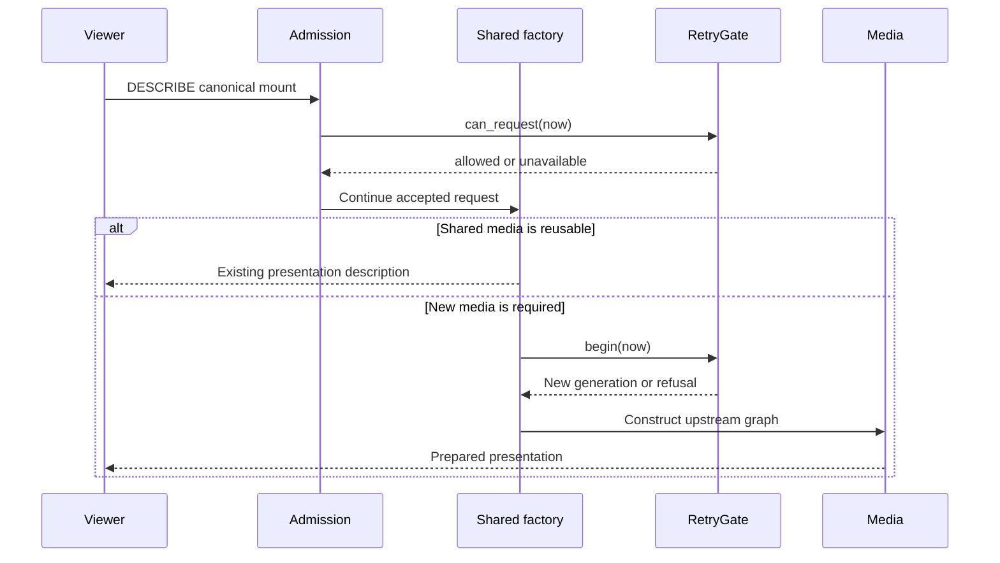
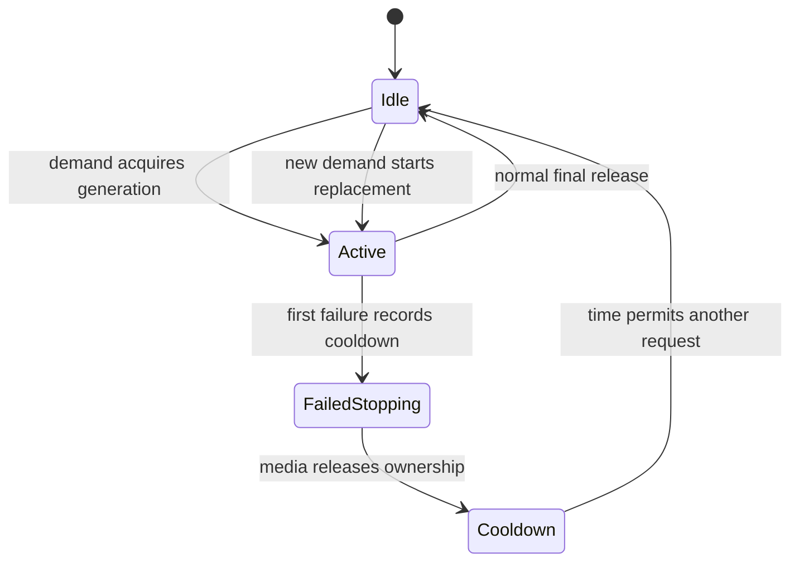

# RTSP Relay: Shared Media, Producer Ownership, and Recovery

The RTSP relay adds a shared source connection between a camera profile and its consumers. It receives encoded H.264 video through GStreamer and serves that video to independent RTSP clients. Its essential responsibility is to maintain a coherent producer lifetime while viewers arrive, disconnect, and reconnect after a source failure. Understanding this project requires following both the encoded packet path and the ownership state that permits that path to exist.

This report explains the implemented system as of September 10, 2026. The repository began as the September 7 streaming-system workspace; RTSP relay development and its retained validation belong to September 10. The original design guide contains a larger deployment roadmap. Here, implemented behavior, observed results, and proposed extensions are identified separately.

> [!summary]
> - A configured camera/profile has shared media and a generation-aware producer gate. Twenty concurrent decoders passed while the simulator reported one upstream playing reader in its sampled observations.
> - Recovery depends on releasing failed transport bindings before unpreparing media, then admitting a replacement only after ownership release and cooldown.
> - The current service is an internal H.264/TCP relay with a loopback listener. Recording, browser delivery, credentials, and capture-time qualification remain outside this implementation.

## 1. The responsibility added by the fourth project

The workspace already contains three distinct application responsibilities. The camera simulator creates repeatable source behavior. The backend controls ingestion and recording through its MediaMTX integration. The browser application works with backend-mediated resources and timelines. The fourth project, `rtsp-relay/`, adds an RTSP endpoint that several consumers can use without requiring each consumer to pull the original camera separately.

A useful unit of identity is a **presentation**, represented here by a camera ID and profile ID. A camera's main stream and sub stream can differ in encoded content and therefore require separate upstream producers. Saying “one connection per camera” would incorrectly combine these presentations. The implemented identity is `(camera_id, profile_id)`, with `profile_id` restricted to `main` or `sub`.

For each presentation, the intended application invariant is that at most one producer generation owns the source at a time. Serving twenty downstream viewers then means twenty client-side relationships with the relay and one upstream relationship for that presentation. It does not mean that downstream bandwidth disappears. If each viewer receives bitrate R, downstream traffic remains approximately N × R for N viewers, before transport overhead. The shared producer reduces repeated source pulls and avoids adding a decoder or encoder inside the relay; it does not establish a measured CPU or memory budget.



The dotted backend edge is a possible integration boundary, not a completed recorder qualification. The backend already represents sources by URLs, so a relay endpoint fits that boundary without inventing a new source adapter. Browser playback continues through backend delivery protocols; the browser is not expected to consume the relay's RTSP URL directly.

## 2. Protocol concepts needed to read the implementation

RTSP controls a media presentation: clients request a description, establish transport, and request playback. In the path exercised here, DESCRIBE obtains presentation information, SETUP establishes the advertised video track, and PLAY starts delivery. The encoded media arrives as RTP packets. The relay's upstream `rtspsrc` is an RTSP client; its downstream GStreamer RTSP server accepts independent clients. These are separate protocol relationships even when the media content is shared.

This separation explains why a successful listener startup is weak evidence. A relay can bind its port and register mounts while the camera is offline. It also explains why media preparation and decoded video require separate checks: a pipeline can exist before a receiver has enough encoded data to produce a frame. A late viewer may join between useful decoding starting points and wait before it produces images.

Three terms need to remain distinct throughout the report:

| Term | Meaning in this implementation |
|---|---|
| Presentation | Stable configured camera/profile identity and its public mount. |
| Producer generation | One attempt to construct and use the upstream media graph. |
| Downstream session | A client's RTSP session, with its own transport and expiry behavior. |

A presentation survives reconnection. A producer generation changes after replacement. Downstream sessions are created and removed independently of the presentation's configuration. Treating these as a single object would make it difficult to decide whether an old callback is still allowed to change current source state.

## 3. The encoded media path and the native implementation choice

The core graph contains an `rtspsrc` and an `rtppassthroughpay` named `pay0`. The source supplies dynamic pads after negotiating the upstream presentation. The application accepts video caps with `encoding-name=H264`, links an eligible pad to the payloader, and leaves decoding to downstream consumers. The current selector is intended for a presentation with one H.264 video track; it does not implement a general selection policy among several video tracks.



The passthrough element supplies the payloader interface expected by the RTSP server for an already packetized RTP source. Its documented use includes serving externally received RTP through `gst-rtsp-server`; the `pay0` name identifies the stream to the server. The current upstream documentation also marks `retimestamp-mode` as introduced in 1.26, so this 1.24.2 implementation does not set that property. See the [official rtppassthroughpay reference](https://gstreamer.freedesktop.org/documentation/rtp/rtppassthroughpay.html).

A small excerpt from `rtsp-relay/src/server.cc` captures the actual source configuration:

```cpp
g_object_set(source, "location", config.uri.c_str(),
             "protocols", GST_RTSP_LOWER_TRANS_TCP,
             "latency", config.latency_ms,
             "drop-on-latency", TRUE,
             "tcp-timeout", guint64{5000000}, nullptr);
```

The source jitter-buffer latency is configurable in milliseconds. The TCP timeout is five million microseconds. These are different mechanisms: one configures buffering behavior, while the other configures a native network timeout. Neither is an end-to-end recovery deadline. The application also adds packet-age monitoring, discussed below.

C++17 gives the application direct access to the GStreamer and RTSP-server interfaces used for media construction, transport cleanup, and lifecycle callbacks. This project has no new Go module. The existing Go simulator remains a separately executed source, which is useful for validation because it does not share the relay's media implementation.

The first environmental obstacle was a missing RTSP-server development library despite an installed GStreamer core and passthrough plugin. `scripts/local-deps.sh` downloads checksum-pinned Ubuntu 24.04 amd64 RTSP-server 1.24.2-1 packages and extracts them under ignored `.deps/`. CMake locates those headers and libraries directly and uses pkg-config for installed core dependencies. This is a reproducible local development option, not a portable package manager for every platform. The observed environment used GStreamer 1.24.2, json-c 0.17, and GCC 13.3.0.

## 4. Configuration defines identity before clients arrive

Startup reads a complete JSON registry. Each source contains `camera_id`, `profile_id`, `upstream_uri`, and `latency_ms`; the root contains `version`, `address`, `port`, and `sources`. All documented fields are required even where the C++ structures have initial values. Configuration is immutable during a run, so editing the file requires a process restart.

```json
{
  "version": 1,
  "address": "127.0.0.1",
  "port": 8555,
  "sources": [
    {
      "camera_id": "cam_01",
      "profile_id": "main",
      "upstream_uri": "rtsp://127.0.0.1:8554/cam_01/main",
      "latency_ms": 200
    }
  ]
}
```

This entry produces `/cameras/cam_01/main`. The public mount is derived from stable identity rather than copied from the upstream path. That separation permits a future source URL change without requiring a different public naming scheme, although the current implementation still interrupts service when restarted to load that change.

The parser in `src/config.cc` bounds input at 64 KiB, accepts one to sixty-four sources, requires version 1, and restricts the listener to an explicit loopback IP. Ports must be between 1 and 65535. Camera IDs match `[A-Za-z0-9_-]{1,64}`, profiles are `main` or `sub`, and latency ranges from zero to 5000 milliseconds. Upstream URLs must use `rtsp://`, have a host, and contain neither credentials nor a fragment. A remote upstream host is possible even though the downstream listener is loopback-only.

Unknown fields are errors. Duplicate mounts and exact duplicate upstream URI strings are also errors. Exact string comparison cannot identify two DNS aliases for the same physical source. The parser additionally leaves duplicate JSON-key resolution to json-c rather than detecting duplicate object keys independently. These are explicit limits of the current input contract. The JSON schema assists editors, while semantic checks such as loopback validation remain in the native parser.

## 5. Sharing requires both canonical identity and request admission

The server creates one `GstRTSPMediaFactory` subclass instance per presentation and enables shared media. A factory's generated cache key is the configured mount, independent of the admitted URL's host spelling. That prevents ordinary admitted aliases from allocating separate producer identities.

```cpp
gchar *canonical_key(GstRTSPMediaFactory *factory,
                     const GstRTSPUrl *) {
  return g_strdup(source_config(factory).mount().c_str());
}
```

Canonical identity alone does not validate requests. A request can encounter media that was already constructed by a prior viewer. If validation runs only in `create_element`, such a request could reuse cached media without passing that validation. The implementation therefore connects `pre-describe-request`, `pre-setup-request`, and `pre-play-request` on each client.

The admission function permits exact aggregate mounts, with `/stream=0` additionally accepted for SETUP because that is the advertised single-track path. Queries and userinfo receive 400; unknown mounts and unsupported suffixes receive 404. A valid mount whose producer is failed and stopping or cooling down receives 503. Other protocol failures can still be generated by GStreamer's negotiation machinery, so these application responses are not a complete RTSP error taxonomy.



Request admission and producer acquisition answer different questions. Existing healthy media should remain available to another client even though its producer is active. A new producer must be refused while any producer still owns the source. This is why `can_request` and `begin` cannot be replaced by one common boolean check.

## 6. Producer ownership is a small synchronized state machine

`RetryGate` owns a mutex, current generation number, active flag, failure flag, attempt count, and next allowed retry time. Media callbacks can run on different threads, so these policy values are read and changed under the mutex. The mutex does not surround native teardown or client traversal; holding it during those operations would couple a short policy decision to potentially complex media work.

The producer-acquisition method is short enough to read directly:

```cpp
std::optional<uint64_t> begin(int64_t now_us) {
  std::lock_guard<std::mutex> guard(mutex_);
  if (active_ || now_us < next_us_) return {};
  active_ = true;
  failed_ = false;
  return ++generation_;
}
```

The monotonically increasing generation number identifies one producer lifetime. Suppose generation 4 fails, releases ownership, and generation 5 starts. A delayed cleanup for generation 4 must not clear generation 5's active state. `finish(generation)` therefore changes active state only when the supplied ID equals the current ID. Failure handling similarly ignores stale generations and repeated failure notifications for the same generation.

The following diagram describes application policy rather than every internal GStreamer media state:



A cooldown can expire before teardown finishes. That does not allow a replacement to overlap the failed producer: `begin` still rejects an active owner, and `can_request` rejects an active failed generation. Conversely, releasing media does not erase the scheduled cooldown. These independent checks make the order of teardown completion and timer expiration unimportant to ownership policy.

Retry delays are 1, 2, 4, 8, 16, and then 30 seconds, capped at 30. There is no jitter. The first accepted failure marks the generation failed and computes `next_us`; duplicate callbacks do not repeatedly lengthen the same generation's delay. Rejected viewer requests during cooldown do not themselves count as fresh failed producer attempts. Once the cooldown expires and ownership is available, a new viewer can trigger a new attempt. The service does not poll an idle failed camera in the background.

## 7. C++ ownership and GObject lifetimes meet in callbacks

A source's persistent `SourceState` contains its configuration, retry gate, and weak references to the media and server. A `Generation` contains a shared pointer to that state, its generation ID, creation time, atomic first/last packet timestamps, and an atomic released flag. The bin, media object, and packet probe retain generation ownership while they need it.

The released flag makes generation release idempotent. An unprepared notification can release ownership; later destruction must not release it a second time as though it were new work. The destructor also supplies a release path when construction ends without a normal media lifetime. Generation checks in `RetryGate` remain necessary because idempotence within one object does not by itself protect a replacement object.

Weak references serve a different purpose. The watchdog needs to inspect current media, but retaining a permanent strong media reference would extend its lifetime. `g_weak_ref_get` obtains a temporary owned reference for an inspection; the watchdog releases that reference afterward. The source state also refers weakly to the server so that inspection and cleanup do not force the server to outlive normal shutdown.

Client admission state is copied into object-owned storage because client callbacks can outlive the stack frame that established the server. Dynamic pad callbacks are connected with the payloader's GObject lifetime. These choices are small in the code but central to correctness: callback data needs an owner whose lifetime covers every possible invocation.

One early test failure illustrated the same principle with a simpler object. A GLib assertion retained a `c_str()` pointer from a temporary mount string and the test segfaulted. Keeping the string in a named variable before asserting fixed the failure. The lesson carried into the media implementation is precise: a pointer that is valid during expression evaluation may be invalid when a macro or callback uses it later.

## 8. Recovery is an ordered teardown operation

An upstream error, EOS, or watchdog timeout first records failure through the retry gate. Accepted failure handling logs the generation and cooldown, then schedules work on the GLib main context. The queued callback owns a media reference until it finishes. This avoids destroying media directly from its streaming or message callback context.

The difficult part was what that queued callback should do. The initial implementation unprepared failed media too early and produced a native diagnostic about disposing `appsrc0` while it remained PLAYING in a locked state. The correction traverses client/session bindings for the failed media, puts those bindings into NULL state, releases them from the session, closes affected clients, and then unprepares the media.

The application sequence can be summarized as pseudocode:

```text
on failure(media, generation):
    delay = retry.fail(generation.id, monotonic_now)
    if failure is stale or already recorded:
        return
    log source, generation, delay
    enqueue on GLib context with owned media reference:
        obtain referenced clients and sessions
        for each binding that refers to this media:
            set binding state to NULL
            release binding from its session
            mark its client affected
        close affected clients
        unprepare media
        release callback-owned references
```

This ordering removed the observed native cleanup warning in the targeted rerun. It also clarifies the scope of isolation: another source with independent client connections can continue, as the integration test demonstrates. If one client connection multiplexes several media, closing that affected connection can also disconnect its other media. The present implementation does not claim finer isolation for that arrangement.

A second failure during development came from checking cooldown only at media construction. GStreamer then reported that it could not create an element. Moving temporary unavailability into pre-request admission produced an explicit 503 response instead. The constructor retains its ownership check because concurrent requests and timing still require protection at acquisition time; admission improves the protocol outcome without replacing the final guard.

## 9. Packet activity, session expiry, and shutdown have separate clocks

The payloader sink probe records the first and most recent RTP-buffer activity using monotonic microseconds. A one-second watchdog inspects current generations. If packets previously arrived and the most recent packet is over five seconds old, it schedules failure. If no packet has arrived ten seconds after generation creation, it schedules preparation-timeout failure.

Retry history resets when the watchdog sees a nonfailed active generation more than thirty seconds after its first packet, provided the silence check has not already triggered. This is a packet-activity heuristic. It does not prove thirty uninterrupted seconds of decoded imagery, and a camera can keep sending packets while its image content remains frozen. The probe does no image analysis.

Downstream session expiration addresses another condition: a viewer that disappears without TEARDOWN. New sessions receive a thirty-second timeout, and the session pool is cleaned once per second. Shared factories use `stop-on-disconnect=false` and suspend mode NONE, so one abrupt client loss does not intentionally stop media still useful to other clients. Final-client release can still unprepare a producer when retained session and native media state permit it.

Shutdown removes the listener and periodic sources, closes clients, unprepares retained media, and drains pending main-context work so queued teardown references can be released. The application logs `stopped` after normal shutdown. This procedure is implemented and exercised, but it is not a formal guarantee that every native operation finishes within a fixed total deadline.

## 10. Observability separates readiness from successful consumption

Application events are newline-separated JSON on stderr, with `monotonic_us`, severity, event, and optional source/detail fields. `--log-level` controls these application messages. There is no relay HTTP health endpoint, Prometheus exporter, or configurable log-file destination. Shell redirection can retain a run's output.

The following compact trace is selected from the retained final run; timestamps and fields are preserved, while JSON slash escaping is normalized for readability:

```json
{"monotonic_us":1000052651661,"level":"info","event":"ready","detail":"127.0.0.1:41579"}
{"monotonic_us":1000055062567,"level":"info","event":"producer_created","source":"/cameras/cam_01/main","detail":"generation=1"}
{"monotonic_us":1000056191060,"level":"info","event":"media_prepared","source":"/cameras/cam_01/main"}
{"monotonic_us":1000101544375,"level":"warn","event":"upstream_eos","source":"/cameras/cam_01/main","detail":"generation=4 retry_after_s=1"}
```

The time between `ready` and `producer_created` includes the absence or scheduling of demand; it is not automatically source startup latency. `media_prepared` is a lifecycle notification. The later EOS belongs to generation 4 because the scenario has already created and released earlier lifetimes. Reading these fields together is more informative than counting isolated log lines.

Monotonic time is appropriate for local intervals and ordering. It is not UTC capture time. The retained JSON evidence and relay event history remain in the source repository's ticket `artifacts/` directory: `m4-final-smoke.json`, `m4-relay-events.jsonl`, and `help-entries-validation.json`. The result table and selected trace in this article preserve the essential observations; the raw artifacts are not copied into the vault.

## 11. Validation uses independent decoding and source observations

The first useful media slice used four FFmpeg receivers against one simulator-backed relay presentation. Each receiver had to decode actual frames, and the simulator's playing-reader observations supplied a source-side count. That proved enough of the data path to proceed to multiple profiles without first building the entire production roadmap.

The registry slice then exercised main and sub on camera 1 and main on camera 2. Invalid requests were tested while valid shared media was already active, which specifically exercises the cached-media admission issue. Recovery added source loss, a failed offline attempt, restart, and an independent sibling camera that kept decoding.

The final retained checkpoint reports:

| Case | Observed result | What the observation supports |
|---|---|---|
| Native CTest checkpoint | Four registrations passed | Configuration, example capability check, admission, and retry-policy tests passed. |
| Three-profile registry | 119, 75, and 110 decoded frames; all exits zero | The configured main/sub and second-camera presentations delivered decodable video. |
| URL rejection | Query 400; suffix and unknown mount 404 | Invalid variants were rejected during active shared-media use. |
| Fan-out | Twenty overlapping active decoders, each with 174–175 frames and exit zero | Twenty independent consumers decoded during the sampled run. |
| Source observations | Peak one upstream playing reader across fourteen fan-out samples | The simulator's sampled reader count stayed at one. |
| Churn | Stable viewer decoded 231 frames; one transient receiver was killed; two exited normally | Tested client churn did not stop the stable viewer or create another producer generation during that interval. |
| Recovery | Unavailable and offline attempts failed; restored viewer decoded 64 frames | Failure was observable and new demand decoded after restart. |
| Sibling continuity | Independent camera decoded 368 frames | Tested source recovery did not stop that independent camera's playback. |

The harness defines an active decoder as a still-running FFmpeg process with a positive reported frame count, sampled every 200 milliseconds. This establishes overlapping receiver lifetimes that have decoded frames; it does not prove uninterrupted frame progress at every instant of that overlap. The fan-out elapsed time was 13.84 seconds. Those counts describe one retained run, not fixed performance targets. The harness observes source readers once per second; it can miss a short overlap between allocated sessions. A stronger proof of the no-overlap property would instrument allocation and closure events at the source and correlate them with relay generations. That remains a focused future measurement rather than a claim implied by the current snapshots.

The final relay log contained no native CRITICAL/WARNING output and ended in `stopped`, as recorded in the diary. The harness rejects CRITICAL output in its checked runtime interval. The final small harness cleanup made receiver cleanup centralized even when an assertion fails; Python syntax was checked afterward without repeating the already-passing full scenario for that cleanup-only edit.

This report reuses retained results. Writing and publishing it did not rerun the media campaign. The validation evidence remains tied to the implementation milestone and its environment.

## 12. Reproducing a useful local checkpoint

From the repository root, the native build and capability check are:

```sh
make -C rtsp-relay build
rtsp-relay/build/rtsp-relay \
  --config rtsp-relay/config/example-local.json --check-config
```

The check parses configuration and verifies required local elements without binding the listener or contacting the camera. Normal execution uses the same invocation without `--check-config`. The parser takes separate flag/value tokens; it has no `serve` or `validate` verbs and does not accept `--config=PATH` syntax. `--help` prints usage, and handled argument/configuration/startup failures return exit code 2.

The integration harness provides a compact path to a complete local exercise:

```sh
python3 rtsp-relay/tests/integration.py \
  --case registry --output rtsp-relay/build/report-registry-1
python3 rtsp-relay/tests/integration.py \
  --case recovery --output rtsp-relay/build/report-recovery-1
```

These are reproduction commands, not additional runs performed for this article. Choose a fresh output directory. The harness owns a unique tmux server, simulator processes, test ports, and FFmpeg receivers; it retains evidence and cleans up its processes. The `final` case, also available through `make -C rtsp-relay smoke`, combines the broader internal scenario. The existing simulator fixture builder runs through `go run ./cmd/fixturebuild` in the simulator project when a fixture needs to be created.

For a code change, rebuild before running an existing test binary. Retry changes can first use `ctest --test-dir rtsp-relay/build -R retry --output-on-failure`; request-path changes can use the admission test and then the registry case. Media-lifecycle changes justify recovery and final integration at the completed milestone. Documentation edits can be checked through their actual loader without repeating twenty receivers.

## 13. Documentation is part of the implemented interface

The initial ticket imported the supplied implementation guide byte-for-byte and produced an adapted intern design document. That document explains a broader system, including proposed operational interfaces. Later work produced three Glazed help entries grounded in the native implementation: getting started, reference, and developer guide. They supply the operational contract a reader should use today.

The files contain Glazed frontmatter and unique slugs prefixed with `rtsp-relay-`. The tutorial teaches a simulator-to-relay decode, the reference lists implemented flags and fields, and the developer guide explains ownership and changes. They are standalone sections loaded through the installed `glaze serve rtsp-relay/doc` directory interface. The native executable does not embed a Glazed command tree.

This distinction was verified through a real documentation server: exactly three sections loaded, and health, listing, and detail routes succeeded. Metadata, code fences, and relative Markdown file links were checked. That evidence confirms help loading; it does not add an operational health API to the relay.

## 14. What the implementation leaves open

The current listener restriction and credential-free source contract define an internal testing system. Expanding deployment requires explicit work on credentials, downstream access policy, and private-network behavior. H.265, audio, arbitrary multi-track presentations, hot configuration reload, metrics, and long-duration resource qualification are not implemented here.

The clock boundary is particularly relevant before connecting the relay to a recorder. Preserving encoded content and avoiding a decoder does not itself qualify capture-time provenance across RTP/RTCP handling, reconnection, and backend timestamp interpretation. The backend's `trusted_source` semantics need a dedicated qualification path before a relay hop is treated as a trusted capture-time source.

The most useful next internal step depends on the consumer being added. A recorder integration should exercise actual backend recording and time interpretation. More demanding sharing tests should add source allocation/close tracing and a deliberately slow receiver. Additional codecs should begin by defining track selection and negotiation requirements. These are separate changes with separate evidence, rather than a reason to postpone use of the working H.264 simulator path.

The implementation's central result is a coherent relationship between identity, media sharing, and ownership. Canonical mounts make requests refer to the same presentation; pre-request admission governs reuse; generation checks govern creation and cleanup; ordered teardown makes failure replaceable. The tests show that these mechanisms cooperate in the exercised local scenarios, and the remaining measurements are specific enough for the next contributor to extend them.

## Source map and revision provenance

The source checkout is `/home/manuel/code/wesen/2026-09-07--streaming-system`. Paths in this table are relative to that checkout; they identify implementation evidence rather than vault wikilinks.

| Source | What to inspect |
|---|---|
| `rtsp-relay/src/main.cc` | Exact native flags, plugin checks, startup and exit behavior. |
| `rtsp-relay/src/config.cc` and `config.hh` | Input bounds, source identities, derived mounts and registry types. |
| `rtsp-relay/src/admission.cc` | Request hooks, track suffix handling, unavailable responses and session timeouts. |
| `rtsp-relay/src/retry.hh` | Mutex-protected acquisition, generation checks and retry timing. |
| `rtsp-relay/src/server.cc` | Factory subclass, media graph, reference ownership, watchdog, teardown and shutdown. |
| `rtsp-relay/src/logging.cc` | Application JSON event emission and filtering. |
| `rtsp-relay/tests/fanout.py` | Independent receiver progress and source sampling. |
| `rtsp-relay/tests/integration.py` | Registry, churn, offline demand, restart and service cleanup. |
| `rtsp-relay/CMakeLists.txt` and `scripts/local-deps.sh` | Native dependencies, build and test registration. |
| `camera-simulator/internal/rtsp/server.go` | Source playback behavior and reader observations. |
| `video-backend/control/internal/router/mediamtx.go` | Existing recorder/source integration boundary. |
| `rtsp-relay/doc/` | Glazed tutorial, exact runtime reference and developer guide. |

The ticket root is `ttmp/2026/09/10/RTSP-RELAY-001--design-fourth-project-rtsp-camera-relay/`. Its `reference/01-investigation-diary.md` records the implementation decisions and failures; `design-doc/01-rtsp-relay-architecture-and-intern-implementation-guide.md` preserves the broader design; and `sources/` contains the imported guide and provenance record.

Implementation checkpoints are `6954053` for native configuration/build, `11711db` for shared H.264 delivery, `1084dae` for registry/admission, and `4872d2b` for recovery and twenty-reader verification. `78947ed` adds the Glazed entries. Before writing this report, `8716c71` preserved the previously untracked platform specs, contracts, browser references and Playwright artifacts. Those inputs belong to the wider workspace and are not additional RTSP relay features.
