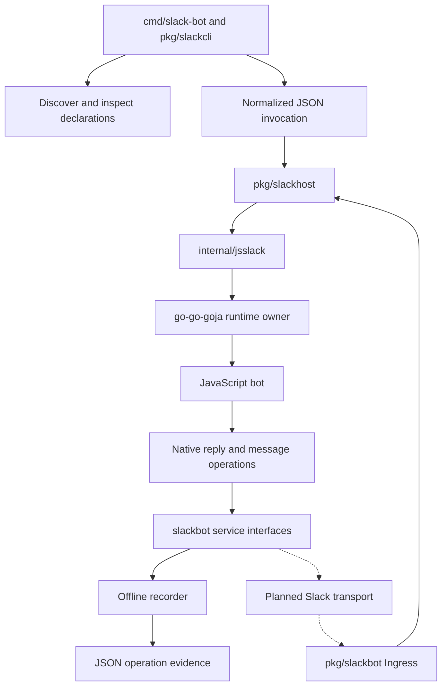
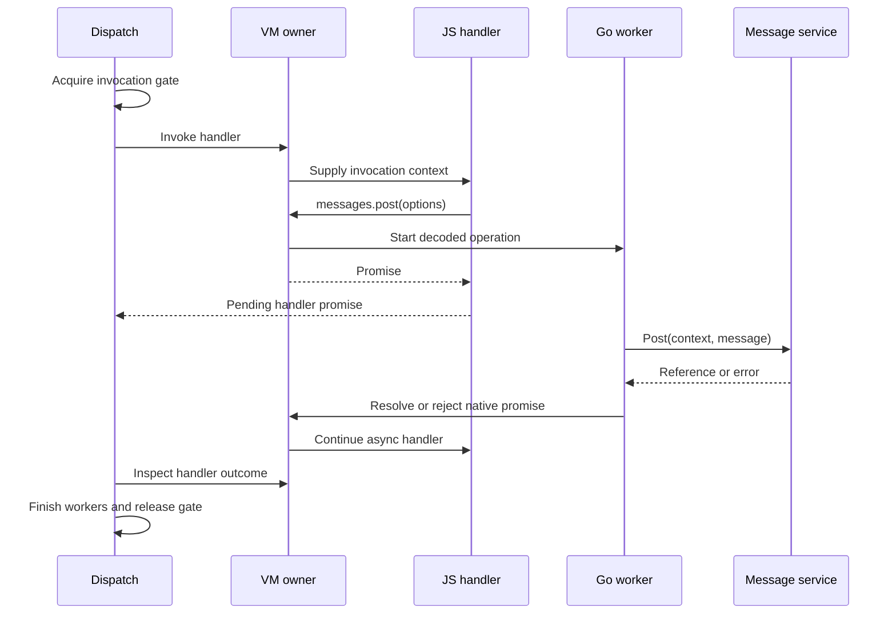
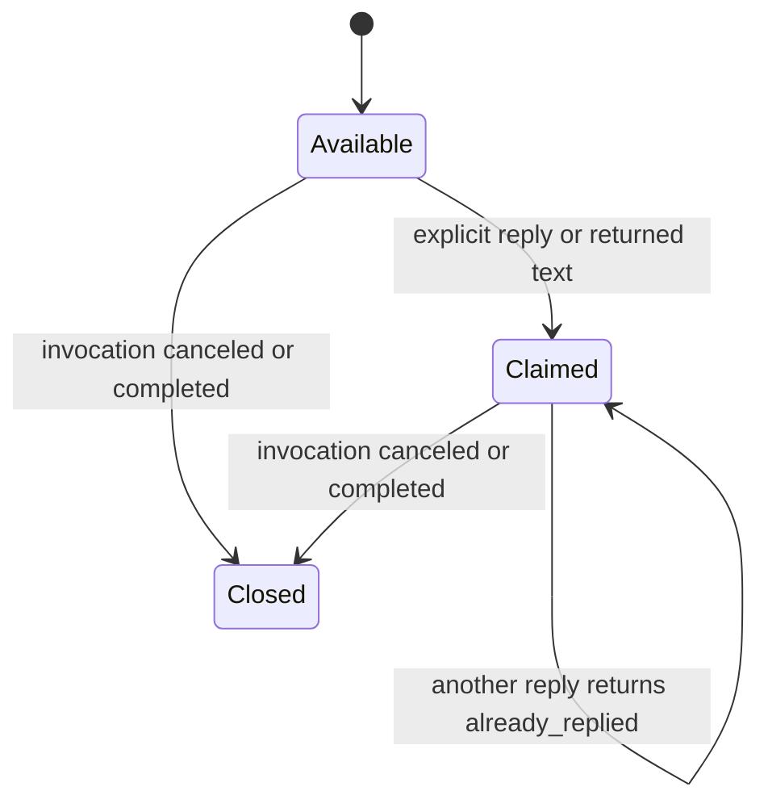

# Slack Support in Discord-Bot: Runtime Ownership, Admission, and Local Verification

The Slack work in `discord-bot` establishes an independently usable JavaScript bot host before connecting it to Slack. Go owns execution, configuration, cancellation, admission, and outbound service interfaces. JavaScript registers commands and event handlers and expresses their behavior through a small native module. The resulting implementation can discover a bot, inspect its declaration, generate an application manifest, and execute real handlers against recording services without credentials or external traffic.

This report explains the implementation at revision `fd84234`, including the conditions under which its concurrency and delivery guarantees hold. It also examines the local testing design that should govern the next transport phase. Understanding the distinction between a completed JavaScript invocation, an accepted event, and a delivered message is necessary to extend this system correctly.

> [!summary]
> The implemented milestone contains a typed Slack domain, a Goja host, an offline CLI, and bounded in-memory ingress. The difficult parts are VM ownership, asynchronous completion, cancellation, reply accounting, and event identity. Real Socket Mode, SDK integration, HTTP/WebSocket fixtures, and stateful mock process tests remain future work.

## 1. Starting from the existing Discord system

The original repository hosts JavaScript bot behavior inside a Go application. Its README describes one selected JavaScript bot per process: Go manages the Discord session, while scripts use `require("discord")`. The repository already has discovery, command-line configuration, bot lifecycle management, and the Goja execution infrastructure supplied by `go-go-goja`.

Those concepts are useful for Slack, but the platform-specific contracts need their own definitions. A Slack command response and a message posted into a channel have different destinations and authority. Event delivery identity differs from the identity of the event itself. Thread destinations require preserving message timestamp strings. Receipt acknowledgment must remain independent of arbitrary handler execution. Encoding those distinctions explicitly is more useful than extending a Discord interface until it contains unrelated platform cases.

The approved design therefore adds `cmd/slack-bot` and Slack-specific packages inside the existing Go module. It does not introduce a second `go.mod`, a Discord compatibility layer, or a shared platform abstraction. The existing Discord application remains available, while the new application reuses the runtime infrastructure at the level where the concepts actually match.

The module pins `go-go-goja` at `v0.8.3` and Glazed at `v1.3.6`; it declares Go `1.26.4`. These versions matter because nearby checkouts and current authoring skills can describe newer APIs. The implementation was built against the pinned dependency source. At the report revision, the module does not yet depend on `slack-go`.

## 2. The implemented system and its boundaries

The fastest way to orient a new contributor is to follow an invocation through the code. The CLI reads a JSON fixture into a domain value, loads a script into the public host, and supplies a recording implementation of the outbound interfaces. The native module constructs a JavaScript context, invokes the registered handler, and translates any reply into a typed service call. The recorder returns observable operations for inspection.



The diagram includes two distinct entry paths. Fixture simulation dispatches directly through the host. The ingress component is separately available for embedding and has an integration test that connects it to the same host. The CLI does not pretend that a normalized fixture has exercised an actual Socket Mode decoder.

| Location, relative to the repository root | Responsibility |
|---|---|
| `pkg/slackbot/model.go` | Domain values, service contracts, validation, and configuration projection |
| `pkg/slackbot/recording.go` | Observable fake message posts and command replies |
| `pkg/slackbot/ingress.go` | Filtering, bounded admission, deduplication, receipt calls, and worker lifetime |
| `internal/jsslack/host.go` | Runtime construction, inspection, VM calls, cancellation, and shutdown |
| `internal/jsslack/module.go` | Bot declaration and handler registration |
| `internal/jsslack/dispatch.go` | Invocation contexts, promises, replies, and error conversion |
| `internal/jsslack/store.go` | Workspace-scoped JSON storage |
| `pkg/slackhost/host.go` | Public composition API for Go callers |
| `pkg/slackcli/commands.go` | Glazed command definitions, JSON input, simulation, and manifest output |
| `pkg/slackcli/discover.go` | Entrypoint discovery and descriptor resolution |
| `pkg/slackdoc/slack-offline.md` | Embedded documentation for the shipped contract |
| `examples/slack-bots/ping/index.js` | Executable example used by the CLI and integration tests |

The separation gives each kind of test a precise subject. Domain tests do not need JavaScript. Runtime tests execute real JavaScript but substitute outbound services. A later transport test must execute the real SDK against an HTTP/WebSocket fixture. Each test can then identify which boundary it has established.

## 3. A small JavaScript language for bot declarations

The native module exposes `defineBot`. Its callback receives declaration functions, and the script must export the object returned by `defineBot`. This identity check makes the supported entrypoint explicit: an unrelated exported object is not accepted as a valid declaration.

The actual example is short enough to read in full:

```javascript
const { defineBot } = require("slack");

module.exports = defineBot(({ configure, command, event }) => {
  configure({
    name: "ping",
    description: "Offline Slack runtime example",
    run: { fields: {
      greeting: { type: "string", default: "pong", help: "Ping response" }
    }}
  });
  command("/golem-ping", { description: "Check the development bot" }, async (ctx) => {
    return { text: ctx.config.greeting };
  });
  event("app_mention", async (ctx) => {
    await ctx.reply({ text: "I received your mention." });
  });
});
```

Registration is synchronous. Returning a promise from the declaration callback is rejected, duplicate handler keys are rejected, and registration closes after loading. Commands are stored under keys such as `command:/golem-ping`; the supported event is stored under `event:app_mention`. Descriptors sort commands and events to make inspection output predictable.

This establishes an explicit transition from definition to execution. If handlers could register new commands after loading, a previously generated manifest could stop describing the running program. A fixed declaration phase lets discovery, configuration, and execution agree on the set of handlers.

Inspection still executes the script. It runs declarations with a deadline and closes the resulting runtime. It omits resolution of required runtime configuration, allowing an operator to inspect a bot before supplying that configuration. `Load`, by contrast, validates required values before accepting the host. A missing required field should prevent execution without preventing help or manifest generation.

The runtime disables implicit default native modules and installs an explicit registrar for `slack`. Local CommonJS imports remain available. This is a deliberately small exposed API, but it should not be described as operating-system isolation for hostile code: scripts still execute in the application process and can load local source. The implementation's CPU interruption and capability selection address specific execution concerns; they are not a general process security boundary.

## 4. Typed values define what scripts may request

The domain package has no Goja or Slack SDK dependency. Its service contracts are small:

```go
type MessageService interface {
    Post(context.Context, PostMessage) (MessageRef, error)
}

type Responder interface {
    Reply(context.Context, Text) error
}
```

`MessageService` represents explicit channel posting. `Responder` represents the per-invocation ability to send a command reply; a future implementation retains the response URL privately. Keeping the URL behind an interface prevents the JavaScript API from depending on transport addressing or credential storage.

The message types are equally specific. `Text` contains only `text`. `PostMessage` contains `channelId`, `text`, and optional `threadTs`. `MessageRef` contains `channelId` and `ts`. Text validation rejects blank content and limits text to 4,000 Unicode code points. This is the current host policy, not a claim that it describes every Slack text limit.

The native decoder requires an object, serializes it to JSON, and decodes it into a Go struct with unknown fields disallowed. A misspelled option therefore fails before a service request starts. It does not silently become an ignored property. These checks are particularly useful at the Go/JavaScript boundary, where a plain object otherwise has no enforced relationship to the service contract.

Timestamps remain strings throughout the domain and JavaScript APIs. In this system a timestamp identifies a message or a thread destination. Converting it to a floating-point number introduces an unnecessary transformation and may discard the exact textual identifier. The relevant assertion is exact string equality between the input thread and the emitted operation.

Configuration follows another explicit boundary. `Descriptor.Config` iterates over declared fields and copies only those values into the bot configuration. Supported field types are `string`, `bool`, and `number`; defaults and required values are checked. Undeclared input is omitted. Consequently, adding a host setting does not automatically expose it to JavaScript. Callers must still keep credentials out of declared bot configuration; projection is an architectural boundary, not a mechanism for recognizing arbitrary secret strings.

## 5. VM ownership and invocation serialization solve different problems

A Goja runtime must be accessed through its owner. The owner serializes VM callbacks, including handler invocation, property access, promise inspection, and promise settlement. That rule alone does not serialize complete bot invocations. An asynchronous handler can yield while its outbound operation is still pending, leaving the owner free to execute another callback.

The host therefore has an additional one-slot channel named `gate`. `Dispatch` acquires it before invoking a handler and releases it only after the invocation's cleanup. Whole invocations execute one at a time per host, while the VM owner remains available between callbacks. This makes state behavior easier to reason about without blocking the mechanism needed to finish promises.

An asynchronous native call has three stages:

1. The owner validates and decodes JavaScript arguments into Go values and creates a promise.
2. An errgroup worker performs the service operation using the invocation context.
3. The worker schedules an owner callback that resolves or rejects the promise.



The invariant is that service I/O never occupies the VM callback while waiting for the service response. If that callback waited for a worker whose completion needed the same owner, the invocation could not finish. In `dispatch.go`, the native operation uses `TryGo`, and the worker calls `h.call` only after `work()` returns.

Each invocation permits at most sixteen concurrent native workers. When `TryGo` cannot start another worker, the newly created promise is rejected with `busy`. The owner is not blocked waiting for worker capacity. This bounds native concurrency, though it does not impose a global memory quota on scripts or their stored values.

The host currently checks the handler promise through owner calls on a one-millisecond ticker. This is an implementation choice with a small polling cost, not a general event-driven completion mechanism. Any replacement must preserve owner-only access to the promise and the separation between whole-invocation serialization and VM callbacks.

### The unresolved consequence of unawaited operations

The worker communicates a service failure by rejecting its promise; its own errgroup function returns `nil`. As a result, waiting for workers does not automatically convert every rejected native promise into an invocation error. If JavaScript ignores the promise and returns successfully, the side-effect failure can remain unobserved by the caller of `Dispatch`.

For the current contract, critical operations must be awaited or returned. The broader test plan explicitly calls for deciding whether fire-and-forget work should produce an observable failure or be rejected as unsupported. This remains an open design question. The presence of an errgroup should not be interpreted as proof that all service errors propagate through `Wait`.

## 6. Cancellation must terminate execution and preserve runtime reuse

Canceling a Go context cannot by itself stop JavaScript that is executing `while (true) {}`. The host wraps owner callbacks with a context cancellation watcher that calls `vm.Interrupt`. It then waits for any active watcher to finish and clears the interrupt before the next owner entry.

The ordering is essential:

```text
within an owner callback:
    register cancellation callback:
        interrupt VM with context error
        mark callback finished
    execute JavaScript operation
    during cleanup:
        stop cancellation callback if possible
        if it already started, wait for its completion
        clear VM interrupt
```

Clearing the interrupt before the watcher has finished would permit the watcher to interrupt a later invocation. Leaving the interrupt set would also contaminate subsequent work. The implementation makes cancellation part of the lifecycle of each VM entry rather than leaving interruption as a one-way host shutdown action.

There are three contexts to distinguish. The receipt context belongs to an acknowledgment operation. The ingress lifetime context owns accepted work. Each dispatch adds an invocation deadline and is also canceled when the host lifetime ends. Canceling the receipt context after admission must not cancel the accepted handler.

For Go services, cancellation is cooperative. The host passes a context and waits for outstanding workers during cleanup. A service that ignores cancellation and blocks forever can prevent dispatch from returning; Go cannot safely terminate that arbitrary function on the host's behalf. Consequently, timeout tests must exercise both CPU-bound JavaScript and a context-aware blocked service.

`Close` cancels the host lifetime, waits to acquire the invocation gate, and closes the runtime once. The integration cleanup closes ingress before the host so that admitted work is canceled before the execution resource is destroyed. That ordering is part of composition, not a responsibility to delegate to JavaScript handlers.

## 7. Reply accounting is a state transition

The host offers two ways to use the implicit reply: explicitly call `ctx.reply({text})`, or return `{text}` from the handler. Both use the same invocation-local `replied` flag. The flag is accessed on the VM owner, so concurrent promise callbacks do not need a separate reply mutex.



The reply is claimed before service I/O. This prevents an explicit reply followed by a returned message from issuing two implicit replies. It also means that a failed send does not automatically restore the slot. That conservative behavior matters because an error returned by a future network client may not establish whether the remote service accepted the operation.

For a slash command, `sendReply` invokes the supplied `Responder`. For a mention, it posts into the invocation's channel with `ThreadTS` if present, otherwise with the event's `TS`. An explicit `ctx.slack.messages.post` does not consume the implicit reply slot. These are intentional differences between replying to the current invocation and requesting another channel message.

The host's command responder contract is ephemeral, and the recorder emits an `ephemeral_reply` operation. This establishes the requested behavior at the service boundary. It does not yet establish that a response URL was posted correctly or that Slack displayed a private response to the intended user; those require transport and process tests.

## 8. Storage and errors preserve the execution boundary

The store is indexed by workspace inside one host and contains JSON bytes. `set` serializes the supplied value, while `get` deserializes it into a fresh JavaScript value. Mutating the original object after `set` or the returned object after `get` does not modify the stored value. A caller must perform another `set` to publish its update.

The store accepts JSON scalar values and `null`, rejects `undefined`, returns `undefined` for missing keys, and produces sorted keys. Every operation checks the invocation context. Retaining a context object in a script variable therefore does not preserve a valid storage capability after the invocation ends.

This design gives detached values and workspace separation, but storage remains process-local and unbounded by a byte quota. It does not supply persistence, multi-process coordination, or atomic recovery with outbound message delivery. Serializing invocations simplifies read-modify-write operations in one host; it cannot make a restart durable.

Error conversion follows a similar principle: expose useful domain information without reflecting arbitrary transport details into JavaScript. A `slackbot.Error` has `code`, `operation`, and `message`. Typed errors are passed through, cancellation becomes `context_closed`, and unknown service errors become a generic `service_error`. JavaScript rejection text can retain its stack for diagnosis.

This makes service implementations responsible for producing credential-free typed errors. The conversion function trusts a typed domain error's message; it does not redact arbitrary content supplied by that implementation. Likewise, a script can log its own text. The architecture avoids inserting credentials into contexts and logs automatically, while requiring discipline at the future transport boundary.

## 9. Admission, acknowledgment, and execution are separate outcomes

`Ingress` accepts detached envelopes containing application identity, optional business-event identity, invocation data, and the response capability. Admission filters the configured workspace, application, channel policy, bot-authored input, self-authored input, and invalid invocation values. Accepted work enters a bounded channel consumed by one dispatcher worker.

The component then calls the supplied acknowledger without entering JavaScript. The precise guarantee is that acknowledgment does not wait for handler completion. Since the worker can receive the envelope as soon as it is queued, the current code does not guarantee that acknowledgment reaches the wire before JavaScript starts. A future wire test must distinguish those two assertions.

The admission algorithm, simplified from `ingress.go`, is:

```text
under the ingress mutex:
    reject a closed lifetime
    filter identity, origin, channel, and invocation shape
    choose event key or delivery key
    expire old deduplication entries
    if key already exists: return duplicate
    if deduplication capacity is full: return busy
    attempt nonblocking queue insertion
    if inserted:
        remember key until its TTL
        return accepted
    otherwise: return busy

outside the mutex:
    acknowledge envelope ID using the receipt context
    return admission result and any acknowledgment error
```

Events use `event:<teamId>:<eventId>`. Other accepted invocations use `envelope:<envelopeId>`. The distinction handles a business event delivered again with a different envelope ID. Deduplicating only by the delivery identifier would let that event execute twice.

The queue and deduplication cache have independent bounds. A full queue rejects new admission. A full cache also rejects admission instead of evicting a live key, because eviction would silently weaken duplicate suppression during the configured TTL. This choice preserves a clear contract at the cost of reduced availability when the cache is exhausted. Expired entries are removed by scanning the cache during admission, which is a bounded but linear operation worth revisiting if configured capacities become large.

An acknowledgment failure does not undo admission. The event may already be executing, and its deduplication record remains. A redelivery can therefore be recognized and acknowledged again without repeating the handler. Conversely, an acknowledgment followed by a process crash can lose accepted work because both the queue and the deduplication map are in memory.

The current system consequently provides best-effort admission and temporary duplicate suppression. It does not provide exactly-once effects. TTL expiry, restart, uncertain outbound delivery, and remote retry behavior all require additional decisions before stronger guarantees could be claimed.

The `busy` boolean in the acknowledger interface is also a local contract awaiting protocol implementation. A successful unit test of that interface does not establish which payload should be sent for every Slack envelope type. The future transport must define and test that mapping explicitly.

## 10. The offline CLI produces inspectable evidence

Discovery uses explicit entry conventions: root-level `.js` files and `index.js` in immediate child directories. Hidden entries and `node_modules` are excluded. It does not recursively execute helper entrypoints under a bot. Every candidate is inspected, duplicate bot names are diagnosed, and descriptors are sorted by name.

The command surface is deliberately small:

```bash
go run ./cmd/slack-bot bots list
go run ./cmd/slack-bot bots inspect ping
go run ./cmd/slack-bot bots manifest ping
go run ./cmd/slack-bot bots simulate ping \
  --event-file examples/slack-bots/fixtures/mention.json
go run ./cmd/slack-bot help slack-offline
```

Simulation accepts an optional `--bot-config-file`, a bounded `--timeout-ms`, and `--log-level`. JSON fixtures are limited to one MiB, must contain exactly one JSON value, and reject unknown struct fields. The command writes one JSON document through the caller-provided output writer, while application logging uses stderr.

The mention simulation was rerun while preparing this report. It produced:

```json
[
  {
    "kind": "post",
    "message": {
      "channelId": "C-TEST",
      "text": "I received your mention.",
      "threadTs": "1741234567.000001"
    },
    "ref": {
      "channelId": "C-TEST",
      "ts": "offline.000001"
    }
  }
]
```

The trace establishes that the real example handler selected the correct channel and preserved the thread identifier. The deliberately synthetic reference `offline.000001` makes the recording distinguishable from a remote message result. Neither this trace nor manifest generation contacts Slack.

The manifest derives commands and event subscriptions from the descriptor, enables Socket Mode, and includes the relevant bot scopes for the supported declaration set. It also currently emits interactivity enabled even though interactive components are not implemented. Generated configuration is a review artifact: successful JSON generation does not establish installation validity or feature support.

### Why the CLI uses the pinned Glazed parser directly

The implementation encountered two concrete framework constraints. `config-file` was already reserved, so the bot-specific input became `bot-config-file`. More substantially, the pinned high-level command builder wrote to `os.Stdout` and used `cobra.CheckErr` on domain errors, causing a missing-bot test to exit the test process.

The final implementation retains Glazed command descriptions, fields, sections, and source middleware, but constructs the parser directly and supplies its own `RunE`. That function parses values and calls `RunIntoWriter(cmd.Context(), vals, cmd.OutOrStdout())`. Errors return to the application, and tests can capture output. The source chain is explicit: Cobra flags, positional arguments, and defaults. It does not implicitly read environment credentials.

## 11. What the tests establish today

The implementation diary records full repository tests, build, vet, focused lint, the pinned Glazed analyzer, and race tests for the new Slack packages at the completed offline milestone. Preparing this report included another focused package test command; its results were successful cached Go test results. The report also includes the freshly executed mention simulation above. Full lint and race verification were not repeated solely to write documentation.

| Evidence | Established behavior |
|---|---|
| `TestRepliesAndThreadPrecision` | Actual JS reply behavior preserves thread strings |
| `TestReplyTwiceFailsWithoutSecondSend` | A second implicit reply does not issue a second send |
| `TestAsyncPostAndRejection` | Native asynchronous results and failures reach JavaScript |
| `TestInspectionAndHandlerDeadlines` | CPU-bound loading and handler execution are interrupted |
| `TestCancelPendingNetworkAndReuse` | Context-aware blocked service work cancels and the host can be reused |
| `TestUnknownPayloadFieldAndStaleContext` | Invalid message shapes and retained closed contexts are rejected |
| Store tests | Stored values are detached, workspace-scoped, and support scalar/null values |
| Ingress tests | Receipt independence, duplicate suppression, filtering, bounds, and TTL behavior |
| `TestIngressThroughRealJavaScriptHost` | Admission connects to the actual example JS and produces one threaded post |

The cross-layer host test is especially informative. It admits a mention, cancels the acknowledgment context, and submits the same business event under another delivery ID. It observes two acknowledgments and one recorded post with the original event timestamp as the thread root. This proves the intended relationship among identity, context ownership, and execution at the normalized boundary.

That test exposed a shutdown detail during implementation. The recorder could observe a successful post before the final promise-completion callback had finished. Immediate shutdown could then report `context canceled` through the ingress error channel. The worker now suppresses dispatch failures after its own lifetime is canceled, while active-lifetime failures remain observable. The error channel is bounded and may drop diagnostics rather than delay receipt processing; it is not a durable failure ledger.

Offline reproducibility required explicitly selecting the cached Go `1.26.4` toolchain and matching `GOROOT`. Invoking the executable alone initially mixed it with a `1.25.5` root and produced a compiler-version mismatch. The ticket's `scripts/04-go-offline.sh` sets the matching root, disables proxy/checksum downloads, and uses `GOWORK=off` to avoid the mismatched parent workspace. This is a workstation reproduction helper, not a portable toolchain installer.

The sandbox also required `-buildvcs=false` for build/run package loading that could not inspect external worktree metadata. No TypeScript compiler was available at the checked path, so the declaration file was reviewed but not compiler-validated. These limitations belong with the evidence because they define what another contributor must reproduce independently.

## 12. The next verification problem is transport behavior

The separate local-testing plan is a source-inspection and design artifact. It recommends a layered approach and explicitly states that its research did not run mock servers or establish compatibility between a chosen Go SDK version and the recommended mock. The implementation had not completed that compatibility probe when this report was requested.

| Layer | Actual code executed | Substitute | Status at this report |
|---|---|---|---|
| L0 | Domain validation and projection | None needed | Implemented baseline |
| L1 | Real Goja host and bot scripts | Typed service fakes | Implemented baseline; broader cases remain |
| L2 | Future transport and actual Go SDK | Precise HTTP/WebSocket fixtures | Planned |
| L3 | Actual future CLI runner, transport, and host | Stateful local Slack server | Planned |
| L4 | L3 with browser inspection | Mock client UI | Optional later work |

The recommended stateful server is `desplega-ai/slack-mock`, inspected at revision `6397b31a9c5e04a3ba52dd6e82f16ab8b5b10eac`. The plan records package version `0.4.0`, a Bun runtime, Socket Mode envelopes and acknowledgments, stored conversation state, and application-level fault injection. These are findings from that pinned source inspection, not claims about a newly checked upstream release.

Its usefulness does not eliminate the need for small Go wire fixtures. The inspected mock permits some token usages that a strict request test should reject, lacks an acknowledgment timestamp suitable for exact ordering assertions, and does not model every uncertain-delivery failure. Some controls, including fault injection and delivery inspection, exist through its TypeScript API rather than invented administrative HTTP routes.

The first proposed experiment should therefore be narrow: connect the actual selected Go SDK to a pinned local mock, validate identity, establish Socket Mode, receive and acknowledge a mention, post into the expected thread, exercise a command response URL, and shut down cleanly. Passing that experiment would establish compatibility for the tested path and versions. It would not establish all retry, permission, or lifecycle behavior.

The following cases belong in precise fixtures because they require control over wire behavior:

- Verify exact app-token versus bot-token routing and ensure every HTTP, response URL, redirect, and WebSocket destination stays local during offline tests.
- Block outbound work and observe acknowledgment independently of handler completion.
- Deliver the same event ID under different envelope IDs and inspect the exact acknowledgment IDs and request counts.
- Accept an outbound message and then lose the response, so the application must distinguish uncertain delivery from a definite rejection before retrying.
- Exercise rate-limit responses, malformed retry metadata, cancellation during waits, connection replacement, and shutdown while work is pending.

These tests should use deterministic barriers and test-owned deadlines. A mock's `flush` helper or a message wait that can match old state is insufficient evidence of the current scenario's completion. Unique markers, fresh instances, captured identifiers, and explicit business assertions make failures attributable.

## 13. Development access and the remaining implementation sequence

The implemented tests and simulations require no Slack tokens. The planned local harness should also use synthetic credentials and loopback services. Preparing dependencies and pushing this report are separate network activities from running bot tests against a real workspace.

For a later live Socket Mode milestone, the original ticket identifies an app-level token with connection permission, an installed bot token with the selected bot scopes, the expected app/workspace/bot-user identities, and an allowed test channel. The manifest currently selects `chat:write`, adds `commands` for slash commands, and adds `app_mentions:read` for mention subscriptions. Actual app setup and permission validation remain future checks against the installed application. Secret values should be supplied through the planned host-only token-file configuration, which is not implemented in this revision.

Live development additionally needs permission to create test messages in that workspace and the ability to configure or reinstall the application as required. No real Slack messages or environment credentials were used in the offline implementation. The next useful work can still proceed with local synthetic values.

The testing plan gives the implementation an ordered set of milestones:

1. Pin the SDK/mock/runtime versions and prove one complete local interoperability path.
2. Fill the remaining domain/runtime assertions, including saturation, concurrent callers, secret-bearing failures, and unawaited-operation policy.
3. Implement exact HTTP/WebSocket fixtures and the transport behavior they exercise.
4. Connect the actual application process to the stateful mock and assert conversation state, reconnects, and process termination.
5. Add reproducible CI gates and failure artifacts, with optional UI review after structural assertions pass.

Persistence, buttons, modals, direct messages, and additional JavaScript providers should be treated as later features with their own acceptance contracts. In particular, interaction types that require a meaningful acknowledgment response need a separately specified receipt path. The current generic admission interface should not be assumed sufficient merely because it works for normalized mention and command tests.

## 14. Source record and reading order

The source repository for this report is `/home/manuel/workspaces/2026-09-10/add-slack-support/discord-bot`. Relative code paths throughout the article refer to that root. The reviewed implementation checkpoint is `fd84234`; earlier milestones are `1ee4d4a` for research, `e21a06d` for the native runtime, and `6cb0b79` for the offline CLI. No PR merge or remote publication of those application commits is implied here.

The ticket root is:

```text
ttmp/2026/09/10/DISCORD-SLACK-001--add-slack-support-to-discord-bot/
```

Start with `pkg/slackdoc/slack-offline.md` for the implemented API, then read `pkg/slackbot/model.go`, `internal/jsslack/host.go`, `internal/jsslack/dispatch.go`, and `pkg/slackbot/ingress.go`. Their corresponding tests explain the edge conditions more directly than the command entrypoint. Read `pkg/slackcli/commands.go` afterward to see how those contracts become an executable workflow.

The ticket contains the longer research and design record:

- `design-doc/01-slack-support-architecture-and-intern-implementation-guide.md` develops the architecture, proposed Slack integration, and setup requirements.
- `reference/01-investigation-diary.md` records implementation evidence, failures, corrections, and validation commands.
- `design-doc/02-full-local-testing-plan-and-slack-mock-evaluation.md` specifies the remaining verification work. At report time it is a separate untracked planning document in the working tree, so its contents should not be attributed to commit `fd84234`.
- `sources/manifest.json` and `sources/local-manifest.json` record archived reference provenance and hashes, including defuddle-extracted API material, original vault notes, and source snapshots.
- `artifacts/slack-intern-guide.pdf` is the reviewed print edition of the original guide. The diary records successful reMarkable cloud delivery of that guide; this article is a separate vault publication.

Related vault history provides useful context for the Go/JavaScript boundary:

- [[PROJ - JS Discord Bot - Building a Discord Bot with a JavaScript API]]
- [[PROJ - JS Discord Bot Framework]]
- [[ARTICLE - Go-Side JavaScript DSLs for Discord Bots - Types, Errors, and In-Place Updates]]
- [[ARTICLE - xgoja Modules in Existing Runners - Discord Bot Case Study]]

The central review task for the next contributor is to preserve the existing ownership and lifecycle invariants while replacing recording services with real transport behavior. Each additional guarantee should have evidence at the boundary where it becomes meaningful: typed operations in runtime tests, exact requests and acknowledgments in wire tests, and visible conversation state in process tests.
