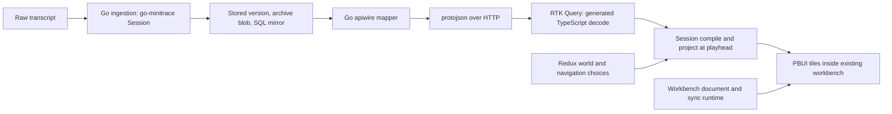

# Agentlogic: a generated HTTP contract and one owner for each kind of state

Agentlogic ingests coding-agent transcripts into a Go server and lets a React workbench inspect the resulting Sessions. This report explains a second architectural pass, implemented through AGENTLOGIC-10 and AGENTLOGIC-11 on `task/add-agentlogic-backend`: replacing a browser demo/conversion path, duplicated HTTP payload definitions and overlapping frontend caches with generated protobuf messages, RTK Query and isolated HTTP scenarios. It describes the implementation **as of `ec76043`**, not a completed production release. Phase 5 is committed; Phase 6's final cleanup and authenticated end-to-end qualification remain open.

The motivation is specific. A server that converts and stores transcripts should not have a different browser converter that produces different Sessions. A page that already uses workbench runtime state should not also let independent hooks and promise caches decide what the current archive is. And changing a request shape should not require synchronized edits to hand-written Go structs, TypeScript interfaces, stories and fixtures. The migration makes the boundaries explicit without rewriting the workbench synchronization protocol.

> [!summary]
> - **One product contract:** `.proto` definitions generate Go and TypeScript messages; Go sends protojson over existing HTTP routes, and the browser decodes with generated `fromJson`. There is no gRPC server or development compatibility adapter.
> - **Three state lifetimes:** RTK Query caches server resources, Redux slices hold serializable per-world choices, and compiled runs plus workbench objects remain in runtime memory outside Redux. Stores are created per application, test or story.
> - **One truthful HTTP test path:** MSW intercepts product requests in Vitest and Storybook, but the production bundle neither starts a mock worker nor contains the generated transcript scenarios. Go HTTP tests and real-server smoke remain separate evidence.

## 1. Define the objects before following a request

A **raw transcript** is an uploaded log in an agent-specific format. Ingestion converts it through go-minitrace into a **Session**, a normalized record with turns, tool calls, events, attachments, provenance, timing and metrics. A **project** names a collection of transcripts. A **transcript version** refers to one committed upload; an **archive** is the Session stored for that version. A **listing** summarizes many versions for filtering and navigation. The browser compiles one Session into a **Run**, then projects that Run at a **playhead** position to render tiles. Compiling and projecting are browser analysis, not new server endpoints.

The **workbench** manages the document, views, layout, ports and links that arrange those tiles. It already has its own synchronization, persistence and HTTP transport. These are different from product resources such as projects, listings, archives and user-authored annotations. Treating the two transports as interchangeable would expand this ticket into a workbench protocol redesign, which the owner explicitly excluded.



The SQL mirror answers multi-session searches and named analytics presets; it does not replace the archive. Conversely, a Redux world contains position and what-if choices but not a copied Session or compiled Run. This distinction matters when the same archive appears in two panes: RTK may share the fetch while each pane retains an independent playhead.

## 2. Why the original arrangement needed a cutover

The previous UI could browse a demo without a server and included a TypeScript conversion path beside Go's real ingestion. AGENTLOGIC-10 removed that alternative: the frontend fixtures now come from Go conversion, and a missing server produces an explicit unreachable/retry state. The development system was intentionally allowed to break old API shapes; preserving an unused route or converter would have made a later mismatch harder to diagnose.

AGENTLOGIC-11 began with a route and Session-field audit. The implementation did not simply replace TypeScript interfaces with generated names. It made one transport contract cover identity, project administration, device pairing, transcript listing, archive detail, upload outcomes, annotations, analytics, and errors where those routes have JSON success bodies. It also checked the Go CLI, which consumes the same product routes. Browser authentication navigation, 204 responses, raw blob downloads, liveness and RFC 9457 problem responses retain their own semantics; a generated message is not imposed on an empty or byte-stream response.

One important qualification: `README.md` still describes the older draft/raw/commit client path and says that the Session itself is the direct wire format. The current browser batch route and `ArchiveResponse` envelope supersede those descriptions. Refreshing that documentation is Phase 6 work, not something this report should silently treat as finished.

## 3. Generate the payloads, not the domain model

The source contract lives in `proto/agentlogic/v1/`. `session.proto` declares the complete archive tree rather than just fields used by today's tiles. `account.proto`, `catalog.proto`, `annotations.proto`, `device.proto` and `common.proto` define the other product payload families. Buf and pinned Go/ES generators emit bindings under `gen/go/agentlogic/v1/` and `ui/src/gen/agentlogic/v1/`. `make proto-check` regenerates into a temporary directory and byte-compares both outputs; `.github/workflows/push.yml` installs the pinned tools before invoking this check. It is a reproducibility check, not a handwritten schema snapshot.

The upstream go-minitrace Session remains a Go domain type. `pkg/apiwire/session.go` maps it field by field into the generated API Session. This deliberate mapping is where domain-specific values are converted and rejected. For instance, counts crossing into `int32` are range checked; arbitrary JSON emitted by agent frameworks is normalized through JSON before becoming `google.protobuf.Value`. Byte sizes are decimal strings at the API boundary, avoiding loss of integer precision in JavaScript and `bigint` in Redux-facing values. Optional fields retain presence when empty or false; absence is not interchangeable with a zero value in a patch request.

A representative part of the mapper is small enough to state exactly:

```go
func optInt32(value *int) (*int32, error) {
    if value == nil { return nil, nil }
    if *value > math.MaxInt32 || *value < math.MinInt32 {
        return nil, errors.Errorf("the count %d does not fit the API's int32 field", *value)
    }
    converted := int32(*value)
    return &converted, nil
}
```

`pkg/apiwire/apiwire.go` then encodes Go messages with `protojson.Marshal` and decodes with unknown-field rejection. In the browser, `ui/src/store/api.ts` calls generated `fromJson` on successful responses and `toJson` on generated request messages. The JSON stays camelCase over HTTP; there is no gRPC transport. A response whose Session does not satisfy the expected shape fails at the decode/require boundary rather than becoming an empty compiled run.

Consider an explicit project update: the TypeScript test encodes `{ title: "", publicRead: false }` with `toJson(UpdateProjectRequestSchema, ...)`. The committed fixture at `ui/src/fixtures/requests/update-project.wire.json` is decoded by `pkg/apiwire/tsrequest_test.go`. That Go test checks that both optional fields are **present**, even though their values equal defaults, while `retention` stays absent. In the reverse direction, Go emits identity/project fixtures and TypeScript decodes them through generated schemas in `ui/src/api/wire.test.ts`. Together these tests verify both directions of a concrete boundary, not only that each language can compile its own bindings.

## 4. Assign frontend state to the component that owns its lifetime

The frontend now has one `makeStore()` in `ui/src/store/index.ts`. Its reducers are the RTK Query API, navigation choices and keyed worlds. `AgentlogicStoreProvider` creates a store for a mount unless one is injected by a test; browser focus/reconnect listeners are opt-in for the real application and removed at teardown. There is no exported global store shared accidentally by unrelated scenes.

`ui/src/store/api.ts` supplies project, identity, listing, archive, analytics and annotation queries, plus batch upload and annotation mutations. RTK owns fetch state and invalidation. Upload invalidates project counts and listings. Annotation writes invalidate that transcript's annotation query, rather than claiming a write succeeded locally before the server confirms it. A sign-out path clears private product cache state. The same archive reference can be requested by two subscribers without sending two simultaneous HTTP requests; a second independent store does not inherit the first store's cache.

`ui/src/store/worldSlice.ts` holds an array/record-based `WorldClientState` per world ID: playhead, playback state, what-if override IDs, verdict choices, watchlist and a bounded trace. It does not hold `Map`, `Set`, `Session`, a compiled Run, a credential, or a workbench core. Compilation and projection still run at the analysis boundary, and the workbench's own synchronization path remains outside RTK Query. Keying by **world**, rather than by source Session ID, lets two views of the same archive seek and apply hypotheses independently.

```ts
// Essential shape from ui/src/store/index.ts
export function makeStore() {
  return configureStore({
    reducer: {
      [agentlogicApi.reducerPath]: agentlogicApi.reducer,
      navigation: navigationReducer,
      worlds: worldsReducer,
    },
    middleware: (defaults) => defaults().concat(agentlogicApi.middleware),
  });
}
```

This split is not a claim that Redux should control the workbench. RTK owns server resource caches; Redux choices describe a reader's current analysis; mutable transport objects and compiled computations have different lifetimes. The existing workbench document, sync outbox, revision handling and local persistence were explicitly excluded from the migration.

## 5. Follow an upload, then a saved judgement

Browser and CLI uploads now use one multipart route, `POST /v1/projects/{project}/transcripts:batch`. `pkg/server/handlers_batch.go` reads file parts under a request-size limit and a 100-part ceiling. For each part it internally opens a draft, streams bytes to content-addressed storage, attaches the raw blob, runs the commit/conversion path and emits a generated `BatchUploadResult`. A per-file problem can coexist with successful results in the same 200 response; an overall request that exceeds the body cap terminates with 413. The draft/raw/commit steps are server internals, not a second browser API. The server's credential scan and quarantine behavior still apply during commit.

After ingestion, the listing endpoint returns generated nested version records; a client uses the version to request `GET /v1/projects/{project}/transcripts/{transcript}/versions/{version}/archive`. The response is an `ArchiveResponse` containing the resolved reference and generated Session. `ui/src/store/api.ts` runs `fromJson(ArchiveResponseSchema, body)`, requires a valid Session, and caches by transcript reference. The browser then compiles it and projects the selected world. This separation explains why adding a listing filter does not invalidate the Session's domain schema and why seeking does not refetch the archive.

A user-authored verdict is different from the Session's conversion-time annotations. The review UI posts a generated `PutAnnotationRequest` to the version's annotation route, waits for the server-confirmed `UserAnnotation`, and refetches the annotation list by tag. A failed write must not appear as a durable judgement. The Phase 4 local-server smoke uploaded a real corpus transcript, listed and queried it through the CLI, opened it in the browser, approved an edit, observed HTTP 201, reloaded and saw the saved approval returned by HTTP 200. This is evidence for **local no-auth mode**; it is not evidence for authenticated mode.

Analytics followed the same contract simplification. `POST /v1/query` accepts a generated `RunQueryRequest` containing a preset and explicit project selection. The server authorizes a single named public-read project even for an anonymous caller, but unnamed or multiple-project queries require sign-in; unauthorized named private projects remain indistinguishable from missing projects. The older project-scoped analytics route was removed rather than retained as a migration shim. The SQL preset executes against the scoped mirror, not arbitrary SQL supplied by the browser.

## 6. Test the transport without installing a demo server in production

`ui/src/testing/productScenario.ts` builds fresh MSW handlers from generated Session fixtures and protojson-encoded listing messages. It covers listings, archive lookup, search/cursors and mutable annotation rows. `ui/src/scenes/browse.test.tsx` installs MSW's Node interceptor, mounts the existing workbench shell and observes real RTK requests. A test can therefore assert both that the intended row became current and that selecting another session requested its actual archive URL. `ui/src/store/api.http.test.ts` checks shared-request deduplication, per-store isolation, reset, filtering/pagination, and malformed/404 archive rejection.

Storybook follows a different initialization path. `ui/src/testing/StoryHttpScenario.tsx` starts `setupWorker` before rendering a signed-in SourcePicker or pending DevicePage story and stops it at teardown; the service-worker script is in `ui/.storybook/public/`. Ordinary presentational stories need no HTTP fixture. Tests call `server.listen({ onUnhandledRequest: "error" })` so an unexpected API call cannot silently reach a developer's server. The browser story setup flags unhandled `/v1/` calls, without treating unrelated static assets as product requests.

The MSW scenario is not an offline mode. It is absent from the production entry point and the Go-served `pkg/webui/dist` build. A Phase 5 build check found the worker in Storybook's static output and neither the worker file nor its bootstrap label in the production bundle. A Storybook browser session displayed a worker-version warning despite matching installed/script 2.15.0 metadata; requests and approval behavior worked, but the cause of the warning has not been proven. The tests cannot validate server authorization or SQLite behavior, which is why Go `httptest` and real-server flows remain necessary.

## 7. Reproducibility, failures and present limits

The migration was committed in small, bounded phases: pinned schema generation; complete Session mapper and Go-derived corpus fixtures; RTK Query/cache and serializable worlds; batch/annotation/listing/account/device/query HTTP contracts; and MSW Node/Storybook scenarios. Three implementation details from the diary are useful when extending it:

1. The ES generator deliberately emits trailing blank lines. Manually normalizing generated TypeScript made `make proto-check` report stale files. `.gitattributes` now exempts only generated TS paths from `blank-at-eof` whitespace checking; generation bytes remain unmodified.
2. `google.protobuf.Value` is not a plain JavaScript object before conversion. The model boundary uses `toJson(ValueSchema, ...)` where framework metadata or tool arguments must be read. Go normalizes typed containers through JSON before constructing `structpb.Value`.
3. A no-auth real-server CLI smoke initially failed because `query inbox session-list` gave two positionals; the accepted form was `query inbox --preset session-list`. This was a command invocation error, not a query route regression.

The Phase 5 gate passed standalone `GOWORK=off go test ./...`, workspace `go test ./...`, Go lint, `make proto-check`, `make fixtures-check`, `make ui`, `make dist`, Storybook build, and `make ui-test` (214 passed, 2 skipped). The two skipped frontend tests have not been represented as passing. A real local-mode upload/list/query/get and browser annotation-reload smoke passed during Phase 4. These results support the implemented paths as tested, not the remaining Phase 6 acceptance claim.

Phase 6 still needs a clean standalone-checkout generation/CI audit, an authenticated real-server flow, final obsolete-file/comment/dependency review, and developer-documentation updates. In particular, the current `make ui-test` token check reads previously built CSS from `pkg/webui/dist`; Phase 6 calls for building fresh CSS before that check so an old bundle cannot conceal a newly undefined token. The ticket's existing `docmgr doctor` warnings include `repo://` related-file references that it cannot resolve, including references to intentionally deleted files; those are documentation hygiene rather than a passing closeout. The unrelated untracked AGENTLOGIC-7 work-slip remains outside this work.

## Reading the implementation

Start at the contract and follow an archive request through the boundary:

- `proto/agentlogic/v1/session.proto`, `catalog.proto`, `account.proto` — generated message definitions and field policies.
- `pkg/apiwire/session.go`, `apiwire.go` — domain-to-message mapping and protojson encoding/decoding.
- `pkg/server/handlers_batch.go`, `handlers_query.go`, `handlers_annotations.go`, `server.go` — upload, analytics, durable writes and route/authorization registration.
- `ui/src/store/api.ts`, `index.ts`, `worldSlice.ts`, `provider.tsx` — request codecs, cache ownership, serializable world choices and store lifetime.
- `ui/src/model/compile.ts`, `project.ts`, `ui/src/store/workbenchContext.tsx` — runtime analysis and preserved workbench boundary.
- `ui/src/testing/productScenario.ts`, `StoryHttpScenario.tsx`, `ui/src/scenes/browse.test.tsx` — transport-level scenario testing.
- `ttmp/2026/09/21/AGENTLOGIC-11--simplify-agentlogic-with-datalab-style-redux-rtk-query-msw-and-protobuf-contracts/design-doc/01-intern-guide-datalab-style-agentlogic-state-api-and-testing-simplification.md` and `reference/01-investigation-diary.md` — design rationale, phase gates and failure evidence.

The earlier vault report, [[PROJECT REPORT - Agentlogic - Pragmatic Transcript Backend and the PBUI Presentation and Link Kernel - A Technical Deep Dive]], describes the backend and presentation/link kernel before this contract/state migration. It remains a historical source, not an alternative description of the current API.
