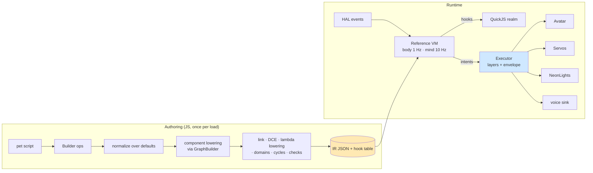
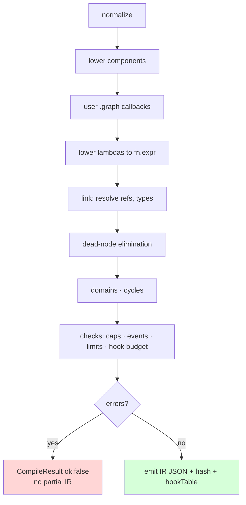

# StackChan Pet: An Emotional Tamagotchi DSL Compiled to a Dataflow IR — A Technical Deep Dive

The StackChan pet is a system for writing virtual pets, in the lineage of the 1990s Tamagotchi, that live on the M5Stack StackChan desk robot. A StackChan is an ESP32-S3 CoreS3 module with a 320×240 screen that serves as the robot's face, mounted on a body with two serial-bus servos (yaw and pitch), twelve RGB LEDs, capacitive head-touch sensors, a microphone pair, a speaker and an NFC reader. A pet written for this system has needs that drain over time, a continuous emotional state that responds to how it is treated, and behaviors it selects on its own. It expresses all of that through the upstream vector face, the head servos, the LEDs and, eventually, a synthesized voice.

The work lives on the `esp-63-stackchan-pet` branch of `/home/manuel/code/wesen/go-go-golems/esp32-s3-m5` under ticket `ESP-63-STACKCHAN-TAMAGOTCHI`. It consists of four parts:

- a JavaScript library of about 5,600 lines in `0120-m5stackchan-pet/js/lib`;
- a native C++ expression executor in `components/pet_core`;
- a QuickJS host component shared by a desktop tool and the firmware;
- a firmware overlay that composes the upstream StackChan firmware with a pet application.

This report explains the design from its foundations. It starts with the vocabulary the rest of the system depends on and follows one interaction through every layer. It then explains the authoring API, the intermediate representation, the compiler, the virtual machine, the emotion and behavior models, the native executor, and the evidence from desktop tests and from the physical robot.

The central idea is that **a pet script does not run the pet**. The script declares a pet, the declaration compiles into a typed dataflow graph, and a small virtual machine evaluates that graph on fixed ticks. JavaScript lambdas survive only at declared hook sites, where the VM calls them under a budget. The frame-rate work of driving servos, face and LEDs is performed by a native executor that has been proven, trace for trace, to match the JavaScript model it was ported from.

> [!summary]
> 1. Authors write `Pet.create('mochi').hatch()` and override opinionated defaults with chained builder calls. The builder records operations; it never touches hardware.
> 2. `.hatch()` compiles the pet to an IR: typed nodes in three rate domains (body 1 Hz, mind 10 Hz, expression 50 Hz), with cycles legal only through state nodes. A pet without lambdas compiles to an IR that needs no JavaScript engine at run time.
> 3. A reference VM defines the semantics. Events reach each domain exactly once, state outputs are double-buffered, and hooks are dependency-tracked, rate-limited and quarantined on failure. A desktop simulator runs days of pet life in seconds on the same VM.
> 4. The native executor in `pet_core` reproduces the JavaScript executor's traces on every channel across roughly 1.7 million recorded intents. The firmware runs it on the robot, where the full 90-second demo completed. The USB link drops seen during motion came from the base connector, not the firmware.

## The problem this work addresses

The upstream StackChan firmware (`m5stack/StackChan`, pinned at commit `1b5765599f`) already has an expressive body:

- a vector avatar with six emotions (`Neutral`, `Happy`, `Angry`, `Sad`, `Doubt`, `Sleepy`) and five decorators (heart, angry mark, sweat drop, blush, dizzy spiral);
- spring-animated head motion;
- two LED strips;
- head-pat gestures and shake detection;
- a set of C++ "modifiers" that blink the eyes, move the face slightly to simulate breathing, glance around, and react to head pats.

What it does not have is **state that persists across hours and days**, reacts to care and neglect, and shows itself consistently across face, motion, light and sound. Such state could be written once in C++ for one character. The goal of this project is different: a system in which many different pets can be written quickly, installed without reflashing, simulated before they reach hardware, and trusted not to damage the robot.

Three constraints shape every later decision. They come from the hardware and from the repository's earlier embedded JavaScript work.

1. **The frame path must not depend on a garbage-collected heap.** Servo commands, face updates and LED refreshes happen tens of times per second inside the upstream update loop, which runs under the LVGL display lock. JavaScript on the ESP32-S3 runs about 88 times slower than the same QuickJS on a desktop x86 machine; this was measured, as described below. A pet whose per-frame logic ran in JavaScript would compete with the display for the lock and could stall on garbage collection.
2. **Pets must be testable over their real timescale.** A need that empties in eight hours, a lifecycle that moves from egg to adult over four days, and an evolution decided by care quality over that period cannot be tested by running the robot. A useful system must fast-forward pet time deterministically.
3. **The robot must be safe from the script.** A script must not be able to drive a servo past its limits, run the speaker continuously, or saturate the LEDs. It also should not be able to crash the firmware by throwing an exception.

## Vocabulary

The rest of this report depends on a small set of terms. They are introduced here in dependency order, and each is used later only in the sense defined here.

A **pet script** is a JavaScript module that builds a pet with the builder API and ends with `.hatch()`. The **builder** is the chained API (`Pet.create(...)`, `.needs(...)`, `.react(...)`, and so on). Builder calls only record **operations**, entries of the form `{section, action, key, value, by, at}`, where `by` is the kit or pet that made the call and `at` is its source location.

A **component** is an opinionated unit of pet anatomy: needs, emotion core, reactions, behaviors, expression, care, life. Each component has defaults, options, hook sites and a **lowering**, which is the code that turns its normalized options into graph nodes. A **kit** is a named function from builder to builder, the unit of reuse. An **override** is a later operation that replaces an earlier entry with the same key. Overrides are recorded, never rejected.

A **lambda** is a function passed as an option, such as `score: ctx => ctx.need.fun < 0.4 ? 0.9 : 0`. The compiler first tries to **lower** it into native nodes. If that is impossible, the lambda becomes a **hook**, a graph node the VM calls with a read-only view of pet state named `ctx`.

The **IR** (intermediate representation) is the compiled pet: a JSON document containing typed **nodes** with named input and output **ports**, **timelines**, style tables, hook descriptors and a persistence schema. A **state node** remembers a value between ticks: a need meter, the affect point, a counter. Every other node is **pure** and recomputes its outputs from its inputs.

A **rate domain** is a set of nodes evaluated together on a fixed period:

| Domain | Period | Contents |
|---|---|---|
| body | 1000 ms | Needs, age, care quality |
| mind | 100 ms | Emotion, behavior choice |
| any | every tick of either domain | Sources such as the clock and trait constants |

The expression domain (50 Hz) is not evaluated by the VM at all. It belongs to the executor.

**Core affect** is the pet's instantaneous emotional state: a point `(v, a)` with **valence** `v ∈ [-1, 1]` (unpleasant to pleasant) and **arousal** `a ∈ [0, 1]` (calm to excited). This is Russell's circumplex model. An **impulse** is a change applied to core affect by an event. A **label** is a discrete emotion name (`happy`, `sad`, `hungry`, ...) read from core affect or **raised** directly by a need that has run low. **Mood** is a slow exponential moving average of valence.

A **behavior** is what the pet is doing now (`idle`, `nap`, `beg`, `search`, `eat`, ...), chosen by a **utility selector** that scores every behavior each mind tick. A **reaction** is a short event-triggered performance that overrides the current behavior's output without replacing the behavior.

An **Act** is an immutable description of a performance, for example `Act.face('happy').decor('heart').lean('toward', 8).chirp('purr')`. It flattens into a **timeline**, a list of timed **steps** on **channels**: face, head, voice, lights and flow.

An **intent** is what the VM publishes after every mind tick: the current label and intensity, the affect point, masks such as quiet hours, and **act requests** to start or stop timelines on a **layer**. The **executor** consumes intents and composes the channels from five layers:

| Priority | Layer | Contents |
|---|---|---|
| lowest | base | Blink and breath, supplied by the upstream modifiers on the device |
| | mood | The current label's style |
| | behavior | The running behavior's timeline |
| | reaction | Active reaction timelines |
| highest | system | Masks: quiet hours and the pickup hold |

The executor enforces the **safety envelope**, which consists of head soft limits, an LED cap, a voice budget and masks.

## Following one interaction through the system

A single interaction touches every layer, so it is the most direct way to see how the parts relate. Take the one-line pet from the ticket's first example:

```js
Pet.create('mochi').hatch()
```

This line compiles to 85 IR nodes and zero hooks. It is therefore "native only": its IR needs no JavaScript at run time. Suppose the pet has hatched and is running the `search` behavior, because nobody has touched it for more than 30 minutes. Now the player strokes its head.

1. **Sensing.** The Si12T head-touch driver emits `HeadPetGesture::SwipeForward` through a HAL signal. The pet converts it into a plain event `{name: 'head.swipe', payload: {dir: 'forward'}}` and appends it to the VM's event log. No JavaScript runs in the signal callback.
2. **Mind tick** (within 100 ms). The VM takes the mind domain's event cursor and finds the new event. The `reactions` node matches the default reaction for `head.swipe`, which has three parts:
   - it appends an impulse `{label: 'love', strength: 0.5}`;
   - it requests the timeline `face('happy').decor('heart').lean('toward', 8).chirp('purr')` on the reaction layer;
   - it emits `react.head.swipe`.

   The utility node evaluates `search`'s built-in exit condition, `since('head.*|screen.*|care.*|nfc.*') < 1000`. It is true, so `search` finishes, starts its cooldown, and plays its `then` flourish.
3. **End of the same tick.** The `affect` state node applies the impulse and pulls `(v, a)` toward the canonical point for `love`, `(0.8, 0.45)`. Its new value is published at the end of the tick, so the label node sees it on the next tick. After the 1.5 s minimum dwell, the label becomes `love`, because the `love` region requires a head event within the last 20 s.
4. **Body tick** (within 1 s). The `affection` need meter matches its refill table entry `{pattern: 'react.head.swipe', amount: 0.05}` and rises.
5. **Executor.** The intent from step 2 carries the reaction request. The executor composes:
   - the face channel shows the reaction layer's happy emotion with the heart decorator;
   - the head channel leans eight degrees up toward the hand;
   - the voice channel starts the `purr` sound 500 ms later, when the lean finishes.

   On the robot, the sink turns these into `Avatar::setEmotion(Happy)`, a `HeartDecorator`, `Motion::moveWithSpeed(yaw*10, pitch*10, 700)` and a voice event.

The sequence contains no JavaScript function call at all, because this pet has no lambdas. That is the property the IR buys.

## Architecture



Three runtime placements exist today.

- **Desktop simulator.** The JavaScript VM and a JavaScript model of the executor (`lib/executor.js`) run under Node or under the desktop QuickJS host.
- **Differential harness.** The JavaScript VM produces intents, which are replayed through the C++ executor (`components/pet_core`) on the host.
- **Robot.** The C++ executor runs inside the upstream `StackChan::update()` loop. It is currently fed by a recorded demo stream and by console commands. Phase 2 adds the JavaScript VM, running on the QuickJS task.

## The authoring layer

### Builder operations and provenance

The builder does no validation of meaning; that is the compiler's job. It does validate shape eagerly (trait names, capability names, the existence of callbacks) so that a typo fails at the call site. Every call appends one operation:

```js
_op(section, action, key, value) {
  this.spec.ops.push({ section, action, key, value, by: this._by(), at: callSite() })
  return this
}
```

`callSite()` parses the stack of a fresh `Error` to find the first frame outside the library. The parser accepts both V8's format (`at fn (file:12:5)`) and QuickJS's format, which the desktop QuickJS test suite confirmed. The result, for example `pets/tofu.pet.js:26:6`, is carried into the IR next to every hook and every override.

Kits are ordinary functions wrapped with a name. `.use(kit)` pushes the kit's name onto a stack while it runs, so every operation the kit records is attributed to it:

```js
export const NightOwl = Kit.define('night-owl', pet => pet
  .clock({ dawn: '10:00', dusk: '02:00' })
  .quietHours('03:00', '10:00')
  .behaviors(b => b.tune('sleep', { onlyWhen: ctx => ctx.time.hour >= 3 && ctx.time.hour < 10 })))
```

### Normalization: folding operations over the opinionated core

`normalize.js` starts from `defaults.js`, which holds the whole zero-configuration pet:

- four needs (hunger empties in 8 h, energy in 16 h awake and refills in 6 h asleep, fun in 4 h, affection in 12 h);
- six default reactions;
- ten behaviors;
- 23 per-label expression styles;
- five care verbs;
- a lifecycle of egg (10 min), baby (1 d), kid (3 d) and adult;
- care-quality rules and persistence settings.

Keyed sections are stored in a `Keyed` map that remembers the writer of each entry. Replacing an entry written by someone else appends `{key, from, to, at}` to `n.overrides`. The call `compile().explain()` prints that list:

```text
pet 'tofu' — 87 nodes (0 dead removed), 2 hooks, 20 timelines, 8 persisted, hash 0a427b1a
overrides:
  behavior:nap: default → pet (tuned) at pets/tofu.pet.js:4:6
  behavior:search: default → pet at pets/tofu.pet.js:26:6
hooks:
  #0 behavior.search.score [lowered to native] pets/tofu.pet.js:26:6
  #2 behavior.search.run [event] pets/tofu.pet.js:26:6
```

The rule that overrides are never errors matters for composition. Two kits that both define a reaction to `head.swipe` are not in conflict; the later one wins and the record says so. Only genuinely incompatible writes fail: tuning a need that does not exist, or requiring a capability the device denies.

### Act timelines and the sequencing rule

The design document left open which Act steps take time. The implementation settles it with one rule:

- **Blocking operations advance the cursor by their duration.** These are head motion, voice, `wait`, `blink` and `dance`.
- **Instant operations sit at the cursor and persist until the timeline ends.** These are face, eyes, mouth, decorator, lights and `emit`.
- **`Act.par(a, b)`** starts its sub-acts together and advances the cursor by the longest of them.
- **`Act.loop(a)`** marks a whole timeline as repeating.

The rule is tested against the ticket's own examples. The `search` behavior's loop

```js
Act.loop(Act.turnTo(-45, '1.5s').wait('800ms').turnTo(45, '3s').wait('800ms').chirp('call'))
```

flattens to steps at 0, 1500, 2300, 5300 and 6100 ms, with a total duration of 6700 ms. The head therefore finishes turning before the pause begins. That is the author's intent, and it would not hold under a rule in which only `wait` advances time. Lights are instant with an optional hold, so `.lights('#ffb070', '3s').chirp('sigh')` does not delay the sigh by three seconds.

## The intermediate representation

### Nodes, ports and the op table

Every node names an op from `lib/ops.js`, a table of signatures that the compiler checks against and both VMs implement. An input port declares a type (`num`, `bool`, `events`, `affect`, `label`, `impulses`, `any`) and a **combine** rule saying how several connected sources merge: `single`, `sum`, `product`, `list`, `and` or `or`. For example, a need meter's `drainScale` port uses `product`: the stage's `needsScale` and an author's drain lambda multiply. The affect node's `baseV` port uses `sum`: the pressure of every need and the mood term add.

| Family | Examples | Role |
|---|---|---|
| `src.*` | `clock`, `trait`, `since`, `count`, `events` | Inputs from time, constants and the event log |
| `fn.*` | `add`, `mul`, `curve`, `cmp`, `select`, `cosine`, `window`, `expr` | Pure arithmetic and logic |
| `state.*` | `meter`, `hysteresis`, `edge`, `integrator`, `ema`, `affect`, `labeler`, `lifecycle`, `careQuality` | Values remembered between ticks |
| `mind.*` | `reactions`, `utility`, `game` | Macro nodes with rich internal state |
| `js.hook` | `signal`, `map` kinds | Surviving lambdas |
| `sink.intent` | — | Assembles the intent |

A node in the emitted IR looks like this. The node is the hunger meter of the default pet:

```json
{"id":"need.hunger","op":"state.meter","domain":"body",
 "params":{"name":"hunger","init":0.8,"drainPerSec":3.47e-5,"fillPerSec":0,"sleepDrain":0.5,
   "refills":[{"pattern":"care.feed","amount":0.35,"where":{"item":null}},
              {"pattern":"pet.refill","fromPayload":"hunger"}]},
 "in":{"drainScale":["life.needsScale"],"filling":["beh.asleep"]},"persist":true}
```

Node ids are **semantic** (`need.hunger`, `beh`, `affect`), not numeric. Persistence restores state by id, so editing a pet script keeps the values of nodes whose names did not change.

### Domains, double buffering and the cycle rule

A node's domain is fixed by its op (`state.meter` runs in body, `state.affect` in mind) or inferred for `auto` pure nodes. An `auto` node takes the fastest domain among its consumers. Reads across domains are sample-and-hold: a mind node reading a body meter sees the value committed at the last body tick.

State nodes are double-buffered. During a tick, a state node updates private state. Its output ports keep showing last tick's value until every node in the domain has run; then all state nodes publish together. Three consequences follow.

- **Order within a tick only matters for pure nodes.** The compiler sorts each domain topologically, with ties broken by node id so the order is deterministic.
- **A cycle is legal if and only if it passes through a state node,** because a state node's output never depends on its same-tick inputs. The compiler runs Tarjan's algorithm over same-domain edges, excluding edges out of state nodes, and reports any remaining cycle with its path:

  ```text
  error[cycle-without-state]: cycle a → b → a has no state node; route it through a state.* node
  ```

- **Latency accumulates across state nodes,** by design. An impulse applied to `affect` at tick *k* is visible to the label node at tick *k+1*.

### Why an IR instead of scripts that run loops

The repository's earlier JavaScript platforms (PicoJS, Pulp OS) let scripts register periodic callbacks. That model was rejected for pets for three reasons that follow from the constraints above:

- **It puts JavaScript on the frame path.**
- **It makes fast-forward simulation impossible.** A script full of timers is coupled to wall-clock time.
- **It hides structure from static checks.** A graph can be type-checked, cycle-checked and capability-checked before the pet hatches.

The IR adds introspection as well. `compile().dot()` renders the graph with domains as clusters.

The cost is that lambdas cannot do everything a free-running script can. Holding a counter in a closure, for example, has to be expressed as `ctx.count(...)` or as a `.graph()` state node instead.

## The compiler



The lowering stage uses the same public `GraphBuilder` API that authors receive in `.graph(g => ...)`, so the escape hatch is exercised by every pet. Component lowering runs in a fixed order, but references may point forward: string references are kept raw during lowering and resolved in `link()`.

An early draft resolved references at bind time. That broke as soon as the emotion component needed to refer to the behavior node, which is created later; the draft turned `'affect.v'` into `'affect.v.out'`. The fix is to keep references raw until `link()`, which treats an exact node id as its `out` port and otherwise splits the reference on the last dot.

Dead-node elimination keeps everything reachable backwards from effect nodes (edges, reactions, utility, lifecycle, intent), persisted nodes and exposed `ctx` paths. It found a real bug during testing: a care verb's availability lambda (`when: ctx => ctx.need.warmth < 0.9`) is read only by the menu UI, so nothing in the graph consumed it, and it was deleted. The fix exposes it as `ctx.care.available.<verb>`, which makes it a root.

The checks stage computes capabilities implied by use. The default pet requires `mic` because its stock reactions listen for `mic.loud` and `mic.clap`. A capability the device denies is an error if the author required it explicitly and a warning otherwise. The checks stage also flags event patterns that nothing in the pet can produce, and estimates the worst-case hook budget as the sum of `maxHz × maxMs` over signal hooks.

Compilation is deterministic. The IR carries an FNV hash of its canonical JSON, and a test compiles the same pet twice and compares the output byte for byte.

## Lambda lowering: why tracing fails and what replaces it

The design document proposed lowering simple lambdas by calling them with symbolic tracer objects. **That cannot work in JavaScript.** The language has no operator overloading, so `1.4 - 0.8 * x` with a tracer `x` calls `x.valueOf()` and produces a plain number; the expression tree is never observable.

The implementation instead parses the lambda's source, which `Function.prototype.toString` returns in both V8 and QuickJS. `lower-lambda.js` contains a tokenizer, a splitter for the accepted function forms (`x => e`, `(x) => { return e }`, `function (x) { return e }`), and a precedence-climbing expression parser with constant folding. The accepted grammar is deliberately small:

- `ctx` member paths that the IR exposes, such as `ctx.need.fun` and `ctx.trait.playful`;
- the calls `ctx.since('pattern')`, `ctx.count('pattern', window)` and `ctx.is('label')`, whose arguments must be literals;
- `Math.min`, `max`, `abs` and similar functions;
- number, string and boolean literals;
- arithmetic, comparison, logical operators, `??` and the conditional operator.

A lambda that parses becomes an `fn.expr` node, an expression tree over a list of input references. The node keeps the hook node's id, so no reference changes:

```js
// tofu.pet.js
score: ctx => ctx.need.fun < 0.4 && ctx.since('head.press') < 5000 ? 0.6 + 0.3 * ctx.trait.playful : 0
// lowered: vars = [need.fun.out, _since.out, trait.playful.out]
// expr    = cond(bin(&&, bin(<, var0, 0.4), bin(<, var1, 5000)), bin(+, 0.6, bin(*, 0.3, var2)), 0)
```

Anything outside the grammar stays a hook, with an info diagnostic that says why. Examples are a closure variable (`free identifier 'bonus'`), `ctx.rand()`, local statements, two parameters, and template literals.

Lowering is an optimization, so it must not change meaning. The equivalence test runs ten example pets through several hours of simulation. At every tick it compares each lowered node's value with the original lambda evaluated on the same `ctx` at the same instant. The comparison needs a VM `evaluated` event, which fires after a domain's nodes have run but before state commits. That is the only instant at which the node and the hook see identical inputs; an earlier version of the test compared after the commit and reported a spurious one-tick lag.

Across the twelve examples, 10 of 35 lambdas lower. The remainder are act-returning event hooks, evolution and game callbacks, or lambdas that use locals or `ctx.peers`.

## The reference VM

`lib/vm.js` defines the runtime semantics. The C++ executor, and later a C++ VM, must match it.

### Time and ticks

Pet time is epoch milliseconds. The body domain ticks every 1000 ms and the mind domain every 100 ms. When both are due at the same instant, body runs first.

```text
tick(domain):
  dt ← now − lastTick[domain]
  events ← log entries with seq > cursor[domain];  cursor[domain] ← seq
  evaluate 'any' sources
  if mind: fire due timeline emits (pumpActs)
  for node in order[domain]:
     state node → step(private state, dt, events)   (publish later)
     pure node  → write outputs now
  publish every state node
  if mind: publish intent
```

### Exactly-once event delivery

All events, whether injected by the HAL or emitted by nodes and timelines, go into one append-only log with sequence numbers. Each domain keeps a cursor, taken at the start of its tick. This gives two properties with no special cases:

- **Every event reaches every domain exactly once.** A 1 Hz meter sees a head swipe that happened between its ticks, which a "present for one tick" rule would miss.
- **An event emitted during a tick reaches its own domain on the next tick.** This rules out instantaneous event loops.

### Dependency-tracked hooks

A hook receives `ctx`, a frozen object with getters. The getters are built once per VM from the IR's `exposes` table. Each getter records the key it read, and the value it returned, into a map that the VM swaps in around each hook call. The design document proposed a `Proxy` for this; getters are cheaper, work identically in QuickJS, and make the object read-only for free, because assigning to a getter-only property throws in strict mode.

A signal hook is re-run only when two conditions hold:

1. its minimum period (`1000 / maxHz`, with a default of 4 Hz) has elapsed;
2. some key in its last read set changed. Numbers count as changed when they move by more than 1/256.

Keys for `since(...)` change every tick, so hooks that read them re-run at their rate limit. Hooks that read only trait constants run once.

A hook that throws, or returns a value of the wrong type (a string where a score is expected, for example), increments a failure counter, and its node publishes the site's default value. Three consecutive failures quarantine the hook for 60 s. A throwing hook that had read nothing initially got stuck: its read set was empty, so it never looked dirty, was never retried, and never reached quarantine. The fix clears the read set on failure.

### Relief

A model gap surfaced when the ticket's Example 12 test ("feeding with the favourite card makes it happy") failed against the first implementation. After five hours of neglect, one food card lifted hunger from 0 to 0.3. That is below the 0.35 hysteresis release, so the raised `hungry` label held, and the other needs' pressure kept valence low.

The remedy added a mechanism with psychological grounding and precise semantics: **homeostatic relief**. When a refill lands, the meter emits `need.<n>.relief` with

```text
relief = gained × (0.5 + 1.5 × (1 − level_before))
```

and a native reaction converts it into a valence impulse plus a pull toward `happy`. In addition, raised need labels apply only while valence is below 0.35, so a pet in a clearly positive moment shows it. The test then passed unchanged.

### Persistence and offline time

`vm.snapshot()` serializes the private state of persisted nodes by id; `restore()` reapplies it and reports how many entries were restored and dropped. `catchUp(elapsed, policy)` simulates time the robot was off, stepping only body-domain integrators in 60 s steps. Three policies exist:

| Policy | Effect |
|---|---|
| `asleep` (default) | Drains at sleep rates, with a 12 h cap |
| `paused` | Nothing changes |
| `live` | Drains at waking rates |

After catch-up, affect resets to its baseline.

## The emotion and behavior models

### Circumplex affect

Each mind tick, with `dt = 0.1 s`:

```text
baseline_v = b_v(personality) + 0.3 · mood − Σ need pressure
baseline_a = b_a(personality) + 0.2 · (circadian − 0.5) + 0.3 · energy − 0.3
(v, a) ← baseline + ((v, a) − baseline) · exp(−dt · ln2 / halfLife)       halfLife ≈ 90 s
for each impulse:
   named:  (v, a) += strength · gain · (point(label) − (v, a))
   raw:    v += Δv · gain_v ; a += Δa · gain_a
```

A need's pressure is zero while it is satisfied and rises linearly to its weight as the level falls from `low` to 0. Pressure is implemented as an `fn.curve` with the points `[[0, weight], [low, 0], [1, 0]]`.

The label is chosen in a fixed order:

1. **Raised labels** from needs, strongest need first, while valence is below 0.35.
2. **The ordered region list** otherwise. `angry` and `scared` share a region and are separated by which negative label was last applied. `love` additionally requires a head event within 20 s.
3. **`neutral`** as the fallback.

A new label must persist for 1.5 s before it replaces the current one, which prevents flicker. Intensity is the distance from the neutral point, normalized.

### Utility selection

Each mind tick the selector finishes the current behavior if any of its end conditions holds:

- its `until` condition is true;
- its duration has elapsed;
- its non-looping timeline has ended;
- its game has emitted a done event.

It then scores every available behavior. A behavior is unavailable if it is not allowed in the current stage, is cooling down, fails its `when` gate, or is triggered by an event that is stale or already handled.

```text
u_i = classWeight(class_i) · clamp(score_i, 0, 1) + (i == current ? 0.1 : 0)
```

The class weights are reflex 1.0, care 0.9, drive 0.7 and idle 0.3. A switch requires either a higher class, or the current behavior's minimum duration having elapsed together with a strictly higher utility.

The built-in behaviors score natively. `nap` uses a curve over energy that reaches 1.0 below 0.1. `search` is capped at 0.8, so exhaustion always wins over wanting attention. That cap came from the first simulation run, in which an exhausted, lonely pet searched forever instead of sleeping.

Two cases needed care:

- **Triggered behaviors** such as `eat` and games must not re-trigger from the same event, which a `lastStart ≥ eventTime` check prevents.
- **They must also remain candidates after their trigger window expires.** An early version dropped them, and idle pre-empted a running game after three seconds.

## The executor, the safety envelope and the differential proof

The executor turns intents into channel outputs. It composes at the instants where something changes: timeline step starts, which are replayed in order when the next intent arrives, and intent arrivals themselves. It never composes at a fixed 50 Hz. On the device, the upstream avatar and motion code interpolate between targets themselves.

The composition order is mood, then behavior timelines, then reaction timelines, then system masks. A face step with a label applies that label's style face. Head steps set absolute targets, relative offsets or gestures.

The envelope applies after composition:

- **Head targets** clamp to soft limits, by default yaw −90° to 90° and pitch 5° to 70°, inside the hardware range of ±128° yaw and 3° to 87° pitch.
- **LED channels** cap at 168, the value the upstream NeonLight code recommends. Changes closer than 50 ms apart are coalesced.
- **Sound** is limited to 30 s per rolling minute.
- **Quiet hours** mute the voice, freeze the head and dim the lights to 30%.
- **A pickup** freezes the head.

Head coordinates had to be corrected during implementation. Upstream motion uses 0.1° servo units with pitch 0 as level and positive pitch looking up; the MCP tool in `hal_mcp.cpp` multiplies degrees by ten. The first style table assumed a neutral pitch of 45°, which on the robot would stare at the ceiling. The DSL now uses upstream degrees directly: a neutral head looks up at the player at 20°, and a drooping one sits at 5°.

`components/pet_core` is a C++17 port of `executor.js`, platform-free behind a `ChannelSink` interface, with cJSON adapters for the IR configuration and for intents. The proof that the port is correct is a differential test (`js/tools/diff-native-executor.mjs`):

1. For each of the twelve example pets, simulate four hours of exact 10 Hz time with scripted interactions and an attentive-owner policy.
2. Record every intent (143,009 per pet) and every pickup-mask change.
3. Replay the recording through the C++ `pet_exec_replay` tool.
4. Require the face, head, lights and voice traces to be identical entry for entry.

The first run failed at entry 0 on every channel, because the simulator publishes its first intent inside its constructor, before the recorder attached. The second run matched on 10 of 12 pets. The two remaining mismatches came from `beni`, whose pose lambda computes a fractional eye weight (`40 + 60 * energy`):

- **Face.** The JavaScript model traced every tiny change (369 entries), while C++ truncated to integers (63 entries). The upstream avatar API takes integers, so both executors now round with `Math.round` semantics.
- **Head.** A float-formatting difference (`14.779009` against `14.77901`) was an artifact of printing precision. The comparison uses three decimals.

The final run reports identical traces on every channel for all twelve pets, about 1.7 million intents in total.

## Running on the device's engine

A test suite that passes under Node proves nothing about QuickJS. The vendored QuickJS in `components/quickjs_native` (version 2026-06-04) is core-only, so the project added a small C host, now `components/pet_js_host`. It provides:

- module resolution for `pet`, `pet/<x>`, `kits/<x>`, relative and absolute paths;
- `__host.now`, `resolve`, `loadModuleSync` and `readText`;
- `print`.

The source provider is injectable. On the desktop it is the filesystem; on the device it is a **ROM pack**, one embedded text blob of `@@FILE <path> <bytes>` records. A single blob sidesteps an ESP-IDF limitation: embedded files get symbols named after their basename, and `lib/index.js` would collide with `lib/components/index.js`. The desktop tool `petqjs --rom` loads modules from the pack exactly as the firmware will.

`loadModuleSync` compiles a module, evaluates it, drains the job queue, and then inspects the evaluation promise, rethrowing a rejection. That is how `Sim.load(path)` works under QuickJS. The pet file's `.hatch()` is redirected to a capture handler, so pet files export nothing and have the same shape on every host.

Running the full suite under QuickJS found two portability bugs that Node could not.

1. `Math.max(...perSec)` over one simulated day's 86,400 per-second hook buckets exceeded QuickJS's argument-count limit. The replacement is a `reduce` over the array.
2. QuickJS stacks contain only frames, not the `Name: message` line that V8 prepends. The test harness therefore printed failures with no message. It now prints the message explicitly.

After those fixes, all 90 tests pass under QuickJS. The measurements that matter for the device:

| Quantity | Desktop Node | Desktop QuickJS | Estimated ESP32-S3 (×88) |
|---|---|---|---|
| `fib(20)` | — | 0.68 ms | 60 ms (measured on hardware earlier) |
| Default pet compile | 12 ms | 6.3 ms | ~0.55 s |
| Mind tick (VM only) | 9.9 µs | 75–80 µs | ~6.6–7 ms |
| Device tick (VM + intent JSON) | — | 0.088 ms | ~7.7 ms |

The ratio of 88 comes from the repository's earlier measurement of `fib(20)` on an ESP32-S3 with PSRAM. The estimates fit the budgets: a 20 ms deadline per 100 ms tick, and 1 s for compilation.

## The firmware

The firmware is an overlay on the pinned upstream checkout, built by `0120-m5stackchan-pet/scripts/prepare.sh`. The script does five things:

- clones the upstream tree, reusing a local checkout and its already-fetched third-party directories to avoid network access;
- regenerates the demo and ROM assets;
- copies the overlay;
- applies anchored edits:
  - a pet-only app registry;
  - `AppPet` installed in `main.cpp`;
  - standard apps filtered out of `main/CMakeLists.txt`;
  - `pet_core`, `qjs_service` and `quickjs_native` added to `PRIV_REQUIRES`;
  - `target_add_binary_data(... TEXT)` for each asset;
  - `EXTRA_COMPONENT_DIRS` for the shared components;
- sets the console, via upstream's auto-loaded `sdkconfig.defaults.local`, to use USB Serial/JTAG as primary.

The first configure failed with `Failed to resolve component 'ArduinoJson'`. Upstream's `fetch_repos.py` also fetches `firmware/components/*`, which the reuse step had not copied.

The application code in `overlay/firmware/main/apps/app_pet/` is small.

- **`AppPet`** opens itself in `onCreate`. It attaches the upstream `DefaultAvatar`, keeps the upstream `BlinkModifier` and `BreathModifier` as the base layer, and adds `PetModifier`.
- **`PetModifier`** is a `stackchan::Modifier`. Inside `StackChan::update()`, which runs under the LVGL lock, it drains a mutex-protected intent mailbox (`PetBus`, at most 32 intents, dropping the oldest), applies the intents to the executor, and re-applies the last intent at 10 Hz with advanced time, so timelines keep playing between producer updates.
- **`PetSink`** maps executor output onto upstream objects:
  - face: emotion, eye and mouth features, and decorator objects, followed by `BlinkModifier::resyncEyeWeights()`, because upstream Blink restores the weights it saved when the eyes closed;
  - head: `Motion::moveWithSpeed(yaw·10, pitch·10, speed)`, with speed chosen by layer;
  - lights: `NeonLight::setColor`;
  - voice: logged only for now.
- **A USB Serial/JTAG console** offers `pet status|heap|boots|demo|stop|intent|face|look|lights`, each printing one `PET_*` line for probe scripts.
- **`pet demo`** replays an intent stream that `js/tools/make-demo.mjs` recorded from the simulator: 90 s of `pip`, 903 intents. The robot therefore performs exactly the sequences whose native execution the differential test verified.

The firmware image is 3.5 MB, leaving 32% of the 4.9 MB OTA slot free. At boot the heap reports `internal_free=206475 internal_min=64747 psram_free=8049632`.

`qjs_service` gained an opt-in `psram_first` allocator. It uses `JS_NewRuntime2` with `heap_caps` functions that try SPIRAM first and fall back to internal RAM, and it keeps the same count, size and limit accounting as QuickJS's default allocator, so `JS_SetMemoryLimit` still works. The allocator is necessary because the upstream configuration sets `CONFIG_SPIRAM_MALLOC_ALWAYSINTERNAL=512`: every QuickJS object smaller than 512 bytes would otherwise come from the 206 KB of internal RAM that the display and drivers also need.

## What the hardware showed

Three findings came from the robot rather than from any test.

**newlib-nano printf has no 64-bit conversions.** The first `pet status` on hardware panicked:

```text
Guru Meditation Error: Core 0 panic'ed (LoadProhibited). EXCVADDR: 0x00000000
_printf_i at nano-vfprintf_i.c:219 ← cmd_pet at pet_console.cpp:118
```

The status line began with `t=%lld`. The nano formatter does not consume the 64-bit argument correctly, so every later argument is misaligned and a `%s` receives a null pointer. The same pattern appeared in two more places:

- the console's JSON builder, where it would have silently produced corrupt JSON;
- a `qjs_service` log line, which would have crashed the firmware the moment the JavaScript service started.

The rule for this firmware is absolute: no `%lld`, `%ld` or `PRId64` in anything linked into it, including shared components.

**Opening the serial port resets the chip.** Every open logs `rst:0x15 (USB_UART_CHIP_RESET)`, even with pyserial's DTR and RTS deasserted before `open()`, because the Linux `cdc_acm` driver raises both lines on open. Probe scripts must open once, wait for `PET_READY`, and then run every command in that session.

**The USB link drops intermittently during head motion, and the chip keeps running.** Two pieces of evidence separate a crash from a link drop.

- **A boot history in RTC no-init memory** records the reset reason of each of the last eight boots. RTC no-init memory survives resets but not power loss. After a drop and a reopen, the history read `usb usb usb usb`, with no brownout, panic or watchdog entry. The chip had not reset; the reopen caused the next reset.
- **`idf.py monitor` in a tmux session** showed `device disconnected … Waiting for the device to reconnect` while the uptime logs continued without a boot banner. Two identical head moves differed: one dropped the link and one did not. Light-only commands never dropped it.

The full demo then completed on the robot (`PET_DEMO done intents=901`) across fourteen disconnect and reconnect cycles.

The operator observed that the drops follow the end of a move. Upstream's servo code releases torque about 200 ms after a move completes (`stackchan/motion/servo.cpp:59-66`), and the head then settles. The cause turned out to be where the cable was plugged in. During these runs the USB cable was in the connector on the robot's base, which loses its connection when the head moves. Plugged into the CoreS3 on the head, the link does not drop. The firmware was never at fault, and neither was the overlay's USB Serial/JTAG console configuration, which had been the other candidate.

The practical rule for this robot: during development, connect USB to the CoreS3 on the head, not to the base.

## Testing and evidence

| Evidence | Result |
|---|---|
| Node suite (`node tools/run-tests.mjs`) | 93/93 |
| QuickJS suite (`petqjs --root js js/tools/qjs-run-tests.js`) | 90/90, the suite as of that step |
| Ticket Example 12 tests, unchanged | 4/4, including five simulated days of care evolving `hoshi` into `star` |
| Lambda lowering equivalence | 10 pets, more than 1000 comparisons each, 0 mismatches |
| `pet_core` host unit tests | Clamp, LED cap, quiet masks, voice budget, reaction yield-back, pickup mask |
| Differential JS ↔ C++ executor | 12 pets × 143,009 intents, identical traces on all channels |
| Device path on the desktop (`petqjs --rom … device-smoke.js`) | start, tick, inject, snapshot, and restart with `restored=8 dropped=0` |
| Firmware build (IDF 5.5.4) | 3.5 MB, 32% free |
| Hardware | Boot, heap, status, face, look (`headClamps=26` on an out-of-range command), lights, full 90 s demo |

The simulator deserves a note on cost. The first VM spent 34 µs per mind tick, most of it in allocation and string-keyed slot lookups (`${id}.${port}`) plus a `new RegExp` on every pattern match. Precompiling dense slot indices and caching compiled patterns cut this to about 5.8 µs with byte-identical output. Advances longer than 15 minutes use a coarse 1 Hz mind rate. Together these make a five-day evolution test run in seconds.

## Design decisions and deviations from the design document

| Decision | Status |
|---|---|
| Declarative build → IR → VM instead of scripts running their own loops | Implemented as designed |
| Full QuickJS rather than MicroQuickJS, which lacks arrow functions, `let`/`const`, classes, destructuring and modules | Implemented; all 90 tests pass under QuickJS |
| Split runtime: native executor from day one, JS VM first for body and mind, native VM later | Executor native and verified; JS VM on the device is Phase 2 |
| Symbolic tracing for lambda lowering | **Replaced** by source-level parsing, because JavaScript has no operator overloading |
| `Proxy`-based `ctx` | **Replaced** by getters defined once per VM |
| Head pitch on a centered scale with neutral 45° | **Corrected** to upstream servo degrees with neutral 20° |
| Upstream modifiers reused or replaced (open question 2) | **Resolved:** Blink and Breath are reused as the base layer; idle, head-pet and IMU modifiers are replaced by the pet |
| Homeostatic relief and delight overriding need labels | **Added** after the Example 12 test exposed the gap |

## Status and next steps

**Phase 0**, the desktop DSL, compiler, VM and simulator, is complete. **Phase 1**, the native executor and firmware host, is complete and validated on hardware. The USB link drops were traced to the base connector.

The next steps are:

- **Phase 2:** run the JavaScript pet VM on the device (ROM pack → `pet_js_host` → `qjs_service` with `psram_first`), tick it from a 100 ms job, inject HAL events, persist snapshots to NVS, and extend `pet status` with needs, feelings and behavior.
- **Phase 3:** the voice. A critter synthesizer renders chirps and babble as 24 kHz PCM into the upstream audio codec. Recognizers for pickup and tilt use raw BMI270 data, and an NFC bridge turns cards into items.
- **Phase 4:** a C++ VM with asynchronous hooks, verified against the JavaScript VM by the same differential method.
- **Phase 5:** the full lifecycle and care UI, the Classic kit, HTTP pet push, and simulator face rendering.

Open questions:

- Can the mic input be used while the speaker plays in the Mooncake app?
- Where should pet scripts be stored on the device: SPIFFS, a new partition, or microSD?
- How should the emotion constants be tuned? They were chosen by reasoning and a few simulation runs, not by play-testing.

## Reproduction

```bash
cd /home/manuel/code/wesen/go-go-golems/esp32-s3-m5
git switch esp-63-stackchan-pet
cd 0120-m5stackchan-pet/js
node tools/run-tests.mjs                                  # 93 tests
node tools/petsim.mjs run pets/natto.pet.js --for 6h --every 2h --care attentive
make -C ../host/qjs && ../host/qjs/build/petqjs --root . tools/qjs-run-tests.js tests/units.test.js
make -C ../../components/pet_core/host test && node tools/diff-native-executor.mjs --hours 4
cd .. && ./scripts/prepare.sh && source ~/esp/esp-idf-5.5.4/export.sh && ./scripts/build.sh && ./scripts/flash.sh app
```

The ticket at `ttmp/2026/09/24/ESP-63-STACKCHAN-TAMAGOTCHI--…/` contains:

- the design document;
- the graded examples with their extracted `.js` files;
- an eleven-step implementation diary;
- the probe script;
- the build, flash, probe and monitor logs.

## Key points

- A pet script declares; it does not run. The builder records attributed operations, the compiler folds them over opinionated defaults, and only lambdas that cannot be lowered survive as hooks.
- The IR's semantics are small and precise: fixed-period domains, exactly-once event delivery through per-domain cursors, double-buffered state nodes, and cycles legal only through state.
- Lambda lowering must parse source, because JavaScript cannot trace arithmetic. Equivalence is checked at the one instant in a tick where lowered nodes and hooks see identical inputs.
- The native executor was not trusted by inspection. It was replayed against the JavaScript model over 1.7 million intents and made identical, which forced two real semantic decisions: feature rounding and time-zero recording.
- Target-engine testing matters. QuickJS exposed an argument-count limit and a stack format that Node hides, and the robot exposed newlib-nano's missing 64-bit printf and a reset-on-open serial port. Its one remaining puzzle, a USB link that dropped during motion while the firmware kept running, came from the base connector; plugged into the head, the link holds.

## Related notes

- [[PROJECT REPORT - Agentlogic - Transcript Backend and PBUI Kernel Implementation - A Technical Deep Dive]]: the PBUI work in the same repository established the "checked compiler returns a model or diagnostics, never a partial model" rule that this compiler follows.
