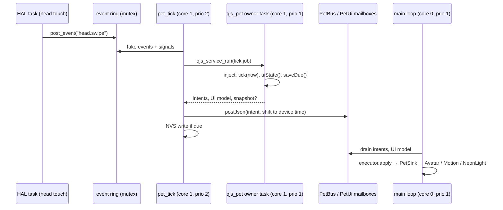

# StackChan Pet: Running the Pet on the Robot — Device Runtime, Screen UI and Real-Time Scheduling

This report covers the second stage of the StackChan pet project: moving the pet's JavaScript runtime from the desktop onto the robot, giving it a touch-screen interface, and making its head motion smooth. The first report, [[PROJECT REPORT - StackChan Pet - An Emotional Tamagotchi DSL Compiled to a Dataflow IR - A Technical Deep Dive]], explained the pet language, the compiler that turns a pet script into a dataflow graph, the reference virtual machine that executes that graph, and the C++ executor that drives the face, head and lights. At the end of that stage the robot could only replay a recorded stream of the executor's inputs. After this stage, the robot compiles a pet script itself, runs the pet's mind ten times per second, reacts to touch and motion, saves its state across power cycles, and shows a care menu, need meters, a stats page and minigame screens.

Most of the engineering in this stage was not about new features. It was about the conditions a real-time embedded system imposes: which task runs on which core at which priority, where memory comes from, which clock is authoritative, how much flash storage exists, and what happens when a garbage collector runs at the wrong moment. Each of those produced a defect that was invisible on the desktop and obvious on the robot. The report explains each one from first principles.

> [!summary]
> - The complete pet library (builder, compiler, virtual machine) now runs inside QuickJS on the ESP32-S3. It boots in about 1.05 s, compiles a pet in 1.4–2.3 s, and executes one 100 ms mind step in about 20–30 ms.
> - The JavaScript side never touches hardware. It produces plain data: intents for the C++ executor and a UI model for an LVGL overlay. Sensor callbacks only enqueue events.
> - Five defects surfaced on the hardware and were fixed: a use-after-free in the shared QuickJS service, a double-counted offline gap on restore, garbage collection inside the tick deadline, a full 16 KB NVS partition, and servo stalls caused by JavaScript tasks preempting the main loop on core 0.
> - Motion quality depends on scheduling as much as on animation: moving the JavaScript tasks to core 1 raised the servo loop from 69 Hz with 88–318 ms stalls to a steady 100 Hz with at most 10–20 ms gaps.

## Where the first stage ended

The first stage produced four things that this stage builds on. The *pet library* is about 5,700 lines of dependency-free JavaScript: a fluent builder, a compiler to an intermediate representation (IR), and a reference virtual machine (VM). The *IR* is a typed dataflow graph of about 100 nodes per pet, evaluated once per tick in a fixed order. The *executor* in `components/pet_core` is a C++ port of the part that turns the VM's output into face, head, light and voice commands, and a differential test proved it identical to the JavaScript model over about 1.7 million inputs. The *firmware overlay* composes the pinned upstream StackChan firmware with a pet app, `AppPet`, that hosts the executor inside upstream's update loop.

What was missing was the VM on the device. The executor was fed from a file recorded in the desktop simulator. This stage replaces that file with the live pet.

## Vocabulary

The rest of the report uses the following terms. They are listed in the order in which they depend on each other.

- **Core and priority.** The ESP32-S3 has two CPU cores, numbered 0 and 1. FreeRTOS, the real-time kernel, runs *tasks*; each task is pinned to a core (or free to use either) and has a numeric priority. On a given core, the highest-priority ready task always runs. A lower-priority task on the same core runs only when every higher-priority task is blocked.
- **Main loop.** The ESP-IDF main task, pinned to core 0 at priority 1. Upstream's app framework, Mooncake, runs every app's `onRunning()` from it. `AppPet::onRunning()` calls `StackChan::update()`, which runs the modifiers (including the pet executor), the face, the servo animation and the LEDs.
- **LVGL and its lock.** LVGL is the graphics library that draws the face. Its rendering task runs on core 1 at priority 3. Any code that touches LVGL objects must hold the LVGL lock; `onRunning()` holds it for the duration of `StackChan::update()`.
- **PSRAM and internal RAM.** The chip has about 200 KB of fast internal RAM and 8 MB of slower external PSRAM. Upstream configures `malloc` so that allocations of 512 bytes or less come from internal RAM, which is the scarce resource.
- **QuickJS realm.** One QuickJS runtime and context: a heap, an atom table, loaded modules and global objects. The pet realm contains the pet library and nothing that can touch hardware.
- **Owner task and job.** `components/qjs_service` gives the realm to exactly one FreeRTOS task, the *owner task*. Other tasks submit *jobs* (C functions that receive the `JSContext`) through a queue. `qjs_service_run()` blocks until the job completes; `qjs_service_post()` does not wait. Each job can have a deadline, enforced by QuickJS's interrupt handler.
- **ROM pack.** One text blob embedded in the firmware image that holds every library, kit and pet file. Its format is `@@FILE <path> <bytes>\n<content>\n`, repeated.
- **Tick.** One call into the VM that advances it to the current time. The VM runs its *mind* domain every 100 ms and its *body* domain every 1000 ms; a tick may run several domain steps.
- **Intent.** The VM's output after a mind step: the current emotion label and intensity, the valence/arousal point, the behavior, flags such as `asleep`, and a list of animation start/stop requests. It is JSON on the wire.
- **Pet time and device time.** *Pet time* is UTC milliseconds since the Unix epoch, taken from the system clock that upstream sets from the battery-backed RTC at boot. *Device time* is milliseconds since boot. The VM uses pet time; the executor uses device time.
- **Snapshot and catch-up.** A snapshot is the persistent part of the VM state (needs, lifecycle, care quality, traits, memory) plus `savedAt`, the pet time of the save. *Catch-up* simulates the body domain across the time the robot was off.
- **UI model.** A compact JSON description of what the screen UI should show: care verbs and their availability, needs in percent, stage, feeling, behavior, and the current game overlay.
- **Spring animation.** Upstream moves each servo toward a target with a critically damped spring stepped at a fixed 20 ms, then writes the resulting position to the servo.
- **Torque release.** Turning a servo's motor drive off. A servo without torque does not hold its position.

## One tick, end to end

The clearest way to see the architecture is to follow a single stroke of the robot's head through it. The trace lines below were captured from the device's serial console with `pet trace on`.

1. **Sensing.** Upstream's head-touch task detects a forward swipe and emits `onHeadPetGesture(SwipeForward)`. The callback installed by `AppPet` runs on that task. It does one thing: it calls `petjs::post_event("head.swipe", "{\"dir\":\"forward\",\"position\":0}")`, which locks a mutex, appends to a 32-entry event ring, and returns. No JavaScript runs.
2. **Dispatch.** The `pet_tick` task wakes every 100 ms. It moves the queued events and signals out of the ring under the mutex, reads pet time and device time at the same instant, and submits a tick job with `qjs_service_run()`.
3. **Mind step.** On the QuickJS owner task, the job calls `__pet.inject("head.swipe", payload)` and then `__pet.tick(now)`. The VM logs the event, delivers it to the appraisal node, and the reaction table fires:

   ```text
   PET_EV t=1767254472608 head.swipe {"dir":"forward"}
   PET_EV t=1767254472695 react.head.swipe {"event":"head.swipe"}
   PET_EV t=1767254473695 need.affection.relief {"amount":0.05,"relief":0.04}
   PET_TRACE t=1767254475395 label=love intensity=0.46 v=0.46 a=0.35 behavior=idle
   ```

   The label changes to `love` only after the 1.5 s dwell, which is why the trace line is 2.8 s after the event.
4. **Output.** `tick()` returns an array of intent JSON strings. The job also calls `__pet.uiState()`, which returns the UI model if anything visible changed, and `__pet.saveDue(now)`, which says whether a snapshot is due.
5. **Hand-off.** Back on `pet_tick`, each intent is posted to `PetBus`, a mutex-protected mailbox, with its timestamps shifted from pet time to device time. The UI model goes to `PetUi`'s mailbox. A due snapshot is written to NVS from this task.
6. **Expression.** On the next main-loop iteration (core 0, under the LVGL lock), `PetModifier::_update()` drains `PetBus` and applies the intent to the executor. The executor composes the reaction animation (happy face, heart, lean toward the hand) over the mood layer and calls `PetSink`, which translates the result into upstream calls: `Avatar::setEmotion`, feature weights, a heart decorator, and `Motion::moveWithSpeed` for the lean.
7. **Screen UI.** In the same main-loop iteration, `PetUi::update()` takes the latest UI model and updates the need meters if they are visible.



The rule that governs this design comes from earlier projects in the repository: JavaScript never runs in a hardware callback, in the LVGL rendering path, or in the frame loop. Each boundary is a mailbox holding plain data. The consequence is that a slow or failing JavaScript tick cannot freeze the face or the head. The executor keeps playing the last intent's animations from its own copy.

## Booting the pet realm

### The ROM pack and the module loader

The pet library is written as ES modules with bare specifiers such as `import { PetVM } from 'pet/vm'`. On the desktop, a Node resolve hook maps those to files. On the device there is no file system for the library, so a build step, `js/tools/make-rom.mjs`, concatenates 41 files (214 KiB) into `pet_rom.pack`, which the build embeds as a NUL-terminated binary blob. At boot, `rom_pack_load()` indexes the blob into a table of `{path, data, len}` entries under the prefix `/rom`.

The module loader in `components/pet_js_host` is shared by the desktop host and the firmware. It resolves `pet` to `/rom/lib/index.js`, `pet/<x>` to `/rom/lib/<x>.js`, `kits/<x>` to `/rom/kits/<x>.js`, and relative paths against the importing module. It asks an injected `read_source` callback for the text. On the device that callback copies the file out of the ROM table; on the desktop it reads a file. The desktop tool `petqjs --rom pet_rom.pack` therefore loads modules exactly as the robot does, which let every device path be tested on the desktop first.

Booting is a single job: install the loader and the `__host` object, then evaluate `/rom/boot.js`, which imports the library and assigns `globalThis.__pet` to the device API module. The device API is the complete contract between C and JavaScript:

| Function | Purpose |
|---|---|
| `start({path, nowMs, snapshot, tzOffsetMin})` | Load a pet file, compile it, create the VM, restore the snapshot, catch up; return a summary and `execJson` |
| `tick(nowMs)` | Advance the VM to `nowMs`; return merged intent JSON strings |
| `inject(name, payloadJson)`, `signal(name, value)` | Events and continuous signals from the hardware |
| `uiState(force)` | The screen UI model, or `null` when unchanged |
| `saveDue(nowMs)`, `snapshot()` | Persistence policy and state |
| `status()`, `hooks()`, `setTrace(on)` | Console diagnostics |

`start()` returns `execJson`, which holds only the IR sections the C++ executor reads (`styles`, `motion`, `lights`), rather than the whole IR. The reason is internal RAM. The executor parses its configuration with cJSON, which allocates one small node per JSON value; with upstream's rule that small allocations come from internal RAM, parsing the 37 KB IR would have cost on the order of 100 KB of the chip's scarcest memory. The subset is a few kilobytes.

### Sizing memory before the first flash

Memory was measured on the desktop before any firmware was built, using a desktop build of the exact QuickJS sources the firmware compiles. Two additions made that possible: `__host.memory()`, which returns QuickJS's allocation counters, and `petqjs --mem-limit N --stack N`, which applies the device's limits.

| Measurement (desktop, 64-bit) | Result |
|---|---|
| Heap after loading the library | 0.95 MB |
| Heap after compiling and starting `mochi` | 1.37 MB |
| Heap after one simulated hour of ticks | 1.37 MB (no growth) |
| Compile with a 16 KiB JS stack limit | `SyntaxError: stack overflow` in the parser |
| Compile with 20 KiB | `InternalError: stack overflow` |
| Compile with 24 KiB | passes |

A separate breakdown of the 0.95 MB library heap attributed about 200 KB to retained function source text, 128 KB to bytecode and line tables, about 210 KB to allocator rounding, about 170 KB to objects and shapes, and 78 KB to the atom table. The function source is retained because QuickJS keeps it for `Function.prototype.toString`, and the compiler depends on that: it lowers simple pet lambdas to native graph nodes by parsing their source text. The library's own functions do not need their source, so precompiling the library to bytecode is a known way to save about 200 KB and most of the boot time.

On the 32-bit target the same heap measures about 1.05–1.1 MB because pointers and values are smaller. The service is configured with generous margins:

```cpp
qjs_service_config_t cfg = {};
cfg.task_name = "qjs_pet";
cfg.task_stack_words = 64 * 1024;  // bytes on ESP-IDF; the compiler recurses deeply
cfg.task_priority = 1;             // core 1, below LVGL (see "Motion")
cfg.task_core_id = 1;
cfg.memory_limit_bytes = 4 * 1024 * 1024;
cfg.stack_limit_bytes = 56 * 1024;
cfg.psram_first = true;            // JS heap from PSRAM, internal RAM fallback
cfg.stack_in_psram = true;         // 64 KiB stack not taken from internal RAM
```

`stack_in_psram` is a new option in `qjs_service`. It creates the owner task with `xTaskCreatePinnedToCoreWithCaps(..., MALLOC_CAP_SPIRAM)`, which upstream's configuration permits (`CONFIG_SPIRAM_ALLOW_STACK_EXTERNAL_MEMORY=y`). It carries one obligation: a task whose stack is in PSRAM must not perform flash writes, because a flash operation disables the cache through which PSRAM is accessed. That obligation shaped where snapshots are written, as the next section shows.

### What the device measured

| Quantity | Value |
|---|---|
| Library evaluation (`/rom/boot.js`) | 1.05–1.15 s |
| Compile and hatch, 12 example pets | 1.43 s (pip) to 2.32 s (yuzu) |
| Nodes per pet | 100–111 |
| JS heap while running | 1.05–1.48 MB |
| Internal RAM free while running | about 177–185 KB |
| PSRAM free | about 5.7–6.9 MB |

## The tick loop

### Why a separate tick task

The tick could have been an `esp_timer` callback that posts a job every 100 ms. A dedicated `pet_tick` task was chosen because it must do three things a timer callback should not: block until the JavaScript job completes (so ticks never queue up behind a slow one), parse and forward intents, and write snapshots to NVS. The last requirement follows directly from `stack_in_psram`: the owner task cannot write flash, so the tick task, which has an ordinary internal-RAM stack, performs the write after the job returns.

```cpp
for (;;) {
  vTaskDelayUntil(&last, pdMS_TO_TICKS(100));
  // take events and signals from the ring (mutex)
  j.now = pet_time_ms();              // UTC epoch ms
  const int64_t devMs = pet_now_ms(); // ms since boot, same instant
  run_js(tick_job, &j, kTickDeadlineMs);
  for (auto& json : j.intents) PetBus::get().postJson(json.c_str(), devMs - (int64_t)j.now);
  if (!j.ui.empty()) PetUi::setModel(std::move(j.ui));
  if (!j.snapshot.empty()) write_snapshot(j.pet, j.snapshot);
  // statistics, periodic garbage collection, error policy
}
```

### Two clocks and one shift

The VM needs wall-clock time because the pet's behavior depends on the time of day (it sleeps at night) and because offline catch-up needs the real gap between power-off and power-on. The executor, the console reactions and the recorded demo all use device time. The two are joined by a single shift, `devMs - now`, computed from samples taken at the same instant and applied to every timestamp in the intent. Because both clocks advance at the same rate, the shifted times are consistent for the duration of a session.

The robot's RTC turned out to hold the year 2000, so the pet initially ran on a fallback clock (2026-01-01 08:00 UTC plus uptime). The console command `pet clock <unix seconds>` sets the system clock, writes it to the RTC through upstream's `syncSystemTimeToRtc()`, and restarts the VM on the new time base. The restart goes through a snapshot whose `savedAt` is rewritten to the new current time; otherwise the jump from the fallback clock to real time would be treated as twelve hours of offline catch-up.

### Error policy

Every tick job has a JavaScript deadline. A job that exceeds it is interrupted by QuickJS, and the tick is counted as an error. Ten consecutive errors stop the pet; a pet that fails to compile never replaces the running one. In both cases the executor keeps rendering the last intent, so the robot does not freeze.

## A use-after-free in the shared QuickJS service

The first boot of the new firmware crashed in a loop with a heap assertion:

```text
assert failed: insert_free_block tlsf_control_functions.h:400 (current && "free list cannot have a null entry")
--- 0x4038df91: free at .../newlib/src/heap.c:34
--- 0x420494d1: (anonymous namespace)::service_task(void*) at .../qjs_service.cpp:451
```

Line 451 was the last line of the job branch in the owner task:

```cpp
p->status = p->fn ? p->fn(s->ctx, p->user) : ESP_ERR_INVALID_ARG;
if (p->done) xSemaphoreGive(p->done);
if (p->heap_owned) free(p);   // line 451
```

`qjs_service_run()` allocates the job record, `p`, on the caller's stack and waits on `p->done`. `qjs_service_post()` allocates it on the heap and sets `heap_owned`. The defect is the order of the last two lines. `xSemaphoreGive` makes the waiting caller ready. If the caller's priority is higher than the owner task's, FreeRTOS switches to it immediately, before the owner task executes the next line. The caller returns from `qjs_service_run()`, its stack frame is reused, and when the owner task resumes it reads `heap_owned` from memory that now holds unrelated data. A non-zero value frees a garbage pointer, which corrupts the heap's free list.

The pet's boot task ran at priority 3 and the owner task at priority 2, so the switch happened on the first job. Every earlier user of `qjs_service` in the repository ran the owner task at priority 8, above its callers, so the caller could never run before the owner task finished the branch, and the latent defect never showed. The fix reads everything needed before signalling:

```cpp
const bool heap_owned = p->heap_owned;
if (p->done) xSemaphoreGive(p->done);
if (heap_owned) free(p);
```

The general rule is that a service must not touch a request record after signalling its completion, because the requester owns that memory again the moment the signal is delivered.

## Persistence

### When to save

The persistence policy is written in JavaScript so that it can be tested on the desktop. `saveDue(now)` returns true when `persist.every` (five minutes by default) has elapsed since the last save, or soon after any event that represents care: `care.*`, `pet.refill`, `life.stage`, `nfc.tag`. A feeding is therefore saved within one tick and cannot be lost to an immediate power cut. On the device, feeding the pet produced `saves=1 saveBytes=538`; after a reset the start summary reported `restored={"restored":8,"dropped":0}` and hunger was again 1.00.

### A double-counted offline gap

A later test of the wake button did nothing: the pet stayed asleep. The VM's event log showed the injected event stamped `1790391566045` while `Date.now()` in the same realm returned `1790391337671`. The VM was 228 seconds ahead of the wall clock. Since `tick(now)` only advances the VM forward, every tick was a no-op, and the status line confirmed it: 253 ticks had produced 1 intent.

The cause was in `start()`. It created the VM at `nowMs`, restored the snapshot, and then called `catchUp(nowMs - savedAt)`. Catch-up advances the VM's clock by the gap it simulates, so the VM ended at `nowMs + (nowMs - savedAt)`: the offline gap was counted twice. The gap in this case was the 228 s since the last periodic save. Earlier restores had happened within 60 s of a save, below catch-up's threshold, which is why the defect had not appeared.

The fix resumes the VM at the save time and catches up to the present:

```js
const resumeAt = snap && snap.pet === r.ir.pet && snap.savedAt <= nowMs ? snap.savedAt : nowMs
vm = new PetVM(r.ir, r.hookTable, { start: resumeAt, tzOffsetMin, hostNow })
restored = vm.restore(snap)
vm.catchUp(nowMs - vm.t)          // body domain only; below 60 s does nothing; capped at persist.cap
if (nowMs - vm.t > 60000) skipTo(nowMs)   // beyond the cap the pet was effectively paused
else if (vm.t < nowMs) vm.advanceTo(nowMs)
```

A regression test restores the same snapshot after gaps of 30 s, 228 s and 3 h and asserts that the VM's clock equals `now` and that the next tick produces an intent.

### A 16 KB storage partition

After all twelve example pets had been loaded on the device, saves began to fail with `ESP_ERR_NVS_NOT_ENOUGH_SPACE`. Upstream's partition table gives NVS, the key-value flash store, `0x4000` bytes, and upstream uses it for Wi-Fi credentials, servo zero points and settings. NVS also reserves a page for its own compaction. Twelve snapshot blobs of about 550 bytes each, plus their superseded versions, filled what was left.

The fix bounds the number of snapshots. NVS key `lru` holds the names of the three most recently saved pets. Before each save, `prune_snapshots()` updates that list and enumerates the namespace with `nvs_entry_find`, erasing every `s:<pet>` blob that is not in the list. Switching among three pets keeps all their progress; a fourth pet's snapshot displaces the oldest.

| NVS key (namespace `pet`) | Type | Contents |
|---|---|---|
| `name` | string | Pet to hatch at boot |
| `tz` | int32 | Local offset from UTC in minutes |
| `lru` | string | Up to three pet names, most recent first |
| `s:<pet>` | blob | Snapshot JSON (about 520–590 B) |

## Performance and garbage collection

### The cost of a tick

The first stage estimated the device's tick cost by scaling a desktop measurement by the ratio of a `fib(20)` benchmark between desktop and device (about 88×), which predicted about 7.7 ms. The device measured 20–30 ms. A microbenchmark run through the console separated the parts:

```text
pet js ... → fib20=53.5 vmTick=17.88 intentJson=0.51   (milliseconds)
```

`fib(20)` took 53.5 ms, close to the 60 ms measured on another ESP32-S3 board, so the engine runs at the expected speed. The VM step took 17.9 ms, about 220 times its desktop cost. The difference is the workload: `fib` exercises the interpreter's arithmetic and call path, while the VM performs mostly property reads and writes on objects that live in PSRAM. A CPU-bound benchmark underestimated a memory-bound workload by a factor of about 2.5. At 20–30 ms per 100 ms tick, the pet uses 20–30% of one core, which is acceptable while the planned C++ VM is not yet written.

### Garbage collection inside the deadline

After twelve consecutive pet loads, one tick failed with `InternalError: interrupted` at 544 ms, and the heap stood at 2.29 MB. Running a collection explicitly through the console measured it:

```text
PET_JS_OUT before=2291284 after=1703792 gcMs=563
```

A full QuickJS collection took 563 ms on the device, longer than the 500 ms tick deadline. QuickJS runs its cycle collector automatically from inside the allocator when the heap grows past a threshold, so the collection had started in the middle of a tick and consumed that tick's deadline.

The fix takes collection out of the ticks. The boot job sets the automatic threshold to the maximum value, which disables it, because QuickJS resets the threshold only inside its automatic trigger (`js_trigger_gc`) and never inside an explicit `JS_RunGC`. The tick task runs `JS_RunGC` in a job of its own every 300 ticks (30 s), and the start job runs one after compiling, when the compiler's garbage is largest. The tick deadline was raised to 1 s as a margin. After the change, four pet switches produced no tick errors, and a periodic collection measured 158–161 ms. The 590 KB freed by the explicit collection also showed that most of the heap growth was collectable garbage. The remaining growth, about 48 KB per pet load, is the pet file's module record, which QuickJS never unloads. Pet switches are rare, so this was recorded rather than fixed.

## The screen UI

### A model, not a script

The screen UI follows the same boundary as the executor. JavaScript computes a model; C++ renders it. `uiState()` builds the model from the VM's context and the compiled care menu, rounds every number so that the JSON changes only when something visible changes, and returns `null` otherwise:

```json
{"pet":"mame","stage":"baby","form":null,"ageDays":0,"feel":"neutral","behavior":"sleep",
 "asleep":true,"quality":100,"needs":{"affection":84,"energy":84,"fun":77,"hunger":97},
 "care":[{"verb":"feed","icon":"food","ok":true,"ui":null},
         {"verb":"play","icon":"ball","ok":true,"ui":null},
         {"verb":"lights","icon":"bulb","ok":true,"ui":null},
         {"verb":"stats","icon":"chart","ok":true,"ui":"stats"}],
 "overlay":null}
```

It costs 0.012 ms on the desktop, so it is called on every tick. That keeps game overlays responsive: an overlay appears on screen within about 100 ms of the VM opening it.

### Rendering with LVGL

`PetUi` builds its objects on `lv_layer_top()`, a layer LVGL draws above the active screen, so the face underneath is untouched. Its `update()` runs from the main loop under the LVGL lock, and its button callbacks run in the LVGL task, which holds the same lock, so all access to its state is serialized.

| Element | Behavior |
|---|---|
| Care bar | Bottom strip, one button per verb; appears on a tap on the face, hides after 6 s without interaction; a disabled verb is greyed |
| Need meters | Top strip, one bar per need: green, orange below 30%, red below 15% |
| Stats page | Full screen: name, stage and form, age, feeling, behavior, care quality, needs; tap or 10 s to close |
| Game overlay `split` | Two tappable halves; a tap posts `screen.tap` with the half's centre x |
| Game overlay `choice` | A row of buttons along the bottom edge |
| Banner and toast | Short text over the face (game score; "Yum!", "Good night") |

Game input goes back through the pet as an ordinary `screen.tap` event with an x coordinate, and the game node maps x to an option. The simulator's games and the device's games therefore share their logic entirely.

### Making every button meaningful

The first version posted `care.<verb>` for every button, and testing showed that only some verbs did anything visible. Feed raised hunger from 0.80 to 1.00. Play did nothing on an egg, because behaviors are gated by life stage and the egg stage admits none. Clean produced only a small reaction, because the pet had no hygiene need to refill. Lights only nudged the mood toward sleepy. Four changes followed.

First, the compiler records which needs each verb refills, and `uiState()` hides a verb whose refills all target needs the pet does not have. Second, an egg can only open the stats page. Third, a real wake-up path was added. A new default behavior, `wake`, is triggered by `care.wake` and belongs to the care class, which outranks the drive class of `sleep`, so it pre-empts sleep immediately. The built-in sleep score was changed so that a recent wake suppresses sleep for ten minutes:

```js
const sinceWake = g.ops.since('care.wake')
const woken = g.ops.and(g.ops.lt(sinceWake, 600000), g.ops.lt(sinceWake, g.ops.since('care.lights')))
const score = g.place(g.ops.select(g.ops.and(g.ops.or(nightTired, lightsOff), g.ops.not(woken)), 0.95, 0), `${name}Score`)
```

The second comparison makes lights-out win when it is more recent than the wake. The Lights button reads "Sleep" or "Wake" from the model's `asleep` flag and sends `care.lights` or `care.wake`. Fourth, each press shows a short toast. A separate detail: the game's hint "← or →" rendered as blanks because LVGL's built-in Montserrat fonts contain no arrow characters, so `PetUi` maps them to LVGL's own symbol glyphs.

## Motion

### How upstream moves a servo

Each of the two head servos is a Feetech SCS0009 on a 1 Mbaud serial bus. Upstream's `Servo` class animates toward a target with a spring:

```cpp
void Servo::update() {
  if (GetHAL().millis() - _last_tick < 20) return;   // at most 50 Hz
  _last_tick = GetHAL().millis();
  if (!_angle_anim.done()) {
    _angle_anim.updateWithDelta(0.02f);               // fixed 20 ms step
    set_angle_impl(static_cast<int>(_angle_anim.directValue()));
  }
  // ... snap to target at rest; auto torque release 200 ms after rest
}
```

`set_angle_impl` writes the new position with `WritePos(id, pos, 20, 0)`: the servo is told to reach the position in 20 ms. The design assumes that `update()` is called every 20 ms. Two consequences follow. If the caller is late, the spring still advances by exactly 20 ms of simulated time, so the animation slows down. And the servo, having been told to arrive in 20 ms, arrives and then stands still until the next command, so the motion becomes a sequence of short moves separated by pauses.

`moveWithSpeed(angle, speed)` maps a speed of 0–1000 to a critically damped spring: stiffness `10 + (speed/1000)^2 × 640` and damping `2 × sqrt(stiffness)`. The pet uses 700 for reactions, 450 for behaviors and 250 for mood changes.

### Why the head moved in hitches

`Servo::update()` is called from `StackChan::update()`, which runs in the main loop: the ESP-IDF main task on core 0 at priority 1. The pet's QuickJS owner task had been placed on core 0 at priority 2 and the tick task on core 0 at priority 3. Both outrank the main loop, so for the 20–30 ms of every tick, and for the entire duration of a garbage collection, the main loop could not run and no servo was updated. Instrumenting `onRunning()` made the effect measurable:

| Configuration | Main-loop rate | Longest gap between iterations |
|---|---|---|
| JS tasks on core 0 (priority 2–3) | 69 Hz | 42–88 ms; 318 ms during a collection |
| JS tasks on core 1 (priority 1–2, below LVGL) | 99–100 Hz | 10–20 ms, including during a collection |

After the move, a periodic 158 ms collection no longer appears in the main loop's timing at all. Core 1 is shared with the LVGL rendering task, which runs at priority 3 and therefore preempts the JavaScript tasks rather than the other way round. A slower tick costs the pet a little latency; it no longer costs the head its motion.

### Torque, momentum and the breathing bob

Three further upstream defaults affected motion quality, and each was changed in the pet's sink rather than in upstream code.

- **Automatic torque release.** Upstream turns a servo's torque off 200 ms after every move comes to rest. The pitch servo then sags under the head's weight, and the next move re-engages the motor from the sagged position. The pet now disables the automatic release, holds torque while it is active, and releases it only after 20 s without head commands. This is the rule the design document specified.
- **Automatic angle sync.** With sync enabled, every new target first reads the servo's actual position over the bus and restarts the spring from it with zero velocity. Upstream's own comment in `servo.h` notes that this "may cause stuttering during high-frequency updates". The pet disables it so that the spring keeps its velocity between targets, and re-enables it for exactly one move after a torque release, when the head may have been moved by hand.
- **The breathing modifier.** Upstream's `BreathModifier` moves the eyes and mouth up and down by up to 16 pixels, but recomputes the offset only every 600 ms, so the face moves in visible jumps that read as a jerky nod. The pet constructs it with an 8-pixel amplitude and a 40 ms update interval, which the constructor already accepted as parameters.

One gap remains. The pet language's head gestures (`nod`, `shake`, `bounce`, `wobble`, `lookAround`, `dance`) are recorded by the C++ executor as a gesture name, but no code turns the name into motion; the head moves only between pose targets. Implementing gestures as smooth trajectories in both the JavaScript executor model and the C++ executor, with the differential test extended to cover them, is the next motion task.

## What is reused and what is new

Almost everything that draws, moves or senses is upstream code, unmodified. The pet contributes the decision-making and the glue.

| Part | Lines | Origin |
|---|---|---|
| Upstream `firmware/main/stackchan` (face, modifiers, motion, lights) | 6,254 | Upstream, unmodified |
| Upstream `firmware/main/hal` (board, servos, touch, IMU, RTC, power, audio) | 49,473 | Upstream, unmodified |
| Upstream standard apps | 6,444 | Removed from the build |
| `overlay/.../app_pet` (app, sink, bus, console, `pet_js`, `pet_ui`) | about 2,230 | New |
| `components/pet_core` (executor) | 678 | New |
| `components/pet_js_host` (loader, ROM pack) | about 500 | New |
| `js/lib` (builder, compiler, VM, device API) | about 5,700 | New |

## Testing and evidence

| Check | Result |
|---|---|
| Node test suite | 99/99 (adds device API, UI model, restore-time and wake/sleep tests) |
| Firmware build | `stack-chan.bin` 0x3fc5e0 bytes, 19% of the app partition free |
| Boot on the device | `PET_JS ready rom=41 bootMs=1149 ... compileMs=1668 restored={"restored":8,"dropped":0}` |
| All 12 example pets on the device | `PET_OK pet=<name>` for each; 1.43–2.32 s; 100–111 nodes; 0–6 hooks |
| Game overlay | `{"kind":"split","options":["left","right"],"round":1,"rounds":5}`, `behavior=game.which-way` |
| Wake after the restore fix | `behavior=idle`; 146 intents in 149 ticks |
| Garbage collection | `gcs=1 gcMsLast=158`, `errors=0` over hundreds of ticks |
| Main loop | `PET_LOOP hz=99 maxGapMs=20` |

Evidence logs are in the ticket's `various/` directory: firmware builds `fw-build-6` to `fw-build-16`, and serial sessions `monitor-2` to `monitor-12`, captured by teeing `idf.py monitor` inside a shared tmux session.

## Design decisions and deviations

- **JavaScript placement.** The design placed the QuickJS task on core 0. Measurement showed that any JavaScript work on core 0 above priority 1 stalls the servo loop, so all pet JavaScript now runs on core 1 below LVGL. This is a scheduling fact about upstream's firmware, where the main loop is the lowest-priority task on core 0, and it will apply equally to the planned C++ VM if that VM runs its hooks in QuickJS.
- **Tick deadline.** The design specified a 20 ms hook deadline and assumed a 2 ms tick. The measured tick is 20–30 ms and a collection 0.16–0.56 s, so the tick deadline is 1 s and collection runs in its own job.
- **Persistence size.** The design allowed up to 4 KB of snapshot per pet in NVS. The partition is 16 KB and shared, so snapshots are limited to three pets.
- **UI availability rules** live in the device API rather than the compiler. They depend on runtime state (life stage), so they cannot be decided at compile time.

## Status and next steps

The pet runs on the robot, all Phase 2 tasks are complete, and a first version of the Phase 5 screen UI is on the device with placeholder visuals. A commission brief for replacement art, including the C++ interface a new face skin must implement, is in the ticket as `reference/03-art-and-ui-commission-brief.md`. The open work, in order:

1. Head gestures as smooth trajectories in both executors, with differential coverage.
2. The voice (Phase 3): a procedural synthesizer on its own task, driven by the executor's voice events, which are currently only logged.
3. A face skin built from the commissioned art, with the emotion label and intensity carried in the executor's face output.
4. The C++ VM (Phase 4), which removes the 20–30 ms JavaScript tick and most of the 1.1 MB heap for pets without custom hooks.

## Reproduction

```bash
cd /home/manuel/code/wesen/go-go-golems/esp32-s3-m5/0120-m5stackchan-pet
(cd js && node tools/run-tests.mjs)                                   # 99 tests
(cd host/qjs && make && ./build/petqjs --rom ../../overlay/firmware/main/pet_assets/pet_rom.pack \
    ../../js/tools/device-mem.js tofu)                                 # heap sizing on the desktop
./scripts/prepare.sh && source ~/esp/esp-idf-5.5.4/export.sh && ./scripts/build.sh
cd .work/StackChan/firmware && idf.py -p /dev/serial/by-id/usb-Espressif_USB_JTAG_serial_debug_unit_44:1B:F6:E2:80:28-if00 app-flash monitor
# at the pet> prompt:
#   pet status        pet trace on        pet emit head.swipe {"dir":"forward"}
#   pet clock <unix>  pet tz -240         pet load mame        pet hooks
```

Connect USB to the CoreS3 module in the head, not to the base connector; the base connector loses contact when the head moves.

## Key points

- The JavaScript realm on the device produces only data. Intents go to the C++ executor and a UI model goes to the LVGL overlay, each through a mailbox. Hardware callbacks only enqueue events, so a slow tick never freezes the face or the head.
- A service must not read a request record after signalling its completion. The requester may run immediately and reuse that memory, as the `qjs_service` use-after-free showed when a caller outranked the owner task.
- Restoring a snapshot means resuming at the save time and catching up to the present. Starting at the present and then catching up counts the offline gap twice.
- A full QuickJS collection of a 1–2 MB heap takes 0.16–0.56 s on the ESP32-S3. A deadline-guarded job must not share its budget with the automatic collector; collect explicitly in a job of its own.
- Upstream's servo animation assumes a 50 Hz caller. Motion quality is therefore a scheduling property: any task that outranks the main loop on core 0 turns smooth springs into hitches.
- The StackChan's NVS partition is 16 KB and shared with upstream, so anything stored per item must be bounded.

## Related notes

- [[PROJECT REPORT - StackChan Pet - An Emotional Tamagotchi DSL Compiled to a Dataflow IR - A Technical Deep Dive]]: the first stage (the language, compiler, VM, executor and first firmware).
- Ticket diary (repository): `ttmp/2026/09/24/ESP-63-STACKCHAN-TAMAGOTCHI--.../reference/02-investigation-diary.md`, steps 13–15.
- Art and UI commission brief (repository): `ttmp/2026/09/24/ESP-63-STACKCHAN-TAMAGOTCHI--.../reference/03-art-and-ui-commission-brief.md`.
