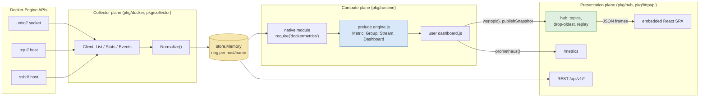
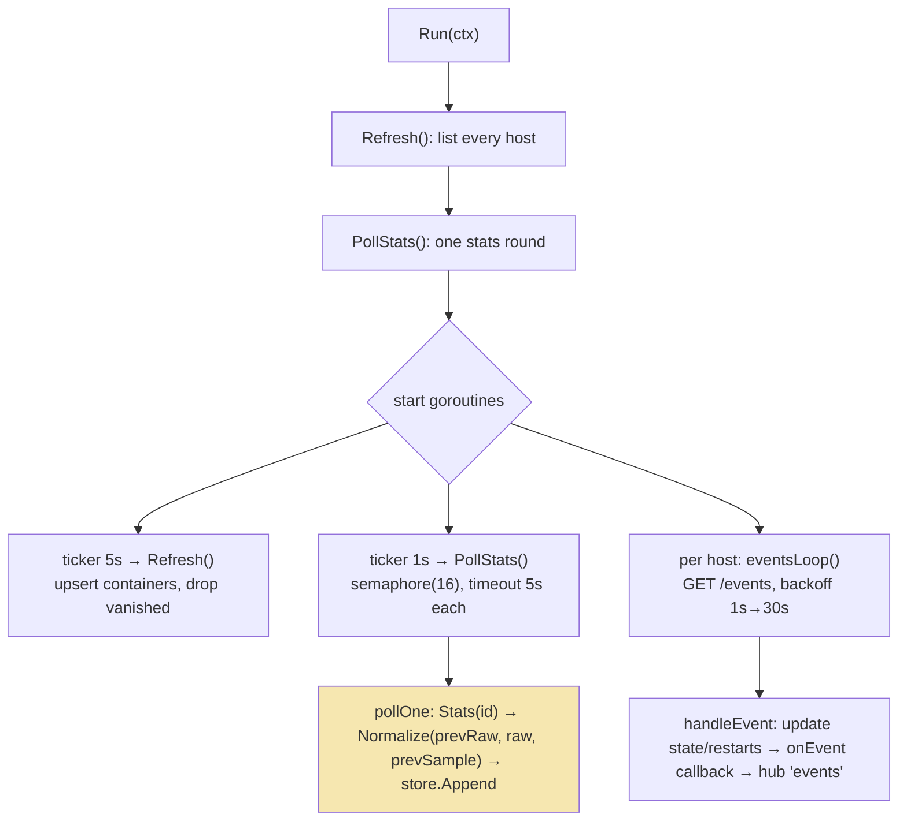
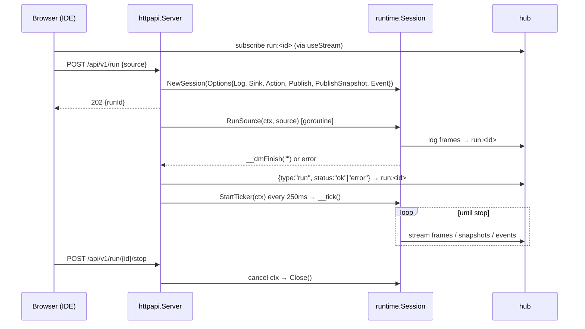
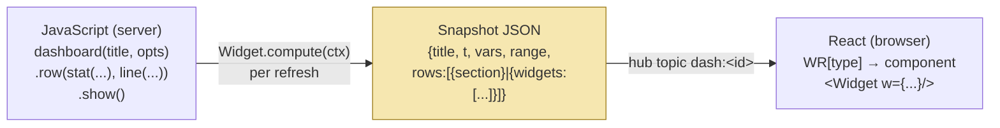

# docker-metrics — A Self-Contained Docker Metrics Daemon with a Backend JavaScript DSL

## 0. What this document is

This is the project report for `docker-metrics`, built in one day (2026-10-06) under the docmgr ticket `DOCKERMETRICS-001`. The project is a single Go binary that polls one or more Docker daemons, keeps an hour of per-container history in memory, evaluates user-written JavaScript against that history inside an embedded `go-go-goja` runtime, and serves the results three ways: a live WebSocket feed, a Prometheus `/metrics` endpoint, and an embedded React application with a dashboard view and an IDE. A second iteration (v2) added user-authored dashboards: a JavaScript builder API compiles a dashboard into a JSON snapshot on the server, and the React application renders that snapshot with a generic widget interpreter that contains no metric logic.

The report explains how each part works, why it is built that way, and which failures shaped it. It is written so that an engineer who has not opened the repository can understand the system from this document, and so that the two reusable patterns in it — *keep a DSL in one language and give the host only the leaves*, and *compile a view to data on the server and interpret it on the client* — can be lifted into other projects.

The evidence lives in the repository and its ticket workspace:

```text
/Users/manuel.odendahl/code/wesen/2026-10-06--docker-metrics/
├── pkg/{docker,store,collector,runtime,hub,httpapi,load,cli}/   the Go daemon
├── pkg/runtime/prelude/engine.js                                the JavaScript DSL (1,244 lines)
├── web/src/                                                      the React application
├── testdata/dashboards/*.js                                      runnable dashboard fixtures
└── ttmp/2026/10/06/DOCKERMETRICS-001--docker-metrics-daemon-and-react-ide-analysis-design-and-implementation-guide/
    ├── design-doc/01-analysis-design-and-implementation-guide-for-interns.md   the v1 design
    ├── design-doc/02-dashboard-dsl-and-widget-interpreter-v2.md               the v2 design
    ├── reference/01-system-reference-http-websocket-prometheus-and-dashboard-dsl.md
    ├── reference/02-docker-engine-api-and-metrics-collection-notes.md
    ├── playbook/01-build-run-and-test-playbook.md
    ├── log/01-implementation-diary.md                             19 steps, failures included
    └── sources/local/dockermetrics-ide-{prototype,v2}.html        the two browser prototypes
```

The commit history follows the phases one to one:

| Commit | Phase |
| --- | --- |
| `db4c8bf` | Scaffold from `go-go-golems/go-template` |
| `6822b2a` | Intern design guide, references, playbook, diary |
| `a151eb9` | Phase 1 — Docker client, store, normalizer, `poll` |
| `b7a19ce` | Phase 2 — go-go-goja runtime, DSL prelude, `run`/`check` |
| `bb98ad7` | Phase 3 — WebSocket hub, HTTP API, Prometheus, `serve` |
| `485145d` | Phase 4 — React atomic-design IDE, RTK Query, embedded build |
| `e5f6d59` | Phase 5 — container mutations gated behind `--allow-mutations` |
| `7d93067` | `load` mode, Dockerfile, compose demo fleet; embed and hub fixes |
| `74be295` | v2 design guide for the dashboard DSL |
| `676e91a` | Phase B — backend dashboard DSL and snapshot publishing |
| `3a6a7d7` | Phase C — React widget interpreter and `/d/<id>` routes |

## 1. The problem and the governing constraint

An operator with a few Docker hosts wants three kinds of answers. *Now*: which containers are hot, leaking, restarting or idle. *Over time*: what CPU, memory and network looked like over the last hour. *Derived*: is memory above 85% of the limit for more than three minutes, or is one replica burning more CPU than its siblings. `docker stats` answers the first question interactively but cannot be scripted, stored or composed. Prometheus with cAdvisor and Grafana answers all three, but it is a multi-process stack, and authoring a new view means writing PromQL and editing dashboard JSON.

The project's constraint is stated in the first design document: **one binary, no external database, and user-authored logic that does not require a recompile.** The first two clauses rule out a metrics stack. The third clause is the reason the system contains a JavaScript engine. If a new derived metric or alert required changing Go code, the binary would have to be rebuilt for every question an operator wants to ask. Embedding an interpreter moves the question into data: the operator writes a program, the daemon evaluates it against live samples.

The product specification was not a written document. It was a browser prototype, `dockermetrics-ide-prototype.html` (about 900 lines of React 18 loaded from a CDN, plus a simulated engine called `DM`). The prototype already defined the DSL that operators type, its semantics, the UI layout and 21 worked presets. The design guide states the rule that followed from this: *when the prototype and your intuition disagree, the prototype wins.* The engineering task was therefore a port — keep the DSL and the UI, replace the simulated world with a real one.

## 2. Concepts, in the order the rest of the report needs them

The terms below are used precisely throughout. Each depends only on terms above it.

- A **host** is one Docker Engine API endpoint, written in `DOCKER_HOST` syntax: `unix:///var/run/docker.sock`, `tcp://prod-3:2375` or `ssh://ops@prod-1`. Each host has a short name (`local`, `prod-3`) used in selectors.
- A **sample** is one normalized reading of one container at one second: CPU, memory working set, memory limit, cumulative network and block-I/O byte counters, and process count.
- The **store** holds a fixed-capacity ring buffer of samples per container, keyed by `host/name`.
- A **metric** is a JavaScript value describing how to turn a container's samples into numbers: a source (`cpu`, `mem`, `net.rx`, …) plus an ordered list of **ops**. An op is a *map* (`pct`, `mb`, `of("limit")`), a *rate* (`rate("1s")`) or a *reduce* (`avg`, `p95`, `sum`, …).
- A **group** is a live selector over containers (`docker().containers({label: "tier=backend"})`). It re-resolves its members on every use.
- A **predicate** is a boolean-valued signal derived from a metric (`cpu.is(gt(0.9))`), combinable with `and`, `or`, `not` and `sustained`.
- A **stream** evaluates an expression periodically and writes each result, a **frame**, to **sinks** (`prometheus()`, `file()`, `tap()`, `ws(topic)`).
- A **rule** binds a predicate to actions (`emit`, `restart`, `stop`, `start`) with a cooldown; a **watcher** evaluates rules on every tick.
- The **prelude** is the JavaScript file that defines all of the above. It is evaluated once per runtime before user code.
- A **session** is one goja virtual machine with the prelude evaluated and the `dockermetrics` native module registered.
- A **topic** is a named WebSocket channel in the hub (`fleet`, `events`, `run:<id>`, `dash:<id>`).
- A **dashboard** (v2) is a builder that holds rows of **widgets**; it compiles to a **snapshot**, a plain JSON document that the React **interpreter** renders.

## 3. Architecture: three planes in one process

The binary is organized as three planes that communicate through narrow interfaces. The **collector plane** talks to Docker and writes samples. The **compute plane** runs JavaScript sessions that read samples and emit frames. The **presentation plane** fans frames out over WebSocket, renders Prometheus text and serves the React application. The store is the only mutable state shared between the collector and compute planes, and it sits behind the `store.Store` interface.



This decomposition buys three properties. Each plane can be tested against a fake of its neighbour: the collector against a fake `Source`, the runtime against a fake store, the hub with an in-memory WebSocket round trip. Docker credentials and sockets never reach JavaScript; a script sees numbers and metadata only. And Prometheus consumers and browser consumers read the same data without depending on each other.

The `serve` command (`pkg/cli/serve.go`) wires the planes together in a fixed order: build Docker clients from `--host` flags, create `store.NewMemory(capacity)`, create the hub, create the collector, create the runtime manager, create the HTTP server, register a collector event callback that records and publishes Docker events, start the collector goroutine, start a built-in "fleet" dashboard 300 ms later, and listen. `SIGINT`/`SIGTERM` cancel a shared context, and `http.Server.Shutdown` drains with a 10-second budget.

## 4. The collector plane

### 4.1 A hand-rolled Docker client

The collector needs four endpoints: `GET /containers/json?all=1`, `GET /containers/{id}/stats?stream=0`, `GET /events` and `GET /version`. Phase 5 added three `POST` endpoints for restart, stop and start. The design guide initially suggested the `moby/moby/client` package; the implementation instead writes a client directly in `pkg/docker/client.go`. The diary records the reason: the moby client pulls a large dependency tree to reach `/stats`, and a small client behind an interface is trivially fakeable.

The client differs per host kind only in its `http.Transport`. For `unix://` the transport's `DialContext` ignores the requested address and dials the socket path; the base URL is the placeholder `http://docker`. For `tcp://` it is an ordinary transport. For `ssh://` the dialer opens a TCP connection to port 22, performs an SSH handshake, and then calls `ssh.Client.Dial("unix", "/var/run/docker.sock")` on the remote side, returning that channel as the `net.Conn` that HTTP runs over. This is what the Docker CLI does for SSH hosts, implemented without shelling out to `docker system dial-stdio`.

```go
// pkg/docker/client.go (abridged)
return func(ctx context.Context, _, _ string) (net.Conn, error) {
    raw, err := d.DialContext(ctx, "tcp", addr)          // ops@prod-1:22
    cc, chans, reqs, err := ssh.NewClientConn(raw, addr, cfg)
    sc := ssh.NewClient(cc, chans, reqs)
    return sc.Dial("unix", sock)                          // remote docker.sock
}, nil
```

SSH authentication tries the agent at `SSH_AUTH_SOCK` and then `~/.ssh/id_{ed25519,rsa,ecdsa}`. Host keys are verified with `knownhosts` against `~/.ssh/known_hosts`, `known_hosts2` or `/etc/ssh/ssh_known_hosts`; if none exists, the client refuses to connect. There is no insecure fallback. TLS client certificates for `tcp://:2376` are not supported yet.

`Negotiate` reads `/version` once and pins the API version prefix (`/v1.47/...`) for subsequent calls, so the client speaks whatever version the daemon reports.

### 4.2 The arithmetic: from Docker counters to a sample

Docker's stats endpoint does not return a CPU percentage or a memory figure that matches what operators expect. It returns cumulative counters and raw usage, and the client must derive the numbers. This is the mathematical core of the collector; every dashboard is wrong if it is wrong.

**CPU.** The stats payload contains `cpu_stats` and `precpu_stats`, each with `cpu_usage.total_usage` (cumulative nanoseconds of CPU time consumed by the container) and `system_cpu_usage` (cumulative nanoseconds of CPU time available on the host, summed across all cores), plus `online_cpus`. The ratio of the two deltas is the container's share of the *whole host*. Multiplying by the number of online CPUs converts that share into units of one core:

```text
cpuDelta    = cur.total_usage      - prev.total_usage
systemDelta = cur.system_cpu_usage - prev.system_cpu_usage
fraction    = (cpuDelta / systemDelta) * onlineCPUs        // fraction of ONE core
```

A worked example on an 8-core host sampled one second apart: the container consumed 0.4 s of CPU time, so `cpuDelta = 4×10⁸ ns`; the host had 8 cores × 1 s available, so `systemDelta = 8×10⁹ ns`. The ratio is 0.05 of the host, and `0.05 × 8 = 0.4` cores. `docker stats` would print `40%`; docker-metrics stores `0.4`, and the DSL's `pct` op renders it as `40`. A container saturating two cores reads `2.0`.

The first design draft stated this convention ambiguously; the diary records that the unit was confirmed against `docker stats` during the first live run and the design document was corrected in the same commit. `store.Sample` documents the unit in its doc comment and `TestCPUFractionIsFractionOfOneCore` locks it. `CPUFraction` returns `false` when there is no previous payload, when `systemDelta <= 0`, or when `cpuDelta < 0`; `Normalize` then carries the previous sample's CPU forward and records `CPUValid: false` on the very first sample. The implementation diffs against the previous payload the collector stored itself, not against Docker's embedded `precpu_stats`, so the delta spans exactly one collector interval.

**Memory.** `memory_stats.usage` includes the page cache, which the kernel can reclaim, so containers that read files look larger than they are. The working set subtracts the inactive file cache. The key differs between cgroup versions, so `WorkingSet` tries the v1 key first and falls back to the v2 key:

```go
cache := m.Stats["total_inactive_file"]   // cgroup v1
if cache == 0 { cache = m.Stats["inactive_file"] }   // cgroup v2
if m.Usage <= cache { return 0 }
return m.Usage - cache
```

The live validation in the diary compared this figure to `docker stats`: `playback-db 140.2 vs 133.8 MiB`, `playback-nats 28.1 vs 26.79 MiB`, `dagger 239 vs 228 MiB`. The residual gap is unit (MB versus MiB): 133.8 MiB is 140.3 MB.

**Network and block I/O.** `networks` is a map from interface to `{rx_bytes, tx_bytes}`; `blkio_stats.io_service_bytes_recursive` is a list of `{op, value}`. Both are cumulative. `Normalize` sums them into four counters and *stores the counters, not rates*. Rates are the DSL's job (`net.rx.pipe(rate("1s"))`), which lets an operator ask for a per-second or per-minute rate from the same data.

**Counter resets.** When a container restarts, Docker creates a new network namespace and cgroup, so cumulative counters drop to near zero. A naive `rate` would compute a large negative value. `Normalize` clamps the four counters to be monotonic: if the new value is below the previous sample's, the previous value is kept. The consequence, flagged in the diary for review, is that a restarted container reports a flat counter — and therefore a zero rate — until its new counter exceeds the old one. An alternative is to emit an explicit reset marker; that is listed as an open decision.

### 4.3 The store: bounded memory by construction

`pkg/store/ring.go` is a fixed-capacity circular buffer. It allocates its backing slice once and never again; `append` overwrites the oldest slot when full; `lastN(n)` returns a fresh copy of the newest `n` samples, oldest first, so callers can keep the slice without holding the lock. `store.Memory` maps `host/name` keys to `{Container, *ring}` behind one `sync.RWMutex`. The key includes the host because container names are unique per host, not globally.

Memory use is `capacity × containers × sizeof(Sample)`. With the default capacity of 3,600 samples (one hour at one-second cadence) and a sample of roughly 90 bytes, 200 containers occupy about 63 MB. The figure is fixed at construction time, which is the property a long-running daemon needs.

### 4.4 The collector loops

`collector.Collector.Run` primes the store with one list refresh and one stats round before it starts any ticker, then runs three kinds of goroutine until its context is cancelled:



`PollStats` launches one goroutine per running container, bounded by a semaphore channel of size `Concurrency` (16). Each request gets its own `context.WithTimeout(StatsTimeout)`, so one slow container cannot stall the round; a 404 means the container vanished and is ignored until the next `Refresh` removes it. The previous raw payload per container lives in a mutex-protected map in the collector, not in the store, because only the collector needs it.

The event loop reads the newline-delimited JSON stream from `/events` with a `bufio.Scanner` (buffer raised to 1 MiB for large events), updates the container's state for `start`, `die`, `restart`, `destroy`, `pause` and `unpause`, increments the restart count on `restart`, and forwards the event to a callback. When the stream ends it reconnects with exponential backoff from 1 s to 30 s. Docker's `RestartCount` from the list endpoint is the baseline; events only add to it between refreshes.

Two timing facts surfaced during live testing, and both are encoded in the defaults:

1. **The first `stream=0` read blocks for about one sampling interval.** The first live `poll --once` run printed `0.00` CPU and `context deadline exceeded` warnings. Docker computes a one-shot stats reading by waiting for its own next sample when it has none cached, and under concurrency that exceeded the 2 s timeout the design had proposed. The default `StatsTimeout` became 5 s, with a comment in `DefaultConfig` explaining why.
2. **A one-shot CPU value needs two rounds a full interval apart.** `PollOnce`, used by the `poll --once` and `run` commands, does `Refresh`, `PollStats`, waits one second, and polls again, so that `systemDelta` is non-zero.

A related bug appeared in Phase 3: `/api/v1/containers` returned `null` for the first seconds after startup because `Run` started its tickers without an initial poll. Priming the store before the tickers fixed it.

## 5. The compute plane

### 5.1 Why the DSL lives in JavaScript, and only there

The design guide calls this "the single most important design decision in the whole system": **port the engine once, into JavaScript; keep Go thin.** The alternatives considered were a Go expression language, CEL, Starlark, Lua, and a Node.js sidecar. CEL and Starlark handle simple expressions but not asynchronous streams and imperative rule actions. Lua would work as an engine, but the prototype, its DSL and its 21 presets are JavaScript. A Node sidecar violates the one-binary constraint. Reimplementing `Metric`, `Pred` and `Group` in Go would produce two implementations of the same semantics — one in the browser prototype, one in the daemon — and they would diverge.

goja is a pure-Go ECMAScript engine with no cgo. `go-go-goja` (v0.10.6) is the go-go-golems wrapper around it that adds explicit runtime composition, a native-module registry, module middleware for sandboxing and an owner/event-loop model for calling into a VM from other goroutines. The follow-up instruction in the ticket was explicit: use `go-go-goja` for the backend JavaScript.

The division of labour is therefore:

| Layer | Language | Responsibility |
| --- | --- | --- |
| `dockermetrics` native module | Go | Leaves: container list, samples, clock, and callbacks out to sinks, hub, events and mutations. |
| `prelude/engine.js` | JavaScript | The entire DSL: ops, metrics, predicates, selectors, grouping, windows, reports, rules, streams, sinks, dashboards, widgets. |
| user `dashboard.js` | JavaScript | The operator's program, evaluated after the prelude with every DSL name in global scope. |

### 5.2 Building a session

`runtime.Manager.NewSession` builds a fresh runtime for every session:

```go
// pkg/runtime/manager.go (abridged)
factory, err := engine.NewRuntimeFactoryBuilder().
    WithModules(registrar{st: m.st, state: state}).
    UseModuleMiddleware(engine.MiddlewareOnly("dockermetrics")).
    Build()
rt, err := factory.NewRuntime(
    engine.WithStartupContext(ctx),
    engine.WithLifetimeContext(ctx),
)
_, err = rt.Owner.Call(ctx, "prelude", func(_ context.Context, vm *goja.Runtime) (any, error) {
    _, err := vm.RunString(preludeJS)          // //go:embed prelude/engine.js
    return nil, err
})
```

Three details matter. First, the module is registered through go-go-goja's `RuntimeModuleRegistrar` interface rather than a package-level `init()` registration. The registrar value carries the store and a per-session `moduleState`, so two sessions — or two tests — can see different stores and different callbacks; there is no global singleton. Second, `MiddlewareOnly("dockermetrics")` restricts `require()` to that one module, so a script cannot load `fs`, `exec` or a network module even if one is registered elsewhere in the process. Third, every interaction with the VM goes through `rt.Owner.Call`, which runs the function on the goroutine that owns the VM. A goja runtime is not safe for concurrent use; the owner serializes access.

### 5.3 The native module: pull-only leaves and outbound callbacks

`pkg/runtime/module.go` defines what JavaScript can reach. The exports fall into two groups.

The **read side** is pull-only. `containers(host)` returns the container list from the store, sorted by host then name, with the memory limit and PID limit taken from the most recent sample. `samples(host, name, n)` returns up to `n` samples as plain objects. `now()` returns Unix seconds. JavaScript cannot list hosts, open sockets or call Docker; it can only ask for data the collector already gathered.

The **write side** consists of callbacks that the session's creator supplies through `runtime.Options`:

```go
type Options struct {
    Log             func(level, text string)                       // console.*
    Sink            func(kind string, opts, payload map[string]any) // prometheus|statsd|file
    Event           func(name string, payload map[string]any)       // emit()/rules
    Action          func(action string, names []string, opts map[string]any) // restart|stop|start
    Publish         func(topic string, frame map[string]any)        // ws(topic)
    PublishSnapshot func(id string, snapshot map[string]any)        // dashboard().show()
    AllowMutations  bool
    TickInterval    time.Duration
}
```

Every callback is optional; a nil callback makes the corresponding JavaScript call a no-op. This is how the same prelude serves three hosts with different capabilities. The `check` command passes no callbacks at all. The `run` command wires `Log`, `Sink` and `Event` to stdout and files. The server wires everything to the hub and the Prometheus registry. The diary's Step 19 records the consequence of this design: a dashboard executed with the CLI `run` command computes its snapshots but publishes nothing, because the CLI process has no hub and does not set `PublishSnapshot`. That is correct behaviour, but it had to be discovered.

### 5.4 The prelude as a value graph

The prelude is an immediately invoked function that defines the DSL, installs every name on `globalThis`, and returns a small bridge object for Go. The organizing idea, carried over from the prototype, is that **the API is a graph of immutable values**, and Go is consulted only when the graph is collapsed into numbers.

`cpu` is a `Metric` with source `{kind: "base", get: s => s.cpu}` and an empty op list. `cpu.pipe(pct, avg)` returns a *new* `Metric` with ops `[map pct, reduce avg]`; the original `cpu` is unchanged, so operators can name and reuse partial pipelines. `pipe` enforces two rules: at most one reducer per metric, and a `{window: "5m"}` argument must follow a reducer, in which case it is attached to that reducer. The op list is then read through three getters that split it at the reducer:

```js
get pre()     { /* ops before the reducer: per-sample maps and rates */ }
get reducer() { /* the single reduce op, possibly with .window */ }
get post()    { /* maps applied to the reduced scalar */ }
```

Series evaluation applies `pre` to one container's samples. `valueOf` turns that into one number per container: with a windowed reducer it reduces the last `window` points of that container's series; otherwise it takes the latest point. `Group._one` then combines the per-container values. The three cases of `read` follow from what the metric contains:

| Metric shape | Modifiers | `group.read(m)` returns |
| --- | --- | --- |
| no reducer | none | `{containerName: value}` |
| reducer | none | one number, the reducer applied across the group, then `post` |
| any | `by("host")`, `by("label:service")` | nested object keyed by group, leaves reduced (default `avg`) |
| any, on a single `Container` | — | one number for that container |

A worked trace makes the evaluation concrete. Take `await docker().containers({label: "app=api"}).read(cpu.pipe(pct, avg))` against two containers whose latest CPU samples are `0.30` and `0.50`:

1. `docker()` builds a `Docker` value for host `local`; no Go call happens.
2. `.containers({label: "app=api"})` builds a `Group` and compiles the selector into a predicate over `labels.app === "api"`.
3. `cpu.pipe(pct, avg)` builds `Metric{src: cpu, ops: [pct, avg]}`.
4. `read` calls `Group.sims()`, which calls `core.containers("local")` and, for each container, `core.samples(host, name, 3600)`. These are the only Go calls. The selector keeps two containers.
5. For each container, `valueOf` takes the last two samples, applies `pct` (`0.30 → 30`, `0.50 → 50`) and returns the latest value.
6. Because the metric has a reducer and there is no `by()`, `finish` applies `avg` across `[30, 50]` and returns `40`.

The same graph drives history. `group.history(metric, last("15m"), bucket("1m", avg))` computes how many samples the window needs, slices each container's series to the window, optionally buckets it by floor-dividing timestamps, and, if the metric has a reducer, combines the containers pointwise by timestamp. The result is wrapped in a `Report`, which can flatten itself into rows for `console.table`.

Predicates follow the same pattern. `cpu.is(gt(0.9))` is a `Pred` whose function returns a boolean series. `sustained(p, "2m")` evaluates `p` over the last 120 points and fires only if the window is at least 98% populated and every point is true. The population check means a freshly started daemon with 30 seconds of history cannot fire a two-minute rule.

### 5.5 Streams, watchers and a Go-driven clock

The prototype drove its engine with `setInterval` in the browser. goja has no timers of its own in this configuration, and running timers inside the VM would make the session's activity invisible to Go. The port replaces timers with an **item registry** inside the prelude and a **ticker in Go**:

```js
// prelude: anything periodic registers itself
const items = new Set();
function addItem(i) { items.add(i); return i; }
function __tick()     { for (const i of [...items]) i.tick && i.tick(); }
function __hasItems() { return items.size > 0; }
function __stopAll()  { for (const i of [...items]) i.stop && i.stop(); items.clear(); }
```

```go
// Go: Session.StartTicker
t := time.NewTicker(s.opts.TickInterval)   // 250ms for runs, 500ms for the fleet board
for { select { case <-ctx.Done(): return; case <-t.C: _ = s.Tick(ctx) } }
// Session.Tick → rt.Owner.Call(ctx, "tick", ... vm.RunString("__tick()"))
```

A `Stream` registers an item whose `tick` checks whether `every` seconds have elapsed since its last frame, reads the group, builds a frame `{t, data, value}`, writes it to every sink, and pushes it onto an async-iterator queue so `for await (const f of stream)` works. A `Watcher` registers an item whose `tick` walks the group's containers and evaluates each rule, keyed by `rule|container` for cooldowns; when a rule fires it calls `core.emitEvent`, appends to the prelude's event ring, and runs the rule's actions. Go decides how often the session ticks; JavaScript decides what a tick means. `HasItems` lets the CLI wait until finite streams (`.take(n)`) finish.

Two more bridges complete the timing model:

- **Run completion.** `RunSource` wraps the user's source in `(async () => { ... })().then(() => __dmFinish(""), e => __dmFinish(String(e.stack || e)))`. The wrapper is required because dashboards use top-level `await`. `__dmFinish` is the native `_finish` export, which sends on a buffered channel; `RunSource` waits on that channel or on context cancellation. Because go-go-goja drains the microtask queue after each owner call, awaiting already-resolved promises — which is all the prelude's reads are — settles within `RunString`.
- **`sleep(d)`.** The native `after(ms)` export creates a goja promise, starts a Go timer on a separate goroutine, and when it fires, calls `owner.Post` to resolve the promise on the VM's goroutine. Resolving it from the timer goroutine directly would touch the VM concurrently.

Phase 2 recorded four failures in this area, each with a specific cause:

| Symptom | Cause | Fix |
| --- | --- | --- |
| `.to(sink)` registered nothing | The prototype auto-started streams with `setTimeout`, absent in the prelude | `to()` and `watch()` call `start()` |
| `HasItems` always `false` | `RunString` returns a `goja.Value`; the type assertion to `bool` failed | return `res.ToBoolean()` |
| `check` reported `SyntaxError` on valid dashboards | `goja.Compile` compiles a plain script, which rejects top-level `await` | `Compile` uses the same async wrapper as `RunSource` |
| `--timeout` flag collision | `run --timeout` and the shared per-request timeout had the same name | shared flag renamed `--request-timeout` |

### 5.6 Sinks

Sinks are objects with a `write(frame)` method. `tap(fn)` calls a JavaScript function. `ws(topic)` calls `core.publish(topic, frame)`. `prometheus()`, `statsd()` and `file()` flatten the frame and call `core.sink(kind, opts, payload)`. The flattening (`flattenData`) walks nested frame data: numbers become series; object keys that name containers become a `container` label; other nesting levels become `group`, `group1`, … labels; and the structural keys `rx, tx, r, w, current, limit` become metric-name suffixes. In the server, only the `prometheus` kind is handled; it feeds the registry described in §6.4. In the CLI, `file` appends lines to a path and `prometheus` renders text that is printed at exit.

## 6. The presentation plane

### 6.1 The WebSocket hub

`pkg/hub/hub.go` multiplexes every live feed over one `/ws` connection per browser, using `coder/websocket`. A client sends `{"type":"subscribe","topic":"fleet"}` and receives frames published to that topic. The topics in use are `fleet` (the built-in dashboard), `events` (Docker and rule events), `run:<id>` (console output and status for one IDE run), and `dash:<id>` plus `dash:latest` (v2 snapshots).

Each client has a buffered outbound channel of 256 messages, a write pump that also sends a ping every 30 seconds, and a read pump that handles `subscribe`, `unsubscribe` and `ping`. The hub marshals a frame once per publish and enqueues the same bytes to every subscriber. The central property is that **a slow browser never blocks a producer**. When a client's buffer is full, `enqueue` drops the oldest queued message and inserts the new one:

```go
func (c *Client) enqueue(msg []byte) {
    select {
    case c.send <- msg:
    default:
        select { case <-c.send: default: }      // drop oldest
        select { case c.send <- msg: default: } // enqueue newest
    }
}
```

For live metrics this is the correct policy: a frame from ten seconds ago has no value once a newer one exists.

The hub also keeps the last 64 marshalled frames per topic and replays them to a new subscriber. This was added after a race: a fast IDE run could finish and publish its output before the browser's subscription to `run:<id>` arrived, so the console showed nothing. `TestWebSocketReplay` covers it. One side effect worth knowing: a late subscriber to `dash:<id>` receives up to 64 historical snapshots in order before the current one, rather than only the latest.

A second hub bug was found in the same session. `Publish` originally set `frame.Type = "frame"` unconditionally, which relabelled `event`, `log`, `run` and later `snapshot` frames. The IDE console never displayed run output as a result. The fix sets the type only when it is empty.

### 6.2 The HTTP surface

`pkg/httpapi/server.go` uses only the standard library's `http.ServeMux` with Go 1.22 method-and-pattern routes:

| Route | Purpose |
| --- | --- |
| `GET /healthz`, `GET /readyz` | Liveness; readiness requires at least one connected host |
| `GET /ws` | WebSocket upgrade into the hub |
| `GET /api/v1/hosts` | Endpoints and daemon versions |
| `GET /api/v1/containers[/{name}]` | Container list with the latest sample, or one container |
| `GET /api/v1/containers/{name}/samples?window=5m&host=` | Raw samples for charts |
| `GET /api/v1/events` | Last 500 recorded events |
| `GET/POST/PUT/DELETE /api/v1/dashboards[/{id}]` | In-memory dashboard source CRUD (lost on restart) |
| `POST /api/v1/run`, `POST /api/v1/run/{id}/stop` | Execute JavaScript in a new session; stop it |
| `GET /metrics` | Prometheus text exposition |
| `GET /` | Embedded SPA with client-route fallback |

### 6.3 The run lifecycle

`POST /api/v1/run` is the heart of the IDE. It accepts `{source, runId?}`, rejects sources over 256 KB, cancels any existing run with the same id, creates a session whose callbacks publish to `run:<id>`, `events`, `dash:<id>` and the Prometheus registry, and returns `202 Accepted` with the run id immediately. Execution continues in a goroutine:



The session lives until its context is cancelled. Cancelling stops the ticker, and the goroutine closes the runtime and removes the handle. Phase 3's `go vet` run caught a context leak on the error path when `NewSession` failed; the handler now calls `cancel()` there.

### 6.4 Prometheus without the client library

The design guide proposed `prometheus/client_golang`. The implementation in `pkg/httpapi/prom.go` is a hand-written registry of about 120 lines, because the inputs are dynamic: series names and label sets are created by whatever an operator's `prometheus()` sink emits. The registry stores, per metric name, the latest rendered line per label set, and renders `# TYPE name gauge` followed by sorted lines. Every series is a gauge. The design's collector self-metrics (`docker_metrics_scrape_duration_seconds`, `docker_metrics_containers_total`) and a cardinality cap are not implemented yet.

### 6.5 Shipping the frontend inside the binary

`pkg/httpapi/static.go` embeds the built React application with `//go:embed all:dist`. `handleStatic` serves from `--static-dir` on disk when it exists (for development), otherwise from the embedded filesystem; a path that is not a file falls back to `index.html` so client routes like `/ide` and `/d/board` work. The diary notes that `http.ServeFile` cannot serve an `embed.FS`; `http.FileServer(http.FS(sub))` plus an explicit index fallback is the working pattern. `make build-web` runs `pnpm build` in `web/` and copies `web/dist` to `pkg/httpapi/dist`.

The embedded directory exposed a packaging bug that would have broken every fresh clone. The template's `.gitignore` contained a broad `dist/` rule, which also matched `pkg/httpapi/dist`, so `git ls-files pkg/httpapi/dist` was empty. Local builds worked because the files existed on disk; a clone would have failed at `go:embed` with no matching files. The fix narrowed the rule to `/dist/` (repository root only) and committed the built assets. `.dockerignore` needed the same exception: it excludes the root `/dist` and `web/*` but keeps `pkg/httpapi/dist`. The diary flags both files as places where the bug can return.

## 7. The safety boundary

The system runs operator-written code inside a process that holds a Docker socket. Two mechanisms bound what that code can do.

The **sandbox** removes ambient authority. `MiddlewareOnly("dockermetrics")` means `require` resolves only the native module, and that module's read side is pull-only. A script cannot read files, spawn processes or open connections. The design calls this defense in depth behind a trusted-operator boundary, not a public compute service: the server binds `127.0.0.1:8080` by default, has no authentication, and accepts WebSocket upgrades with `InsecureSkipVerify: true` (no origin check). Those settings are documented as acceptable only for localhost.

The **mutation gate** controls the one new authority the DSL grants. A rule such as `rule("heal").when(mem.pct().is(gt(95)).sustained("3m")).then(restart())` can restart containers. `Group.restart()` in the prelude funnels into `core.action(name, containerNames, opts)`. The Go side checks the flag twice: the native module drops the call unless `Options.AllowMutations` is true, and the server's `Action` callback checks `Config.AllowMutations` again before recording an event and calling the `Mutator`. The mutator, built in `serve.go`, resolves the container name to a host client through the store and calls `Restart`, `Stop` or `Start` with a 10-second timeout. `TestMutationsGatedByFlag` proves the default blocks a `stop:web` and the flag allows it. No change to the DSL was needed; the diary notes that the prelude already routed every mutation through one function.

Two limitations follow from the code. Name resolution picks the first host whose store contains the name, so a name present on two hosts is ambiguous. And the CLI `run` command accepts `--allow-mutations` but does not set an `Action` callback, so mutations in a CLI run are no-ops even with the flag; only `serve --allow-mutations` performs them.

A per-tick watchdog that interrupts a script exceeding a wall-clock budget was designed (`rt.Owner` interruption, default 2 s) but is not implemented. A script with an infinite synchronous loop would currently hold its session's owner goroutine.

## 8. v2: dashboards compiled to data, rendered by an interpreter

### 8.1 The problem v2 solves

The v1 system answers "what is this value" and "stream it", but the views were hard-coded React components (fleet grid, charts, events, sinks). An operator could not compose a new view without a frontend change. The user supplied a second prototype, `dockermetrics-ide-v2.html` (about 1,200 lines), that added a dashboard builder to the engine and a widget interpreter to the UI. The instruction was to implement it with the JSON-interpreter approach.

The resulting split has three stages:



All metric logic — ranges, buckets, reducers, threshold states — runs once on the server, in the language the operator already writes. The browser receives a description of what to draw and contains no metrics engine. Adding a widget type means one compute branch in the prelude, one React component, and one registry entry.

### 8.2 The builder

A dashboard is written with the same groups and metrics as v1:

```js
// testdata/dashboards/dash-basic.js (abridged)
const all = docker().containers();
dashboard("Board", { every: "2s", range: "15m" })
  .section("Numbers")
  .row(
    stat("CPU", all, cpu.pipe(pct, avg), { unit: "%", warn: gt(50), crit: gt(80) }),
    gauge("Hottest", all, cpu.pipe(pct, max), { unit: "%", warn: gt(60), crit: gt(85) }),
    kv("Facts", () => ({ containers: all.size })))
  .section("Detail")
  .row(
    line("CPU per container", all, cpu.pipe(pct), { unit: "%", span: 8 }),
    top("Memory", all, mem.pipe(mb), { unit: "MB", span: 4 }),
    table("Containers", all, { cpu: cpu.pipe(pct), mem: mem.pipe(of("limit"), pct) },
          { sort: "cpu", columns: { cpu: { unit: "%", bar: true, max: 100 } } }),
    donut("CPU share", all, cpu.pipe(sum), by("name")))
  .show();
```

Every metric widget has the signature `widget(title, group, spec, ...rest)`. The factory `wfac` splits `rest` at call time: objects tagged as modifiers (`by()`, `last()`, `bucket()`) become `mods`; any other plain object is merged into `opts`. The `group` argument may be a function of the dashboard's variables, which is how a `var("service", [...])` dropdown changes what a widget reads. Fifteen widget types exist: `stat, gauge, line, area, bar, donut, table, heatmap, grid, top, histogram, sparks, events, text, kv`. Layout is a 12-column grid; each widget's `span` defaults from a per-type table (`stat: 3`, `line: 6`, `table: 8`, …).

### 8.3 Compute: one branch per widget type

`Widget.compute(ctx)` resolves the group, then switches on the type and returns a small data object shaped for that type. Three helpers carry most of the logic:

- `wmods(widget, ctx, n)` adds defaults to history-based widgets: `last(ctx.range)` if the widget has no window, and `bucket(range / n)` if it has no bucket. A `line` asks for 60 buckets, a `stat` sparkline for 40, a `heatmap` for 30.
- `entriesOf(group, metric, widget)` produces `[[name, value], …]` pairs. If the metric has a reducer and the widget has no `by()`, it reads with `by("name")`, so a single reduced metric yields one value per container. This is what lets `bar`, `donut`, `table`, `top` and `grid` work from one scalar metric.
- `stateOf(value, opts)` returns `"crit"`, `"warn"` or `"ok"` by applying the `crit` and `warn` comparators, which are the same `gt()`/`lt()` objects predicates use. The React side colours borders, numbers and bars from this string.

The resulting shapes form the interpreter's whole vocabulary:

| Type | `data` |
| --- | --- |
| `stat` | `{value, state, series: number[], delta}` |
| `gauge` | `{value, min, max, state}` |
| `line`, `area` | `{series: [{name, pts: [{t, v}]}], t0, t1}` |
| `bar` | `{labels, series: [{name, values}]}` |
| `donut` | `{slices: [{label, value}], total}` (top 7 + other) |
| `table` | `{cols, rows: [{name, cells, st}], colMax, colOpts}` |
| `heatmap` | `{rows, times, cells, min, max}` (at most 16 rows) |
| `grid`, `top` | `{tiles}` / `{items, max}` with per-item state |
| `histogram` | `{bins: [{lo, hi, n}], total, p50, p95}` |
| `sparks` | `{rows: [{name, pts, value, state}]}` |
| `events`, `text`, `kv` | `{items}` / `{body}` / `{pairs}` |

`Dashboard.refresh()` computes every widget in order, catching errors per widget: a widget that throws (for example, an unknown `by()` key) gets `error: "<message>"` and `data: null`, and the rest of the board still renders. Refresh has a reentrancy guard (`busy`, with a pending `again` flag for forced refreshes) and a 300 ms rate guard. `show()` registers a prelude item whose tick refreshes every `every` seconds and publishes.

### 8.4 Crossing the JavaScript → Go → JSON boundary

`show()` publishes with `core.publishSnapshot(id, jsonSafe(snap))`. The dashboard id is `opts.id || slug(title)`, so re-running the same source replaces the board rather than creating a new one. The server's `PublishSnapshot` callback publishes `{type: "snapshot", value: snap}` to both `dash:<id>` and `dash:latest`; the second topic lets the IDE follow whatever board the current run defined without parsing its id.

The first live run of Phase B published nothing, and the daemon logged:

```text
publish marshal failed ... unsupported type: func(goja.FunctionCall) goja.Value
```

Each widget frame carries its `opts` as `o` so the interpreter can read `unit`, `dec` and `desc`. But `opts` also held `warn: gt(60)`, a comparator object whose `fn` property is a JavaScript function. goja exports a JavaScript function to Go as `func(goja.FunctionCall) goja.Value`, and `encoding/json` cannot marshal a function. The fix is `jsonSafe`, a depth-limited walk in the prelude that drops functions, drops values that are `Metric`, `Pred`, `Group`, `Widget` or `Dashboard` instances, and drops objects carrying the internal marker keys (`__cmp`, `__op`, `__by`, `__win`, `__bucket`). After the fix, `o` is `{"unit": "%"}`. The diary's lesson is stated as a contract: *anything that crosses the JS→Go→JSON boundary must be plain data; sanitisation is a contract, not an optimisation.*

A second Phase B bug was an ordering error. `show()` called `refresh()` and then published, but `refresh()` is async, so `this.snap` was still `null` at publish time. Publishing moved into `refresh().then(...)`.

### 8.5 The interpreter

The React side (`web/src/organisms/dashboard/`) is deliberately small. `registry.ts` maps each type string to a component (`stat → WStat`, `line → Plot`, `heatmap → WHeat`, …). `Widget.tsx` renders the chrome — title, optional description, a state class, and the flex basis `span/12` — and dispatches:

```tsx
const R = WR[w.type];
// error → inline error; data && R → <R d={w.data} o={w.o}/>;
// data && !R → "unsupported widget: <type>"; no data → "loading…"
```

The unknown-type branch makes new server-side widget types backward compatible with an older bundle. `DashboardView.tsx` renders the header (title, update time, variables, range) and maps `rows` to section headings or flex rows. All charts are dependency-free SVG ported from the prototype's `h(...)` render code with the same view boxes, stacking order and opacities, because those values define the look. `format.ts` holds the shared formatters (`fv` for value plus unit, `stc` for state colour).

On the data side, `useStream` owns the WebSocket, subscribes to `fleet`, `events`, the active `run:<id>` and any extra topics, and dispatches by frame type: `frame` to the stream slice, `snapshot` to `dashboardSlice` (keyed by the id after `dash:`, also stored as `latest`), `event`, `log` and `run` to their reducers. `/d/<id>` subscribes to `dash:<id>`; the IDE's Dashboard tab reads `latest`. REST calls go through RTK Query (`getContainers`, `getSamples`, `runSource`, `stopRun`, dashboard CRUD); Redux Toolkit holds cross-panel UI state. The application follows atomic design: `atoms/` (Button, Badge, Select, StatBar), `molecules/` (ContainerCard, ConsoleLine, CodeEditor), `organisms/` (TopBar, FleetGrid, ChartsPanel, the dashboard interpreter), and `routes/`. The CSS tokens are copied verbatim from the prototypes.

One typing observation from the diary: widgets that use only `d` (table, events, text, kv) are assignable to the registry's `ComponentType<{d, o}>` without adapters, because function parameters are checked contravariantly — a component that accepts fewer props can stand in where more are supplied.

### 8.6 Why an interpreter and not generated UI

The design document records the reasoning. The backend is a JavaScript engine, not a UI runtime, so it cannot produce components. A data-only snapshot is small (a few KB), self-contained (a late subscriber is correct after one frame), loggable, testable without a browser, and carries no executable code across the wire. A purely declarative JSON dashboard with no JavaScript was rejected because it loses computed values, loops and function-built widget sets (the `dash-compose` preset builds widgets in a loop). An earlier design, deferred and reverted in Step 16, stored only panel metadata and opened one stream per panel; the snapshot design supersedes it.

## 9. The load generator and the demo fleet

Real container metrics are the only meaningful test input for dashboards; the prototypes used an in-browser simulation. `docker-metrics load` (`pkg/load/load.go`) is a workload generator with four profiles — `cpu`, `mem`, `leak`, `mixed` — packaged into a distroless image and run as a compose fleet.

**CPU** uses a duty cycle per worker goroutine within a 100 ms period. The target is expressed in cores, like a sample:

```text
perWorker = min(1, target / workers)
duty      = 100ms × perWorker        // busy-spin for duty, sleep for the rest
```

For `--cpu 1.5` with four workers, each worker spins for 37.5 ms of every 100 ms: `4 × 0.375 = 1.5` cores. Optional bursts set an atomic flag every `--burst-period` that makes all workers run at 100% for `--burst-duration`.

**Memory** grows in `--mem-step` MB increments every `--mem-interval` up to `--mem-peak`, then releases (sawtooth, `mem`) or holds (`leak`). The non-obvious part is that allocation alone does not raise resident memory. Go's allocator obtains pages from the kernel, and the kernel commits a page only when it is written. A 300 MB `make([]byte, …)` that is never written shows almost no RSS, and Docker's `memory_stats` would report a small container. `touch` writes one byte per 4,096-byte page, which forces every page to be committed:

```go
func touch(buf []byte) {
    for i := 0; i < len(buf); i += 4096 { buf[i] = 0xA5 }
}
```

The first version of the test wrote `byte(4096)`, which overflows to zero; the constant became `0xA5`.

`docker-compose.yml` runs a `collector` service (the daemon with the host's Docker socket mounted, port 8080) and four generators matched to alert scenarios: `load-cpu` (1.5 cores with 8-second spikes every 30 s, `cpus: 2.0`), `load-mem` (sawtooth to 300 MB), `load-leak` (grow to 420 MB and hold, for sustained-memory rules) and `load-burst` (mixed). End-to-end validation recorded `docker stats` showing `dm-load-cpu cpu=109.42% mem=87.7MiB` and `poll --once` reporting the same container at `CPU% 68.64 MEM_MB 133.9`. The two readings are seconds apart and the CPU target fluctuates with bursts, so the comparison confirms that the collector sees generated load, not that the figures agree to a decimal.

Step 19 ran the whole loop in a tmux session `dm` with four windows (collector, fleet, dashboard, shell). The dashboard window waits for `/healthz` and POSTs `dash-basic.js` to `/api/v1/run`. A `dash:latest` subscriber then received a snapshot with title `Board`, four rows, and widget types `stat, gauge, kv, line, top, table, donut, grid, sparks, histogram, events, text`.

## 10. Testing

The tests follow the plane boundaries, each plane tested against fakes of its neighbours:

| Package | Tests | What they protect |
| --- | --- | --- |
| `pkg/docker` | `TestCPUFractionIsFractionOfOneCore`, `…NilPrev`, `…ZeroSystemDelta`, `TestWorkingSetSubtractsCache`, `TestSumNetAndBlkio`, `TestNormalizeFirstSample`, `TestNormalizeKeepsCountersMonotonicOnReset` | The arithmetic and its units |
| `pkg/collector` | `TestCollectorPollStats`, `…RemovesVanishedContainers`, `…SkipsStopped`, `TestRingBounded`, `TestCollectorRunCancels` | Reconciliation, bounded memory, shutdown |
| `pkg/runtime` | `TestPreludeReadAndAggregate`, `…HistoryAndErrors`, `…StreamTick`, `TestCompileRejectsSyntaxError`, `TestMutationsGatedByFlag`, `TestDashboardSnapshot` | The DSL contract, executed in a real goja runtime over a fake store |
| `pkg/httpapi` | `TestHealthAndReady`, `TestContainersEndpoint`, `TestWebSocketSubscribe`, `TestWebSocketReplay`, `TestPromRegistryRendering` | Real WebSocket handshake and subscribe round trip, replay, exposition text |
| `pkg/load` | `TestRunAllProfiles`, `TestRunCancels`, `TestTouchCommitsPages` | Profiles terminate; pages are touched |

The runtime tests carry the most value because they protect the DSL semantics the presets depend on. `TestDashboardSnapshot` runs `dash-basic.js` and asserts a section, two widget rows and twelve widget types. The gate used at every phase was `GOWORK=off go build ./... && go vet ./... && go test ./... -count=1`, plus `pnpm typecheck && pnpm build` for the frontend. Planned but absent: cgroup v1/v2 stats fixtures captured from real hosts, the remaining prototype presets as runtime fixtures, Vitest component tests from fixture snapshots, and a Playwright smoke test.

## 11. Failure-mode catalogue

The diary records every failure with its cause. Collected in one place, they show where this kind of system breaks:

| # | Failure | Root cause | Class |
| --- | --- | --- | --- |
| 1 | CPU `0.00` and stats timeouts on first poll | Docker's first `stream=0` read waits ~1 s; 2 s timeout under concurrency | External API latency |
| 2 | Empty container list for the first seconds of `serve` | Tickers started without a priming poll | Startup ordering |
| 3 | Streams never registered | Prototype relied on `setTimeout`, absent in the VM | Host environment difference |
| 4 | `HasItems` always false | `goja.Value` asserted as Go `bool` | Boundary type conversion |
| 5 | `check` rejected valid dashboards | Plain-script compile versus top-level `await` | Wrapper mismatch |
| 6 | Context leak in `handleRun` | Missing `cancel()` on an error path (caught by `go vet`) | Resource lifecycle |
| 7 | IDE console showed no output | `Hub.Publish` overwrote frame types | Protocol bug |
| 8 | Fast runs lost their output | Publish before subscribe | Race; fixed by per-topic replay |
| 9 | Fresh clone fails `go:embed` | Template `.gitignore` `dist/` matched `pkg/httpapi/dist` | Packaging |
| 10 | Snapshot not published | Comparator functions in `opts` cannot be marshalled | Boundary data contract |
| 11 | First snapshot was `null` | Publish before async `refresh()` resolved | Async ordering |
| 12 | CLI-run dashboard invisible to browsers | CLI session has no `PublishSnapshot` callback | Capability wiring |

Four of the twelve (3, 4, 5, 10) sit on the JavaScript/Go boundary, and three (2, 8, 11) are ordering errors between producers and consumers. Both observations generalize: in an embedded-interpreter design, the boundary and the timing between Go-driven and JavaScript-driven activity are where the defects concentrate, and tests that run the real VM are what catch them.

## 12. Performance characteristics

The per-tick cost of a session is dominated by data copying across the boundary, not by arithmetic. `Group.sims()` calls `core.samples(host, name, 3600)` for every container in the group, and the native module converts each sample into a `map[string]any` that goja then wraps as a JavaScript object. A read over 50 containers therefore materializes up to 180,000 sample objects, even when the metric needs only the last two points. `sims()` is called by every `read`, `history` and watcher tick, so a v2 dashboard with fifteen widgets repeats this per widget per refresh. The prelude's `MAXH` and the module's `maxSamples()` are both hard-coded to 3600, independent of the store's configurable capacity. A natural optimization is to pass the needed window into `samples` (the series functions already compute `n`) and cache `sims()` per tick.

The other costs are bounded by design: the store's memory is fixed at construction; the collector's request rate is containers ÷ stats interval, capped in parallelism at 16; the hub marshals each frame once and drops rather than blocks; dashboard refreshes are throttled by `every` and the 300 ms guard. On the frontend, `useStream` opens one socket per hook instance, so a page that mounted both the IDE and a board route would open two connections; the diary suggests a shared connection.

## 13. Open questions and next steps

- **Persistence.** Dashboard sources are held in memory and lost on restart. The design proposes SQLite via `modernc.org/sqlite` (no cgo) for definitions only, and an IDE "Save" that lets `/d/<id>` re-run a saved board.
- **Variable and range interactivity.** Dashboard variables render as disabled selects because no endpoint exists to call `setVar`/`setRange` in a running session; `POST /api/v1/dashboard/{id}/var` is the proposed addition.
- **Counter resets.** Clamp to monotonic (current) or emit an explicit reset marker so rates recover immediately.
- **Watchdog.** Interrupt scripts that exceed a per-tick wall-clock budget.
- **Collector self-metrics and Prometheus cardinality limits.**
- **TLS for `tcp://:2376`** and real cgroup v1/v2 fixtures.
- **Module path.** The module is `github.com/go-go-golems/docker-metrics`, but remote creation was blocked by credentials on the build machine (`manuel-tulip` lacks create rights in `go-go-golems`); the repository exists locally only, and the owner and name are unconfirmed.
- **Multi-host name collisions** in mutation resolution.
- **`dash:latest`** means every live board writes to one shared topic; whether that is acceptable with several boards is unresolved.

## 14. The two reusable patterns

**Keep the DSL in one language; give the host only leaves and callbacks.** The prototype's engine was ported once into JavaScript and runs unchanged on the server. Go supplies read-only data functions and a set of optional outbound callbacks. The same prelude then serves a validator (no callbacks), a CLI (stdout callbacks) and a server (hub callbacks), and the sandbox is a property of which leaves exist rather than a filter over a large API. The costs are the boundary defects catalogued in §11 and the copying cost in §12.

**Compile views to data on the server; interpret them on the client.** v2 keeps all computation in the server-side DSL and sends the browser a JSON snapshot whose per-widget shapes form a closed vocabulary. The renderer is a registry plus a dispatch component, new types are additive, unknown types degrade to a placeholder, and no code crosses the wire. The contract that makes it work is that the snapshot must be plain data, enforced by `jsonSafe` at the boundary.

## 15. Where to start reading the code

| To understand | Read |
| --- | --- |
| The arithmetic | `pkg/docker/normalize.go`, `pkg/docker/normalize_test.go` |
| Polling and reconciliation | `pkg/collector/collector.go` |
| Session construction and the Go-side clock | `pkg/runtime/manager.go` |
| What JavaScript can reach | `pkg/runtime/module.go` |
| The DSL | `pkg/runtime/prelude/engine.js` — ops and `Metric` near the top, `Group` and `Stream` in the middle, `Widget` and `Dashboard` at the end |
| Fan-out and backpressure | `pkg/hub/hub.go` |
| Run lifecycle and callback wiring | `pkg/httpapi/run.go`, `pkg/cli/serve.go` |
| The interpreter | `web/src/organisms/dashboard/{registry.ts,Widget.tsx,DashboardView.tsx}`, `web/src/hooks/useStream.ts` |
| Running it | `docker compose up --build`, then `http://localhost:8080/`, `/ide`, `/d/board`; the ticket's `playbook/01-build-run-and-test-playbook.md` |
