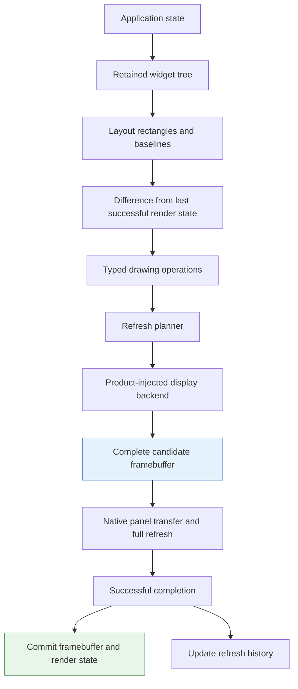
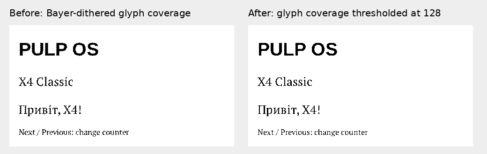
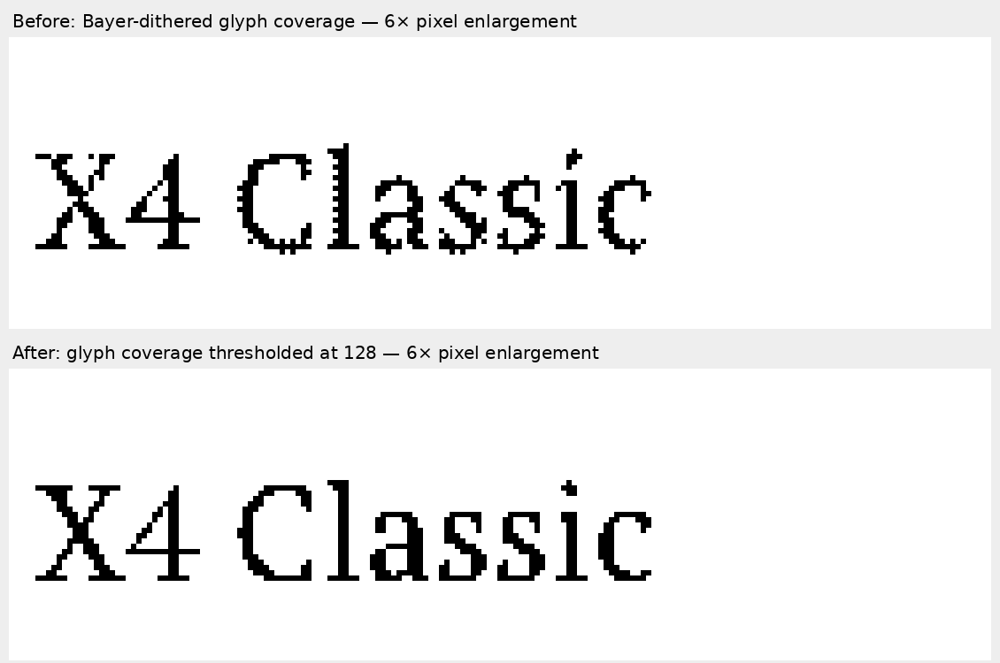

# PULP OS on X4 Classic: Native ESP-IDF Port and Display Qualification

Porting PULP OS from the M5Stack PaperS3 to the Xteink X4 Classic required making hardware ownership explicit inside an otherwise reusable rendering system. The application already had retained widgets, measured text, a refresh planner, storage records and a JavaScript runtime. Several of those components nevertheless selected PaperS3 hardware internally. The work described here removes two of those assumptions, implements a native Classic display and SD-card transport, and establishes what the connected device has actually demonstrated.

This report explains the architecture from the application state down to the panel transaction. It follows one counter update through the intermediate representations, derives the framebuffer geometry, analyzes storage and presentation failures, and reconstructs a typography defect that was visible before any pixels reached the controller. The intended reader can write C++ but does not need previous experience with ESP-IDF or e-paper firmware.

> [!summary]
> - The Classic now boots a native retained-widget fixture through the shared PULP font, layout, frame and refresh pipeline. The full JavaScript launcher, reader and application set have not yet been ported.
> - The tested unit is an ESP32-S3 with 16 MiB flash, 8 MiB PSRAM and a UC8279 panel reporting `VER=00 00 02`. OEM firmware remains in its original application partition.
> - Software retention and optical refresh are separate decisions: a clipped widget redraw updates a complete retained framebuffer, which the current driver presents using a qualified full refresh.
> - The first text renderer incorrectly applied spatial dithering to font coverage. Offline pixel inspection and a translation regression identified the defect; thresholding improved crispness on the physical device, while final typography remains open.

## 1. What PULP OS is, and what this port currently contains

PULP OS is firmware built on ESP-IDF, Espressif's development framework for ESP32 processors. ESP-IDF supplies the scheduler, memory allocators, peripheral drivers, filesystem integration and networking. PULP adds an application model, a retained graphical interface and native services exposed to MicroQuickJS. The name describes an embedded application environment; it does not imply a Linux kernel, process isolation or desktop application compatibility.

Flash retains firmware and settings across power loss. PSRAM is volatile external memory used for larger application and image buffers; it becomes usable only after the boot configuration initializes it. The port checks its identity and operation before relying on it. MicroQuickJS is the embedded JavaScript engine used by PULP; native C++ APIs expose widgets and services to its contexts.

The existing PaperS3 product is `0114-papers3-pulp-os/`. Its user interface is primarily JavaScript, but its rendering and device services are native C++. An application module evaluates to a descriptor containing fields such as `id`, `title`, `version`, `abi` and `main`. The launcher loads application source from embedded firmware assets or SD files, validates the descriptor and calls its entry point. An ABI is the contract between that JavaScript source and the firmware's native APIs. Changing the available actions or builder methods can require changing that contract.

The Classic product is a separate firmware directory, `xteink-classic-pulp-os/`. It currently exercises the reusable native foundations: fonts, widgets, layout, drawing operations, refresh planning, storage and physical buttons. Its screen contains a PULP title, a Classic label, Ukrainian text, SD status and a counter. This fixture isolates the hardware and rendering integration before the JavaScript application environment is brought across.

That distinction determines how to read every result below. Successful fixture startup demonstrates the native rendering path. It does not establish that the launcher, application loader, browser sandbox, Wi-Fi services or reader navigation work on Classic.

### Current evidence at the report boundary

| Area | Evidence obtained | Remaining limit |
| --- | --- | --- |
| Processor and memory | ESP32-S3 revision 0.2 identified; 8 MiB PSRAM detected; a 1 MiB address/pattern test passed. | Long-duration application memory behavior is unmeasured. |
| Panel identity | `VER=00 00 02`; this unit uses the enabled UC8279 variant. | Other recognized Classic variants have no native refresh qualification here. |
| Optical orientation | Revised border, plus marker and corner bars were confirmed by the user. | General image quality and regional uniformity were not instrumented. |
| Buttons | All seven named keys produced press/release observations. | Queued action routing, focus and the retained counter's physical acceptance remain pending. |
| SD | One-bit SDMMC mounted on attempt 1; capacity 14,910 MiB; TXT library scan succeeded. | Write durability, hot removal, missing-card paths and sleep detach remain unqualified. |
| Native widgets | Shared fonts registered; the installed page returned `retained_page=Ok`. | That status does not measure optical readability. |
| Typography | User confirmed the corrected text is crisper. | The user still considers its overall appearance uncertain or inadequate. |
| Existing products | PaperS3 reader primitives and PULP both build after direct API migration. | They were not reflashed for a new visual regression test. |
| OEM recovery | Original flash and OTA metadata preserved privately; app0 was not overwritten. | Returning to the OEM image has not been physically tested. |

The software baseline for this report is source commit `0f64792`. The installed crisp-text artifact is identified independently by SHA-256 `9f246815ba3d81eaf08603d7824367321df0c5df6e005202da507095143ca462`; its size is 571,648 bytes. Build strings may contain a previous revision followed by `dirty` because compilation preceded the checkpoint commit. The artifact hash identifies those bytes more precisely than the displayed revision string.

## 2. The representations between application state and physical pixels

A retained widget is a native object whose state survives between events. A text widget owns its copied text and a content version. A widget handle contains an arena index and generation rather than a raw pointer. When a tree is reset or a node is destroyed, stale handles must fail instead of referring to a newly allocated node at the same index.

Layout assigns rectangles and text baselines to that tree. A baseline specifies the vertical reference used to position glyphs; it is different from the top of the text's bounding rectangle. Compilation then emits a bounded sequence of typed drawing operations: fills, outlines, lines, glyph runs, bitmaps and circles. These operations describe what to draw without selecting a vendor display API.

A render frame contains the operations, their logical viewport and an arena holding payload bytes. The arena is a fixed-capacity buffer. Glyph text and bitmap data are copied into it and referenced by offsets. A frame therefore does not borrow a pointer into a temporary JavaScript string, an SD read buffer or a producer task's stack. Its storage remains valid until synchronous presentation returns and the owner resets it.

The refresh planner receives damage, the rectangle or rectangles affected by the frame, and a presentation intent. An intent expresses the application's purpose, such as text, interactive ink or a clean full page. The planner combines that intent with history and policy to choose whether a full refresh is required. The backend translates the resulting effective intent into rendering and panel work. A panel refresh is the optical update that drives the e-paper pixels; compiling a frame does not itself refresh the glass.



A framebuffer stores the complete intended pixel image. A candidate framebuffer holds the next attempt; a committed framebuffer holds the last successfully presented image. These are software-owned buffers, separate from any image memory inside the panel controller.

The last successful render state and the last successful framebuffer are different objects. The render state records widget content and layout so the runtime can compute damage. The framebuffer records complete physical pixels so a later full refresh can preserve the unchanged screen. Neither may advance merely because a new frame was attempted.

### Execution ownership in the existing product

The PaperS3 application uses one UI owner task for application state, JavaScript contexts, widget mutation, pagination and display operations. Input producers, console handling and network workers communicate through bounded events. POD events contain copied plain fields rather than JavaScript values or borrowed strings. A worker's completion must return to the owner before application callbacks execute.

The Classic fixture has a simpler arrangement: `app_main` initializes hardware, mounts storage, builds the page and polls keys in one task. That preserves single-threaded mutation but has a significant limitation. Its synchronous panel refresh takes about 1.64 seconds, during which key polling does not run. A short press and release entirely inside that interval can be missed. Moving input sampling into a producer task and posting semantic actions is a subsequent implementation step, not behavior already supplied by the fixture.

## 3. Making the runtime's hardware dependency explicit

Before the port, `s3paper_runtime` constructed its own M5 display backend and defaulted to a 540×960 viewport. It also exposed M5 initialization, display state and touch polling. A generic `DisplayBackend` interface existed, but the component using it still selected one board internally. Importing that runtime into Classic would therefore import a hardware decision along with reusable layout code.

The current configuration requires an explicit device pointer and positive logical geometry:

```cpp
s3paper_runtime::RuntimeConfig runtime{};
runtime.device = &classic_display;
runtime.viewport = {480, 800};
runtime.full_refresh_only = true;
s3paper_runtime::RuntimeInit(runtime);
```

The product-owned backend must outlive every runtime operation. Runtime initialization remains idempotent; later calls do not replace the first configuration. The first call must therefore supply the correct geometry, backend and capacities. Invalid initial configuration aborts rather than silently creating a PaperS3 default.

The shared runtime no longer depends on `s3paper_m5`, and its parameterless implicit initialization was removed. Existing PaperS3 products now inject `PaperS3Display()` and `{540,960}` directly. Their touch polling calls the PaperS3 backend, since touch is a board-specific input facility rather than a requirement of the rendering runtime. Generic runtime APIs are now named `EnsureDeviceInit` and `DeviceBackendState`.

This is a direct caller migration. The old M5-specific runtime methods are not retained as compatibility wrappers. The result is a narrower dependency: shared presentation needs a display implementation, while a product that uses touch chooses and owns its input driver separately.

Trace rendering is also explicit. A fake backend produces a normalized drawing trace without refreshing glass. Entering or leaving trace mode invalidates the retained render capture and requests a full refresh, because a successful trace does not mean the physical panel contains those pixels. Trace-mode page presentation no longer initializes the real panel simply to produce a software trace.

The runtime still has a remaining interface limitation: the backend receives an effective presentation intent rather than the entire `RefreshPlan` containing regions and waveform class. That is sufficient for this full-only Classic slice. It is not a finished region-aware partial-refresh contract.

## 4. Identifying and preserving the actual device

The target is the X4 Classic, also called X4 V2. It must be distinguished from the original ESP32-C3 X4 and the X4 Pro. Source profiles for similarly named products do not establish this device's pins, memory or controller. The connected unit was identified as an ESP32-S3 with embedded 8 MiB PSRAM and 16 MiB flash, then tested rather than treated as a marketing-name match.

The board holds its master power latch on GPIO1. SD power is separately gated by GPIO6 with active-low polarity: high turns the card rail off and low turns it on. Seven active-low keys use GPIO0, 7, 5, 2, 8, 9 and 3. GPIO0 is also a boot strap, so holding Previous during reset is a deliberate ROM-download operation, not an ordinary application input.

| Function | Classic wiring used by this implementation |
| --- | --- |
| Master latch | GPIO1, kept high during qualification |
| SD power | GPIO6, active low |
| Previous / Next | GPIO0 / GPIO7 |
| Left / Right | GPIO5 / GPIO2 |
| Confirm / Back / Power | GPIO8 / GPIO9 / GPIO3 |
| Panel data / clock | GPIO11 / GPIO12 |
| Panel CS / DC | GPIO13 / GPIO14 |
| Panel reset / BUSY | GPIO10 / GPIO18; BUSY active low |
| SD CLK / CMD / D0 | GPIO41 / GPIO42 / GPIO40 |

The hardware profile and UC8279 sequence were derived from FreeInk SDK commit `425d200a8ea447326b4b9696e4e47dc84ad9d7f6`. Selected upstream files were archived with hashes in the ticket, and the native product carries the relevant MIT attribution. The pinned source supplies provenance; successful behavior on this particular board supplies qualification.

### Flash layout is device evidence

A firmware build's partition table describes where its generated flash command would write. It does not prove that the connected device already uses that layout. OTA metadata selects which application slot the bootloader starts. NVS is the persistent settings partition. Reading the actual table showed two large OTA application slots and persistent OEM data:

| Partition | Offset | Size |
| --- | ---: | ---: |
| NVS | `0x9000` | `0x5000` |
| OTA metadata | `0xe000` | `0x2000` |
| OEM app0 | `0x10000` | `0x7e0000` |
| Initially erased app1 | `0x7f0000` | `0x7e0000` |
| SPIFFS | `0xfd0000` | `0x14000` |
| Coredump | `0xfe4000` | `0x1c000` |

A private 16,777,216-byte flash backup was taken before installation. Its SHA-256 is `b8e72e4838aa0ed833153254a498ff124abd6058639fe673691564c4325b349f`. The dump is ignored by Git and stored with restrictive permissions because flash can contain user settings and credentials. Preserving a hash and parsed partition facts does not require publishing the dump.

The original OTA metadata selected app0 through sequence 1; its other page was erased. The preparation script validated the table checksum, OTA record CRC and inactive slot before preparing sequence 2 on the second page while preserving the first page. The initial installation wrote the new application into app1 and the prepared OTA metadata into its existing partition. Later installations write only app1 at `0x7f0000`.

Consequently, `idf.py flash` is not an appropriate command for this device. Its generated multi-image command would also write a build bootloader and partition table. Application-only flashing preserves those OEM regions. Restoring the privately saved original 8 KiB OTA record is the planned return-to-OEM procedure, but that recovery has not yet been tested on the physical device.

A bootloader SHA comparison warning was observed during startup. The same expected and calculated mismatch was present in the pre-write backup. The warning therefore predates the port and does not establish that the new application overwrote the bootloader. No attempted repair of that preserved bootloader was part of this work.

## 5. Controller identity precedes controller initialization

Classic hardware can ship with different panel controllers. The probe resets the panel, waits for BUSY with a 300 ms bound, sends command `0x70` and reads three version bytes. Its serial data pin changes direction for the read, with pulls removed so the host does not force the returned bits. The probe then releases the temporary bus setup before the native SPI driver takes ownership.

This unit returned `00 00 02`, identifying a UC8279 variant. The classification table recognizes several UC8179 and UC8279 values, but the native `Panel::Init` currently enables only the physically tested UC8279 `0x02` variant. Recognizing a controller family and qualifying a refresh sequence are separate claims. Unknown identity must not silently select a plausible fallback sequence.

SPI is a clocked serial interface: the host supplies a clock and serial data, while chip select bounds a transaction. The panel transaction uses SPI2 in mode 0 at 10 MHz, without a separate MISO read pin. Software controls chip select so it can remain asserted through a complete plane stream. Small command bytes can use the SPI transaction's inline storage; image rows are copied into an internal DMA-capable buffer. DMA is direct memory access by a peripheral, and its memory requirements are stricter than the requirements for ordinary CPU reads from PSRAM.

PSRAM is external memory available to the processor. It holds the larger render and image buffers, leaving internal RAM available for stacks, drivers and transfers. Keeping a framebuffer in PSRAM does not justify passing it directly to every DMA operation. The implementation uses a bounded 128-byte internal row buffer instead.

## 6. Deriving the framebuffer geometry

The application viewport is portrait, 480 pixels wide and 800 high. The visible physical plane is 800×480. Each transmitted byte holds eight pixels in most-significant-bit-first order, with a set bit meaning white. The visible image therefore requires:

```text
visible bytes = 800 × 480 / 8 = 48,000
physical row bytes = 800 / 8 = 100
```

The qualified portrait transform is:

```text
physical_x = logical_y
physical_y = 479 - logical_x
byte_index = physical_y × 100 + floor(physical_x / 8)
bit_mask = 0x80 >> (physical_x mod 8)
```

For example, logical `(0,0)` maps to physical `(0,479)`, byte 47,900 and mask `0x80`. Logical `(479,799)` maps to physical `(799,0)`, byte 99 and mask `0x01`. Independent assertions for all four corners check the byte address and bit position, rather than relying on a single geometric formula reproduced by both implementation and test.

The first pattern used the opposite rotation and appeared upside down on the device. Physical feedback corrected it. The revised diagnostic also fixed its own ambiguities: a white band received a black outline, a T-shaped mark became an actual plus, and the border moved inward from the bezel. A successful driver return could not reveal those mistakes; the test image had to make the intended geometry visible.

The controller addresses 800×600 even though only 800×480 is visible. Each plane transfer prepends 120 white rows and then sends the 480 visible rows. That is 60,000 transmitted bytes per plane, of which 48,000 are user-visible data. The gate padding belongs to the controller driver, not the application framebuffer. Adding it to the logical canvas would distort layout and waste the application's coordinate system on nonvisible rows.

### Clipping must preserve original geometry

A clip rectangle restricts which pixels an operation may modify. It must not redefine the operation's source position. This became a concrete bug when introducing a native renderer: the shared payloads preserved clipped bounds but omitted original origins for glyph runs, bitmaps and outlines.

Consider a glyph run whose pen starts at `x=10`, clipped to `x≥45`. If the backend starts the pen at the clipped bounds' `x=45`, it moves the string 35 pixels rather than hiding its left edge. A bitmap has the same problem: the first visible pixel corresponds to a source offset, not source column zero. A clipped rectangle outline must not acquire an invented border along the clip boundary.

The draw payloads now retain the missing geometry:

| Payload | Retained source geometry | Rendering consequence |
| --- | --- | --- |
| Glyph run | Unclipped `origin_x` and absolute baseline | The glyph pen stays fixed; the clip only masks pixels. |
| Bitmap | Original source rectangle plus stride | Visible coordinates map to the correct source row and nibble. |
| Rectangle stroke | Original outline rectangle | Only real outline edges are drawn under the clip. |
| Arbitrary line / circle | Existing true endpoints or center/radius | Source geometry remains separate from clipped damage bounds. |

Both the Classic and M5 backend consumers were migrated with the payload change. The native tests render a complete scene and a clipped scene, then compare every pixel inside the clip and require untouched white outside it. They include bitmap offsets, GFX fallback glyphs, registered Ukrainian TTF glyphs and outlines. This tests the geometric meaning of clipping rather than merely checking that an operation contains a rectangle.

## 7. The full-refresh transaction and its completion conditions

The current panel driver uses the pinned Classic OTP sequence. OTP refers to stored controller/panel parameters used by that sequence. The port does not upload experimental waveform tables or modify drive voltages. Its full refresh is intentionally a small qualified behavior set.

The order matters. `NEW` receives the complete candidate image. `OLD` is first filled white for an absolute full refresh. After power-on, the driver rewrites the panel setting register because power-on reloads settings. It then triggers refresh and requires BUSY to assert low within 50 ms. Only waiting for BUSY to be idle would accept a command that never started a refresh.

```mermaid
sequenceDiagram
    participant B as Native display backend
    participant P as UC8279 driver
    participant C as Panel controller
    B->>P: PresentFull(candidate, 48000)
    P->>C: NEW 0x13: padding + candidate
    P->>C: OLD 0x10: white
    P->>C: CDI 0x97; CCSET 0x02; TSSET 0x1e
    P->>C: PON 0x04
    P->>C: Post-PON PSR 0x17,0x4d
    P->>C: DRF 0x12
    C-->>P: BUSY asserts low within 50 ms
    C-->>P: BUSY becomes idle within 20 s
    P->>C: OLD 0x10: synchronize candidate
    P->>C: POF 0x02; bounded idle wait
    P-->>B: ESP_OK
    B->>B: Commit software image
```

The maximum refresh-completion wait is 20 seconds. Power-on and power-off idle waits are separately bounded. The measured successful full refresh is approximately 1,642 ms; that is an observed operation duration, not a guarantee that every image or environmental condition will take the same time.

After real completion, the driver synchronizes the controller's OLD plane to the candidate image and turns the panel supply off. This controller OLD plane is distinct from the backend's committed software framebuffer. The first supports the controller's update state; the second lets the software preserve unchanged pixels across future clipped redraws.

On failure, `Panel` invalidates initialization and attempts a bounded supply-off command while preserving the original error. It does not cut the board's master latch. Unknown optical state must be recoverable without pretending a failed transaction produced the intended image.

## 8. Retained pixels make full-only refresh compatible with clipped redraw

A retained UI can change one label while preserving the rest of a page. The render-state diff computes a small damage rectangle and compiles drawing operations under that clip. The Classic still performs an optical full refresh. These decisions are compatible only if the software retains a complete image.

The native backend owns two 48,000-byte images: a committed framebuffer representing the last successfully presented screen, and a candidate framebuffer for the next attempt. It copies committed pixels into candidate, applies the clipped operations to candidate, and then presents the complete candidate plane. The glyph scratch buffer adds 16,384 bytes. These three allocations total 112,384 bytes, approximately 109.75 KiB, before runtime operation storage, text arena, widget arena and driver resources.

The following pseudocode describes the implemented transaction. It omits timing fields and error conversion but preserves the ordering:

```text
present(frame, effective_intent):
    reject if driver is not initialized
    reject unless effective_intent is CleanFull
    if no valid baseline:
        require frame.damage to cover the complete logical viewport

    candidate = copy(committed)
    status = rasterize(frame, candidate, bounded_glyph_scratch)
    if status failed:
        return status                  # glass and committed pixels unchanged

    status = panel.present_full(candidate)
    if status succeeded:
        swap(candidate, committed)
        baseline_valid = true
        frames_presented += 1
    else:
        initialized = false
        baseline_valid = false         # glass is now unknown
    return status
```

The full-viewport damage check is only a guard: arbitrary operations could have a full bounding box without repainting every pixel. The runtime's full-page compiler establishes complete content by emitting the white background and the entire page tree. Recovery correctness depends on that producing path as well as the backend check.

The runtime's `full_refresh_only` policy requests a full plan before dispatching the Classic frame. Refresh history therefore counts the real full operation instead of recording a partial just because the redraw clip was small. A zero-change retained update still skips panel work entirely; full-only does not require refreshing an unchanged page.

When a panel attempt fails, the runtime also resets its render-state capture and requests a full. A later `PresentPageUpdate` sees no valid capture, rebuilds the whole page and reinitializes the device. Error-path structure supports that reconstruction, but failure recovery has not been fault-injected on the physical unit. A reviewer should distinguish the implemented recovery contract from tested recovery behavior.

### Following one counter update

The fixture starts with a copied text node containing `Button test: 0`. A debounced Next press increments a native integer and calls `WidgetArena::SetText` with `Button test: 1`. The setter changes the node's content version. `PresentPageUpdate` relays out the same tree and compares it with the last successful capture.

If the new text differs visibly, the runtime creates a damage clip, clears that area to white and recompiles the tree under the clip. Glyph operations carry the original pen origin, so a narrow clip does not shift the label. The backend copies the complete committed page, applies those operations and performs a full optical refresh. Only success advances its image and the runtime's captured widget state. The intended observable result is a changed counter with an intact title, Ukrainian text, SD status and footer.

This is the implemented code path, not a claim that the user has completed the counter acceptance test. At this report boundary, the seven raw keys and the page startup are observed, while the requested `0→1→0` preservation check remains pending.

## 9. Diagnosing a font defect before it reaches the controller

A glyph raster contains coverage: for each pixel, an 8-bit value approximates how much of that pixel lies inside the font outline. Coverage zero leaves the background untouched; coverage 255 represents full ink. Intermediate coverage can produce smooth edges when the display path preserves grayscale.

The first Classic renderer composited this coverage onto its existing black/white pixel, then passed the resulting gray through the same 4×4 Bayer matrix used for images and gray fills. Bayer dithering compares a gray value against a threshold that varies with pixel position. It approximates an intermediate tone by distributing black and white pixels spatially.

That policy damaged thin text strokes. Two neighboring pixels with similar outline coverage could receive different decisions because their Bayer thresholds differed. A one-pixel translation of the same glyph changed its shape rather than simply moving it. The user described the fonts as unusually pixelated and observed that the earlier display had been crisp.

The diagnosis did not begin by modifying controller settings. A host probe used the same embedded font files, sizes, glyph metrics, kerning and native raster code to export the exact binary pixels as PGM. The ragged pattern was already present in that software image. This establishes a rasterizer contribution without needing to infer one from a photograph of the panel.



*Figure 1. Software-generated logical pixel samples from the same fonts and sizes. The left sample applies Bayer thresholds to glyph coverage; the right thresholds coverage at 128. These are framebuffer samples, not photographs or measurements of the panel.*



*Figure 2. The same samples enlarged six times with nearest-neighbor scaling. The enlargement preserves the original binary pixels and exposes gaps and isolated edge pixels; it does not represent the physical size of the text.*

The correction separates glyph coverage from an intentional gray image:

```text
old text policy:
    background = existing binary pixel
    gray = composite(glyph_color, coverage, background)
    write gray using spatial Bayer threshold

current text policy:
    if coverage >= 128:
        write glyph_color
    otherwise:
        leave the background unchanged
```

Black and white glyph colors now produce solid binary strokes. Deliberately gray glyph colors can still dither when written by the monochrome pixel routine; the phase-invariance claim applies to pure black/white text. Bitmap and gray-fill dithering remains unchanged.

### A regression that expresses the defect

The new test renders the same black TTF `A` at two pen positions separated by one logical pixel. After compensating for that translation, every sampled pixel must match:

```text
render_A(first, origin_x = 10)
render_A(second, origin_x = 11)
for each pixel in the glyph test rectangle:
    assert first[x,y] == second[x+1,y]
```

Linked against the previous rasterizer, this assertion fails. Linked against the corrected rasterizer, it passes alongside clipping, payload-bounds and retained-pixel tests under AddressSanitizer and UndefinedBehaviorSanitizer. The test measures a geometric invariant independent of the specific implementation of the new cutoff.

The corrected firmware changed neither the panel command sequence nor drive settings. Its app1 write was hash-verified and startup again reported `retained_page=Ok`. The user confirmed that the text became crisper. That supports the focused correction; it does not establish that typography is finished or that every remaining visual difference is software-only.

## 10. Why the same fonts look different on PaperS3

The two products register the same `PTSerifUkr.ttf` and `LibSansBoldUkr.ttf` assets through the shared runtime. They use the same `stb_truetype` implementation and the same registered sizes: UI 22 px, body 34 px, display 44 px, XL 84 px and title 44 px. Classic is not substituting another font or scaling a finished PaperS3 screenshot to a smaller canvas.

The difference occurs after rasterization. For `TextPage`, `ImageQuality` and `CleanFull` intents, the M5 backend quantizes coverage to 16 gray levels and renders antialiased edges. For its fast intents it thresholds coverage instead. Classic currently has only a qualified binary transfer/full-refresh path, so it thresholds glyph coverage for every text presentation. The apparent smoothness of a thin serif curve can differ even when the underlying outline and metrics are identical.

PaperS3's official specification describes a 960×540, 4.7-inch screen with 16-level grayscale. The Classic product page advertises 219 PPI. Calculating `sqrt(960²+540²)/4.7` gives approximately 234.35 PPI for PaperS3, about 7% above the advertised Classic density. The PaperS3 PPI value here is a calculation from published dimensions, not an official PPI claim. [PaperS3 specifications](https://docs.m5stack.com/en/core/PaperS3), [Classic specifications](https://www.xteink.com/products/xteink-x4-classic-pocket-ereader).

Three quantities must remain distinct. Total resolution determines the canvas and how much content fits. Pixel density determines the physical size of a pixel. Font size in pixels determines how many samples describe a glyph. Because the current products use the same font sizes in pixels, the Classic glyph is a little larger physically, rather than being rasterized into fewer pixels solely because the viewport is smaller.

The modest density difference is therefore a secondary explanation for the observed appearance. Loss of gray edge coverage is a more direct difference in the current pipelines. Its exact perceptual contribution still requires a controlled physical comparison. Larger or heavier text may work better in binary output, but size and weight should be chosen from specimens rather than assumed from the existing desktop-oriented serif face.

The current binary driver is a qualification limit. It does not prove that the Classic controller or glass has no possible grayscale behavior. Adding grayscale would be a separate driver and physical-validation task, not a reason to upload an unreviewed waveform in response to a font complaint.

## 11. Storage separates card transport from application records

The shared storage component originally initialized SDSPI with PaperS3 pins. SDSPI transfers SD commands over an SPI bus; SDMMC uses the processor's SD host interface. The Classic uses one-bit SDMMC. Book catalogs, reading positions and settings do not need to select either transport, so retaining those pins inside their component prevented clean reuse.

The extraction introduces a product-owned `StorageVolume` with four operations:

```cpp
class StorageVolume {
public:
    virtual ~StorageVolume() = default;
    virtual s3paper::StatusCode Mount() = 0;
    virtual s3paper::StatusCode Unmount() = 0;
    virtual bool Mounted() const = 0;
    virtual uint64_t CapacityBytes() const = 0;
};
```

Its contract is specific: mount FAT at `/sdcard`, never format user media automatically, run lifecycle methods on the owner task, and outlive all configured storage operations. The shared `StorageConfig` now requires this volume pointer. There is no fallback to the previous pin selection or `pre_mount` callback.

PaperS3 receives a separate `SdspiVolume` that preserves its old wiring: MOSI38, MISO40, CLK39 and CS47. It initializes the display before mounting, because M5GFX and the card share the SPI bus. It deliberately does not tear down that bus when unmounting a card. Classic receives `SdmmcVolume`, which uses slot1, CLK41, CMD42 and D0 40 with one-bit width and the default 20 MHz host setting.

This separates two responsibilities that have different failure meanings. The volume establishes a usable filesystem and owns card/host lifecycle. The storage service interprets application records, scans supported files and reports book state. Both products continue to use the same record formats and `/sdcard/.s3paper` location.

### A mount must establish more than a VFS entry

VFS is the filesystem interface that lets ordinary file APIs access the mounted card. Successful registration is useful, but the Classic volume performs a real 512-byte sector-zero read in internal DMA-capable memory before publishing `Mounted=true`.

For each of at most four mount attempts, GPIO6 turns the SD rail off for 80 ms and on for 120 ms. The driver mounts with `format_if_mount_failed=false`, supports eight open files, and uses heap-backed long filenames up to 255 characters. It then verifies the block read. A successful card reports 14,910 MiB and was usable on the first attempt in the observed boot.

A failed read after mounting creates a cleanup problem: power must not be cut while a filesystem remains attached. If VFS unmount succeeds, the attempt may safely power-cycle and retry. If unmount fails, the volume keeps the card pointer but exposes `Mounted=false`; another mount returns Busy until cleanup is resolved. This is a quarantined state, meaning the retained host resources may be used only for cleanup, not advertised as usable storage.

```mermaid
stateDiagram-v2
    [*] --> Off
    Off --> Attempting: Power cycle and mount
    Attempting --> Ready: VFS mount and sector read succeed
    Attempting --> Off: Failure and detach succeeds
    Attempting --> Quarantined: Read fails and detach fails
    Ready --> Off: Unmount succeeds, then power off
    Ready --> Ready: Unmount fails; retain power/resources
    Quarantined --> Off: Cleanup retry succeeds, then power off
    Quarantined --> Quarantined: Cleanup fails; remount remains Busy
```



The shared `StorageUnmount` delegates to the volume even when its mounted-ready state is false. Otherwise it could never clean up a quarantined card. Only successful unmount clears the derived catalog. This ordering makes the lifecycle failure explicit without requiring application records to understand SD host internals.

The scan checks `/sdcard/books` and `/sdcard` for the TXT books supported by the current service. It found zero. That does not imply an empty card, nor establish EPUB support. The fixture does not seed a sample book. A changed catalog can be persisted by the shared scanner; the observed empty scan did not establish general write durability.

### Persistence still needs separate qualification

The existing service maintains reading positions, bookmarks, settings and Wi-Fi credential records. Its write helper uses temporary files, flush/fsync, a backup rename and replacement of the primary path. It checks the write size and final rename, but does not propagate every flush, fsync, close or backup-rename failure. That implementation is inherited functionality, not a power-loss guarantee newly proved by mounting a card. Error propagation and power-loss tests are therefore concrete prerequisites for a stronger durability claim.

HTTP uploads, application installation and UI operations will eventually share storage. A volume interface alone does not coordinate those users. Before sleep or power-off, the product needs explicit ordering for in-flight filesystem work, open handles, deferred record saves and late worker completions. Storage leases or lifecycle epochs were proposed in the guide, but are not implemented in the current Classic fixture.

## 12. Serial evidence depends on host access and ownership

USB troubleshooting produced several different conditions during the project. Initial enumeration and `cdc_acm` setup concerned whether the operating system supplied an ACM serial device. A later no-reset esptool attempt timed out because USB visibility did not establish that the processor was already in the ROM download state. A normal esptool reset subsequently connected and identified the device. Neither condition, by itself, proves a bad cable or application crash.

The monitor also has a modem-control behavior. On this host's native ESP32-S3 USB Serial/JTAG path, opening the serial port can assert DTR and RTS and leave the board in ROM mode. The saved hold-open client opens once, moves the modem signals through an idle state, deliberately pulses reset into the application, and keeps that descriptor for the capture interval. A reset that explains a changed boot mode is different from an unexplained disappearance of the USB device.

Only one monitor or flasher may own the port. Parallel readers can interleave output, consume expected prompts or create timeouts that resemble firmware failures. A bounded capture ending after its configured duration is also different from a hardware disconnect. The investigation uses tmux for long-lived capture and stops the exact monitor before flashing.

There was one diagnostic mistake worth preserving. A sandbox endpoint check reported the stable path absent, and device work stopped under the user's instruction to report unexpected USB loss. When the user asked to retry, a check with host access showed the stable link and tty present. The previous observation had established restricted sandbox visibility, not a physical disconnection. The diary preserves the original observation and appends the correction rather than silently rewriting the earlier account.

The reusable procedure is to compare evidence at the correct access level before assigning a cause. Inspect host enumeration, the device node and current ownership before opening or resetting it. If the host endpoint unexpectedly disappears or a live operation fails, stop and report it; do not hide the uncertainty with repeated probes.

## 13. Build reproducibility exposed incomplete existing integration

All affected firmware products use ESP-IDF 5.3.4. Multiple IDF installations exist on the machine, so the version is selected deliberately. The build helper clears the inherited `IDF_PYTHON_ENV_PATH` before sourcing that installation because a Python environment from another IDF version can cause misleading tool failures.

`sdkconfig.defaults` only seeds absent configuration values. Adding a long-filename setting to defaults does not replace a contradictory option in an existing generated `sdkconfig`. The committed defaults and the local generated configuration must therefore agree before a build validates the intended behavior. The product commits dependency locks and deliberate embedded assets, while build trees, managed component caches, private dumps and generated SDK configuration remain excluded.

Migrating storage required building both existing callers: `0112-papers3-reader-primitives` and `0114-papers3-pulp-os`. The latter already compiled authentication and WebSocket service sources but lacked a declared managed `esp_websocket_client` dependency and several shared event/snapshot declarations. CMake reported that it could not resolve that component.

The repair pins `esp_websocket_client` 1.4.0 in `main/idf_component.yml` and updates the lockfile. It also completes the existing Auth/Socket console operations, bounded reply snapshots, Auth module ID, owner completion routing and tick hooks. Access tokens and socket message payloads are not copied into the reply snapshots. These changes restore build completeness for existing source paths; they do not constitute hardware authorization-flow or socket qualification in this port.

This result illustrates why an unchanged sibling product must be built after extracting a shared interface. The build can reveal old integration gaps that were not caused by the new boundary. The report records those separately rather than presenting every compiler failure as a storage defect.

## 14. Validation is organized around explicit claims

The shared core suite completed 38,602 checks with zero failures. Native renderer checks ran under AddressSanitizer and UndefinedBehaviorSanitizer. Leak detection was disabled because LeakSanitizer cannot run under this traced sandbox; disabling it did not disable address or undefined-behavior instrumentation.

The native checks cover all eight operation kinds, true source geometry under clips, Ukrainian TTF rendering, malformed arena slices, bitmap dimensions and unchanged pixels outside local damage. Arena bounds use an offset comparison followed by subtraction, avoiding an overflowing `offset+length` acceptance check. Raster iteration is restricted to the visible 480×800 plane even when source geometry extends beyond it.

The core executable already existed as a tracked upstream file. Rebuilding it for validation must not accidentally commit a host artifact. The current ticket-local host script builds executables in `/tmp`, and the earlier rebuilt tracked binary was restored after its run. The core tests also load font files relative to their working directory; running them from the wrong directory initially failed before any semantic test ran.

A representative installed startup contains:

```text
PSRAM size=8388608 test_1MiB=PASS
VER=00 00 02 controller=UC8279 busy_timeout=0 probe=ESP_OK
fonts registered: serif=134264B sans=56032B body line_height=34
mounted one-bit SDMMC, capacity_mib=14910 attempt=1
storage_mount=Ok library_scan=Ok books=0
full_refresh status=ESP_OK elapsed_ms=1642
retained_page=Ok
```

Each line has a bounded meaning. PSRAM PASS covers the implemented test. The version bytes identify the probed controller. A mount and scan report filesystem behavior. BUSY completion establishes that the scheduled operation ran to the driver's completion conditions. None of these lines measures optical contrast, certifies a grayscale waveform or confirms the unobserved counter test.

### Reproduction tools

The ticket is located at:

```text
ttmp/2026/10/09/
ESP-61-PULP-XTEINK-X4--port-pulp-os-to-xteink-x4-intern-analysis-and-implementation-design/
```

Its `scripts/` directory contains the following reusable tools. Run long builds and device captures in tmux; use host access for serial operations.

| Script | Purpose and operational limit |
| --- | --- |
| `01-validate-guide.py` | Checks the research guide's structure and references. |
| `02-prepare-qualification.py` | Validates private backup/table/OTA facts and prepares selection bytes; does not write the device. |
| `03-build-products.sh` | Builds the three affected products with pinned IDF; never flashes. |
| `04-classic-console-hold.py` | Opens one serial descriptor, deliberately resets into the app and captures; it is not a passive enumerator. |
| `05-font-raster-probe.cpp` | Exports exact native logical font pixels to PGM without hardware. |
| `06-native-host-checks.sh` | Runs renderer regressions and emits a specimen; `--core` adds the shared core suite. |
| `07-render-report-figures.py` | Produces the report's pixel-comparison figures from archived specimens. |

`history/` preserves useful earlier build and capture wrappers retroactively, including their original machine paths and log filenames. The current tools consolidate repeated behavior rather than requiring the reader to choose among wrappers differing only in an output name. The raw flash dump, OTA bytes, credential content and firmware binaries are not published in that directory.

## 15. Implementation milestones and the next complete product slice

The commits divide the work into inspectable changes rather than one unreviewable port:

| Revision | Result |
| --- | --- |
| `4f0ba8b` | Research guide, provenance and initial native qualification image. |
| `e71b601` | Preserved device flash and recorded the successful hardware boot. |
| `8372d3b` | Qualified keys and implemented native UC8279 full refresh. |
| `4b81a75` | Corrected physical portrait orientation after visual feedback. |
| `1563da9` | Injected storage volumes, qualified SDMMC and migrated PaperS3 callers. |
| `02070a9` | Injected display hardware, repaired clipped source geometry and built the retained fixture. |
| `7dddd72` | Thresholded glyph coverage, added its regression and preserved investigation scripts. |
| `0f64792` | Recorded the qualified user verdict and PaperS3 typography comparison. |

The next integration slice should supply reliable input sampling and semantic actions. An action is an application event such as Previous, Next, Confirm or Back, independent of touch coordinates. Mapping buttons to synthetic touches would preserve accidental screen-specific geometry instead of making application behavior explicit. The design guide proposes a new action/focus contract and an ABI update; those names and interfaces remain proposals until code implements them.

Focus needs an identity and lifetime separate from widget geometry. A focusable control can move during layout or disappear when the page changes. The owner should resolve actions against the current foreground tree and reject stale focus after resets. Input producers should sample/debounce without mutating widgets or executing JavaScript, so a slow refresh cannot prevent observing a press. Queue capacity, repeat behavior and coalescing must be chosen and tested as product behavior.

After that native gate, the port can integrate the OS bytecode image, source-loaded applications, launcher, TXT library and reader. MicroQuickJS's generated atoms and native binding tables must stay consistent with its per-product stdlib. Copying only JavaScript source does not establish that its factories or service bindings exist. Reader layout must use the Classic viewport while keeping text measurement and rasterization on the same metrics source.

Network/app distribution, battery/RTC access, screenshot output and sleep lifecycle follow after the foreground UI and reader work. The Classic has no PaperS3 touch panel or buzzer. Board-specific services must be selected explicitly rather than allowing existing M5 calls to remain reachable by accident. Existing image paths that assume 540×960 also require direct geometry review.

The remaining acceptance gates are concrete:

- Confirm the native counter changes `0→1→0` while preserving the page, then test input during refresh after queued sampling is implemented.
- Exercise missing media, persistence saves and shutdown ordering before enabling sleep or application installation.
- Test the planned return to preserved OEM firmware on the physical unit.
- Qualify launcher, library and reader actions with the generated JS contract, including stale handles and foreground changes.
- Compare font sizes and weights on glass; treat grayscale or partial-waveform work as a separate qualified driver change.

## 16. Source map and related work

All source paths below are relative to `/home/manuel/workspaces/2025-12-21/echo-base-documentation/esp32-s3-m5`. They identify the implementation at the report's source revision; the chronological ticket diary explains why each boundary changed.

| Start here | What to inspect |
| --- | --- |
| `xteink-classic-pulp-os/main/app_main.cpp` | Qualification order, native test page, debounce and blocking counter updates. |
| `xteink-classic-pulp-os/components/pulp_board_x4_classic/src/board.cpp` | Latch/key setup and version-register probe. |
| `xteink-classic-pulp-os/components/pulp_board_x4_classic/src/panel.cpp` | SPI ownership, gate padding, OTP full sequence and BUSY bounds. |
| `xteink-classic-pulp-os/components/pulp_board_x4_classic/src/display.cpp` | Candidate/committed transaction and baseline invalidation. |
| `xteink-classic-pulp-os/components/pulp_board_x4_classic/src/raster.cpp` | All drawing operations, glyph coverage and arena validation. |
| `xteink-classic-pulp-os/components/pulp_board_x4_classic/include/pulp_board_x4_classic/framebuffer.h` | Qualified portrait mapping, bit addressing and gray dithering. |
| `xteink-classic-pulp-os/components/pulp_board_x4_classic/src/volume.cpp` | Native SDMMC power, mount verification and quarantined cleanup. |
| `xteink-classic-pulp-os/tests/raster_test.cpp` | Full-versus-clipped comparisons, payload checks and glyph translation invariant. |
| `components/s3paper_runtime/src/runtime.cpp` | Explicit device configuration, page compilation, diff and refresh history. |
| `components/s3paper_core/include/s3paper/draw_ops.h` | Frame payload/lifetime and original geometry contracts. |
| `components/s3paper_storage/src/storage.cpp` | Shared records, scanning, mount delegation and persistence. |
| `components/s3paper_storage_sdspi/src/volume.cpp` | Explicit PaperS3 SPI transport and shared-bus behavior. |
| `components/s3paper_m5/src/m5_backend.cpp` | PaperS3 coverage quantization, device singleton and touch polling. |
| `0114-papers3-pulp-os/main/app_owner.cpp` | Existing owner boot, console operations and service completions. |

For broader PULP history, read [[PROJ - PULP OS App Loader - Splitting the Monolith and Loading Apps as Source]] and [[PROJ - PULP Browser - Multi-Context MicroQuickJS and the Sandboxed Page Runtime]]. The display-evidence distinction is developed separately in [[ARTICLE - PaperS3 EPD Qualification - What Software Success Did Not Prove]]. Those notes describe earlier products and investigations; their results must not be transferred automatically to this Classic unit.

The upstream hardware reference is [FreeInk SDK at the pinned revision](https://github.com/Free-Ink/freeink-sdk/tree/425d200a8ea447326b4b9696e4e47dc84ad9d7f6). The ticket's `sources/provenance.json` lists archived file hashes. Its original 28-page intern guide was uploaded to reMarkable as the research/design edition. Later physical orientation, SD and typography results live in the implementation diary and receipts; preserving the original delivered guide does not make its provisional assumptions the current implementation facts.

The port's reusable result is the set of explicit ownership and representation contracts. The runtime accepts a product's geometry and display, storage records accept a mounted volume, drawing operations preserve source geometry under clips, and successful presentation advances retained state transactionally. Those contracts allow the application layer to be integrated without concealing hardware assumptions or substituting software status for physical evidence.
