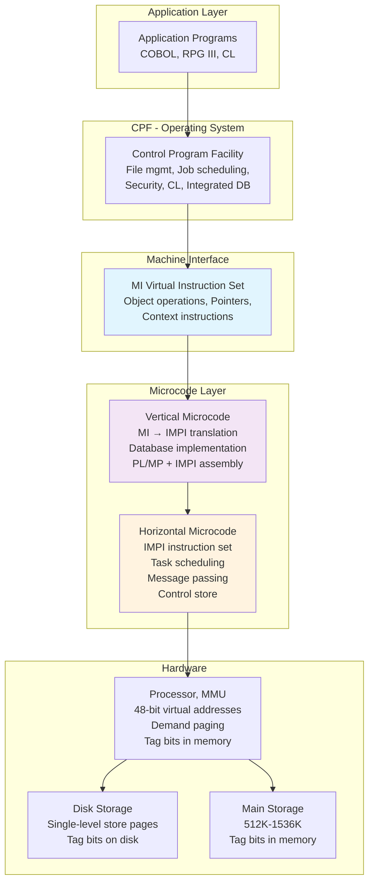
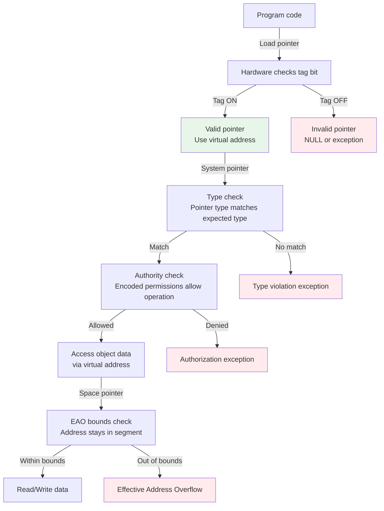

# IBM System/38 Single-Level Store and Persistence Architecture

## Executive Summary

The IBM System/38, announced in 1978 and delivered in 1980, introduced a computing architecture so radical that its core idea — single-level store — remains in production today, nearly fifty years later, in IBM i on Power Systems. Single-level store eliminates the distinction between memory and disk. Every byte of data in the system, whether it resides in RAM or on a spinning platter, shares a single address space. Objects persist without being saved. Programs branch between contexts in a single instruction. There is no file system, no mounting, no explicit I/O.

This report traces the intellectual lineage of single-level store from Multics through IBM's billion-dollar Future Systems project to the System/38 and its descendants. It explains the Machine Interface object model, capability-based addressing with tagged pointers, the three-layer microcode architecture, and the integrated relational database. It compares the System/38's approach to the Apple Newton's Object Soup, EROS, and modern persistence systems. And it asks: what did this architecture get right that we have since lost, and what is worth reviving?

## 1. The Problem the System/38 Was Trying to Solve

In the late 1960s, IBM faced a structural dilemma. The System/360 had been an enormous commercial success, but its architecture was showing its age. Programming costs were rising faster than hardware costs, and the complexity of managing files, databases, and memory was consuming an increasing share of the IT budget. Meanwhile, IBM's midrange computers — the System/3, System/32, and System/34 — were built on architectures that required explicit, manual management of every data transfer between memory and disk.

The fundamental problem was this: programmers spent more time writing code to move data between storage tiers than they spent writing code to process that data. Every program that needed to work with business records had to open a file, read records into memory, process them, write them back out, and close the file. This was not merely tedious — it was expensive. The IBM Corporate Technical Committee projected that by 1980, programming and operations costs would consume so much of the customer's IT budget that the share available for hardware vendors would shrink dramatically.

Frank Soltis, the System/38's chief architect, stated the problem directly:

> "Rather than taking a part of the total memory, the total storage, and just saying, okay this little piece is going to be virtual, and then we'll have some sort of a file system next to it, which will address completely differently. And we'll move from that file system into the virtual memory and from the virtual memory into the memory, and into the cache, and finally into the processors. Which is wrong."
> — Frank Soltis, COMMON Europe vCEC 2020

Soltis's insight was that the distinction between memory and storage was an artifact of hardware economics, not a fundamental requirement of computing. If all storage were byte-addressable and non-volatile, there would be no need for a file system, no need for explicit I/O, and no need for programs to manage the transfer of data between tiers. The virtual memory system could simply extend to cover all of storage, and programs would allocate data as if it were always in memory, with the operating system handling the physical placement of pages transparently.

This was the design goal of the System/38: to build a machine where data persistence is the default, where objects outlive the programs that created them, and where the programmer never needs to think about where data is physically stored.

## 2. The Lineage: From Multics to Future Systems to System/38

### 2.1 Multics and the Persistent Segment

The concept of single-level store was first introduced by Multics in the mid-1960s. Multics, developed by MIT, General Electric, and Bell Labs, implemented a segmented virtual memory system where files on disk could be mapped directly into a process's address space. Once mapped, the data could be accessed through ordinary memory references. The virtual memory system handled paging data in and out of physical memory as needed.

Multics demonstrated that the distinction between "file" and "memory" was not fundamental — it was a convenience of the operating system's design. A file could simply be a segment of virtual memory that happened to be backed by disk. The Multics implementation used three levels of physical storage: main memory, a high-speed drum, and disk drives. Data moved between these levels transparently, managed by the virtual memory system.

The persistent segment concept was Multics' lasting contribution: once a segment was created and mapped into a process's address space, it would survive the termination of that process. The segment had a name in the file system, and any process with appropriate permissions could map it. But the mapping was explicit — a process had to call the file system to make a segment available. Multics proved the concept but required the programmer to bridge the gap between the file system namespace and the virtual memory address space.

### 2.2 The IBM Future Systems Project

In 1969, IBM began the Advanced Future Systems (AFS) project, which became the Future Systems (FS) project in 1971. FS was an attempt to redesign computing from the ground up. It combined two radical ideas: single-level store and a high-level machine instruction set.

The single-level store concept in FS was directly influenced by Multics. George Radin, who proposed the FS architecture, envisioned a system where every piece of data would have a unique six-byte name, and the memory hierarchy would be completely transparent to programs. There would be no file system. Programs would simply refer to objects by their names, and the system would make those objects available in memory as needed.

The high-level instruction set concept — the Higher Level System (HLS) — was more ambitious and more problematic. The HLS report, delivered in February 1970, proposed that the machine's instruction set should correspond directly to the statements of high-level programming languages. Instead of compiling COBOL or FORTRAN down to machine code, the machine would execute high-level operations directly through microcode. An instruction like `CreateEncapsulatedModule` would be a complete linkage editor. The result would be dramatically smaller and simpler programs.

The combination proved impossible. The FS project, officially started in September 1971, grew out of control. By 1974, it was moribund. John Sowa's internal memo described the project's organizational dysfunction: "The avowed aim of all this red tape is to prevent anyone from understanding the whole system; this goal has certainly been achieved." Simulations showed that the execution of native FS instructions on the high-end machine was slower than a System/370 emulator running on the same hardware. The project was formally cancelled in February 1975, having cost more than $1 billion.

### 2.3 From Future Systems to System/38

Although FS was cancelled, the single-level store idea survived. The Rochester, Minnesota laboratory, which had been planning a successor to the System/3, met several times with the FS architects and "embraced many of the FS design concepts" (Pugh et al., p. 552). The Rochester team, led by Frank Soltis and Glenn Henry, stripped away the HLS concept — the idea of executing high-level language statements directly — and kept the single-level store, the object-based architecture, and the machine interface abstraction.

The result was the System/38, announced in October 1978 and delivered in July 1980. Developed under the code name "Pacific" over eight years, the System/38 was one of IBM's largest product programs in the General Systems Division. It was not backward-compatible with the System/3 — it was a completely new architecture.

What the Rochester team kept from FS:

1. **Single-level store** — the unified address space spanning RAM and disk
2. **Object-based architecture** — all system resources are encapsulated objects with type-specific operations
3. **Machine interface abstraction** — a high-level virtual instruction set that isolates software from hardware
4. **Capability-based addressing** — pointers that encode access rights, preventing unauthorized access

What they discarded:

1. **High-level language instructions** — the System/38's MI is high-level but does not attempt to execute COBOL or FORTRAN statements directly
2. **The anti-compatibility stance** — the System/38 was designed for the midrange market, not to replace the System/370
3. **The extreme secrecy** — the FS project's compartmentalized development model was abandoned

The System/38 also introduced something FS had not planned: an integrated relational database. The CPF operating system included a relational database management system (DBMS) built directly into the operating system, the first commercially available IBM midrange system to do so. This "nameless database" — it would not be branded as DB2 until decades later — was implemented partly in microcode, partly in the Vertical Microcode, and partly in CPF itself. Its integration with single-level store meant that database tables were simply objects in the unified address space, accessed through the same virtual memory mechanisms as any other data.

## 3. The Single-Level Store Architecture

### 3.1 The Unified Address Space

The System/38's single-level store is a single, flat virtual address space that spans all storage in the system — main memory (RAM) and disk. From the perspective of any program running above the Machine Interface, there is no distinction between these storage tiers. Every byte of data has a unique virtual address, and that address remains valid across system restarts (IPLs — Initial Program Loads). The operating system's memory management code, implemented in microcode and SLIC, is responsible for moving pages of data between physical memory and disk as needed. When a program references a virtual address whose page is currently on disk, a page fault occurs, and the system brings that page into physical memory. When physical memory is full, the system writes modified pages back to disk.

The original System/38 used 48-bit virtual addresses, chosen as a compromise between 32-bit addressing (desired by some IBM engineers for cost reasons) and 64-bit addressing (desired by others for future-proofing). With 48-bit addressing, the system could address 281 terabytes of storage — an astronomical figure in 1978, when the largest System/38 configurations had 1.5 megabytes of RAM.

When the AS/400 was introduced in 1988, it inherited the same architecture with the same 48-bit addresses. When the AS/400 moved to 64-bit PowerPC processors in 1995, the address space was expanded to a full 64 bits — 18.4 quintillion bytes. This transition was transparent to application programs because of the Machine Interface abstraction: programs were re-translated from MI instructions to the new PowerPC instruction set automatically when they were first run on the new hardware.

In IBM i today, the 64-bit virtual address space is common to all processes on the system. The same 64-bit virtual address value represents the same byte of data regardless of which process is using the address. Much of this address space also represents persistent data: even when no process is actively using an address, and even when the system is powered down, the virtual address continues to represent a byte of data in persistent storage.

### 3.2 Segments and Objects

The single-level store is not a flat array of bytes at the hardware level. It is organized into segments, and segments are organized into objects.

Segments are the fundamental unit of virtual memory allocation. The System/38 and its descendants support two segment sizes:

- **Big segments**: 16 megabytes (segment ID in the high-order 5 bytes of the virtual address, offset in the remaining 3 bytes)
- **Little segments**: 64 kilobytes (segment ID in the high-order 6 bytes, offset in the remaining 2 bytes)

When an MI object is created, the system allocates one or more segments from the single-level store's virtual address space. The object's base segment ID uniquely identifies it. A 16-byte system pointer (one of the MI's tagged pointer types) contains this base segment ID along with access authority information. System pointers to permanent MI objects can be reused even across IPLs, provided they are stored in the storage of another permanent object.

The 16-megabyte segment size limit has been a persistent constraint. It limits the maximum size of an MI space object, the automatic storage of a thread, and the static storage of an activation group. When the AS/400 needed to support larger contiguous allocations, IBM introduced Teraspace — a process-local address space that sits alongside single-level store and provides 64-bit process-private addressing without the 16 MB segment limit. Teraspace is the storage model used for POSIX-compliant operations like `mmap`, but it lacks the persistence and object-based protection of single-level store.

### 3.3 How Persistence Works

The most radical consequence of single-level store is automatic persistence. In a conventional system, data in memory is volatile — it disappears when the program ends or the machine is powered off. To preserve data, programs must explicitly write it to a file system or database. In the System/38, objects in the single-level store are persistent by default. When a program creates an object and writes data to it, that data is written to disk by the virtual memory system as pages are paged out. No explicit save operation is needed.

The mechanism is straightforward: the virtual memory system manages pages of data, writing modified pages to disk when physical memory needs to be reclaimed or during checkpoint operations. Because the virtual address space spans all storage, the pages written to disk are in the same address space as the pages in memory. When the system restarts after a power failure, the pages on disk are still in their original virtual addresses — they simply need to be paged back into physical memory on demand.

Permanent objects — objects whose virtual addresses survive IPLs — are the foundation of this persistence model. When a permanent MI object is created, its segments are allocated from the single-level store's virtual address space, and those segment IDs are never reused even if the object is deleted. A system pointer to a permanent object can be stored in another permanent object, and it will remain valid across system restarts.

The system handles crash recovery through a combination of write-behind paging and checkpointing. Modified pages are written to disk asynchronously by the paging system. The IBM i documentation distinguishes between database faults (page faults for pages associated with relational database objects) and non-database faults (page faults for all other objects). Database pages may have additional logging and journaling mechanisms to ensure transactional consistency.

### 3.4 The Consequences for Developers

The practical consequences of single-level store for developers are profound:

1. **No save/load cycle.** Data written to an object persists automatically. There is no need to write code that saves data to a file before the program exits.
2. **No file system administration.** There are no disk drives to mount, no file systems to format, no mount points to configure. The system manages all storage as a single pool.
3. **No explicit I/O.** Programs reference data by virtual address. The operating system handles the physical I/O transparently through the paging system.
4. **Immediate availability after restart.** When the system restarts, all permanent objects are immediately accessible at their original addresses. Programs can simply branch to the appropriate address and resume execution.
5. **Context switching in one instruction.** Because all processes share the same address space, switching from one user's context to another requires only a branch instruction — not the thousand instructions that Soltis observed on System/360 virtual memory systems.

However, as the retrocomputing community has noted, the persistence model was largely invisible to RPG and COBOL programmers on the System/38. These traditional business languages used file-oriented I/O patterns that looked identical to their implementations on other systems. The single-level store was operating behind the scenes, making file access faster and more transparent, but it did not change the programming model of the dominant languages. One programmer tried to optimize performance by reading an entire file into an array, only to find the program got slower — because under single-level store, the "file" was already in the address space, and the array copy was redundant.

## 4. The Machine Interface and Object Model

### 4.1 The Machine Interface (MI)

The System/38's Machine Interface is a virtual instruction set that sits between application software and the underlying hardware. Compilers for the System/38 generate MI instructions, not the native instruction set of the processor. MI instructions are stored within the final program object alongside the executable machine instructions. If a program is moved to a processor with a different native instruction set, the MI instructions are re-translated into the native instruction set of the new machine before the program is executed for the first time.

The MI is not interpreted at runtime (unlike a P-code machine). It serves as a compile-time intermediate representation that enables hardware independence. This design allowed the System/38 and its descendants to transition from the original CISC processor (implemented in Schottky TTL LSI) to a custom IMPI processor, then to PowerPC RISC processors in 1995, and eventually to the Power ISA used by IBM i today. Application programs compiled on the original System/38 in 1980 can run on current IBM i hardware without being recompiled, because the MI instructions in the program object are re-translated whenever the program is first executed on new hardware.

The MI operates on objects, not on traditional memory addresses or registers. This is a fundamental design choice: the MI's instruction set includes operations for creating, accessing, modifying, and destroying typed objects, not for manipulating raw memory.

### 4.2 MI Object Types

The System/38's object model defines a fixed set of object types, each with a specific structure and a specific set of allowed operations. Every object has a common header that identifies its type, size, owner, and access permissions. The type-dependent portion contains the object's data.

Key MI object types include:

| Object Type | Description |
|-------------|-------------|
| Context | A directory for storing symbolic object names and pointers. When a new object is created, its name and pointer are stored in a specified context. |
| Data Space | A file-like object for storing records. Has associated instructions for adding, deleting, and updating records. |
| Space | A general-purpose byte-addressable region of storage. Used for program variables, stacks, and user data. |
| Program | An executable program object containing MI instructions and translated native code. |
| User Profile | An object representing a user identity, used for authentication and authorization. |
| Message Queue | An object for inter-process communication. |
| Authorization List | An object that defines access permissions for a group of users. |
| Database File | A relational database table, with integrated indexing and query support. |

The object model enforces encapsulation: instructions can only operate on objects of the appropriate type. You cannot execute data, and you cannot write into the middle of executable code. This prevents a large class of security vulnerabilities that plague conventional architectures.

### 4.3 Contexts as Directories

Contexts implement directories for storing symbolic object names and pointers. When a new object is created, the program specifies a context in which to store the object's name and an associated pointer. The context instructions supported by the System/38 include operations for finding an object by name, adding and removing name-pointer associations, and enumerating the contents of a context.

Contexts form a hierarchical namespace — the "library" structure that AS/400 and IBM i programmers are familiar with. A library is a context that contains objects, and objects can themselves be contexts, enabling nested organization. This namespace replaces the file system of conventional operating systems, but it is built on the same single-level store foundation as every other object in the system.

## 5. Capability-Based Addressing and Tagged Pointers

### 5.1 The Capability Model

The System/38 and its descendants are the only commercially successful computers with capability-based addressing. A capability is a token that combines an object reference with a set of access rights. To access an object, a program must possess a valid capability for that object, and the capability must grant the type of access the program is attempting.

In the System/38, capabilities are implemented as pointers — specifically, as 16-byte tagged pointers. There are two categories of pointers:

- **System pointers** (authorized pointers): These contain the base segment ID of an MI object, the object's type, and the access authority granted to the program. System pointers implement capability-based addressing: the pointer itself encodes what operations the holder is allowed to perform on the object.
- **Space pointers** (unauthorized pointers): These contain a virtual address within a segment. Space pointers can be modified through effective address calculations but must remain within the same segment. They allow direct byte-level access to data within an object.

### 5.2 The Tagged Pointer Architecture

The tagged pointer architecture is the mechanism that prevents programs from forging capabilities. Every 16-byte aligned 16 bytes of physical memory has an associated tag bit. When a valid tagged pointer is stored at a 16-byte aligned address, the tag bit is set ON. When any other value is stored at that address (or when DMA writes to that address), the tag bit is set OFF.

This means that a program cannot create a valid pointer by writing arbitrary bytes to memory. The only way to create a valid tagged pointer is through specific hardware instructions that are generated only by the Trusted Code Generator — the component of the system that produces executable code from MI instructions. These instructions set the tag bit as an atomic side effect of the store operation.

When a tagged pointer is loaded from memory, the hardware checks the tag bit. If the tag is OFF, the load instruction either returns a NULL address or generates an exception, depending on the program's exception model. If the tag is ON, the pointer is valid and the program can use the virtual address it contains.

Mark Funk's detailed analysis of IBM i's capability addressing describes the hardware support:

> "The Power ISA includes a small set of specialized fast instructions for working with the Tagged Pointers. As mentioned above, these are generated by the Trusted Code Generator only."

The tag bits are maintained in persistent storage as well. When a page is written to disk, the associated tag bits are stored alongside the data — IBM i uses 520-byte disk sectors, where the extra 8 bytes per 512-byte sector hold the tag information. When a page is read back from disk, the tag bits are restored.

### 5.3 Segment Bounds Checking

The tagged pointer architecture provides object-level protection — a program cannot access an object without a valid pointer to it. But the system also needs to provide intra-object protection — a program with a space pointer to an object must not be able to access bytes outside that object's segment.

The System/38 and its descendants implement this through Effective Address Overflow (EAO) checking. When a space pointer is modified through an effective address calculation (e.g., array indexing), the hardware verifies that the resulting address remains within the same segment. If the result crosses a segment boundary, an EAO interrupt is generated and the access is aborted.

Because segments are aligned on segment-size boundaries (a 16 MB segment is aligned on a 16 MB boundary, a 64 KB segment on a 64 KB boundary), bounds checking can be done efficiently by comparing the high-order bits of the base and result addresses. No separate bounds register is needed — the segment size is encoded in the virtual address itself.

### 5.4 Object-Level Authorization

The system pointer encodes not just the object's address but also the access authority granted to the holder. When a program requests a system pointer to an object, the system verifies that the program's user profile has the appropriate permissions. The resulting system pointer contains the authorized access rights, and subsequent operations through that pointer are checked against these rights.

This model provides a form of decentralized access control: once a capability is granted, it can be stored and used without further consultation with a central authority. The capability itself is the authority. This is more efficient than the access control list (ACL) model used by most operating systems, because the access check happens at the time the capability is created, not on every subsequent access.

## 6. The Three-Layer Architecture

### 6.1 Horizontal Microcode (HMC)

The Horizontal Microcode, also known as the Internal Microprogrammed Interface (IMPI), is the lowest software layer. It implements a register-memory/memory-memory instruction set architecture using the native microcode of the System/38's processor. The HMC resides in control store — it corresponds to what is traditionally called microcode.

Certain low-level and performance-sensitive functions are implemented directly in HMC, including task scheduling and message passing. These functions need to execute with minimal overhead, and implementing them in microcode eliminates the overhead of the higher MI instruction translation layer.

### 6.2 Vertical Microcode (VMC)

The Vertical Microcode implements the Machine Interface in terms of the IMPI architecture. It translates MI instructions into IMPI code and executes them. It also implements the integrated database and other operating system components that cannot be expressed as MI instructions.

The VMC is written in PL/MP (a PL/I-like systems programming language) and IMPI assembly. It resides in main memory, not in control store.

The use of the term "microcode" for the VMC was a strategic choice related to IBM's 1969 antitrust consent decree. By treating all code below the Machine Interface as part of the hardware (i.e., microcode), IBM could claim that the MI was the native instruction set of the System/38. This gave IBM the freedom to change the IMPI and microcode as the underlying hardware evolved, without disclosing the internal implementation to competitors.

### 6.3 Control Program Facility (CPF)

CPF is the operating system of the System/38. It sits on top of the Machine Interface and provides the user-facing services: file management, job scheduling, security administration, and the command interface (Control Language, or CL). CPF objects include files, programs, message queues, user profiles, and libraries.

While CPF is considered the operating system, much of the traditional OS functionality is actually implemented in the VMC and HMC layers below the MI. This is a direct consequence of the single-level store design: memory management, paging, and the integrated database are implemented below the MI because they must manipulate the virtual address space and physical storage directly.

CPF was developed independently at IBM Rochester and is unrelated to the System Support Program operating system of the System/34 and System/36. It later evolved into OS/400 (initially called XPF — Extended CPF) for the AS/400.

### 6.4 The Architecture Diagram



## 7. The Integrated Database

### 7.1 The Nameless Database

The System/38 was the first IBM midrange computer to include a relational database management system integrated into the operating system. This database — which IT Jungle's Tim Prickett Morgan described as "that no-name database embedded in System/38" — was influenced by Edgar Codd's relational model, developed at IBM's San Jose research laboratory.

The database was not a separate product. It was implemented across multiple layers of the architecture: partly in processor and disk controller hardware, partly in microcode, and partly in the CPF operating system. This deep integration was possible because of the single-level store: database tables were simply MI objects in the unified address space, accessed through the same virtual memory mechanisms as any other data.

### 7.2 Database Tables as Objects

A database file object in the System/38 is an MI object that contains records organized according to an externally described record format. The file object has associated indexes (also MI objects) and access paths that allow efficient retrieval by key.

Because database pages are in the same address space as program data and code, the database engine can access table data directly through virtual memory references. There is no need to copy data between a database server's address space and the application's address space — they share the same address space. This eliminates the inter-process communication overhead that conventional database architectures incur.

The IBM i documentation distinguishes between database faults and non-database faults in the paging system. Database faults occur when a page associated with a relational database object (table, view, or index) is not currently in primary storage. The system may handle database faults differently from non-database faults, potentially using different paging strategies or caching policies optimized for database access patterns.

### 7.3 The Performance Implication

The integration of the database with single-level store produces a system where the distinction between "in-memory" and "on-disk" data is invisible to the application. The IBM community has described this as an "in-memory database" — not because all data is actually in RAM, but because all data is addressable as if it were in RAM. The paging system ensures that frequently accessed data is kept in physical memory, and the large virtual address space means that the system can address far more data than could ever fit in RAM.

This is fundamentally different from the conventional approach, where a database server manages its own buffer pool in memory and applications must request data through an API (like SQL) that copies data between the database server's address space and the application's address space. In the System/38, there is no separate database server. The database is the operating system, and the operating system is the memory manager.

## 8. The Evolution: System/38 → AS/400 → IBM i

### 8.1 The AS/400 Transition

The System/38 was discontinued in 1988 when IBM introduced the AS/400 (Application System/400). The AS/400 inherited the System/38's architecture — single-level store, MI, object-based design, and integrated database — but added compatibility with System/36 applications and improved performance and price-performance.

The AS/400's early models used a CISC processor architecture similar to the System/38's IMPI. In 1995, the AS/400 transitioned to 64-bit PowerPC RISC processors. This transition was made transparent by the Machine Interface: programs were saved off CISC systems, restored on RISC systems, and the MI instructions were re-translated into PowerPC instructions on first execution. The result was fully 64-bit applications running on a 64-bit operating system with a 64-bit relational database — achieved without recompilation.

### 8.2 OS/400 and SLIC

With the AS/400, IBM renamed the architecture layers. The Vertical Microcode became the Vertical Licensed Internal Code (VLIC), and the Horizontal Microcode became the Horizontal Licensed Internal Code (HLIC). Collectively, these are known as the System Licensed Internal Code (SLIC). The MI was renamed the Technology Independent Machine Interface (TIMI), emphasizing its role as a hardware abstraction layer.

The CPF operating system evolved into OS/400, which later became i5/OS and then IBM i. Despite the name changes, the architecture remains fundamentally the same: TIMI/SLIC provides the same single-level store, object-based, capability-addressed foundation that the System/38 introduced in 1978.

### 8.3 Teraspace

In the 2000s, IBM i added Teraspace as an alternative storage model. Teraspace is a 64-bit process-local address space that supports POSIX-compliant operations like `mmap`. It was introduced to address the 16 MB segment size limit of single-level store and to provide a more Unix-like programming model for open-source software.

Teraspace addresses are identified by the high-order 16 bits of the virtual address being 0x0000. This encoding allows the hardware to distinguish between SLS addresses (global, persistent) and Teraspace addresses (process-local, potentially non-persistent). Teraspace storage can contain tagged pointers to SLS objects, enabling interaction between the two storage models.

As the i5/OS Programmer's Toolkit notes: "No SLS, no MI." The single-level store is the foundation upon which the entire object-based system architecture is built. Teraspace provides Unix compatibility, but it cannot replace the persistence and protection guarantees of single-level store.

### 8.4 Current State (2024–2026)

IBM i continues to run on IBM Power Systems hardware, using the Power ISA with the tagged pointer extensions that support single-level store. The system remains in production use at thousands of organizations worldwide, particularly in banking, insurance, healthcare, and retail — industries where the system's reliability, integrated database, and automatic persistence provide significant operational advantages.

Frank Soltis, in a 2020 talk at COMMON Europe, revealed that architects of next-generation supercomputers and AI systems have contacted him about single-level store. These architects are looking for fresh approaches to keeping fast CPUs fed with data, and the single-level store model — where all data is directly addressable without explicit I/O — has attracted renewed interest.

> "I was just surprised that it took something like 40 years before the rest of the world sort of caught on to what this capability was."
> — Frank Soltis, COMMON Europe vCEC 2020

## 9. Comparison with Other Persistence Architectures

### 9.1 System/38 vs. Multics

| Dimension | Multics | System/38 |
|-----------|---------|-----------|
| Address space | Segmented, per-process | Flat, global across all processes |
| Persistence | Segments backed by files in the file system | Objects in unified address space, no separate file system |
| Access control | Access Control Lists (ACLs) | Capability-based (tagged pointers with encoded authority) |
| Namespace | File system paths mapped to segments | Contexts (directories of name-pointer pairs) |
| Transparency | Explicit mapping required (map segment) | Fully transparent (allocate memory, it persists) |
| Hardware support | Standard mainframe hardware | Custom MMU, tagged memory, microcoded object operations |

Multics proved the concept of persistent segments but required explicit mapping between the file system and virtual memory. The System/38 eliminated this mapping entirely — there is no file system separate from the address space.

### 9.2 System/38 vs. Apple Newton Object Soup

| Dimension | Apple Newton Object Soup | System/38 Single-Level Store |
|-----------|--------------------------|------------------------------|
| Design era | 1993 | 1978 |
| Address space | No unified address space; soups are separate databases | Single flat 48-bit/64-bit address space spanning RAM and disk |
| Persistence | Soup entries are records in a soup (database-like) | Objects persist by default in the virtual address space |
| Access model | Cursor-based iteration over query results | Direct virtual address access (pointer dereference) |
| Query | Index-based cursors with query predicates | Context name lookup + direct address access |
| Type system | Frames (dictionaries) with slot-based structure | Fixed MI object types with type-specific operations |
| Security | Application-level (soup permissions) | Capability-based (tagged pointers with encoded authority) |
| Hardware support | Standard ARM610 processor | Custom MMU, tagged memory, microcoded MI |

The Newton's Object Soup and the System/38's single-level store address the same fundamental problem — eliminating the save/load cycle and making data persistence automatic — but they solve it in radically different ways. The Newton's approach is database-oriented: soup entries are records accessed through cursors, not bytes in an address space. The System/38's approach is memory-oriented: objects are regions of a unified address space accessed through virtual addresses.

The System/38's approach is more transparent — programs access data through ordinary memory references, with no API for reading or writing. The Newton's approach is more flexible — frames can have arbitrary slot structures without fixed object types, and union soups provide cross-store queries that have no direct equivalent in the System/38.

### 9.3 System/38 vs. EROS

| Dimension | EROS | System/38 |
|-----------|------|-----------|
| Persistence | Whole-system checkpointing | Demand paging with write-behind |
| Consistency | Periodic checkpoints (deterministic replay) | Paging with database journaling |
| Access control | Capability-based (capability registers) | Capability-based (tagged pointers in memory) |
| Address space | Per-process, capability-mapped | Global, single flat address space |
| Granularity | Capabilities to individual pages/objects | Capabilities to MI objects (segments) |
| Performance goal | Extreme reliability | Business transaction processing |
| Current state | Research project, not commercially deployed | In production as IBM i since 1978 |

EROS (Extremely Reliable Operating System) takes the single-level store concept further by providing deterministic whole-system checkpointing rather than demand paging. This gives EROS stronger consistency guarantees — after a crash, the system restores to its last checkpoint, and all state is consistent. The System/38's approach, relying on demand paging with write-behind, may lose the most recently modified pages in a crash (though database journaling provides transactional consistency for database objects).

### 9.4 System/38 vs. Modern Systems

| Dimension | Modern OS (Linux/Windows) | System/38 / IBM i |
|-----------|---------------------------|-------------------|
| Storage model | Separate memory and file system | Unified single-level store |
| Persistence | Explicit file I/O or database API | Automatic through demand paging |
| Address space | Per-process, limited sharing | Global, shared across all processes |
| Access control | ACLs, user/group permissions | Capability-based tagged pointers |
| Database | Separate server process | Integrated into OS |
| Hardware abstraction | Kernel system calls | MI/TIMI virtual instruction set |
| Object model | Files, pipes, sockets (bytes) | Typed MI objects with encapsulated operations |
| Address stability | Virtual addresses change across restarts | Virtual addresses persist across IPLs |

The modern approach is more flexible — it supports a wider range of programming models and hardware configurations. But it requires explicit management of the boundary between memory and storage. Every modern application must include code for reading and writing files, connecting to databases, and managing caches. The System/38 eliminated this boundary entirely, at the cost of a less flexible but more integrated architecture.

## 10. Architecture Diagrams

### 10.1 Object Lifecycle in Single-Level Store

```mermaid
flowchart LR
    CREATE[Create Object<br/>MI instruction] --> ALLOC[Allocate Segments<br/>from SLS virtual space]
    ALLOC --> PTR[Generate System Pointer<br/>Tagged 16-byte capability]
    PTR --> STORE[Store Pointer in Context<br/>Name → Pointer binding]
    STORE --> ACCESS[Access Object<br/>Pointer dereference]
    ACCESS --> PAGEIN{Page in RAM?}
    PAGEIN -->|Yes| DIRECT[Direct access<br/>Single instruction]
    PAGEIN -->|No| FAULT[Page fault<br/>SLIC brings page from disk]
    FAULT --> DIRECT
    DIRECT --> MODIFY[Modify Data<br/>Write to virtual address]
    MODIFY --> PAGEOUT[Page written to disk<br/>by SLIC paging system]
    PAGEOUT --> PERSIST[Object persists<br/>Valid across IPLs]

    style CREATE fill:#e8f5e9
    style PERSIST fill:#e3f2fd
    style FAULT fill:#fff3e0
```



### 10.2 Tagged Pointer Protection Flow



## 11. Key Technical Details for Reimplementation

### 11.1 TypeScript Data Model Sketch

```typescript
/**
 * A sketch of the System/38 single-level store data model
 * in modern TypeScript. This is teaching code, not production code.
 */

// Virtual address in the single-level store (64-bit in IBM i)
type SLSVirtualAddress = bigint;

// Segment types
enum SegmentSize {
  Big = 0x01000000,    // 16 MB
  Little = 0x00010000, // 64 KB
}

// A segment descriptor
interface Segment {
  segmentId: bigint;      // Unique segment ID in SLS
  size: SegmentSize;       // Big or little
  allocatedPages: Set<number>;  // Pages actually allocated
  modifiedPages: Set<number>;   // Pages modified since last write
  objectRef: MIObject;     // The object this segment belongs to
}

// MI Object types
enum MIObjectType {
  Context = 0x01,
  DataSpace = 0x02,
  Space = 0x03,
  Program = 0x04,
  UserProfile = 0x05,
  MessageQueue = 0x06,
  DatabaseFile = 0x07,
  AuthorizationList = 0x08,
}

// Access authorities encoded in a system pointer
enum AccessAuthority {
  ObjectExistence = 0x01,
  ObjectManagement = 0x02,
  ObjectAlter = 0x04,
  ObjectReference = 0x08,
  DataRead = 0x10,
  DataAdd = 0x20,
  DataUpdate = 0x40,
  DataDelete = 0x80,
}

// 16-byte tagged pointer (system pointer)
interface SystemPointer {
  tag: boolean;                          // Tag bit - true if valid
  pointerType: number;                   // Pointer type identifier
  segmentId: bigint;                     // Base segment ID (lower 8 bytes)
  objectType: MIObjectType;             // Type of the referenced object
  authorities: AccessAuthority[];        // Encoded access rights
}

// 16-byte tagged pointer (space pointer)
interface SpacePointer {
  tag: boolean;                          // Tag bit - true if valid
  pointerType: number;                   // Space pointer type
  virtualAddress: SLSVirtualAddress;     // Full virtual address within segment
}

// An MI object in single-level store
interface MIObject {
  type: MIObjectType;
  segments: Segment[];                   // One or more segments
  owner: SystemPointer;                  // User profile that owns this object
  name: string;                          // Symbolic name in context
  isPermanent: boolean;                  // Survives IPLs
  header: ObjectHeader;                  // Common object header
  data: Uint8Array;                      // Type-dependent data
}

// Common object header (present in all MI objects)
interface ObjectHeader {
  objectType: MIObjectType;
  objectSize: bigint;
  ownerUserId: string;
  creationTimestamp: Date;
  changeTimestamp: Date;
  authorities: Map<string, AccessAuthority[]>;  // User → authorities
}

// Context (directory) object
interface ContextObject extends MIObject {
  type: MIObjectType.Context;
  bindings: Map<string, SystemPointer>;  // Name → pointer
}

// The single-level store itself
class SingleLevelStore {
  private addressSpace: Map<bigint, Uint8Array>;  // Virtual address → page data
  private segments: Map<bigint, Segment>;          // Segment ID → segment
  private objects: Map<bigint, MIObject>;          // Base segment ID → object
  private contexts: Map<string, ContextObject>;    // Library name → context
  private tagBits: Map<bigint, boolean>;           // 16-byte aligned address → tag

  // Create a permanent object
  createObject(type: MIObjectType, context: string, name: string, 
               owner: SystemPointer, authorities: AccessAuthority[]): SystemPointer {
    const segment = this.allocateSegment(SegmentSize.Big);
    const object: MIObject = {
      type, segments: [segment], owner, name,
      isPermanent: true,
      header: {
        objectType: type, objectSize: 0n,
        ownerUserId: "system", creationTimestamp: new Date(),
        changeTimestamp: new Date(), authorities: new Map()
      },
      data: new Uint8Array(0)
    };
    
    const pointer: SystemPointer = {
      tag: true, pointerType: 0,
      segmentId: segment.segmentId,
      objectType: type,
      authorities
    };
    
    this.objects.set(segment.segmentId, object);
    this.bindInContext(context, name, pointer);
    this.setTagBit(segment.segmentId, true);  // Set tag for the pointer
    return pointer;
  }

  // Access an object through a system pointer (with capability checking)
  accessObject(pointer: SystemPointer, requiredAuthority: AccessAuthority): MIObject | null {
    if (!pointer.tag) return null;  // Tag check
    const object = this.objects.get(pointer.segmentId);
    if (!object) return null;        // Object existence check
    if (object.type !== pointer.objectType) return null;  // Type check
    if (!pointer.authorities.includes(requiredAuthority)) return null;  // Authority check
    return object;
  }

  // Page fault handler - bring page from disk into "memory"
  private handlePageFault(address: SLSVirtualAddress): Uint8Array {
    // In the real system, this would read from disk
    const page = this.addressSpace.get(address) ?? new Uint8Array(4096);
    this.addressSpace.set(address, page);
    return page;
  }

  private allocateSegment(size: SegmentSize): Segment { /* ... */ }
  private setTagBit(address: bigint, value: boolean): void { /* ... */ }
  private bindInContext(ctx: string, name: string, ptr: SystemPointer): void { /* ... */ }
}
```

### 11.2 Key Implementation Considerations

1. **Address space management**: The 64-bit virtual address space must be managed as a sparse structure. Not all addresses correspond to allocated storage — only the segments that have been allocated to objects are valid. The segment ID encoding (5 or 6 high-order bytes) provides natural granularity.

2. **Tag bit storage**: Every 16 bytes of storage needs an associated tag bit. In RAM, this can be maintained as a separate bitmap. On disk, IBM i uses 520-byte sectors (512 bytes data + 8 bytes tag information). Any reimplementation must decide how to persist tag bits efficiently.

3. **Pointer validation**: The trusted code generator must ensure that only valid tagged pointers are created. In a software-only implementation (without hardware tag support), this requires runtime validation of all pointer operations, which has performance implications.

4. **Persistence across restarts**: The virtual address space must be preserved across system restarts. Segment IDs must not be reused after object deletion. This requires a stable allocation table that survives crashes.

5. **Crash consistency**: The System/38's demand paging approach may lose recently modified pages in a crash. A modern reimplementation should consider journaling or copy-on-write techniques to provide stronger consistency guarantees.

6. **The 16 MB segment limit**: This was a practical constraint that led to the introduction of Teraspace. A modern design could use larger segments or variable-size segments, but the segment-aligned addressing scheme that enables efficient bounds checking would need to be reconsidered.

## 12. References and Sources

### Primary Documents (PDFs)

| File | Description |
|------|-------------|
| [levy-capabook-system38.pdf](sources/levy-capabook-system38.pdf) | Levy, H.M. (1984). "The IBM System/38." Chapter 8 of *Capability-Based Computer Systems*. Digital Press. The most detailed technical description of the System/38's capability-based addressing and object model. |
| [dahlby-henry-system38-high-level-machine.pdf](sources/dahlby-henry-system38-high-level-machine.pdf) | Dahlby, H.H. & Henry, G.G. "The IBM System/38: A High-Level Machine." Chapter 32 of *Computer Structures: Principles and Examples*. Detailed description of the MI instruction set and object architecture. |
| [ibm-system38-technical-developments-1978.pdf](sources/ibm-system38-technical-developments-1978.pdf) | IBM (1978). *IBM System/38 Technical Developments*. Original IBM technical papers covering processor design, memory management, virtual address translation, I/O structure, and microcode. 20 MB, extremely detailed. |
| [datapro-ibm-system38.pdf](sources/datapro-ibm-system38.pdf) | Datapro (1980). *IBM System/38 Management Summary*. Independent assessment of the System/38's capabilities, pricing, and market positioning. |
| [ibm-redbooks-as400-disk-storage.pdf](sources/ibm-redbooks-as400-disk-storage.pdf) | IBM Redbooks (1999). *AS/400 Disk Storage Topics and Tools*. Covers single-level storage disk management, RAID protection, and the relationship between SLS and disk architecture. |
| [ibm-as400-technical-introduction.pdf](sources/ibm-as400-technical-introduction.pdf) | IBM. *The IBM AS/400: A Technical Introduction*. Overview of AS/400 architecture including TIMI, SLIC, and single-level store. |
| [ibm-as400-system-overview.pdf](sources/ibm-as400-system-overview.pdf) | IBM. *AS/400 System Overview* (Chapter 1). Covers single-level storage, object-based design, and integrated database. |

### Web Sources

| File | Description |
|------|-------------|
| [wikipedia-system38.md](sources/wikipedia-system38.md) | Wikipedia: IBM System/38. Comprehensive overview including hardware specs, MI architecture, microcode structure, and history. |
| [wikipedia-single-level-store.md](sources/wikipedia-single-level-store.md) | Wikipedia: Single-level store. Explains the SLS concept, its Multics origins, and the System/38/IBM i implementation. |
| [wikipedia-future-systems.md](sources/wikipedia-future-systems.md) | Wikipedia: IBM Future Systems project. Extremely detailed history of the FS project, its origins, technology, and cancellation. |
| [wikipedia-as400.md](sources/wikipedia-as400.md) | Wikipedia: IBM AS/400. Covers the AS/400 as successor to System/38, including the CISC-to-RISC transition. |
| [wikipedia-cpf.md](sources/wikipedia-cpf.md) | Wikipedia: Control Program Facility. The System/38 operating system. |
| [wikipedia-capability-addressing.md](sources/wikipedia-capability-addressing.md) | Wikipedia: Capability-based addressing. Covers the System/38's implementation of capability addressing. |
| [retrocomputing-sls-breakthrough.md](sources/retrocomputing-sls-breakthrough.md) | Retrocomputing StackExchange: "Was the single-level store really a breakthrough?" First-hand accounts from System/38 and AS/400 programmers about how SLS was perceived in practice. |
| [theqsecofr-system38-history.md](sources/theqsecofr-system38-history.md) | theQSECOFR: "History of IBM i: Part 3 - Exploring the History of the IBM System/38." Detailed historical account with development background and architecture features. |
| [gordonbell-system38-high-level-machine.md](sources/gordonbell-system38-high-level-machine.md) | Gordon Bell: "The IBM System/38: A High-Level Machine." HTML version of the Computer Structures chapter on System/38. |
| [corestore-system38.md](sources/corestore-system38.md) | Corestore Museum: IBM System/38. Hardware collector's perspective on the System/38's advanced features. |
| [ccc-as400-concepts.md](sources/ccc-as400-concepts.md) | CCC Köln: "AS/400 System Concepts and Architecture." Comprehensive introduction to AS/400 architecture covering TIMI, SLIC, SLS, and object-based design. |
| [i5toolkit-sls.md](sources/i5toolkit-sls.md) | i5/OS Programmer's Toolkit: "Single Level Store or Teraspace." Technical notes on SLS segment structure, big/little segments, and the relationship between SLS and MI. |
| [theiblog-single-level-storage-1.md](sources/theiblog-single-level-storage-1.md) | The i Blog: "Single Level Storage Part 1." Simplified introduction to SLS covering memory addressing, disk management, and page faults. |
| [smotherman-future-systems.md](sources/smotherman-future-systems.md) | Mark Smotherman: "IBM Future System (FS) - 1970s." Academic overview with references to original FS documents and the transition to System/38. |
| [mrfunk-capability-addressing.md](sources/mrfunk-capability-addressing.md) | Mark Funk: "IBM i and Capability Addressing." Extremely detailed technical analysis of IBM i's tagged pointer architecture, EAO bounds checking, tag persistence, and Teraspace. Written in response to the CHERI capability model paper. |
| [itjungle-soltis-sls-future.md](sources/itjungle-soltis-sls-future.md) | IT Jungle: "Frank Soltis Discusses A Possible Future for Single-Level Storage." Soltis's 2020 talk about renewed interest in SLS from supercomputer and AI architects. |
| [handwiki-capability-addressing.md](sources/handwiki-capability-addressing.md) | HandWiki: Capability-based addressing. Includes details on the System/38's authorized and unauthorized pointers. |
| [sourcedata-sls-explained.md](sources/sourcedata-sls-explained.md) | Source-Data: "What Is IBM i Single Level Storage?" Business-oriented explanation of SLS benefits. |
| [programmersio-sls.md](sources/programmersio-sls.md) | Programmers.io: "Single-Level Storage." Developer-oriented explanation of SLS architecture and benefits. |

### External References

| Reference | URL |
|-----------|-----|
| Soltis, F.G. (1997). *Inside the AS/400, Second Edition*. Duke Press. | https://archive.org/details/insideas4000000solt |
| Soltis, F.G. & Hoffman, R.L. (1979). "Design Considerations for the IBM System/38." Compcon IEEE. | (Historical proceedings) |
| Berstis, V. (1980). "Security and protection of data in the IBM System/38." ACM. | https://dl.acm.org/doi/10.1145/800053.801932 |
| Houdek, M.E., Soltis, F.G. & Hoffman, R.L. (1981). "IBM System/38 support for capability-based addressing." IEEE. | https://dl.acm.org/doi/10.5555/800052.801885 |
| Soltis, F.G. (1981). "Design of a Small Business Data Processing System." IEEE Computer 14(9). | https://doi.org/10.1109/c-m.1981.220610 |
| IBM i Machine Interface Specification | https://www.ibm.com/docs/en/i/7.4.0?topic=interface-machine-introduction |
| Sowa, J. (1974). "Analysis of Selected Aspects of GRAD" (FS internal memo) | http://www.jfsowa.com/computer/memo125.htm |

## 13. Open Questions for Future Investigation

1. **Soltis's PhD dissertation.** Soltis's original insight about single-level addressability was developed in his PhD dissertation at the University of Minnesota. The dissertation itself is not publicly available online. Locating it would provide the foundational argument for the SLS design.

2. **Crash consistency details.** The exact mechanisms by which the System/38 and IBM i handle crash recovery for non-database objects are not well documented in public sources. How much data can be lost in a power failure? What is the relationship between write-behind paging and checkpoint intervals?

3. **The integrated database internals.** The "nameless database" is described as being implemented "partly in microcode, partly in VMC, and partly in CPF." The exact division of responsibility is not documented publicly. How does the database engine leverage single-level store for query optimization? What is the relationship between database indexes and the MI context namespace?

4. **Performance under load.** The retrocomputing community notes that SLS was "very well hidden from the programmer" and that RPG/COBOL programs used traditional file I/O patterns. What were the real-world performance characteristics of SLS under heavy transactional load? How did the paging system handle working set management for hundreds of concurrent users?

5. **The Teraspace trade-off.** The introduction of Teraspace represents a partial retreat from the pure single-level store model. How much of IBM i's software now runs in Teraspace vs. SLS? What are the performance and security implications of this mixed model?

6. **Reimplementation feasibility.** Is it feasible to build a modern single-level store system on commodity hardware without the tagged pointer extensions that IBM's Power processors provide? What would be the performance overhead of software-based tag validation? Could CHERI capability hardware provide equivalent protection?

7. **The Future Systems HLS concept.** The FS project's attempt to implement high-level language statements directly in microcode was a failure, but the underlying motivation — reducing programming complexity by raising the level of the machine interface — succeeded in the form of the MI. Is there a modern equivalent of this idea? Could a system with a sufficiently rich object model eliminate entire categories of boilerplate code?

8. **Comparison with persistent memory (PMEM).** Intel's Optane DC Persistent Memory provided byte-addressable non-volatile memory at near-RAM speeds. It was positioned as a way to collapse the memory-storage hierarchy, which is exactly what single-level store does. Why did PMEM fail where SLS succeeded? Is the difference purely economic, or are there architectural lessons about the system-level integration that SLS provides but PMEM did not?
