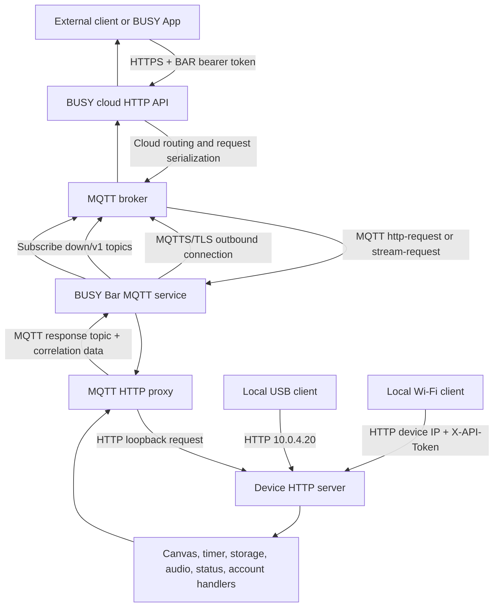
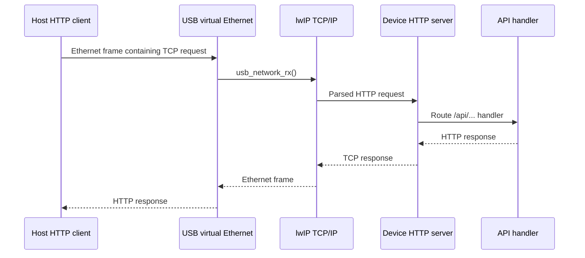
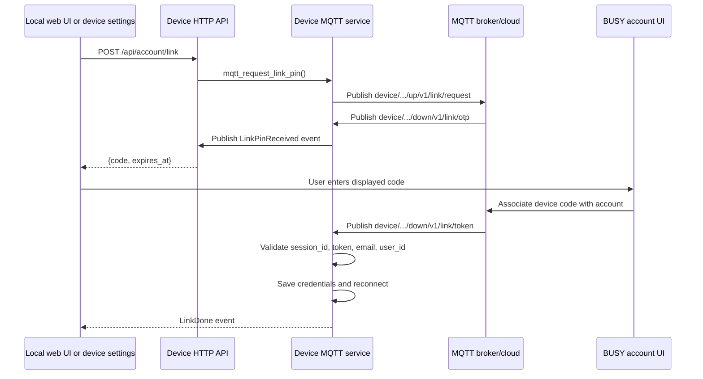
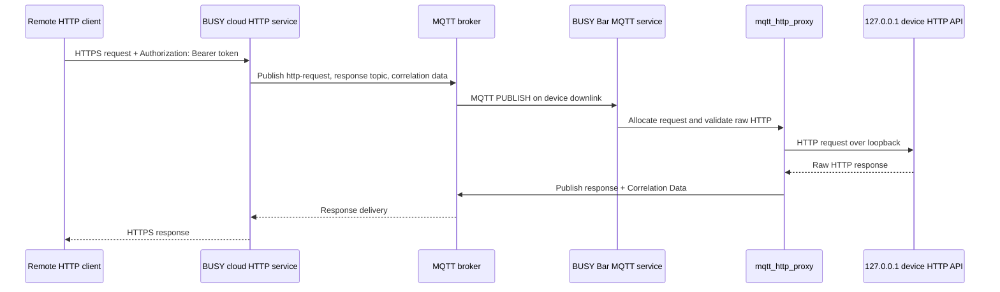

# BUSY Bar Communication, Account, and Cloud Protocols Deep Dive

## Executive Summary

The BUSY Bar exposes several communication surfaces that share a device-side HTTP API but differ in transport, trust boundary, connection ownership, and authentication. A computer can reach the Bar over a USB virtual Ethernet interface at `10.0.4.20`, a local Wi-Fi address, or the BUSY cloud endpoint. The Bar is an HTTP server for the first two paths. For cloud access, the Bar initiates an outbound MQTT 5 connection over TLS to the configured broker, which is `mqtt.busy.app:8883` by default in the inspected firmware. The cloud can then deliver a request to the device through a device-scoped MQTT topic. The firmware’s MQTT HTTP proxy validates the received request and forwards it to its own local HTTP server at `http://127.0.0.1/api/...`.

The central architectural decision is connection ownership. The device does not require an inbound Internet connection. It establishes an outbound, authenticated MQTT connection when Wi-Fi is available, sends presence information, subscribes to downlink topics, and reconnects after failure. Remote HTTP clients address the BUSY cloud, while the device remains behind the local network’s firewall and NAT. The cloud-side HTTP service and MQTT broker are not fully documented as a single public component, but the firmware proves the device-side half of the tunnel: MQTT `http-request` messages carry serialized HTTP requests, MQTT 5 response properties carry the response destination and correlation data, and the device executes permitted requests against its own HTTP API.

Account linking is a protocol layered on that MQTT connection. A local HTTP endpoint asks the device to request a short-lived link code. The device receives the code from a device-scoped MQTT topic and returns it to the local UI. After the user enters the code in the BUSY account UI, the device receives a session identifier, user identifier, email address, and account token over MQTT. The firmware stores those values in its saved MQTT state and reconnects with the account token as the MQTT password. This account token is distinct from a user-created BUSY Bar API token used by remote HTTP clients.

The result is a system with three distinct authorization boundaries:

1. USB is treated as a physically trusted channel and does not require API authentication.
2. Wi-Fi HTTP access is disabled by default and, when enabled, requires the local access password in `X-API-Token`.
3. Internet HTTP access uses a BUSY Bar API token in `Authorization: Bearer ...`, while the device-to-cloud control channel uses the MQTT account credentials stored by the firmware.

This report reconstructs the communication stack from the firmware revision `4033f805b75bb70e51bfb155fcf9cf7a29b2b054`, official BUSY Bar documentation, the public HTTP schema, MQTT 5, Mongoose, and official client-library material. It distinguishes source-backed facts from inferences about cloud-side services that are not present in the public firmware repository.

## 1. Scope, Evidence, and Terminology

A communication architecture is easiest to misunderstand when the same word describes different layers. “Cloud API,” for example, can refer to the public HTTPS endpoint used by an external client, the MQTT broker used by the device, or the HTTP API handler running inside the firmware. This report uses the following terms precisely:

- **Device HTTP API** means the HTTP server embedded in the firmware. It handles paths such as `/api/status`, `/api/display/draw`, and `/api/account/link`.
- **Local HTTP** means a request sent over USB virtual Ethernet or Wi-Fi directly to the device’s HTTP server.
- **Cloud HTTP** means a request sent to the BUSY cloud endpoint, documented as `https://api.busy.app/busybar`.
- **MQTT backend** means the broker connection maintained by the firmware’s `Mqtt` service. The default firmware URL is `mqtts://mqtt.busy.app:8883`.
- **Account token** means the token delivered to the firmware as part of the account-link completion message and used as the MQTT password.
- **BUSY Bar API token** means the bearer token generated in `cloud.busy.app` for external remote HTTP clients.
- **Device scope** means topics rooted at `devices/<device-serial>`.
- **Session scope** means topics rooted at `sessions/<session-id>` after the Bar has been linked to an account.

The primary firmware source was inspected locally at:

```text
/home/manuel/code/others/busy-bar/busybar-firmware
```

The revision analyzed here is:

```text
4033f805b75bb70e51bfb155fcf9cf7a29b2b054
```

The most important local evidence is concentrated in:

```text
applications/services/mqtt/mqtt_connection.c
applications/services/mqtt/mqtt_subscription.c
applications/services/mqtt/mqtt_account.c
applications/services/mqtt/mqtt_message.c
applications/services/mqtt/mqtt_tls_private.c
applications/services/mqtt/modules/mqtt_http_proxy.c
applications/services/mqtt/modules/mqtt_streaming.c
applications/services/web_server/http_api/api_account.c
applications/services/web_server/http_api/api_display.c
applications/services/web_server/http_api/api_status_streaming.c
applications/services/usb_network/usb_network.c
applications/settings/account_settings/models/account_model.c
```

The complete snapshots are in the ticket’s `sources/` directory. The official documentation describes the user-visible connection paths and authentication rules. The firmware establishes the implementation details that the documentation does not state, especially the MQTT broker URL, topic construction, TLS setup, account-token handling, remote HTTP proxy blocklist, and response correlation.

The evidence has limits. The cloud service implementation is not in the firmware repository. The report can therefore describe the device’s MQTT client and cloud-facing contract, but it cannot prove the internal deployment topology of the BUSY cloud, the broker’s ACL implementation, the cloud’s data retention policy, or the exact Google Calendar synchronization jobs.

## 2. The Problem: Remote Control Without an Inbound Device Server

A connected desktop display needs two independent properties. It must remain usable when no cloud account exists, and it must be reachable when the device is on a private network that does not accept unsolicited inbound connections. These properties pull the architecture in different directions. Local HTTP should be direct and low-latency. Remote access should not require port forwarding or a public IP address. Account-linked features need a durable identity and a way to deliver commands to a specific device.

The BUSY Bar resolves this by keeping the device-side HTTP API as the canonical control interface and adding transports around it. USB and Wi-Fi expose the server directly. MQTT provides an outbound command channel for account-linked operation. The cloud-facing HTTP service can translate a remote request into an MQTT message, and the device can translate the MQTT message back into a local HTTP request. This keeps the display, timer, storage, audio, configuration, and status handlers in one implementation instead of creating a second remote-only command vocabulary.

The official HTTP API documentation states the device/client relationship directly:

> “The BUSY Bar acts as an HTTP server, waiting for incoming requests, while an HTTP client sends requests to the device.”

That statement describes USB and Wi-Fi directly. It also describes the endpoint semantics used after the MQTT proxy has delivered a request to the device. The cloud path adds transport, but does not replace the device API’s request handlers.

The design must also solve four operational problems:

1. **Identity.** The cloud must distinguish one physical Bar from every other Bar.
2. **Linking.** A user must be able to associate that device with a BUSY account without placing an account password into the device UI.
3. **Liveness.** The cloud must know whether a device is currently connected and must detect abnormal disconnects.
4. **Bounded control.** Remote access must not expose every local-only operation. In the inspected firmware, the remote HTTP proxy rejects several network, account, and firmware endpoints before they reach the local API.

The implementation is not a generic reverse proxy. It is a protocol bridge with a constrained request surface. It parses a serialized HTTP request from MQTT, accepts only `/api/...` requests, blocks selected method/path pairs, rejects WebSocket upgrades, forwards the remaining request to loopback, and sends the HTTP response to the MQTT response topic.

## 3. System Model

The complete communication system contains six principal components:

| Component | Runs where | Primary responsibility | Connection ownership |
| --- | --- | --- | --- |
| USB virtual Ethernet | BUSY Bar firmware and host USB stack | Provides a local IP network over USB | Device exposes network interface; host connects |
| Device HTTP server | BUSY Bar firmware | Handles API, local web UI, and WebSocket requests | Device listens |
| Wi-Fi network interface | BUSY Bar wireless MCU/network stack | Provides LAN and Internet reachability | Device joins network |
| MQTT service | BUSY Bar firmware | Maintains cloud broker connection and account session | Device initiates outbound connection |
| BUSY cloud services | Provider infrastructure | Account management, remote HTTP ingress, integrations, and broker-side routing | External clients connect to cloud |
| External client or BUSY App | Computer, phone, service, or browser | Sends local/cloud API requests or displays account state | Client initiates local HTTP or cloud HTTPS |

The device-side service boundaries are visible in the firmware’s application manifests. The MQTT service provides the account transport, MQTT HTTP proxy, and MQTT streaming modules. The web server provides the HTTP API and the local web interface. The USB network service creates an lwIP interface and DHCP server for USB Ethernet. The network service initializes lwIP and gives each service the required per-thread network context.

### 3.1 End-to-end architecture



The arrows show two different directions. The external client initiates the cloud HTTPS request, but the device initiates the MQTT connection. The cloud cannot require an inbound TCP connection to the Bar in order to deliver the request; it publishes to the existing MQTT connection.

### 3.2 Protocol layering

| Layer | Local USB | Local Wi-Fi | Cloud control | Device-side implementation |
| --- | --- | --- | --- | --- |
| Link | USB NCM/virtual Ethernet | 2.4 GHz Wi-Fi | Wi-Fi to Internet | lwIP network interfaces |
| Transport | TCP | TCP | TCP | Mongoose and lwIP |
| Security | No API authentication; USB treated as trusted | Local password in `X-API-Token`; HTTP scheme documented as local HTTP | TLS for HTTPS and MQTT; bearer token for public HTTP; MQTT credentials for device session | mbedTLS, CA bundle, optional client certificate |
| Application | HTTP/JSON, WebSocket | HTTP/JSON, WebSocket | HTTPS/JSON at cloud edge; MQTT device path | Device HTTP handlers and MQTT modules |
| Identity | Physical/USB access | Local access password | BUSY Bar API token and linked device | Device serial, MQTT client ID, session ID, account token |

The same device HTTP API therefore appears under different trust assumptions. A client library should select a transport deliberately rather than treating the endpoint URL as the whole security model.

## 4. USB Virtual Ethernet and Local HTTP

USB is implemented as a network interface rather than as a command-specific serial protocol. `applications/services/usb_network/usb_network.c` creates an lwIP `netif`, assigns it the logical name `EX`, configures a DHCP server, and moves Ethernet frames through TinyUSB’s network callbacks. The device’s USB network settings provide the address, netmask, and gateway. The standard user-facing address is `10.0.4.20`.

The important consequence is that local browser and API traffic uses the same TCP/IP and HTTP machinery as Wi-Fi traffic. A browser can open `http://10.0.4.20/`; an HTTP client can call `http://10.0.4.20/api/status`; and the local web UI can request the on-device OpenAPI reference. The firmware does not need a separate USB command dispatcher for these operations.

The official documentation describes USB as a trusted channel. It does not require an API token for requests received through the USB virtual network. This is an authorization decision, not an encryption guarantee. The documentation explains the absence of authentication; it does not establish that every USB packet is confidential from the host or that traffic is cryptographically protected.

The practical trust boundary is therefore physical access to the USB link and the host operating system. Any process that can reach the USB virtual interface can attempt device API operations without a password. That includes display changes, files, settings, and any endpoint not marked local-only by the API layer. A user should not connect the Bar to an untrusted computer when the computer can execute arbitrary programs.

### 4.1 USB data path



### 4.2 USB versus Wi-Fi access

The local web interface documentation gives the operational sequence for enabling Wi-Fi access: connect over USB, enable remote access, optionally enable HTTP API access, set a password, inspect the Wi-Fi address, and then connect over the LAN. The HTTP API documentation states that Wi-Fi API access is disabled by default. When enabled, the configured password is sent in the `X-API-Token` header.

The authentication difference is intentional:

| Property | USB | Wi-Fi |
| --- | --- | --- |
| Default address | `10.0.4.20` | Router-assigned address |
| API enabled by default | Available through USB setup | Disabled by default |
| Header required | No | `X-API-Token: <local password>` |
| Trust assumption | Physical host access | Any host able to reach the LAN endpoint |
| Internet required | No | No for local access |
| Account required | No | No for local API control |

The local HTTP API is therefore useful without any cloud account. Account linking is a separate operation that requires the MQTT service to be connected to a backend.

## 5. MQTT Service and Device-to-Cloud Transport

The MQTT service is a long-lived firmware service with its own Mongoose event manager. `mqtt_srv()` allocates the service, initializes the network context, loads settings and saved state, registers the MQTT record, subscribes to Wi-Fi state, and repeatedly calls `mg_mgr_poll()` once per second. The MQTT service does not run as a short request handler. It owns a connection state machine that persists while the firmware runs.

The default server URL is defined in `mqtt_connection.c` as:

```c
#define MQTT_SERVER_URL_DEFAULT MQTT_URL_TLS_PREFIX "mqtt.busy.app:8883"
```

The configuration schema allows the special value `default` or a custom URL such as `mqtts://mqtt.example.com:8883`. This is significant for self-hosting and testing: the firmware has a configurable MQTT backend, although the account and cloud semantics still depend on the server-side implementation.

### 5.1 MQTT connection establishment

The device uses Mongoose’s asynchronous `mg_mqtt_connect()` function. It passes a client ID, user name, password, clean-start setting, keepalive, MQTT version, and a Last Will message. The relevant source shape is:

```c
const struct mg_mqtt_opts opts = {
    .client_id = mg_str(saved_state->client_id),
    .user = mg_str(furi_string_get_cstr(username)),
    .pass = mg_str(saved_state->token),
    .clean = true,
    .keepalive = MQTT_PING_PERIOD / 1000,
    .version = MQTT_VERSION,
    .topic = mg_str(furi_string_get_cstr(last_will_topic)),
    .message = mg_str("{\"status\":\"offline\"}"),
    .qos = MqttQosAtLeastOnce,
    .will_props = (struct mg_mqtt_prop*)will_props,
    .num_will_props = COUNT_OF(will_props),
};

instance->conn = mg_mqtt_connect(
    &instance->mgr,
    server_url,
    &opts,
    mqtt_connection_mg_event_callback,
    instance);
```

The firmware sets `MQTT_VERSION` to 5. `MQTT_PING_PERIOD` is `M_TO_MS(10)`, so the configured MQTT keepalive is 600 seconds. A separate timer invokes `mg_mqtt_ping()` at the same interval. The MQTT service also responds to broker PINGREQ packets with PONG.

The client ID is generated when saved state is reset:

```c
snprintf(
    saved_state->client_id,
    sizeof(saved_state->client_id),
    "busybar-%08lx%08lx",
    random_id[0],
    random_id[1]);
```

The user name is formatted as `BusyBar device <device-serial>`. The password is the saved account token. The device serial is derived from the MCU hardware UID and used in device-scoped MQTT topic paths. The random client ID and hardware-derived serial have different roles: the client ID identifies the MQTT session, while the serial identifies the logical device namespace.

### 5.2 TLS configuration

The MQTT URL uses the `mqtts://` scheme by default. When the URL is SSL-enabled, the firmware loads the CA bundle from:

```text
/ext/apps_assets/shared/ca/cacert.pem
```

`mqtt_tls_private.c` configures mbedTLS and forces both the minimum and maximum TLS version to TLS 1.3. It sets the MQTT ALPN protocol list to `mqtt`, sets the TLS server hostname, loads the CA chain, and uses `MBEDTLS_SSL_VERIFY_REQUIRED` unless `ignore_server_cert` is configured.

The firmware supports three client certificate modes:

- **Default:** load the device certificate and signing certificate from hardware crypto slots and use a hardware-backed ECDSA signing wrapper.
- **Custom:** load `/ext/apps_assets/mqtt/device.crt` and `/ext/apps_assets/mqtt/device.key`.
- **None:** do not configure a client certificate.

This gives the implementation a two-part authentication model. The MQTT CONNECT packet contains the account token as the password, while the TLS layer can also present a client certificate. The inspected source does not establish whether the default BUSY broker requires the certificate, accepts the password alone, or uses both as independent checks. The default firmware does load and configure the hardware-backed certificate path.

The configuration also exposes `ignore_server_cert`. This is useful for a custom self-signed broker but removes the normal server-certificate verification guarantee. It should not be enabled for the production BUSY broker.

### 5.3 Connection state and recovery

After the broker returns a successful CONNACK, the service sets one of two states:

```text
MqttStatusConnectedNotLinked
MqttStatusConnectedLinked
```

It activates all registered subscriptions, starts the ping timer, and publishes an online presence payload containing the firmware version, API version, and `"status":"online"`.

When the connection closes, it marks the status as not connected, stops the ping timer, releases TLS certificate memory, and schedules reconnection if Wi-Fi remains available. The reconnect delay starts at 2 seconds and doubles up to 60 seconds. A successful subscription resets the delay to the minimum.

If a subscription receives `MqttReasonCodeNotAuthorized` while the state is connected and linked, the firmware resets saved account state and reconnects. This prevents an invalid or revoked credential from remaining in the linked state indefinitely.

The MQTT connection uses `clean = true`. It re-subscribes after reconnecting rather than relying on a persistent broker session. This reduces dependence on broker-side session persistence, but it also means commands published while the Bar is offline are not automatically recovered through a persistent subscription session unless the cloud protocol separately retains or reconstructs them.

### 5.4 Presence and Last Will

The firmware publishes device-scoped presence after a successful connection:

```json
{
  "firmware_version": "...",
  "api_version": "...",
  "status": "online"
}
```

It also configures an MQTT Last Will message on the same presence topic:

```json
{"status":"offline"}
```

The Last Will is published by the broker when the connection ends abnormally according to MQTT rules. The source sets a zero-second Will Delay Interval and QoS 1. A normal unlink path also closes the MQTT connection and resets the saved state, but the exact cloud-side handling of normal disconnect versus Will delivery depends on the broker and account service.

The presence topic is not merely diagnostic. It allows the account service to determine whether a linked device has an active cloud channel and to present connection state to clients. The firmware’s local `/api/account/status` handler exposes a reduced view: `error`, `disconnected`, or `connected`.

## 6. MQTT Topic Namespace and Message Scope

The firmware constructs every topic from a root, identifier, direction, API version, and logical topic name:

```c
furi_string_printf(
    out,
    "%s/%s/%s/%s/%s",
    root,
    id,
    dir,
    MQTT_API_VERSION,
    topic);
```

The resulting shape is:

```text
<root>/<id>/<direction>/v1/<topic>
```

The two roots are:

```text
devices/<device-serial>/up/v1/<topic>
devices/<device-serial>/down/v1/<topic>

sessions/<session-id>/up/v1/<topic>
sessions/<session-id>/down/v1/<topic>
```

The device scope is available before account linking. The session scope is available only after the saved session is valid. The firmware enforces this in `mqtt_is_valid_scope_for_current_status()`:

- device-scoped publish/subscribe is valid while connected, whether linked or not;
- session-scoped publish/subscribe is valid only while connected and linked.

This separation gives account services two distinct authorization targets. A device can receive link-management messages before it has a user session. Account-scoped features require the session identifier delivered by the link-completion message.

### 6.1 Built-in topic subscriptions

The MQTT account module registers these subscriptions:

| Scope | Direction | Topic | QoS | Purpose |
| --- | --- | --- | --- | --- |
| Device | down | `link/otp` | Exactly once | Delivers a short-lived link code |
| Device | down | `link/token` | Exactly once | Delivers account/session credentials after linking |
| Session | down | `gone` | At least once | Requests unlinking from the cloud |

The HTTP proxy subscribes to device-scoped `http-request` with QoS 2. The MQTT streaming module subscribes to device-scoped `stream-request` with QoS 1. Responses and streams use MQTT 5 Response Topic and Correlation Data properties.

### 6.2 QoS selection

The firmware chooses QoS according to operation semantics:

| Operation | Firmware QoS | Reason implied by implementation |
| --- | --- | --- |
| Account link PIN | Exactly once | A link code should not be duplicated or lost during the short request |
| Account link token | Exactly once | Credential delivery should not duplicate or disappear |
| Unlink request | At least once | The operation can tolerate retransmission because unlink is idempotent in the device handler |
| Remote HTTP proxy | Exactly once request | The request/response bridge needs a strong delivery contract |
| MQTT screen streaming | At least once command, at most once frames | Start/stop control matters more than individual frame recovery |
| Presence | At least once | Online/offline state should reach the broker reliably |

The source contains a comment that proper QoS handling remains incomplete in the internal wrapper. MQTT QoS acknowledgement is still processed at the Mongoose layer, but the application-level publish API returns a boolean indicating that the message was queued rather than proving that the broker delivered it.

## 7. Account Linking as a Protocol

Account linking begins through a local operation because the firmware marks the HTTP POST `/api/account/link` endpoint local-only in the OpenAPI schema. The device must already have an MQTT connection and must not already be linked. The local request does not contain a BUSY account password. It asks the already-connected device to request a link code from the backend.

The sequence is:



The device-side HTTP handler waits for the MQTT event. It installs a three-second timeout and returns `503 PIN request timeout` if the broker does not deliver the code in time. The OpenAPI schema represents the returned code as a four-character string in the example and includes an expiration timestamp.

The account settings UI can also request the link PIN directly through the `AccountModel`. The model subscribes to MQTT pub/sub events, starts a three-second local timeout, and forwards the PIN and expiry time to the scene. The scene displays the code on both displays and refreshes it when the user requests another code.

When the cloud sends the completion message, `mqtt_account_link_token_message_callback()` extracts four JSON fields:

```json
{
  "session_id": "...",
  "token": "...",
  "email": "...",
  "user_id": "..."
}
```

The callback requires all four values to be present. It copies them into the saved state, persists the state, publishes a `LinkDone` event, and closes the MQTT connection with immediate reconnect requested. The reconnect then uses the saved token as the MQTT password and enables session-scoped subscriptions.

### 7.1 Credential classes

There are several credentials in the overall system:

| Credential | Created by | Used by | Transport | Scope |
| --- | --- | --- | --- | --- |
| Wi-Fi network password | User/router | Bar Wi-Fi client | Wi-Fi setup | Join local network |
| Local HTTP API password | User through local web UI | Local Wi-Fi HTTP clients | `X-API-Token` | Device HTTP access over LAN |
| Account link PIN | BUSY backend | User/account UI | Displayed briefly, delivered via MQTT | One linking operation |
| MQTT account token | BUSY backend | Bar MQTT CONNECT password | TLS-protected MQTT | Device account session |
| BUSY Bar API token | User through cloud account | External remote HTTP clients | `Authorization: Bearer` | Remote control of one connected Bar |
| MQTT client certificate | Firmware or custom asset | MQTT TLS client authentication | TLS handshake | Device/backend authentication, depending on broker policy |

A developer must not substitute these credentials. A local API password is not a BUSY account token. A BUSY Bar API token is not necessarily the MQTT password stored in firmware. The public documentation calls the externally generated token a BUSY Bar access token and explicitly warns that anyone who possesses it can make requests on the user’s behalf.

### 7.2 Saved state and storage uncertainty

The `MqttSavedStateV1` setting schema contains:

```text
client_id
session_id
user_id
email
token
```

The source shows these fields being loaded and saved through the firmware setting provider. It does not, in the inspected files, establish whether the token is encrypted at rest, stored in a hardware-protected region, or protected by a separate secure-storage layer. The MQTT TLS code does use hardware crypto slots for the default client certificate and signing key, but that does not prove that the account token uses the same protection.

This is an important distinction between observed behavior and a security conclusion. The report can state that the token is persisted through the saved-state mechanism. It cannot state from these files that the token is plaintext on flash or that it is encrypted. Answering that question requires tracing the setting-provider storage backend and its encryption policy.

## 8. Remote HTTP Proxying

The device’s remote HTTP proxy is the most important bridge in the architecture. The cloud-facing client uses HTTPS and a BUSY Bar API token. The device receives an MQTT message on `http-request`. That message contains an HTTP request serialized as MQTT payload plus MQTT 5 properties for the response topic and correlation data.

The proxy creates a request object with:

```text
raw HTTP request bytes
response topic
correlation data
start tick
```

It validates the raw request with Mongoose’s HTTP parser. The URI must match `/api/...`. The proxy strips the `/api/` prefix only for validation of the remaining URI and rejects requests outside that namespace. It also rejects WebSocket upgrades. A normal remote HTTP request is then sent to:

```text
http://127.0.0.1/api/...
```

The loopback request reaches the same device HTTP handlers used by local clients.

### 8.1 Remote blocklist

The proxy blocks these method/path combinations:

| Method | Path | Reason implied by operation |
| --- | --- | --- |
| POST | `/api/update` | Prevent remote firmware update through this tunnel |
| DELETE | `/api/account` | Prevent remote unlinking through this tunnel |
| POST | `/api/account/link` | Prevent remote account-link initiation |
| PUT | `/api/account/backend` | Prevent remote MQTT backend reconfiguration |
| POST | `/api/wifi/connect` | Prevent remote network reconfiguration |
| POST | `/api/wifi/disconnect` | Prevent remote network disconnection |
| GET | `/api/wifi/networks` | Prevent remote Wi-Fi scanning |

This is a method-aware blocklist. The proxy parses the method and normalized URI and rejects only the matching operation. It does not create a general allowlist of every API endpoint. New endpoints added to the local API could therefore become remotely reachable unless they are separately blocked or the proxy changes to an explicit allowlist.

The proxy also blocks WebSocket upgrades. This means the remote HTTP path cannot simply forward a local WebSocket connection through the same request handler. Screen/status streaming is implemented separately through the MQTT streaming module.

### 8.2 Response correlation

The proxy requires both a non-empty MQTT Response Topic and non-empty Correlation Data before it sends a response. After the loopback HTTP request completes, it publishes the raw HTTP response message to the response topic and includes the original correlation data property.

The response topic is validated and normalized by `mqtt_message_get_string_property()`. The firmware only accepts response topics matching the session-scoped pattern:

```text
sessions/*/up/v1/#
```

That validation prevents an arbitrary incoming message from causing the device to publish to an unrelated topic namespace. It also ensures that remote request responses are associated with the linked session rather than the device-wide link-management namespace.

The loopback HTTP connection has a five-second expiration. If the request cannot be processed in time, the proxy closes the connection. Invalid requests that have response metadata receive an HTTP `422 Unprocessable Entity` response over MQTT.

### 8.3 Remote request data flow



The source proves the device-side transformations. The cloud-side conversion from public HTTPS to MQTT is strongly implied by the documented cloud endpoint and the firmware’s `http-request` subscription, but the cloud implementation is not public. The exact HTTP serialization format is the raw HTTP message accepted by `mg_http_parse()`; the cloud must produce a request that that parser accepts.

## 9. WebSocket Status and Screen Streaming

The device HTTP API exposes a WebSocket status stream separately from the MQTT control connection. `api_status_streaming.c` allocates four client slots. Each client has a handshake state, active state, heartbeat timer, message queue, and state-publisher transport handle.

When a client enables streaming with a text message containing `{"enable":true}`, the service adds a WebSocket transport to the shared state publisher. Frames are generated every 100 milliseconds and sent as binary WebSocket messages. The stream has an 11-packets-per-second rate limit and pauses the publisher when the client queue reaches six messages. It resumes when the queue falls to two messages.

The WebSocket heartbeat is independent of MQTT keepalive:

- heartbeat interval: 10 seconds;
- active client sends a Ping request through the event loop;
- client enters `WaitingPong` state;
- missing Pong makes the client invalid and drains the connection.

A client can request a complete state snapshot by sending `{"send":"all"}`. The stream is local API machinery and has a maximum of four concurrent clients in the inspected revision. It is not the same as the remote MQTT streaming module.

### 9.1 MQTT streaming

The MQTT streaming module subscribes to `stream-request` at QoS 1. Its payload determines whether streaming starts or stops. A start message can include:

- an MQTT Response Topic;
- an Expiry Interval;
- a JSON `message_limits` object with maximum count and interval;
- a response destination for binary frames.

The default expiry interval is 60 seconds. Frames are published at 500-millisecond intervals using MQTT QoS 0. When the MQTT connection is lost, the module stops the active publisher. The publisher is registered with the shared `StatePublisher` using `StatePublisherTransportClassMQTT`.

This design separates control reliability from frame reliability. The start/stop command uses QoS 1. Individual screen frames use QoS 0 because retransmitting old frames would not improve a live display. The response topic and expiry prevent a stale stream request from keeping a high-rate publisher active forever.

| Stream path | Control transport | Frame transport | Default cadence | Lifecycle limit |
| --- | --- | --- | --- | --- |
| Local WebSocket | HTTP upgrade + WebSocket text control | Binary WebSocket frames | 100 ms | Four clients; 10 s heartbeat |
| Cloud MQTT | MQTT `stream-request` | MQTT response topic | 500 ms | 60 s expiry by default |

## 10. HTTP API Authorization Boundaries

The official documentation defines three HTTP access modes. The OpenAPI schema adds endpoint-level metadata such as `x-local-only`. Together they create a layered access model.

| Path | Transport | Authentication | Typical endpoint |
| --- | --- | --- | --- |
| USB virtual Ethernet | HTTP to `10.0.4.20` | None | Local status and setup |
| Wi-Fi LAN | HTTP to device IP | Local password in `X-API-Token` | Local automation |
| Internet | HTTPS to `api.busy.app/busybar` | BUSY Bar API token in `Authorization: Bearer` | Remote automation |
| MQTT device service | MQTTS to broker | MQTT password and optional client certificate | Account/cloud session |

The API token page defines two cloud token scopes:

- **BUSY Bar:** remote control of one connected BUSY Bar through the BUSY Bar HTTP API.
- **Account:** timer state and profiles synchronized across the BUSY account.

Tokens are shown once at creation. Deleting a token permanently invalidates requests made with that token. The documentation describes the token as bearer-like: possession is sufficient to make requests on the user’s behalf.

The API schema marks these operations local-only:

```text
DELETE /api/account
POST   /api/account/link
PUT    /api/account/backend
```

The remote MQTT HTTP proxy adds its own blocklist and blocks the firmware update and Wi-Fi operations listed earlier. The two controls serve different layers. `x-local-only` is an API contract for local routes. The proxy blocklist is an enforcement boundary for requests arriving over the cloud MQTT path.

This layered design still requires maintenance discipline. An endpoint that is safe locally may not be safe remotely, and a new endpoint may be remotely available by default if the proxy does not classify it. The safest long-term policy for remote exposure is an explicit allowlist of cloud-approved endpoints, not a growing denylist.

## 11. Failure Semantics and Ordering

Communication protocols define delivery, but device APIs also have application-level state transitions. A reliable integration must account for both. A successful MQTT publish means that the message was accepted into the client’s send buffer. A successful HTTP response means that the local handler accepted the request. Neither statement guarantees that the display has completed its final physical flush.

### 11.1 MQTT failures

The MQTT service exposes at least these state transitions:

```text
NotConnected
  → ConnectedNotLinked
  → ConnectedLinked
  → NotConnected
  → Error
```

A Wi-Fi disconnect prevents the reconnect loop from continuing until the network returns. A broker close while Wi-Fi is still up schedules reconnect. A not-authorized subscription while linked resets the saved state and attempts a fresh connection. A send queue larger than 50 KiB causes later publishes to be dropped by the wrapper.

The clean-start connection and re-subscription behavior mean that integrations should not assume that every command will be replayed after a disconnect. For state-setting commands, clients should be able to reapply the desired state after reconnection. For one-shot actions, clients should attach an application-level identifier if the cloud service exposes one and should tolerate duplicate handling where the firmware operation is idempotent.

### 11.2 HTTP proxy failures

The HTTP proxy has bounded request lifetime. A malformed serialized HTTP request, a non-`/api/` URI, a blocklisted operation, or a WebSocket upgrade is rejected before loopback. A valid request that does not complete within five seconds is closed. If response metadata was supplied, an error response can be published using the same correlation data.

The proxy does not queue arbitrary requests for later execution. It processes a received request while the MQTT connection is active. A cloud client should therefore treat a lost MQTT connection, a missing response, and an HTTP response with an error status as different failure classes.

### 11.3 Display consistency

Remote HTTP requests eventually invoke the same display API used locally. The display API uses application names and priorities. A response from `/api/display/draw` confirms request handling, not exclusive visual ownership. Another application can have a higher priority, and a request can return `409` when its priority is insufficient. This is an application-layer condition above the network transport.

A remote integration should:

1. choose a stable application name;
2. choose a priority consistent with the intended ownership model;
3. await draw and clear responses sequentially;
4. use an opaque background when a full-screen status must hide lower-priority pixels;
5. re-render after reconnection rather than assuming the device retained the desired state;
6. avoid interpreting HTTP 200 as proof that a particular visual frame is currently visible.

## 12. Security Analysis

The system’s security properties differ by path. TLS protects the MQTT and cloud HTTPS transport when verification is enabled, but the USB path is explicitly trusted without an API password. The local Wi-Fi API uses a configured shared secret in an HTTP header. The cloud HTTP API uses a bearer token. These are different security models, not three views of one authentication mechanism.

### 12.1 Threat model

| Asset | Threat | Entry point | Consequence | Primary control |
| --- | --- | --- | --- | --- |
| Display state | Unauthorized draw or clear | USB, Wi-Fi, cloud API | Status spoofing or interruption | Channel authentication and priority policy |
| Stored files | Unauthorized upload/delete | HTTP API | Asset replacement or storage exhaustion | API authorization and local-only restrictions |
| Account session | Token theft | Saved state, logs, cloud account | Device control and cloud access | Token protection and revocation |
| Wi-Fi configuration | Remote network change | HTTP API | Loss of connectivity or network manipulation | Local-only and proxy blocklist |
| Firmware | Unauthorized update | Local API or cloud path | Device compromise | Remote update blocklist plus firmware validation outside this analysis |
| Live state | Unauthorized observation | WebSocket or MQTT stream | Display/input disclosure | Authentication and stream authorization |

### 12.2 USB trust

USB requires no API token because the documentation treats it as a secure channel. This is appropriate for setup workflows, but the trust boundary is the host connection, not the physical Bar in isolation. A compromised host can issue API calls. A shared workstation, virtual machine with USB pass-through, or untrusted kiosk should be treated as fully privileged with respect to the device.

### 12.3 Wi-Fi trust

Wi-Fi API access is disabled by default. Enabling it adds a local password that must be placed in `X-API-Token`. The documentation does not state that the LAN HTTP endpoint is HTTPS, so clients should not assume that the password is protected against a local network observer by transport encryption. The password should be unique, long enough for the device’s accepted format, and not reused for another service.

### 12.4 Cloud token trust

The BUSY Bar API token is a bearer credential. The documentation says it is displayed only once and that anyone who possesses it can make requests on the user’s behalf. It should be stored in a secret manager or environment variable, not committed to a repository, placed in a shell history file, or printed in logs. Deleting the token is the documented revocation operation.

The account token stored in firmware has a different exposure path. The firmware uses it as the MQTT password. The inspected saved-state schema stores it as a string field, but the encryption-at-rest behavior is not established by the sources reviewed for this report. The device’s default TLS client certificate and private-key signing path use hardware crypto slots, which is a separate protection mechanism.

### 12.5 Remote proxy boundary

The remote proxy blocklist is a concrete security control. It prevents cloud-delivered requests from changing the MQTT backend, changing Wi-Fi, linking or unlinking the account, or running the firmware update operation through the HTTP tunnel. It also prevents WebSocket upgrades from using the request/response proxy.

The blocklist is not a complete security policy. It is a negative list. New API endpoints require explicit review to determine whether remote access is appropriate. The report’s recommended review invariant is:

```text
For every new /api path:
    define local access behavior;
    define cloud access behavior;
    define whether the MQTT proxy permits it;
    test both paths;
    document the authorization boundary.
```

### 12.6 TLS and client identity

The MQTT TLS implementation forces TLS 1.3 and validates the server certificate unless configuration disables verification. It sets the server hostname before the handshake. Default client certificates are loaded from hardware crypto slots, and custom certificate/key files are supported. The source does not establish the cloud broker’s exact client-certificate policy or the cloud-side ACL rule that maps a certificate, password, device serial, and topic namespace to permissions.

Those are open audit questions rather than missing details to be guessed. The device-side source proves what credentials the client presents and which topics it constructs. It does not prove the broker’s authorization implementation.

## 13. Integrations and Data Ownership

The BUSY account documentation describes the cloud account as synchronizing timers, statuses, integrations, and remote access across devices. This is an account-level service, not a firmware-only feature. Google Calendar is connected through `cloud.busy.app`; the user authorizes calendar access, selects calendars, and configures reminder/status behavior. The public documentation describes the resulting display behavior but does not expose the cloud worker implementation or the exact event payload sent to the device.

Auto ON CALL follows a different path. The macOS BUSY application monitors microphone usage and changes the Bar’s status when a call begins or ends. The device is still the display endpoint, but call detection happens on the computer. The firmware’s remote display interface supplies the command path; the desktop application supplies the event source.

This distinction matters when designing a custom integration. An integration may be:

- a process that calls the device HTTP API directly;
- a cloud account feature that synchronizes a service through BUSY infrastructure;
- a desktop application that detects local operating-system state and updates the Bar;
- a firmware service that maintains a broker connection and receives messages;
- a Matter controller integration that uses the local smart-home network.

The word “integration” does not identify the process that owns the data or the network connection. A report of an event on the display is not evidence that the Bar queried the originating service directly.

## 14. Developer Interface Selection

The correct transport depends on where the integration runs and whether it needs cloud reachability.

| Requirement | Recommended interface | Reason |
| --- | --- | --- |
| First experiment or setup | USB HTTP at `10.0.4.20` | No Wi-Fi setup and no API token |
| Home server on same LAN | Wi-Fi HTTP | Direct device API with local password |
| Remote service controlling one Bar | Cloud HTTPS API | Account-managed reachability and bearer token |
| Live local state or screen frames | Device WebSocket | Binary stream with snapshots and heartbeats |
| Official Python integration | `busylib` Python | Typed client and converter support |
| Official TypeScript integration | `busylib-ts` | Typed HTTP/WebSocket client |
| Custom device-to-cloud protocol | Firmware MQTT backend | Requires firmware-level integration or backend-compatible broker |
| Built-in cloud account behavior | Account MQTT session | Uses the vendor’s account and topic contract |

The `busybar` Go/Goja client in `github.com/go-go-golems/busybar` is an external client for the device HTTP and WebSocket APIs. It does not replace the firmware MQTT service and does not install an Apps-menu application. It is suitable for writing a host-side integration that runs over USB, Wi-Fi, or a configured remote HTTP address.

### 14.1 A host-side integration sketch

The following TypeScript-like sketch shows the correct separation between source polling, desired state, and device rendering:

```ts
const app = client
  .connect({ address, token })
  .app("calendar-status")
  .priority(30);

async function render(state: CalendarState): Promise<void> {
  await app.draw({
    elements: [
      {
        id: "background",
        type: "rectangle",
        display: "front",
        x: 0,
        y: 0,
        width: 72,
        height: 16,
        fill: "solid",
        fill_colors: ["#000000FF"],
        border_width: 0,
      },
      {
        id: "status",
        type: "text",
        text: state.label,
        font: "small",
        color: state.active ? "#FF0000FF" : "#00FF00FF",
        display: "front",
        align: "center",
        x: 36,
        y: 8,
      },
    ],
  });
}

for (;;) {
  const state = await calendar.readCurrentState();
  await render(state);
  await sleep(1000);
}
```

The application name identifies the integration’s retained display elements. The priority controls arbitration against other applications. The background prevents lower-priority pixels from showing through. The loop re-reads the source of truth instead of relying on a single successful draw.

### 14.2 A direct local HTTP request

The local API can be exercised without an account:

```bash
curl http://10.0.4.20/api/status/firmware

curl -X POST http://10.0.4.20/api/display/draw \
  -H 'content-type: application/json' \
  --data '{
    "application_name": "network-demo",
    "priority": 30,
    "elements": [{
      "id": "message",
      "type": "text",
      "text": "ONLINE",
      "font": "small",
      "display": "front",
      "align": "center",
      "x": 36,
      "y": 8
    }]
  }'
```

For Wi-Fi, add the local password:

```bash
curl http://192.168.1.20/api/status \
  -H 'X-API-Token: <local-api-password>'
```

For cloud HTTP, use a BUSY Bar-scope API token:

```bash
curl https://api.busy.app/busybar/status \
  -H 'Authorization: Bearer <busy-bar-api-token>'
```

The exact cloud endpoint path and response schemas should be taken from the firmware/API-version-specific OpenAPI reference. The local `/docs` page is valuable because it describes the API actually served by the device.

### 14.3 A raw MQTT client is a different project

A third-party client should not attempt to subscribe to the BUSY account topics merely because the topic names are visible in firmware. The broker ACL, account-token format, certificate requirements, and server-side request serializer are provider-controlled. A custom MQTT client can be built against a custom firmware backend configuration, but interoperability with the production BUSY cloud requires the provider’s credential and topic contract.

The public source is more useful for building HTTP integrations than for implementing a second production cloud client. The HTTP API is documented and versioned for callers. The account MQTT topics are an internal device/cloud protocol with partial source visibility.

## 15. Comparison with MQTT 5 Semantics

MQTT 5 supplies the primitives used by this architecture, but the firmware’s use of them is specific and limited.

| MQTT 5 feature | BUSY Bar use | Evidence |
| --- | --- | --- |
| Client ID | Random `busybar-...` value | `mqtt.c` and `mqtt_connection.c` |
| User name/password | Device serial user name and saved token password | `mqtt_connection.c` |
| Clean Start | `clean = true` | `mqtt_connection.c` |
| Keep Alive | 600 seconds | `MQTT_PING_PERIOD` |
| Will message | Device presence offline JSON | `mqtt_connection.c` |
| Will Delay Interval | Zero | `will_props` |
| QoS 0/1/2 | Selected by module and topic | MQTT wrapper and modules |
| Response Topic | HTTP proxy and streaming responses | `mqtt_http_proxy.c`, `mqtt_streaming.c` |
| Correlation Data | HTTP proxy response matching | `mqtt_http_proxy.c`, `mqtt_message.c` |
| Message Expiry Interval | MQTT streaming lifetime | `mqtt_streaming.c` |
| Session expiry | Not observed in inspected connection options | Source inspection |
| Retained messages | Not observed in inspected publish options | Source inspection |

MQTT’s Request/Response properties are especially important here. The device does not invent an application-specific correlation field for the HTTP bridge. It extracts MQTT Response Topic and Correlation Data, sends the local HTTP response to the specified normalized session-scoped topic, and echoes Correlation Data.

The firmware does not use MQTT as a replacement for HTTP payload schemas. The HTTP request remains an HTTP message inside the MQTT payload. This preserves the device API’s method, URI, headers, body, and response structure while adding a brokered transport.

## 16. Architecture Decisions and Consequences

### Decision 1: Make the device HTTP API canonical

**Context.** Local web UI, USB clients, Wi-Fi clients, and cloud clients need equivalent device control.

**Decision.** Keep API routing and validation in the device HTTP server. The cloud MQTT proxy forwards permitted requests to loopback.

**Rationale.** One handler implementation defines display, storage, audio, status, and configuration semantics. Local and remote behavior remain comparable.

**Consequences.** The remote proxy must serialize valid HTTP requests and maintain a blocklist or allowlist. HTTP response latency includes MQTT and cloud routing latency. New local endpoints require remote-exposure review.

**Status:** accepted in the inspected firmware.

### Decision 2: Use device-initiated MQTT for cloud reachability

**Context.** The Bar may be behind NAT, a firewall, or a private Wi-Fi network.

**Decision.** The Bar opens an outbound MQTT/TLS connection and subscribes to downlink topics.

**Rationale.** The cloud can deliver commands without an inbound public listener on the device. MQTT supplies publish/subscribe routing, liveness, QoS, and request/response properties.

**Consequences.** The device needs Wi-Fi and broker credentials for cloud features. Broker ACLs become part of the security boundary. Reconnect and clean-session behavior must be explicit.

**Status:** accepted in the inspected firmware.

### Decision 3: Separate device and session topic scopes

**Context.** Account linking begins before a user session exists, while remote control after linking should be tied to the linked account.

**Decision.** Use `devices/<serial>` before and during linking, and `sessions/<session-id>` for account-scoped operations.

**Rationale.** The firmware can receive link-management messages while unlinked and can reject session operations until valid saved state exists.

**Consequences.** The broker and cloud must maintain ACLs across two identifier namespaces. A stale session token must be invalidated by unlink and authorization failure.

**Status:** accepted in the inspected firmware.

### Decision 4: Block dangerous remote operations in the device proxy

**Context.** The local API contains operations that can disconnect the device, change its backend, update firmware, or alter account state.

**Decision.** Reject selected method/path combinations before loopback forwarding.

**Rationale.** A bearer token or cloud account should not automatically grant the same actions as physical USB access.

**Consequences.** The denylist must be maintained whenever the API grows. An explicit cloud allowlist would make the invariant easier to audit.

**Status:** accepted implementation; allowlist remains a future design improvement.

## 17. Testing and Validation Strategy

A protocol report should be validated at the same boundaries it describes. The following checks do not require reverse engineering the cloud service and can be performed against a local device or emulator.

### 17.1 Local transport checks

```bash
curl -i http://10.0.4.20/api/status/firmware
curl -i http://10.0.4.20/api/account/status
curl -i http://10.0.4.20/docs
```

Verify that USB does not require a token and that the local web interface is reachable without Internet access.

After enabling Wi-Fi API access and setting a password:

```bash
curl -i http://<bar-ip>/api/status \
  -H 'X-API-Token: <local-password>'
```

Verify that the same request without the header returns an authorization error.

### 17.2 Account-link checks

The local API schema exposes:

```bash
curl -i -X POST http://10.0.4.20/api/account/link
```

This should only succeed when the MQTT status is connected and not linked. The response should contain a code and expiration timestamp. The device UI and account UI complete the pairing; the link token should not be printed to logs or copied into an application’s ordinary output.

### 17.3 Cloud-token checks

Use a dedicated BUSY Bar-scope token, not an account-scope token, for remote device tests. Store it in an environment variable:

```bash
export BUSYBAR_TOKEN='...'
curl https://api.busy.app/busybar/status \
  -H "Authorization: Bearer $BUSYBAR_TOKEN"
```

Delete the token after testing and confirm that subsequent requests fail. This validates the documented revocation behavior without exposing a long-lived credential.

### 17.4 Display and proxy checks

Test an allowed remote operation such as status or display draw. Separately test blocked operations and verify that they are rejected before changing the device:

```text
POST /api/update
DELETE /api/account
POST /api/account/link
PUT /api/account/backend
POST /api/wifi/connect
POST /api/wifi/disconnect
GET /api/wifi/networks
```

A test should verify both the response and the device state. A proxy response alone does not prove that a blocked operation was never forwarded; the firmware source shows the intended validation point, while an integration test can observe the resulting state.

### 17.5 MQTT instrumentation

A firmware-level test or controlled broker should verify:

- default broker URL selection;
- TLS 1.3 and hostname verification;
- MQTT CONNECT credentials and client certificate mode;
- topic paths for device and session scopes;
- online presence publication;
- Last Will offline publication after abnormal disconnect;
- subscription reactivation after reconnect;
- not-authorized handling and saved-state reset;
- Response Topic and Correlation Data normalization;
- MQTT HTTP proxy timeout and blocklist behavior;
- streaming expiry and disconnect cleanup.

A packet capture on a production account connection must be performed only with authorization and must not retain account tokens or personal data. The report does not claim to have captured live cloud traffic; its protocol conclusions come from source and documentation.

## 18. Practical Guidance for Developers

Start with local USB HTTP. It removes Wi-Fi setup, account linking, and cloud token management from the first experiment. Use the on-device `/docs` endpoint so the schema matches the firmware. Move to Wi-Fi only after the integration’s display ownership and error handling are correct.

Use cloud HTTP when the integration runs outside the local network and a BUSY account is acceptable. Create a BUSY Bar-scope API token, store it as a secret, and use a stable application name. Do not use the account token stored by the firmware as a client-side API token.

Use the WebSocket status stream when the client needs live device state or screen frames. Implement reconnect, heartbeat handling, and snapshot hydration. A live stream is not a durable event log; the client should request a complete snapshot after reconnecting.

Use the firmware MQTT service as a reference when auditing cloud behavior or building custom firmware, not as a casually accessible third-party API. Its topic namespace, credentials, broker policy, and cloud request serializer are coupled to the account backend.

For a custom dashboard, the minimal robust loop is:

```text
select transport
connect
read version and status
choose application name and priority
render desired state
observe response
reconnect on transport failure
re-render desired state
clear only owned elements on shutdown
revoke tokens when no longer needed
```

That loop treats the device as a stateful display endpoint rather than assuming that a network response alone represents permanent visual state.

## 19. Open Questions

The following questions remain unresolved by the public sources inspected for this report.

1. **What is the cloud-side MQTT broker topology?** The firmware connects to `mqtt.busy.app:8883`, but the public sources do not describe broker clustering, tenancy, regional routing, or how cloud HTTPS requests map to MQTT topics.

2. **What are the broker ACL rules?** The firmware constructs device and session topics and presents an account token plus optional client certificate. The broker-side authorization rule that binds those credentials to topics is not public in the inspected sources.

3. **How is the saved account token protected at rest?** The setting schema shows persistence of a token string, but the inspected files do not establish whether the settings provider encrypts it or stores it in a hardware-protected region.

4. **What is the exact account-link backend protocol?** The firmware exposes the link request, link PIN, and link completion topic names and payload fields. The server-side code that validates the PIN and creates the session is not public.

5. **Does the default broker require the MQTT client certificate?** The default TLS path loads a hardware-backed device certificate, but the broker’s certificate-authentication policy is not documented in the public sources.

6. **What operations are permitted by the cloud-side API token beyond the device proxy blocklist?** The firmware blocks specific requests on the device. The cloud HTTP service may impose additional authorization checks that cannot be observed from the firmware repository.

7. **What is the exact Google Calendar data flow?** Public documentation describes account linking, selected calendars, reminders, and statuses, but does not identify which component polls Google Calendar or which payloads are sent to the Bar.

8. **How are remote HTTP requests retried?** The device proxy has a five-second loopback timeout and MQTT QoS settings. The cloud’s retry, deduplication, and idempotency policy is not public.

9. **How are API tokens scoped internally?** Documentation distinguishes BUSY Bar and Account token scopes. The token format, entropy, storage, rate limiting, and device binding are not described.

10. **What firmware update verification occurs for cloud-delivered updates?** The remote HTTP proxy blocks the update endpoint, while the updater can retrieve remote firmware metadata. The signing and verification chain was outside this report’s communication focus and requires a separate audit.

These questions matter because the device-side protocol is only one half of a cloud security model. The firmware makes the client’s behavior visible. The broker, account service, and cloud HTTP gateway determine the authorization result for a real remote request.

## References and Sources

### Official BUSY Bar documentation

| Source | URL | Local capture |
| --- | --- | --- |
| BUSY Account | <https://docs.busy.app/bar/account> | [`busybar-communication-sources/external-busy-account.md`](busybar-communication-sources/external-busy-account.md) |
| Connect to Wi-Fi | <https://docs.busy.app/bar/basics/connect-wifi> | [`busybar-communication-sources/external-connect-wifi.md`](busybar-communication-sources/external-connect-wifi.md) |
| Development overview | <https://docs.busy.app/bar/dev> | [`busybar-communication-sources/external-dev-overview.md`](busybar-communication-sources/external-dev-overview.md) |
| BUSY Bar HTTP API | <https://docs.busy.app/bar/dev/http-api> | [`busybar-communication-sources/external-http-api.md`](busybar-communication-sources/external-http-api.md) |
| API tokens | <https://docs.busy.app/bar/dev/api-tokens> | [`busybar-communication-sources/external-api-tokens.md`](busybar-communication-sources/external-api-tokens.md) |
| Local web interface | <https://docs.busy.app/bar/local-web-interface> | [`busybar-communication-sources/external-local-web-interface.md`](busybar-communication-sources/external-local-web-interface.md) |
| Google Calendar integration | <https://docs.busy.app/bar/apps-and-integrations/google-calendar> | [`busybar-communication-sources/external-google-calendar.md`](busybar-communication-sources/external-google-calendar.md) |
| Auto ON CALL | <https://docs.busy.app/bar/apps-and-integrations/on-call> | [`busybar-communication-sources/external-on-call.md`](busybar-communication-sources/external-on-call.md) |
| Official Python client | <https://pypi.org/project/busylib/> | [`busybar-communication-sources/external-busylib.md`](busybar-communication-sources/external-busylib.md) |
| Official firmware repository | <https://github.com/busy-app/busybar-firmware> | [`busybar-communication-sources/external-busybar-firmware-github.md`](busybar-communication-sources/external-busybar-firmware-github.md) |

### Firmware source snapshots

| File | Relevance |
| --- | --- |
| [`busybar-communication-sources/local-applications-services-mqtt-mqtt_connection-c.md`](busybar-communication-sources/local-applications-services-mqtt-mqtt_connection-c.md) | MQTT URL, TLS setup, CONNECT options, presence, Last Will, keepalive, reconnect |
| [`busybar-communication-sources/local-applications-services-mqtt-mqtt_i-h.md`](busybar-communication-sources/local-applications-services-mqtt-mqtt_i-h.md) | MQTT constants, topic names, scopes, status and API structures |
| [`busybar-communication-sources/local-applications-services-mqtt-mqtt_subscription-c.md`](busybar-communication-sources/local-applications-services-mqtt-mqtt_subscription-c.md) | Topic construction, scope validation, subscriptions, publishes, queue limit |
| [`busybar-communication-sources/local-applications-services-mqtt-mqtt_account-c.md`](busybar-communication-sources/local-applications-services-mqtt-mqtt_account-c.md) | Link PIN, completion token, unlink message handling |
| [`busybar-communication-sources/local-applications-services-mqtt-mqtt_message-c.md`](busybar-communication-sources/local-applications-services-mqtt-mqtt_message-c.md) | MQTT 5 Response Topic, Correlation Data, Expiry Interval extraction |
| [`busybar-communication-sources/local-applications-services-mqtt-mqtt_tls_private-c.md`](busybar-communication-sources/local-applications-services-mqtt-mqtt_tls_private-c.md) | TLS 1.3, CA verification, ALPN, hardware/custom certificates |
| [`busybar-communication-sources/local-applications-services-mqtt-modules-mqtt_http_proxy-c.md`](busybar-communication-sources/local-applications-services-mqtt-modules-mqtt_http_proxy-c.md) | Remote HTTP proxy, loopback forwarding, blocklist, timeout, response correlation |
| [`busybar-communication-sources/local-applications-services-mqtt-modules-mqtt_streaming-c.md`](busybar-communication-sources/local-applications-services-mqtt-modules-mqtt_streaming-c.md) | MQTT stream control, expiry, rate limits, response frames |
| [`busybar-communication-sources/local-api-account-c.md`](busybar-communication-sources/local-api-account-c.md) | Local account API and link request timeout |
| [`busybar-communication-sources/local-account-yaml.md`](busybar-communication-sources/local-account-yaml.md) | Account endpoint schema and local-only annotations |
| [`busybar-communication-sources/local-applications-services-web_server-http_api-api_display-c.md`](busybar-communication-sources/local-applications-services-web_server-http_api-api_display-c.md) | Display API parsing, application names, assets, priorities |
| [`busybar-communication-sources/local-applications-services-web_server-http_api-api_status_streaming-c.md`](busybar-communication-sources/local-applications-services-web_server-http_api-api_status_streaming-c.md) | Local WebSocket clients, heartbeat, frame cadence, backpressure |
| [`busybar-communication-sources/local-applications-services-web_server-openapi-assets-yaml.md`](busybar-communication-sources/local-applications-services-web_server-openapi-assets-yaml.md) | Display API schema and priority semantics |
| [`busybar-communication-sources/local-usb-network-c.md`](busybar-communication-sources/local-usb-network-c.md) | USB virtual Ethernet, lwIP interface, DHCP, TinyUSB frame path |
| [`busybar-communication-sources/local-network-c.md`](busybar-communication-sources/local-network-c.md) | lwIP initialization and network interface names |
| [`busybar-communication-sources/local-network-h.md`](busybar-communication-sources/local-network-h.md) | Network interface and per-thread initialization contract |
| [`busybar-communication-sources/local-account-model-c.md`](busybar-communication-sources/local-account-model-c.md) | Account model, MQTT event subscription, PIN timeout |
| [`busybar-communication-sources/local-applications-settings-account_settings-scenes-scene_link_pin-c.md`](busybar-communication-sources/local-applications-settings-account_settings-scenes-scene_link_pin-c.md) | Device UI for PIN request, expiration, and link events |
| [`busybar-communication-sources/local-applications-settings-account_settings-scenes-scene_linked_info-c.md`](busybar-communication-sources/local-applications-settings-account_settings-scenes-scene_linked_info-c.md) | Linked-account UI and session presentation |
| [`busybar-communication-sources/local-mqtt-saved-state-h.md`](busybar-communication-sources/local-mqtt-saved-state-h.md) | Saved MQTT state type |
| [`busybar-communication-sources/local-mqtt-saved-state-interface-v1-c.md`](busybar-communication-sources/local-mqtt-saved-state-interface-v1-c.md) | Persisted client ID, session, account, email, and token fields |
| [`busybar-communication-sources/local-applications-services-mqtt-mqtt_config-h.md`](busybar-communication-sources/local-applications-services-mqtt-mqtt_config-h.md) | Custom broker URL and certificate configuration |
| [`busybar-communication-sources/local-applications-services-mqtt-mqtt-c.md`](busybar-communication-sources/local-applications-services-mqtt-mqtt-c.md) | MQTT service initialization and Wi-Fi state integration |

### Protocol and implementation references

| Source | URL | Local capture |
| --- | --- | --- |
| MQTT Version 5.0, OASIS Standard | <https://docs.oasis-open.org/mqtt/mqtt/v5.0/mqtt-v5.0.html> | [`busybar-communication-sources/external-mqtt-oasis.md`](busybar-communication-sources/external-mqtt-oasis.md) |
| MQTT.org overview | <https://mqtt.org/> | [`busybar-communication-sources/external-mqtt-org.md`](busybar-communication-sources/external-mqtt-org.md) |
| Mongoose documentation | <https://mongoose.ws/documentation/> | [`busybar-communication-sources/external-mongoose-mqtt.md`](busybar-communication-sources/external-mongoose-mqtt.md) |

### Research synthesis

| Source | Purpose | Local capture |
| --- | --- | --- |
| Kagi Assistant: communication architecture | Cross-source architecture synthesis and unknowns | [`busybar-communication-sources/assistant-communication-architecture.md`](busybar-communication-sources/assistant-communication-architecture.md) |
| Kagi Assistant: security and account protocols | Credential, authorization, and threat-model synthesis | [`busybar-communication-sources/assistant-security-account-protocols.md`](busybar-communication-sources/assistant-security-account-protocols.md) |
| Kagi Assistant: interface comparison | USB, Wi-Fi, cloud HTTP, MQTT, WebSocket, and library comparison | [`busybar-communication-sources/assistant-interface-comparison.md`](busybar-communication-sources/assistant-interface-comparison.md) |

## Closing Perspective

The BUSY Bar communication design is organized around a device-side HTTP API and a device-initiated MQTT session. USB and Wi-Fi keep local control direct. MQTT makes the device reachable through a broker without requiring an inbound Internet service. The remote HTTP proxy preserves the local API contract while constraining operations that should remain local. WebSocket and MQTT streaming expose state through separate paths with different heartbeat, cadence, and backpressure behavior.

Account linking is not merely a login screen. It is a sequence of local HTTP requests, device-scoped MQTT messages, short-lived displayed codes, saved session credentials, reconnect behavior, and session-scoped topic authorization. API tokens for external developers are a separate credential class with a separate HTTP authentication scheme.

For developers, the practical boundary is straightforward: use USB HTTP for setup, Wi-Fi HTTP for local automation, cloud HTTPS for authorized remote control, WebSocket for local real-time state, and the MQTT firmware service as the account transport rather than as an undocumented public client API. For security review, inspect each boundary separately. The same screen update may pass through different authentication, routing, and failure semantics depending on the selected transport.
