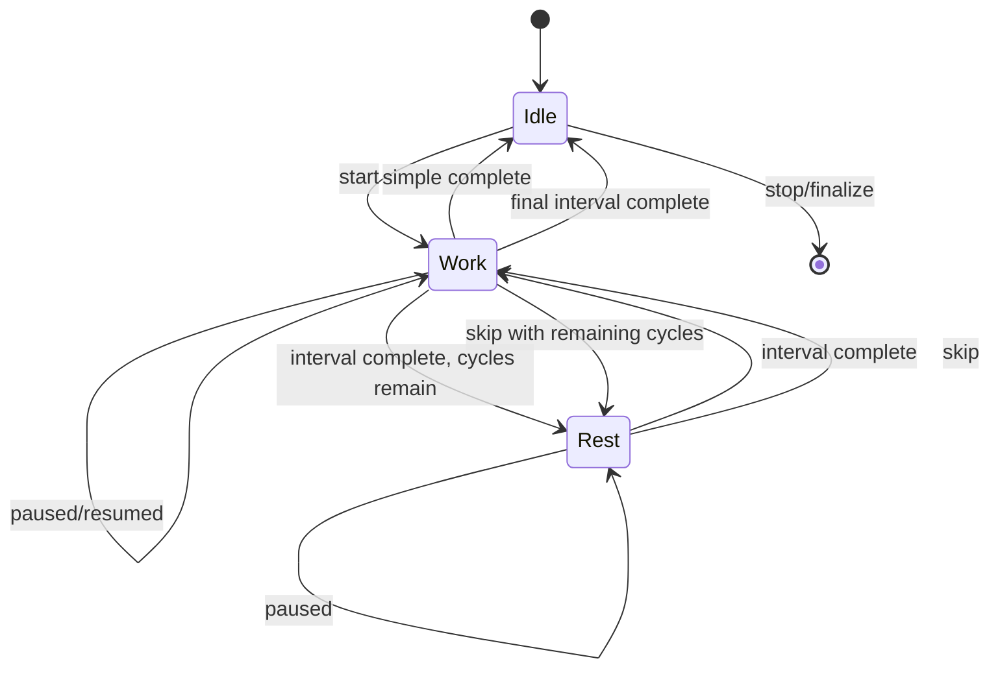
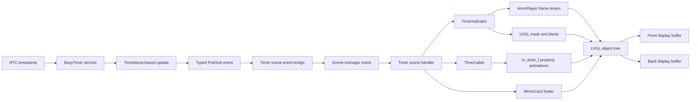
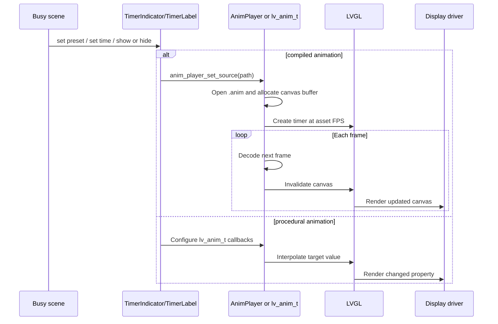
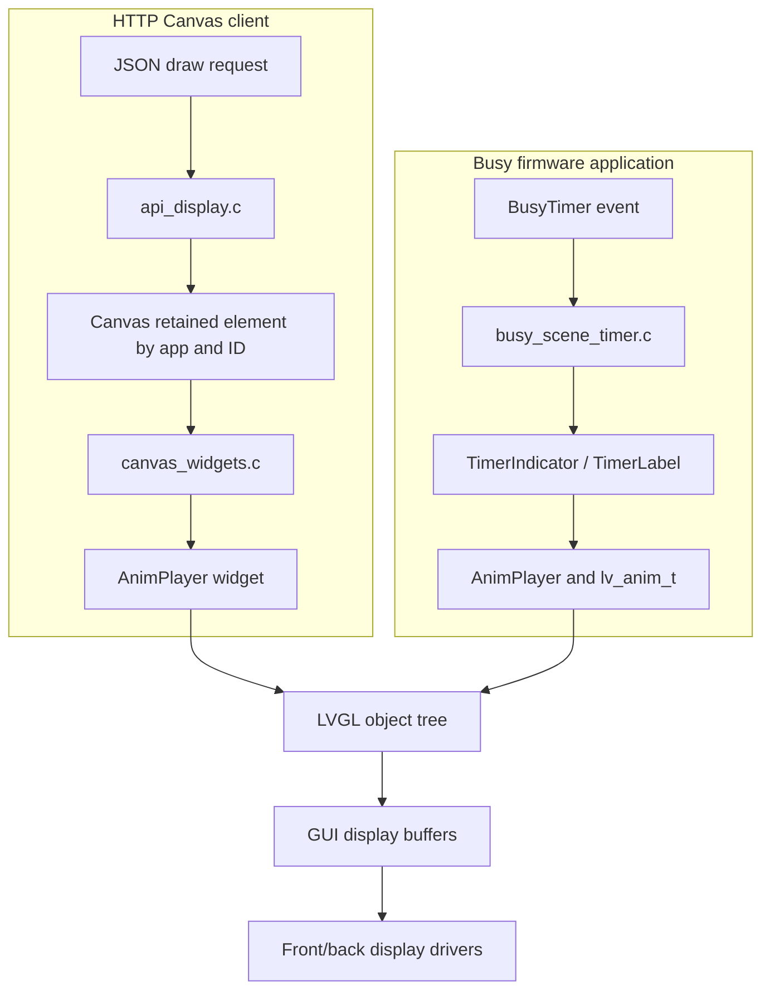

# BUSY Bar Pomodoro App: Technical Deep Dive

## Executive Summary

The BUSY Bar Pomodoro application is a native firmware application composed of two cooperating layers. `BusyTimer` is a long-lived service that owns timer state, profiles, snapshots, persistence, MQTT synchronization, and state transitions. `BusyApp` is the user-interface frontend. It owns scenes, input routing, display widgets, sound cues, transitions, display arbitration, and the mapping from timer events to visual state. The application is not an HTTP Canvas client. It creates LVGL widgets directly and controls them through C APIs while the firmware is running.

The most important architectural boundary is the separation between **time state** and **presentation state**. `BusyTimer` calculates elapsed and remaining seconds from the RTC timestamp and publishes typed events. The timer scene receives those events through a `FuriPubSub`, converts them into scene-manager events, and applies them to a native widget tree. The display is therefore driven by semantic events—tick, mode change, state change, pause, and interval end—not by remote draw requests or per-frame network traffic.

The visual timer is a composite rather than a single progress bar. `TimerIndicator` can contain an animated background `.anim` sequence, an animated progress `.anim` sequence whose offset is changed from the normalized timer progress, an image mask, and a static foreground image. `TimerLabel` uses LVGL labels and several `lv_anim_t` instances to fade, blink, slide, and recolor text. Scene transitions use additional `AnimPlayer` instances and LVGL property animations. This gives the application two distinct animation systems: device-side playback of compiled frame sequences and procedural interpolation of widget properties.

The native and HTTP paths eventually share LVGL rendering and the physical display pipeline, but they do not share ownership or lifecycle semantics. An HTTP draw enters the retained Canvas service and is reconciled by application name and element ID. The Busy app allocates widgets beneath its own front and back display containers, changes them synchronously under the GUI lock, and frees them when a scene exits. This distinction explains why a firmware app can coordinate several animation players, masks, labels, timers, transitions, and sound effects without issuing a sequence of HTTP layer updates.

## 1. Scope, Method, and Evidence

This report analyzes the firmware revision `4033f805b75bb70e51bfb155fcf9cf7a29b2b054` in `/home/manuel/code/others/busy-bar/busybar-firmware`. The focus is the native Busy application: its launch path, scene graph, timer service, interval state machine, event delivery, display composition, animations, settings, saved state, MQTT synchronization, and teardown behavior. The report also explains the exact relationship between native application widgets and the HTTP Canvas API because that distinction is the source of a common implementation error.

The central evidence is the source code under `applications/main/busy`, `applications/services/busy_timer`, `applications/services/gui/modules`, and `applications/services/canvas`. The repository README establishes the firmware repository structure: applications and services are built as part of the firmware, while assets are provisioned separately. The LVGL documentation was used only to clarify the semantics of `lv_anim_t` and `lv_canvas`; claims about the Busy application itself are grounded in the firmware source.

The report uses the following evidence rules:

- A behavior described as implemented is backed by a named source file and symbol.
- A behavior described as an inference is labeled as such and follows from the interaction of multiple source files.
- Asset names and dimensions are copied from the preset tables rather than inferred from screenshots.
- Network synchronization is included because it affects timer state ownership, but the MQTT broker and cloud protocols are not re-investigated here.
- The report distinguishes the `BusyTimer` service clock from LVGL animation timers. They have different periods, responsibilities, and correctness requirements.

### 1.1 Source revision and important paths

| Area | Path | Responsibility |
|---|---|---|
| Application entry | `applications/main/busy/busy.c` | Allocates `BusyApp`, creates containers, starts the scene manager, and tears down the app. |
| Application state | `applications/main/busy/busy_i.h` | Defines `BusyApp`, custom events, API messages, persistent widget ownership, and helper contracts. |
| Timer frontend | `applications/main/busy/scenes/busy_scene_timer.c` | Connects input and timer events to widgets and scene transitions. |
| Timer service | `applications/services/busy_timer/busy_timer.c` | Owns time calculations, timer state, events, snapshots, profiles, and synchronization. |
| Timer contract | `applications/services/busy_timer/busy_timer.h` | Defines public operations and typed event payloads. |
| Visual indicator | `applications/main/busy/widgets/timer_indicator.c` | Composes background animation, progress animation, mask, and foreground image. |
| Time label | `applications/main/busy/widgets/timer_label.c` | Formats countdown text and runs text, color, and gradient animations. |
| Frame playback | `applications/services/gui/modules/anim_player.c` | Decodes `.anim` files into an LVGL canvas on an LVGL timer. |
| Native Canvas adapter | `applications/services/canvas/canvas_widgets.c` | Creates `AnimPlayer` for HTTP Canvas animation elements. |

## 2. The Product Model: Three Timer Modes and Two Profiles

The application does not implement a single fixed twenty-five-minute loop. It exposes three timer modes through `BusyTimerMode`: `Infinite`, `Simple`, and `Interval`. The interval mode is the Pomodoro-oriented mode: it alternates work and rest periods for a configured number of cycles. Simple mode runs one work interval. Infinite mode represents an active work state without a finite countdown; adding time converts it to a simple timer.

The service also stores two profiles, named `busy` and `custom`. A profile contains metadata, timer settings, and application configuration. Application configuration includes the theme name, whether only the work phase should be shown on the front display, and whether smart-home triggers are enabled. The native UI uses the profile selected by the global preset. The default global preset selects the `busy` profile, while the custom preset selects the `custom` profile.

The core data model is deliberately explicit:

```c
typedef enum {
    BusyTimerModeInfinite,
    BusyTimerModeSimple,
    BusyTimerModeInterval,
    BusyTimerModeMax,
} BusyTimerMode;

typedef struct {
    uint32_t total_time_ms;
} BusyTimerSimpleConfig;

typedef struct {
    uint32_t work_time_ms;
    uint32_t rest_time_ms;
    uint32_t cycles_count;
    bool is_autostart_enabled;
} BusyTimerIntervalConfig;

typedef struct {
    BusyTimerMode mode;
    union {
        BusyTimerSimpleConfig simple;
        BusyTimerIntervalConfig interval;
    };
} BusyTimerConfig;
```

The default constants are defined in `busy_timer_common.h`:

| Setting | Default | Constraint |
|---|---:|---:|
| Simple duration | 20 minutes | Up to 24 hours. |
| Work duration | 20 minutes | 5 minutes to 8 hours. |
| Rest duration | 5 minutes | 5 minutes to 8 hours. |
| Interval cycles | 3 | 2 to 35 cycles. |
| Autostart | Disabled | Applies to interval transitions. |
| Demo mode | Disabled | Changes countdown decrement granularity for testing. |

The application name “Pomodoro” describes the interaction model, not a hard-coded algorithm. The user can configure work and rest durations, cycle count, and autostart behavior. A reimplementation that assumes exactly four work cycles of twenty-five minutes would not match the firmware contract.

### 2.1 Profile identity and configuration ownership

A profile has a stable card identifier, a title, a sort order, timer settings, application settings, and a timestamp. Profile updates are validated before acceptance. The service rejects invalid profiles and older timestamps, and it treats equal timestamps as its own or duplicate state. Accepted profiles are persisted and published over MQTT with one topic per profile.

The UI does not directly own the profile representation. The settings scenes call the `BusyTimer` API through `BusyApp`, and the timer service serializes profiles. This keeps the scene code focused on editing values and lets synchronization code use the same profile structure as local settings.

The profile serializer writes the timer mode as a string (`INFINITE`, `SIMPLE`, or `INTERVAL`) and includes mode-specific fields. It also includes `busy_bar_settings`, containing the theme and display behavior. A profile is therefore a configuration object that controls both the timer domain and the visual application.

### 2.2 Application configuration and visual selection

When the start scene handles the Start command, it retrieves a `BusyTimerPreset`, copies the application configuration into `BusyApp`, and chooses the next scene based on the timer mode. An interval profile enters the interval overview first; simple and infinite profiles enter the timer scene directly.

```c
BusyTimerPreset timer_preset;
busy_get_timer_preset(instance, &timer_preset);
busy_set_app_config(instance, &timer_preset.app_config);

if(timer_preset.timer_config.mode == BusyTimerModeInterval) {
    scene_manager_next_scene(instance->scene_manager, BusyAppSceneIdOverview);
} else {
    scene_manager_next_scene(instance->scene_manager, BusyAppSceneIdTimer);
}
```

This ordering matters. Theme selection and display policy are established before the timer scene creates its widgets. The timer scene can then apply the correct visual preset during `on_enter` and can determine whether its label behavior should use custom-theme rules.

## 3. Repository and Runtime Architecture

The firmware application is split across an executable frontend and a service. `busy.c` allocates `BusyApp`, opens records for the GUI, audio, loader, updater, front display, and BusyTimer service, then creates the scene manager. It also creates the persistent display containers that outlive individual scenes.

The front display receives a root application window beneath the main GUI layer. The back display receives a `FlexLayout` container with a navigation bar, a mirror card, and a back window. The scene-specific widgets are attached beneath these windows. This gives the application stable parents for scene-owned widgets and allows the app to preserve the back-display card and navigation structure while replacing the active front content.

```mermaid
flowchart TD
    Entry[busy_app(arg)] --> Allocate[busy_alloc]
    Allocate --> Records[Open BusyTimer, GUI, Audio, Loader, Updater, Displays]
    Allocate --> Containers[Create front_window and back_container]
    Containers --> Persistent[TransitionOverlay, NavBar, MirrorCard, back_window]
    Allocate --> SceneManager[SceneManager]
    SceneManager --> Start[Start scene]
    Start --> Overview[Interval overview]
    Start --> Timer[Timer scene]
    Overview --> Timer
    Timer --> Progress[Interval progress]
    Progress --> Next[Next interval]
    Next --> Timer
    Timer --> Finish[Simple/infinite finish]
    Timer --> Ending[Interval ending]
    Ending --> Finish
    Finish --> Start
    SceneManager --> Teardown[Scene exit callbacks]
    Teardown --> Free[busy_free]
```

The event loop is the application’s serialized control point. Input callbacks do not directly perform all scene work. The top-level input callback places Back events into a queue. The application event queue carries custom events into `scene_manager_handle_custom_event`. The timer scene’s PubSub callback records service data and sends a custom event; the scene manager then invokes the corresponding handler on the application event loop.

This separation prevents a timer service callback from manipulating LVGL widgets directly. Widget changes happen inside `with_gui(instance->gui, { ... })` blocks in scene handlers. The service publishes data; the UI consumes it.

### 3.1 Persistent versus scene-owned widgets

`BusyApp` owns these persistent objects:

- `front_window`, the parent for front-display scene widgets;
- `back_container`, the back-display layout;
- `back_window`, the parent for back-display scene widgets;
- `transition_overlay`, used across scenes;
- `timer_card`, used to mirror active timer information on the back display;
- `nav_bar`, used for navigation locations.

`BusySceneTimer` owns:

- `TimerIndicator`;
- `TimerLabel`;
- `PauseOverlay`;
- its PubSub subscription;
- its label show/hide event-loop timer.

The scene allocates those objects in `busy_scene_timer_on_enter` and frees them in `busy_scene_timer_on_exit`. The explicit ownership rule is important for animations. LVGL animations attached to deleted widgets are cleaned up as part of widget deletion, while `AnimPlayer` objects must be released through their owning widget lifecycle.

### 3.2 Application launch modes

The command-line argument can select normal mode or timer mode, and it can select the custom preset. Normal mode enters the start scene. Timer mode skips the menu and lets the system launch into the timer frontend. API requests can also request that the current timer scene be shown. If the application was launched by the timer, an exit request stops the app; otherwise it returns to the start scene.

This behavior means the same visual timer can be entered through several control paths, but all paths converge on the same timer scene and the same `BusyTimer` service. A new frontend should preserve that convergence rather than duplicating timer state.

## 4. BusyTimer: The Domain Service Behind the UI

The BusyTimer service owns correctness-sensitive time state. Its state is not advanced by LVGL animation frames and not advanced by the frequency of UI redraws. The service records an RTC timestamp, periodically polls for elapsed time, and converts the elapsed duration into one-second state updates.

The service defines three state values:

```c
typedef enum {
    BusyTimerStateIdle,
    BusyTimerStateWork,
    BusyTimerStateRest,
    BusyTimerStateMax,
} BusyTimerState;
```

A timer configuration chooses how the remaining duration is calculated. Infinite mode uses `UINT32_MAX`; simple mode uses `total_time_ms`; interval mode selects `work_time_ms` or `rest_time_ms` based on the current state. The timer service never derives correctness from frame count. It derives it from timestamps.

### 4.1 Polling period and timestamp correction

`BusyTimer` schedules a periodic poll timer at `S_TO_MS(1) / 30`, approximately 33.3 milliseconds. This does not mean the UI receives thirty ticks per second. `busy_timer_update` converts the difference between the current RTC timestamp and `prev_tick_timestamp_ms` into whole seconds. It publishes a tick only when at least one second has elapsed, and it preserves the millisecond remainder for the next update.

```c
const uint32_t dt_ms = timestamp_ms - instance->prev_tick_timestamp_ms;
const uint32_t dt_s = MS_TO_S(dt_ms);

if(dt_s == 0) {
    break;
}

for(uint32_t i = 0; i < dt_s; ++i) {
    const uint32_t inc_s = busy_timer_calc_increment(instance);
    ...
}

const uint32_t remainder_ms = dt_ms - S_TO_MS(dt_s);
instance->prev_tick_timestamp_ms = timestamp_ms - remainder_ms;
```

The update path handles a timestamp that moves backward by resetting the previous timestamp and publishing the current timer values. This matters when state is restored from a peer snapshot whose timestamp is ahead of the local clock.

The timer service can process multiple elapsed seconds in one poll. If the device was not scheduled for several seconds, it does not lose the interval transition; it loops through each elapsed second and invokes `busy_timer_next_state` when the remaining duration reaches zero.

### 4.2 State transition function

`busy_timer_calc_next_state` defines the state machine:

- Idle always transitions to Work.
- Work transitions to Rest if interval mode has remaining cycles.
- Work transitions to Idle for simple mode, infinite mode, or the final interval work period.
- Rest transitions to Work in interval mode.

`busy_timer_next_state` resets elapsed time, calculates the new remaining duration, checks autostart, and publishes either state/tick events or an interval-ended event. A non-autostart interval transition stops the timer and waits for user input. A forced transition from the Skip command starts the next interval even when autostart is disabled.



The diagram needs one qualification: pause is not a separate `BusyTimerState`. Pause is represented by `is_timer_running == false` while the logical state remains Work or Rest. The UI receives a separate `BusyTimerEventTypePaused` event. This preserves the semantic phase while allowing the timer to stop advancing.

### 4.3 Event contract

The service publishes typed events through a `FuriPubSub`:

| Event | Payload | UI responsibility |
|---|---|---|
| `Tick` | elapsed and remaining seconds | Update progress, labels, back-card footer, and countdown sounds. |
| `ModeChanged` | mode | Show/hide timer label and back-card footer. |
| `StateChanged` | Idle, Work, or Rest | Apply work/rest visual presets and display priority. |
| `IntervalEnded` | forced or natural | Select transition effect and next scene. |
| `Paused` | paused boolean | Show pause overlay and enable/disable running-state visual behavior. |
| `ProfileChanged` | profile ID and profile | Update synchronized profile state. |
| `SnapshotCreated` | snapshot | Persist and publish a state snapshot. |

The timer scene’s PubSub callback does not change widgets. It copies the event fields into scene data and enqueues a custom event. The scene manager later dispatches the event to `busy_scene_timer_on_event`. This is a two-stage handoff:

```text
BusyTimer event publication
        ↓
busy_scene_timer_pubsub_callback
        ↓
BusySceneTimer data fields + BusyCustomEvent
        ↓
application event queue
        ↓
busy_scene_timer_on_event
        ↓
with_gui(...) widget mutation
```

The event payload and scene data are intentionally separate. The PubSub callback needs only enough work to preserve the latest semantic state and wake the UI event loop. The widget update can then read a coherent scene-local snapshot.

### 4.4 Initial state notification

When a timer starts, resumes, or is restored from a snapshot, the service calls `busy_timer_notify_initial_state`. It emits mode, tick, state, and paused events in that order. This provides the timer scene with a complete initial state without requiring the scene to query every field independently.

The order is observable. The timer scene can first decide whether the label should exist, then update its text, then apply work/rest state presets, then apply pause behavior. The comment in `busy_scene_timer_handle_pause` documents a dependency on `BusyTimerEventTypePaused` being the last event emitted by `busy_timer_notify_initial_state`: a mode transition flag is reset there after restoration.

## 5. Scene Graph and User Journey

The Busy application uses the Flipper-style `SceneManager` pattern. Each scene has enter, exit, and event callbacks plus a scene-local data block. The scene table in `busy_scenes.c` registers start, setup, overview, timer, progress, next, ending, and finish scenes.

The timer is not the first screen for every configuration. The start scene reads the selected profile. Interval mode enters an overview that displays the configured work/rest durations and waits briefly before entering the live timer. Simple and infinite modes enter the timer directly.

### 5.1 Start scene

The start scene creates a front layout containing an animated logo and animated menu, plus a back-display menu. Both menu assets are native `AnimPlayer` or menu widgets. Selecting Start makes the navigation bar and timer card visible, prepares a selection transition, applies the profile’s application configuration, and routes to the appropriate scene.

The start scene sets display priority to inactive. This allows other display owners, including HTTP Canvas requests at an accepted priority, to render while no timer is running. Once the live timer is active, the timer scene raises the loader priority to block competing display work.

### 5.2 Interval overview

The overview scene allocates `overview_72x16.anim` as a front background animation and an `OverviewLabel`. It reads the interval configuration from the timer service rather than duplicating values. The scene schedules a `RunLater` callback for 2250 milliseconds. The callback prepares an automatic transition and enters the timer scene.

The user can press OK or Start to skip the delay. The scene still routes through the same transition and timer scene. On exit it cancels the `RunLater`, removes its input callback, and frees both widgets.

### 5.3 Live timer scene

The timer scene allocates its three primary widgets under the front window. It also attaches an input callback to the main GUI layer and subscribes to the BusyTimer event PubSub. The `TimerIndicator` and `TimerLabel` are not recreated for every tick. They are retained for the lifetime of the scene, and update functions change their data or asset composition in place.

The scene’s local data contains both domain values and presentation flags:

```c
typedef struct {
    TimerIndicator* timer_indicator;
    TimerLabel* timer_label;
    PauseOverlay* pause_overlay;
    FuriPubSub* timer_pubsub;
    FuriPubSubSubscription* timer_sub;
    FuriEventLoopTimer* show_label_timer;
    TimerIndicatorPreset custom_preset;
    BusyTimerMode timer_mode;
    BusyTimerMode prev_timer_mode;
    BusyTimerState timer_state;
    uint32_t time_elapsed_s;
    uint32_t time_remaining_s;
    bool is_custom_theme;
    bool is_paused;
    bool is_force_ended;
    bool is_mode_transition;
} BusySceneTimer;
```

This state is deliberately not a second timer model. `time_elapsed_s`, `time_remaining_s`, `timer_mode`, and `timer_state` mirror the service’s latest event values. The remaining booleans control presentation and routing decisions that belong to the UI.

### 5.4 Interval progress, next, ending, and finish scenes

When an interval ends, the timer scene selects the next scene based on timer mode and state. A non-final interval enters the progress scene. The progress scene displays completed and total cycles, creates a progress view, animates it vertically into position with `animate_pos_y`, and schedules the next scene after two seconds. The next scene shows the upcoming work/rest interval and can create an arrow animation.

The final interval enters the ending scene, which uses one-shot `.anim` sequences and frame callbacks. It then enters the finish scene, which can play confetti and show a summary. The timer service is finalized when the finish scene begins. The UI sequence therefore separates “the current interval ended” from “the complete interval run has been finalized.”

### 5.5 Input routing

The timer scene maps hardware keys to semantic custom events:

| Key | Action in live timer |
|---|---|
| Up | Add five minutes. |
| Down | Remove five minutes. |
| OK | Skip the current interval when interval mode is active and not paused. |
| Start | Toggle running/paused state. |
| Back | Stop the timer and return to the start scene or exit. |

The timer service receives the resulting API operations through its own message queue. The UI does not directly mutate service fields. This preserves the service’s serialization and synchronization rules.

## 6. Native Display Composition

The Busy app creates a widget tree, not a list of HTTP layers. The front root contains the app’s front window and persistent transition overlay. The back root contains a layout with navigation, a timer card, and a back window. Scene widgets attach beneath the appropriate window and are ordered by LVGL child order and explicit foreground moves when needed.

The front timer composition is approximately:

```text
GuiLayerIdMain
└── front root
    ├── BusyApp.front_window
    │   ├── TimerIndicator
    │   │   ├── background AnimPlayer
    │   │   ├── progress AnimPlayer
    │   │   ├── mask Image
    │   │   └── foreground Image
    │   ├── TimerLabel
    │   │   ├── gradient object
    │   │   ├── main label
    │   │   ├── seconds label
    │   │   └── bottom label
    │   └── PauseOverlay
    └── TransitionOverlay
```

The actual order includes the persistent transition overlay configured by `BusyApp`; the overlay can be shown above scene content. The timer indicator’s internal ordering is controlled by the `TimerIndicator` constructor and its child allocations. The mask uses multiply blending, allowing the progress animation to be clipped by the configured image shape. The foreground image supplies static details that should not be decoded on every frame.

### 6.1 TimerIndicator presets

The default work preset contains:

```c
.background_config.anim_path = BUSY_ANIM_PATH("particles_busy_41x16.anim");
.progress_config.anim_path = BUSY_ANIM_PATH("progress_busy_41x16.anim");
.progress_config.mask_path = BUSY_IMG_PATH("indicator_mask_41x16.image");
.progress_config.direction = TimerIndicatorProgressDirectionHorizontal;
.progress_config.start_offset_px = -38;
.progress_config.end_offset_px = 0;
.foreground_config.image_path = BUSY_IMG_PATH("indicator_busy_41x16.image");
```

The rest preset uses a different particle animation, a vertical progress animation, the same mask, and a rest foreground image:

```c
.background_config.anim_path = BUSY_ANIM_PATH("particles_rest_41x16.anim");
.progress_config.anim_path = BUSY_ANIM_PATH("progress_rest_41x22.anim");
.progress_config.direction = TimerIndicatorProgressDirectionVertical;
.progress_config.start_offset_px = -6;
.progress_config.end_offset_px = 16;
.foreground_config.image_path = BUSY_IMG_PATH("indicator_rest_41x16.image");
```

The work and rest indicators are therefore not generated by drawing a rectangle whose width is recomputed on each tick. They are asset compositions. The service supplies a normalized progress value; the widget converts it into an offset on the progress animation.

```c
const float delta = progress *
    (config->end_offset_px - config->start_offset_px);
const float offset = delta + config->start_offset_px;

if(config->direction == TimerIndicatorProgressDirectionHorizontal) {
    anim_player_set_offset(instance->progress_anim, offset, 0);
} else {
    anim_player_set_offset(instance->progress_anim, 0, offset);
}
```

The progress value is calculated by the timer scene:

```c
const float progress =
    (float)time_elapsed_s / (time_elapsed_s + time_remaining_s);
```

At a tick, the scene updates both the progress offset and the textual countdown. The animated texture continues to advance under its own LVGL timer; the service tick changes only its spatial position.

### 6.2 Theme substitution

A custom theme can replace the default indicator with either a static image or an animation. `busy_scene_timer_apply_theme` reads the theme metadata. If the theme background is an image, it fills `foreground_config.image_path`; if it is an animation, it fills `background_config.anim_path`.

The custom preset starts empty, so the theme contributes one composited asset rather than replacing the timer label or all default indicator parts. `busy_scene_timer_has_label_tweaks` identifies a custom theme during the Work state. That flag controls whether the timer label uses delayed show/hide behavior and a background gradient.

This is a useful extension point: visual customization is represented as a preset transformation, not as a separate rendering engine. The timer scene remains responsible for deciding when to apply it.

## 7. Animation Systems in the Firmware App

The Busy app uses two different animation mechanisms, and confusing them produces incorrect reimplementations.

### 7.1 AnimPlayer: compiled frame sequences

`AnimPlayer` is a native GUI module. `anim_player_set_source` opens an `.anim` file through the storage record, queries its dimensions and frame rate, allocates an output buffer, assigns that buffer to an LVGL canvas, sets a default looping section, computes the LVGL timer period as `1000 / fps`, and starts playback.

The frame timer callback performs the per-frame work:

```c
static void anim_player_timer_cb(lv_timer_t* timer) {
    AnimPlayer* instance = lv_timer_get_user_data(timer);
    AnimFileFrameInfo info = anim_file_frame(instance->file);
    lv_obj_invalidate(instance->canvas);

    if(info.flags & AnimFileFrameFlagFinished) {
        lv_timer_pause(instance->timer);
    }

    if(instance->frame_cb) {
        instance->frame_cb(instance, &info, instance->frame_cb_context);
    }
}
```

The `.anim` decoder writes into the player’s ARGB8888 canvas buffer. LVGL then composites the canvas as a child object. The application does not allocate or transmit a new network payload per frame. It calls `anim_player_set_source`, `anim_player_set_section`, `anim_player_set_offset`, `anim_player_start`, or `anim_player_pause` as state changes.

`set_source` automatically starts playback. This is why many Busy widgets only call `anim_player_set_source` and do not call `anim_player_start` for continuously looping assets. One-shot transitions explicitly set a non-looping section and use a frame callback to continue the transition after completion.

### 7.2 `lv_anim_t`: interpolated properties

LVGL’s `lv_anim_t` system varies an integer from a start value to an end value over a duration and invokes an execution callback. The Busy application uses it for properties that are better represented as numbers than as frame assets:

- widget x/y position;
- widget opacity;
- label color transitions;
- gradient position;
- countdown blinking.

`animate.c` provides application-specific wrappers. `animate_pos_x` and `animate_pos_y` configure a cubic Bézier path and an execution callback that calls `widget_set_pos_x` or `widget_set_pos_y`. The progress scene uses `animate_pos_y` to slide the progress view into place. The timer scene uses `animate_pos_x` when a timer mode transition changes the label position.

`TimerLabel` configures several direct LVGL animations. It animates an opacity-like value from transparent to cover for the countdown color transition, uses reverse duration for blinking, moves its gradient object horizontally, and changes the opacity of the main label after a delay.

These animations are not `.anim` assets. They are generated at runtime by the LVGL animation manager. The app supplies a target variable and callback; LVGL schedules the interpolation.

### 7.3 Comparison

| Property | `AnimPlayer` | `lv_anim_t` |
|---|---|---|
| Input | Compiled `.anim` file | Numeric start/end values and callbacks |
| Frame source | Decoder reads stored frames | LVGL computes values over time |
| Typical use | Particles, logos, confetti, masks, transitions | Position, opacity, color, gradient, blink |
| Clock | Per-player LVGL timer at asset FPS | LVGL animation manager |
| Application callback | Optional frame callback | Execution/completion/deletion callbacks |
| Memory | Decoder state, output canvas, asset access | Animation state and callback metadata |
| HTTP equivalent | Canvas `type: animation` creates `AnimPlayer` | Not exposed as a generic HTTP Canvas property animation |
| Ownership | Native widget or Canvas widget | Target widget and LVGL animation lifecycle |

The HTTP Canvas animation element corresponds only to the first row of the native application’s animation mechanisms. It can create an `AnimPlayer`, but it does not express the timer label’s custom LVGL callbacks or the application’s coordinated mode-transition logic.

## 8. TimerIndicator in Detail

`TimerIndicator` is a custom LVGL class derived from the firmware’s `Widget` base. Its structure contains pointers to optional subwidgets and a pointer to the active preset. The object can be reset and rebuilt when a timer state or theme changes.

`timer_indicator_set_preset` stores the new preset. If a transition is supplied, it resets existing children and creates a one-shot background `AnimPlayer`; otherwise it applies the preset immediately. Applying a preset resets all existing children, creates the configured background and progress players, creates the mask image, creates the foreground image, and sets progress to zero.

This reset-and-rebuild strategy is appropriate because work and rest presets can differ in asset dimensions, direction, and composition. Retaining the widget object while replacing its children gives the scene stable ownership without forcing the indicator to implement every asset mutation in place.

### 8.1 Transition handoff

For an infinite-to-simple transition, `busy_scene_timer_get_indicator_transition` returns `indicator_busy_transition_72x16.anim`. `timer_indicator_start_transition` creates a temporary background animation and registers `timer_indicator_bg_anim_frame_callback`. When the `AnimPlayer` signals `AnimFileFrameFlagFinished`, the callback removes itself and calls `timer_indicator_apply_preset` to install the steady-state preset.

The state sequence is:

```text
Current infinite indicator
        ↓
timer_indicator_set_preset(new preset, transition)
        ↓
reset old children
        ↓
create one-shot transition AnimPlayer
        ↓
frame callback sees Finished
        ↓
apply steady-state preset
        ↓
create background/progress/mask/foreground children
        ↓
set progress to zero
```

The timer service is not blocked while this plays. It continues to own the timer state and publish ticks. The UI transition is an independent visual phase.

### 8.2 Pausing

`timer_indicator_enable_animations` currently has an empty implementation and marks its argument unused. This is an important source-backed detail. The timer scene calls it when a pause event arrives, but the indicator does not currently pause its `AnimPlayer` instances through this function.

The pause behavior that is visibly implemented is handled by `PauseOverlay`, label logic, and timer service state. A reimplementation should not claim that all indicator particle animations stop on pause unless the missing implementation is changed or device behavior is verified. The current source shows an intended API whose operational behavior is not implemented.

This is one of the report’s concrete areas for review: the public method’s documentation says it should “play animations if `true`, stop them otherwise,” while the implementation does nothing. That mismatch may be deliberate because the visual design keeps background motion running, or it may be unfinished code.

## 9. TimerLabel in Detail

`TimerLabel` is a custom widget that owns multiple LVGL labels and a gradient object. It loads three fonts from the firmware font registry: a regular font, a condensed font, and a small superscript-style font. It formats hours and minutes in the main label and seconds in the seconds label when an hour is present.

The update algorithm is direct:

```c
if(hours > 0) {
    if(hours >= 10) {
        main_label_font = font_condensed;
    }
    main_label = "%lu:%02lu";
    seconds_label = "%02lu";
    show(seconds_label);
} else {
    main_label = "%02lu:%02lu";
    hide(seconds_label);
}
```

The current timer value is not animated by rolling digits. Text is replaced on each service tick, normally once per second. Animation is reserved for special countdown and custom-theme behavior.

### 9.1 Countdown threshold behavior

When the remaining time reaches `COUNTDOWN_START_S`, the label calls `timer_label_to_countdown`, which starts an LVGL opacity animation and uses a callback to change the text colors toward the configured countdown color. When the remaining time is below `BLINK_START_S`, it starts an animation with a forward and reverse duration to blink the countdown colors. For ordinary values, it restores white text.

This arrangement separates semantic threshold detection from frame-level visual interpolation:

```text
BusyTimer tick: time_remaining_s
        ↓
TimerLabel::set_time
        ├── format labels
        ├── select fonts
        ├── if threshold: start color animation
        ├── if blink range: start reverse animation
        └── otherwise: restore white
```

A subtle lifecycle issue follows from this design: each call in the blink range starts an LVGL animation template. LVGL replaces or coalesces animations according to the target and execution callback rules. The source does not keep an explicit running-animation handle. This relies on LVGL’s animation identity behavior and widget teardown cleanup.

### 9.2 Custom-theme label reveal

For a custom theme during Work, the timer scene enables the label background and initially hides the label. A one-shot event-loop timer alternates between five seconds shown and fifteen seconds hidden. `timer_label_show` and `timer_label_hide` can either apply the state immediately or animate it.

The animated show/hide path runs two `lv_anim_t` instances:

- one moves the background gradient from the right edge to x=0 or back to `MAIN_WIDTH_PX`;
- one changes the main layout opacity, with a delay that differs between showing and hiding.

The show/hide timer is a Furi event-loop timer, not an LVGL animation timer. It decides when a transition should begin; the LVGL animations decide how the transition progresses.

## 10. Scene Transitions and One-Shot Effects

The application uses `TransitionOverlay` for scene changes. Presets define color or animation masks, blend modes, and in/out timings. The animation assets include automatic oval transitions, skip transitions, select transitions, work/rest transitions, completion flashes, and ending flashes.

The transition sequence is explicitly split into preparation and playback:

```c
busy_prepare_transition(instance, BusyTransitionTypeWorkDone);
scene_manager_next_scene(instance->scene_manager, next_scene_id);
busy_start_transition(instance);
```

`busy_prepare_transition` configures and shows the overlay. The destination scene creates its widgets while the overlay is visible. `busy_start_transition` starts playback after the scene transition has been requested. The timer scene also has a special `busy_scene_timer_clear_transition` path for pause restoration: it hides the overlay, waits 100 milliseconds for the GUI to redraw, and then shows the pause overlay.

This ordering avoids exposing an intermediate widget tree during a transition. It also means scene entry must create all required widgets before the transition is allowed to reveal them.

### 10.1 Interval completion routing

When the timer service emits `IntervalEnded`, the timer scene chooses a transition type:

- forced skip: `BusyTransitionTypeSkip`;
- natural rest completion: `BusyTransitionTypeRestDone`;
- natural work completion: `BusyTransitionTypeWorkDone`.

It then chooses the next scene:

- interval mode with non-idle state: progress scene;
- interval mode with idle state: ending scene;
- simple or infinite mode: finish scene.

The UI does not infer whether a work period is final by inspecting timestamps. The timer service has already advanced its state and the timer scene uses the resulting mode/state values.

### 10.2 Finish and ending animations

The ending scene uses frame callbacks to coordinate a sequence such as `ending_progress_72x16.anim` followed by `ending_particles_72x16.anim`. The callback is invoked by `AnimPlayer` in the GUI thread with the GUI locked, which permits the scene’s animation handoff to remain within the GUI ownership rules.

The finish scene uses `finished_confetti_72x16.anim`. It can also configure prompt overlays and back-display content. These sequences are native asset playback. They are not built from HTTP draw calls and do not depend on the Canvas service’s retained element IDs.

## 11. Timer State, UI State, and Display Ownership

The Busy application has three separate notions of state:

1. **Timer domain state**, owned by `BusyTimer`: mode, phase, elapsed seconds, remaining seconds, interval index, running/paused status, profile, and snapshot.
2. **Scene presentation state**, owned by `BusySceneTimer`: previous mode, custom-theme flag, forced-end flag, mode-transition flag, and widget pointers.
3. **Display ownership state**, controlled by loader priority and front-display blanking: whether the Busy app should prevent competing applications from drawing and whether the front display should be hidden during rest, pause, or transitions.

These states interact but are not interchangeable. A timer can be in Work while paused. A scene can be showing a transition while the service has already entered the next phase. A display can be blanked while the timer state remains active.

### 11.1 Loader priority

The timer scene calls `busy_scene_timer_update_priority` whenever the timer state changes or pause handling completes. It considers the timer active when the logical state is not Idle, not when the timer is currently running:

```c
bool is_active = data->timer_state != BusyTimerStateIdle;
busy_set_priority(instance, is_active);
```

The `busy_set_priority` implementation maps active state to `LOADER_BLOCKING_PRIORITY` and inactive state to `LOADER_PASSTHROUGH_PRIORITY`. This gives the native timer app display ownership while a work/rest run remains logically active, including paused periods.

The `busy_i.h` comment documents the relationship to HTTP Canvas priority: inactive state permits ordinary Canvas draws, while active state causes valid HTTP draws to be rejected. This is not a Canvas layer relationship. It is an application-level arbitration policy.

### 11.2 Front-display blanking

The app can be configured to show only the Work phase on the front display. `busy_scene_timer_update_front_display_blanking` blanks the front display when the timer is not in Work or when it is paused. The final blanking decision also checks `is_show_work_only_enabled` from the app configuration.

This policy is separate from widget visibility. The timer widgets may continue to exist and update while the physical front display is blanked. The back display and timer service can continue to reflect state.

## 12. Persistence, Snapshots, and MQTT Synchronization

The timer service persists timer state through snapshots. A snapshot records its timestamp, type, paused status, card ID, timer-specific remaining values, interval configuration, and application configuration. The service stores the latest snapshot locally and publishes it on `busy/snapshot` after debounce.

Profiles are synchronized separately on `busy/profiles/busy` and `busy/profiles/custom`. The service subscribes to these topics at allocation time and applies newer valid messages. It rejects snapshots with timestamps older than or equal to the last known snapshot, preventing stale or self-originated state from replacing current state.

The UI does not serialize snapshots. It calls `busy_timer_start`, `busy_timer_stop`, `busy_timer_toggle`, `busy_timer_skip`, and profile accessors. This allows a remote snapshot to update the same `BusyTimer` object that the UI reads. When a newer snapshot is applied, the service sets timer mode/state, remaining values, profile data, and timestamps, starts or stops the timer as required, starts the app configuration, and emits initial state events.

### 12.1 Why the UI receives a complete initial state

Restoration can happen before the timer scene exists. The service loads saved state during service allocation and applies it. When the Busy app enters the timer scene, the service may already be running or paused. `busy_timer_start` on scene entry either starts a fresh profile or resumes the existing logical state. In both cases, `busy_timer_notify_initial_state` supplies the UI with a complete event sequence.

This is the lifecycle contract a reimplementation must preserve:

```text
restore snapshot
    ↓
set service domain state
    ↓
start Busy app if needed
    ↓
enter timer scene
    ↓
subscribe to PubSub
    ↓
receive initial mode/tick/state/paused events
    ↓
construct fully initialized presentation
```

A UI that reads fields once without subscribing can miss a state transition or display a default visual preset after a restore.

## 13. Complete Interaction Traces

### 13.1 Starting an interval timer

1. The start scene receives a Start menu selection.
2. It retrieves the selected `BusyTimerPreset` from the service.
3. It copies `app_config` into `BusyApp`, loading the theme and display policy.
4. It checks `timer_config.mode` and enters the interval overview.
5. The overview reads work duration, rest duration, and cycle count from the preset.
6. The overview allocates its background `AnimPlayer` and label.
7. After 2250 milliseconds, or after the user presses OK/Start, it enters the timer scene.
8. The timer scene allocates `TimerIndicator`, `TimerLabel`, and `PauseOverlay`.
9. It subscribes to the service PubSub.
10. It calls `busy_timer_start`.
11. The service transitions Idle to Work, initializes remaining time, and publishes mode, tick, state, and paused events.
12. The scene applies the work preset and updates the progress/label.
13. The scene raises loader priority and applies front-display blanking policy.
14. LVGL renders the widget tree while the BusyTimer continues timestamp-based updates.

### 13.2 One timer tick

```text
RTC timestamp changes
    ↓
BusyTimer poll callback, approximately every 33 ms
    ↓
busy_timer_update calculates whole elapsed seconds
    ↓
BusyTimer publishes Tick once per elapsed second
    ↓
busy_scene_timer_pubsub_callback copies values and queues event
    ↓
scene manager dispatches BusyCustomEventTimerTick
    ↓
busy_scene_timer_update_tick
    ├── TimerIndicator progress offset changes
    ├── TimerLabel text changes
    ├── back card footer changes
    └── countdown sound may play
    ↓
LVGL invalidates and redraws changed objects
```

The animated background and progress textures may also advance several frames between semantic timer ticks. Those frames are driven by each `AnimPlayer`’s FPS timer, independently of the one-second service event.

### 13.3 Pause and resume

1. The user presses Start.
2. The timer scene sends a toggle request to `BusyTimer`.
3. The service stops or starts its poll timer and publishes `Paused`.
4. The timer scene shows or hides `PauseOverlay`.
5. The scene changes the timer label behavior and front-display blanking.
6. Loader priority remains blocking while the logical state is Work or Rest.
7. `timer_indicator_enable_animations` is called, but the current implementation does not pause or resume the indicator players.

That final step is a deliberate source-level caveat. The UI calls an animation-control API, but the method is currently a no-op.

### 13.4 Natural interval completion

1. `busy_timer_update` decrements remaining seconds to zero.
2. `busy_timer_next_state` advances Work to Rest or Rest to Work, depending on cycle count.
3. If autostart is disabled, the service stops its poll timer and publishes `IntervalEnded`.
4. The timer scene chooses a WorkDone or RestDone transition.
5. The timer scene blanks the front display while entering the next scene.
6. For a non-final interval, the progress scene shows completed cycles and schedules the next scene.
7. The next scene chooses the next visual preset and enters the timer scene.
8. For the final interval, the scene graph routes through Ending and Finish.

## 14. Architecture Diagrams

### 14.1 Domain-to-rendering pipeline



### 14.2 Native animation lifecycle



### 14.3 HTTP Canvas versus native Busy app



The shared node is LVGL rendering, not shared application ownership. The HTTP Canvas service retains elements by ID; the Busy app retains pointers and frees them on scene exit.

## 15. Reimplementation Sketches

The following sketches describe the minimum contracts for implementing a similar native frontend. They are teaching sketches, not drop-in firmware code.

### 15.1 Service-facing UI controller

```c
typedef struct {
    BusyTimer* timer;
    FuriPubSubSubscription* subscription;
    TimerIndicator* indicator;
    TimerLabel* label;
    PauseOverlay* pause_overlay;
    BusyTimerMode mode;
    BusyTimerState state;
    uint32_t elapsed_s;
    uint32_t remaining_s;
    bool paused;
} TimerScreen;

static void on_busy_timer_event(const void* message, void* context) {
    const BusyTimerEvent* event = message;
    TimerScreen* screen = context;

    switch(event->type) {
    case BusyTimerEventTypeTick:
        screen->elapsed_s = event->tick.time_elapsed_s;
        screen->remaining_s = event->tick.time_remaining_s;
        busy_send_custom_event(app, BusyCustomEventTimerTick);
        break;
    case BusyTimerEventTypeStateChanged:
        screen->state = event->state_changed.state;
        busy_send_custom_event(app, BusyCustomEventTimerStateChanged);
        break;
    case BusyTimerEventTypePaused:
        screen->paused = event->paused.is_paused;
        busy_send_custom_event(app, BusyCustomEventTimerPaused);
        break;
    default:
        break;
    }
}
```

The key rule is that the PubSub callback records service data and schedules UI work. It does not call LVGL setters directly.

### 15.2 Progress mapping

```c
static void apply_tick(TimerScreen* screen) {
    const uint32_t total = screen->elapsed_s + screen->remaining_s;
    const float progress = total == 0
        ? 0.0f
        : (float)screen->elapsed_s / (float)total;

    timer_indicator_set_progress(screen->indicator, progress);
    timer_label_set_time(screen->label, screen->remaining_s);
}
```

The total is derived from the current elapsed and remaining values. For interval mode, the service resets elapsed time at every phase transition, so the indicator represents progress through the current work or rest interval rather than progress through the entire multi-cycle run.

### 15.3 Native animated indicator

```c
static void apply_indicator(TimerIndicator* indicator,
                            const TimerIndicatorPreset* preset) {
    timer_indicator_set_preset(indicator, preset, NULL);
}

static void apply_transition(TimerIndicator* indicator,
                             const TimerIndicatorPreset* next,
                             const TimerIndicatorTransition* transition) {
    timer_indicator_set_preset(indicator, next, transition);
}
```

A preset should describe asset composition, not draw commands. The indicator can create only the configured children, allowing themes to omit background, progress, mask, or foreground components.

### 15.4 Procedural label transition

```c
static void animate_widget_x(Widget* target,
                             int32_t from,
                             int32_t to,
                             uint32_t duration_ms) {
    lv_anim_t anim;
    lv_anim_init(&anim);
    lv_anim_set_var(&anim, target);
    lv_anim_set_values(&anim, from, to);
    lv_anim_set_duration(&anim, duration_ms);
    lv_anim_set_path_cb(&anim, lv_anim_path_ease_in_out);
    lv_anim_set_exec_cb(&anim, set_widget_x_callback);
    lv_anim_start(&anim);
}
```

This is the correct mechanism for changing a widget property smoothly. It is not necessary to generate a `.anim` file for every positional or opacity transition.

### 15.5 Native scene lifecycle

```c
static void timer_scene_enter(void* context) {
    App* app = context;
    TimerScene* data = scene_data(app);

    with_gui(app->gui, {
        data->indicator = timer_indicator_alloc(app->front_window);
        data->label = timer_label_alloc(app->front_window);
        data->pause_overlay = pause_overlay_alloc(app->front_window);
    });

    data->subscription = furi_pubsub_subscribe(
        busy_timer_get_pubsub(app->timer), on_timer_event, app);

    busy_timer_start(app->timer, selected_profile);
}

static void timer_scene_exit(void* context) {
    App* app = context;
    TimerScene* data = scene_data(app);

    furi_pubsub_unsubscribe(data->timer_pubsub, data->subscription);

    with_gui(app->gui, {
        timer_indicator_free(data->indicator);
        timer_label_free(data->label);
        pause_overlay_free(data->pause_overlay);
    });
}
```

The subscription must be removed before freeing widgets. The scene should not leave a service callback capable of enqueueing events for a scene that no longer owns its widgets.

## 16. Design Decisions and Alternatives

### Decision 1: Keep `BusyTimer` independent of UI rendering

**Context.** Timer correctness must survive UI transitions, app launch modes, pause, restoration, and remote snapshots.

**Options.** Compute time inside the timer scene; compute time inside an LVGL animation; use a dedicated service.

**Decision.** Use `BusyTimer` as a service with RTC-based updates and typed events.

**Rationale.** The service can persist and synchronize state without depending on whether the timer scene exists. The UI can be destroyed and recreated while the domain state remains authoritative.

**Consequence.** The UI must bridge PubSub events into scene-manager events and must not treat animation frames as timer ticks.

**Status.** Accepted.

### Decision 2: Use compiled `.anim` assets for high-cost visual sequences

**Context.** The device needs particles, masks, logos, and completion effects at stable frame rates.

**Options.** Generate every pixel procedurally in C; use HTTP Canvas updates; decode compiled frame assets through `AnimPlayer`.

**Decision.** Use `.anim` files with `AnimPlayer` for authored frame sequences.

**Rationale.** Assets can be authored and provisioned separately from application logic. The player manages frame timing and canvas invalidation locally.

**Consequence.** Each player owns decoder state and an output buffer. Asset dimensions and frame rates become runtime resource constraints.

**Status.** Accepted.

### Decision 3: Use `lv_anim_t` for scalar widget changes

**Context.** Position, opacity, gradient location, and color need smooth transitions but do not require authored frame data.

**Options.** Create a frame asset for every transition; set properties immediately; use LVGL’s generic animation manager.

**Decision.** Use `lv_anim_t` with application callbacks.

**Rationale.** The callbacks map directly to widget property setters, and Bézier paths express the desired easing without additional assets.

**Consequence.** Animation lifecycle depends on LVGL target and callback identity. Widget teardown must remain correct.

**Status.** Accepted.

### Decision 4: Keep the timer indicator as a composite widget

**Context.** Work and rest indicators contain different assets and progress directions, while custom themes may provide only one background asset.

**Options.** Render the complete indicator into one bitmap; expose each layer to the HTTP Canvas; use a custom widget with optional child components.

**Decision.** Use a custom `TimerIndicator` with optional `AnimPlayer` and `Image` children.

**Rationale.** The widget can rebuild its composition from a preset, apply masks and blend modes, and retain a stable API for the scene.

**Consequence.** Replacing a preset resets and reallocates child widgets. The reset path must remain GUI-thread safe.

**Status.** Accepted.

### Decision 5: Use scene-local lifecycle for visual ownership

**Context.** Different scenes require different assets and input callbacks.

**Options.** Keep every widget allocated for the application lifetime; allocate and free widgets in each scene; use a retained Canvas-like global store.

**Decision.** Allocate scene-specific widgets in `on_enter` and free them in `on_exit`.

**Rationale.** Scene transitions can replace the entire visual composition without retaining stale objects or input callbacks.

**Consequence.** Transition overlays must be coordinated with scene allocation, and callbacks must be removed before freeing widgets.

**Status.** Accepted.

## 17. Native App versus HTTP Canvas

The answer to “does the Pomodoro app animate like layers sent over HTTP?” is precise:

| Question | Answer |
|---|---|
| Does the Pomodoro app call `/api/display/draw`? | No. |
| Does it upload `.anim` files at runtime? | No. It references firmware-provisioned assets. |
| Does it create retained Canvas elements by application name and ID? | No. It allocates native widgets beneath its own containers. |
| Does it use the same `AnimPlayer` implementation as HTTP animation elements? | Yes. Both paths eventually create `AnimPlayer` widgets. |
| Does the HTTP Canvas API expose the timer’s `lv_anim_t` callbacks? | No. Those procedural animations are application-specific. |
| Does the native app render through LVGL? | Yes. |
| Does the native app send every frame over a network? | No. Frames are decoded locally. |
| Does the native app share display priority arbitration with HTTP Canvas? | Yes at the loader/display ownership level, but not through Canvas element state. |

The native path is therefore a direct call path:

```text
Busy scene C code
  → custom widget API
  → AnimPlayer / lv_anim_t
  → LVGL object tree
  → display buffers
  → front/back display drivers
```

The HTTP path is an adapter path:

```text
HTTP JSON
  → HTTP API parser
  → Canvas retained element
  → canvas_widgets.c
  → AnimPlayer / Image / Label / Countdown / Rectangle
  → LVGL object tree
  → display buffers
```

The rendering backend is shared, but the state model is not. The Busy app has semantic domain events, scene transitions, profile state, and explicit widget ownership. HTTP Canvas has application/priority/element reconciliation and request-level lifecycle.

## 18. Performance and Resource Implications

The application’s visual design is constrained by a 72-by-16-class display, but it still composes several objects and animation buffers. Each `AnimPlayer` may allocate an ARGB8888 output buffer sized to the selected viewport. A 41-by-16 buffer at four bytes per pixel is approximately 2.6 KiB before allocator overhead, and a 72-by-16 buffer is approximately 4.5 KiB. Multiple players, LVGL object metadata, decoder state, image assets, and display buffers contribute to peak memory.

The `TimerIndicator` avoids rendering every visual component into one full-size frame by separating animated and static elements. The progress animation can be offset rather than regenerated. The mask and foreground image are reused between timer ticks. This reduces application-level work while preserving compositing flexibility.

The `AnimPlayer` timer period is based on asset FPS, while `BusyTimer` polls at approximately 30 Hz and publishes semantic ticks once per second. This gives the visual layer a stable frame cadence without forcing timer correctness to depend on the display cadence.

Potential performance risks include:

- a custom theme using a large or high-FPS animation;
- several scene transition players alive during scene handoff;
- repeated preset resets while profile or state events arrive close together;
- decoding frame data into ARGB8888 buffers on a small MCU;
- running LVGL property animations while multiple `AnimPlayer` timers are active;
- allocating and freeing child widgets during rapid state transitions.

The source does not include a memory budget for the Busy app in the inspected files. A firmware change that adds new animation layers should measure peak heap usage on the target rather than extrapolating from file size alone.

## 19. Reliability and Correctness Risks

### 19.1 The `TimerIndicator` animation-control mismatch

The public `timer_indicator_enable_animations` declaration describes enabling and disabling animation playback. The implementation ignores its parameter. This is the clearest source-level correctness gap in the timer UI. The pause scene calls the method, so the API appears to be part of the intended pause contract, but the current behavior does not establish that `AnimPlayer` timers stop.

A fix would need to decide whether pause should stop all indicator players, only the progress animation, or no visual playback. It would also need to define resume behavior and whether a paused frame should be preserved. The report does not recommend a behavior without product intent.

### 19.2 Transition and widget teardown ordering

The application uses one-shot `AnimPlayer` callbacks to hand off from transition assets to steady-state presets. The callback runs in the GUI thread, which is the correct ownership context, but the scene can also exit due to input or remote control. A second pair of eyes should verify that all transition callbacks are cleared or that widget deletion reliably prevents callbacks from accessing freed contexts.

### 19.3 Semantic tick coalescing

The PubSub callback stores the latest tick values in scene data and queues a custom event. If several events are queued before the event loop handles them, the handler can read the newest values rather than a historical sequence. This is correct for a countdown display, because the UI needs the current time rather than every intermediate second. It would be incorrect for a UI animation that needed to process every state transition. Interval-ending events are separate and must not be coalesced away.

### 19.4 Remote snapshot races

Snapshots are accepted by timestamp. The service resets `prev_tick_timestamp_ms` to the snapshot timestamp after applying a snapshot, then resumes local progression if the snapshot is not paused. Clock skew and future timestamps are handled, but exact behavior depends on RTC synchronization. A distributed timer audit should test snapshots arriving during an interval transition, during pause, and while the UI is changing scenes.

### 19.5 Visual state after restore

The service emits an initial state sequence after applying a snapshot. The timer scene relies on that sequence to apply mode, tick, state, and pause presentation. A regression that changes event order can produce a timer label with the wrong visibility, a work preset during rest, or an overlay that appears over stale transition content. The event order should be treated as a contract and tested.

## 20. Testing and Validation Strategy

A complete validation plan needs both domain tests and GUI/device tests.

### 20.1 Domain tests

Test `BusyTimer` independently of the UI:

- Idle → Work on start for all modes.
- Work → Idle for simple completion.
- Work → Rest and Rest → Work for interval mode.
- Final Work → Idle after the configured cycle count.
- Skip with autostart disabled.
- Pause and resume without changing logical phase.
- Add and subtract time with rounding behavior.
- Multiple elapsed seconds handled in one poll.
- RTC timestamp moving backward.
- Snapshot restoration for infinite, simple, interval, paused, and not-started states.
- Older and equal timestamp snapshots rejected.
- Invalid profile values rejected.

### 20.2 UI tests

For the timer scene:

- entering simple mode creates the indicator and label;
- entering interval mode passes through overview when expected;
- Work applies the work preset;
- Rest applies the rest preset;
- progress mapping reaches the configured start and end offsets;
- hour formatting switches fonts and seconds visibility;
- countdown threshold changes colors and blink behavior;
- custom theme label show/hide timer alternates correctly;
- pause overlay appears and front blanking policy is applied;
- interval ended selects the correct transition and next scene;
- scene exit removes the PubSub subscription and frees widgets.

### 20.3 Animation tests

For `AnimPlayer`:

- missing source displays the built-in error image;
- source dimensions resize the canvas buffer;
- default source playback loops;
- explicit non-looping section invokes the finished callback;
- pause/resume preserves expected frame behavior;
- offset changes move the decoded animation within the viewport;
- frame callbacks execute under the GUI ownership assumptions.

For `lv_anim_t`:

- position transitions reach their end values;
- label show/hide opacity starts after the configured delay;
- countdown blink reverses with the expected durations;
- widget deletion cancels associated animations without callbacks using freed state.

### 20.4 Device validation trace

A practical device test should record:

```text
profile selected
scene entered
BusyTimer mode event
BusyTimer tick event
BusyTimer state event
BusyTimer paused event
asset paths loaded
AnimPlayer frame callback completion
front blanking state
loader priority state
scene transition
scene exit and widget frees
```

The firmware source does not provide a single structured trace for all of these events. Instrumentation should be added temporarily or verified through targeted logs and display observations. The test should distinguish service event timing from animation frame timing.

## 21. Key Takeaways

- The Busy application is a native scene-managed LVGL application, not an HTTP Canvas client.
- `BusyTimer` owns timer correctness and publishes semantic events; `BusyApp` owns presentation and input routing.
- Timer ticks are timestamp-derived and normally published once per second, while animation frames advance at each asset’s FPS.
- The timer scene uses a composite `TimerIndicator` rather than a single primitive progress layer.
- Compiled `.anim` assets are decoded locally by `AnimPlayer` into LVGL canvas buffers.
- Procedural motion, opacity, gradient, color, and blink effects use `lv_anim_t` callbacks.
- Work/rest transitions are implemented by selecting presets and optional one-shot animation assets.
- Profiles include both timer settings and application visual configuration.
- Snapshots and MQTT synchronization update the same service object used by the local UI.
- Logical timer state, scene presentation state, and display ownership state are separate concerns.
- The native and HTTP paths share LVGL rendering but not ownership, retention, or lifecycle semantics.
- `timer_indicator_enable_animations` is currently a no-op despite its public contract and should be reviewed.

## 22. References and Source Bundle

### 22.1 Primary firmware sources

The source bundle for this report is located at:

`/home/manuel/code/wesen/2026-08-02--busy-bar-pi/ttmp/2026/08/03/BUSYBAR-POMODORO-APP-DEEP-DIVE--busy-bar-pomodoro-app-deep-dive/sources/`

| Source | Role |
|---|---|
| `local-busy-application-fam.md` | Busy application build declaration. |
| `local-busy-h.md` | Public application description and launch contract. |
| `local-busy-i-h.md` | `BusyApp`, custom events, ownership, and display-priority comments. |
| `local-busy-c.md` | Application allocation, containers, event queues, and teardown. |
| `local-busy-api-c.md` | Busy application API message operations. |
| `local-busy-scenes-c.md` | Scene registration table. |
| `local-busy-scene-start-c.md` | Start menu, profile selection, and initial routing. |
| `local-busy-scene-overview-c.md` | Interval overview and delayed transition. |
| `local-busy-scene-timer-c.md` | Live timer scene, event bridge, widget lifecycle, and transitions. |
| `local-busy-scene-progress-c.md` | Completed interval progress view and procedural slide animation. |
| `local-busy-scene-next-c.md` | Upcoming interval scene and arrow animation. |
| `local-busy-scene-finish-c.md` | Completion animation and finish flow. |
| `local-busy-scene-ending-c.md` | Final interval animation sequence and callbacks. |
| `local-busy-presets-h.md` | Preset type declarations. |
| `local-busy-presets-c.md` | Work/rest asset paths, offsets, transitions, and colors. |
| `local-timer-indicator-h.md` | Composite indicator contract. |
| `local-timer-indicator-c.md` | Indicator allocation, preset rebuild, offsets, and animation-control implementation. |
| `local-timer-label-h.md` | Timer label contract. |
| `local-timer-label-c.md` | Formatting, countdown colors, blinking, opacity, gradient, and show/hide animations. |
| `local-timer-bar-c.md` | Additional native animated timer-bar widget. |
| `local-animate-c.md` | Generic x/y Bézier animation helpers. |
| `local-busy-timer-h.md` | BusyTimer service API, states, events, and snapshots. |
| `local-busy-timer-c.md` | Timestamp polling, state machine, event publication, persistence, and MQTT callbacks. |
| `local-busy-timer-common-h.md` | Timer modes, configuration structures, limits, and defaults. |
| `local-busy-timer-common-c.md` | Configuration serialization, validation, and mode parsing. |
| `local-busy-timer-profile-c.md` | Profile serialization, deserialization, and validation. |
| `local-busy-timer-snapshot-c.md` | Snapshot representation and serialization. |
| `local-anim-player-h.md` | Native `AnimPlayer` API. |
| `local-anim-player-c.md` | `.anim` source loading, LVGL timer playback, decoding, and frame callbacks. |
| `local-canvas-widgets-c.md` | HTTP Canvas adapter that creates native `AnimPlayer` widgets. |

### 22.2 External documentation

| Source | URL | Use in this report |
|---|---|---|
| `external-busybar-firmware-github.md` | https://github.com/busy-app/busybar-firmware | Repository structure, build, resource provisioning, and official source location. |
| `external-lvgl-animation.md` | https://lvgl.io/docs/open/9.3/details/main-modules/animation | `lv_anim_t` variable interpolation, execution callbacks, paths, duration, and lifecycle. |
| `external-lvgl-canvas.md` | https://lvgl.io/docs/open/9.0/widgets/canvas | LVGL canvas buffers and image rendering behavior. |

Additional discovery searches were run for the Busy firmware repository, Flipper/AnimPlayer sources, and LVGL animation/canvas documentation. The Kagi Assistant command was attempted for two synthesis passes but failed because the local Surf profile reported `Web search mode 'on': profile 'Research' not found`; those failed calls are recorded in the investigation diary and are not used as evidence.

### 22.3 Upstream repository

- BUSY Bar firmware: https://github.com/busy-app/busybar-firmware
- Inspected revision: `4033f805b75bb70e51bfb155fcf9cf7a29b2b054`
- Local checkout: `/home/manuel/code/others/busy-bar/busybar-firmware`

## 23. Open Questions for Future Investigation

1. **Should `timer_indicator_enable_animations` pause the background and progress players?** The public API promises this behavior, but the implementation is currently a no-op. A product decision and device test are required before changing it.
2. **What is the exact `.anim` file format and decoder memory profile for the Busy assets?** The report treats `.anim` as a compiled frame sequence because `AnimPlayer` decodes frames and uses its FPS, but a format-level asset report should inspect `anim_file` and the asset build pipeline.
3. **Does the progress animation intentionally loop while the timer is paused?** The current source suggests it continues unless another mechanism pauses it. This should be verified on hardware and compared with the intended pause UX.
4. **What are the peak heap and CPU costs of the full timer composition?** The source shows several players and buffers but does not provide a per-scene budget. Instrumented builds should measure the work, rest, transition, and finish scenes.
5. **What exact event-order guarantees does `FuriPubSub` provide during snapshot restoration?** The current timer scene depends on the initial notification order. A service-level contract or test should make this dependency explicit.
6. **How are asset paths validated for custom themes?** `busy_scene_timer_apply_theme` trusts theme metadata after theme loading. The theme parser and storage boundary should be audited for missing files, incompatible dimensions, and malformed paths.
7. **Does loader priority block all remote display requests in every timer state?** The Busy app comments describe the intended relationship, but the interaction between loader priority, Canvas priority, and back-display ownership should be tested with concurrent HTTP draws.
8. **Which display objects remain visible during front-display blanking?** The logical widget tree remains active, but physical blanking behavior should be documented for remote status and back-display users.
9. **Can transition callbacks race with remote scene changes?** The current GUI ownership rules are strong, but a stress test should combine skip, pause, profile update, and scene exit during one-shot animations.
10. **Which parts of the native Busy UI are intended as reusable firmware modules?** `TimerIndicator`, `TimerLabel`, `AnimPlayer`, and `TransitionOverlay` already provide module boundaries. A future refactor could document stable public contracts and remove unused or misleading methods.

## Conclusion

The BUSY Bar Pomodoro application is a state-driven native UI whose correctness is independent of its visual frame rate. `BusyTimer` uses RTC timestamps and explicit state transitions to produce semantic events. The Busy app consumes those events through a scene manager and updates a native LVGL widget tree. The timer indicator is a composited set of asset-backed widgets; the timer label uses direct text updates plus procedural LVGL animations; scene transitions use one-shot `AnimPlayer` sequences and overlay coordination.

The application’s relationship to HTTP Canvas is therefore a matter of shared rendering infrastructure, not shared application architecture. Both paths can create an `AnimPlayer`, and both ultimately reach LVGL and the physical display buffers. Only the HTTP path creates retained Canvas elements from JSON. The native Pomodoro app owns its widgets, its scenes, its timers, and its callbacks directly. That distinction is the basis for correct firmware modifications, animation debugging, and any future attempt to expose native timer behavior through a higher-level API.
