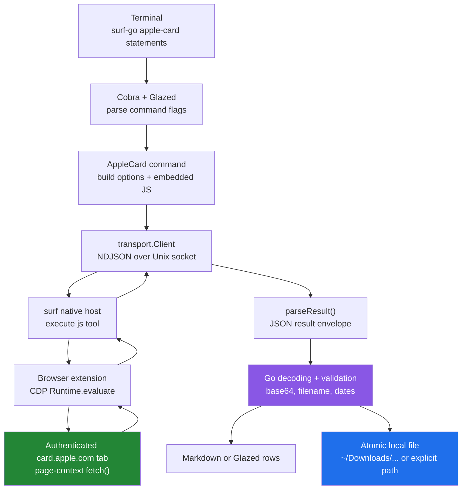
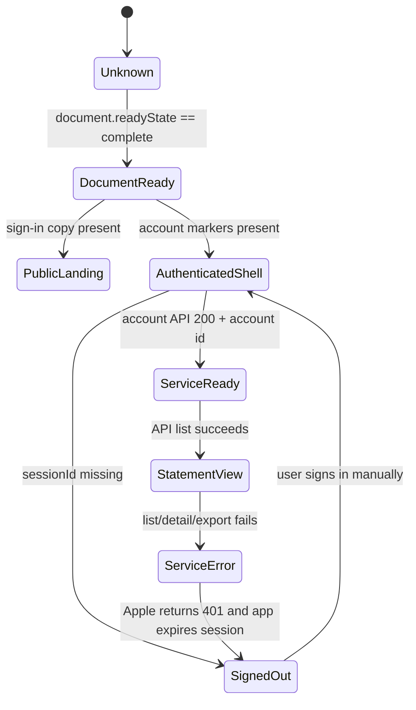

# Deep-Dive Project Report: surf-go Apple Card Statement Downloads

This report explains the investigation and initial implementation of authenticated Apple Card statement and transaction-export verbs in the Go version of `surf-cli`. It is written for an engineer who needs to understand the browser execution model, the Apple Card web application’s request contracts, the Go command architecture, the encoding and file-safety decisions, the validation evidence, and the remaining limits before extending the feature.

The central implementation decision is to execute authenticated Apple Card requests inside the existing signed-in `card.apple.com` page. The browser page owns Apple’s login state, session storage, cookies, request headers, and origin context. The Go process owns command parsing, response interpretation, decoding, filename validation, atomic writes, and output rendering. This division is not an implementation detail. It is the security boundary that prevents the command from extracting credentials or reproducing Apple’s authentication protocol in a separate HTTP client.

> [!summary]
> - The project adds `surf-go apple-card statements`, `surf-go apple-card statement-download`, and `surf-go apple-card transactions-export`.
> - Authenticated statement listing and PDF download are live-validated. The implementation downloaded 43 monthly PDFs from January 2023 through July 2026 into `~/Downloads/apple-card-statements-2023-onward`.
> - Web transaction export is live-validated for a full 2025 CSV and monthly CSVs for January–July 2026. The command had to convert CLI dates into ISO timestamps and decode a standard-base64 `transactionData` response.
> - Apple Card authentication is tab-scoped. The commands must use the currently authenticated tab or an explicit `--tab-id`; they must not create a replacement tab and expect the login state to transfer.
> - The implementation is intentionally file-based. No Apple Card SQLite import exists in the project or in the download workflow.

## 1. Executive summary

The requested feature began as a design and investigation task: create a docmgr ticket, study how existing `surf-go` browser verbs are built, probe Apple Card iteratively with page-context JavaScript, and produce an intern-facing implementation guide. The investigation first examined the signed-out landing page and public JavaScript bundle. That work identified the servicing domain, statement and export endpoint paths, response field names, UI labels, and date validation rules. It did not prove the authenticated response envelope or binary encoding, so production codecs were deliberately held back until a human-authenticated browser session was available.

Once the user signed in manually in the exact browser session controlled by `surf`, the investigation moved from public bundle evidence to live page-context evidence. The authenticated app returned account and statement list data through `GET users/accounts/` and `GET users/accounts/{accountId}/statements`. Statement detail returned `statementPDFData` and `statementDataFilename`; the observed PDF field was standard base64 and decoded to the `%PDF-` signature. Transaction export returned a standard-base64 `transactionData` field after the request dates were converted from CLI date strings into ISO timestamps.

The initial implementation follows the existing repository pattern. `go/internal/cli/commands/apple_card.go` defines the commands and orchestrates the host calls. `go/internal/cli/commands/scripts/apple_card.js` executes the authenticated requests in the page context. `go/cmd/surf-go/main.go` registers the `apple-card` command group. The Go code reassembles chunked page responses, decodes binary or text payloads, validates local names, writes through temporary files, and emits Markdown or Glazed rows.

The implementation has been validated in three ways. Unit tests cover pure helper behavior. The full Go test suite passes. A real authenticated browser session produced valid statement PDFs and readable CSV files in the Downloads directory. The result is a working initial feature, not a completed financial-data subsystem: bulk download manifests, automatic export range splitting, mock-host fixtures for all response modes, and a future opt-in SQLite import remain separate work.

## 2. Scope, evidence, and terminology

A technical report about browser automation must distinguish observed behavior from inference. The Apple Card web bundle is useful evidence because it contains route fragments, method names, field names, and validation strings. It is not a stable public API specification. The authenticated `surf` probes are stronger evidence for the account used during validation, but they also contain account-specific state and must not be treated as a universal guarantee about every Apple Card account.

This report uses three evidence levels:

1. **Repository evidence** comes from source code, tests, tutorials, and prior project reports in `/home/manuel/code/wesen/surf-cli` and the Obsidian vault.
2. **Deployed bundle evidence** comes from the public Apple Card JavaScript bundle loaded by `card.apple.com`. It establishes names and intended frontend behavior, but it can change without notice.
3. **Authenticated runtime evidence** comes from page-context JavaScript executed by `surf` in a manually signed-in Apple Card tab. It establishes the observed response shapes, encodings, browser-state requirements, and validation outcomes.

The term **page context** means the JavaScript execution environment associated with the target browser tab’s document. Code running there can use the document, `sessionStorage`, same-browser cookies, `fetch()`, and the browser’s origin policy. The Go process does not receive those credentials. It receives only the explicit JSON result returned by the page script.

The term **owned tab** has a specific meaning elsewhere in `surf-go`: a command opens a tab, records its identifier, uses it, and closes it. Apple Card commands do not use that pattern for authentication. The login state is stored in per-tab state, so opening a new tab after manual login creates a signed-out target. Apple Card commands use the active tab by default or an explicit `--tab-id` and never close that target.

The term **statement PDF** refers to the monthly document returned by the statement-detail endpoint. The term **transaction export** refers to a date-range file returned by the `exportTransactionData` endpoint. These are different operations with different selectors, input validation, wire formats, and failure behavior.

## 3. The problem the project solves

Apple Card’s web application exposes monthly statements and a transaction-export workflow to a signed-in user. The browser UI can render the data and initiate downloads, but the user asked for repeatable command-line verbs that can be used from scripts, inspected as structured output, and directed to deterministic local paths.

A naïve implementation would treat the feature as a click wrapper: navigate to the Statements page, click a row, wait for a file, and report success. That approach fails for several reasons.

First, Apple Card is a single-page application. The URL can remain `https://card.apple.com/` while the internal view changes from Payments to Statements. Direct navigation to `https://card.apple.com/statements` produced the generic page text `There is something wrong serving the page, please try later` in both signed-out research and an authenticated route-readiness test. Clicking the application’s `a[href="/statements"]` control produced the working statement view. A command that defines readiness only as “the URL is `/statements`” is therefore incorrect.

Second, the authentication state is not represented only by ordinary browser cookies. Apple’s application creates a `sessionId` in the target tab’s `sessionStorage`. A second Apple Card tab in the same browser window was signed out and had no `sessionStorage.sessionId`, while the original tab remained authenticated. A command that opens a fresh tab after the user signs in cannot assume it can reuse that login.

Third, the browser’s request wrapper adds headers that are required by the servicing API. A plain cross-origin `fetch()` with `credentials: 'include'` returned HTTP 401. Adding `X-Request-Id`, `X-Conversation-Id`, and `X-Session-Id`, while keeping the values inside page context, made account, statement-list, and statement-detail GET requests succeed.

Fourth, the returned file fields are strings rather than browser-native file objects. `statementPDFData` is base64. `transactionData` is also base64. A script result may be too large for one native-host response, so the page script returns chunks and Go reassembles them. A command that writes the string directly would produce a file that exists but is not the intended PDF or CSV.

The project therefore solves a compound problem:

- preserve authenticated browser state without extracting credentials;
- discover the Apple Card account identifier inside the page;
- call statement and export service methods with the required request envelope;
- return data through the bounded `surf` JavaScript result channel;
- decode and validate the returned representation;
- write files safely and atomically;
- expose both human-readable and structured command output;
- preserve enough probes and documentation for a future engineer to revalidate the behavior when Apple changes the deployed application.

## 4. Repository architecture and execution path

The existing `surf-go` architecture separates the CLI command from the browser-side implementation. This project extends that architecture without adding a new native-host protocol. The command uses the existing `js` tool, so the new feature is implemented with a Go command, an embedded JavaScript file, and root command registration.

The terminal-to-page execution path is:



The responsibilities are deliberately narrow:

| Layer | Responsibility | Does not own |
|---|---|---|
| Cobra/Glazed | Command names, flags, output mode, argument decoding | Apple authentication or API headers |
| `apple_card.go` | Orchestration, parsing, validation, chunk reassembly, file writes | Cookies, `sessionId`, direct HTTP authentication |
| `apple_card.js` | Page readiness assumptions, session headers, service requests, response chunking | Local paths, filesystem permissions, Markdown rendering |
| `transport.Client` | Socket request and response transport | Apple-specific response interpretation |
| Native host and extension | Tool routing and CDP evaluation | Apple account model and file semantics |
| Browser tab | Apple login state, `sessionStorage`, cookies, `fetch()` origin | Local output directory policy |

The production Go file is located at:

```text
/home/manuel/code/wesen/surf-cli/go/internal/cli/commands/apple_card.go
```

The production JavaScript file is located at:

```text
/home/manuel/code/wesen/surf-cli/go/internal/cli/commands/scripts/apple_card.js
```

The root command registration is located at:

```text
/home/manuel/code/wesen/surf-cli/go/cmd/surf-go/main.go
```

The investigation probes are intentionally stored elsewhere:

```text
/home/manuel/code/wesen/surf-cli/ttmp/2026/08/03/SURF-20260803-APPLECARD1--add-apple-card-statement-download-verbs-to-surf-go/scripts/
```

The separation matters during maintenance. The numbered probes preserve discovery history and failed assumptions. The embedded script is the maintained implementation. An intern should not copy an exploratory probe into production without reconciling its output shape, error behavior, and sensitive-data handling.

## 5. Apple Card application state and navigation

The public landing page contains a sign-in control and copy explaining that login is required to view balances, statements, and downloads. After manual authentication, the page body contains navigation controls with ordinary anchors:

```text
Payments       /
Installments   /installments
Statements     /statements
Settings       /settings
Support        /support
```

The application does not require the command to scrape those navigation labels for production operation. They were important during reconnaissance because they established the difference between the public landing page and the authenticated application view. The authenticated readiness probe checks for account-page markers and a Statements navigation link. It does not return balances or account names.

The Statements view contains the heading `Statements`, the control `ui-button.export-transactions-button`, yearly statement sections, and monthly list items. A DOM inventory showed statement rows as `li.item` elements whose visible text includes the month, period, and amount. The row DOM is useful for human inspection but not the primary data contract. The API list response has stable identifiers and machine-readable dates that the command needs for a download.

The navigation sequence that worked in the live session was:

```javascript
const statementsLink = document.querySelector('a[href="/statements"]');
if (!statementsLink) throw new Error('Statements link not found');
statementsLink.click();
```

The top-level `location.href` remained `https://card.apple.com/` after the click. The view changed because the application’s client-side router and state store changed. This is a useful example of why route strings and application state must be treated as separate observations.

The production commands do not click the Statements link. They operate against the currently authenticated page and call the servicing API directly. That is a conscious reduction of UI dependence. The UI probe remains valuable for readiness diagnostics and future compatibility work, while the API response supplies the identifiers and metadata needed by the command.

### Readiness is layered

The project distinguishes four readiness conditions:

1. **Transport readiness:** the `tabId` exists and the host can execute JavaScript in it.
2. **Document readiness:** the document has reached `complete` or an accepted interactive state.
3. **Application readiness:** authenticated markers and Statements navigation are present.
4. **Service readiness:** an authenticated account request returns HTTP 200 with a recognizable account envelope.

The fourth condition is the strongest one for the commands. A page can display an authenticated-looking shell while the service request is unauthorized or while the app is handling session expiration. The production JavaScript checks for `sessionStorage.sessionId`, calls account discovery, and rejects a missing account identifier. This prevents an empty or malformed response from being interpreted as an empty statement list.



The state model exposes a common failure. `document.readyState === 'complete'` is necessary but not sufficient. It says that the browser finished loading the document resources. It does not say that Apple’s application has completed account discovery, that the account session is valid, or that a statement list is available.

## 6. The Apple Card servicing API contract

The deployed bundle uses the production servicing origin:

```text
https://servicing-api-card.apple.com/ccs/v1/web/
```

The application’s request helper appends endpoint-relative paths to that base and applies a request finalizer. The finalizer generates request and conversation identifiers, reads a session identifier, and sets `credentials = 'include'`. The production page script implements the part needed by the surf command without copying credential material into Go.

### Endpoint table

| Operation | Method | Relative path | Request body | Observed result |
|---|---:|---|---|---|
| Account discovery | GET | `users/accounts/` | none | `{userInfo, accounts}` |
| Statement list | GET | `users/accounts/{accountId}/statements` | none | `{statements: [...]}` |
| Statement detail | GET | `users/accounts/{accountId}/statements/{statementId}` | optional `displayInline` in the web app | `statementPDFData`, `statementDataFilename` |
| Transaction export | POST | `users/accounts/{accountId}/exportTransactionData` | `fileFormat`, `beginDate`, `endDate` | `transactionData`, `transactionDataHash`, `transactionDataFilename` |

The account discovery response observed in the authenticated session had one account entry. The account identifier was nested below an account object. The exact account identifier is deliberately omitted from this report and from the committed probe result files. The page script uses a recursive lookup for `accountIdentifier` or `accountId` because the frontend model and endpoint paths use both conceptual names.

The statement list response contained a `statements` array. The observed statement object had these keys:

```text
statementId
openingDate
closingDate
currencyCode
minimumDue
paymentDueDate
paymentsAndCredits
purchases
rewardsBalance
rewardsEarned
rewardsRedeemed
statementBalance
totalBalance
```

The deployed bundle also described fields such as `statementPeriodDays`, `openingBalance`, `closingBalance`, `interestCharged`, `totalDeposits`, `totalDailyCashDeposits`, and `totalWithdrawn`. The production row shaping preserves fields returned by the service rather than forcing every optional bundle field into a static Go struct. The Markdown renderer uses the common date and balance fields.

### Request headers and page state

The required request envelope is the most important runtime discovery. The following page-context function captures the design without returning any session value:

```javascript
function sessionHeaders() {
  const sessionId = sessionStorage.getItem('sessionId');
  if (!sessionId) {
    throw new Error('Apple Card session is missing; sign in in the target tab');
  }

  let conversationId = sessionStorage.getItem('surfAppleCardConversationId');
  if (!conversationId) {
    conversationId = crypto.randomUUID();
    sessionStorage.setItem('surfAppleCardConversationId', conversationId);
  }

  return {
    'X-Request-Id': crypto.randomUUID(),
    'X-Conversation-Id': conversationId,
    'X-Session-Id': sessionId,
  };
}
```

The `sessionId` value remains inside the page. The Go command never asks the browser for it, and the page script never includes it in its returned result. `X-Request-Id` is generated for each request. The implementation stores a surf-specific conversation identifier in the same tab so consecutive chunk requests use a stable value without depending on a private variable inside Apple’s module closure.

This behavior was not guessed from a request capture. It was validated by three controlled requests:

- `credentials: 'include'` without the three headers returned HTTP 401.
- The three headers with a page-owned `sessionId` made account discovery return HTTP 200.
- The same envelope made statement list and statement detail return HTTP 200.

The distinction between page-owned and Go-owned state is important. The command can be passed a `tabId`, but that identifier does not grant access to the tab’s session storage. The JavaScript must run in the tab that contains the session.

## 7. Statement data and PDF download

The statement list is the discovery operation for monthly documents. Each record has a `statementId` and a closing date. A user can select a record by exact statement identifier or by closing month. The initial implementation supports one record at a time because that keeps the command’s file side effects explicit and makes failure behavior easy to interpret.

The page script obtains the account, calls the statement detail endpoint, verifies that the response contains strings named `statementPDFData` and `statementDataFilename`, and returns a chunk of the base64 data:

```javascript
async function documentRequest(accountId, statementId) {
  const response = await appleCardRequest(
    `users/accounts/${encodeURIComponent(accountId)}/statements/` +
      `${encodeURIComponent(statementId)}`
  );
  if (!response.ok) {
    return failure('Apple Card statement PDF request failed', {
      status: response.status,
      body: response.body,
    });
  }

  const pdf = findFirst(response.body, ['statementPDFData']);
  const filename = findFirst(response.body, ['statementDataFilename']);
  if (typeof pdf !== 'string' || typeof filename !== 'string') {
    return failure('Apple Card statement PDF response missing data or filename', {
      status: response.status,
    });
  }

  const offset = Math.max(0, Number(SURF_OPTIONS.offset || 0));
  const end = Math.min(pdf.length, offset + CHUNK_SIZE);
  return {
    ok: true,
    statementId,
    filename,
    offset,
    total: pdf.length,
    chunk: pdf.slice(offset, end),
    done: end >= pdf.length,
  };
}
```

The observed `statementPDFData` field matched standard base64. The authenticated metadata probe checked four properties without returning the data itself:

- the alphabet matched standard base64 characters;
- the string length had valid four-character alignment;
- `atob()` succeeded;
- the decoded prefix was `%PDF-`.

That validation is stronger than checking whether a file was created. A corrupted or incorrectly decoded file can still have a nonzero size. The Go implementation decodes the reassembled string with `base64.StdEncoding.DecodeString` and then checks that the first five bytes equal `%PDF-`.

### Chunk reassembly

The native host and command channel impose a practical result-size boundary. The initial implementation used 32 KiB chunks while validating correctness. A batch of approximately 1 MiB statements then required too many page-context round trips. The script was changed to use a 500,000-character default, consistent with the existing ChatGPT downloader’s larger chunk strategy. The chunk size is a character count for the base64 string, not a raw byte count; 500,000 is divisible by four, so chunks preserve base64 quartet boundaries.

The Go loop is conceptually:

```go
var encoded strings.Builder
offset := 0
for {
    result, err := runAppleCardJS(ctx, client, settings, map[string]any{
        "mode":        "statement-detail",
        "statementId": statementID,
        "offset":      offset,
    })
    if err != nil {
        return err
    }

    chunk := resultString(result, "chunk")
    if chunk == "" {
        return fmt.Errorf("empty chunk at offset %d", offset)
    }
    encoded.WriteString(chunk)
    offset += len(chunk)
    if resultBool(result, "done") {
        break
    }
}

pdf, err := base64.StdEncoding.DecodeString(encoded.String())
if err != nil {
    return fmt.Errorf("decode Apple Card statement PDF: %w", err)
}
if len(pdf) < 5 || string(pdf[:5]) != "%PDF-" {
    return fmt.Errorf("Apple Card statement data is not a PDF")
}
```

Each chunk request still performs the statement-detail GET. The page script caches the account identifier in `sessionStorage` after the first account discovery request. That reduces repeated account discovery during a multi-chunk download while keeping the value inside the browser tab.

### Filename and atomic-write policy

The server filename observed for the sampled statement did not include `.pdf`; Apple’s UI appends the extension when starting its browser download. Go performs that normalization after applying safety checks. The `safeAppleCardFilename` helper rejects:

- empty names;
- absolute paths;
- path separators;
- names containing `..`;
- control characters;
- excessive lengths that cannot be safely rendered.

The output path is joined below the caller-selected output directory. The write uses `os.CreateTemp` in the destination directory, writes the complete file, closes it, and renames it into place. An interrupted process therefore leaves a temporary file rather than a complete-looking destination file.

The current command reports one result:

```text
kind: apple-card-statement-download
statementId: <id>
path: <local path>
bytes: <count>
status: downloaded
```

Bulk selection, manifests, skip-existing behavior, and aggregate partial-failure reporting are not part of the initial command. The live validation batch used a shell loop with exact expected filenames to resume after interruption. That operational behavior should eventually become a first-class bulk command rather than remain an external workflow.

## 8. Transaction export and date semantics

Transaction export is not a variant of statement PDF download. It has a date range, a selectable file format, a different response field, a different encoding, and different service limits. The command accepts CLI dates in `YYYY-MM-DD` form because that is the user-facing format used by the Apple Card UI. The service wire format is stricter.

The first authenticated export probe sent:

```json
{
  "fileFormat": "csv",
  "beginDate": "2025-01-01",
  "endDate": "2025-12-31"
}
```

The service returned HTTP 400 with:

```text
Text '2025-12-31' could not be parsed at index 10
```

The failure identifies the boundary between a date-only string and a timestamp parser. The production page script converts the CLI dates to local browser date boundaries and then calls `toISOString()`:

```javascript
function exportTimestamp(date, endOfDay) {
  const value = new Date(
    `${date}T${endOfDay ? '23:59:59.999' : '00:00:00.000'}`
  );
  if (Number.isNaN(value.getTime())) {
    throw new Error(`invalid export date: ${date}`);
  }
  return value.toISOString();
}
```

This produces an ISO/RFC3339 timestamp in the browser’s time-zone interpretation. The choice preserves the user’s calendar dates across daylight-saving transitions better than appending a fixed offset. Account product time zone behavior should remain an open validation item for dates near midnight.

The successful export response contained:

```text
transactionData
transactionDataHash
transactionDataFilename
```

The `transactionData` field was standard base64. The Go command collects chunks, decodes with `base64.StdEncoding.DecodeString`, and writes the decoded CSV bytes. The hash is currently retained only in the page result and is not verified locally because the algorithm and canonicalization rules were not established by the deployed application.

### Service range behavior

The Apple web UI states that transactions before January 2025 must be exported from an iPhone or iPad. That is a web-product limitation, not a local command limitation. The validation therefore covered:

- one full 2025 export;
- one attempted combined 2026 range;
- monthly 2026 exports after the combined range returned HTTP 500.

The full 2025 export succeeded. The range from January 1, 2026 through August 3, 2026 returned HTTP 500. Calendar-month ranges from January through July 2026 succeeded. This establishes a practical rule: the one-year client-side validation rule is not a guarantee that the service will accept every range within one year. The command should eventually provide an explicit monthly split mode or retry a broad range as smaller intervals after a targeted server failure.

The validated CSV archive contains eight files:

| File group | Coverage | Validation |
|---|---|---|
| Annual CSV | 2025-01-01 through 2025-12-31 | ASCII CSV, 8 columns, 1,616 data rows |
| Monthly CSVs | 2026-01 through 2026-07 | ASCII CSV, 8 columns per file, 106–136 data rows per file |

The current August 2026 partial period was not included because the browser session expired after the validation run. The PDF archive contains monthly statements through July 2026, which is the latest complete statement represented by the statement list at validation time.

### Export command behavior

The public command is:

```text
surf-go apple-card transactions-export \
  --start YYYY-MM-DD \
  --end YYYY-MM-DD \
  --format csv|ofx|qfx|qbo \
  --save-to PATH \
  --tab-id ID
```

Local validation happens before the page request:

- both dates must parse as `YYYY-MM-DD`;
- start must be before end;
- neither date may be in the future;
- the range must not exceed one year;
- the format must be one of `csv`, `ofx`, `qfx`, or `qbo`.

The endpoint may still reject a locally valid request. Go returns the service error and does not write a destination file until the full response has been decoded successfully.

## 9. Command surface and output design

The command group is registered in `go/cmd/surf-go/main.go`:

```text
surf-go apple-card statements
surf-go apple-card statement-download
surf-go apple-card transactions-export
```

The commands use `buildDualModeCommand`, matching the repository pattern for commands that render Markdown by default and support Glazed structured output through `--with-glaze-output`.

| Command | Side effect | Primary input | Default output |
|---|---|---|---|
| `statements` | none | optional date filters and result limit | Markdown statement rows |
| `statement-download` | writes one PDF | `--statement-id` or `--month` | Markdown path/size summary |
| `transactions-export` | writes one CSV or supported export file | `--start`, `--end`, `--format` | Markdown path/size summary |

Every command accepts the browser transport settings used throughout the repository:

```text
--socket-path
--timeout-ms
--tab-id
--window-id
--debug-socket
```

The `--tab-id` description explicitly states that new tabs do not inherit Apple Card login state. This is not only documentation. It prevents a future refactor from applying the generic owned-tab pattern without considering Apple’s per-tab state.

### Statements listing

```text
surf-go apple-card statements \
  --since 2025-01-01 \
  --until 2026-07-31 \
  --max-results 20 \
  --tab-id 123
```

The Go layer receives the statement list map, filters on normalized `closingDate` prefixes, attaches `kind: apple-card-statement`, and sends each map to the Glazed processor or Markdown renderer. It does not include the account identifier in the rendered row by default.

### Single PDF download

```text
surf-go apple-card statement-download \
  --month 2023-09 \
  --output-dir "$HOME/Downloads/apple-card-statements-2023-onward" \
  --tab-id 123
```

The `--month` path performs account discovery and statement listing before resolving a record. The `--statement-id` path skips list resolution and uses the exact identifier. Both paths perform detail retrieval, chunk reassembly, base64 decoding, PDF magic validation, filename normalization, and atomic writing.

### Transaction export

```text
surf-go apple-card transactions-export \
  --start 2025-01-01 \
  --end 2025-12-31 \
  --format csv \
  --save-to "$HOME/Downloads/apple-card-csv-2025-onward/apple-card-transactions-2025.csv" \
  --tab-id 123
```

The command uses `--save-to` rather than `--output` because the Glazed output section already owns the generic `--output` flag. This avoids a Cobra flag collision between output formatting and the transaction file path.

## 10. Security and data-boundary analysis

Financial browser automation requires a narrower credential boundary than ordinary public-page scraping. The command must be useful without becoming a credential extraction tool.

The chosen boundary has four properties:

1. The user authenticates manually in the browser. Apple ID credentials and verification are not scripted.
2. The page script reads `sessionStorage.sessionId` only to construct service requests. It does not return the session value to Go.
3. Go receives response data only when the command explicitly requests it. The code does not enumerate cookies or browser storage.
4. Local files are written only at an explicit command-controlled path and are not committed to the repository.

The page script does return financial document contents when a download command is invoked. That is the requested side effect. It does not return the session header values. Error handling should remain careful because a raw service error body might contain account-specific data. The current probes return response shapes and metadata, not raw response fixtures.

The commands also preserve tab ownership. A user-supplied or active authenticated tab is never closed. This matters because closing that tab destroys the session state needed by subsequent commands and creates a surprising browser side effect.

The output directories used for validation were outside the repository:

```text
~/Downloads/apple-card-statements-2023-onward
~/Downloads/apple-card-csv-2025-onward
```

The project did not import the files into SQLite. The only SQLite file found in the combined repository/Downloads search was an unrelated `wireless-research.sqlite`. A future import must be an explicit feature with an import command, schema, deduplication key, source provenance, and a clear policy for financial data retention.

## 11. Comparison of implementation strategies

The project rejected several plausible approaches. The comparison matters because the rejected approaches are likely to reappear when a future engineer asks for bulk imports, server-side reports, or a non-browser execution mode.

| Strategy | Authentication | Data contract | Browser dependency | Failure risk | Decision |
|---|---|---|---|---|---|
| Direct Go HTTP client | Requires cookie/session extraction or protocol recreation | Controlled by Go | None after login material is copied | Credential leakage, token drift, origin/CORS differences | Rejected |
| DOM-only statement scraping | Uses existing page | Visible labels and row text | High | Missing identifiers, locale changes, timing races | Used for probes, not production data |
| UI-driven browser download | Uses existing page | Browser download behavior | High | Click selectors, download timing, hidden file naming | Useful for manual corroboration |
| Page-context API request | Reuses page session and service wrapper | Explicit JSON fields and encodings | Requires authenticated tab | Service contract changes, response-size limits | Chosen |
| New owned tab after login | New tab has separate state | Same service contract | Attempts to create auth context | Signed-out tab, session loss | Rejected for Apple Card |
| SQLite import | Local database credentials not involved | Requires new schema and dedupe rules | None after files exist | Accidental duplication, retention ambiguity | Not implemented |

The selected page-context API approach is not a claim that Apple’s service is stable. It is a claim about where the existing authentication and request state already lives. The implementation isolates that instability inside a maintained JavaScript file and keeps the Go layer responsible for deterministic local behavior.

The existing `surf-go` browser-verb pattern provides the project lineage. The ChatGPT file downloader uses page-context requests, embedded scripts, chunked responses, and Go-side file writes. The Apple Card implementation uses the same architectural shape but has stricter tab-state rules because the Apple application stores session state in `sessionStorage` rather than exposing a reusable bearer token in a stable page API.

## 12. Validation narrative and failure analysis

The validation was incremental. Each failure changed a concrete implementation decision.

### Phase A: signed-out page reconnaissance

The initial page-shape probe captured the Apple Card landing page, its sign-in control, build metadata, and public app markers. Clicking Sign In opened a cross-origin Apple ID iframe. The top-level page context could not inspect or automate the iframe. This established the manual-login boundary.

The direct route probe navigated to `/statements` while signed out. The page reached `readyState: complete` but displayed the generic serving error. This established that generic browser readiness and route equality were not sufficient.

### Phase B: public bundle analysis

The public bundle exposed the endpoint fragments and response field names. It also exposed the UI’s visible export formats and validation messages. This was enough to define the proposed commands, but not enough to define a safe production decoder. The implementation remained blocked on an authenticated response.

### Phase C: authenticated page and service probes

The user signed in manually. The exact authenticated tab showed account markers and the Statements view. The first direct `fetch()` call still returned HTTP 401 because the page script omitted Apple’s request headers. Source inspection of the deployed bundle identified the request finalizer. Repeating the request with the page-owned session header returned HTTP 200.

The account envelope, statement list envelope, statement keys, and statement detail fields were then captured as redacted shapes. The statement detail probe validated standard base64 and `%PDF-` without exposing the payload.

### Phase D: initial implementation

The command group and embedded script were implemented. Unit tests passed. A live statement listing returned structured rows. A live statement download produced a file that the `file` utility identified as a valid PDF.

The first large PDF batch used a 32 KiB chunk size and repeated account discovery for every chunk. It was slow enough that the first shell run stopped after five files. The script was changed to cache the account identifier and use a 500,000-character chunk size. Exact filename checks made the batch resumable. The final archive contained 43 monthly PDFs from January 2023 through July 2026.

### Phase E: transaction export correction

The first export request used date-only strings and returned the exact parser error described earlier. The page script began sending ISO timestamps. The response succeeded and revealed that `transactionData` was base64. Go was corrected to decode it before writing the CSV.

A full 2025 range succeeded. The broad 2026 range returned HTTP 500, so monthly ranges were used. The final CSV validation found eight files: one full-year 2025 CSV and seven monthly 2026 CSVs. Python checked row counts and column counts without printing transaction contents.

### Phase F: local artifact search

The user asked whether the files had been imported into SQLite and requested a merchant search. The search found no Apple Card database and no import code. It found one exact Garland transaction at approximately $2,500 in both the CSV and September 2025 PDF. That operation did not modify any source or financial artifact.

The sequence is important because the final code reflects the actual failures. The timestamp conversion, base64 decoding, larger chunks, account cache, and tab-state documentation are not speculative hardening. They correspond to observed failures or measured operational behavior.

## 13. Reimplementation guide

An intern reimplementing this feature should follow a sequence that preserves evidence and keeps the credential boundary intact.

### Step 1: establish the repository command pattern

Read these files first:

```text
go/pkg/doc/tutorials/01-building-browser-side-verbs.md
go/pkg/doc/tutorials/02-building-stateful-gmail-verbs.md
go/internal/cli/commands/tab_ready.go
go/internal/cli/commands/format.go
go/internal/cli/commands/chatgpt_download.go
go/cmd/surf-go/main.go
```

The tutorials explain how a page-side script becomes a Go command. `tab_ready.go` explains generic readiness and owned-tab behavior. `format.go` explains how `surf` wraps structured JavaScript results. `chatgpt_download.go` shows the existing chunked binary transfer pattern.

### Step 2: create numbered probes

Each probe should answer one question and return a small JSON object. Recommended questions are:

```text
What marks the authenticated page?
How does the Statements view activate?
What DOM nodes represent rows and export controls?
What is the account response envelope?
What is the statement list envelope?
What fields and encoding does statement detail return?
What body and dates does export accept?
What page/API condition proves readiness?
```

Do not save raw account or transaction bodies in Git. If a raw fixture is necessary for a unit test, redact account identifiers, names, balances, transaction descriptions, and file contents before committing it.

### Step 3: stabilize service requests in the page

The script must run in the authenticated tab. The minimal request helper is:

```javascript
const API_BASE = 'https://servicing-api-card.apple.com/ccs/v1/web/';

async function request(path, init = {}) {
  const sessionId = sessionStorage.getItem('sessionId');
  if (!sessionId) {
    throw new Error('Apple Card session is missing');
  }

  const conversationId =
    sessionStorage.getItem('surfAppleCardConversationId') || crypto.randomUUID();
  sessionStorage.setItem('surfAppleCardConversationId', conversationId);

  const response = await fetch(API_BASE + path, {
    credentials: 'include',
    ...init,
    headers: {
      'X-Request-Id': crypto.randomUUID(),
      'X-Conversation-Id': conversationId,
      'X-Session-Id': sessionId,
      ...(init.headers || {}),
    },
  });

  const text = await response.text();
  let body;
  try {
    body = text ? JSON.parse(text) : null;
  } catch {
    body = {rawText: text.slice(0, 500)};
  }
  return {ok: response.ok, status: response.status, body};
}
```

The helper reads session state but does not return it. Service errors are converted into structured data so Go can report status without crashing on a non-JSON response.

### Step 4: define options and modes

The Go command injects a JSON options object before the embedded script:

```go
func buildAppleCardCode(options map[string]any) (string, error) {
    b, err := json.Marshal(options)
    if err != nil {
        return "", fmt.Errorf("marshal Apple Card options: %w", err)
    }
    return fmt.Sprintf("const SURF_OPTIONS = %s;\n%s", b, appleCardScript), nil
}
```

The current modes are:

```text
accounts
statements
statement-detail
transactions-export
```

A mode should return one JSON object with an explicit `ok` field. The page script should not render Markdown or write local files. Those responsibilities belong to Go.

### Step 5: parse once in Go

The host response has a `result.content` envelope. `parseResult` extracts text blocks and parses JSON objects. The Apple Card command then checks the returned `ok` field and interprets the data map.

For list mode:

```go
body, _ := data["body"].(map[string]any)
raw, _ := body["statements"].([]any)
for _, value := range raw {
    statement, ok := value.(map[string]any)
    if !ok {
        continue
    }
    // Apply date filters and add kind metadata.
}
```

For binary or encoded text mode, Go loops over chunks, checks for empty chunks, advances by the returned string length, and stops only when `done` is true. It then decodes the complete payload. A chunk loop must have a maximum iteration guard so a broken `done` flag cannot create an infinite command.

### Step 6: validate before writing

The statement path validates PDF magic bytes. The transaction path validates base64 decoding and writes the decoded bytes. Both paths validate filenames. The output path supplied by the user is not replaced with the server filename; the server filename is used only when no explicit destination is provided.

A safe write sequence is:

```text
1. Ensure the parent directory exists.
2. Create a temporary file in that same directory.
3. Set the intended mode.
4. Write all bytes.
5. Close the file and check the close error.
6. Rename the temporary path to the final path.
7. Remove the temporary path on all error paths.
```

Using the same directory for the temporary file and final destination keeps the rename operation on one filesystem and avoids a partial final file.

### Step 7: test without an account

The pure test suite should cover:

- exact and malformed filenames;
- path traversal and control characters;
- extension normalization;
- date ordering and future dates;
- one-year range enforcement;
- format validation;
- temporary-file cleanup;
- PDF magic validation;
- base64 decoding errors;
- options injection into the embedded script.

Mock-host integration tests should then verify:

- the `js` tool request includes the explicit `tabId` when provided;
- no `tab.new` or `tab.close` request is sent by Apple Card commands;
- service errors become nonzero command errors;
- a detail chunk sequence is reassembled correctly;
- failed writes do not leave the final destination claiming success.

### Step 8: validate with a human-authenticated tab

The live procedure is:

```bash
surf tab list
surf js 'return {hasSessionId: !!sessionStorage.getItem("sessionId")}' --tab-id <id>

cd /home/manuel/code/wesen/surf-cli/go
go run ./cmd/surf-go apple-card statements --tab-id <id> --max-results 2

go run ./cmd/surf-go apple-card statement-download \
  --tab-id <id> \
  --month YYYY-MM \
  --output-dir "$HOME/Downloads/apple-card-test"

file "$HOME/Downloads/apple-card-test"/*
```

For transaction export, begin with a small web-supported range. Do not immediately retry a failing range repeatedly against a financial account. Record the service status and response message, then decide whether the error indicates bad dates, an unsupported period, a transaction-count limit, or session expiration.

## 14. Testing and operational validation

The repository test command is:

```bash
cd /home/manuel/code/wesen/surf-cli/go
go test ./... -count=1
```

The current test suite passed after adding the Apple Card command group. The new pure tests are in:

```text
go/internal/cli/commands/apple_card_test.go
```

The real browser validation commands used a temporary build because the installed `surf-go` binary predated the new command registration:

```bash
cd /home/manuel/code/wesen/surf-cli/go
go build -o /tmp/surf-go-apple-card ./cmd/surf-go
```

This distinction matters when a user reports that `surf-go apple-card` is unknown. The source tree can contain the command while the installed binary remains stale. Installation/rebuild should be a release step.

The docmgr validation command is:

```bash
docmgr doctor --ticket SURF-20260803-APPLECARD1 --stale-after 30
```

It passed after the implementation and diary updates. The ticket contains the full design guide, implementation diary, probes 01–16, public Apple source extracts, and bookkeeping files.

The Downloads validation was intentionally metadata-oriented. The PDF archive was counted and representative files were checked with `file`. The CSV archive was read with Python’s `csv` module to count rows and columns without printing transaction contents. The search for the Garland transaction used structured CSV fields first and temporary PDF text second; the temporary extracted text was deleted after the search.

## 15. Common failure modes and anti-patterns

### Opening a fresh tab after login

A fresh tab lacks the Apple application’s `sessionStorage.sessionId`. It may display the public landing page even when another tab in the same browser window is authenticated. The command must use the authenticated tab.

### Treating URL equality as application readiness

The app can keep the top-level URL at `/` while rendering the Statements view. Direct navigation to `/statements` can display an error page. Use service readiness and page markers rather than a route string alone.

### Sending only cookies

`credentials: 'include'` is necessary but insufficient for the observed service request. The page script must add the three request headers. The session identifier comes from page state and stays in page context.

### Writing encoded data directly

Both `statementPDFData` and `transactionData` are encoded strings. A file written without decoding is not a valid PDF or CSV. Validate the PDF magic bytes and parse the CSV after decoding.

### Using the server filename as a path

A server response is untrusted input from the perspective of the local filesystem. Reject separators, absolute names, parent traversal, control characters, and excessive lengths before joining with the output directory.

### Writing directly to the final path

An interrupted transfer can leave a partial file at the expected name. Use a temporary file and rename only after all bytes have been validated.

### Treating one broad valid range as guaranteed

The UI’s one-year rule is a client-side rule. The service can still reject a broad range with HTTP 500 or a transaction-count error. The user-facing implementation needs a way to split ranges into smaller intervals.

### Importing into SQLite without a data model

A local database is not an automatic improvement. It adds schema, source identity, deduplication, date normalization, retention, and privacy decisions. The current project keeps downloaded artifacts as files and does not create a database. If SQLite import is added, it must be an explicit command with an auditable schema.

### Logging response bodies

Account, statement, and transaction responses contain sensitive financial data. Probes should return keys, counts, lengths, statuses, and encoding metadata. Raw body logging should be avoided except in a deliberately redacted local fixture.

## 16. Current status and implementation inventory

The current implementation is in commit `4b0a3a9558dc214783ec63434ec96af4c2fbbc08`, with subsequent diary commits documenting the live validation work. The working tree also contains an unrelated pre-existing `.claude/settings.local.json` that was intentionally not staged.

Implemented files:

| File | Role |
|---|---|
| `go/internal/cli/commands/apple_card.go` | Commands, settings, service orchestration, decoding, validation, atomic writes |
| `go/internal/cli/commands/apple_card_test.go` | Pure helper and embedded-script tests |
| `go/internal/cli/commands/scripts/apple_card.js` | Page-context request helper, account cache, API modes, chunking |
| `go/cmd/surf-go/main.go` | `apple-card` command-group registration |
| `ttmp/.../scripts/09–16` | Authenticated probes and redacted result metadata |
| `ttmp/.../design-doc/01...` | Intern design and implementation guide |
| `ttmp/.../reference/01...` | Detailed chronological diary |

Validated artifacts outside Git:

```text
~/Downloads/apple-card-statements-2023-onward
  43 monthly PDFs, January 2023 through July 2026

~/Downloads/apple-card-csv-2025-onward
  1 annual 2025 CSV
  7 monthly 2026 CSVs, January through July
```

The project does not claim that the web UI can export pre-January-2025 transactions as CSV. Apple’s own web text says to use an iPhone or iPad for transactions before January 2025. The monthly PDFs provide document coverage for those earlier periods.

## 17. Open questions and next steps

### Automatic monthly export splitting

The current command rejects or surfaces service errors for broad ranges. A future mode could split a range by calendar month, run each export separately, write predictable filenames, and produce a manifest. The implementation must decide how to handle a month with too many transactions and whether to split that month further.

### August 2026 partial export

The validated transaction archive ends with July 2026 because the browser session expired after the completed run. A fresh login can test the current partial month. The command should document whether an end date of today is accepted consistently around the account product time zone.

### Transaction hash verification

The service returns `transactionDataHash`. The deployed frontend does not expose enough evidence to identify the hash algorithm and canonical byte representation. A future probe should capture only the hash length and format plus a locally computed digest candidate against a redacted fixture. The implementation should not claim verification until the comparison is proven.

### Bulk PDF command

The shell loop used for the 43-file validation archive should become a first-class command if bulk use is expected. It needs:

- list-once behavior;
- explicit selection by date range or all;
- exact expected filename checks;
- `--skip-existing`;
- a manifest containing status and byte count;
- aggregate errors without hiding successful files;
- a clear policy for tab expiration during a long run.

### Mock-host response fixtures

The current tests cover pure helpers but do not exercise the full Apple Card command against a mock host. Add redacted fixture maps for account discovery, statement list, PDF chunks, export chunks, 400 date errors, 500 broad-range failures, and 401 session expiration. The tests should verify that no explicit target tab is closed.

### SQLite import

No SQLite import currently exists. If requested, design it separately instead of adding a hidden side effect to the download commands. A reasonable first schema would separate source files, statements, exports, and transaction rows, with source filename, source hash, import timestamp, and stable transaction fields. The schema must account for duplicate rows across annual and monthly exports.

### Installation and release packaging

The source command is registered, but users need an updated installed `surf-go` binary. Add the command to the release smoke tests and confirm the embedded JavaScript file is included in the binary. A help test should assert the presence of `apple-card`, `statements`, `statement-download`, and `transactions-export`.

## 18. References and sources

### Project implementation

| Reference | Role |
|---|---|
| `/home/manuel/code/wesen/surf-cli/go/internal/cli/commands/apple_card.go` | Production Go commands, decoding, validation, atomic writes, and rendering |
| `/home/manuel/code/wesen/surf-cli/go/internal/cli/commands/scripts/apple_card.js` | Production page-context API requests and chunking |
| `/home/manuel/code/wesen/surf-cli/go/internal/cli/commands/apple_card_test.go` | Unit tests for local behavior |
| `/home/manuel/code/wesen/surf-cli/go/cmd/surf-go/main.go` | Root command registration and dual-mode builder |
| `/home/manuel/code/wesen/surf-cli/go/internal/cli/commands/tab_ready.go` | Existing browser readiness and owned-tab conventions |
| `/home/manuel/code/wesen/surf-cli/go/internal/cli/commands/format.go` | Host result parsing and structured JSON extraction |
| `/home/manuel/code/wesen/surf-cli/go/internal/cli/commands/chatgpt_download.go` | Existing page-context downloads and large-response chunking |

### Investigation artifacts

| Reference | Role |
|---|---|
| `/home/manuel/code/wesen/surf-cli/ttmp/2026/08/03/SURF-20260803-APPLECARD1--add-apple-card-statement-download-verbs-to-surf-go/design-doc/01-apple-card-statement-download-verbs-intern-design-and-implementation-guide.md` | Evidence-backed intern design guide |
| `/home/manuel/code/wesen/surf-cli/ttmp/2026/08/03/SURF-20260803-APPLECARD1--add-apple-card-statement-download-verbs-to-surf-go/reference/01-investigation-diary.md` | Chronological probe, implementation, and validation diary |
| `/home/manuel/code/wesen/surf-cli/ttmp/2026/08/03/SURF-20260803-APPLECARD1--add-apple-card-statement-download-verbs-to-surf-go/scripts/09-authenticated-page-shape-probe.js` | Authenticated page markers |
| `/home/manuel/code/wesen/surf-cli/ttmp/2026/08/03/SURF-20260803-APPLECARD1--add-apple-card-statement-download-verbs-to-surf-go/scripts/10-statements-navigation-probe.js` | SPA Statements navigation evidence |
| `/home/manuel/code/wesen/surf-cli/ttmp/2026/08/03/SURF-20260803-APPLECARD1--add-apple-card-statement-download-verbs-to-surf-go/scripts/11-statement-row-inventory-probe.js` | DOM row and control inventory |
| `/home/manuel/code/wesen/surf-cli/ttmp/2026/08/03/SURF-20260803-APPLECARD1--add-apple-card-statement-download-verbs-to-surf-go/scripts/12-account-response-shape-probe.js` | Account envelope keys |
| `/home/manuel/code/wesen/surf-cli/ttmp/2026/08/03/SURF-20260803-APPLECARD1--add-apple-card-statement-download-verbs-to-surf-go/scripts/13-statement-list-response-shape-probe.js` | Statement list keys and count metadata |
| `/home/manuel/code/wesen/surf-cli/ttmp/2026/08/03/SURF-20260803-APPLECARD1--add-apple-card-statement-download-verbs-to-surf-go/scripts/14-statement-detail-response-metadata-probe.js` | PDF encoding and response-field evidence |
| `/home/manuel/code/wesen/surf-cli/ttmp/2026/08/03/SURF-20260803-APPLECARD1--add-apple-card-statement-download-verbs-to-surf-go/scripts/15-small-transaction-export-probe.js` | Export response investigation and failure evidence |
| `/home/manuel/code/wesen/surf-cli/ttmp/2026/08/03/SURF-20260803-APPLECARD1--add-apple-card-statement-download-verbs-to-surf-go/scripts/16-authenticated-readiness-probe.js` | Page and account-service readiness |

### Apple documentation

| Source | URL | Use in this report |
|---|---|---|
| `/home/manuel/code/wesen/surf-cli/ttmp/2026/08/03/SURF-20260803-APPLECARD1--add-apple-card-statement-download-verbs-to-surf-go/sources/apple-support-download-statements-and-transactions.md` | https://support.apple.com/en-us/109366 | Official statement and transaction-export workflow |
| `/home/manuel/code/wesen/surf-cli/ttmp/2026/08/03/SURF-20260803-APPLECARD1--add-apple-card-statement-download-verbs-to-surf-go/sources/apple-card-web-servicing-download-statements.md` | https://support.apple.com/guide/apple-card-web-servicing/welcome/web | Apple Card web-servicing statement behavior and pre-2025 export limitation |

The public deployed bundle was inspected at the time of validation from the page-loaded assets under:

```text
https://card-static.cdn-apple.com/apple-card-ui/26.11/26.11.17/en-us/main.js
https://card-static.cdn-apple.com/apple-card-ui/26.11/26.11.17/en-us/vendors.js
```

The relevant service base observed in that bundle was:

```text
https://servicing-api-card.apple.com/ccs/v1/web/
```

### Related vault knowledge

- `Projects/2026/04/10/ARTICLE - surf-go Browser Verbs - Using JS Probes to Build Reliable Web Automation.md` — probe-first browser-verb development process.
- `Projects/2026/07/21/PROJECT REPORT - surf-go ChatGPT File Downloader - Driving the Backend API Through the Page Context.md` — page-context authenticated downloads and chunked transfer patterns.

## 19. Closing perspective

The Apple Card project demonstrates why browser verbs require investigation artifacts, not only command code. The final Go implementation is compact compared with the uncertainty that preceded it. The difficult work was determining which parts of the browser application were stable enough to use: the request paths, the account envelope, the session headers, the per-tab state, the encodings, the date wire format, and the service range limits.

The result is a bounded implementation. Authentication remains in the browser page. The Go process never reconstructs Apple’s login protocol. The browser-side script returns explicit structured results. Go validates and writes only after complete data is available. The repository contains numbered probes and a diary recording failed approaches, so a future maintainer can distinguish a service contract change from a local parser regression.

The next feature should not begin by adding more flags. It should begin by converting the remaining operational gaps into explicit contracts: bulk selection, monthly export splitting, mock-host fixtures, optional SQLite import, and current-month validation. That sequence keeps the project’s strongest property intact: each behavior is first observed, then encoded, then tested, then documented.
