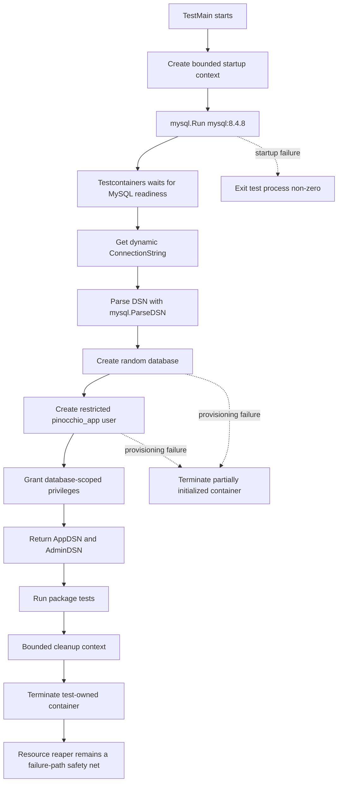
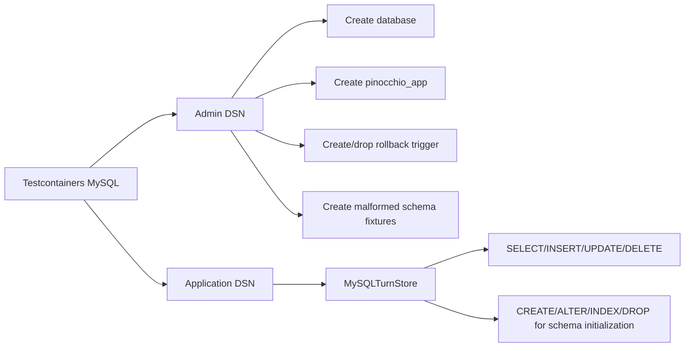

# Testcontainers MySQL Integration Testing in Go: Isolation, Privilege Boundaries, and Transactional Proof

A database adapter is not validated by compiling its SQL statements. It is validated by observing the behavior of a real database engine under the conditions that define the adapter's contract: schema creation, equality semantics, transaction boundaries, restart behavior, duplicate handling, and failure. This article explains how to build that validation environment in Go with Testcontainers for Go and MySQL 8.4.

The concrete case is Pinocchio's MySQL `chatstore.TurnStore`. The implementation stores turn headers, canonicalized blocks, and turn-block membership in InnoDB tables. Its correctness depends on MySQL behavior that SQLite tests cannot establish: byte-exact identifiers, `VARBINARY` primary keys, MySQL DDL and indexes, transaction rollback after multiple writes, and the interaction between application credentials and administrative fault injection. The resulting harness starts a disposable MySQL container, creates a fresh database, provisions a restricted application user, exposes a separate administrator connection for test-only database operations, runs the tests, and removes the container without touching the repository's persistent Compose database.

> [!summary]
> - A real database test needs an isolated database lifecycle, not merely a connection string pointed at a developer server.
> - The application connection and the test-administration connection must be separate. The adapter should never need trigger or database-creation privileges.
> - Testcontainers provides container startup, readiness, dynamic connection information, and resource cleanup. The test suite still owns its database state, credential split, transaction fault, and CI policy.
> - A package-scoped container with a fresh database per invocation gives useful startup cost without making schema tests depend on persistent state.

## Why this note exists

The initial Pinocchio MySQL tests used an externally supplied `PINOCCHIO_MYSQL_TURNS_DSN`. That arrangement was enough to run basic integration checks against a local MySQL server, but it left the test boundary implicit. If the DSN pointed at the CoinVault Compose database, the tests could create tables, insert rows, install triggers, or leave stale schema metadata in a persistent volume. A later test run could then fail before it reached the behavior under investigation.

The rollback test exposed the second problem. A meaningful rollback test must cause an error after the transaction has performed writes. A malformed YAML payload does not do that; parsing fails before `BeginTx`. A MySQL trigger can create the required mid-transaction failure, but trigger creation requires database privileges that the application user should not receive. Running all tests as `root` makes the test pass while removing the security property being tested.

The correct solution is not to make the application user more powerful. It is to make the test environment more explicit:

1. start a new MySQL process owned by the test invocation;
2. create a random database inside that process;
3. create a restricted application user for the adapter;
4. retain an administrator DSN for test setup and fault injection only;
5. terminate the entire test-owned environment after the package finishes.

This note records the design and the implementation in `/home/manuel/workspaces/2026-08-13/ragkit-coinvault-mysql/pinocchio`. It is written as reusable engineering guidance. The Pinocchio package names and commit hashes make the rules concrete, but the lifecycle applies to any Go repository that has a real MySQL adapter.

## 1. The problem: a DSN is not an isolation boundary

A DSN tells `database/sql` how to connect. It does not tell the test whether the target database is disposable, shared, populated, privileged, or owned by another process. Treating a DSN as the whole test environment hides the most important state.

A test database has at least five independent dimensions:

| Dimension | Question | Failure when unspecified |
|---|---|---|
| Server ownership | Who started and controls the MySQL process? | Tests mutate a developer or CI service they do not own. |
| Database freshness | Which schema and rows exist before the test? | Fresh-schema and empty-store assertions become order-dependent. |
| Credential authority | What can the connection create or alter? | The test grants production code privileges required only by the harness. |
| Network endpoint | Which host and port does the server expose? | Fixed ports collide with Compose, parallel tests, or other developers. |
| Cleanup ownership | Who removes containers, databases, and volumes? | Failed tests leak state or leave persistent data behind. |

The old arrangement specified only the fourth dimension, and even that indirectly. The new arrangement represents the entire environment as a test-owned object:

```go
type Instance struct {
    Container testcontainers.Container
    AppDSN    string
    AdminDSN  string
    Database  string
}
```

`AppDSN` is passed to `MySQLTurnStore`. `AdminDSN` is used by the test code to create the database, create the restricted user, and install a scoped fault trigger. The store never receives the administrator connection.

### The target contract

The integration harness is correct when the following statement holds:

```text
Testcontainers flag enabled
    → a fresh MySQL 8.4 container starts
    → the container exposes a dynamic endpoint
    → a fresh database is created
    → a restricted application user is created
    → the adapter uses only the application DSN
    → test administration uses only the admin DSN
    → tests finish or fail
    → the container is terminated
    → the Compose database and its volume are unchanged
```

The phrase “fresh MySQL 8.4 container” matters. A new database inside a persistent server is useful, but it does not test server startup, image configuration, port discovery, or cleanup. A new container with a new database tests both layers.

## 2. What the adapter must prove

The test harness should be derived from the adapter's contract rather than from the convenience of a container library. Pinocchio's MySQL TurnStore has several properties that unit tests and SQLite tests cannot fully prove.

### 2.1 Schema ownership and versioning

The TurnStore owns the tables `turns`, `blocks`, and `turn_block_membership`. It also owns a component-specific row in `pinocchio_schema_version`:

```text
component:     chatstore.turns
schema_version: 1
```

A fresh database must initialize this state. A database containing managed tables but no component version must fail closed as an unversioned prototype. A recorded but unsupported version must fail with an actionable error. The adapter must not silently reinterpret an unknown schema as the current schema.

A persistent external database makes these cases difficult to test because one test's DDL becomes the next test's starting state. A disposable container makes the fresh path deterministic. Additional random databases inside the same container can represent intentionally malformed states.

### 2.2 Exact identity

Opaque identifiers are compared by the application using Go string equality. MySQL columns used as identifiers therefore need exact byte semantics. A locale-aware collation such as `utf8mb4_unicode_ci` can treat values that differ in case, accents, normalization, or trailing spaces as equal. That is a data-model defect when those values are distinct Go identifiers.

The TurnStore schema uses `VARBINARY` for opaque identity columns:

```sql
conv_id      VARBINARY(255) NOT NULL,
session_id   VARBINARY(255) NOT NULL,
turn_id      VARBINARY(255) NOT NULL,
phase        VARBINARY(64)  NOT NULL,
block_id     VARBINARY(255) NOT NULL,
content_hash VARBINARY(64)  NOT NULL
```

The tests save and query identifiers that differ in the following ways:

```text
Tenant-Case       vs Tenant-case
café              vs cafe + combining acute accent
id                vs id + trailing space
```

The result must be one row for each exact input. The test must not merely inspect the column type; it must exercise primary-key lookup, membership joins, filters, and reconstructed payloads.

### 2.3 Transactional replacement

`Save` performs a compound operation:

1. parse the YAML payload;
2. begin a transaction;
3. upsert the turn row;
4. delete the old membership rowset for the snapshot identity;
5. upsert block rows;
6. insert membership rows;
7. commit.

The contract is:

```text
successful Save ⇒ the stored membership rowset equals the submitted rowset
failed Save     ⇒ the previous committed rowset remains observable
```

A validation error before `BeginTx` proves only that validation works. It says nothing about rollback. The integration test therefore creates a trigger that rejects one sentinel block after the turn update and membership deletion have begun. The test observes the old payload after the failed save.

### 2.4 Deduplication

The block table uses `(block_id, content_hash)` as its identity. Two snapshots with the same block identifier and the same canonical content should share one block row and have separate membership references. Two snapshots with different block identifiers should not be described as deduplication of the same identity.

The test suite previously described a case with different block IDs as block reuse. The corrected test uses the same block ID and content in two conversations and asserts:

```sql
SELECT COUNT(*) FROM blocks
WHERE block_id = ? AND content_hash = ?;
-- 1

SELECT COUNT(*) FROM turn_block_membership
WHERE turn_id = ? AND (conv_id = ? OR conv_id = ?);
-- 2
```

The test database must be fresh or the query must be scoped to the test's generated identifiers. Both are useful. Freshness protects schema assumptions; generated identifiers protect row-count assertions within a shared package database.

## 3. The Testcontainers model

Testcontainers for Go provides a Go API for creating and controlling Docker containers from tests. The official MySQL module exposes `mysql.Run`, configuration options for database credentials, a wait strategy for MySQL readiness, and `ConnectionString` for discovering the mapped endpoint.

The important boundary is this:

```text
Testcontainers owns the container lifecycle.
The test harness owns database provisioning and credentials.
The adapter owns application behavior.
```

The library does not decide which database name the schema tests should use, which grant list is least privilege, how rollback should be induced, or whether CI may skip the test. Those decisions remain repository-level test design.

### 3.1 Container lifecycle

The lifecycle implemented in `pkg/testsupport/mysqltest/mysqltest.go` is:



The container is configured with:

```go
container, err := tcmysql.Run(
    ctx,
    "mysql:8.4.8",
    tcmysql.WithDatabase("pinocchio_bootstrap"),
    tcmysql.WithUsername("root"),
    tcmysql.WithPassword("test-root-password"),
)
```

The image tag is pinned. A floating `mysql:latest` tag would make a test result depend on an image release that is not represented in the Go module or the commit. The host port is not pinned. Testcontainers maps the container's MySQL port and exposes the actual endpoint through `ConnectionString`.

### 3.2 Readiness is not process start

A Docker container can be running while MySQL is still initializing its data directory, creating system tables, or accepting no client connections. The MySQL module's `Run` function applies a module wait strategy and does not return the ready container until the strategy succeeds. The harness then performs an explicit `PingContext` through `database/sql` before executing provisioning statements.

These are separate states:

| State | Meaning | Safe to issue SQL? |
|---|---|---|
| Container created | Docker has created the object | No. |
| Container running | The process has started | Not necessarily. |
| MySQL wait strategy passed | The module's configured readiness condition succeeded | Usually, but still validate the driver connection. |
| `PingContext` passed | The exact DSN used by the test can connect | Yes. |
| Database and grant provisioning passed | The test's requested database and users exist | Yes, for adapter tests. |

The extra ping is inexpensive and makes the helper's readiness contract explicit. A connection string that parses is not a connection that works.

### 3.3 Dynamic connection strings

The code does not guess the mapped port. It asks the container for a connection string and parses it with the MySQL driver's configuration type:

```go
baseDSN, err := container.ConnectionString(ctx, "parseTime=true")
baseConfig, err := mysql.ParseDSN(baseDSN)

adminConfig := *baseConfig
adminConfig.DBName = database
adminDSN := adminConfig.FormatDSN()

appConfig := adminConfig
appConfig.User = "pinocchio_app"
appConfig.Passwd = password
appDSN := appConfig.FormatDSN()
```

This preserves driver-specific encoding of user names, passwords, network addresses, and query parameters. String concatenation would create edge cases around passwords, Unix sockets, IPv6 addresses, and URL escaping.

The `parseTime=true` parameter is part of the adapter's expected driver configuration. It is retained when deriving both DSNs.

### 3.4 Cleanup has two layers

The primary cleanup path calls `Instance.Close` with a bounded context:

```go
cleanupCtx, cancel := context.WithTimeout(
    context.Background(),
    30*time.Second,
)
defer cancel()

if err := instance.Close(cleanupCtx); err != nil {
    // Report cleanup failure and fail the package if tests otherwise passed.
}
```

Testcontainers also starts its resource reaper, commonly called Ryuk, to remove labeled resources if the test process exits abnormally. These mechanisms have different roles:

| Mechanism | Ownership | Normal completion | Process crash or timeout |
|---|---|---|---|
| `Instance.Close` | Repository test harness | Primary cleanup | Does not run if the process is killed before cleanup. |
| Testcontainers resource reaper | Testcontainers runtime | Safety net | Removes labeled resources when its connection/session rules allow it. |
| Docker daemon | Host | Retains objects until removed | Does not infer that a test container is stale without a cleanup mechanism. |

The test does not disable the resource reaper and does not use container reuse. Reuse is incompatible with fresh schema tests and introduces stale-state interactions. Persistent volumes are also excluded. The purpose of this environment is to make data loss during cleanup irrelevant because the data is test-owned and disposable.

## 4. Credential architecture

The most important security property of the harness is not that it can create a trigger. It is that the adapter cannot.

### 4.1 Two DSNs, two responsibilities



The administrator connection is opened by test code when the test needs administrative SQL. The application DSN is passed to `NewMySQLTurnStore` and `serverkit.OpenTurnStore`. There is no admin field on `MySQLTurnStore`, and no production API exposes one.

The harness grants the application user only the selected database:

```sql
GRANT SELECT, INSERT, UPDATE, DELETE,
      CREATE, ALTER, INDEX, DROP
ON `pinocchio_test_xxxxxxxx`.*
TO 'pinocchio_app'@'%';
```

The grant includes schema-management privileges because the current adapter initializes a fresh schema on first open. The grant does not include global administration or trigger creation. If production schema management moves to a migration identity, the test grant should be reduced to match the runtime contract.

### 4.2 Why the rollback trigger belongs to the admin connection

A trigger is database schema state. It is not a property of the turn store instance. Installing it through `s.db` makes the test's ability to inject a failure indistinguishable from the application user's authority to change schema behavior. Installing it through `AdminDSN` keeps the two authorities separate.

The test uses a generated trigger identifier and a generated sentinel block ID. The trigger condition is narrow:

```sql
CREATE TRIGGER `pinocchio_rb_17`
BEFORE INSERT ON blocks
FOR EACH ROW
BEGIN
    IF NEW.block_id = 'rollback-sentinel-18' THEN
        SIGNAL SQLSTATE '45000' SET MESSAGE_TEXT = 'forced rollback';
    END IF;
END
```

The identifier is generated from a restricted alphabet and quoted as an identifier. The sentinel is generated from the same restricted alphabet and embedded as a SQL string literal. Both are package-test values, not user input.

### 4.3 Fault injection sequence

The transaction test has a deliberate order:

```mermaid
sequenceDiagram
    participant T as Test
    participant A as Admin DB
    participant S as TurnStore / App DB
    participant M as MySQL

    T->>S: Save initial snapshot
    S->>M: BEGIN; upsert turn; insert blocks/membership; COMMIT
    T->>A: CREATE scoped sentinel trigger
    T->>S: Save replacement containing sentinel block
    S->>M: BEGIN
    S->>M: upsert turns row
    S->>M: delete previous membership rowset
    S->>M: insert block
    M-->>S: SQLSTATE 45000
    S->>M: ROLLBACK
    S-->>T: Save returns error
    T->>A: DROP trigger
    T->>S: Load latest snapshot
    S-->>T: Initial payload and membership remain
```

If the trigger fires before `BeginTx`, the test is invalid. If it fires before any write, the test is weak. The sentinel block is inserted after the turn upsert and membership delete in the current implementation, so the rollback has to restore both the turn row and the membership rowset.

## 5. Package-scoped versus test-scoped containers

The test scope determines both runtime cost and state management. There are three common choices.

| Scope | Startup cost | State isolation | Recommended use |
|---|---:|---|---|
| One container per test | High | Strong server isolation | A small number of tests with destructive server configuration. |
| One container per package invocation | Moderate | Strong server isolation; database state must be managed | This Pinocchio integration suite. |
| One external shared server | Low | Weak unless every test cleans perfectly | Local diagnostics only; not the required CI path. |

The Pinocchio helper starts one container in `TestMain` for each package that owns MySQL integration tests. The package uses a random database name generated during startup. This gives a fresh server and a fresh database for every package process while avoiding a 7–10 second MySQL startup for every test function.

`pkg/persistence/chatstore` owns a package `TestMain` because its tests create and mutate TurnStore tables and need the admin DSN for rollback. `pkg/chatapp/serverkit` owns another package `TestMain` because its tests open both MySQL TurnStore and sessionstream hydration stores through the factory. The focused CI command uses `-p 1`, so these package containers start sequentially rather than competing for resources.

### State within a package

A package-level database is not a license to use global row counts without scopes. Each test still generates distinct identity values:

```go
conv := sanitizeTurnID("conv-mysql-latest-" + t.Name())
```

Schema-state tests that intentionally remove the version row or a managed table should not mutate the package's main database. They should create another random database using the admin DSN, construct a derived application DSN, create the desired malformed state, run the constructor, and drop the database in cleanup.

This creates two levels of isolation:

```text
container isolation → no shared MySQL server or persistent volume
random database     → no shared schema-state fixture
unique identities   → no accidental row-count collisions within a database
```

## 6. The Pinocchio implementation

The implementation was committed in focused intervals rather than as one large diff. This matters because the dependency, lifecycle, adapter semantics, package integration, and CI policy have different review risks.

### 6.1 Commit sequence

| Commit | Responsibility |
|---|---|
| `fb69460` | Explicit persistence backend selection and composition-root wiring. |
| `11b4d87` | Testcontainers module, reusable MySQL helper, and lifecycle smoke test. |
| `def9256` | Chatstore package `TestMain`, admin DSN, scoped rollback trigger. |
| `d7a8d86` | Exact MySQL identity columns and component schema version 1. |
| `7b12e23` | Serverkit package lifecycle for real MySQL selection tests. |
| `d009988` | Required Docker-backed MySQL GitHub Actions workflow. |

The implementation branch is `task/pinocchio-pr197-sessionstream-v012`. The CoinVault ticket records the design and diary in `COINVAULT-MYSQL-STATE-001`.

### 6.2 The reusable helper

The helper is intentionally small. It does not set package environment variables and it does not know which test package will consume the instance. It returns an object with DSNs and a cleanup method.

The central shape is:

```go
func Start(ctx context.Context) (*Instance, error) {
    container, err := tcmysql.Run(
        ctx,
        "mysql:8.4.8",
        tcmysql.WithDatabase("pinocchio_bootstrap"),
        tcmysql.WithUsername("root"),
        tcmysql.WithPassword("test-root-password"),
    )
    if err != nil { return nil, err }

    baseDSN, err := container.ConnectionString(ctx, "parseTime=true")
    if err != nil { terminate(container); return nil, err }

    cfg, err := mysql.ParseDSN(baseDSN)
    if err != nil { terminate(container); return nil, err }

    database := randomIdentifier("pinocchio_test_")
    password := randomSecret(24)

    adminDB := sql.Open("mysql", adminDSN(cfg))
    CREATE DATABASE <quoted database>
    CREATE USER 'pinocchio_app'@'%' IDENTIFIED BY <generated password>
    GRANT <database-scoped privileges>

    return &Instance{
        Container: container,
        AppDSN:    appDSN(cfg, database, password),
        AdminDSN:  adminDSN(cfg, database),
        Database:  database,
    }, nil
}
```

The actual helper uses explicit error wrapping, a bounded context, cleanup on partial provisioning failure, and allowlisted random identifiers. It does not mount the host filesystem and does not request a fixed host port.

### 6.3 Package `TestMain`

The package lifecycle is opt-in:

```go
func TestMain(m *testing.M) {
    var instance *mysqltest.Instance
    if os.Getenv("PINOCCHIO_MYSQL_TESTCONTAINERS") == "1" {
        ctx, cancel := context.WithTimeout(context.Background(), 2*time.Minute)
        instance, err = mysqltest.Start(ctx)
        cancel()
        if err != nil {
            fmt.Fprintf(os.Stderr, "start disposable MySQL: %v\n", err)
            os.Exit(1)
        }
        os.Setenv("PINOCCHIO_MYSQL_TURNS_DSN", instance.AppDSN)
        os.Setenv("PINOCCHIO_MYSQL_TEST_ADMIN_DSN", instance.AdminDSN)
    }

    code := m.Run()
    if instance != nil {
        cleanupCtx, cancel := context.WithTimeout(
            context.Background(), 30*time.Second,
        )
        if err := instance.Close(cleanupCtx); err != nil && code == 0 {
            code = 1
        }
        cancel()
    }
    os.Exit(code)
}
```

The environment flag is deliberate. Ordinary unit tests remain Docker-free. The dedicated MySQL workflow sets the flag and therefore treats container startup failure as a test failure. An externally supplied DSN remains available for local diagnosis, but container mode takes precedence and replaces the package DSNs with the test-owned values.

### 6.4 Exact schema versioning

The migration path in `mysql_turn_store.go` distinguishes four conditions:

```text
no version table + no managed tables
    → create version table, create v1 tables, record chatstore.turns=1

version table + chatstore.turns=1 + all managed tables
    → open normally

managed tables without version/component row
    → fail as unversioned prototype

unsupported version or missing v1 table
    → fail as unsupported/incomplete schema
```

The schema table is component-specific:

```sql
CREATE TABLE pinocchio_schema_version (
    component VARBINARY(64) NOT NULL PRIMARY KEY,
    schema_version BIGINT NOT NULL
) ENGINE=InnoDB;
```

This prevents Pinocchio TurnStore state from being confused with sessionstream hydration state in the same MySQL database. The two components can share a database while retaining independent schema ownership.

### 6.5 Exact identity enforcement

The adapter validates byte lengths before opening the transaction:

```go
func validateMySQLOpaqueField(name, value string, maxBytes int) error {
    if len([]byte(value)) > maxBytes {
        return errors.Errorf(
            "mysql turn store: %s exceeds %d-byte limit",
            name, maxBytes,
        )
    }
    return nil
}
```

This avoids database-dependent truncation errors and makes the contract observable at the adapter boundary. Query paths preserve the identifier string rather than trimming it before comparison. Trimming an identifier in a lookup would make an identifier with a trailing space impossible to retrieve exactly.

The code also avoids the shared SQLite helper's whitespace-normalizing block ID behavior for MySQL. A non-empty block ID is preserved exactly; only an empty ID receives the deterministic generated fallback.

## 7. Test cases that matter

A real MySQL suite should be organized around contracts, not SQL statement coverage.

### 7.1 Fresh schema and reopen

The first open against a fresh database must create:

```text
pinocchio_schema_version
turns
blocks
turn_block_membership
```

The component row must contain schema version 1. A second open must not duplicate or damage the schema. The test should close the first store, reopen it, and verify that a committed row remains.

### 7.2 Unversioned prototype

Create one managed table manually without creating the version table or component row. Opening the MySQL store must return an error containing enough context to explain the action:

```text
unversioned prototype schema detected; recreate the database or migrate it explicitly
```

The adapter must not call `CREATE TABLE IF NOT EXISTS` and then proceed. That behavior would convert an ambiguous database into an apparently supported database.

### 7.3 Unknown version

Create the version table and insert `chatstore.turns = 99`. Opening the store must fail with the observed and expected versions. This test protects future migrations from being silently applied by an older binary.

### 7.4 Exact identity

The test should save multiple rows with identifiers that are close under human collation but distinct under Go equality. Query each exact value and assert exactly one matching snapshot. It should also query by session and phase because equality errors can appear in secondary indexes and membership filters even when the primary key looks correct.

### 7.5 Byte limit

`VARBINARY(255)` is a byte limit, not a rune count. A string containing multi-byte Unicode characters can exceed the limit with fewer than 255 characters. The adapter should validate `len([]byte(value))` and the test should include both an ASCII boundary and a Unicode boundary.

### 7.6 Restart

Save a turn, close the store, construct a new store against the same test database, and load the latest turn. This proves the data was committed to MySQL rather than retained in a process-local structure.

### 7.7 Membership replacement

Save a two-block payload, then save a one-block payload with the same snapshot identity. The second result must have exactly one membership row. The transaction must remove the old membership rows and insert the new rowset atomically.

### 7.8 Deduplication

Use the same block ID and canonical content in two snapshots. Assert one block row and two membership rows. The query must be scoped to the generated conversations to avoid contamination from other tests.

### 7.9 Mid-transaction rollback

Use the administrator DSN to install the sentinel trigger. Save the initial payload, attempt the failing replacement, drop the trigger, and load the initial payload. Assert both content and membership remain unchanged.

### 7.10 Backend selection

Serverkit tests verify that explicit `StoreBackendMySQL` selects the MySQL TurnStore and hydration store. They also verify that a protocol-less MySQL DSN is accepted when the backend is explicit and rejected when the backend is omitted. These tests combine the configuration contract with a real MySQL constructor.

## 8. CI policy

The workflow `.github/workflows/mysql-integration.yml` runs:

```yaml
env:
  PINOCCHIO_MYSQL_TESTCONTAINERS: "1"
run: |
  set -euo pipefail
  GOWORK=off go test -p 1 -count=2 \
    ./pkg/persistence/chatstore \
    ./pkg/chatapp/serverkit \
    ./pkg/cmds
```

The workflow does not start the repository's Compose service and does not inject a Compose DSN. Docker is available on the GitHub-hosted runner, so Testcontainers controls the MySQL lifecycle directly.

### Why `GOWORK=off` remains necessary

The repository uses a workspace during local multi-repository development. A workspace can resolve an unpublished local version of a dependency and make a test pass even though a clean module checkout cannot build it. The integration workflow validates the published `sessionstream v0.1.2` module selected by `go.mod`, not a local workspace replacement.

This is especially important for persistence changes. A MySQL test that reaches the wrong local dependency graph can validate the wrong interfaces or omit a release-level incompatibility.

### Why `-p 1` is used

The focused command runs two packages with package-level MySQL lifecycles. `-p 1` makes package execution sequential, which keeps Docker and MySQL resource use predictable. It does not reduce test concurrency within a package unless the tests themselves call `t.Parallel`.

The package test is run with `-count=2` to detect process-local assumptions and repeated-run issues. The container is fresh for the package invocation; the second count execution uses the same package process and therefore exercises repeated test execution against the same package database. Test identities are generated so row-count assertions remain scoped.

### CI failure conditions

The required workflow must fail on:

- missing Docker access;
- failure to pull or start `mysql:8.4.8`;
- readiness timeout;
- database or user provisioning failure;
- missing admin DSN in container mode;
- schema initialization failure;
- a failed transaction rollback assertion;
- any test failure.

It must not silently change to the Compose database or a SQLite adapter. A MySQL integration job that passes by skipping its MySQL tests is not a passing integration job.

## 9. What Testcontainers guarantees and what the repository must guarantee

Separating library guarantees from repository policy prevents misplaced confidence.

| Concern | Testcontainers provides | Repository must provide |
|---|---|---|
| Start a container | Container creation and module configuration. | Pinned image, bounded context, and useful error reporting. |
| Readiness | Module wait strategy and `ConnectionString` after startup. | Driver `PingContext` and any application-specific readiness check. |
| Dynamic endpoint | Mapped host/port through `ConnectionString`. | DSN parsing and preserving required query parameters. |
| Cleanup | Explicit `Terminate` plus resource reaper behavior. | Cleanup registration, bounded cleanup, and no reuse/mount policy. |
| Database freshness | A new container has a new filesystem state. | Random database names and isolated malformed-schema fixtures. |
| Least privilege | No automatic application grant policy. | Restricted app user and separate admin DSN. |
| Transaction proof | A real MySQL engine. | Deterministic trigger fault after writes begin and rollback assertions. |
| CI enforcement | A way to run Docker-backed tests. | Required workflow, fail-closed flag, `GOWORK=off`, and no skip. |

Testcontainers is a lifecycle mechanism. It is not a database contract, a migration framework, a privilege model, or a replacement for transaction assertions.

## 10. Common failure modes

### 10.1 Reusing the Compose database

**Symptom:** The test works once, then fresh-schema assertions fail; the developer database contains test tables or rows.

**Cause:** An external DSN points at the Compose service or the Compose service is started implicitly by the test command.

**Correction:** Start Testcontainers with no volume and no fixed host port. Make container mode set the test DSNs itself. Keep external DSN mode as an explicit diagnostic option only.

### 10.2 Running the adapter as root

**Symptom:** The rollback trigger test passes locally but fails in CI under the restricted user.

**Cause:** The test uses one root connection for both application behavior and test administration.

**Correction:** Use two DSNs. The adapter receives only `AppDSN`; the admin connection creates and drops the trigger.

### 10.3 Using malformed input as a rollback test

**Symptom:** The test claims transaction rollback but the failure occurs before `BeginTx`.

**Cause:** YAML parsing or application validation is the injected error.

**Correction:** Inject a MySQL error after the turn upsert and membership delete have started. A scoped trigger is deterministic and directly exercises the database transaction.

### 10.4 Unconditional trigger

**Symptom:** Other saves fail while the rollback test is active, especially under parallel execution.

**Cause:** The trigger rejects every block insert.

**Correction:** Reject only a generated sentinel block ID and use a generated trigger name. Drop the trigger explicitly and retain database/container cleanup as a backstop.

### 10.5 Fixed trigger names

**Symptom:** A repeated test receives “trigger already exists,” or MySQL rejects the name as too long.

**Cause:** Names include the full test name or are reused across runs.

**Correction:** Generate a short allowlisted identifier. MySQL trigger identifiers have a length limit; use a short prefix and random/sequence suffix.

### 10.6 Fixed host port

**Symptom:** Parallel tests fail to start, or the test conflicts with the Compose service on port 3306.

**Cause:** The container maps host port 3306 explicitly.

**Correction:** Expose the container port and use the module's dynamic `ConnectionString`.

### 10.7 Disabling the resource reaper

**Symptom:** A killed or timed-out test leaves containers behind.

**Cause:** Ryuk is disabled without an equivalent host cleanup mechanism.

**Correction:** Leave the reaper enabled in CI, call explicit termination on normal paths, and use the runner's Docker cleanup only as a separate operational guarantee.

### 10.8 Container reuse in schema tests

**Symptom:** A schema-version test depends on a previous run's version row or managed tables.

**Cause:** `WithReuseByName` or a persistent volume is used for speed.

**Correction:** Do not reuse containers for this suite. If startup cost becomes a problem, keep one fresh container per package and create random databases inside it.

### 10.9 Testing only with `go.work`

**Symptom:** Local tests pass, but the PR fails after the dependency is published or in a clean checkout.

**Cause:** Workspace replacement hides the actual module dependency graph.

**Correction:** Run the persistence command with `GOWORK=off`. Keep the CI workflow workspace-free.

### 10.10 Assuming a running container is ready

**Symptom:** The first `database/sql` operation fails intermittently with connection or initialization errors.

**Cause:** Test code starts issuing SQL after Docker reports the process running, before MySQL is ready.

**Correction:** Use the module wait strategy and a `PingContext` with the exact derived DSN.

## 11. Comparison with alternative approaches

The right test mechanism depends on the contract being proven. The options are not interchangeable.

| Approach | Real MySQL semantics | Isolation from Compose | Startup control | Privilege control | CI reproducibility | Best use |
|---|---|---|---|---|---|---|
| Shared Compose database | Yes | No, unless carefully isolated | External | Often unclear | Depends on host state | Manual local diagnostics. |
| Separate Compose project | Yes | Better, but still external | Shell/Compose-owned | Explicit if configured | Good with additional files | Multi-service integration environments. |
| Testcontainers for Go | Yes | Strong by default | Go test-owned | Admin/app split in helper | Strong with Docker runner | Package integration tests with one or more real services. |
| `ory/dockertest` | Yes | Strong if configured | Go test-owned | Same repository policy required | Good | Lower-level Docker lifecycle control. |
| In-process SQL emulator | Not fully | Strong | Fast | Simulated | Strong | Logic tests where MySQL DDL/transaction details do not matter. |
| SQLite substitute | No for MySQL-specific behavior | Strong | Very fast | Not comparable | Strong | Cross-backend contract tests and local unit coverage. |
| Managed MySQL/Aurora test database | Yes | Depends on database tenancy | Slow/external | Infrastructure-owned | Variable | Environment or engine compatibility validation. |

Testcontainers is not inherently more correct than a service container. It is more useful here because the test lifecycle and the application code live in the same Go test process, the endpoint is dynamic, and the database is disposable by construction. A repository with a large set of services may choose a Compose-based CI environment. The same privilege, freshness, and rollback rules still apply.

## 12. Recommended implementation sequence

A safe implementation sequence follows dependency order rather than file order.

### Phase A: establish the container helper

Add the pinned Testcontainers module and a helper that can start MySQL, derive DSNs, provision a random database, and terminate the container. Test the helper with a Docker-gated smoke test and unit-test its identifier and DSN functions without Docker.

### Phase B: migrate the TurnStore package

Add `TestMain` to the package that owns MySQL TurnStore integration. Set the application and admin DSNs only after provisioning succeeds. Change the rollback test to use the admin connection. Run the package twice against one fresh container invocation.

### Phase C: validate the adapter semantics

Commit schema-v1 and exact-identity changes separately. Add fresh-schema, unsupported-version, unversioned-prototype, exact-equality, byte-boundary, restart, membership replacement, deduplication, and mid-transaction rollback tests.

### Phase D: migrate other composition roots

Add a lifecycle to serverkit selection tests. Preserve constructor-spy tests for strategy selection; use the real container only where constructor behavior and MySQL connectivity matter.

### Phase E: require the CI job

Add the workflow, run `GOWORK=off`, set the Testcontainers flag, and use `-p 1 -count=2`. After the hosted workflow passes, mark it required in branch protection. The integration path is not complete until it is enforced.

### Phase F: investigate remaining concurrency behavior

Testcontainers isolates the server, but concurrent application startup against one database can still race in schema initialization. Add a MySQL advisory lock around schema inspection and creation if the application can open the same database concurrently during deployment or restart.

## 13. Commands for local use

### Unit and non-Docker tests

```bash
cd /home/manuel/workspaces/2026-08-13/ragkit-coinvault-mysql/pinocchio
GOWORK=off go test ./... -count=1
```

With the flag absent, the package-level MySQL integration helpers use the existing external-DSN behavior and skip if no DSN is configured. This keeps ordinary local development usable.

### Disposable MySQL smoke test

```bash
PINOCCHIO_MYSQL_TESTCONTAINERS=1 \
GOWORK=off go test ./pkg/testsupport/mysqltest -count=1 -v
```

This starts `mysql:8.4.8`, provisions a random database and restricted user, verifies the application DSN is not root, and terminates the container.

### TurnStore integration

```bash
PINOCCHIO_MYSQL_TESTCONTAINERS=1 \
GOWORK=off go test ./pkg/persistence/chatstore -count=2 -v
```

This includes the schema, identity, byte-limit, replacement, deduplication, restart, and rollback tests.

### Focused CI-equivalent command

```bash
PINOCCHIO_MYSQL_TESTCONTAINERS=1 \
GOWORK=off go test -p 1 -count=2 \
  ./pkg/persistence/chatstore \
  ./pkg/chatapp/serverkit \
  ./pkg/cmds
```

The implementation completed this command locally. It started and terminated separate package-owned MySQL containers and passed the full focused set.

### External diagnostic mode

An external server can still be used for diagnosing a particular database or engine configuration:

```bash
PINOCCHIO_MYSQL_TURNS_DSN="user:password@tcp(127.0.0.1:3306)/db?parseTime=true" \
PINOCCHIO_MYSQL_TEST_ADMIN_DSN="admin:password@tcp(127.0.0.1:3306)/db?parseTime=true" \
GOWORK=off go test ./pkg/persistence/chatstore -count=1
```

This mode requires the caller to guarantee database ownership and cleanup. It is not the required CI path. Never point it at the CoinVault persistent Compose database unless the test is explicitly a manual diagnostic and all data consequences are understood.

## 14. Review checklist

Before accepting a Testcontainers MySQL harness, inspect these properties directly:

- [ ] The image tag is pinned.
- [ ] No container reuse option is enabled.
- [ ] No named volume or bind mount is configured.
- [ ] No fixed host port is configured.
- [ ] Startup and cleanup contexts have deadlines.
- [ ] Partial startup failures terminate the container.
- [ ] Normal completion explicitly terminates the container.
- [ ] The resource reaper is not disabled in CI.
- [ ] The application DSN and admin DSN are distinct.
- [ ] The admin DSN is not passed to the adapter.
- [ ] The application grant is database-scoped.
- [ ] Trigger creation happens only through the admin DSN.
- [ ] The trigger rejects one sentinel, not every insert.
- [ ] Fresh-schema tests use a fresh database.
- [ ] Malformed-schema tests use separate random databases.
- [ ] Exact identity tests include case, Unicode, and trailing-space distinctions.
- [ ] Byte limits are checked before SQL writes.
- [ ] Rollback fails after SQL work begins.
- [ ] The workflow sets the container flag and fails on startup errors.
- [ ] The workflow runs with `GOWORK=off`.
- [ ] The workflow command is a required branch-protection check.

## 15. Current implementation status

The Pinocchio implementation has the following completed pieces:

- explicit persistence backend selection in `serverkit`;
- published `sessionstream v0.1.2` dependency;
- Testcontainers for Go MySQL module `v0.44.0`;
- pinned `mysql:8.4.8` image;
- disposable container helper with dynamic DSN derivation;
- restricted application user and separate admin DSN;
- package TestMain for chatstore and serverkit;
- scoped admin-only rollback trigger;
- exact MySQL `VARBINARY` identity schema;
- component schema version 1 gate;
- exact identity, byte-limit, deduplication, restart, and rollback tests;
- required Docker-backed MySQL workflow;
- clean-module focused validation with `GOWORK=off`.

The remaining review items are operational rather than a reason to return to the Compose database:

1. run the hosted workflow and mark it required;
2. add explicit malformed-schema tests in separate random databases;
3. decide whether to add a schema initialization advisory lock;
4. re-review the database-scoped grant against the production migration policy;
5. publish the updated Pinocchio PR head and request review again.

## 16. References

### Official Testcontainers documentation archived with the ticket

The full extracted documents are in:

`/home/manuel/workspaces/2026-08-13/ragkit-coinvault-mysql/coinvault/ttmp/2026/08/13/COINVAULT-MYSQL-STATE-001--move-durable-file-based-state-caches-turns-timeline-to-mysql-aurora/sources/`

| Source | Use in this article |
|---|---|
| [`testcontainers-mysql.md`](file:///home/manuel/workspaces/2026-08-13/ragkit-coinvault-mysql/coinvault/ttmp/2026/08/13/COINVAULT-MYSQL-STATE-001--move-durable-file-based-state-caches-turns-timeline-to-mysql-aurora/sources/testcontainers-mysql.md) | Official MySQL module API, `Run`, credentials, scripts, and `ConnectionString`. |
| [`testcontainers-garbage-collector.md`](file:///home/manuel/workspaces/2026-08-13/ragkit-coinvault-mysql/coinvault/ttmp/2026/08/13/COINVAULT-MYSQL-STATE-001--move-durable-file-based-state-caches-turns-timeline-to-mysql-aurora/sources/testcontainers-garbage-collector.md) | Explicit termination, resource reaping, termination options, and Ryuk configuration. |
| [`testcontainers-wait-introduction.md`](file:///home/manuel/workspaces/2026-08-13/ragkit-coinvault-mysql/coinvault/ttmp/2026/08/13/COINVAULT-MYSQL-STATE-001--move-durable-file-based-state-caches-turns-timeline-to-mysql-aurora/sources/testcontainers-wait-introduction.md) | Readiness and wait-strategy model. |
| [`testcontainers-common-options.md`](file:///home/manuel/workspaces/2026-08-13/ragkit-coinvault-mysql/coinvault/ttmp/2026/08/13/COINVAULT-MYSQL-STATE-001--move-durable-file-based-state-caches-turns-timeline-to-mysql-aurora/sources/testcontainers-common-options.md) | Container options, lifecycle controls, mounts, networks, and reuse options. |

### Public documentation

| Reference | URL |
|---|---|
| Testcontainers for Go: MySQL module | https://golang.testcontainers.org/modules/mysql/ |
| Testcontainers for Go: garbage collector | https://golang.testcontainers.org/features/garbage_collector/ |
| Testcontainers for Go: wait strategies | https://golang.testcontainers.org/features/wait/introduction/ |
| Testcontainers for Go: common functional options | https://golang.testcontainers.org/features/common_functional_options/ |
| Testcontainers for Go: quickstart | https://golang.testcontainers.org/quickstart/ |
| Testcontainers for Go: official repository | https://github.com/testcontainers/testcontainers-go |
| Testcontainers for Go MySQL package API | https://pkg.go.dev/github.com/testcontainers/testcontainers-go/modules/mysql |
| Docker Official Image: MySQL | https://hub.docker.com/_/mysql/ |
| MySQL documentation: deploying MySQL Server with Docker | https://dev.mysql.com/doc/en/docker-mysql-more-topics.html |
| Docker guide: containerized databases | https://docs.docker.com/guides/databases/ |

### Repository evidence

| Artifact | Role |
|---|---|
| `pinocchio/pkg/testsupport/mysqltest/mysqltest.go` | Disposable container, random database, DSN derivation, credentials, cleanup. |
| `pinocchio/pkg/testsupport/mysqltest/mysqltest_integration_test.go` | Docker-gated smoke test and non-root assertion. |
| `pinocchio/pkg/persistence/chatstore/mysql_testmain_test.go` | Package lifecycle and application/admin DSN setup. |
| `pinocchio/pkg/persistence/chatstore/mysql_turn_store.go` | Exact identity schema and schema-v1 migration gate. |
| `pinocchio/pkg/persistence/chatstore/mysql_turn_store_test.go` | Real-engine identity, restart, dedup, replacement, and rollback behavior. |
| `pinocchio/pkg/chatapp/serverkit/stores.go` | Explicit backend selection and DSN validation. |
| `pinocchio/pkg/chatapp/serverkit/mysql_testmain_test.go` | Real MySQL serverkit selection lifecycle. |
| `pinocchio/.github/workflows/mysql-integration.yml` | Required disposable MySQL CI command. |
| `pinocchio/go.mod` | Pinned Testcontainers and sessionstream module dependencies. |
| CoinVault ticket design doc `design-doc/05-testcontainers-mysql-integration-test-harness-design-and-implementation-plan.md` | Full implementation plan and decision records. |
| CoinVault ticket diary `reference/01-diary.md` | Chronological implementation evidence, failures, and validation commands. |

### Implementation commits

- `11b4d879883911555bfaf08f325133bb90f02b6d` — disposable Testcontainers MySQL helper.
- `def9256c61879e33a83fab4ec670133e1dc3baec` — admin DSN and scoped rollback trigger.
- `d7a8d86ae7e1285137507e1aaa9e0462d8380c4d` — exact identity and schema v1.
- `7b12e23c85abdf8fdd82cfad98f3986bc9451d75` — serverkit disposable MySQL lifecycle.
- `d009988a876df520f576a92ca611d94e7e8b3a41` — required MySQL integration workflow.
