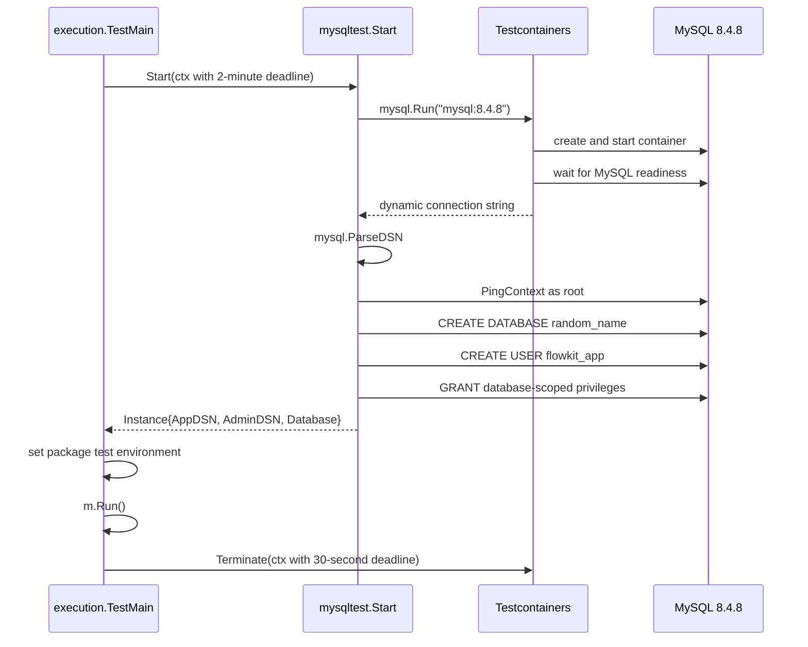
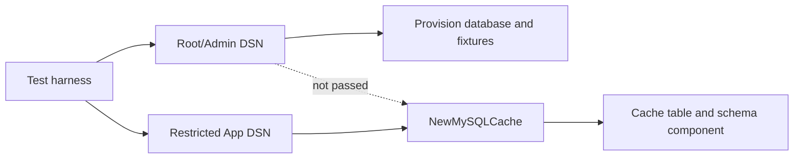

# Flowkit MySQL Cache Testing with Testcontainers

Flowkit's `execution.Cache` stores completed results from expensive deterministic work. The file implementation already had a strict contract: a cache entry contains a schema identifier, the complete semantic key, a digest of the serialized value, and the value itself. PR #4 added a MySQL implementation. Testing that adapter required more than confirming that `INSERT` and `SELECT` execute. The test suite had to establish MySQL-specific identity, capacity, DDL, locking, restart, corruption, and privilege behavior while remaining isolated from persistent developer databases.

This report explains the resulting Testcontainers design as an implementation of a verification boundary. The test process owns a disposable MySQL 8.4.8 server and administrative setup. The adapter receives a restricted application credential. The test suite exercises the same envelope contract as `FileCache`, verifies exact SQL representation, forces schema recovery states, and runs in hosted CI with no external DSN or Compose dependency.

> [!summary]
> - Testcontainers supplies a disposable real MySQL process, dynamic endpoint discovery, readiness coordination, and termination. Flowkit still defines database freshness, credentials, schema fixtures, and pass/fail policy.
> - The adapter and the fixture code use different credentials. The restricted application DSN enters `NewMySQLCache`; the administrator DSN remains in test support.
> - One package-owned container amortizes startup. Random database state and per-test component identities preserve repeatability.
> - Real MySQL tests exposed errors that Docker-free tests could not: shared schema-registry races, identifier case rules, implicit DDL commit recovery, reserved-word quoting, and storage length mismatches.
> - The hosted job explicitly enables Testcontainers and therefore fails when MySQL cannot start. Ordinary unit runs remain Docker-free.

## 1. The contract being tested

The interface is small:

```go
type Cache interface {
    Load(context.Context, Key, any) (bool, error)
    Store(context.Context, Key, any) error
}
```

The observable contract is larger. A backend must preserve all of the following:

1. `Key` validation and digest computation.
2. Strict schema identity.
3. Full-key validation after lookup.
4. Value-digest validation before decoding.
5. Strict JSON decoding into the caller's target.
6. A distinction between a missing entry and a corrupt entry.
7. The configured maximum entry size on writes and existing reads.
8. Durable visibility after `Store` returns successfully.
9. Exact equality for storage identities.
10. Valid behavior after closing and reopening the connection pool.

A mock can validate call order. SQLite can validate a second SQL implementation. Neither can establish MySQL's behavior for `VARBINARY`, `MEDIUMTEXT`, `information_schema`, advisory locks, implicit DDL commits, quoted identifiers, or `ON DUPLICATE KEY UPDATE`.

The integration strategy therefore starts from the contract rather than from container startup. Testcontainers is useful because these claims require a real engine and because that engine must be owned by the test invocation.

## 2. Why an external DSN was insufficient

The original tests accepted `FLOWKIT_MYSQL_CACHE_DSN` and skipped when it was absent. This supported manual tests against a local MySQL service, but the DSN carried no ownership information. It did not answer whether the server was disposable, whether the database was fresh, which privileges were available, or whether another repository used the same persistent volume.

A persistent external database introduced four sources of nondeterminism:

| Source | Observable failure |
|---|---|
| Stable test table names | Raw fixture inserts encountered rows from previous runs. |
| Persistent schema | A test intended to exercise fresh initialization opened an already-created table. |
| Shared administration | Tests were tempted to run the adapter with root-level authority. |
| Optional CI configuration | Hosted tests passed while skipping every MySQL assertion. |

Deleting rows before a test solves only the first problem. It does not restore an absent version registry, remove incompatible columns, reproduce initial DDL, or prevent another process from changing the database concurrently.

The required path now has an explicit implication:

```text
FLOWKIT_MYSQL_TESTCONTAINERS=1
    ⇒ create a fresh test-owned MySQL server
    ⇒ provision a random database and restricted user
    ⇒ run the MySQL tests
    ⇒ terminate the server

Provisioning failure
    ⇒ package test failure
```

External DSN mode remains useful for diagnosis against a chosen server. It is not the hosted correctness gate.

## 3. The lifecycle boundary

The reusable helper is located at:

```text
internal/testsupport/mysqltest/mysqltest.go
```

Its public result is deliberately small:

```go
type Instance struct {
    Container testcontainers.Container
    AppDSN    string
    AdminDSN  string
    Database  string
}
```

The fields describe separate capabilities. `Container` represents lifecycle ownership. `Database` identifies the fresh logical database. `AppDSN` is the only credential passed to the cache adapter. `AdminDSN` is reserved for fixture construction and schema-state manipulation.

### 3.1 Startup sequence



The image is pinned to `mysql:8.4.8`. A floating image tag would make engine behavior change independently from the repository commit. Testcontainers maps a random host port, so the test cannot collide with a local MySQL service on port 3306. The helper does not request a fixed name, persistent volume, bind mount, or reuse mode.

### 3.2 Readiness and connection validation

Container start and SQL readiness are different states. The MySQL module waits for its engine-specific readiness condition. The helper then obtains the actual mapped endpoint and calls `PingContext` through `database/sql` before provisioning.

```go
baseDSN, err := container.ConnectionString(ctx, "parseTime=true")
baseConfig, err := mysql.ParseDSN(baseDSN)

adminDB, err := sql.Open("mysql", adminConfig.FormatDSN())
if err := adminDB.PingContext(ctx); err != nil {
    return nil, fmt.Errorf("mysqltest: ping admin connection: %w", err)
}
```

Parsing and formatting with `mysql.Config` preserves driver-specific encoding and query parameters. Building DSNs through string concatenation would add avoidable cases involving passwords, network addresses, and option delimiters.

### 3.3 Cleanup on every owned path

The helper terminates the container if provisioning fails after startup. `TestMain` terminates it after `m.Run`. A cleanup error changes an otherwise successful package result to failure. Testcontainers' resource reaper remains enabled as a secondary process-failure cleanup mechanism.

```text
explicit Terminate = normal lifecycle contract
resource reaper     = abnormal-process safety mechanism
```

Neither mechanism justifies container reuse. The tests intentionally destroy the entire environment because no data in it is authoritative.

## 4. Split authority

The harness creates a random database and a random application password. The application user receives only database-scoped privileges required by the current adapter:

```sql
GRANT SELECT, INSERT, UPDATE, DELETE,
      CREATE, ALTER, INDEX, DROP
ON `flowkit_test_<random>`.*
TO 'flowkit_app'@'%';
```

The root connection creates the database and user. The adapter never receives that connection.



This separation matters even when Flowkit's current cache tests do not need trigger creation. Schema-state tests deliberately create incomplete or malformed database states. If those operations enter production adapter APIs, the API acquires authority solely for testing. The split keeps fixture power outside the runtime object.

The grant list is not permanent architecture. `CREATE`, `ALTER`, and `DROP` are present because `NewMySQLCache` currently initializes and validates schema. If deployment later moves schema changes to a migration identity, the application grant and Testcontainers helper should be reduced together.

## 5. Package-scoped container ownership

Flowkit starts one MySQL container for the `execution` package invocation. It does not start one container per test.

The scope choice balances two constraints:

- MySQL startup takes several seconds, so per-test containers would dominate package runtime.
- Cross-invocation state must be impossible, so a reusable external server is not acceptable for required validation.

`execution/mysql_testmain_test.go` owns the lifecycle:

```go
func TestMain(m *testing.M) {
    var instance *mysqltest.Instance
    if os.Getenv("FLOWKIT_MYSQL_TESTCONTAINERS") == "1" {
        ctx, cancel := context.WithTimeout(context.Background(), 2*time.Minute)
        instance, err = mysqltest.Start(ctx)
        cancel()
        if err != nil {
            fmt.Fprintf(os.Stderr, "start disposable flowkit test MySQL: %v\n", err)
            os.Exit(1)
        }
        os.Setenv("FLOWKIT_MYSQL_CACHE_DSN", instance.AppDSN)
        os.Setenv("FLOWKIT_MYSQL_TEST_ADMIN_DSN", instance.AdminDSN)
    }

    code := m.Run()
    // bounded explicit termination; cleanup failure changes code to 1
    os.Exit(code)
}
```

Within the package, tests use distinct cache table names. Names are derived from the test name, truncated to respect MySQL's 64-character identifier limit, and suffixed with a short SHA-256 fragment. This preserves diagnostic readability without allowing long Go test names to invalidate SQL identifiers.

```go
name := sanitizeForTable(t.Name())
if len(name) > 40 {
    name = name[:40]
}
return fmt.Sprintf("cache_test_%s_%s", name, digest[:8])
```

Cleanup removes each component row and table. The container boundary remains the final isolation guarantee if test cleanup does not run.

## 6. What real MySQL discovered

The disposable path did more than reproduce existing tests. It exposed defects in the migration and test design.

### 6.1 Per-table locks did not protect a shared registry

Each configured cache table has a separate component identity, but every component shares `flowkit_schema_version`. The first concurrent Testcontainers run produced:

```text
Error 1050 (42S01): Table 'flowkit_schema_version' already exists
Error 1213 (40001): Deadlock found when trying to get lock
```

The initial advisory lock was derived from the cache table name. Two constructors for different tables acquired different locks and raced on the shared registry. The corrected lock is derived from the selected database, serializing every mutation of the database-level schema registry.

The lock is acquired and released through one dedicated `*sql.Conn` because MySQL advisory locks are connection-scoped:

```go
conn, err := db.Conn(ctx)
lockName := mysqlCacheMigrationLock(database)
conn.QueryRowContext(ctx, "SELECT GET_LOCK(?, 30)", lockName)

defer conn.QueryRowContext(
    context.Background(),
    "SELECT RELEASE_LOCK(?)",
    lockName,
)
```

Using `*sql.DB` independently for acquire, DDL, and release could route operations to different physical sessions.

### 6.2 DDL commits created an interruption state

MySQL implicitly commits `CREATE TABLE`. A process can therefore create the cache table and terminate before inserting the schema-version row. Rejecting every table without a component record would strand work created by the current initializer. Adopting every such table would accept unknown prototypes.

Flowkit records version `0` before table creation:

```text
component absent, table absent
    → INSERT component version 0
    → CREATE TABLE
    → verify exact v1 shape
    → UPDATE version 0 to 1
```

A retry can interpret version `0` as incomplete work owned by this protocol. It creates a missing table or verifies an existing one, then finalizes version 1. A table with no component marker remains unknown and fails closed.

The Testcontainers test creates the marker and exact table manually, simulating termination after DDL's implicit commit. A new constructor must recover and promote the component to version 1.

### 6.3 Metadata lookup required exact table identity

On Linux MySQL with `lower_case_table_names=0`, quoted identifiers are case-sensitive. `information_schema.tables.table_name = ?` can still use case-insensitive comparison semantics. `CacheCaseUpper` and `cachecaseupper` could therefore be confused during migration inspection.

The query now states its identity law explicitly:

```sql
SELECT COUNT(*)
FROM information_schema.tables
WHERE table_schema = DATABASE()
  AND BINARY table_name = BINARY ?;
```

The real-engine test creates both names and verifies that two distinct tables exist.

### 6.4 Reserved words required quoting as well as validation

A restricted identifier regular expression prevents SQL structure injection, but valid identifiers can still be reserved words. The table name `select` passes an ASCII identifier grammar and fails when interpolated unquoted.

Flowkit now applies both controls:

1. validate a bounded identifier alphabet and length;
2. quote every accepted identifier with backticks.

Validation controls what syntax the application accepts. Quoting ensures that accepted identifiers are parsed as identifiers.

### 6.5 Storage limits had to match the public key contract

`Key.Step` and `Key.Version` have no 255-character limit. A `VARCHAR(255)` SQL schema therefore rejected keys accepted by `FileCache`. The MySQL adapter now stores these metadata fields as `MEDIUMTEXT`. The total envelope remains bounded by `MaxEntryBytes`, so the backend preserves valid keys without removing resource limits.

A 1,024-character real-engine round trip verifies this contract.

## 7. The test matrix

The MySQL tests are organized around behavioral claims rather than SQL line coverage.

| Test class | Claim established |
|---|---|
| Round trip | A stored envelope is durably loadable through exact key identity. |
| Missing key | Absence returns `(false, nil)`. |
| Corruption | Present invalid data returns `ErrCorruptCache`. |
| Oversized existing row | Load enforces the configured resource bound. |
| File/MySQL compatibility | Both backends interpret identical envelope bytes. |
| Concurrent duplicate store | One content-addressed key produces one row under concurrent calls. |
| Restart | A fresh pool observes previously committed data. |
| Long key metadata | MySQL accepts keys valid under the shared `Key` API. |
| Exact SQL schema | Digest and metadata columns implement intended identity and capacity. |
| Unversioned prototype | Unknown pre-marker schema fails closed. |
| Initialization recovery | Version-0 state resumes after DDL commit interruption. |
| Case-distinct tables | Migration inspection matches runtime identifier semantics. |

The integration command runs the package twice:

```bash
FLOWKIT_MYSQL_TESTCONTAINERS=1 \
GOWORK=off go test -p 1 -count=2 ./execution
```

`-count=2` detects cleanup and repeated-run assumptions. `GOWORK=off` verifies the module's declared dependency graph rather than local workspace replacements.

## 8. Hosted CI as part of the contract

The workflow `.github/workflows/mysql-integration.yml` sets the Testcontainers flag explicitly:

```yaml
- name: Run real MySQL integration tests
  env:
    FLOWKIT_MYSQL_TESTCONTAINERS: "1"
  run: |
    set -euo pipefail
    GOWORK=off go test -p 1 -count=2 ./execution
```

Without the flag, local unit runs can skip MySQL tests when no external DSN is available. With the flag, startup failure exits `TestMain` before tests run. This prevents a required integration check from passing by omission.

The hosted matrix also runs dependency review. Adding Testcontainers introduced a transitive `github.com/moby/go-archive v0.2.0` dependency with a high-severity path traversal advisory. `govulncheck` did not report a reachable vulnerable symbol, but dependency review correctly rejected the module addition under repository policy. Flowkit pinned `moby/go-archive v0.3.0`, the patched release.

The Go toolchain directive was also raised from 1.26.5 to 1.26.6 after `govulncheck` found reachable standard-library vulnerabilities fixed in 1.26.6. Test infrastructure dependencies and toolchains are part of the security boundary even when they do not ship in the application's runtime path.

## 9. Testcontainers responsibilities and repository responsibilities

A useful review separates what the library guarantees from what Flowkit must guarantee.

| Concern | Testcontainers | Flowkit |
|---|---|---|
| Container creation | Starts Docker resources from a requested image. | Pins `mysql:8.4.8` and defines startup timeout. |
| Readiness | Applies the MySQL module wait strategy. | Verifies the exact DSN with `PingContext`. |
| Endpoint | Reports the dynamically mapped address. | Parses and derives admin/application DSNs safely. |
| Cleanup | Exposes termination and runs the resource reaper. | Registers explicit bounded cleanup and forbids reuse/mounts. |
| Freshness | Supplies a new container filesystem. | Creates a random database and per-test component identities. |
| Privileges | Supplies configured root credentials. | Creates a restricted app user and keeps admin authority in tests. |
| Schema proof | Runs real MySQL statements. | Defines version states, structural checks, and recovery fixtures. |
| CI policy | Can run on Docker-capable hosts. | Enables the path explicitly and treats provisioning failure as failure. |

This distinction prevents two incorrect conclusions. A disposable container does not by itself prove least privilege. A real MySQL process does not by itself prove schema correctness. Those properties come from the repository's provisioning and assertions.

## 10. Failure modes and corrections

### Tests mutate a persistent database

**Cause:** An external DSN points at a Compose database or shared developer server.

**Correction:** Use the explicit Testcontainers mode for required tests. Do not configure mounts, reuse, fixed names, or fixed ports.

### Integration tests pass without running MySQL

**Cause:** Tests skip when no DSN is configured and CI does not select a required provisioning mode.

**Correction:** Set `FLOWKIT_MYSQL_TESTCONTAINERS=1` in a dedicated required workflow. Startup errors terminate the package with a nonzero result.

### Different constructors race on schema setup

**Cause:** Lock scope follows one component table while components share a version registry.

**Correction:** Scope the lock to the selected database and perform every registry/DDL operation through one connection.

### A crash strands an unversioned table

**Cause:** Table creation commits before version insertion.

**Correction:** Persist version `0` before DDL, verify the completed shape, and promote to version 1.

### Tests run the adapter as root

**Cause:** One DSN is used for both provisioning and runtime behavior.

**Correction:** Derive separate administrator and application DSNs. Pass only the restricted DSN to `NewMySQLCache`.

### Long valid keys fail only in MySQL

**Cause:** SQL metadata columns add a backend-only length limit.

**Correction:** Align SQL representation with the shared key contract and retain one explicit total envelope limit.

### Dependency review rejects test infrastructure

**Cause:** A transitive dependency introduced by Testcontainers violates repository security policy.

**Correction:** inspect the advisory, pin the patched transitive version when compatible, rerun dependency review, `govulncheck`, and the real-engine suite.

## 11. Extending the design

The current harness supports one package database. The next useful extension is a fixture API for additional random databases. That would let tests construct unsupported versions, version-1 rows with missing tables, and malformed tables without mutating the package's primary database.

A possible interface is:

```go
type Database struct {
    Name     string
    AppDSN   string
    AdminDSN string
}

func (i *Instance) CreateDatabase(ctx context.Context) (*Database, error)
func (i *Instance) DropDatabase(ctx context.Context, db *Database) error
```

The helper should continue to generate identifiers internally and derive DSNs with `mysql.Config`. It should not accept arbitrary SQL identifiers from tests without validation and quoting.

Operational telemetry is the second extension. A production MySQL cache should report:

- hit, miss, and corrupt-entry counts;
- query duration by operation;
- pool wait duration and open/in-use connections;
- schema initialization duration and lock timeout;
- entry size distribution;
- store conflicts or overwrites for one semantic key.

Testcontainers can validate metric emission, but it does not determine metric semantics.

Batch loading is a separate API question. A 114,000-key workload can make one SQL query per cache key even when every query is correct. Any `BatchLoad` extension must preserve per-entry envelope validation and partial error reporting. Performance should not weaken the evidence contract.

## 12. Review procedure

A reviewer can reconstruct the design in this order:

1. Read `execution/cache.go` to identify the reference envelope and corruption behavior.
2. Read `execution/mysql_cache.go` from constructor through `migrate`, then `Load` and `Store`.
3. Inspect `internal/testsupport/mysqltest/mysqltest.go` for image pinning, random endpoint/database, grants, and cleanup.
4. Inspect `execution/mysql_testmain_test.go` for explicit mode selection and failure behavior.
5. Read the schema, interruption, identity, restart, and compatibility tests in `execution/mysql_cache_test.go`.
6. Confirm `.github/workflows/mysql-integration.yml` sets the Testcontainers flag and uses `GOWORK=off`.
7. Check `go.mod` for Testcontainers `v0.44.0`, Go 1.26.6, and patched `moby/go-archive v0.3.0`.

Run:

```bash
cd /home/manuel/workspaces/2026-08-13/ragkit-coinvault-mysql/flowkit

FLOWKIT_MYSQL_TESTCONTAINERS=1 \
GOWORK=off go test -p 1 -count=2 ./execution

GOWORK=off go test ./... -count=1
GOWORK=off go vet ./...
GOWORK=off go mod verify
GOWORK=off govulncheck ./...
golangci-lint run
make logcopter-check
```

The local and hosted versions of these gates passed for commit `ce40a382cc555cc73487512ee0f8cc21fecc54d4`.

## 13. Working rules

The design can be reduced to a small set of rules:

1. Use a real engine for engine-specific contracts.
2. Let the test invocation own the server lifecycle.
3. Keep persistent developer state outside required integration tests.
4. Pass production-shaped credentials to production code.
5. Retain administrative authority in test support.
6. Pin the container image, Go module, toolchain, and vulnerable transitive fixes.
7. Treat readiness, provisioning, test execution, and cleanup as separate failure stages.
8. Model schema initialization as explicit durable states.
9. Hold connection-scoped database locks on one physical connection.
10. Make hosted integration tests fail when provisioning cannot run.
11. Preserve the reference adapter's equality, length, corruption, and durability semantics.
12. Record what MySQL proves and what remains Aurora-specific.

## 14. Relationship to the Architecture Garden

This project report provides implementation depth for three smaller reusable design entries:

- [[Research/Software Architecture Garden/flowkit/designs/01 - Validated Envelopes Preserve Cache Meaning Across Backends|Validated Envelopes Preserve Cache Meaning Across Backends]] defines the cross-backend cache evidence contract.
- [[Research/Software Architecture Garden/flowkit/designs/02 - Initialization Markers Make Implicit DDL Commits Recoverable|Initialization Markers Make Implicit DDL Commits Recoverable]] defines the version-zero schema state machine and database-scoped lock.
- [[Research/Software Architecture Garden/flowkit/designs/03 - Test-Owned Databases Separate Runtime and Fault Authority|Test-Owned Databases Separate Runtime and Fault Authority]] defines lifecycle ownership and credential separation.

The earlier [[Research/2026/08/18/ARTICLE - Testcontainers MySQL Integration Testing in Go|Testcontainers MySQL Integration Testing in Go]] report develops the same lifecycle around Pinocchio's transactional TurnStore. The Flowkit implementation adds evidence for shared schema-registry races, recoverable implicit DDL commits, exact table-name inspection, and test-dependency vulnerability policy. Together, the two implementations move the split-authority disposable-database pattern beyond one adapter.

## 15. References

### Flowkit implementation

- PR #4: https://github.com/go-go-golems/flowkit/pull/4
- Architecture issue #5: https://github.com/go-go-golems/flowkit/issues/5
- Architecture issue #6: https://github.com/go-go-golems/flowkit/issues/6
- Architecture issue #7: https://github.com/go-go-golems/flowkit/issues/7
- `execution/cache.go`
- `execution/mysql_cache.go`
- `execution/mysql_cache_test.go`
- `execution/mysql_testmain_test.go`
- `internal/testsupport/mysqltest/mysqltest.go`
- `.github/workflows/mysql-integration.yml`
- `go.mod`

### Key commits

- `13267a4f8f429a19c4608848aaa6be1557ad3716` — disposable Testcontainers harness.
- `6d5ea46` — exact, versioned cache schema.
- `e67246d` — required disposable MySQL workflow.
- `414e64cc297eeeedf5672a5cd6fe2151333b5be8` — Go 1.26.6 security update.
- `597d30773e35e09aea8ede15ceabe5972e3802ef` — patched Testcontainers archive dependency.
- `ce40a382cc555cc73487512ee0f8cc21fecc54d4` — recoverable initialization and exact table identity.

### Public documentation

- Testcontainers for Go MySQL module: https://golang.testcontainers.org/modules/mysql/
- Testcontainers garbage collection: https://golang.testcontainers.org/features/garbage_collector/
- Testcontainers wait strategies: https://golang.testcontainers.org/features/wait/introduction/
- Testcontainers common options: https://golang.testcontainers.org/features/common_functional_options/
- Testcontainers Go repository: https://github.com/testcontainers/testcontainers-go
- MySQL Docker image: https://hub.docker.com/_/mysql/
- GHSA-hfg8-hc9c-6c3h: https://github.com/advisories/GHSA-hfg8-hc9c-6c3h
