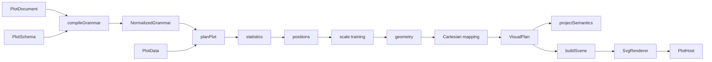
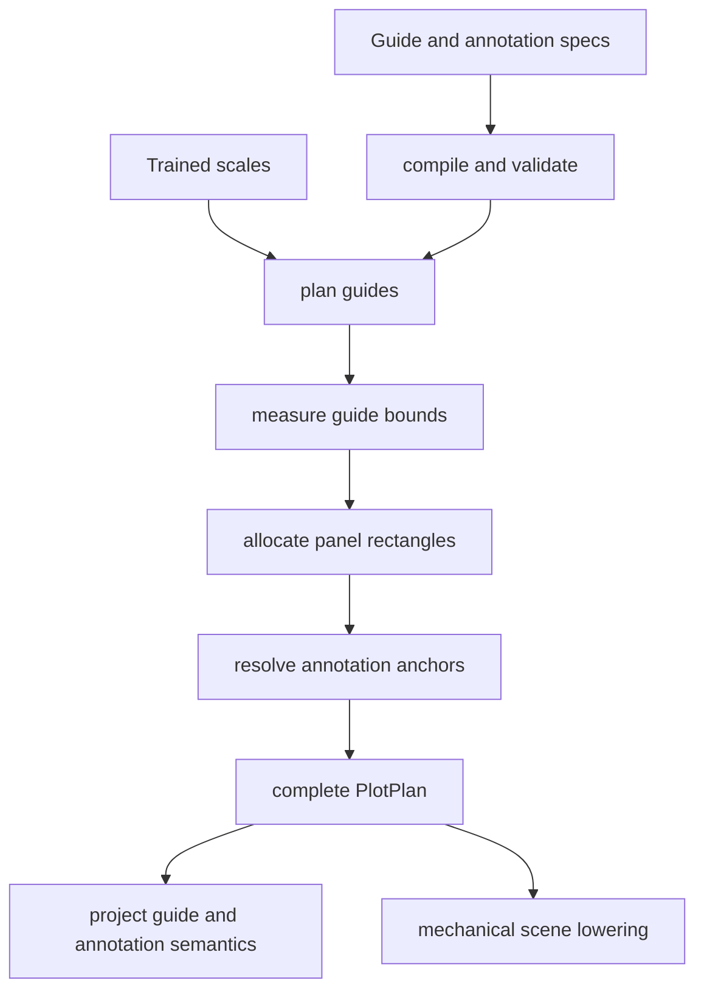
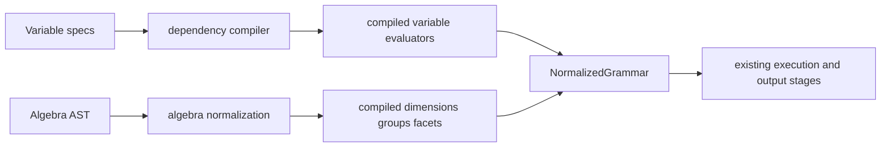
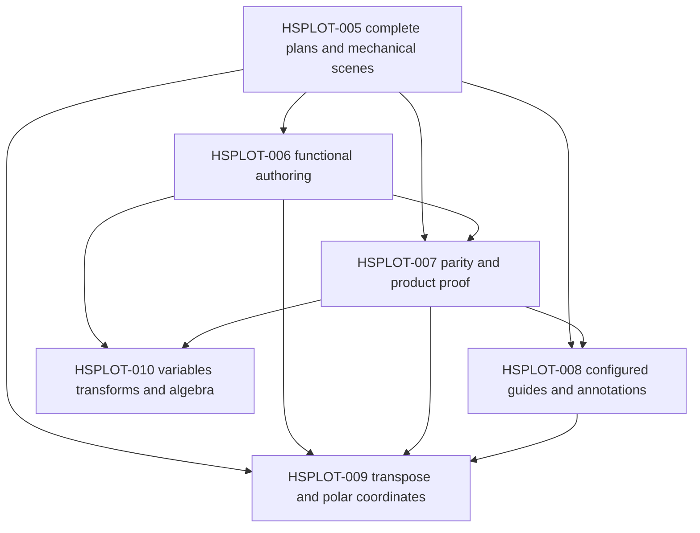

# From Canonical Grammar to Plot Algebra: A Deep Technical Analysis

`@hyperslop-systems/plot` is becoming a compiler for statistical graphics rather than a collection of chart components. Its public input is a serializable document. Its internal boundary is a deterministic normalized grammar. Its execution stages compute statistics, grouping, positions, scales, geometry, and Cartesian coordinates. Its outputs include a visual plan, a renderer-neutral scene, structured semantics, and diagnostics. React is a host for one renderer, not the center of the architecture.

This report explains the system that exists after HSPLOT-003 and HSPLOT-004, then develops the engineering program defined by HSPLOT-005 through HSPLOT-010. The central question is not how to add six sets of features. It is how to add presentation composition, authoring convenience, consumer parity, configured guides, annotations, new coordinates, derived variables, and algebra without weakening the compiler boundaries already established.

> [!summary]
> - The package has one canonical JSON-safe grammar and one normalized compiler boundary. Every new authoring surface must target that grammar, and every execution feature must consume normalized contracts.
> - HSPLOT-005 is the next architectural correction: guide existence, guide geometry, compact layout, and frame presence must be planned before scene construction.
> - HSPLOT-006 through HSPLOT-010 must extend the system by construction or compilation, not by adding chart names, renderer policy, hidden inference, or alternate pipelines.
> - Structured semantics is a first-class output. Visible SVG cannot be the only record of variables, groups, statistical methods, coordinate meaning, annotations, or data coverage.

## 1. The project problem

A statistical graphic contains several kinds of decisions. Data variables identify values. Composition assigns variables to dimensions, groups, and facets. Statistics derive values. Scales map domains into aesthetic ranges. Geometry determines graphical forms. Coordinates map normalized geometry into a display frame. Guides explain scales. Layout allocates space. A scene records concrete drawing primitives. A renderer paints those primitives. An application supplies domain data and owns product state.

The system becomes difficult to extend when one phase silently performs work owned by another. A color mapping that also decides statistical grouping is one example. An SVG scene builder that creates axes by inspecting scales is another. A sparkline component that bypasses ordinary line geometry is a third. Each shortcut reduces the number of explicit inputs, but it also introduces behavior that cannot be inspected, serialized, validated, or reused independently.

Hadley Wickham states the purpose of a grammar directly:

> “A grammar of graphics is a tool that enables us to concisely describe the components of a graphic. Such a grammar allows us to move beyond named graphics.”
> — *A Layered Grammar of Graphics*, abstract

The phrase “move beyond named graphics” has a concrete consequence for this package. A histogram is not selected by a `chartType: "histogram"` branch. It is a bin statistic, a named `count` output, a positional composition, a bar geometry, and scales. A sparkline is not a geometry. It is an ordinary line document with compact presentation. A polar interval graphic is not a pie-chart branch. It is interval geometry transformed by a polar coordinate system.

The architecture must also support automation. A document should survive JSON round trips. A diagnostic should point to a stable document path. Equal inputs should produce equal normalized grammar, semantics, and scenes. Package consumers should be able to construct documents without React, inspect them before rendering, store them, compare them, and send them across process boundaries.

These requirements produce five project-level constraints:

1. **One public data model.** Literal JSON, functional helpers, presets, and future fluent APIs must construct the same `PlotDocument`.
2. **One compiler.** Every document passes through `compileGrammar`; no preset or consumer receives a private fast path.
3. **Explicit execution contracts.** Statistics, positions, scales, geometry, coordinates, guides, layout, semantics, and scene lowering communicate through typed values.
4. **Renderer neutrality below the host.** No React element, DOM measurement, SVG selection, or CSS object enters the canonical document or normalized grammar.
5. **Evidence-backed evolution.** New grammar variants require exact diagnostics, deterministic tests, representative consumers, package builds, and rendered inspection.

## 2. Current state: what HSPLOT-003 and HSPLOT-004 established

The current package already contains the most important architectural replacement. HSPLOT-003 removed the legacy mapping bag and created a canonical document with variables, explicit composition, typed layers, scales, Cartesian coordinates, presentation intent, resource limits, and metadata. HSPLOT-004 made the execution pipeline consume the normalized grammar and added renderer-neutral `PlotSemantics`.

The final HSPLOT-003/HSPLOT-004 audit records 88 passing tests across 16 files, package and Storybook builds, a clean tarball consumer, deterministic round trips, architecture guards, and rendered inspection. The supported behavior includes point, line, bar, area, ribbon, rule, error-bar, and boxplot geometry; identity, summary, bin, OLS, boxplot, and density statistics; identity, stack, fill, dodge, and jitter positions; fixed and free facets; temporal and aesthetic scales; bounded data coverage; and slope-plot parity.

The current pipeline is:



This diagram contains two important qualifications. First, `planPlot` still orchestrates several stage modules and retains substantial layout and guide logic in one file. Second, `buildScene` still creates title, axes, grids, legends, and the background instead of lowering a complete plan. HSPLOT-005 addresses those remaining presentation responsibilities.

### 2.1 The public document is plain data

The central surface type is `PlotDocument`:

```ts
export interface PlotDocument {
  readonly format: "hyperslop.plot";
  readonly version: 1;
  readonly id: PlotId;
  readonly description?: string;
  readonly variables: Readonly<Record<VariableId, VariableSpec>>;
  readonly composition: CompositionSpec;
  readonly layers: readonly LayerSpec[];
  readonly scales?: ScaleMap;
  readonly coordinate?: CoordinateSpec;
  readonly presentation?: PresentationSpec;
  readonly limits?: RenderLimits;
  readonly metadata?: Readonly<Record<string, JsonValue>>;
}
```

Every field is JSON-safe. IDs are branded strings at TypeScript compile time and ordinary strings at runtime. Variable specifications currently represent schema fields and primitive constants. `ValueRef` can name a variable, a layer-owned statistic output, or a primitive constant. Layers contain explicit statistic, geometry, position, optional composition overrides, and aesthetic mappings.

The document-level composition defines defaults:

```ts
export interface CompositionSpec {
  readonly dimensions: {
    readonly x?: ValueRef;
    readonly y?: ValueRef;
  };
  readonly groups?: readonly ValueRef[];
  readonly facets?: FacetComposition;
}
```

A layer override has three states for each positional dimension:

| Surface state | Meaning |
|---|---|
| Property absent | Inherit the document default. |
| `ValueRef` present | Replace the document default for the layer. |
| `null` present | Clear the document default for the layer. |

The explicit clear matters for a one-dimensional rule layer inside a two-dimensional plot. Without it, the compiler would need geometry-specific inheritance exceptions. With it, the document states the effective frame directly.

### 2.2 Composition and appearance are separate

Groups and facets are not aesthetic channels. Color does not create series identity. A grouped line that uses color for display declares the same variable in two places because those declarations answer different questions:

```ts
composition: {
  dimensions: {
    x: { kind: "variable", variable: at },
    y: { kind: "variable", variable: value },
  },
  groups: [{ kind: "variable", variable: treatment }],
},
layers: [{
  id: layerId("trend"),
  mapping: {
    color: { kind: "variable", variable: treatment },
  },
  stat: { kind: "identity" },
  geom: { kind: "line" },
  position: { kind: "identity" },
}],
```

The first reference decides which rows form one line. The second decides stroke color. A caller may group without color, color without grouping, or use different variables for the two roles. This removes an undocumented dependency between appearance and statistical execution.

### 2.3 The compiler resolves one deterministic IR

`compileGrammar(document, schema)` validates format, version, IDs, variables, references, statistic outputs, layer compatibility, scales, presentation, and limits. It returns `Result<NormalizedGrammar>` and structured diagnostics. Expected authoring failures do not throw.

The normalized grammar contains sorted compiled variables, an explicit default composition, fully resolved effective composition for each enabled layer, compiled scales, a coordinate, normalized presentation, and concrete limits:

```ts
export interface NormalizedGrammar {
  readonly documentId: PlotId;
  readonly description?: string;
  readonly variables: readonly CompiledVariable[];
  readonly defaultComposition: CompiledComposition;
  readonly layers: readonly CompiledLayer[];
  readonly scales: readonly CompiledScale[];
  readonly coordinate: CoordinateSpec;
  readonly presentation: CompiledPresentation;
  readonly limits: CompiledRenderLimits;
}
```

Variables are stored as a sorted array rather than a public `Map`, so normalized output remains deterministic under JSON serialization. Layers retain their original source index, so diagnostics continue to point to `layers[3]` even if disabled layers precede it. Every compiled layer owns its effective x dimension, y dimension, ordered groups, facets, statistic, geometry, position, and aesthetics.

After-stat references are validated against declarations in `stat-definitions.ts`. A bin layer may refer to `count`; a density layer may refer to `density`; an identity layer cannot claim either. Generated physical column names remain private to the statistic executor. Public contracts use named output descriptors and `statOutputValue`.

This boundary prevents the planner from interpreting surface syntax. `src/architecture.test.ts` verifies that planning and stage modules do not import `PlotDocument`. HSPLOT-010 must preserve that rule: algebra syntax lowers during compilation and cannot enter planning.

### 2.4 Execution is explicit and typed

The statistics stage receives a compiled layer and data. It partitions by explicit compiled groups and facets, executes the selected statistic, and returns named output descriptors, transformed rows, statistical metadata, and diagnostics. Typed group keys preserve variable identity, primitive type, and value. The values `1` and `"1"` do not collide, and two variables with equal display labels remain distinct.

The execution order is important:

```text
compiled layer
  -> typed group/facet partitions
  -> statistic execution
  -> named statistic outputs
  -> extraction into stage data
  -> position adjustment
  -> scale training
  -> geometry planning
  -> Cartesian device coordinates
```

Stage separation is present in `src/pipeline/groups.ts`, `positions.ts`, `scales.ts`, `geometry.ts`, and `coordinates.ts`, while `plan.ts` still owns orchestration and shared aesthetic training. The geometry module does not inspect title, axes, legends, grids, or presentation. Coordinate helpers currently perform Cartesian x/y mapping only.

### 2.5 Structured semantics is independent from drawing

`PlotSemantics` records the meaning of the result without parsing scene nodes. It contains semantic variables, effective layer composition, named statistic outputs and provenance, explicit groups, typed facet partitions, trained scale domains, units, timezones, coordinate identity, coverage, and non-error diagnostics.

This output is not generated from SVG. It is projected from normalized grammar and stage metadata:

```ts
export interface PlotOutcome {
  readonly grammar: NormalizedGrammar | null;
  readonly plan: VisualPlan | null;
  readonly scene: SceneGraph | null;
  readonly semantics: PlotSemantics | null;
  readonly diagnostics: readonly Diagnostic[];
}
```

A failed compilation returns diagnostics with all later outputs null. A failed plan retains the successful grammar but returns no scene or semantics. A successful result returns all five products. This deepest-successful-stage behavior gives callers precise failure context.

Semantics will become more important as visible chrome becomes optional. A 24-pixel sparkline cannot communicate variable units, grouping, missing intervals, or coverage through axes. Those facts still exist and must remain available to accessibility descriptions, inspectors, tests, and agent consumers.

## 3. The remaining architectural defect: presentation is not fully planned

The current `VisualPlan` is not complete. It requires a title string, requires an x/y axis tuple on every panel, exposes first-panel convenience fields, and represents only non-positional legends as top-level guides. It has no nullable title, no planned frame, no independent guide rectangles, and no explicit content or plot bounds.

Current layout uses fixed constants:

```ts
const left = 60;
const top = facets.length > 1 ? 60 : 48;
const right = 18 + legendWidth;
const bottom = 50;
const gapX = 38;
const gapY = 50;
```

It also rejects every viewport smaller than 160 × 120 before inspecting presentation. These rules preserve a conventional chart but make a 120 × 24 chrome-free plot impossible. Setting axis visibility in CSS would not recover the reserved pixels.

The larger problem is in `scene.ts`. `buildScene` creates:

- a full-viewport background rectangle;
- a title text node;
- x and y axis lines;
- y grid lines;
- x and y tick labels;
- x and y labels;
- facet strip labels;
- legend titles, swatches, and labels.

The scene builder therefore decides what explanatory components exist and where they go. It is not a mechanical conversion from planned nodes into drawing nodes. It also owns rule color and dash policy based on annotation intent.

This ownership prevents three required behaviors:

1. `presentation.xGuide = none` cannot remove the axis before layout.
2. `frame = none` cannot guarantee a chrome-free result because frame/background behavior is split across scene and host CSS.
3. New coordinate systems cannot plan coordinate-aware guides cleanly because scene lowering assumes Cartesian axis lines and ticks.

HSPLOT-005 must produce a complete plan. Every visible component and every rectangle must be decided before `buildScene` runs.

## 4. HSPLOT-005: composable guides, compact layout, and mechanical scenes

HSPLOT-005 is the foundation for every later ticket in this report. It implements the `Presence<T>` vocabulary already present in the surface document:

```ts
export type Presence<T> =
  | { readonly kind: "auto" }
  | { readonly kind: "none" }
  | { readonly kind: "configured"; readonly options: T };
```

`auto` preserves conventional behavior. `none` removes a component and its layout cost. `configured` supplies bounded options. The distinction is semantic, not stylistic. An omitted axis must not exist in the plan, scene, accessibility traversal, or reserved margin.

D3 documents an axis as a component that “renders human-readable reference marks for position scales.” This wording preserves the necessary dependency: the guide explains a scale, but the scale can continue mapping values when the guide is absent. The package must implement the same separation in its own pure planning model.

### 4.1 Resolve presentation before layout

The compiler currently normalizes missing presentation fields to `auto`. HSPLOT-005 adds a planning step that resolves each `auto` against normalized grammar and stage metadata:

```text
resolve title:
  auto       -> derived conventional title
  none       -> no title
  configured -> exact text

resolve positional guide:
  auto       -> present when the dimension and scale exist
  none       -> absent
  configured -> present with supported label/grid options

resolve aesthetic legend:
  auto       -> present for a meaningful mapped scale
  none       -> absent
  configured -> present with supported title options

resolve frame:
  auto       -> conventional frame/background behavior
  none       -> no frame component
  configured -> bounded frame options
```

Resolution must return data, not callbacks. It must be deterministic for equal grammar and stage inputs. Invalid configured options return source-addressed diagnostics.

### 4.2 Plan complete components

The target plan has explicit nullable components and measured bounds:

```ts
interface PlotPlan {
  readonly documentId: PlotId;
  readonly viewport: Viewport;
  readonly contentBounds: Rect;
  readonly plotBounds: Rect;
  readonly title: PlannedTitle | null;
  readonly guides: readonly PlannedGuide[];
  readonly frame: PlannedFrame | null;
  readonly panels: readonly PlannedPanel[];
  readonly semantics: PlotSemantics;
  readonly diagnostics: readonly Diagnostic[];
}
```

Axes and legends become variants of `PlannedGuide`. An axis stores its channel, side, label, tick data, grid lines, and bounds. A legend stores contributing channels, entries, orientation, title, and bounds. Facet strips become planned components rather than text created during scene traversal.

First-panel aliases such as `plan.panel`, `plan.axes`, and `plan.layers` should be removed. They encode an assumption that one panel is structurally privileged. Consumers can read `plan.panels[0]` when they explicitly need the first panel, while the public plan remains honest about multiplicity.

### 4.3 Measure only enabled components

The layout algorithm should validate finite positive viewport dimensions, resolve padding, measure enabled components, and diagnose non-positive remaining plot area. It should not impose a fixed conventional minimum.

Because the planner is renderer-neutral, initial text measurement uses deterministic metrics rather than browser layout:

```ts
interface LayoutMetrics {
  readonly titleHeight: number;
  readonly axisLabelHeight: number;
  readonly tickLabelHeight: number;
  readonly yTickLabelWidth: number;
  readonly facetStripHeight: number;
  readonly legendEntryHeight: number;
  readonly guideGap: number;
}
```

Centralizing these values is more important than obtaining perfect browser typography in this phase. Scattered margin constants make component omission impossible to reason about. A single metrics contract makes layout deterministic, testable, and replaceable by a future explicit measurement service without importing DOM state into the compiler.

The high-level algorithm is:

```text
validate finite positive viewport
resolve non-negative padding
compute content bounds
resolve title, axes, legends, frame, facet strips
measure only present components
allocate guide rectangles around the remaining plot bounds
if remaining plot width or height <= 0:
  return layout.insufficient-space
partition plot bounds into facet panels
finalize scale ranges for each panel
plan ticks, grids, strips, legends, and geometry
return complete plan
```

Omitting a legend should expand `plotBounds`. Omitting both axes should remove their margins. Facet strips should consume space only when facets exist. Free scales should train per panel after panel rectangles are known; fixed scales should share domains while using each panel’s device range.

### 4.4 Make scene construction mechanical

A mechanical scene builder switches only on planned node variants. It does not inspect normalized grammar, scale definitions, statistic kinds, presentation defaults, or field labels.

```text
buildScene(plan):
  lower frame when present
  lower title when present
  lower every planned guide
  for each panel:
    lower planned facet strip
    lower each planned geometry
  construct deterministic root and metadata
```

Architecture tests should forbid imports from `document.ts`, `compile.ts`, statistics, and scale training helpers in `scene.ts`. Tests should also construct synthetic plans directly and prove that scene output contains exactly the supplied guides. If a synthetic plan has no axes, the scene builder must not infer them from panel scales.

The SVG renderer remains a painter over `SceneNode`. It may switch on `circle`, `symbol`, `rect`, `path`, `line`, `text`, and `group`. It must not select chart families, guides, coordinate systems, or annotations from grammar data.

### 4.5 The compact acceptance proof

The decisive fixture is a 120 × 24 grouped line plot with two pixels of padding and no visible chrome:

```ts
presentation: {
  title: { kind: "none" },
  xGuide: { kind: "none" },
  yGuide: { kind: "none" },
  legends: { color: { kind: "none" } },
  frame: { kind: "none" },
  padding: 2,
}
```

The expected plot bounds are `(2, 2)` through `(118, 22)`. The scene contains ordinary line paths and no title, axis, grid, legend, frame, or background node. The document description and `PlotSemantics` still provide accessible meaning. Group gaps remain explicit through the composition group variable; no path crosses a segment boundary.

This test proves more than small rendering. It proves that presentation existence is represented before layout, scales operate without guides, line geometry is reusable, and the scene does not invent policy.

## 5. HSPLOT-006: a functional JavaScript authoring API

The canonical document is intentionally explicit. Application code should not need to repeat every discriminant by hand, but convenience must not create a second language or runtime. HSPLOT-006 adds pure constructor functions under `@hyperslop-systems/plot/author`.

Vega describes itself as a declarative JSON format for “creating, saving, and sharing interactive visualization designs.” Vega-Lite similarly uses a portable JSON syntax and compiles specifications to a lower-level Vega representation. The relevant property for this package is not API similarity. It is that authoring and serialization target one specification model.

### 5.1 Constructor functions return exact grammar objects

The API should contain functions and grouped constructor objects, not classes:

```ts
const document = plot({
  id: plotId("response-trend"),
  variables: {
    at: variable.field(fieldId("at")),
    response: variable.field(fieldId("response")),
  },
  composition: composition.cartesian({
    x: value.variable(variableId("at")),
    y: value.variable(variableId("response")),
  }),
  layers: [
    layer({
      id: layerId("trend"),
      stat: stat.identity(),
      geom: geom.line(),
      position: position.identity(),
    }),
  ],
});
```

`plot()` inserts format and version. `variable.field()` returns a `VariableSpec`. `value.afterStat("count")` returns a `ValueRef`. `geom.line()` returns the existing line variant. Constructors should derive option types from the canonical unions with `Extract`, which makes drift visible at compile time.

The helper output must satisfy four equalities:

1. It is deeply equal to the equivalent literal object.
2. JSON serialization and parsing preserve it.
3. `compileGrammar` produces the same normalized result and diagnostics.
4. `renderPlot` produces the same plan, semantics, and scene.

These are stronger guarantees than API snapshot tests because they prove the helper has no hidden execution behavior.

### 5.2 Do not accept callbacks

A row accessor such as `row => row.value` cannot be represented in JSON, assigned a stable identity, or evaluated by a non-JavaScript implementation. The author API should require field IDs and variable IDs. Derived computation remains upstream until HSPLOT-010 introduces a finite serializable expression language.

Observable Plot deliberately allows custom transforms and JavaScript accessors for an exploratory JavaScript environment. Its documentation says transforms derive data as part of a plot specification and that custom transforms can be implemented when built-ins are insufficient. That is a useful comparison, but this package has a different contract: documents must be portable data. It should adopt explicit transform concepts without adopting arbitrary functions in serialized grammar.

### 5.3 Keep the author entrypoint independent

The author entrypoint must not import React, React DOM, CSS, `PlotHost`, `SvgRenderer`, or application state. Package exports should remain separated:

| Subpath | Responsibility |
|---|---|
| `.` | Canonical contracts, compiler, execution, plan, semantics, scene, and `renderPlot`. |
| `./author` | Pure functions returning canonical document fragments and documents. |
| `./react` | React host and SVG renderer integration. |
| `./styles.css` | Optional plot styles. |

A packed-package test must import `./author` from plain JavaScript, construct and serialize documents, compile them, and render through the core. Bundle/import analysis must prove that using core plus authoring does not pull React or CSS.

### 5.4 Presets are explicit expansions

The sparkline preset is the strongest authoring test:

```ts
const preset = sparkline({
  id: plotId("job-progress"),
  description: "Durable job progress over time.",
  x: { id: variableId("at"), fieldId: fieldId("at") },
  y: { id: variableId("fraction"), fieldId: fieldId("fraction") },
  group: { id: variableId("segment"), fieldId: fieldId("segment") },
  yDomain: [0, 1],
  padding: 2,
});
```

The returned value is an ordinary line document with explicit group identity and compact presentation. Tests compare it with an independently written literal document. Code searches forbid a `sparkline` discriminant in statistics, geometry, normalized grammar, planning, scene, and renderer modules.

A preset may derive readable child IDs from its required document ID. It must not mint random IDs, maintain a registry, mutate global defaults, or call `renderPlot` implicitly.

## 6. HSPLOT-007: parity, product proof, and hardening

A grammar architecture is not complete when synthetic package tests pass. It must express existing application graphics without reintroducing hidden conventions. HSPLOT-007 ports the package fixtures and known consumers, proves the compact progress case, records accessibility behavior, and measures performance before optimization.

### 6.1 Parity means semantic equivalence

The old document shape is not a compatibility target. Parity compares:

- source variables and stable IDs;
- explicit group and facet identity;
- statistic methods, parameters, outputs, and numeric results;
- trained domains and scale families;
- geometry and mark counts;
- coverage notices and accessible descriptions;
- application interactions attached to marks;
- visible output where pixels express required behavior.

It does not require identical obsolete JSON or fixed margins. HSPLOT-005 will intentionally change compact layout geometry while preserving conventional `auto` output.

### 6.2 Datalab is the broad grammar consumer

The Datalab adapter covers identity plots, histograms, summary intervals, OLS ribbons, boxplots, density, facets, color groups, reference rules, scale choices, and bounded results. Porting it requires explicit variables, document composition, layer composition overrides, aesthetic mappings, and presentation.

The port must not recreate `inheritMapping`, infer `group = color`, or infer facets from channels. If a consumer requires a grammar concept that does not exist, the correct result is a documented package requirement and a focused implementation. A product-specific compiler branch would make package tests less representative and future consumers less predictable.

### 6.3 RAG-TTC demonstrates compact operational history

RAG-TTC owns durable progress semantics. Its `workGraph.ts` determines phase boundaries, resets, missing intervals, unknown totals, concurrent histories, and textual descriptions. The plot package should receive rows such as:

```ts
interface ProgressPlotRow {
  at: number;
  fraction: number;
  phase: string;
  segment: string;
}
```

Each contiguous segment becomes an explicit group. The plot package does not infer gaps from timestamps or operational phases. The application keeps exact current status, rate, ETA, staleness, unknown totals, and gap descriptions in text. The plot shows shape over time.

This division preserves domain ownership. The package understands temporal scales and group-separated paths. It does not understand jobs, phases, polling, terminal states, or durable sample custody.

### 6.4 Benchmark before caching

Rendering many compact plots may expose cost in document construction, compilation, statistic execution, scale training, scene creation, React mount, or serialized scene size. A benchmark should measure these stages separately with warmup, repeated samples, median, p95, standard deviation, node counts, and bytes.

The benchmark should include one, twenty, and one hundred distinct sparklines, plus repeated data against a reused grammar where the public phase API permits it. No cache should be added until measurements identify a repeated expensive stage and define stable cache identity and invalidation.

Reactive Vega demonstrates a much broader dataflow architecture in which “input data, scene graph elements, and interaction events are all treated as first-class streaming data sources.” That design is relevant background for future interaction work, but it does not justify introducing a reactive runtime into this static pure pipeline. HSPLOT-007 should measure the current pipeline before changing its execution model.

### 6.5 Hardening evidence

Completion requires package tests, Datalab tests/build/Storybook, RAG-TTC tests/build, packed consumer smoke, accessibility checks, benchmark artifacts, and rendered screenshots. Each application repository must preserve unrelated changes and receive its own focused commits. HSPLOT-007 remains responsible for the package release surface; product-specific progress implementation remains in its product ticket.

## 7. HSPLOT-008: configured guides and annotations

HSPLOT-005 establishes whether explanatory components exist. HSPLOT-008 expands what present guides can express and introduces stable annotations. The ticket guide is activation-gated because guide vocabularies can grow without limit. Implementation should start from concrete Datalab and product requirements, then expose only the accepted bounded options.

### 7.1 A scale is not a guide

A scale maps a domain to a range. A guide explains that mapping. Wickham writes:

> “Guides are either axes (for position scales) or legends (for everything else).”
> — *ggplot2: Elegant Graphics for Data Analysis*, grammar chapter

D3’s separate axis package reinforces the distinction. Vega-Lite’s encoding model also describes a scale and a guide as separate parts of an encoding. The package should retain scales even when a guide is absent, because marks still require mapping.

Configured axis options can include side, explicit or automatic ticks, format, label, and grid policy:

```ts
interface AxisGuideOptions {
  readonly label?: string;
  readonly side?: "top" | "right" | "bottom" | "left";
  readonly ticks?:
    | { readonly kind: "auto"; readonly count?: number }
    | { readonly kind: "values"; readonly values: readonly JsonPrimitive[] };
  readonly format?: FormatSpec;
  readonly grid?: "auto" | "none" | "major";
}
```

The scale retains domain, breaks, timezone, unit, and mapping semantics. The guide selects explanatory values and formatting. Explicit ticks outside a declared domain should produce a diagnostic. Unsupported axis sides under a coordinate system should produce a diagnostic rather than silently moving the axis.

Legend configuration includes title, orientation, order, reversal, and bounded entry count. Compatible legends may merge only when scale identity and ordered domains agree. Object iteration order must not affect guide order.

### 7.2 Annotations have stable identity

Annotations differ from scale guides because multiple independent annotations can coexist. Each annotation needs a stable ID, an anchor, a semantic intent, optional facet targeting, and bounded appearance:

```ts
interface AnnotationBase {
  readonly id: AnnotationId;
  readonly label?: string;
  readonly intent?: "reference" | "target" | "limit" | "note";
  readonly facets?: "all" | { readonly values: readonly JsonPrimitive[] };
}
```

Initial variants include rule, text, region, and point. The grammar should distinguish three anchor spaces:

| Anchor | Meaning |
|---|---|
| Data anchor | Variable or constant values mapped through scales and coordinates. |
| Datum anchor | A stable source datum identity, subject to filtering and future interaction identity. |
| Panel anchor | Normalized coordinates in a panel, independent of data values. |

Pixel coordinates do not belong in the canonical grammar. A data-anchored target line must move when the domain changes. A datum-anchored note should diagnose or report omission if filtering removes its target. A panel note stays at a normalized panel position.

### 7.3 Annotation versus data geometry

A straight line is not automatically an annotation. A source row represented by a line remains data geometry. A threshold that explains the plot is an annotation. This classification affects semantics, facet repetition, interaction, theme intent, and accessibility.

Current `geom.rule` combines one-dimensional geometry with explanatory label and intent. HSPLOT-008 should move accepted explanatory rules into `AnnotationSpec.rule` while preserving any data-driven rule geometry required by real rows. The migration must not delete ordinary geometry merely because its rendered form resembles a reference line.

### 7.4 Plan before painting

Configured guide measurement and annotation coordinate resolution occur before scene lowering:



`PlotSemantics` should list guide channel, variable, scale domain, visibility, annotation ID, anchor, label, and intent. Scene styles should derive from bounded semantic tone and theme tokens, not arbitrary CSS objects embedded in the document.

## 8. HSPLOT-009: transpose and polar coordinates

Coordinates act after scales and geometry have established normalized positions. They do not change source variable identity or rerun statistics. HSPLOT-009 adds transpose and polar transforms behind the coordinate stage created by HSPLOT-004 and the planned-guide system created by HSPLOT-005.

Wickham distinguishes scales and coordinates directly:

> “Coordinate systems affect all position variables simultaneously and differ from scales in that they also change the appearance of geometric objects.”
> — *A Layered Grammar of Graphics*

This distinction determines the implementation. A logarithmic scale transforms one domain before geometry. A polar coordinate system transforms complete normalized geometry after statistics and scale training. An interval remains an interval in grammar and becomes a sector only during coordinate lowering.

### 8.1 Surface and compiled coordinate contracts

The serializable surface union is closed:

```ts
export type CoordinateSpec =
  | { readonly kind: "cartesian" }
  | { readonly kind: "transpose" }
  | {
      readonly kind: "polar";
      readonly theta: "x" | "y";
      readonly startAngle?: number;
      readonly direction?: "clockwise" | "counterclockwise";
      readonly innerRadius?: number;
    };
```

Compilation supplies defaults and validates finite angles and `0 <= innerRadius < 1`. The compiled form stores direction as `1 | -1` and explicit values. No callback-based projection is accepted.

`PlotSemantics` must preserve both grammar dimensions and display coordinate metadata. Transpose does not rename the source x variable to y. It records that the x dimension is displayed along the transposed orientation.

### 8.2 Normalized geometry is the required input

The current planner writes final pixel x/y values into `PlannedDatum`. Polar rectangles cannot be represented by swapping scalar coordinates. A rectangular interval becomes a sector path with inner radius, outer radius, start angle, and end angle. Therefore coordinate work requires a geometry contract that can represent normalized points, paths, and regions before conversion to device-space shapes.

```ts
interface CoordinateTransform {
  point(point: NormalizedPoint, frame: CoordinateFrame): DevicePoint;
  path(points: readonly NormalizedPoint[], frame: CoordinateFrame): readonly DevicePoint[];
  rectangle(rect: NormalizedRect, frame: CoordinateFrame): CoordinateShape;
  axis(axis: PlannedScaleGuide, frame: CoordinateFrame): PlannedCoordinateGuide;
}
```

`CoordinateShape` must include path-like regions because a transformed rectangle is not necessarily a device rectangle.

### 8.3 Transpose is a complete geometry operation

Transpose swaps normalized dimensions before Cartesian device mapping. It applies to points, paths, rectangles, error bars, ribbons, rules, and guide placement. Applying transpose twice should produce Cartesian-equivalent geometry within floating-point tolerance.

A partial implementation that swaps point x/y but leaves bar width, error-bar orientation, or axis placement unchanged is incorrect. The test matrix must cover each accepted geometry and explicitly diagnose unsupported combinations.

### 8.4 Polar transformations preserve topology

For `theta: "x"`, normalized x supplies angular fraction and normalized y supplies radial fraction:

```text
angle = startAngle + direction * theta * 2π
radius = innerRadiusPx + radial * (outerRadiusPx - innerRadiusPx)
deviceX = centerX + cos(angle) * radius
deviceY = centerY + sin(angle) * radius
```

Point and line transformations are direct. Regions require ordered boundaries and closure. An interval maps to a sector path. An area or ribbon maps upper and lower boundaries while preserving winding order. Self-intersecting or unsupported input must produce `coordinate.geometry.unsupported`; it must not draw an approximation.

No `pie`, `rose`, or `radialLine` chart branch is required. An ordinary stacked interval plus polar coordinates produces sectors. A line plus polar coordinates produces a radial path when the geometry is supported.

### 8.5 Guides transform with coordinates

Transpose swaps positional guide placement. Polar axes require angular ticks on an arc, radial ticks along a ray, angular grid rays, and radial grid circles or arcs. Legends remain outside the coordinate frame because they explain non-positional scales.

These requirements explain why HSPLOT-009 depends on HSPLOT-005. If `scene.ts` still invents Cartesian axes, coordinate lowering would need renderer-specific exceptions. With planned guides, the coordinate stage can return complete device-space guide shapes and the scene remains mechanical.

## 9. HSPLOT-010: derived variables, transforms, and plot algebra

The current variable model represents fields and constants. The current composition explicitly names x, y, groups, and facets. This direct model is sufficient for existing plots but does not express derived values, nested identity, or multiple source variables blended into one dimension.

HSPLOT-010 adds a finite expression language and Wilkinson-style dimensional algebra. Both lower completely into the normalized contracts established by HSPLOT-003. No algebra variant may enter statistics, scale training, geometry, coordinate planning, scene construction, or React.

### 9.1 Derived variables are mappings, not physical columns

A derived variable has a stable ID, a serializable expression, optional label, and semantic type:

```ts
interface DerivedVariableSpec {
  readonly kind: "derived";
  readonly expression: VariableExpression;
  readonly label?: string;
  readonly semanticType?: SemanticType;
}
```

The initial expression language should be a closed tagged union:

```ts
type VariableExpression =
  | { kind: "variable"; variable: VariableId }
  | { kind: "unary"; op: "log" | "exp" | "sqrt" | "abs" | "sign"; input: VariableExpression }
  | { kind: "binary"; op: "add" | "subtract" | "multiply" | "divide" | "power"; left: VariableExpression; right: VariableExpression }
  | { kind: "lag"; input: VariableExpression; offset: number }
  | { kind: "rank"; input: VariableExpression }
  | { kind: "cut"; input: VariableExpression; breaks: readonly number[] };
```

Activation examples should determine the exact shipped subset. The public grammar must not accept JavaScript source strings, `eval`, SQL fragments, or callbacks.

Grouped transforms name their grouping inputs explicitly. A grouped rank by region cannot infer its partition from layer color or facets. This follows the same rule established for statistics: execution identity is part of composition, not appearance.

### 9.2 Compile variable dependencies deterministically

The compiler builds a dependency graph, rejects unknown references and cycles, topologically orders variables, type-checks operations, and creates pure evaluators. Equal documents produce equal order and generated identities.

```text
compileVariables(specs):
  sort variable IDs for deterministic traversal
  resolve every referenced variable
  build dependency edges
  detect cycles and report exact expression paths
  topologically order nodes with stable tie-breaking
  type-check each operation
  compile bounded pure evaluators
  return compiled variable descriptors and provenance
```

Evaluation occurs before plot statistics. Invalid numeric domains have explicit policy: division by zero, log of non-positive input, invalid powers, and missing values must become counted invalid results or diagnostics according to the accepted contract. Caller rows remain immutable, and source row identity survives derived evaluation.

Observable Plot notes that transforms “derive data as part of the plot specification” and that transforms are optional because callers may derive data externally. The same choice should remain available here. HSPLOT-010 adds reusable serializable transforms; it does not require moving all upstream preparation into the plot package.

### 9.3 Algebra is not object merging

The public algebra AST represents variable, unity, cross, nest, and blend:

```ts
type AlgebraExpr =
  | { kind: "variable"; variable: VariableId }
  | { kind: "unity" }
  | { kind: "cross"; left: AlgebraExpr; right: AlgebraExpr }
  | { kind: "nest"; outer: AlgebraExpr; inner: AlgebraExpr }
  | { kind: "blend"; operands: readonly AlgebraExpr[] };
```

Each operator has a specific dimensional meaning:

| Operator | Compiled meaning |
|---|---|
| `cross(a, b)` | Ordered tuple dimensions containing both variables. |
| `nest(outer, inner)` | Inner identity conditioned on the outer value. |
| `blend(a, b, ...)` | Values from multiple variables on one dimension plus a stable source discriminator. |
| `unity()` | One-valued identity used to normalize dimensional order. |

A generic `merge()` helper cannot implement these meanings. Object spread does not create nested identity, stable blend discriminators, or frame terms. Algebra constructors should produce plain AST data with explicit operand order.

### 9.4 Lower algebra at compilation

The compiler normalizes algebraic expressions and emits the existing explicit composition shape or an intentional extension of it:



Blend creates a stable discriminator ID derived from the document path, not registration order. Nest keys include outer and inner typed values. Cross preserves operand order. Unity does not require a synthetic source column.

The planner must remain unchanged except for consuming any intentionally extended normalized value representation. Architecture tests should forbid imports from `algebra.ts` in planner, scene, renderer, and React modules.

### 9.5 Semantics retains provenance

`PlotSemantics` should describe source variables, derived expressions, evaluation order, invalid counts, algebra operators, and generated discriminator identity. A rendered mark alone cannot communicate that one dimension blends `population1980` and `population2000`, or that a nested city identity is conditioned on country.

Representative acceptance plots include:

- `log(value)` consumed by identity geometry and summary statistics;
- `nest(country, city)` with duplicate city labels under different countries;
- `blend(pop1980, pop2000)` with the generated source discriminator used for grouping and color;
- a lower-order expression normalized with unity;
- a cyclic derived-variable graph rejected at exact paths.

## 10. The six-ticket dependency structure

HSPLOT-005 through HSPLOT-010 are not six independent feature sets. Their order follows the compiler pipeline:



HSPLOT-005 removes presentation inference from scene construction. HSPLOT-006 provides plain JavaScript constructors for the stable grammar. HSPLOT-007 validates those contracts in real consumers and supplies activation evidence. HSPLOT-008 expands planned guide and annotation vocabulary. HSPLOT-009 relies on planned guides and normalized geometry for coordinate-aware lowering. HSPLOT-010 extends compilation while keeping every downstream stage independent from surface algebra.

### 10.1 Current, accepted, and activation-gated contracts

The report must distinguish implementation status:

| Contract | Status at report time |
|---|---|
| Canonical document, normalized grammar, explicit groups/facets, named statistic outputs | Implemented and audited. |
| Statistics, positions, scales, geometry, Cartesian stage, structured semantics | Implemented and audited. |
| `Presence<T>` surface types | Implemented in document/compiler; not fully honored by plan/scene. |
| Complete guide-aware plan and compact layout | Accepted HSPLOT-005 work. |
| Functional `/author` API and explicit sparkline preset | Accepted HSPLOT-006 work. |
| Consumer parity and benchmark evidence | Accepted HSPLOT-007 work. |
| Rich configured guides and annotation union | Draft HSPLOT-008 contract requiring concrete consumer coverage. |
| Transpose and polar unions and geometry matrix | Draft HSPLOT-009 contract requiring real consumers. |
| Derived expressions and algebra AST | Draft HSPLOT-010 contract requiring representative activation plots. |

An explicit implementation request can activate draft tickets, but it does not remove their evidence requirements. HSPLOT-008 still needs at least two concrete guide/annotation consumers. HSPLOT-009 still needs one real transpose and one real polar use case. HSPLOT-010 still needs representative plots that establish the exact transform and algebra subset. The implementation must obtain or define those proofs before claiming completion.

## 11. Cross-cutting invariants

The six tickets should be reviewed against a common set of invariants.

### 11.1 Serializability

Every public document and helper result must survive:

```ts
const roundTrip = JSON.parse(JSON.stringify(document));
expect(roundTrip).toEqual(document);
```

No function, symbol, class instance, DOM node, React element, `Map`, `Set`, or ambient registry appears in public JSON. Compiled evaluators for derived variables remain private runtime values; semantic projections serialize their source expressions and provenance.

### 11.2 Determinism

Equal document, schema, data, viewport, and package version produce equal grammar, plan, semantics, scene, diagnostics, and generated IDs. Object iteration order must not change guide order. Variable dependency traversal and algebra-generated IDs use stable sorting and source paths. Jitter uses an explicit seed.

### 11.3 Exact diagnostics

Expected failures return diagnostics with severity, code, message, path, node ID, and structured details where useful. Paths refer to canonical source locations, not generated runtime structures. Examples include:

```text
presentation.xGuide.options.ticks.values[2]
annotations[1].anchor.variable
coordinate.innerRadius
variables.logResponse.expression.input.variable
composition.position.operands[0]
```

Unsupported combinations are diagnosed rather than approximated. This includes configured guides without scales, invalid annotation anchors, polar geometry not yet supported, and expression type/domain errors.

### 11.4 No hidden inference

The system must not infer:

- grouping from color or fill;
- facets from aesthetic channels;
- operational gaps from temporal spacing;
- annotation meaning from a label string;
- chart family from a collection of fields;
- coordinate kind from geometry;
- algebra grouping from presentation;
- guide existence from scene inspection.

Defaults remain allowed when they are explicit compiler or presentation-resolution rules and are represented in normalized output.

### 11.5 No alternate paths

Literal documents, helper-authored documents, presets, Datalab adapters, and RAG-TTC adapters all call the same compiler and renderer pipeline. No chart-specific planner, sparkline renderer, polar SVG branch, or algebra-aware scene path exists.

### 11.6 Product ownership remains outside the package

Applications own fetching, bounded query policies, Redux state, routing, polling, operational gap rules, exact status text, and product-specific interaction state. The package receives schema, rows, coverage, grammar, and viewport. It returns structured output and generic mark/legend interaction metadata.

## 12. Validation strategy

The quality contract extends beyond unit tests because these tickets affect public packages, rendered layout, and multiple repositories.

### 12.1 Focused contract tests

Each phase needs hand-calculated fixtures:

| Area | Required focused evidence |
|---|---|
| Presence and layout | Full auto/none/configured matrix; exact bounds; insufficient-space diagnostics. |
| Mechanical scene | Synthetic complete plans; exact node lowering; forbidden import checks. |
| Author API | Literal equality, JSON equality, compile equality, plain JS import. |
| Sparkline | 120 × 24 bounds; ordinary lines; no chrome nodes; grouped gaps. |
| Guides | Tick values/labels, orientation bounds, merging rules, deterministic order. |
| Annotations | Stable IDs, data/datum/panel anchors, facets, clipping/diagnostics, semantics. |
| Transpose | Double-transpose invariant and geometry-specific expected output. |
| Polar | Cardinal points, sectors, areas, direction, start angle, inner radius, unsupported cases. |
| Variables | Dependency order, cycles, type checks, invalid-domain policy, immutability. |
| Algebra | Ordered cross/nest/blend/unity frames and stable generated discriminator. |

### 12.2 Full package gates

Every meaningful implementation boundary should run:

```bash
pnpm install --frozen-lockfile
pnpm lint
pnpm typecheck
pnpm test
pnpm build
pnpm build-storybook
pnpm consumer:smoke
mkdir -p .artifacts && pnpm pack --pack-destination .artifacts
git diff --check
```

Architecture searches should prove no legacy mappings, compatibility paths, named-chart branches, `geom.sparkline`, downstream `PlotDocument`, DOM access in pure modules, or algebra imports below compilation.

### 12.3 Rendered inspection

Storybook should include conventional and compact plots, every supported guide state, annotation variants, transpose, polar, diagnostics, themes, facets, and representative derived/algebra plots. Automated browser sweeps should check:

- SVG presence for successful stories;
- absence of `NaN` and `Infinity`;
- runtime console errors;
- exact diagnostic codes in error stories;
- expected `data-part` and accessibility structure.

Screenshots should be visually inspected for clipping, overlapping labels, incorrect guide bounds, broken sector winding, facet identity, legend ordering, and chrome-free compact output.

### 12.4 Consumer gates

Package fixtures cannot prove application integration. HSPLOT-007 and later tickets require exact commands from PBUI/Datalab and RAG-TTC package manifests. Clean packed-package consumers must use public exports rather than workspace-relative internals. Cross-repository commits should remain focused and preserve unrelated changes.

### 12.5 Documentation and ticket evidence

Every ticket needs a chronological diary, source-related design documents, checked tasks, changelog entries, related files, phase slips, commits, and `docmgr doctor`. The final audit maps each guide requirement to files, commands, tests, screenshots, artifacts, commits, and ticket state. A passing test suite cannot substitute for missing product proof or missing rendered evidence.

## 13. Failure modes to prevent

The most likely regressions are architectural rather than syntactic.

### 13.1 CSS-hidden guides

Hiding axes in CSS leaves planned margins, scene nodes, accessibility nodes, and semantic ambiguity. `none` must remove the guide before layout.

### 13.2 Scene policy

If `scene.ts` imports scale training, field labels, normalized grammar, or presentation defaults, it can invent components that were not planned. Mechanical lowering requires complete input data.

### 13.3 Preset-specific execution

If `sparkline()` sets a private flag consumed by planning, the preset is no longer equivalent to explicit grammar. Document and output equality tests prevent this.

### 13.4 Coordinate transformation after scene creation

Transforming SVG nodes couples coordinates to one renderer and fails for rectangular geometry that becomes curved regions. Coordinate lowering must operate on normalized geometry before scene creation.

### 13.5 Algebra leakage

If statistics or planning switches on `blend` or `nest`, surface language semantics have escaped compilation. This creates multiple partial implementations and makes future grammar versioning unsafe.

### 13.6 Annotation as unrestricted rendering

React callbacks, arbitrary CSS, HTML fragments, and pixel anchors make documents non-serializable and renderer-specific. Annotation grammar must use bounded variants, semantic intent, stable IDs, and explicit anchor spaces.

### 13.7 Premature optimization

A cache added before benchmarks creates identity and invalidation rules without proof of value. Performance work must begin with stage measurements and reproducible artifacts.

### 13.8 Pixel-only parity

Exact snapshots can reject legitimate layout improvements while missing semantic regressions. Parity tests should compare numeric outputs, grouping, domains, semantics, nodes, and interactions, using exact pixels only where they encode an accepted rule.

## 14. Recommended implementation sequence

The six-ticket program should use phase boundaries that produce reviewable, validated states.

### Phase A — HSPLOT-005 baseline and presentation resolution

Capture conventional plan/scene evidence. Implement pure presentation resolution. Add an explicit layout metrics contract. Do not change scene lowering until complete plan types exist.

### Phase B — HSPLOT-005 complete plans and compact proof

Plan nullable titles, axes, legends, frames, facet strips, bounds, ticks, and grids. Replace fixed margins. Remove the arbitrary viewport floor. Make scene lowering mechanical. Prove the 120 × 24 fixture and inspect Storybook output.

### Phase C — HSPLOT-006 functional authoring

Add the `/author` export, primitive constructors, complete vocabulary constructors, and the explicit sparkline preset. Prove literal equivalence and packed plain-JavaScript consumption.

### Phase D — HSPLOT-007 parity and hardening

Port all package fixtures, Datalab, and RAG-TTC slope consumers. Coordinate the product progress proof. Add benchmarks, accessibility checks, complete Storybook coverage, and package release evidence.

### Phase E — HSPLOT-008 configured guides and annotations

Select concrete consumers. Implement configured axis/legend contracts, deterministic layout, rule annotations, and any accepted text/region/point variants. Project them into semantics and preserve mechanical scenes.

### Phase F — HSPLOT-009 coordinates

Write the geometry support matrix first. Implement transpose across all accepted geometry and guides. Add polar points/paths, then regions, then polar guides. Add real consumers and rendered evidence.

### Phase G — HSPLOT-010 variables and algebra

Write expected derived values and frame outputs before public types. Implement dependency compilation and evaluation, then algebra normalization, semantic provenance, author constructors, and representative consumer plots. Keep downstream architecture guards unchanged.

Each phase starts with a printed work slip and ends with a printed completion slip, focused commits, diary evidence, and fresh validation. Ticket boundaries should produce independently reviewable commits even when implementation phases cross source files.

## 15. Design decisions

### 15.1 Retain one canonical grammar

Functional helpers and presets construct `PlotDocument`. Future fluent syntax, if ever accepted, must do the same. This keeps hand-authored JSON, TypeScript, JavaScript, stored documents, and generated documents equivalent.

### 15.2 Keep guides independent from scales

A scale is required for mapping even when its guide is omitted. Guide existence and configuration belong to presentation and planning.

### 15.3 Make plans complete

A complete plan contains every component and rectangle required for scene creation. This allows deterministic layout tests, alternate renderers, compact output, and coordinate-aware guides.

### 15.4 Transform normalized geometry before scene lowering

Coordinates operate on planned geometry, not SVG. This supports transpose and polar output without renderer branches.

### 15.5 Lower algebra completely during compilation

Cross, nest, blend, unity, and derived expressions are surface language. Downstream stages consume explicit compiled values, dimensions, groups, facets, and provenance.

### 15.6 Preserve structured semantics as an independent output

Semantics supports accessibility, inspection, tests, agents, and debugging. It should become richer as visible guides become optional and new coordinates and algebra are introduced.

### 15.7 Require concrete activation proofs

Draft vocabularies should be activated by representative plots and consumers. This does not reduce implementation scope; it determines the exact variants that can be validated honestly.

## 16. Open questions

The following questions require implementation evidence rather than speculative answers.

1. **Text metrics:** Are deterministic token metrics sufficient for all accepted configured-guide layouts, or is a future explicit measurer interface required? DOM measurement must remain outside the pure compiler.
2. **Frame ownership:** Should the frame background be a scene node, host data attribute, or both under one planned source of truth? `frame.none` must remove visible chrome consistently.
3. **Plan naming:** Should `VisualPlan` be renamed `PlotPlan` when it becomes complete, or should the existing name remain to reduce public churn before publication?
4. **Annotation activation:** Which two concrete consumers require behavior beyond auto/none guides, and which annotation variants do they require? Datalab reference rules supply one likely case.
5. **Polar geometry subset:** Which real consumer proves interval sectors, and which proves a point or line coordinate? The accepted geometry matrix should follow those cases.
6. **Transform invalid policy:** Which operations produce row-level invalid values, warnings, or compilation errors? The policy must be uniform and represented in semantics.
7. **Expression storage:** Should derived evaluation use columnar arrays or immutable augmented row views? Measurements should decide after correctness fixtures exist.
8. **Simple and algebraic composition:** Should the public surface use a discriminated union or one algebraic representation with direct constructors? Overlapping ambiguous fields must not survive merge.
9. **Semantic panel domains:** Should free-facet semantics retain aggregate domains, per-panel domains, or both? Current semantics aggregates positional domains.
10. **Declaration packaging:** Should internal pipeline declaration files remain in the tarball while package exports prevent their import, or should the build emit only supported entrypoint declarations?

## 17. Conclusion

The plot package now has a credible compiler foundation. The public document separates variables, composition, layers, aesthetics, scales, coordinates, presentation, and limits. The normalized grammar resolves schema references and effective layer composition exactly once. Statistics use declared outputs and explicit typed grouping. Structured semantics preserves meaning independently from drawing.

The next work must preserve those properties while removing the last major source of implicit presentation policy. HSPLOT-005 makes plans complete and scenes mechanical. HSPLOT-006 adds convenience without a second language. HSPLOT-007 proves the system in real applications. HSPLOT-008 treats guides and annotations as planned semantic components. HSPLOT-009 transforms normalized geometry rather than chart names or SVG nodes. HSPLOT-010 compiles derived variables and algebra into the same normalized execution contracts.

The resulting system is not defined by the number of chart types it exposes. It is defined by the set of explicit, serializable components that can be composed, validated, normalized, executed, inspected, and rendered through one pipeline.

## References and source corpus

### Project authorities

| Source | Purpose |
|---|---|
| `src/document.ts` | Canonical public grammar, presence, scales, coordinates, and limits. |
| `src/compile.ts` | Schema binding, effective composition, diagnostics, scale inference, normalized grammar. |
| `src/stats.ts` and `src/stat-definitions.ts` | Named statistical output execution and provenance. |
| `src/pipeline/*.ts` | Explicit grouping, position, scale, geometry, and Cartesian contracts. |
| `src/plan.ts` | Current orchestration, fixed layout, panels, guides, and planned geometry. |
| `src/semantics.ts` | Structured semantic projection. |
| `src/scene.ts` | Current scene types and presentation inference targeted by HSPLOT-005. |
| HSPLOT-003/HSPLOT-004 completion audit | Verified implementation and validation baseline. |
| HSPLOT-005 through HSPLOT-010 intern guides | Authoritative goals, non-goals, contracts, phases, and acceptance requirements. |

### Downloaded primary and official sources

The full source collection is under:

`ttmp/2026/08/29/HSPLOT-005--composable-guides-compact-layout-and-mechanical-scenes/sources/`

| File | Description | URL |
|---|---|---|
| `wickham-layered-grammar.pdf` / `.txt` | Wickham, *A Layered Grammar of Graphics*. | https://vita.had.co.nz/papers/layered-grammar.pdf |
| `vega-lite-paper.pdf` / `.txt` | Satyanarayan et al., *Vega-Lite: A Grammar of Interactive Graphics*. | https://idl.cs.washington.edu/files/2017-VegaLite-InfoVis.pdf |
| `reactive-vega-paper.pdf` / `.txt` | Satyanarayan et al., *Reactive Vega*. | https://idl.cs.washington.edu/files/2015-ReactiveVega-InfoVis.pdf |
| `vega-overview.md` | Official Vega declarative grammar overview. | https://vega.github.io/vega/ |
| `vega-documentation.md` | Official Vega documentation index. | https://vega.github.io/vega/docs/ |
| `vega-scales.md` | Official Vega scale reference. | https://vega.github.io/vega/docs/scales/ |
| `vega-axes.md` | Official Vega axis reference. | https://vega.github.io/vega/docs/axes/ |
| `vega-legends.md` | Official Vega legend reference. | https://vega.github.io/vega/docs/legends/ |
| `vega-marks.md` | Official Vega mark reference. | https://vega.github.io/vega/docs/marks/ |
| `vega-lite-overview.md` | Official Vega-Lite grammar documentation. | https://vega.github.io/vega-lite/docs/ |
| `vega-lite-transform.md` | Official Vega-Lite transform reference. | https://vega.github.io/vega-lite/docs/transform.html |
| `observable-plot-scales.md` | Official Observable Plot scale documentation. | https://observablehq.com/plot/features/scales |
| `observable-plot-transforms.md` | Official Observable Plot transform documentation. | https://observablehq.com/plot/features/transforms |
| `observable-plot-facets.md` | Official Observable Plot facet documentation. | https://observablehq.com/plot/features/facets |
| `d3-axis.md` | Official D3 axis documentation. | https://d3js.org/d3-axis |
| `d3-scale.md` | Official D3 scale documentation. | https://d3js.org/d3-scale |
| `ggplot2-introduction.md` | Official ggplot2 introduction. | https://ggplot2.tidyverse.org/articles/ggplot2.html |
| `ggplot2-grammar.md` | Official ggplot2 book grammar chapter. | https://ggplot2-book.org/mastery.html |
| `ggplot2-coordinate-systems.md` | Official ggplot2 book coordinate chapter. | https://ggplot2-book.org/coord.html |
| `ggplot2-scales-guides.md` | Official ggplot2 book scale and guide chapter. | https://ggplot2-book.org/scales-guides.html |

The Springer book landing page blocked content extraction in this environment and produced a one-byte extraction. The report therefore cites the local HSPLOT research reading maps and downloaded Wickham/Vega sources for direct quotations while retaining the official book URL: https://link.springer.com/book/10.1007/0-387-28695-0.
