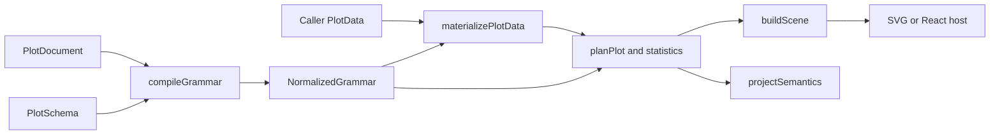
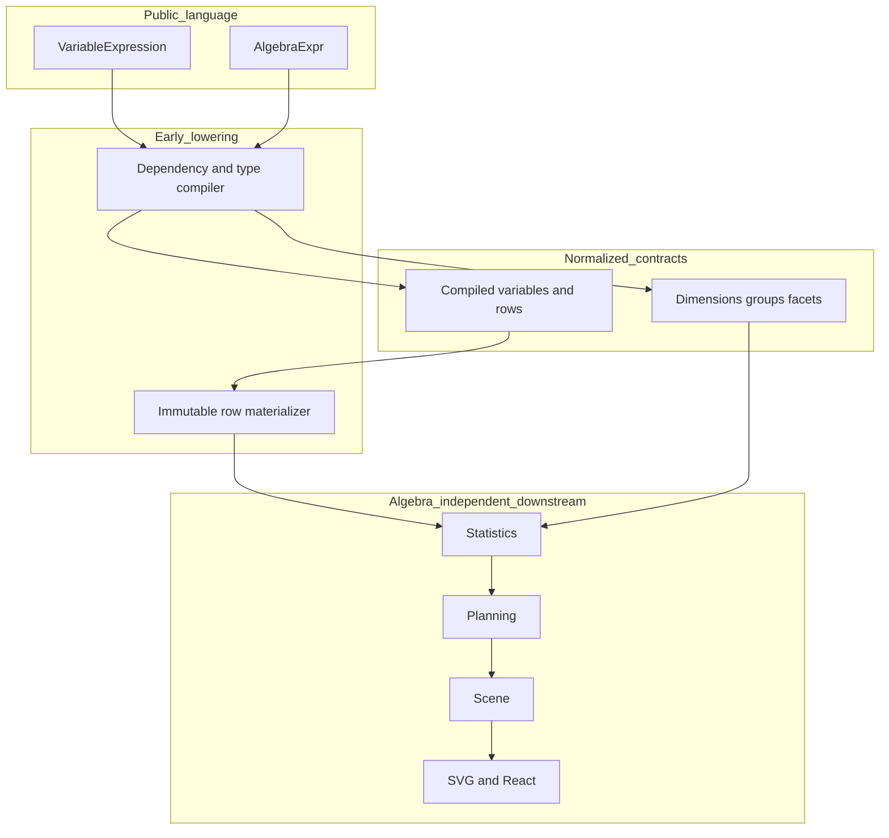

# Derived Variables and Plot Algebra Through Early Compiler Lowering

A plotting grammar can expose derived variables and dimensional algebra without requiring every later stage to understand either feature. The essential design decision is to make expressions and algebra part of the public, serializable language, then compile them early into ordinary variables, rows, dimensions, groups, and facets. Statistics and geometry operate on the result rather than interpreting the source language.

> [!summary]
> - Derived-variable expressions form a finite JSON abstract syntax tree. Compilation resolves dependencies, detects cycles, and checks semantic types before data execution begins.
> - Materialization produces new rows before statistics. Invalid numeric domains become null values plus counted diagnostics; caller-owned rows remain unchanged.
> - `cross`, `nest`, `blend`, and `unity` lower into normalized composition and package-owned variables. Their operator nodes do not survive into planning, scenes, SVG rendering, or React.
> - Tests prove semantics at stage boundaries: transformed summary values, compound identities, expanded cases, stable generated IDs, provenance, and forbidden downstream algebra branches.

## 1. The language boundary

A derived variable is a named mapping from each case to a value. It need not correspond to a physical input column. A field variable reads a column, a constant variable returns one value, a derived variable evaluates an expression, and unity supplies a single scalar identity. This definition allows statistics and mappings to refer to every variable by the same identifier after compilation.

The expression language must remain data. HSPLOT-010 admits variable references, five unary operations, five binary operations, and numeric cuts:

```ts
type UnaryTransform = "log" | "exp" | "sqrt" | "abs" | "sign";
type BinaryTransform =
  | "add" | "subtract" | "multiply" | "divide" | "power";

type VariableExpression =
  | { kind: "variable"; variable: VariableId }
  | { kind: "unary"; op: UnaryTransform; input: VariableExpression }
  | {
      kind: "binary";
      op: BinaryTransform;
      left: VariableExpression;
      right: VariableExpression;
    }
  | { kind: "cut"; input: VariableExpression; breaks: readonly number[] };
```

This is a finite discriminated union. JSON serialization preserves every node and operand order. The compiler can visit every possible form exhaustively. A stored plot does not contain executable JavaScript, callback closures, function source, SQL, or an operation registry whose contents depend on process state.

The restriction is substantive. With callbacks, compilation cannot reliably inspect dependencies, establish a deterministic evaluation order, check operand types, or report an error at a document path before execution. With expression strings, the package would also need a parser, precedence rules, an evaluator, and a security policy. A finite AST makes each operation a versioned language decision. Adding an operation requires a type rule, runtime rule, diagnostic rule, serialization test, and plotted proof.

A typical public definition is plain JSON:

```json
{
  "logged-response": {
    "kind": "derived",
    "label": "Log response",
    "expression": {
      "kind": "unary",
      "op": "log",
      "input": { "kind": "variable", "variable": "response" }
    }
  }
}
```

The algebra language is similarly closed:

```ts
type AlgebraExpr =
  | { kind: "variable"; variable: VariableId }
  | { kind: "unity" }
  | { kind: "cross"; left: AlgebraExpr; right: AlgebraExpr }
  | { kind: "nest"; outer: AlgebraExpr; inner: AlgebraExpr; id?: VariableId }
  | {
      kind: "blend";
      operands: readonly AlgebraExpr[];
      valueId?: VariableId;
      discriminatorId?: VariableId;
    };
```

Constructors such as `transform.log`, `algebra.cross`, and `algebra.blend` are authoring conveniences. They return these values and do not compile, mutate, register, or render anything. Plain data remains the canonical contract.

## 2. Compilation as dependency resolution

Derived variables can refer to other derived variables. Object property order is therefore not a valid execution order. Compilation treats the variable table as a directed dependency graph: an edge from `a` to `b` means that evaluating `a` requires `b` first.

HSPLOT-010 resolves that graph with depth-first compilation. It keeps two structures: a map of completed variables and an ordered `visiting` stack. The map prevents duplicate work. The stack detects a back edge and retains enough information to report the exact cycle.

```text
compileVariables(specifications):
    compiled := empty insertion-ordered map
    visiting := empty stack

    compileOne(id, referencePath):
        if compiled contains id:
            return compiled[id]

        if id occurs at visiting[index]:
            cycle := visiting[index..end] + id
            report variable.cycle at referencePath with cycle
            return failure

        if specifications does not contain id:
            report variable.unknown at referencePath
            return failure

        push id onto visiting
        spec := specifications[id]

        if spec is derived:
            recursively compile every referenced variable
            infer expression type from compiled operands
            validate declared type against inferred type

        compile field, constant, derived, or unity variable
        pop visiting
        insert successful result into compiled
        return result

    for id in lexically sorted specification keys:
        compileOne(id, "variables." + id)

    return compiled in insertion order
```

Dependencies enter the map before their dependents because recursion completes them first. Lexically sorting roots removes dependence on JSON property insertion order. For equal documents and schemas, the compiler emits variables in the same order; materialization can then evaluate the list once from beginning to end.

Consider three definitions:

```text
ratio      = response / baseline
log-ratio  = log(ratio)
baseline   = field("baseline")
```

Even if the serialized keys appear in that order, compilation places `baseline` before `ratio` and `ratio` before `log-ratio`. During row evaluation, `ratio` can read the package-owned column already written for `baseline`, and `log-ratio` can read the materialized `ratio`. No runtime recursion or callback dispatch is needed.

A cycle is a compile-time error:

```json
{
  "a": { "kind": "derived", "expression": { "kind": "variable", "variable": "b" } },
  "b": { "kind": "derived", "expression": { "kind": "variable", "variable": "a" } }
}
```

The diagnostic contains code `variable.cycle`, the reference path that closed the cycle, and the sequence `a -> b -> a`. An unknown reference receives `variable.unknown` at its precise expression or algebra path. Compilation stops before statistics receive an incomplete grammar.

## 3. Type rules belong in the compiler

Expression evaluation is not the right time to discover that `log(treatment)` is invalid when `treatment` is nominal. The schema already gives field variables semantic types, constants carry their own value types, and compiled references expose their resolved types. The compiler uses this information to reject invalid expression trees.

The numeric unary and binary operators require quantitative operands. `cut` requires a quantitative input but yields an ordered categorical result. Its breaks must be nonempty, finite, and strictly increasing. A declared semantic type on a derived variable must agree with what the expression can produce. Blend operands must agree because all of them become values of one generated variable.

| Construct | Input requirement | Output semantic type | Compile-time failure |
|---|---|---|---|
| `log`, `exp`, `sqrt`, `abs`, `sign` | one quantitative value | quantitative | `variable.transform.type` |
| arithmetic binary operation | two quantitative values | quantitative | `variable.transform.type` |
| `cut` | quantitative input; increasing finite breaks | ordinal | invalid cut-break diagnostic |
| `nest` | one lowered outer and one lowered inner value | nominal compound identity | invalid algebra shape |
| `blend` | nonempty compatible operands | shared operand type plus nominal source | empty or mixed-type blend |
| `unity` | none | nominal scalar identity | none |

Compile-time type errors and runtime domain failures are different. `log` accepts quantitative input, so `log(response)` is well typed even when one row contains `-1`. The schema-level claim permits logarithms; the row-level value does not. Preserving this distinction makes diagnostics actionable.

Type inference must follow references rather than repeat schema lookup at every expression leaf. A variable reference can name a field, constant, derived result, unity value, or compiler-generated algebra value. By resolving the reference first, the expression checker sees one compiled-variable contract. This keeps rules local: a unary node asks whether its compiled input is quantitative; a binary node asks the same of both sides; a cut node validates both input type and break sequence. Nested expressions compose those rules without special cases for their original storage.

The optional declared `semanticType` on a derived variable is an assertion, not an unchecked override. Accepting an incompatible declaration would make scale selection and later blend checking depend on metadata that contradicts the operation. Compilation must diagnose the contradiction. Conversely, a declaration can preserve an intended distinction when the expression permits it, but it cannot convert nominal data into numbers.

Type checking also protects materialization from becoming a policy engine. Once compilation succeeds, the evaluator handles values and domains; it does not reconsider whether an operator is meaningful for a semantic category. This division makes failures stable across datasets. Changing one row may change an invalid-domain count, but it cannot turn an invalid expression language tree into a valid one.

## 4. Immutable materialization before statistics

Rendering has an explicit sequence:



`renderPlot` calls `materializePlotData(compiled.value, request.data)` and only then calls `planPlot(compiled.value, materialized.data, viewport)`. This source ordering is part of the contract. It prevents a statistic from accidentally operating on raw values while geometry later uses transformed values.

Materialization copies every source row and writes package-owned columns into the copy. It also records `__plot_source_row_index`. Derived expressions execute in dependency order. Nest columns are computed after derived values are available. Blend expansion follows those row-local computations.

```text
materialize(grammar, data):
    invalidCounts := empty map

    rows := for each source row and index:
        row := shallow copy of source row
        row.__plot_source_row_index := index

        for variable in dependency order:
            if variable has a derived expression:
                value := evaluate(expression, row, compiled variables)
                row[variable.generatedColumn] := value
                if value is null: increment invalidCounts[variable.id]

        for nest in grammar.nests:
            outer := read(nest.outer, row)
            inner := read(nest.inner, row)
            row[nest.generatedColumn] := typedPairIdentity(outer, inner)

        return row

    for blend in grammar.blends:
        rows := flatMap each row across blend.operands in operand order
        write blend value and discriminator into each copied row

    emit one counted warning for each derived variable with invalid values
    return immutable data wrapper with rows
```

The copy is necessary even when a plot has one derived variable. Caller data may be reused by another plot, memoized by a host, or compared after rendering. Writing generated columns into source objects would make rendering order observable and could overwrite user columns. The HSPLOT-010 proof clones the original input, renders twice, and asserts the original rows remain equal to the clone.

The source index survives case expansion. If one input row becomes two blend cases, both copies retain the same source index while differing in blend discriminator. This distinction supports later interaction work: source identity answers which caller row produced a mark, while the discriminator answers which blended operand produced that case.

## 5. Runtime domains and diagnostics

The evaluator accepts only finite numeric inputs for numeric operations. It returns null for nonnumeric inputs, non-finite inputs, logarithms of non-positive values, square roots of negative values, division by zero, invalid powers, and overflow. It does not throw for a row-local domain failure.

After all rows are evaluated, materialization emits one `variable.transform.invalid` warning per affected derived variable, with a count and a path such as `variables.logged-response.expression`. This policy avoids one diagnostic per row while retaining the magnitude of the problem.

```text
Derived variable "logged-response" produced 3 invalid values.
code: variable.transform.invalid
path: variables.logged-response.expression
details: { count: 3 }
```

Null continues through the existing missing-value policy. If every transformed value is invalid, the planner may additionally emit `data.value.invalid`. The two diagnostics are not duplicates. The first identifies a transformation domain and its count; the second says that the requested plot has no usable values. A test that expects only one warning would suppress truthful stage-specific information.

Cuts use deterministic interval labels. For breaks `[10, 20]`, values produce `(-∞,10]`, `(10,20]`, or `(20,+∞]`. The boundary policy is encoded by `input <= boundary`, not inferred from formatting. Break validation occurs during compilation, so runtime evaluation never has to recover from unordered or non-finite boundaries.

## 6. A proof that transforms precede statistics

A geometric proof alone is insufficient. Seeing `log(19)` in a point establishes that geometry reads a derived value, but it does not establish where statistics run. A summary test distinguishes the two possible pipelines.

Use source values $e^1$ and $e^3$ at the same x value and ask for the mean of `log(response)`:

$$
\operatorname{mean}(\log(e^1), \log(e^3)) = \operatorname{mean}(1,3) = 2.
$$

The competing computation is:

$$
\log(\operatorname{mean}(e^1,e^3)) \ne 2.
$$

The test constructs a summary layer with an explicit standard-error interval and asserts that the single planned point has `yValue` close to `2`:

```ts
const outcome = renderPlot({ document, schema, data, viewport });
const layer = outcome.plan?.panels[0]?.layers[0];
expect(layer?.kind).toBe("point");
if (layer?.kind === "point") {
  expect(layer.data).toHaveLength(1);
  expect(layer.data[0]?.yValue).toBeCloseTo(2, 12);
}
```

This is an order-sensitive test. It proves a stage relation rather than the presence of a method call. The first version of the proof omitted the summary interval contract and failed while reading `multiplier`; adding the standard-error interval made it test the intended invariant rather than malformed fixture behavior.

## 7. Lowering `cross`, `nest`, `blend`, and `unity`

Algebra describes dimensional composition. Compilation recursively lowers each expression to ordinary compiled values and generated variables. Position must ultimately produce exactly two ordered dimensions. Groups and facets become explicit normalized arrays. Operand order is never sorted because cross and blend are order-sensitive.

### Cross

`cross(x, y)` concatenates the lowered terms of its left and right operands. In position, this yields normalized x then y. The HSPLOT proof asserts:

```text
cross(observed-at, response)
    => x = variable(observed-at)
       y = variable(response)
```

Cross is not an object merge and does not derive grouping from color. If its position lowers to fewer or more than two dimensions, compilation reports invalid algebra rather than guessing.

### Nest and compound identity

`nest(country, city)` creates one generated nominal variable. For every row, materialization reads outer and inner values and serializes a typed pair:

```ts
JSON.stringify([
  [outer === null ? "null" : typeof outer, outer],
  [inner === null ? "null" : typeof inner, inner],
]);
```

Type tags matter. They prevent the string `"1"`, number `1`, boolean values, and null from collapsing into the same identity. Structural serialization also avoids delimiter collisions that string concatenation would introduce.

Two rows with city `Springfield`, one under `US` and one under `CA`, therefore receive different group keys. Nest does not silently create a facet. Its generated variable occupies the composition locus where the nest expression appeared.

### Blend and case expansion

`blend(pop80, pop00)` cannot be represented by a row-local value alone. Each source row contributes one case per operand. The compiler creates two variables: a value variable with the operands' shared type and a nominal discriminator variable identifying the source operand. It also adds the discriminator to normalized groups.

For two source rows and two operands, materialization emits four rows:

| Source row | Generated value | Generated discriminator |
|---:|---:|---|
| 0 | `pop80(row 0)` | `pop80` |
| 0 | `pop00(row 0)` | `pop00` |
| 1 | `pop80(row 1)` | `pop80` |
| 1 | `pop00(row 1)` | `pop00` |

The expansion preserves row order and operand order. The discriminator is explicit rather than inferred from color, because grouping affects statistics and paths even when no color mapping exists. In the representative test, two rows become four values `[60, 80, 90, 100]` and two stable line groups.

### Unity

Unity lowers to the constant `"__unity__"`. It contributes one scalar identity without requiring callers to add a column. Used as a group, it produces one group. Used in algebraic normalization, it represents a term with no data-varying dimension. Nothing downstream needs a special unity operator because the compiled value is an ordinary constant.

## 8. Generated IDs and provenance

Nest and blend introduce variables that do not appear in the document's variable table. Their IDs must remain stable across JSON round trips and independent compilations. HSPLOT-010 derives them from the canonical document path:

```ts
const stableId = (path: string, suffix: string) =>
  `algebra-${path.replace(/[^a-zA-Z0-9]+/g, "-")}-${suffix}`;
```

A nest at `composition.algebra.groups[0]` therefore receives `algebra-composition-algebra-groups-0--nest`. Blend receives separate value and source suffixes. Authors may provide explicit IDs when mappings need concise public references, as with `population-value` and `population-year`.

Path-derived IDs are preferable to counters. Counters make identity depend on traversal history and unrelated preceding operators. Stable paths make diagnostics, semantic output, snapshots, and downstream interaction reproducible. The current readable scheme is deterministic within canonical paths; a future short hash would need collision and migration rules before replacing it.

Early lowering does not mean deleting all evidence of the source language. It means separating executable structure from explanatory provenance. `PlotSemantics` records variables with sources such as `derived`, `unity`, `nest`, `blend-value`, and `blend-source`. Derived entries retain their expression. Algebra semantics record each nest or blend path, generated IDs, operands, and compound inputs.

This provenance is projected from normalized grammar and plans, not reconstructed from scenes. It can support accessibility, inspection, and debugging without forcing geometry or SVG nodes to understand algebra syntax.

## 9. Proving that algebra disappears

A compiler feature is not fully lowered if later stages still switch on its source operators. HSPLOT-010 guards this architecturally. Tests read `plan.ts`, `scene.ts`, `react/PlotHost.tsx`, and `renderers/svg/SvgRenderer.tsx` and reject:

```ts
/AlgebraExpr|VariableExpression|\.kind === ["'](?:cross|nest|blend|unity)["']/
```

They also reject imports whose paths contain `algebra` or `variables`. The planner consumes `NormalizedGrammar`; scenes consume complete plans; renderers consume scenes. None decides what blend or nest means.



This negative proof matters. A successful blend screenshot could coexist with a hidden renderer branch. Source guards make the boundary executable. Ordinary planner tests then verify the positive side: generated variables participate in existing grouping, scales, statistics, geometry, and facets.

## 10. Tests, failures, and review procedure

A complete test set covers language, compilation, execution, normalization, and architecture:

1. JSON round trips preserve finite expression and algebra trees.
2. Dependency order is deterministic and unknown references carry exact paths.
3. Cycles report their complete path and prevent a normalized grammar.
4. Nominal input to `log` fails type compilation.
5. Runtime invalid domains become null and produce counted warnings.
6. Caller rows remain byte-for-byte unchanged.
7. Repeated renders of equal document, schema, and data produce equal plans.
8. A summary mean proves transform-before-stat order.
9. Cross preserves operand order and position arity.
10. Nest distinguishes duplicate inner labels under different outer values.
11. Blend expands cardinality, emits value/source variables, and groups by source.
12. Unity lowers to one constant identity.
13. Automatic IDs remain equal after JSON serialization.
14. Semantics retain derived expressions and algebra provenance.
15. Planner, scene, renderer, and host contain no algebra operator branches.

Several failed tests improved the contract. The all-invalid transform case initially expected only the transform warning, but the planner also reported no valid data; the corrected assertion checks that the counted warning is present without denying the planner error. A population assertion used JavaScript's default lexical sort and obtained `[100, 60, 80, 90]`; an explicit numeric comparator repaired the proof. These failures were test defects, not reasons to weaken runtime behavior.

The final HSPLOT-010 evidence passed 22 test files and 133 tests, type checking, lint, the production build, Storybook, packed author-only and React consumers, and deterministic browser inspection. The rendered story showed finite grouped line paths and a `Log response` axis trained on transformed values. The final audit additionally verified no eval, expression strings, callbacks, SQL, runtime registries, aesthetic-based grouping inference, or planner/renderer algebra switches.

A reviewer should read the system in stage order: public unions in `src/document.ts`; dependency and algebra lowering in `src/compile.ts`; immutable execution in `src/variables.ts`; the materialize-before-plan call order in `src/render.ts`; provenance in `src/semantics.ts`; focused behavior in `src/algebra.test.ts`; and forbidden downstream dependencies in `src/architecture.test.ts`.

## 11. Working rules

The implementation yields a small set of durable rules:

- Keep public expressions finite, discriminated, and JSON serializable. Every new operator needs compile-time and runtime semantics.
- Resolve and type-check variable dependencies before touching data. Runtime nulls represent row domains, not malformed language graphs.
- Materialize into package-owned rows before statistics, preserve source-row identity, and never mutate caller objects.
- Lower algebra into explicit values, dimensions, groups, and facets. Do not recover grouping later from an aesthetic mapping.
- Treat blend as case expansion with an explicit discriminator. Treat nest as typed compound identity.
- Derive generated IDs from canonical paths or accept explicit IDs. Do not use registration order.
- Preserve source-language provenance in semantic output while removing source-language operators from executable downstream contracts.
- Prove stage order with non-commuting computations, and prove architectural absence with source-boundary tests.

Early compiler lowering succeeds when the public language becomes more expressive while later components remain simpler. Derived expressions disappear into materialized columns. Cross becomes ordered dimensions. Nest becomes one compound variable. Blend becomes expanded rows plus value and source variables. Unity becomes a constant. Statistics, planners, scenes, and renderers continue to process the normalized forms they already understand.

## Source record

This article is based on HSPLOT-010 source and its durable records in `/home/manuel/workspaces/2026-08-24/use-optkit/plot`: `src/document.ts`, `src/compile.ts`, `src/variables.ts`, `src/render.ts`, `src/semantics.ts`, `src/algebra.test.ts`, `src/architecture.test.ts`, the implementation diary, algebra matrix, intern design guide, and HSPLOT-005–010 completion audit.
