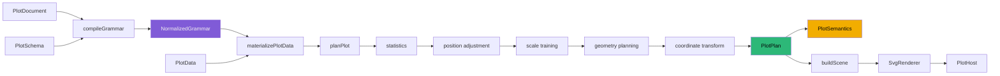
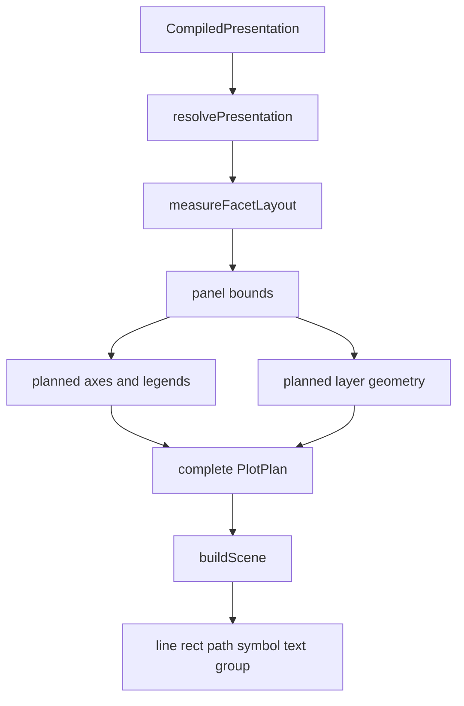
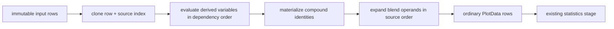

# Inside a Deterministic Statistical-Graphics Compiler: From Grammar to Mechanical Scenes

`@hyperslop-systems/plot` is a serializable statistical-graphics compiler. A caller supplies a `PlotDocument`, a typed schema, bounded rows, and a viewport. The package validates and normalizes the document, evaluates derived variables, executes statistics and positions, trains scales, plans geometry and guides, applies coordinate transforms, projects structured semantics, lowers a renderer-neutral scene, and finally lets a host render that scene. React is one host boundary. It is not the grammar, compiler, planner, or semantic model.

This report explains the completed HSPLOT-005 through HSPLOT-010 program. It begins where HSPLOT-003 and HSPLOT-004 left the system: one canonical grammar, one deterministic `NormalizedGrammar`, explicit statistics and geometry stages, and renderer-neutral `PlotSemantics`. It then follows the changes that made presentation geometry complete, authoring functional, compact plots product-ready, guides and annotations configurable, coordinates extensible, and variables algebraic. The emphasis is not the list of features. The emphasis is how the implementation preserved one execution path while increasing the expressive power of the public language.

> [!summary]
> - HSPLOT-005 moved presentation measurement and guide geometry into a complete serializable `PlotPlan`, leaving scene construction as mechanical lowering.
> - HSPLOT-006 added a React-free functional authoring package whose helpers construct ordinary canonical documents and never invoke a private compiler path.
> - HSPLOT-007 proved parity in Datalab and RAG-TTC, replaced a hand-written operational SVG with ordinary grouped line grammar, and hardened 120×24 sparklines through browser evidence and benchmarks.
> - HSPLOT-008 made axes, legends, and annotations first-class serializable components whose geometry and semantics are resolved before rendering.
> - HSPLOT-009 introduced transpose and polar coordinates as late geometry transforms. Ordinary stacked bars become sector paths without a pie-chart geometry or renderer branch.
> - HSPLOT-010 added finite derived-variable expressions and cross/nest/blend/unity algebra that lower before statistics into the existing normalized composition.
> - The completed system passes 133 tests across 22 files, typecheck, lint, production and Storybook builds, packed author-only and React consumer tests, tarball inspection, browser inspection, and six clean ticket doctors.


> [!info] Related reports
> This chapter focuses on compiler boundaries. See [[Hyperslop Plot - Completing the Compiler from Mechanical Scenes to Plot Algebra]] for the full HSPLOT-005–010 project narrative and [[From Canonical Grammar to Plot Algebra - Deep Technical Analysis]] for the pre-completion architectural analysis.

## 1. The compiler problem

A statistical plot combines decisions with different semantics and different lifetimes. Variables identify values. Composition assigns those variables to dimensions, groups, and facets. Statistics derive rows or intervals. Positions alter geometric relationships such as stacking or dodging. Scales map domains into visual ranges. Coordinates transform geometric space. Guides explain scales. Layout reserves display regions. A scene records drawing primitives. A renderer paints those primitives. An application owns data acquisition, product state, commands, and domain-specific continuity rules.

The system becomes difficult to reason about when one phase performs work that belongs to another. A scene builder that measures axis labels is no longer a mechanical scene builder. A color mapping that silently creates line groups is no longer only an aesthetic mapping. A sparkline component that bypasses the ordinary line geometry creates a named-chart path. A polar renderer that interprets rectangles as sectors duplicates geometry semantics below planning. A derived-variable callback embedded in a document breaks serialization and makes diagnostics dependent on runtime closures.

The project therefore adopted a strict rule: every capability must enter through the canonical language or through an explicit compiler stage. Convenience APIs may construct the language. They may not create another language. New runtime behavior may extend compilation, data materialization, planning, coordinate transformation, semantics, or scene lowering. It may not hide in React or SVG.

The rule produced a stable set of invariants:

| Invariant | Consequence |
|---|---|
| One canonical `PlotDocument` | Literal objects, helpers, presets, adapters, and persisted JSON share one schema. |
| One `compileGrammar` boundary | Every authoring form receives identical validation and diagnostics. |
| Deterministic normalized IR | Equal document and schema inputs produce equal serializable compiler output. |
| Explicit grouping and facets | Appearance does not silently alter statistical identity. |
| Complete planning | Scene lowering receives final geometry rather than analytical intent. |
| Renderer-neutral semantics | Meaning can be inspected without reading SVG. |
| React-free core and author package | Non-React consumers can compile, plan, inspect, and package plots. |
| Diagnostics instead of approximation | Unsupported or invalid combinations fail at a stable path. |
| No named-chart branches | Sparklines and polar sectors arise from ordinary grammar composition. |

These invariants are executable. `src/architecture.test.ts` scans production sources to prevent imports and symbols that would violate them. The package tests compare literal and helper-authored documents, serialize normalized grammar and plans, inspect generated scenes, validate tarballs in clean consumers, and render Storybook specimens in a browser.


## 2. Compiler stages and contracts

The final execution path contains one surface grammar and a sequence of typed transformations. HSPLOT-010 inserted immutable data materialization before statistics, but did not change the planner’s responsibility. HSPLOT-009 inserted coordinate transformation after scaled Cartesian geometry, but did not change statistical variables or scale domains. HSPLOT-008 enriched guide and annotation planning, but did not move presentation policy into the renderer.



The surface document remains plain data:

```ts
interface PlotDocument {
  format: "hyperslop.plot";
  version: 1;
  id: PlotId;
  description?: string;
  variables: Readonly<Record<VariableId, VariableSpec>>;
  composition: CompositionSpec;
  layers: readonly LayerSpec[];
  scales?: ScaleMap;
  coordinate?: CoordinateSpec;
  presentation?: PresentationSpec;
  annotations?: readonly AnnotationSpec[];
  limits?: RenderLimits;
  metadata?: Readonly<Record<string, JsonValue>>;
}
```

The document does not contain functions, React elements, DOM nodes, SVG commands, runtime registries, or application state. Branded IDs improve TypeScript checking while serializing as ordinary strings. `ValueRef` values point to variables, constants, or named after-stat outputs. Layer composition uses explicit inheritance, replacement, and `null` clearing. Groups and facets are ordered lists of values rather than secondary effects of aesthetic mappings.

Compilation resolves this surface into `NormalizedGrammar`. Every enabled layer owns its effective dimensions, groups, facets, statistic, geometry, position, and aesthetics. Variables are deterministic. Presentation states are normalized. Coordinate defaults are concrete. Annotation references are compiled. Derived-variable and algebra programs are retained as bounded data programs, not functions. Source indexes and canonical document paths survive normalization so diagnostics remain useful.

The planner does not import `PlotDocument`. It receives normalized contracts plus materialized rows and a viewport. The scene builder does not import the compiler, scales, presentation resolver, or layout functions. The SVG renderer does not understand statistics, algebra, or polar coordinates. This separation is the principal result of the project.


## 3. Complete PlotPlan and mechanical scenes

HSPLOT-005 addressed the remaining ambiguity between planning and scene construction. Before this phase, the system had a normalized grammar and explicit analytical stages, but `buildScene` still decided enough presentation geometry that it was not purely mechanical. Axis lines, grids, legend positions, title placement, frame ownership, and compact-layout constraints needed one authoritative owner.

The solution was a complete serializable `PlotPlan`. Planning now resolves the plot title, content bounds, plot bounds, frame, panels, positional guides, legends, annotation geometry, statistics metadata, coordinate metadata, and final mark geometry. Scene lowering consumes these values and translates them into generic scene nodes.



### 3.1 Presence is a three-state contract

Presentation uses explicit presence values:

```ts
type Presence<T> =
  | { kind: "auto" }
  | { kind: "none" }
  | { kind: "configured"; options: T };
```

`auto` asks package policy to decide whether the component exists. `none` suppresses it. `configured` supplies bounded declarative options. The distinction matters because a scale and a guide are not the same object. A hidden color legend does not disable the color scale. A compact sparkline may use operational x and y scales while suppressing every explanatory guide.

The normalized presentation resolver makes these decisions before layout. Layout then receives concrete title, x guide, y guide, legends, frame, and padding values. There is no need for SVG or CSS to infer whether space should be reserved.

### 3.2 Compact layout is a real layout mode

The old layout imposed a fixed minimum viewport that made tiny plots impossible. HSPLOT-005 removed the 160×120 floor and made component presence determine reservations. A 120×24 sparkline with two pixels of padding and no title, guides, legends, or frame receives a 116×20 content and panel rectangle:

```json
{
  "contentBounds": { "x": 2, "y": 2, "width": 116, "height": 20 },
  "panelBounds": [{ "x": 2, "y": 2, "width": 116, "height": 20 }]
}
```

This is not a CSS scaling trick. The planner computes geometry for the requested viewport. The SVG viewBox and host dimensions then represent the same compact plot.

### 3.3 The plan has no first-panel aliases

Earlier plan types exposed convenience aliases such as root `panel`, `xScale`, `yScale`, `axes`, and `layers`. Those aliases made the first panel structurally privileged and invited downstream code to bypass facets. HSPLOT-005 removed them. Consumers use `plan.panels`, and each planned panel carries its own scales, layers, facet key, strip, and bounds.

This removal was deliberate. No compatibility shim preserved the aliases. Tests and documentation were updated to the canonical structure. `src/architecture.test.ts` now inspects the `PlotPlan` interface and fails if those root aliases return.

### 3.4 Scene lowering is mechanical

`buildScene` translates planned axis segments, tick labels, grid segments, swatches, paths, rectangles, symbols, and text into scene nodes. It does not train scales, inspect normalized grammar, measure labels, decide component presence, or compute legend domains.

The host CSS was also constrained. It cannot restore a border or background that the plan omitted. Frame ownership belongs to planning and scene lowering, not to a viewport stylesheet.

The result is a useful review boundary:

```text
If geometry is wrong in PlotPlan, inspect compilation or planning.
If PlotPlan is right and SceneGraph is wrong, inspect mechanical lowering.
If SceneGraph is right and pixels are wrong, inspect the renderer or host theme.
```

This separation became essential in HSPLOT-007, where the scene was valid but a pale fallback stroke made marks nearly invisible on a white background.


## 4. Presentation presence, guides, and annotations

HSPLOT-008 extended presentation from `auto` and `none` into bounded configured axes and legends, then added document-owned annotations. The implementation preserved the rule that scales are operational mappings while guides are explanatory components.

### 6.1 Axis configuration

An axis can configure:

- label;
- side (`top` or `bottom` for x, `left` or `right` for y);
- automatic tick count or explicit tick values;
- number, percent, or temporal formatting;
- no grid or major grid.

The compiler validates dimension participation, supported sides, positive automatic counts, explicit value types, declared-domain membership, formatter compatibility, and bounded fractional digits. Formatting is a closed JSON union. There is no formatter callback.

Explicit temporal ticks arrive as ISO strings but temporal scales operate on numeric milliseconds. Planning parses accepted values, maps them through the existing scale, formats them through a bounded `Intl.DateTimeFormat` configuration, and preserves the exact configured tick set. Automatic tick generation may produce more “nice” ticks than requested, so configured automatic counts deterministically select at most the requested count while retaining endpoints.

### 6.2 Legend configuration and compatibility

Legends configure title, vertical or horizontal orientation, explicit value order, reversal, and maximum entries. Layout reserves one right column for vertical legends and deterministic bottom rows for horizontal legends.

Guide merging required a semantic identity rule. The first implementation compared channel-specific scale specifications too strictly. Compatible color, fill, and shape explanations for the same variable split into five guides instead of the previous two. The final compatibility key requires:

- the same mapped variable identity;
- the same resolved domain and order;
- the same orientation;
- the same title.

Different aesthetic families may explain the same semantic variable and ordered domain. They can therefore share one guide. This rule preserved existing scale-family tests while making configured ordering operational.

### 6.3 Stable annotations

Annotations are document-owned values with stable IDs:

```ts
type AnnotationSpec =
  | RuleAnnotation
  | TextAnnotation
  | RegionAnnotation
  | PointAnnotation;
```

Each annotation records intent (`reference`, `target`, `limit`, or `note`), optional facet selection, and bounded appearance (`tone`, `emphasis`, `dash`). Anchors are data-relative, datum-relative, or panel-relative. Panel coordinates use x left-to-right and y bottom-to-top, consistent with plot coordinates.

Compilation validates IDs, duplicates, references, panel fractions, and region endpoint coordinate spaces. Planning resolves data values through panel scales, maps panel anchors through panel bounds, and creates exact line, rectangle, symbol, or text geometry. Scene lowering translates these planned forms into generic nodes.

Datum anchors are structurally accepted but currently emit a notice and no node because stable datum identity belongs to HSPLOT-011. The system does not guess a row. Out-of-domain data annotations are omitted with a diagnostic rather than extrapolated silently. Mixed panel/data region endpoints are rejected during compilation.

### 6.4 Semantics is independent from pixels

`PlotSemantics` now records guide visibility, channel, display side, label, tick or entry values, participating variable IDs, and scale domains. Annotation semantics records stable ID, kind, label, intent, anchor, text, and visible panels.

A consumer can therefore answer questions such as:

- Which variable does this legend explain?
- Was an x guide intentionally hidden?
- Which scale domain produced these entries?
- Is this threshold a reference, target, or limit?
- Which facets contain this annotation?

None of these questions requires traversing SVG.


## 5. Serializable variables and algebraic lowering

Initial variables represented schema fields and constants. HSPLOT-010 extended them with derived expressions and unity. It also introduced cross, nest, blend, and unity algebra under `composition.algebra`. The public language remains finite JSON.

### 8.1 Derived expressions

The supported expression subset is:

```ts
type VariableExpression =
  | { kind: "variable"; variable: VariableId }
  | { kind: "unary"; op: "log" | "exp" | "sqrt" | "abs" | "sign"; input: VariableExpression }
  | { kind: "binary"; op: "add" | "subtract" | "multiply" | "divide" | "power";
      left: VariableExpression; right: VariableExpression }
  | { kind: "cut"; input: VariableExpression; breaks: readonly number[] };
```

There is no `eval`, function callback, source string, SQL fragment, runtime plugin, lag, or inferred grouped transform. The compiler checks every reference, detects dependency cycles, verifies quantitative operands, validates finite strictly increasing cut breaks, infers semantic type, and records canonical paths.

Dependency resolution is recursive. A visiting stack detects cycles and reports the exact cycle rather than failing later during row evaluation. Dependencies are inserted before dependents, giving materialization a deterministic topological order.

### 8.2 Materialization occurs before statistics

`materializePlotData` clones every input row and writes package-owned derived columns. The caller’s rows are never mutated. Invalid numeric domains produce `null` and increment a per-variable diagnostic count. Examples include log of a non-positive value, square root of a negative value, division by zero, invalid power, overflow, and nonnumeric input.



The transform-before-stat order has a direct test. Two rows contain responses `e¹` and `e³`. A derived `log(response)` variable produces `1` and `3`. A summary mean then produces `2`. If statistics ran first, the result would be `log((e + e³)/2)`, a different value.

The first version of this test exposed a fixture error rather than a compiler error: the summary statistic requires an explicit interval configuration, and the test omitted it. The runtime reported `Cannot read properties of undefined (reading 'multiplier')`. Adding the standard-error interval made the test exercise the intended order.

### 8.3 Cross preserves dimensional order

Cross concatenates ordered algebra terms. In positional composition, it must lower to exactly two dimensions:

```ts
composition.algebra({
  position: algebra.cross(
    algebra.variable(observedAt),
    algebra.variable(logResponse),
  ),
});
```

Compilation lowers the first operand to x and the second to y. Noncommutative order is never sorted. A position that does not produce exactly two dimensions is invalid.

Unity contributes one constant identity value, `__unity__`. It lets lower-order terms participate without inventing a source column.

### 8.4 Nest preserves conditional identity

Nest combines explicit outer and inner values into one generated nominal variable. Equal inner labels under different outer values remain distinct. The acceptance fixture contains `Springfield` under US and CA and produces two group keys.

The identity encoding preserves type and value:

```json
[
  ["string", "US"],
  ["string", "Springfield"]
]
```

Typed pairs avoid collisions between values such as numeric `1`, string `"1"`, and null. A nest can receive an explicit generated variable ID. If omitted, the compiler derives a deterministic ID from the canonical algebra path.

### 8.5 Blend expands cases and retains source identity

Blend unions several variables into one value dimension. One source row therefore becomes one row per operand. The compiler creates two ordinary compiled variables:

- a blended value variable;
- a source discriminator variable.

The source discriminator is added explicitly to normalized groups. It does not appear because color happened to reference it. A layer may also map the explicit discriminator ID to color.

For two source rows and two population operands:

```text
input:
  { category: A, pop80: 80, pop00: 100 }
  { category: B, pop80: 60, pop00: 90 }

materialized:
  { category: A, population: 80,  year: pop80, sourceRow: 0 }
  { category: A, population: 100, year: pop00, sourceRow: 0 }
  { category: B, population: 60,  year: pop80, sourceRow: 1 }
  { category: B, population: 90,  year: pop00, sourceRow: 1 }
```

Operand order determines expansion order. Source row identity remains in `__plot_source_row_index`. Blend operands must have one common semantic type. Empty blends and nested forms that do not lower to one value per operand diagnose before execution.

### 8.6 Algebra disappears before planning

The planner, scene builder, SVG renderer, and React host contain no imports of algebra or variable-expression modules and no branches on `cross`, `nest`, `blend`, or `unity`. They receive ordinary compiled variables, explicit composition, and ordinary rows.

This is the central success criterion for HSPLOT-010. The public language grew. The downstream execution model did not acquire a parallel interpretation layer.


## 6. Semantics as an independent output

A plot is not fully described by visible marks. Statistical method, variable identity, grouping, data coverage, hidden guides, annotation intent, coordinate meaning, and algebra provenance are not reliably recoverable from pixels.

`PlotSemantics` is projected from normalized grammar, planning metadata, and diagnostics. It does not import `SceneGraph`. Its final structure includes:

- variables with source, field ID, semantic type, unit, timezone, constant, derived expression, and provenance;
- composition with x, y, ordered groups, facets, and partitions;
- layers with statistics, outputs, assumptions, geometry, position, aesthetics, and groups;
- scale channels, kinds, domains, units, and timezones;
- guide visibility, side/orientation, labels, ticks/entries, participating variables, and domains;
- annotations with ID, kind, intent, anchor, text, and visible panels;
- nest and blend provenance, including generated IDs and operands;
- coordinate kind, theta, start angle, direction, and inner radius;
- bounded data coverage and non-error notices.

The independence test mutates a scene object and verifies that semantics does not change. Architecture guards reject scene imports. This makes semantics suitable for accessibility descriptions, export metadata, inspection tools, debugging, and future agent-facing interfaces.


## 7. Diagnostics as a language contract

A declarative compiler must explain invalid documents at stable paths. Throwing a generic exception or rendering a plausible approximation makes the language impossible to use safely.

The completed phases added diagnostics for:

| Area | Representative diagnostics |
|---|---|
| Guides | missing dimension/aesthetic, unsupported side/format, invalid tick count, out-of-domain values |
| Annotations | invalid/duplicate ID, missing anchor, incompatible region spaces, excluded facets, outside domain |
| Coordinates | invalid start angle/inner radius, unsupported geometry topology |
| Variables | unknown reference, cycle, transform type, invalid runtime domain count |
| Algebra | overlapping surfaces, invalid dimension count, empty blend, mixed operand types |
| Data | invalid positional values, empty valid result, bounded category overflow |

Compile-time errors return no normalized value. Planning errors return no plan or scene. Runtime transform-domain failures produce counted warnings and null values; if every positional value becomes invalid, the existing data-stage error remains visible as a second truthful diagnostic. Tests use `arrayContaining` rather than suppressing one result to make another assertion simpler.

Diagnostic paths preserve source indexes and canonical algebra locations, such as:

```text
variables.logged-response.expression
composition.algebra.position.left.variable
composition.algebra.groups[0]
coordinate.innerRadius
annotations[2].from
presentation.xGuide.options.ticks.values[1]
```

This path discipline is as important as successful output. It defines how users and tools repair a document.


## 8. Validation evidence and architecture guards

The final test suite contains 133 tests across 22 files. The important property is the variety of evidence.

### 11.1 Contract tests

Contract tests compile literal documents and inspect normalized grammar. They verify defaults, source paths, generated IDs, effective layer composition, diagnostic codes, and serializability.

### 11.2 Numeric and geometric tests

Numeric tests use hand-calculated expectations:

- transpose applied twice returns the original point within floating-point tolerance;
- polar cardinal points match center and radius calculations;
- inner radius moves a radial-zero point to the expected device radius;
- ordinary stacked bars produce bounded sector paths;
- log transforms execute before summary means;
- blend materialization yields `[60, 80, 90, 100]` under numeric sorting.

### 11.3 Architecture tests

Architecture tests read source text and enforce negative constraints:

- downstream stages do not import `PlotDocument`;
- core and author code do not import React or DOM/SVG APIs;
- scene lowering does not import presentation, layout, compiler, or scales;
- geometry planning does not create guide nodes;
- root plan aliases do not return;
- host CSS does not restore omitted frames;
- planner, scene, SVG renderer, and React host do not import algebra or interpret algebra operators;
- obsolete mapping and migration vocabulary remains absent.

Negative architecture tests are valuable because a feature can pass behavioral tests while violating a boundary that only matters to future work.

### 11.4 Package tests

The final package validation sequence is:

```bash
pnpm install --frozen-lockfile
pnpm test
pnpm typecheck
pnpm lint
pnpm build
pnpm build-storybook
pnpm consumer:smoke
pnpm pack:check
git diff --check
```

The frozen install confirms the lockfile. The known warning is that pnpm ignored the `esbuild` build script. Production and Storybook builds still pass.

The packed tarball contains 105 entries, including author and root JavaScript, declarations, source maps, CSS, README, and package metadata. It contains no `src/`, ticket workspace, or `storybook-static` tree.

### 11.5 Browser tests

Browser inspection covered:

- grouped sparse, flat, one-point, and empty 120×24 sparklines;
- configured top and right axes, explicit temporal ticks, major grids, horizontal legend, threshold, region, and note;
- transposed points with temporal values on the vertical display axis;
- 15 ordinary stacked bars rendered as 15 polar paths with radial grids;
- derived logarithmic values with a `Log response` axis.

Screenshots live in each ticket’s `reference/screenshots/` directory. Browser evaluation checked viewBoxes, computed styles, role counts, finite numeric attributes, path counts, and accessibility descriptions.


## 9. Stable architectural decisions

The completed work makes several decisions that future changes should preserve unless a new ticket replaces them explicitly.

### 13.1 A scale is not a guide

Suppressing a guide never disables its scale. This enables compact plots and intentionally unexplained encodings without changing mark generation.

### 13.2 Product continuity is not inferred by Plot

Applications decide where operational progress has gaps, resets, and phase boundaries. Plot renders explicit groups.

### 13.3 Coordinate transformation is late

Statistics, grouping, positions, and domains remain in source-variable semantics. Coordinates alter planned geometry and positional guides.

### 13.4 Algebra lowers completely

Cross, nest, blend, and unity do not survive into planning or rendering. Generated variables and materialized rows use the existing execution model.

### 13.5 Unsupported topology diagnoses

The package does not claim area, ribbon, error-bar, or boxplot polar support until it can preserve their topology with evidence.

### 13.6 Presets expand to ordinary grammar

Sparkline remains ordinary line grammar. A future pie-like preset may construct bar intervals plus polar coordinates, but it must not introduce `geom.pie` merely for convenience.

### 13.7 Semantics is not derived from SVG

Accessibility, inspection, and automation should consume `PlotSemantics`, supplemented by scene interaction metadata where physical geometry matters.


## 10. Current limits

The completed program closes HSPLOT-005 through HSPLOT-010. The remaining work belongs to later tickets rather than hidden debt in these phases.

### 15.1 Stable datum identity and inversion

HSPLOT-011 is the next architectural step. Datum-relative annotation anchors currently diagnose and omit because the package does not yet expose stable datum identity through all transforms. Coordinate inversion is also absent. Interaction should reuse compiled coordinates and source/blend identity rather than inspect SVG paths.

### 15.2 Additional polar topology

Area, ribbon, error-bar, and boxplot transforms remain unsupported. Each needs explicit boundary semantics, ordering rules, and hand-calculated tests. A real consumer should activate that work.

### 15.3 Text measurement and collision

Layout uses deterministic fixed metrics. Configured ticks and polar labels do not invoke DOM measurement. Future collision and wrapping work must preserve deterministic planning, potentially through package-owned measurement inputs rather than renderer queries.

### 15.4 Data materialization performance

Blend currently expands immutable rows. This favors correctness, inspectability, and compatibility with existing stages. Larger bounded datasets may justify a columnar evaluation view, but only measurement should drive that change.

### 15.5 Additional transform vocabulary

Lag, rank, grouped transforms, and arbitrary expressions remain absent. Grouped transforms need explicit `by` operands. No transform should infer grouping from aesthetics or facets.


## 11. Reproducing the validation

The repository is:

```text
/home/manuel/workspaces/2026-08-24/use-optkit/plot
```

Run the complete package gates:

```bash
cd /home/manuel/workspaces/2026-08-24/use-optkit/plot
pnpm install --frozen-lockfile
pnpm test
pnpm typecheck
pnpm lint
pnpm build
pnpm build-storybook
pnpm consumer:smoke
pnpm pack:check
```

Run focused tests by phase:

```bash
pnpm exec vitest run src/presentation.test.ts src/presentation-golden.test.ts
pnpm exec vitest run src/author.test.ts src/architecture.test.ts
pnpm exec vitest run src/configured-guides-annotations.test.ts
pnpm exec vitest run src/coordinates.test.ts
pnpm exec vitest run src/algebra.test.ts
```

Launch Storybook:

```bash
pnpm storybook
```

Inspect these stories under `Grammar/PlotHost`:

- grouped sparse, flat, one-point, and empty sparklines;
- Configured Guides And Annotations;
- Transposed Point Plot;
- Polar Stacked Bars;
- Derived Variable Algebra.

The final evidence audit is:

```text
/home/manuel/workspaces/2026-08-24/use-optkit/plot/ttmp/2026/08/29/
HSPLOT-010--public-variables-transforms-and-plot-algebra/
reference/03-hsplot-005-010-completion-audit.md
```


## 12. Source references

### Project source

| Source | Purpose |
|---|---|
| `src/document.ts` | Canonical public grammar, IDs, guides, annotations, coordinates, expressions, and algebra. |
| `src/compile.ts` | Variable dependency compiler, algebra lowering, guide/annotation/coordinate validation, normalized grammar. |
| `src/variables.ts` | Immutable derived-variable, nest, and blend materialization. |
| `src/presentation.ts` | Presentation presence and configured-guide resolution. |
| `src/layout.ts` | Deterministic panel and guide space allocation. |
| `src/plan.ts` | Statistics orchestration, scales, complete geometry, guides, annotations, and coordinate planning. |
| `src/coordinates.ts` | Renderer-free Cartesian, transpose, and polar transforms. |
| `src/semantics.ts` | Renderer-neutral semantic projection. |
| `src/scene.ts` | Mechanical generic scene lowering. |
| `src/renderers/svg/SvgRenderer.tsx` | Accessible SVG rendering from scene nodes. |
| `src/author/` | Pure functional constructors for canonical grammar. |
| `src/architecture.test.ts` | Executable package-boundary guards. |
| `src/configured-guides-annotations.test.ts` | HSPLOT-008 acceptance matrix. |
| `src/coordinates.test.ts` | HSPLOT-009 numeric and topology matrix. |
| `src/algebra.test.ts` | HSPLOT-010 transform and algebra matrix. |
| `scripts/consumer-smoke.mjs` | Packed plain-JavaScript and React consumer validation. |

### Ticket documentation

| Source | Purpose |
|---|---|
| `HSPLOT-005/reference/01-implementation-diary.md` | Complete planning, compact layout, and research chronology. |
| `HSPLOT-006/reference/01-implementation-diary.md` | Functional author package and packaging failures. |
| `HSPLOT-007/reference/01-implementation-diary.md` | Product parity, browser defects, benchmark, and consumer validation. |
| `HSPLOT-007/reference/02-parity-matrix.md` | Plot-family and application parity evidence. |
| `HSPLOT-007/reference/04-sparkline-benchmark.md` | Compact construction/render measurements. |
| `HSPLOT-008/reference/01-implementation-diary.md` | Configured-guide and annotation decisions and failures. |
| `HSPLOT-008/reference/02-validation-and-rendered-inspection.md` | Rendered guide/annotation acceptance. |
| `HSPLOT-009/reference/01-implementation-diary.md` | Coordinate-transform chronology and topology decisions. |
| `HSPLOT-009/reference/02-coordinate-matrix-and-validation.md` | Supported coordinate matrix and browser evidence. |
| `HSPLOT-010/reference/01-implementation-diary.md` | Derived-variable and algebra implementation chronology. |
| `HSPLOT-010/reference/02-algebra-matrix-and-validation.md` | Transform and algebra acceptance matrix. |
| `HSPLOT-010/reference/03-hsplot-005-010-completion-audit.md` | Final requirement-by-requirement completion audit. |

All ticket paths are rooted at:

```text
/home/manuel/workspaces/2026-08-24/use-optkit/plot/ttmp/2026/08/29/
```

### Prior vault reports

- [[From Canonical Grammar to Plot Algebra - Deep Technical Analysis]] — the pre-implementation research and design program for HSPLOT-005 through HSPLOT-010.
- [[PROJECT REPORT - Hyperslop Plot v0.2 - From Grammar to Published PBUI Runtime]] — the earlier v0.2 package, PBUI integration, publication, and scientific authoring report.
- [[PROJ - Hyperslop Plot - Building a Frontend Grammar of Graphics as a Staged Compiler]] — the initial staged-compiler project architecture.
