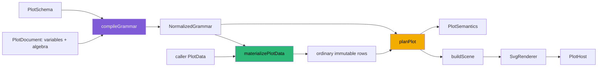

# Lowering Plot Algebra into an Existing Graphics Pipeline

HSPLOT-010 expands the public language of `@hyperslop-systems/plot` with derived variables and the `cross`, `nest`, `blend`, and `unity` algebra operators. Its important result is not that callers can write more compact documents. The important result is that the added language ends at the compiler boundary. The existing statistics, positions, scale training, geometry planning, scene construction, SVG rendering, and React host continue to receive the same kind of normalized inputs they received before the feature.

This note isolates that lowering contract. It explains the algorithms, the identities generated during compilation and materialization, the invariants that keep later stages unchanged, and the acceptance tests that prove the boundary. It intentionally does not repeat the wider HSPLOT-005 through HSPLOT-010 account in [[Hyperslop Plot - Completing the Compiler from Mechanical Scenes to Plot Algebra]].

> [!summary]
> - Algebra is a finite JSON surface language that compiles into ordinary dimensions, explicit groups, compiled variables, and materialized rows.
> - `cross` supplies ordered positional dimensions; `nest` creates a typed conditional identity; `blend` expands cases and adds a source discriminator; `unity` supplies one scalar identity.
> - Generated IDs derive from canonical algebra paths, and provenance enters `NormalizedGrammar` and `PlotSemantics` rather than being inferred from rendered output.
> - Architecture tests assert that planning, scene lowering, SVG, and React neither import algebra modules nor branch on algebra operator kinds.

## Why lowering is the central design decision

The package already has a staged graphics pipeline. A caller provides a serializable `PlotDocument`, a schema, bounded data, and a viewport. `compileGrammar` checks and normalizes the document. `materializePlotData` produces rows that satisfy the normalized variable contract. Planning then runs statistics, position adjustments, scale training, geometry planning, coordinate conversion, and presentation layout. Scene lowering translates a complete `PlotPlan` into generic nodes; a renderer paints those nodes.

Algebra could have been propagated as a special form through this pipeline. That would require each downstream stage to answer questions that belong to compilation: whether `cross` has swapped x and y, how a nested value is identified, how many cases a blend creates, or what group represents a blend operand. The result would be a second interpretation layer in every stage. It would also make diagnostics, semantic inspection, and future renderer implementations depend on surface syntax that should have been resolved once.

HSPLOT-010 chooses a different contract: surface algebra is compiled away before planning. The compiler turns it into the existing `CompiledComposition`, plus a finite set of compiled variable and materialization transforms. The planner sees x, y, groups, facets, and data rows. A blend is no longer an operator by the time statistics execute; it is a set of ordinary rows with ordinary value and source columns. A nest is no longer a tree expression; it is an ordinary nominal variable with a collision-safe value. Unity is a regular constant value. This retains the existing execution model while making public documents more expressive.



The diagram marks a hard responsibility split. `compileGrammar` owns language validation, reference resolution, generated identity, source paths, and lowering. `materializePlotData` owns package-created values and case expansion without mutating caller data. Everything after those stages owns its prior responsibility. The planner does not receive a `PlotDocument`; it receives `NormalizedGrammar` and `PlotData`. That type-level separation prevents ordinary planning code from reading uncompiled surface forms.

## The normalized target and its invariants

The relevant target is `CompiledComposition` in `/home/manuel/workspaces/2026-08-24/use-optkit/plot/src/compile.ts`:

```ts
interface CompiledComposition {
  readonly x: CompiledValue | null;
  readonly y: CompiledValue | null;
  readonly groups: readonly CompiledValue[];
  readonly facets: CompiledFacetComposition | null;
}
```

A `CompiledValue` is either a compiled variable reference or a constant. Compiled variables retain ordinary field metadata—semantic type, label, unit, timezone, field column—and can carry provenance. HSPLOT-010 adds `derived`, `unity`, `nest`, `blend-value`, and `blend-source` provenance values. Those are metadata for compilation and semantics; they are not new geometry or renderer modes.

Several invariants follow from using this target.

- **Every positional result is ordered.** `x` and `y` are not an unordered collection. `cross(a, b)` becomes x=`a`, y=`b`; reversing operands changes the normalized result.
- **Every statistical identity is explicit.** Blend source identity is appended to normalized groups. No stage infers it from a color mapping or from a geometric coincidence.
- **Every generated value has a stable representation.** Nest values encode both the JavaScript primitive type and the value. This keeps numeric `1`, string `"1"`, and `null` distinct.
- **Every synthetic variable has a deterministic ID.** Automatic IDs derive from a canonical algebra path, not declaration order, object iteration accident, or a global counter.
- **Every row transformation preserves source lineage.** Materialization assigns `__plot_source_row_index` before it evaluates expressions or expands blends.
- **Every invalid public form is diagnosed before execution when possible.** Unknown variables, cycles, incompatible expression types, empty blends, mixed blend types, algebra/simple composition overlap, and incorrect positional arity are compile diagnostics with source paths.

These rules matter because ordinary downstream code relies on them. Grouping can serialize the compiled group values without understanding how they originated. Statistics can consume a derived y value or expanded blend value just as they consume a schema field. Scales can use the compiled semantic type. Geometry receives statistics and positions whose inputs already represent the intended cases.

## Variable dependencies and pre-stat materialization

Derived variables are necessary for algebra but are not algebra operators. They establish the same lowering pattern: a public declarative expression becomes a compiled variable with an ordinary generated field column. The supported expression language is a closed JSON union: variable references, unary `log`, `exp`, `sqrt`, `abs`, and `sign`; binary arithmetic and power; and ordered numeric `cut` breaks. There are no callbacks, expression strings, `eval`, SQL fragments, runtime plugins, or implicitly grouped transforms.

Compilation resolves references recursively. A visiting stack detects a cycle while the compiler still has the exact reference path. Dependencies compile before their dependents because each expression reference calls `compileOne` before its owner completes. The compiled variable list consequently gives `materializePlotData` a deterministic evaluation order.

The data stage clones each input row, assigns its source index, evaluates derived expressions, adds nested identities, and only then expands blends. Invalid numeric domains become `null`: logarithm requires a positive input, square root requires a non-negative input, division rejects a zero denominator, and non-finite results are invalid. The stage records one warning per derived variable with an invalid count. It does not change the caller's rows.

```text
materialize(grammar, data):
    rows = data.rows.map((source, sourceIndex) => {
        row = { ...source, __plot_source_row_index: sourceIndex }
        for variable in grammar.variables in dependency order:
            if variable.expression exists:
                row[variable.field.column] = evaluate(variable.expression, row)
        for nest in grammar.nests:
            row[nest.variable.field.column] = typedPair(nest.outer, nest.inner)
        return row
    })

    for blend in grammar.blends:
        rows = rows.flatMap(row => blend.operands.map(operand =>
            { ...row, blendedValue: read(row, operand), source: operandIdentity(operand) }
        ))

    return rows and counted invalid-transform warnings
```

The order has observable statistical consequences. The focused test in `src/algebra.test.ts` supplies response values `e¹` and `e³`, derives `log(response)`, and uses a mean summary statistic. The planned point has y value `2`. That proves the package computes `(1 + 3) / 2`, not `log((e + e³) / 2)`. The test also clones the input rows before rendering and verifies exact equality afterward. This is both a stage-order and ownership test.

## Cross: ordered dimensions, not generic composition

`cross` concatenates dimensions in the order stated by the author. At the position locus, its result must contain exactly two values. Lowering reads the left expression first and then the right expression:

```ts
cross(left, right) => [
  ...lower(left, `${path}.left`),
  ...lower(right, `${path}.right`),
]
```

For this public form:

```ts
composition.algebra({
  position: algebra.cross(
    algebra.variable(observedAt),
    algebra.variable(loggedResponse),
  ),
})
```

normalization assigns `observedAt` to x and `loggedResponse` to y. The compiler does not sort IDs, inspect semantic types to reorder operands, or make an aesthetic mapping decide dimensional order. If lowering produces anything other than two dimensions, it emits `algebra.invalid` at `composition.algebra.position`. This makes an invalid composition explicit rather than creating a partial plot.

Cross is also used inside group and facet positions, where its flattened values become the relevant explicit list. The important constraint is local: a position requires two dimensions; a group may contain its normalized list; a nest or blend operand has stricter one-value requirements. The lowerer checks those contracts at the locus that needs them.

## Unity: one scalar identity

`unity()` lowers to the nominal constant `"__unity__"`. It supplies one value for expressions that need a scalar identity without asking callers to add a synthetic input column. It is intentionally ordinary after lowering:

```ts
groups: [algebra.unity()]
// becomes
 groups: [{ kind: "constant", value: "__unity__", semanticType: "nominal" }]
```

There is no generated source field and no row expansion for unity. Group construction sees one constant value for every row, so the result is one group unless other group values participate. The acceptance test verifies this exact normalized representation alongside cross order. This direct representation is preferable to a special grouping rule because all later stages already know how to read constants.

## Nest: conditional identity with typed provenance

`nest(outer, inner)` produces one nominal generated variable. Its purpose is conditional identity: equal inner labels are distinct when their outer identities differ. A data set containing `US / Springfield` and `CA / Springfield` must preserve two identities. Concatenating strings would be unsafe because it loses primitive type and can create delimiter ambiguities.

The compiler lowers each operand and requires exactly one compiled value from each. It then chooses either an author-provided ID or a deterministic generated one. For a nest at `composition.algebra.groups[0]`, the automatic ID is derived from that canonical path, yielding `algebra-composition-algebra-groups-0--nest` in the focused fixture. The compiler records a `CompiledNestTransform` containing the path, outer and inner values, and generated variable.

Materialization serializes the identity as typed pairs:

```json
[
  ["string", "US"],
  ["string", "Springfield"]
]
```

This value is written to the generated variable's ordinary field column. The group pipeline can treat it as nominal data without knowing it originated in `nest`. `PlotSemantics` retains the generated variable and canonical path, so an inspector can explain why two otherwise identical city labels are separate. The test renders the two Springfields and asserts two distinct group keys; it also compiles a JSON-round-tripped document twice and asserts the generated ID is unchanged.

## Blend: expanding cases while retaining the operand identity

`blend` is the only operator here that changes row cardinality. It combines several compatible variables into one value dimension. A caller may specify the output value ID and source-discriminator ID; otherwise the compiler derives each from the canonical path. Both are compiled variables: the value retains the common semantic type of the operands, and the discriminator is nominal with `blend-source` provenance.

The lowerer rejects an empty operand list. It recursively lowers each operand, requires each to yield exactly one value, and verifies a single common semantic type. It retains operand order. It also appends the discriminator to `autoGroups`, then combines it with author-declared normalized groups. This is a critical invariant: lines, summaries, and positions remain separated by source even if the author does not map the discriminator to color.

For rows containing `pop80` and `pop00`, blend materialization produces one ordinary row per operand:

```text
input row 0: { category: A, pop80: 80, pop00: 100 }

expanded rows:
  { category: A, population: 80,  populationYear: "pop80", __plot_source_row_index: 0 }
  { category: A, population: 100, populationYear: "pop00", __plot_source_row_index: 0 }
```

The source discriminator records the operand variable ID for a variable operand; a constant operand uses its JSON representation. The original source index remains unchanged across each expansion. Later algebra transforms operate on the current row sequence, so blend order is deterministic and visible to any stage that preserves input order.

The HSPLOT-010 acceptance fixture has two source rows and two operands. It expects four values, numerically sorted as `[60, 80, 90, 100]`, and exactly two line groups. It verifies the value and discriminator IDs in both `NormalizedGrammar` and `PlotSemantics`. The test maps the explicit discriminator to color, but grouping does not depend on that mapping; automatic group injection is the proof of the intended statistical identity.

## Provenance is generated once and projected deliberately

Generated data should not become opaque merely because it is compatible with ordinary downstream stages. HSPLOT-010 keeps provenance in two places with different purposes.

`NormalizedGrammar` carries compiled variables, `nests`, and `blends`. Those structures drive materialization and give the planner stable compiled inputs. A generated variable includes source, field metadata, semantic type, label, and provenance. A `CompiledBlendTransform` additionally retains its canonical path, ordered operands, value variable, and discriminator variable. This is execution provenance.

`PlotSemantics` projects the relevant facts for inspection, accessibility, export metadata, and tooling. It reports derived expressions and their sources, plus nest and blend generated IDs and paths. Semantics is not reverse-engineered from SVG. The system can therefore answer whether a grouped line is separated by a blend source, or why two nested labels differ, without parsing geometry or colors.

The distinction also constrains ID generation. An ID based on a global allocation sequence would be difficult to reproduce from a persisted document. An ID based on a source path is stable when the same canonical document is compiled again, including after JSON serialization. Explicit IDs remain available where an author needs a durable mapping target such as `mapping.color: value.variable(populationYear)`.

## Why downstream stages remain unchanged

The downstream architecture is protected by both the representation and executable negative tests. `src/architecture.test.ts` reads the production source for `plan.ts`, `scene.ts`, `react/PlotHost.tsx`, and `renderers/svg/SvgRenderer.tsx`. It fails if these files import `algebra` or `variables`, name `AlgebraExpr` or `VariableExpression`, or branch on `cross`, `nest`, `blend`, or `unity`.

This test does not merely enforce naming style. It protects the lowering boundary. Planning may use `NormalizedGrammar`, materialized rows, and the established pipeline contracts, but it cannot reintroduce a surface-language interpreter. Scene lowering cannot decide how to expand a blend or encode a nested key. The SVG renderer cannot paint an algebra-specific mark. React cannot make algebraic decisions outside the core compiler.

Other architecture tests reinforce the same result. Downstream stages do not mention `PlotDocument`; the core compiler and semantics are React-, DOM-, and SVG-free; semantics does not import scene types; geometry planning cannot create guides or presentation nodes; and scene lowering cannot import layout, presentation, compiler, or scale-training machinery. The additive feature therefore does not loosen existing separation rules.

> [!warning] Do not move the boundary downstream
> A future operator should not be passed through as a convenience. If it cannot lower into compiled variables, composition, and ordinary materialized data with precise diagnostics and provenance, it needs a new compiler design rather than a planner or renderer branch.

## Acceptance tests and reproducible evidence

The focused evidence is `/home/manuel/workspaces/2026-08-24/use-optkit/plot/src/algebra.test.ts`, supplemented by the architectural guard in `src/architecture.test.ts`. The ticket reference `/home/manuel/workspaces/2026-08-24/use-optkit/plot/ttmp/2026/08/29/HSPLOT-010--public-variables-transforms-and-plot-algebra/reference/02-algebra-matrix-and-validation.md` records the final validation matrix.

The tests are arranged around contracts rather than only rendered pixels:

| Contract | Focused proof |
|---|---|
| Derived values execute before geometry and do not mutate caller data. | A logged response reaches point planning as `Math.log(19)`; original rows remain equal to a clone. |
| Derived values execute before summary statistics. | `log(e¹)` and `log(e³)` summarize to `2`. |
| Invalid domains and invalid declarations remain visible. | Negative logarithm yields a counted warning; cycles and nominal logarithm emit their diagnostic codes. |
| Cross preserves order and unity is ordinary. | Normalized x/y match operand order; unity is the `__unity__` constant group. |
| Nest preserves conditional identity and stable generated IDs. | US and CA Springfield create two groups; automatic ID survives repeated JSON compilation. |
| Blend expands cases and retains source identity. | Two rows × two operands yield four values, two groups, and declared value/discriminator provenance. |
| Invalid algebra has precise repair locations. | Unknown left operand points to `composition.algebra.position.left.variable`; empty blend emits its dedicated error. |
| No later stage interprets surface algebra. | Architecture test rejects imports, AST names, and operator-kind branches in plan, scene, SVG, and host code. |

The final recorded package gates passed: `pnpm test` reported 22 files and 133 tests; `pnpm typecheck`, `pnpm lint`, `pnpm build`, `pnpm build-storybook`, `pnpm consumer:smoke`, `pnpm pack:check`, and `git diff --check` also passed. Browser evidence for `grammar-plothost--derived-variable-algebra` recorded a finite `760 × 420` SVG, three grouped line paths, the `Log response` guide label, transformed y tick values, and preserved temporal x ticks and treatment legend. The known static server favicon 404 is unrelated to plot output.

## Working rules for later grammar extensions

A future extension should preserve the HSPLOT-010 sequence: define a finite surface union; validate references, types, arity, and paths in compilation; generate deterministic IDs from canonical paths or accept explicit IDs; materialize any required values immutably before statistics; express grouping and facets explicitly; project provenance into semantics; and prove that no downstream stage recognizes the surface construct.

This does not mean every new capability is reducible to current forms. A proposed operator that changes statistical semantics, needs data joins, needs unbounded execution, or cannot retain stable identity may require a new normalized contract. The correct response is to state that contract and add stage-specific tests, not to hide a special case in geometry or rendering.

For the supported HSPLOT-010 vocabulary, the lowering is complete. Cross, nest, blend, and unity enlarge the authoring grammar while the graphics pipeline continues to operate over the same normalized composition and ordinary rows. That is the acceptance condition to preserve.
