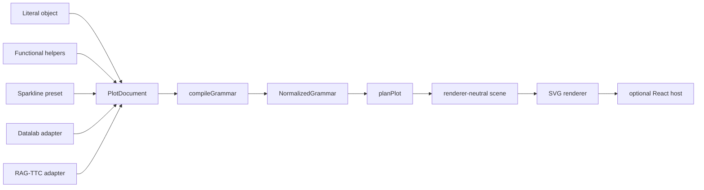
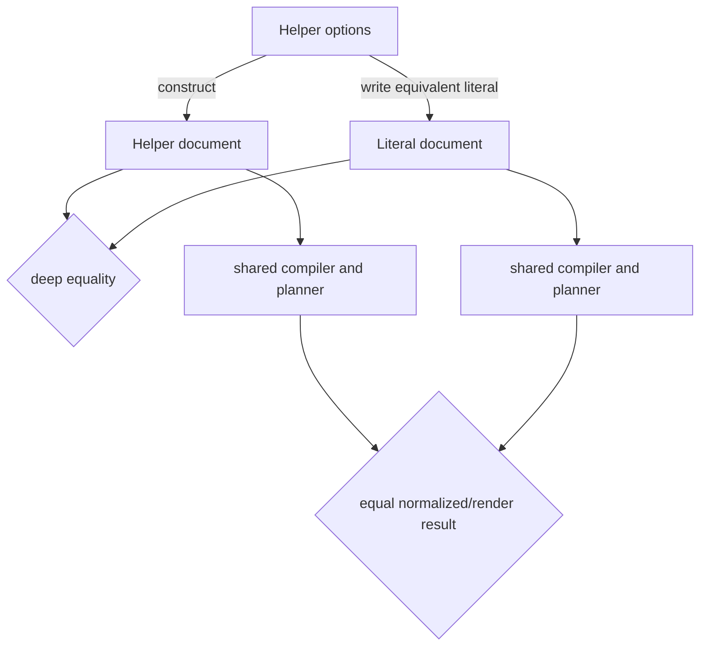
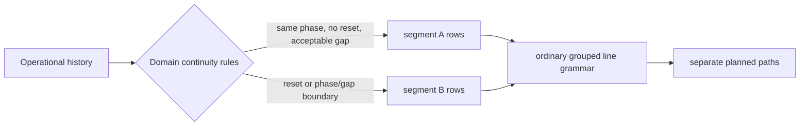
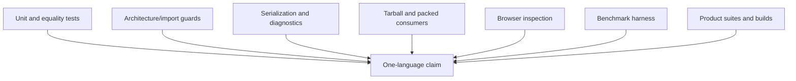

# One Plot Language Across Authoring APIs, Sparklines, and Product Applications

A plotting system has one language only when every authoring form produces the same document, every document enters the same compiler, and every consumer-specific decision remains visible at a named boundary. `@hyperslop-systems/plot` established that property across three settings that often diverge: concise JavaScript authoring, compact sparklines, and application integrations. HSPLOT-006 added a functional authoring entrypoint. HSPLOT-007 tested it against literal documents, package boundaries, rendered browser output, benchmarks, and the Datalab and RAG-TTC consumers.

The result is not a second API layered over a first API. The result is a finite collection of pure constructors for the canonical `PlotDocument`. A sparkline is not a special renderer or geometry. It is an ordinary line document with compact presentation. Product-specific gaps and resets do not become guesses inside line geometry. They become explicit groups prepared by the application. React hosts the output when React is useful, but authoring, compilation, planning, semantics, and scene construction do not depend on React.

> [!abstract]
> **Central claim.** Literal objects, functional helpers, sparkline presets, Datalab adapters, and RAG-TTC progress views remain coherent because they converge before compilation. Equality tests, packed-consumer tests, browser inspection, and benchmarks validate different parts of that claim; none alone is sufficient.

## 1. The contract: one canonical value

The durable public value is a serializable `PlotDocument`. It contains variables, composition, layers, scales, coordinates, presentation, annotations, limits, and metadata. It contains no callback accessors, React elements, DOM references, SVG commands, runtime registries, or mutable builders. Compilation accepts this data plus a schema and produces normalized grammar. Planning accepts normalized grammar plus bounded rows and a viewport. Scene lowering receives planned geometry. A renderer finally paints generic scene nodes.



This convergence point matters. If helpers emitted a private intermediate representation, helper-authored plots could validate differently from persisted JSON. If a sparkline called an internal miniature renderer, compact charts could drift from ordinary line semantics. If an application supplied SVG paths, its continuity rules would be hidden below scales and planning. Instead, each convenience has the same output type and reaches the same diagnostics.

The distinction can be stated precisely:

| Concern | Owner | Observable artifact |
|---|---|---|
| Concise syntax | `/author` pure functions | `PlotDocument` |
| Valid grammar | compiler | diagnostics and `NormalizedGrammar` |
| Statistical and geometric meaning | planner | `PlotPlan` |
| Operational discontinuities | product adapter | explicit segment/group rows |
| Tiny visual layout | presentation and layout | 120×24 planned viewport |
| Painting | renderer | generic scene nodes or SVG |
| Mounting and resize behavior | host | React component when desired |

No layer is permitted to silently repair the responsibilities of another.

## 2. Pure functional constructors

HSPLOT-006 introduced the separately packaged `@hyperslop-systems/plot/author` entrypoint. Its functions construct plain values. They do not compile, render, cache, register, or mutate. The vocabulary covers plot documents; field and constant variables; value references; composition and layers; six statistics; eight geometries; five positions; nine scales; Cartesian coordinates; presentation presence states; compact presentation; and the sparkline preset.

A representative helper-authored document has this shape:

```ts
import {
  composition,
  geom,
  layer,
  plot,
  scale,
  value,
  variable,
} from "@hyperslop-systems/plot/author";

const document = plot({
  id: "daily-latency",
  description: "Daily request latency by region",
  variables: {
    day: variable.field({ field: "day", type: "temporal" }),
    latency: variable.field({ field: "latency", type: "quantitative" }),
    region: variable.field({ field: "region", type: "nominal" }),
  },
  composition: composition({
    dimensions: {
      x: value.variable("day"),
      y: value.variable("latency"),
    },
    groups: [value.variable("region")],
  }),
  layers: [layer({ id: "latency-line", geometry: geom.line() })],
  scales: {
    y: scale.linear({ zero: false }),
  },
});
```

The same document can be written literally:

```ts
const literal = {
  format: "hyperslop.plot",
  version: 1,
  id: "daily-latency",
  description: "Daily request latency by region",
  variables: {
    day: { kind: "field", field: "day", type: "temporal" },
    latency: { kind: "field", field: "latency", type: "quantitative" },
    region: { kind: "field", field: "region", type: "nominal" },
  },
  composition: {
    dimensions: {
      x: { kind: "variable", variable: "day" },
      y: { kind: "variable", variable: "latency" },
    },
    groups: [{ kind: "variable", variable: "region" }],
  },
  layers: [{ id: "latency-line", geometry: { kind: "line" } }],
  scales: { y: { kind: "linear", zero: false } },
};
```

The helper calls remove repeated discriminants and improve editor completion, but they do not change the language. Constructors are pure in the operational sense:

$$
f(options) = document\ value
$$

For equal inputs they produce structurally equal outputs. They retain no previous invocation, produce no identifier implicitly where an explicit identifier is required, and perform no I/O. Their products survive `JSON.stringify` and `JSON.parse`. Recursive tests reject functions and symbols. This permits authored values to cross workers, storage systems, test fixtures, and package boundaries without rehydrating behavior.

### 2.1 Finite vocabulary and compile-time drift detection

The canonical grammar uses discriminated unions. The helper API derives option types from those unions with `Extract` and maintains exhaustive maps keyed by each union's `kind`. When a new scale, statistic, geometry, or position is added to the canonical vocabulary, an incomplete author namespace becomes a type error. This is stronger than relying on documentation review.

A fluent builder was deliberately avoided. Builders commonly accumulate hidden state, impose call ordering, and require a terminal conversion method. Closure accessors were also excluded because a function-valued document cannot be plain JSON. Pure functions instead compose with normal JavaScript expressions and leave the final value inspectable at every step.

> [!note] Constructor restraint
> A constructor may supply documented defaults and discriminants. It may not infer product semantics, invoke compilation, or create a variant that the canonical union cannot represent.

## 3. Literal/helper parity as executable evidence

“Both APIs support lines” is weak parity. HSPLOT-006 tested exact helper-versus-literal document equality and equal render outcomes. This checks three independent properties:

1. the helper expands to the intended canonical object;
2. serialization does not depend on runtime functions or symbols;
3. the shared compiler and planner do not distinguish authoring provenance.

Invalid documents were also compared. An invalid helper-authored value and its invalid literal equivalent must report equal diagnostics at stable document paths. This prevents helpers from becoming a forgiving front door while JSON receives stricter treatment.

The tests include empty, one-point, flat, and sparse-group sparkline data. These are not arbitrary edge cases. They expose assumptions that multi-point, varying, continuous data conceal. Empty data tests whether the system invents geometry. One-point data tests whether a valid line group has visible extent. Flat data tests scale-domain expansion. Sparse groups test explicit grouping and continuity.

The parity proof can be summarized as a commuting diagram:



If either equality fails, the convenience surface has acquired meaning not present in the language.

## 4. React-free packaging is an architectural test

The package exposes React support, but the author entrypoint must remain usable without installing React. Source-level intent is insufficient because bundlers and export maps can introduce accidental dependencies. HSPLOT-006 therefore combined architecture tests, build inspection, tarball inspection, and a clean packed consumer.

The architecture guard excludes React, CSS, hosts, renderers, classes, builders, registries, and compiler imports from authoring modules. The built author artifact measured 4.11 kB and 1.17 kB gzip in the HSPLOT-006 diary and contained no React or host symbols. Tarball inspection verified that both `author.d.ts` and `author/index.d.ts` shipped. A plain-JavaScript consumer installed the packed package with peer dependencies omitted, authored and rendered a plot, and confirmed that no React directory existed. The ordinary packed React consumer separately used `/author`, proving that separation did not break the host path.

| Check | What it protects |
|---|---|
| Production import guard | architectural source boundary |
| Build artifact search | bundling and tree-shaking boundary |
| Declaration inspection | TypeScript package boundary |
| `npm --omit=peer` clean install | actual React-free consumption |
| React consumer smoke | compatibility of author and host exports |

The first implementation did expose ordinary development corrections: `JsonPrimitive` was initially imported from `schema.ts` rather than its canonical `document.ts` export; a compact-presentation import was unused because the vocabulary test did not exercise it; and a compile-time accessor rejection used `if (false)`, which Biome rejected. Each correction tightened evidence rather than weakening a gate. The compact value was added to serialization coverage, and `expectTypeOf` replaced unreachable runtime code.

## 5. A sparkline is ordinary grammar

The `sparkline()` helper is a transparent preset. It expands to field variables, x and y composition, explicit optional grouping, ordinary line geometry, an optional y domain, Cartesian coordinates, and compact presentation. It does not introduce a `sparkline` geometry kind. It does not import React. It does not bypass compilation.

```ts
import { sparkline } from "@hyperslop-systems/plot/author";

const progress = sparkline({
  id: "durable-progress",
  x: { field: "sample", type: "quantitative" },
  y: { field: "completed", type: "quantitative" },
  group: { field: "segment", type: "nominal" },
  description: "Completed work over recent samples",
});
```

Conceptually, the preset expands as follows:

```ts
plot({
  id: "durable-progress",
  variables: {
    x: variable.field({ field: "sample", type: "quantitative" }),
    y: variable.field({ field: "completed", type: "quantitative" }),
    group: variable.field({ field: "segment", type: "nominal" }),
  },
  composition: composition({
    dimensions: { x: value.variable("x"), y: value.variable("y") },
    groups: [value.variable("group")],
  }),
  layers: [layer({ id: "line", geometry: geom.line() })],
  coordinate: { kind: "cartesian" },
  presentation: compact(),
});
```

This expansion is tested against an independently written literal. The preset consequently inherits ordinary line grouping, scale training, diagnostics, semantics, and rendering. A defect found through a sparkline can be corrected at the relevant general layer and benefit every line plot.

## 6. Compact 120×24 layout

Compactness is a layout contract, not CSS shrinkage. The target viewport is 120×24 pixels. With two pixels of padding and title, guides, legends, and frame explicitly suppressed, planning can assign a 116×20 panel. Operational x and y scales remain active even though explanatory chrome is absent.

| Component | Compact state | Reason |
|---|---|---|
| x scale | active | maps samples into horizontal position |
| y scale | active | maps measurement into vertical position |
| title | none | adjacent product text supplies context |
| x/y guides | none | ticks and labels cannot fit usefully |
| aesthetic legends | none | automatic legends would consume space |
| frame | none | preserves mark area and avoids noise |
| padding | 2 px | prevents clipping at bounds |

The distinction between scales and guides is essential. Hiding an axis does not remove the scale. Likewise, compact presentation must suppress aesthetic legends explicitly; suppressing only title, axes, and frame can still allow automatic legends.

The first Storybook wrapper revealed why browser validation matters. An SVG with a 120×24 viewBox expanded across a 1,256-pixel canvas and became roughly 251 pixels tall. The grammar and scene were correct, but the specimen did not demonstrate product dimensions. Constraining the story wrapper to 120 CSS pixels produced a measured height of 23.99 pixels. Viewport planning and host layout had to agree.

## 7. Domain-owned gaps and reset segmentation

A line connects adjacent observations within a group. It cannot know whether a missing time interval means “no sample,” “system reset,” “phase transition,” “polling outage,” or “continue across this boundary.” Those meanings belong to the application domain. RAG-TTC therefore projects durable progress history into rows with an explicit segment identifier. Resets, gaps, and phase boundaries create new groups upstream. The plotting system only obeys grouping.

```ts
type ProgressPlotRow = {
  sample: number;
  completed: number;
  segment: string;
};

function progressPlotRows(history: readonly ProgressSample[]): ProgressPlotRow[] {
  let segment = 0;
  return history.map((current, index) => {
    const previous = history[index - 1];
    if (previous && (
      current.completed < previous.completed ||
      current.phase !== previous.phase ||
      current.observedAt - previous.observedAt > MAX_CONTINUOUS_GAP
    )) segment += 1;

    return {
      sample: current.observedAt,
      completed: current.completed,
      segment: `segment-${segment}`,
    };
  });
}
```

The exact RAG-TTC implementation uses its own domain contracts, but this example shows the ownership rule. The adapter decides continuity; `groups: [segment]` ensures separate line paths. No line can bridge a reset because the rows on opposite sides have different group identities.



RAG-TTC replaced a custom 640×160 operational SVG with a 24-pixel `PlotHost`, while preserving rate, ETA, phase, unknown-total, gap, latest, stale, polling, and terminal-state text and contracts. This is important: the compact image supplements operational facts. It does not become their sole representation.

The slope-graph adapter also moved to explicit variables and composition. Its mean series uses one constant mean group, while case lines retain case-owned groups. This preserved statistical identity without asking a color mapping or renderer to infer groups.

Datalab provided a second consumer check. Its adapter remained on the canonical contract, and its full validation exposed one stale shortcut expectation unrelated to plot semantics: a test expected Shift+Mod+K to open a launcher, while the implemented contract opened rebalancing. Correcting the stale consumer test, rather than changing plot code, demonstrated disciplined scope control.

## 8. One-point visibility is a general line rule

A one-point SVG path contains only a move command such as `M 58 10`. It is syntactically valid but has no stroked length. The initial one-point Storybook state therefore produced a valid scene with no visible measurement.

The correction was not a sparkline special case. Planning records a deterministic 2.5-pixel single-point radius for a line group containing exactly one datum. Mechanical scene lowering emits an ordinary symbol mark for that group. Groups with two or more points remain paths; empty groups remain absent.

| Group cardinality | Planned visible form | Semantics |
|---:|---|---|
| 0 | no mark | no observation |
| 1 | symbol, radius 2.5 px | one observed value |
| 2+ | line path | ordered connected observations |

This is a geometry-lowering rule because cardinality determines whether line geometry has visible extent. It remains independent of viewport size and chart naming. The HSPLOT-007 diary flags a future design question: whether the radius should become a public line option or remain a deterministic constant. Current evidence validates the behavior, not every future customization requirement.

## 9. Theme findings from computed browser output

The first browser inspection reproduced the report that the web UI seemed empty. The scene existed. Its unmapped neutral marks used fixed `#f3f3ef` against white. Chromium reported:

- plot foreground variable: `#171916`;
- page background: `#ffffff`;
- computed line stroke: `rgb(243, 243, 239)`.

The correction changed neutral marks to the serialized style value `var(--hs-plot-foreground, #171916)`. CSS variables can be renderer-neutral data: the scene stores a string, while the host theme resolves it. The fallback remains dark enough on a light background. A regression test checks the planned compact paths use this value.

Final Chromium inspection measured each non-empty SVG at 120.00×23.99 CSS pixels. Grouped sparse showed one circle and one path; flat showed one horizontal path; one-point showed one circle. Computed mark color was `rgb(23, 25, 22)`. Non-empty scenes contained only `mark` roles—no panel, title, axis, grid, or legend roles. The browser console reported zero errors and zero warnings.

Empty data intentionally produced no SVG and displayed the structured `data.empty` diagnostic. Manufacturing a line for an empty series would misstate the data. Each non-empty host exposed one `role="img"` SVG with title and description nodes. RAG-TTC retained adjacent visible operational text and stale state, so the image was not the only information channel.

> [!failure] Why scene tests were insufficient
> A scene test could prove that a path node existed and still miss pale-on-white rendering, zero-length one-point paths, or host-driven expansion. Computed styles and measured browser bounds were required.

## 10. Benchmark evidence and the decision not to cache

The deterministic Node benchmark built published artifacts, warmed each scenario for 20 iterations, measured 100 iterations, and reported median, p95, standard deviation, scene-node count, and serialized bytes. Each compact plot had 24 rows divided into two explicit segments.

| Scenario | Median | p95 | Std. dev. | Nodes | Serialized scene |
|---|---:|---:|---:|---:|---:|
| construct and render 1 | 0.145 ms | 0.341 ms | 0.327 ms | 3 | 2,147 B |
| construct and render 20 | 1.325 ms | 2.322 ms | 0.379 ms | 3 | 2,173 B |
| construct and render 100 | 6.350 ms | 10.048 ms | 1.701 ms | 3 | 2,176 B |
| reuse one document across 100 datasets | 5.243 ms | 6.843 ms | 0.714 ms | 3 | 2,167 B |
| reuse one document and dataset | 0.102 ms | 0.116 ms | 0.036 ms | 3 | 2,147 B |

The benchmark ran on Node v24.18.0 and is informational rather than a timing assertion. Reusing a document reduced the 100-render median from 6.350 to 5.243 ms, but a single render remained near 0.1–0.15 ms. HSPLOT-007 therefore introduced no cache. Caching would require identity, invalidation, memory-retention, and observability contracts without evidence of a current bottleneck. React reconciliation was intentionally excluded; browser mounting was inspected qualitatively in Storybook instead.

This is a useful validation principle: performance work requires both a representative workload and a threshold tied to product needs. A measurable improvement does not automatically justify persistent complexity.

## 11. Packed consumers as release evidence

Workspace tests can accidentally resolve source files, undeclared dependencies, or local TypeScript configuration. Packed consumers test what users install. HSPLOT-006 and HSPLOT-007 used two forms:

1. a plain JavaScript author-only consumer installed the tarball with peers omitted, verified React absence, constructed a document, and rendered it;
2. a React consumer installed the packed artifact and authored through `/author` before hosting output.

The evidence chain then extended to real workspaces. The final plot gate included frozen install, lint, typecheck, 51 focused tests, 114 tests across 19 files, package build, Storybook build, both consumer smokes, tarball inspection, architecture tests, and diff checks. PBUI Datalab passed 537 tests across 47 files, typecheck, and build. RAG-TTC workbench passed 155 tests across 21 files, typecheck, and build.

These counts describe the HSPLOT-007 completion evidence, not timeless package guarantees. Future revisions can change test counts. Their value is traceability: the ticket diary records what passed with the associated commits (`2ec1002a` for HSPLOT-006 and `7945c379` for HSPLOT-007; RAG-TTC `a57c2f1` and `29ce991`; PBUI `980e745`).

## 12. Failure-driven corrections

The implementation history is part of the design evidence because each failure located a boundary.

| Failure | Incorrect assumption | Correction |
|---|---|---|
| Pale line appeared absent | serialized scene existence implies visibility | inspect computed browser styles; use theme foreground variable |
| One-point path invisible | valid SVG path implies visible extent | plan a 2.5 px symbol for singleton line groups |
| Story rendered 251 px tall | viewBox alone enforces CSS dimensions | constrain Storybook wrapper; measure 120×23.99 |
| Obsolete RAG root mapping failed typecheck | consumer old shape should be tolerated | port adapter to explicit variables/composition; no compatibility layer |
| Stale Datalab shortcut test failed | every consumer failure is caused by plot migration | correct expectation to implemented rebalancing contract |
| Initial source audit found forbidden words | naive text search distinguishes production from test regexes | scope search to production files; retain architecture test |
| Initial author imports/type checks failed | nearby type export and unreachable checks were acceptable | import canonical export; use type-level assertion |

The corrections share a method: preserve the canonical architecture and improve evidence at the layer where the false assumption appeared. No fix introduced a named chart, compatibility grammar, hidden cache, or renderer-owned product semantics.

## 13. Validation model

A single test category cannot establish one-language behavior. The project combined complementary checks:



- **Equality tests** establish literal/helper and preset expansion parity.
- **Serialization tests** establish data-only values and JSON round trips.
- **Architecture tests** establish forbidden dependency boundaries.
- **Tarball inspection** establishes published declarations and artifacts.
- **Packed consumers** establish clean-install behavior.
- **Browser inspection** establishes contrast, dimensions, visible singleton marks, diagnostics, and console cleanliness.
- **Benchmarks** establish whether caching pressure exists.
- **Product suites** establish that canonical adapters preserve application behavior.

Validation also retained failed screenshots and logs where useful. The pale before-fix screenshot distinguishes an observed defect from a hypothesized one. The empty-state screenshot shows the diagnostic rather than fabricated SVG. This makes the diary reproducible and reviewable.

## 14. Practical design rules

The evidence supports a concise set of rules for extending the system.

1. Add syntax by constructing canonical values, not by adding a compiler path.
2. Keep constructors pure, finite, serializable, and exhaustively tied to discriminated unions.
3. Test helper output against independently written literals, including diagnostics.
4. Treat presets as transparent expansions whose exact document is testable.
5. Keep authoring and core packages React-free; prove it with packed consumers.
6. Model sparklines with ordinary geometry and explicit compact presentation.
7. Keep scales active when guides are suppressed.
8. Let applications define operational continuity and provide explicit groups.
9. Treat singleton visibility as a general geometry rule.
10. Inspect computed styles and CSS bounds in a browser.
11. Benchmark before introducing cache identity and invalidation contracts.
12. Preserve adjacent textual facts when a tiny image cannot carry full operational meaning.

## 15. Conclusion

HSPLOT-006 and HSPLOT-007 demonstrate one plot language across authoring and application boundaries. Functional helpers reduce ceremony but return canonical documents. Literal and helper forms receive equal compilation and diagnostics. The author entrypoint remains usable from plain JavaScript without React. A sparkline is ordinary grouped line grammar with explicit 120×24 presentation. RAG-TTC owns reset, phase, and gap segmentation and sends those decisions as group values. Datalab and RAG-TTC exercise the same package contract rather than bespoke drawing protocols.

The strongest findings came from validation beyond typechecking. Browser inspection found a theme contrast defect, an invisible singleton, and a host sizing error. The geometry correction made every one-point line group visible without adding a sparkline branch. The theme correction retained renderer-neutral scenes while honoring host variables. Benchmarks showed small deterministic costs and rejected unjustified caching. Packed consumers proved that source architecture survived publication.

One language does not mean one surface syntax or one host. It means that every surface is reducible to the same inspectable value and every host begins after shared semantics have been resolved. That property makes concise authoring, compact rendering, and product-specific truth compatible rather than competing designs.

## References

1. `HSPLOT-006--functional-javascript-plot-authoring-api/reference/01-implementation-diary.md`, implementation evidence for pure authoring, parity, packaging, and consumer smoke tests.
2. `HSPLOT-007--existing-plot-parity-sparkline-proof-and-hardening/reference/01-implementation-diary.md`, product integration, failures, final gates, and audit evidence.
3. `HSPLOT-007--existing-plot-parity-sparkline-proof-and-hardening/reference/02-parity-matrix.md`, checked plot-family and consumer parity inventory.
4. `HSPLOT-007--existing-plot-parity-sparkline-proof-and-hardening/reference/03-rendered-sparkline-inspection.md`, Chromium dimensions, computed colors, roles, accessibility, diagnostics, and screenshots.
5. `HSPLOT-007--existing-plot-parity-sparkline-proof-and-hardening/reference/04-sparkline-benchmark.md`, repeatable timing method, results, and no-cache decision.
6. `HSPLOT-007--existing-plot-parity-sparkline-proof-and-hardening/reference/05-hsplot-005-007-completion-audit.md`, requirement-to-evidence audit.
7. Plot repository `src/author.ts`, `src/author/index.ts`, `src/author/presets/sparkline.ts`, `src/author.test.ts`, `src/pipeline/geometry.ts`, `src/scales.ts`, `src/react/PlotHost.stories.tsx`, `scripts/consumer-smoke.mjs`, and `scripts/benchmark-sparklines.mjs`.
8. RAG-TTC consumer `apps/workbench/web/src/apps/progressPlot.ts`, canonical durable-progress row projection and segment ownership.
9. PBUI Datalab consumer `packages/datalab-ui/src/appkit/plotAdapter.ts`, canonical application adapter evidence.
10. [[Hyperslop Plot - Completing the Compiler from Mechanical Scenes to Plot Algebra]], broader HSPLOT-005 through HSPLOT-010 compiler context.
