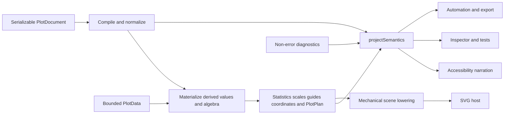

# Renderer-Neutral Plot Semantics for Accessibility, Inspection, and Automation

A plot must expose its meaning before any renderer turns geometry into pixels. In `/home/manuel/workspaces/2026-08-24/use-optkit/plot`, `PlotSemantics` is the serializable result that makes this possible. It is projected from normalized grammar, planning metadata, and diagnostics in `src/semantics.ts`; it is not reconstructed from the `SceneGraph`, SVG DOM, computed styles, or a screenshot. That ordering matters to accessibility software, developer inspection tools, tests, exports, and automation. Each needs a stable account of what a plot claims, what data transformations produced it, and what limits apply, independent of a particular host.

> [!summary]
> - SVG records paintable primitives and resolved coordinates; it does not reliably retain variables, statistical provenance, hidden guides, annotation intent, or algebraic source identity.
> - `PlotSemantics` records the compiler-level meaning of variables, composition, layers, scales, guides, annotations, coordinates, algebra, coverage, and non-error notices in JSON-safe data.
> - A scene is a renderer-neutral drawing plan, but it is still not the semantic source. The semantic projection has an independent input path and a mutation test that protects that boundary.
> - Semantics improves accessibility, inspection, and automation without claiming that structured metadata alone supplies an adequate narrative, interaction model, or accessible host UI.

## Why SVG cannot be the semantic source

An SVG can state that a path has a stroke, that a rectangle occupies a region, and that a text node occurs at a coordinate. It cannot, by inspection alone, state why that path exists. The same path can represent an identity line, a summary estimate, a confidence interval boundary, a fitted model, an annotation rule, or an unrelated decorative element. The geometry has already lost the distinction between source data, statistic output, position adjustment, and explanatory annotation.

This loss is not a defect in SVG. SVG is a rendering vocabulary. It is designed to paint lines, paths, rectangles, symbols, and text. The compiler has already resolved a larger sequence before SVG receives a scene: a document is compiled, rows are materialized, statistics and positions run, scales train, geometry is planned, coordinates transform planned geometry, guides and annotations resolve, and scene lowering produces paintable nodes. Recovering the earlier stages from the final nodes would require guessing. The system must not make accessibility and automation depend on guesses.

Consider a compact 120×24 sparkline. HSPLOT-005 deliberately permits title, frame, axes, grids, and legends to be absent from planning. Its scene can therefore contain only an ordinary line path or a point symbol. The absence of an x axis does not mean that no temporal scale mapped x values. The absence of a y axis does not mean that a response unit vanished. The absence of a legend does not mean that a group variable did not split the line into separate paths. SVG can show the result of these decisions, but cannot establish their meaning.

The browser evidence from HSPLOT-007 makes the distinction practical. The first sparse grouped sparkline had a finite path and no diagnostic, yet its computed stroke was `rgb(243, 243, 239)` against a white background. Structural validity did not establish visual availability. The correction used the serializable CSS token `var(--hs-plot-foreground, #171916)` for unmapped marks. A separate one-point case had a path containing only `M x y`, which has no visible extent; planning now provides a `singlePointRadius` and lowering emits an ordinary symbol. Neither browser finding could be repaired by asking SVG to explain statistical or data meaning. They are renderer/host visibility facts, while semantics remains a separate compiler product.

Conversely, an SVG screenshot can look plausible while being statistically false. A summary error bar does not expose from its vertical segment whether its interval is standard error, confidence, or another method. A polar sector path does not expose whether it began as an ordinary stacked Cartesian bar, which variable supplied theta, or whether direction is clockwise. A path produced after `log(response)` does not disclose that invalid non-positive values became null during materialization. The needed facts exist earlier in the pipeline and must survive there.

## The semantic projection and its provenance

`src/semantics.ts` defines the output as `PlotSemantics` and exports `projectSemantics(grammar, plan, diagnostics)`. The function accepts a successful `NormalizedGrammar`, a successful `PlotPlan`, and diagnostic records. It never accepts a scene. The source-level boundary is intentional: semantic output is built from contracts that still know what each value means, while plan metadata provides trained domains, guide entries, visible panels, statistics metadata, and bounded coverage.

The result is ordinary serializable data. `src/semantics.test.ts` JSON-stringifies and parses it, then requires equality. This permits a host to place semantics beside an SVG, a non-SVG renderer to use it unchanged, a test to compare it without DOM setup, or an automation client to transport it across a process boundary. Serialization is not only an export convenience. It prevents a semantic result from depending on closures, DOM objects, or host-specific handles that another consumer cannot inspect.

The semantic variable record preserves an identifier, source, label, semantic type, and applicable field ID, unit, timezone, constant, or derived expression. Sources distinguish `field`, `constant`, `derived`, `unity`, `nest`, `blend-value`, and `blend-source`. This is provenance, not presentation. A value created by a blend expansion and a value read from a source field can occupy equal-looking marks while requiring different explanations and different audit trails.

Composition records x and y references, ordered group references, and facet partitions. A semantic value reference is explicitly a variable, an after-stat output, or a constant. Facet partition records retain a typed stable key separately from a display label. The test fixture with numeric `1` and string `"1"` produces two distinct stable keys even though both labels render as `"1"`. SVG text would make those partitions appear identical. Semantics supplies the identity required by an inspector, an accessible table, or a datum-selection protocol.

Each layer reports its effective composition, statistic kind, named outputs, method, parameters, assumptions, invalid-value count, geometry, position, aesthetics, and explicit groups. This records the result after inheritance and normalization rather than merely echoing a partial authoring document. A summary layer can therefore disclose that it produces `mean`, `lower`, `upper`, and `count`, uses a stated interval method, and encountered a stated number of invalid values. A screen-reader narration can choose how much to say; a quality-control tool can check that an interval method is present; neither needs to infer it from line segments.

Scales retain channel, kind, trained or explicit domain, unit, and timezone. The projection derives positional domains from panel scales and aesthetic domains from planned legend entries. Guide records then state a separate concern: axes and legends have visibility, display placement or orientation, labels, ticks or entries, contributing variables, and scale domains. This implements the contract developed in HSPLOT-005 and HSPLOT-008: a scale maps values operationally; a guide explains that mapping. A hidden guide has `visible: false`, an empty tick/entry list, and retains its related scale semantics. Treating hidden explanatory chrome as missing data would make compact plots inaccessible and impossible to inspect honestly.

Annotations likewise preserve more than their lowered lines, rectangles, symbols, or text. A semantic annotation has a stable ID, kind, label, intent, anchor, optional text, and visible panel IDs. Intent is a closed vocabulary: `reference`, `target`, `limit`, or `note`. Its anchor is data-relative, datum-relative, panel-relative, or a pair of anchors for a region. An automation client can identify a target threshold by ID and intent without OCR, color matching, or a fragile traversal of SVG groups. A reader can distinguish a reference rule from data geometry even when both render as a line.

## Coordinates preserve source meaning and display meaning

HSPLOT-009 adds Cartesian, transpose, and polar coordinates after scale and geometry planning. The semantic projection retains the grammar’s x and y variables rather than swapping their identities when transpose changes their display orientation. It also records the coordinate configuration: polar theta channel, start angle, clockwise/counterclockwise direction, and inner radius. This prevents an inspector from treating a display-side change as a semantic variable reassignment.

The distinction is visible in the transpose proof. A temporal x variable can appear on the vertical display axis and a quantitative y variable on the horizontal display axis. The values still have their original semantic roles, units, and timezone. Typography offsets remain device-layout quantities rather than transformed data coordinates. The first implementation transformed offsets with normalized data geometry, moving a label outside the SVG on a non-square panel. The repair demonstrates why a renderer-neutral semantic record should not attempt to reverse-engineer coordinates from text positions.

Polar coordinates make the limit clearer. Fifteen planned ordinary stacked bars can lower to fifteen generic SVG paths. A path is sufficient to paint a sector; it is insufficient to tell a generic consumer whether the path represents an interval geometry transformed into polar space, which radial baseline applies, or whether an angular rule is a ray rather than a circle. The coordinate record and layer provenance answer these questions. Unsupported topologies—area, ribbon, error-bar, and boxplot in polar mode—produce an explicit `coordinate.geometry.unsupported` diagnostic rather than a misleading approximation. Automation can consume that boundary directly rather than deducing it from absent paths.

## Algebra and transformation provenance

HSPLOT-010 extends plot authorship with derived variables and cross, nest, blend, and unity algebra. The public expressions are finite JSON structures; they do not carry callbacks, source strings, or arbitrary runtime code. Compilation checks references, types, cycles, finite cut breaks, and algebraic shape. Materialization then creates ordinary rows before statistics. Planning, scene lowering, renderers, and hosts do not interpret surface algebra.

Semantics must retain the parts of that process that remain meaningful to readers and tools. Derived variables preserve their expression. Algebra preserves nest provenance—generated variable, outer reference, inner reference, and canonical source path—and blend provenance—generated value variable, discriminator variable, operands, and source path. This is essential where visual output is many-to-one or one-to-many. A blend expands one source row into several materialized rows; an SVG cannot reveal which source operand produced a mark. A nest distinguishes equal labels under distinct outer identities; a visible label cannot retain that typed conditional identity.

The order is equally important. For responses $e^1$ and $e^3$, `log(response)` materialized before a summary mean produces 2. Computing a mean first and logging afterward produces a different number. A final mark coordinate cannot recover which sequence happened. `PlotSemantics` retains expression provenance while the layer’s statistic records the calculation method and outputs. Together they allow a consumer to state the actual program without pretending that pixels encode it.

## Scene independence is a testable architectural rule

A scene is useful: it is renderer-neutral compared with SVG, and a canvas, PDF, or test renderer can lower the same scene. But scene neutrality is not semantic neutrality. Scene nodes describe drawing operations and resolved geometry. They do not own the canonical explanation of a plot.

The package proves this with a direct mutation test in `src/semantics.test.ts`. It renders a fixture, serializes semantics, mutates `outcome.scene.metadata.documentId`, then verifies that semantic serialization and `semantics.documentId` do not change. The test is modest but exact: a consumer holding a scene object cannot accidentally redefine the independently projected meaning. Architecture tests complement it by guarding source boundaries so downstream stages do not import the public document and renderer layers do not acquire compiler/algebra interpretation.

This design also clarifies failure results. A failed compile returns diagnostics and no later outputs. A failed plan retains a successful grammar but has no scene or semantics. A successful render returns a plan, scene, semantics, and diagnostics. Semantics is therefore not a post-hoc decoration attached to every partial visual result. It is a claim supported by successful normalization and planning. Non-error diagnostics become semantic notices; errors remain the reason no semantic result is asserted.

## Uses: accessibility, inspection, and automation

Accessibility use begins with a host that exposes an appropriate accessible name, description, focus behavior, and adjacent controls. `PlotSemantics` gives that host truthful source material. It can describe the document description, variables and units, layer methods, coverage notice, coordinate kind, visible or intentionally hidden guides, group identities, and annotations. A compact sparkline needs such a description because it intentionally omits textual plot chrome. For a dense faceted analysis, the host may provide a concise summary plus a linked table or inspector rather than narrating every mark. The projection supports both choices because it supplies structured facts rather than a fixed prose string.

Inspection use is broader than debugging pixels. A developer tool can display effective layer composition after inheritance, trained domains, hidden-guide decisions, guide entries, facet keys, annotation anchors, derived expressions, blend operands, and notices. Tests can assert semantics instead of snapshotting unstable SVG path strings. A data-quality workflow can reject partial coverage or nonzero invalid-value counts. A documentation tool can generate a method summary from statistic outputs and assumptions. These uses remain valid if the renderer changes or if no renderer is loaded.

Automation needs stable identifiers and bounded vocabulary. A client can find the annotation with ID `target:latency`, determine that it is a limit or target, list affected panels, and compare its data-relative anchor with a policy threshold. It can compare algebra provenance across versions, validate that a temporal scale uses UTC, or require that an accessibility description mention partial coverage. It can decide whether an output is appropriate for a compact operational display without parsing DOM text, CSS classes, colors, or screen coordinates. The API does not require an agent to infer meaning from visual similarity.

## Limits and working rules

Structured semantics is necessary but not sufficient for accessibility. It does not select the right level of detail for a person, provide keyboard interaction, replace data tables, measure contrast, or guarantee that SVG paths remain visible in a browser. The HSPLOT-007 stroke and one-point evidence shows why renderer/host checks remain separate. Browser inspection verified rendered height, computed styles, finite attributes, mark counts, accessibility descriptions, and screenshots for compact sparkline cases; HSPLOT-008 through HSPLOT-010 added configured-guide, coordinate, and derived-algebra browser proofs. Semantic tests and browser checks answer different questions.

Semantics also has deliberate scope limits. It projects bounded coverage rather than an unbounded data dump. Datum anchors are structurally represented, but stable datum identity is later HSPLOT-011 work; current planning diagnoses and omits unresolved datum-relative annotations rather than guessing. Coordinate inversion and interaction hit-testing are absent. Unsupported polar topology diagnoses instead of fabricating a semantic claim. Consumers must treat notices and diagnostics as part of the result, not discard them once a scene exists.

The durable rules are straightforward:

- Project meaning from normalized grammar, plan metadata, and diagnostics; never parse SVG to recover compiler intent.
- Keep scale operation separate from guide visibility, and report intentionally absent explanatory components.
- Preserve provenance for statistics, derived variables, nests, blends, coordinates, annotations, coverage, and invalid values.
- Keep scene lowering mechanical and ensure a scene mutation cannot alter semantic output.
- Validate semantics structurally and validate rendering in a browser; neither test substitutes for the other.
- Add new semantic fields only when their producer has a stable compiler or planning contract and a consumer can use them without renderer-specific inference.

The relevant implementation is `src/semantics.ts`, with serialization, provenance, typed-facet, statistic, and scene-independence proofs in `src/semantics.test.ts`. Supporting evidence and rendered inspections are in the HSPLOT-005 through HSPLOT-010 ticket directories under `/home/manuel/workspaces/2026-08-24/use-optkit/plot/ttmp/2026/08/29/`, especially HSPLOT-007 `reference/03-rendered-sparkline-inspection.md`, HSPLOT-008 `reference/02-validation-and-rendered-inspection.md`, HSPLOT-009 `reference/02-coordinate-matrix-and-validation.md`, and HSPLOT-010 `reference/03-hsplot-005-010-completion-audit.md`.
