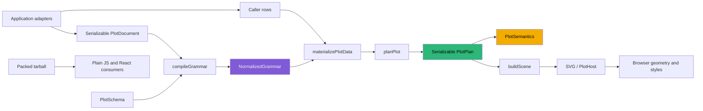

# Testing a Declarative Visualization Compiler Across Representations

A declarative visualization package should be tested as a compiler, not only as a collection of SVG components. A caller writes one serializable `PlotDocument`; the package validates it, normalizes it, materializes finite data programs, computes statistics and positions, trains scales, plans geometry and guides, projects semantics, lowers a renderer-neutral scene, and may render that scene in a browser. HSPLOT-005 through HSPLOT-010 in `/home/manuel/workspaces/2026-08-24/use-optkit/plot` established tests and evidence at each of those representations.

The important question is always specific: which contract does this evidence establish, and which contract remains outside its reach? A compiler test can establish that a document is rejected at a stable source path. It cannot establish that a browser stroke is visible against the deployed host background. A screenshot can establish a particular rendered state under a particular browser and theme. It cannot establish package exports for a clean non-React consumer. A tarball smoke test can establish that shipped files resolve. It cannot establish that an application's domain adapter preserved reset and gap semantics. Treating those distinctions as first-class prevents one successful check from being used as evidence for an unrelated boundary.

> [!summary]
> - HSPLOT-005–010 test one language through normalized grammar, materialized rows, plans, scenes, semantics, browser output, packaged consumers, and application adapters.
> - Deterministic JSON and hand-calculated numeric fixtures establish compiler and geometry contracts that screenshot inspection cannot replace.
> - Browser computed styles and geometry establish visual facts that scene tests cannot see.
> - Consumer smoke and tarball inspection establish distribution facts; parity work establishes application behavior.

## The contract graph

The package has several durable representations, each with a different owner and failure mode. The test strategy begins by naming them rather than collapsing all output into the term “render.”



`PlotDocument` is JSON-safe authoring input. `NormalizedGrammar` is the compiler’s explicit interpretation of that input: defaults are concrete, layer composition is effective, sources and paths are retained, and public algebra is lowered into ordinary compiled variables and dimensions. Materialized rows are an internal data representation that includes immutable derived values or blend expansion. `PlotPlan` contains final panels, bounds, guides, annotations, scales, and planned mark geometry. The scene is generic drawing data. `PlotSemantics` describes meaning without parsing scene nodes. The browser realizes the scene under actual CSS, SVG layout, and host dimensions. Finally, an npm package is a separate distribution representation with its own export and dependency contracts.

The pipeline supports a compact test matrix:

| Representation | Primary question | Strongest evidence | What it cannot prove |
|---|---|---|---|
| Document and compiler IR | Is the language accepted, normalized, and diagnosed deterministically? | Contract and JSON fixtures | Pixel visibility or tarball contents |
| Materialized rows and plans | Are numerical values, layouts, and geometry correct? | Hand-calculated fixtures and goldens | CSS cascade and browser layout |
| Scene and semantics | Did lowering preserve geometry and meaning independently? | Structural assertions and negative architecture tests | Actual SVG rendering |
| Browser | Are visible geometry, computed styles, roles, and dimensions correct? | Playwright inspection and screenshots | General correctness for untested inputs |
| Tarball consumer | Do published files and entrypoints work outside the workspace? | Packed plain-JS and React smokes | Application-specific domain rules |
| Application parity | Did a product migration retain operational behavior? | Adapter audit and product smoke | General compiler completeness |

The stages are intentionally independent. `src/architecture.test.ts` protects that independence by rejecting forbidden imports and obsolete branches. It checks that core and `/author` do not import React or browser APIs, that scene lowering does not import compiler, layout, presentation, or scale machinery, and that planning, scene construction, SVG, and React do not interpret algebra operators. These are negative tests: their value is that a feature could look correct today while quietly making a future representation depend on the wrong layer. They do not prove a particular chart is numerically correct; a forbidden-import search cannot replace a numerical fixture.

## Compiler contracts and deterministic JSON

The first test layer treats compilation as a deterministic mapping from document and schema to `NormalizedGrammar` plus source-addressed diagnostics. HSPLOT-005 used this layer to make presentation presence explicit. An axis, legend, frame, or title is `auto`, `none`, or `configured`, rather than a renderer inference. The compiler resolves that finite vocabulary before layout. Tests establish that hiding a guide leaves its operational scale intact, that compact presentation removes the intended explanatory components, and that old root aliases such as a first-panel `plan.panel` do not reappear. Those tests cannot prove the font fits a particular browser viewport; they prove that the planner receives a complete, unambiguous presentation contract.

HSPLOT-006 applies the same test to authoring. The React-free `/author` functions return ordinary documents, not builder state or a private authoring IR. Helper-authored and independently written literal documents compile and render to equal outcomes; JSON round-trips preserve them; recursive checks find no functions or symbols. Equal invalid helper and literal inputs produce equal diagnostics. This proves that convenience syntax has not become a second language. It does not prove a consumer can import the package from an npm artifact, because workspace resolution can hide missing declarations or incorrect export metadata.

HSPLOT-008 and HSPLOT-009 extend compiler tests to configured guides, annotations, and coordinates. Configured axis validation covers participating dimensions, sides, positive automatic tick counts, explicit tick types and domains, format compatibility, and bounded formatting options. Annotation tests cover stable and duplicate IDs, anchors, mixed coordinate-space regions, and exact facet selection. Coordinate tests reject infinite angles and inner radii outside `[0, 1)`. Each assertion names the document path, such as `coordinate.innerRadius` or `presentation.xGuide.options.ticks.values[1]`. Stable paths are part of the usable language: a compiler that identifies an invalid option without locating it does not give an editor or author enough information to repair the document.

HSPLOT-010 adds the strongest compiler-only cases. Derived expressions form a finite AST: variable references, supported unary and binary quantitative operations, and ordered numeric cuts. Tests reject unknown references, dependency cycles, invalid semantic types, and non-increasing finite cut breaks. Cross requires exactly two ordered positional dimensions. Nest preserves typed outer and inner identity. Blend rejects empty or mixed-type operands and lowers to generated value and source-discriminator variables. Unity lowers to the fixed identity `__unity__`. Repeated compilation and document round-trips produce stable generated IDs, normalized variables, plans, scenes, and semantics.

Deterministic JSON asserts more than “it serializes.” It establishes that equal declarations lead to inspectable equal compiler output, enabling reproducible snapshots, caches with explicit future contracts, and regression review. It cannot establish that every deterministic result is correct: a consistently wrong layout or transform is still deterministic. That is why numeric fixtures sit beside structural serialization tests.

## Numeric fixtures: make geometry and stage order falsifiable

Compiler work needs examples whose expected result is calculated before the code under test runs. HSPLOT-005 used a 120×24 compact viewport fixture: with two pixels of padding and no title, guides, legends, or frame, the expected content and panel bounds are `x: 2`, `y: 2`, `width: 116`, and `height: 20`. This establishes that compactness is planned geometry rather than CSS shrinking. It cannot establish that a Storybook wrapper honors the 120-pixel width; that belongs to browser inspection.

HSPLOT-009 uses coordinate arithmetic directly. Transpose is an involution: applying the normalized transform twice recovers the original device point within floating-point tolerance. Polar cardinal fixtures calculate expected center, outer-radius, and inner-radius positions. They also establish the package’s SVG-space convention: clockwise direction increases toward device-down at one quarter turn. Ordinary stacked bars provide a topology fixture: 15 existing bar intervals with `position.stack` must become 15 closed sector paths. No `geom.pie`, `sector`, or renderer-specific polar branch is accepted. Unsupported area, ribbon, error-bar, and boxplot geometry instead emits `coordinate.geometry.unsupported` and returns no partial plan or scene.

That last result is important because an approximate transformation may generate finite SVG while representing the wrong boundary topology. The fixture proves the chosen supported cases and the explicit refusal for unsupported ones. It cannot prove that every possible polar mark topology is correct; the unsupported cases are a declared boundary, not missing test coverage disguised as support.

HSPLOT-010 fixes the data-stage contract with a small summary fixture. Two input responses are `e¹` and `e³`. Materializing `log(response)` before a summary statistic yields values `1` and `3`, then a mean of `2`. Running the statistic first would yield `log((e + e³) / 2)`, which is different. The test verifies both stage order and caller-row immutability. Separate fixtures verify nested `Springfield` values remain distinct under US and CA, and blending two population fields from two source rows yields four ordered cases with preserved source-row identity. Numeric sorting uses an explicit comparator, avoiding JavaScript lexical order.

Fixtures also expose test defects. The first transform-before-summary test omitted the required summary interval configuration and failed while reading an undefined multiplier. Adding the standard-error interval made the test test the intended stage ordering. A test only carries its claimed meaning when all prerequisites of the exercised contract are present.

## Plans, scenes, and semantics: test the intermediate products

`PlotPlan` is the boundary HSPLOT-005 made complete. It owns title, content and panel bounds, frame, planned axes and grids, legends, annotations, scale results, coordinate metadata, and mark geometry. `buildScene` mechanically lowers those results into generic `line`, `rect`, `path`, `symbol`, `text`, and `group` nodes. Tests inspect planned values and then scene roles separately. If a plan is wrong, the defect is in compilation or planning. If the plan is correct and a scene node is wrong, the defect is in lowering. If both are correct and a mark cannot be seen, the defect may be renderer or host styling.

This boundary is enforced in source as well as behavior. The scene builder does not import `PlotDocument`, compiler functions, scale training, or layout calculation. Geometry planning does not create guide nodes. Host CSS is prevented from restoring a frame or background omitted by the plan. These tests prove ownership boundaries. They cannot prove that each allowed node paints correctly in every renderer, but they prevent a browser-specific concern from becoming hidden planner behavior.

`PlotSemantics` receives its own tests because a plot’s meaning is not recoverable from SVG alone. Semantics carries variable source and type, composition, groups and facets, statistic provenance, scale domains, guide visibility and values, annotation intent and anchors, coordinate metadata, algebra provenance, bounded-data coverage, and notices. HSPLOT-008 tests guide and annotation semantics independently of their pixels. HSPLOT-009 verifies original x/y meaning remains intact when transpose changes display sides. HSPLOT-010 verifies generated nest/blend provenance survives lowering while algebra itself does not survive into planner or renderer code.

An independence test mutates a scene object and confirms the semantics object does not change. That proves semantics was not derived by reading scene output. It cannot prove that an accessibility client describes semantics well; it gives such a client a stable source of meaning. Browser accessibility snapshots then test the host’s particular exposure of that information.

## Browser evidence: geometry and computed style are separate facts

The HSPLOT diaries and screenshots demonstrate why a structurally valid scene is not a visual proof. HSPLOT-007’s initial grouped sparse sparkline had a finite path and no diagnostic, yet its computed stroke was `rgb(243, 243, 239)` on white. Browser inspection recorded the foreground variable `#171916`, a `#ffffff` background, and the pale computed line. The correction made the neutral mark style `var(--hs-plot-foreground, #171916)`, preserving serialized renderer-neutral style data while letting host themes resolve it. Scene tests could establish the style string, but only computed styles established its actual contrast in that host.

The same inspection found that a one-datum line path has only an `M x y` command and therefore no visible extent. Planning now carries a deterministic 2.5-pixel single-point radius and lowering emits an ordinary symbol. The final Storybook checks, from `reference/03-rendered-sparkline-inspection.md`, recorded a 120.00×23.99 SVG, a dark path and/or circle, no axes, panels, grids, titles, or legends, and zero browser console warnings for grouped sparse, flat, and one-point states. The empty state produces no SVG and a truthful `data.empty` diagnostic. Screenshots preserve both the corrected states and the initial low-contrast failure.

HSPLOT-008 browser checks establish configured top ticks, a right y-axis with `text-anchor: start`, two major x-grid lines, a horizontal legend inside a 760×420 viewport, finite geometry attributes, and computed annotation colors. It also records one named image and legend-entry buttons in the accessibility tree. HSPLOT-009 records 15 polar mark paths from 15 ordinary stacked bars, four radial grids, visible angular and radial labels, and an external rectangular legend. The transpose story confirms temporal x values are displayed vertically and quantitative y values horizontally while retaining the original semantic labels. HSPLOT-010’s derived-variable story confirms three finite grouped paths and transformed y ticks around 2.8–3.8 under the `Log response` guide.

These checks prove specific browser facts under Chromium, the built Storybook, and stated dimensions. They cannot prove visual correctness under every browser, user stylesheet, font substitution, zoom level, theme token set, or application layout. A missing `/favicon.ico` static-server 404 is documented as server chrome rather than a plot or React runtime failure. Recording environmental limits keeps browser evidence precise.

## Storybook and screenshots are fixtures, not decorative output

Storybook provides stable, named specimens that join source fixtures to browser evidence. It is useful when a reviewer needs to inspect a full representation rather than infer it from JSON. The HSPLOT stories deliberately cover boundary states: sparse groups, one point, flat domains, empty data, configured guide variants, annotations, transpose, polar stacked bars, and derived algebra. The screenshot directories under each ticket’s `reference/screenshots/` preserve the resulting image and, in selected cases, a failure image.

A screenshot proves that one rendered state looked a particular way at capture time. It cannot prove semantic identity, deterministic planning, or broad regression behavior. Therefore screenshots are paired with browser DOM evaluation—viewBox, role counts, attributes, computed CSS—and with unit fixtures. Storybook itself is also built in the final gates, which proves the specimens compile into static output but does not exercise their interactions as a running product would.

## Packaging tests: distribution is a compiler boundary too

HSPLOT-006 treated the author entrypoint as an independently consumable public product. A repository test can import source or workspace artifacts while declarations, exports, peer dependencies, or bundled chunks are wrong for users. The package process therefore runs `pnpm pack --pack-destination .artifacts` and installs that artifact into clean consumers.

The author-only plain-JavaScript smoke omits peer dependencies, constructs and renders a plot, and verifies no React directory was installed. The React consumer separately installs React and builds the host path. These tests prove that `/author` remains React-free in the shipped artifact while `/react` remains consumable where React is present. The final HSPLOT-010 audit records 105 tar entries with author and root JavaScript and declarations, CSS, README, and package metadata, while excluding `src/`, ticket workspace, and `storybook-static`.

This evidence cannot prove package publication credentials, registry availability, consumer bundler compatibility beyond the smoke environments, or a future semver migration. It does prove that the actual current tarball, rather than a source-tree assumption, satisfies the intended import and dependency contracts.

## Consumer smoke and application parity

Consumer smoke establishes package-level consumption; application parity establishes product behavior. HSPLOT-007 audited Datalab and RAG-TTC separately because a generic grammar does not own product continuity rules. RAG-TTC’s progress display must account for phase changes, resets, gaps, unknown totals, stale state, rate, ETA, and terminal text. Its adapter determines explicit segment groups from durable work events and passes ordinary grouped line rows to a 120×24 sparkline document. Plot does not infer discontinuities from missing values.

The migration replaced a hand-written 640×160 SVG with `PlotHost` while preserving adjacent operational text and state behavior. One-point markers and theme-aware foreground subsequently became package corrections because they are general line-rendering and host-theme contracts, not RAG-TTC-only conditions. Datalab adapters were similarly moved to canonical documents; a stale keyboard-routing expectation was corrected to the existing product contract rather than changing unrelated application behavior during plotting work.

Parity matrices, adapter tests, consumer smoke, and screenshots prove that named applications exercise the ordinary compiler path and retain specified behavior. They cannot prove every product concern is now part of the plot package, and they should not be interpreted that way. Product state, data acquisition, persistence, routing, and domain terminology remain application-owned.

## Final gates, audits, and the limits they retain

The final HSPLOT-010 completion audit records these fresh gates after the program’s source and documentation commits:

```bash
pnpm install --frozen-lockfile
pnpm test                 # 22 files, 133 tests
pnpm typecheck
pnpm lint                 # 78 files checked, no fixes
pnpm build
pnpm build-storybook
pnpm consumer:smoke
pnpm pack:check           # 105 tar entries
git diff --check
```

All passed. The audit also records clean `docmgr doctor` reports for HSPLOT-005 through HSPLOT-010 and no unchecked task in the six ticket task files. Diaries preserve failed commands and corrections: `pnpm smoke:consumer` was not the package script; the correct command is `pnpm consumer:smoke`. Early guide compatibility used an undefined `scale` local, then an over-strict scale identity that split compatible legends. Early transpose logic transformed typography offsets in normalized geometry, producing overflow on a non-square panel. Initial screenshot capture required creating the destination directory. These are useful because they identify the actual contract that changed rather than presenting validation as linear.

The gates establish that the checked repository state meets its declared build, type, lint, test, package, and static-story requirements. They do not eliminate future risk. Fixed text metrics do not perform browser font measurement or collision resolution. Datum-relative annotation anchors remain represented but intentionally diagnose and omit until HSPLOT-011 supplies stable datum identity. Coordinate inversion and interaction are not implemented. Polar support intentionally excludes area, ribbon, error bars, and boxplots. Blend expands immutable rows and may need measurement-driven redesign for larger bounded data. Browser proof is Chromium-specific, and the Storybook build retains a generated-chunk-size advisory.

The durable rule is therefore not “run every available check.” It is to connect each check to one representation and one claim. Compiler contracts establish language meaning and diagnostics. Numeric fixtures establish arithmetic and ordering. Deterministic JSON establishes reproducibility. Plans and scenes establish stage ownership. Semantics establishes inspectable meaning. Browser inspection establishes visible geometry and computed style. Storybook makes those browser cases reviewable. Packed consumers establish distribution. Application parity establishes product behavior. Together, these representations test a declarative visualization compiler without requiring any single output form to stand in for all the others.

## Related notes

- [[Hyperslop Plot - Completing the Compiler from Mechanical Scenes to Plot Algebra]]
