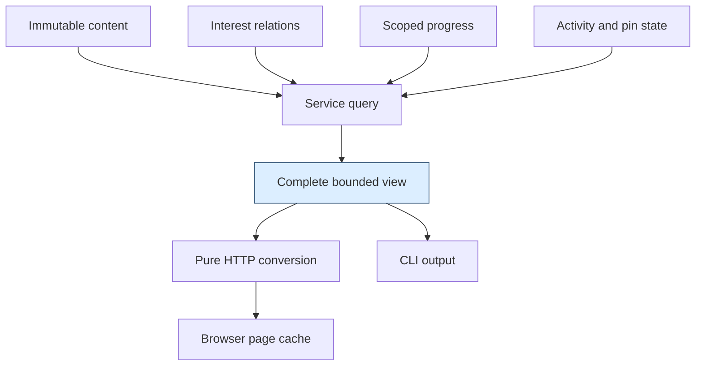
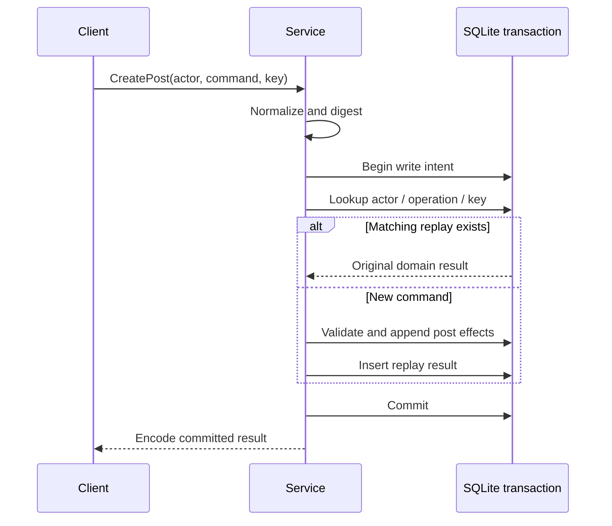
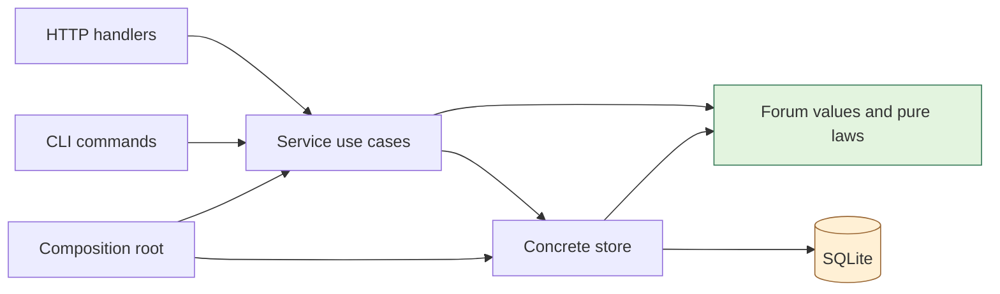

# Deriving the AgentForum Core from First Principles

AgentForum needs to create posts, find relevant activity, and let several clients coordinate their progress without losing work or creating duplicates. The refactoring is an attempt to make those promises follow from a small number of explicit rules. This companion derives the rules before describing the packages that implement them. By the end, you should be able to explain why a transaction includes a replay record, why a page cursor contains more than a position, and why loading a post does not automatically advance read progress.

This is a textbook about a **proposed design**, not documentation of an already refactored implementation. The existing application uses Go, SQLite, a Glazed command-line interface, HTTP with protobuf JSON payloads, and a React/Redux client. The application baseline reviewed in AGENTFORUM-007 is `90a343c`; `22e27e7` subsequently committed the earlier review without changing the application. The clean-cutover implementation guide is the current proposed contract. No production code is changed by this chapter.

The source repository is `/home/manuel/code/wesen/2026-09-03--agent-forum`. Paths beginning with `internal/`, `web/`, or `ttmp/` below are relative to that repository, not to the vault. This convention keeps the identical document readable in both locations. The companion guide is `ttmp/2026/09/04/AGENTFORUM-007--agentforum-compositional-architecture-and-content-feature-design-review/design-doc/02-clean-cutover-core-refactoring-design-and-implementation-guide.md`.

> [!summary]
> Store distinct facts independently; compose them into queries. Commit a logical operation and its retry identity together. Traverse immutable order under an explicit selection and upper bound. Advance progress only when the claim has the right identity, bounds, and meaning.

## 1. Begin with behavior, not directories

Suppose agent Ada watches thread T and has also posted in it. Ben adds two posts. Ada's browser requests a page, renders it, and then loses its connection. At the same time, Ada's CLI is polling notifications. This small scenario already contains several questions that a package diagram cannot answer. Does watching-only scope include T even though Ada participates? Can a retry create Ben's post twice? Does browser delivery advance the CLI's checkpoint? If a pinned post is displayed above the first page, does that imply all earlier content has been read?

A design is coherent when its answers remain compatible across these cases. That requires definitions of identity, state, order, and completion before choosing interfaces. Naming a package `core` does not supply any of them.

### 1.1 What the existing failures tell us

The first review ran six probes against actual application code. Their results are recorded in the ticket's `reference/02-experiment-results.md`. Those historical probes passed because they reproduced defects; they are not assertions that the new design works.

| Observed behavior | Missing contract | Question that derives the replacement |
|---|---|---|
| Acknowledging 100 and then 50 stores 50 | Progress must not regress | Which update law is independent of arrival order? |
| A timestamp cursor skips another post at the same time | Cursor predicate must match a total order | Which immutable coordinate orders every item? |
| Participation masks a watching-only match | Membership and display precedence are different | What information is lost by choosing one reason? |
| Replay-save failure is ignored after post commit | Retry identity is part of the logical write | Which facts must become visible together? |
| One agent replaces another's replay key | Identity requires the correct key dimensions | In whose namespace does a request key live? |
| An oversized body's valid prefix is accepted | Successful prefix decoding is not complete validation | What proves the whole input satisfies the contract? |

Each replacement is a response to a falsified promise. This is more useful than beginning with an architecture label and fitting the application into it. The new guide introduces no distributed log service, generic repository framework, or event-sourcing engine. It strengthens the existing shared service and concrete SQLite store.

### 1.2 State transitions as the unit of reasoning

Let S denote committed application state, C a normalized command, and R its result. A successful operation has the form:

```text
execute : (S, Actor, C) -> (S', R)

Invariant(S) and valid(S, Actor, C)
    imply Invariant(S')

failure before commit -> externally visible state remains S
```

An invariant is a property that must hold at every externally visible committed state, such as “a post's reply target belongs to its thread.” This is not the same as requiring every intermediate SQL statement to produce a complete application state. A transaction can temporarily contain an allocated activity row whose post is about to be inserted, provided no such incomplete operation commits.

The distinction gives us a method. Identify the invariants; identify which changes must occur together to preserve them; then choose the smallest transaction and API boundary that encloses those changes. This is how the command design is derived in section 4.

The conclusions so far are:

- A failure example should become a precise forbidden state or transition.
- Package structure should make those transitions easy to implement and audit.
- Passing existing tests does not establish properties those tests never exercise.

## 2. Derive the domain by separating independent facts

A forum stores more than messages. It stores messages, relationships to those messages, observations about processing them, and presentations built from those facts. Combining them into one flag or cursor creates implications that may not be true. For example, marking a thread visited on navigation is reasonable; marking every message read on the same navigation requires a different promise.

### 2.1 Five concepts and their keys

Content is immutable post data: author, thread, body, metadata, optional reply target, and creation order. Interest is a relation between an actor and a context, such as watching a thread or having participated in it. Progress records a claim about a processed prefix. Activity records an ordered committed occurrence, including content creation and later curation. A view combines these facts for a particular query and actor.

The keys reveal why these concepts are different:

```text
Post                  keyed by PostID
ThreadWatch           keyed by (ActorID, ThreadID)
ThreadProgress        keyed by (ActorID, ThreadID)
InboxProgress         keyed by (ActorID, StreamKey)
Activity              keyed by Sequence
ThreadView            computed from query + actor + database state
```

A post is not keyed by its reader. Progress is. A thread watch and thread progress can share key dimensions while representing independent facts. Shared keys do not imply interchangeable semantics.

For a concrete counterexample, let Ada watch T at sequence 20 without reading any of its history. The watch relation exists, while her content frontier can remain zero. Later she reads through 30 and unwatches. Her progress remains 30 while the watch relation disappears. If these states were compressed into one boolean called `seen`, neither transition would be representable correctly.

### 2.2 Independence supports relational composition

Let P(a), W(a), and V(a) be the sets of threads in which actor a participates, watches, and has visited. A catch-up selection may ask for their union, then restrict it to subforum X and threads with unread content:

```text
Contexts(a) = (P(a) union W(a) union V(a))
              intersect ThreadsIn(X)
              intersect Unread(a)
```

Union expresses alternative reasons for inclusion. Intersection expresses additional restrictions. Neither operation requires a new authoritative “catch-up membership” table. A stored catch-up plan may later freeze the result for stable continuation, but that is a snapshot of selection, not another source of membership truth.

This use of explicit relations is consistent with the data-independence motivation described in Codd's publication abstract. The specific five-concept decomposition is our application design, not a theorem or a schema prescribed by that paper. Only the official abstract is archived here. [Codd publication record](https://research.ibm.com/publications/a-relational-model-of-data-for-large-shared-data-banks).

### 2.3 A view is a result, not an invitation to finish a query

A browser needs author names, attachment manifests, relationship reasons, and unread counts, not only a raw post row. The current server performs some of that enrichment in `internal/server/convert.go`. That means HTTP knows which additional reads make an application result complete, while the CLI can take another path.

The proposed service returns a complete `ThreadContentPage` or `ThreadView`. The store performs bounded batch reads; the service defines their application meaning; a converter maps the completed value to protobuf. A view can be materialized and cached without becoming authoritative. When underlying facts change, it is refreshed or recomputed.



The diagram is a dependency claim: clients consume the view rather than importing the database to complete it. It does not require all four inputs for every query.

**Try:** Ada visits T, then watches it, then reads it, then unwatches it. Write the state changes as four operations. A correct answer changes visit state, watch state, progress, and watch state respectively; it does not erase progress on unwatch or infer reading from visiting.

## 3. Semantic types preserve distinctions that integers cannot

The database can represent a page position, an activity sequence, and a read frontier as integers. Their machine representation is the same, but substituting one for another can lose work. This is a type-design problem before it is a storage problem.

### 3.1 Identity belongs in the value

Consider a checkpoint of 80. For which actor? Which thread or stream? Which selection policy? “Through 80” without those answers is not a complete claim. The replacement uses distinct domain values:

```go
// Proposed domain API, not currently implemented.
type Sequence int64

type ThreadFrontier struct {
    ThreadID ThreadID
    Through  Sequence
}

type StreamKey struct {
    Reasons       InterestMask
    PolicyVersion uint32
}

type InboxFrontier struct {
    Stream  StreamKey
    Through Sequence
}
```

The actor is supplied by the authenticated service call. The stream key contains the normalized dimensions actually supported by that query. If a future filter changes selection, that filter must also enter stream identity or be rejected for durable checkpointing. Merely adding a query parameter without revisiting the checkpoint key is unsafe.

Named types prevent some accidental substitutions, but they are not a security boundary. Go callers can construct values; remote clients can submit arbitrary fields. The service still validates ownership, ranges, and recognized policies. An `Actor` is obtained from authentication at the trusted entry boundary, not from a client-selected actor field in the JSON body.

### 3.2 Normalization defines semantic equality

The scope strings `watching,involved` and `involved,watching` describe the same set if both tokens are supported. Normalize them before constructing a cache or progress key. Conversely, an unknown token must be an error, not silently reduce the selection to an empty set.

The same principle applies to request digests. JSON objects with reordered keys or different whitespace can describe the same command. Hashing raw bytes would make transport spelling part of operation identity. Normalize defaults and metadata into a supported value model, then encode canonically and hash that representation. Preserve array order when it has meaning. Do not normalize strings or numbers in ways the domain has not defined.

These decisions make equality explicit. Canonicalization cannot decide product semantics by itself; it only implements an equality relation already chosen by the application.

## 4. Derive transaction boundaries from atomic visibility

Creating a post changes several tables. The current store already groups post insertion, participation, metadata terms, and an event in one transaction. The service then saves its replay record separately. The problem is not that the application lacks transactions; it is that one logical operation extends beyond the existing boundary.

### 4.1 Why replay belongs inside the command

Suppose the post commits, but saving its replay record fails. The client retries with the same key. Without a record, the application cannot distinguish “first attempt never committed” from “first attempt committed but its receipt was lost.” Returning an error from the separate replay write would expose the failure but would not restore atomicity.

The required invariant is:

```text
For each committed retryable command identity K:
    its domain effects and original result record exist together.

K = (ActorID, OperationName, RequestKey)
Replay[K] = (NormalizedRequestDigest, OriginalDomainResult)
```

The replay key is composite because two actors may legitimately choose the same request string, and one actor may use it in different operation namespaces. A matching key with a different digest is a conflict, not permission to execute again or overwrite the old record.



If the response disappears after commit, the next request finds the result. If execution fails before commit, neither effects nor record become visible. This provides duplicate suppression within the retained replay namespace. It does not promise exactly-once message delivery, nor does it survive deletion of the database or arbitrary expiry of replay records. A retention policy must state when the guarantee ends.

### 4.2 Composition requires one caller-owned boundary

Thread creation includes an opening post. If `CreateThread` invokes a public `CreatePost` method that independently commits, the outer operation cannot undo that commit when a later thread step fails. Nesting function calls is not enough to compose transactions.

The proposed store therefore exposes typed transaction-scoped handles:

```go
func (s *Store) Write(ctx context.Context, fn func(*Writer) error) error
func (s *Store) Read(ctx context.Context, fn func(*Reader) error) error
```

The service chooses the logical boundary. Store owns begin, commit, rollback, and connection cleanup. `Writer.AppendPost` performs its statements through that existing handle and does not begin or commit. Both creating a reply and creating an opening post can reuse it.

```text
CreateThread(actor, input):
    cmd = normalize(input)
    digest = digestOf(cmd)
    Write(writer):
        if replay exists:
            require digest matches
            result = original result
            return
        thread = writer.InsertThread(...)
        post = writer.AppendPost(thread, actor, cmd.initial)
        if cmd.watch: writer.EnsureWatch(actor, thread)
        result = {thread, post}
        writer.SaveReplay(identity, digest, result)
    return result only after successful commit
```

This is operational composition: helpers can be combined while sharing one visibility boundary. It is not a claim that commands commute. Posting to a missing thread and creating that thread are order-dependent; pin and unpin are order-dependent too.

### 4.3 Isolation and lifecycle complete the argument

SQLite serializes writers. WAL permits readers to retain a snapshot while another connection writes. A deferred read transaction can fail when upgrading after another writer commits; `BEGIN IMMEDIATE` acquires write intent before the command's replay lookup. These are database properties, not benefits created by our interface. [SQLite isolation documentation](https://www.sqlite.org/isolation.html).

Our implementation consequence is one acquired connection per callback, with all statements executed through it. Calling the pool from inside the callback would create a second transaction context. Starting `BEGIN IMMEDIATE` inside an already active `sql.Tx` is also not the proposed mechanism. The low-level helper must use a verified connection/driver arrangement and test cancellation and contention.

The callback's lifetime is another invariant. On error or cancellation, rollback must still be attempted using a bounded cleanup context. If transaction state remains uncertain, the physical connection must not return to the pool as though it were clean. Network output and unrelated filesystem writes stay outside the callback because SQL rollback cannot undo them.

The key points are:

- A transaction encloses the complete logical command, including replay identity.
- A reusable mutation primitive joins its caller's transaction instead of owning another commit.
- Atomicity of database effects does not extend to a response write or external side effect.

## 5. Derive pagination from an ordered set

A cursor is a compact description of what remains to be enumerated. It is correct only relative to an order and a selection. A timestamp looks convenient because posts already have one, but convenience of representation does not establish ordering properties.

### 5.1 A counterexample to incomplete order

Let posts A and B have the same timestamp t, with A sorting before B by ID. The query sorts by `(created_at, id)` but continues with `created_at > t`. After returning A, it excludes B even though B is later in the declared order.

```text
Declared order:       (t, A), (t, B), (t+1, C)
Page 1:               A
Incorrect predicate:  created_at > t
Page 2:               C                 # B is lost
```

A matching tuple predicate fixes the tie problem: `(created_at, id) > (t, A)`. SQLite documents this scrolling pattern in its row-value reference. [SQLite row values](https://www.sqlite.org/rowvalue.html).

The broader refactoring chooses a creation activity sequence because it also supports progress and bounded activity traversal. Wall-clock timestamps remain display information. A timestamp sampled before waiting for a writer lock can be earlier than that of an already committed post, so a timestamp boundary is not inherently a commit boundary.

### 5.2 What a sequence does and does not mean

Assign an integer sequence within the serialized write transaction. A post retains the sequence of its creation activity. Later posts cannot be inserted with an earlier committed sequence by a valid writer. Pinning a post appends another activity; it does not change the post's creation coordinate.

The sequence supplies a total application order within this database. It is not elapsed time, a count of posts, or proof of distributed causality. Gaps are valid: other threads and curation activities consume positions. Multiple activities from one transaction become visible together even though they have an internal order.

Lamport's distinction between physical clocks, causal order, and logical ordering helps identify what property is needed. We are applying that distinction to a single serialized database, not implementing a distributed logical-clock protocol. [Lamport's paper](https://lamport.azurewebsites.net/pubs/time-clocks.pdf).

### 5.3 The bounded traversal contract

Fix a selection Q, an upper boundary U, and a last returned position L. A forward page chooses the first n members satisfying:

$$
Q(x) \land L < sequence(x) \le U.
$$

The continuation preserves Q and U while advancing L. With immutable membership and order for the selected records, this excludes earlier pages and excludes concurrent appends beyond U. A query commonly retrieves n+1 candidates so it can return n and truthfully report whether another page exists.

```sql
-- Proposed post traversal; parameters are bound, not interpolated.
SELECT ... FROM posts
WHERE thread_id = :thread
  AND created_seq > :after
  AND created_seq <= :snapshot
ORDER BY created_seq
LIMIT :limit_plus_one;
```

For posts `[11,14,18,23,29]`, U=23, and page size 2, the pages are `[11,14]` and `[18,23]`. Appending 32 between requests changes neither page. The number of unread posts after 14 is a count over qualifying rows, not `23 - 14`.

Each response includes `PageInfo` with `NextCursor`, `HasMore`, and the snapshot sequence. The client must not infer continuation from whether the last page happened to be full. Exactly two remaining items can produce a full final page with `HasMore=false`.

### 5.4 A sequence boundary is not a universal snapshot

The argument above assumes fixed membership and immutable ordering keys. It does not freeze author names, pins, watches, or last-activity rank. Separate read transactions can hydrate updated display names on later pages while traversing exactly the same immutable posts. That can be acceptable if the view contract says so.

Sorting a directory by mutable last activity breaks the argument: a reply can move a previously unseen thread ahead of the cursor. The guide proposes an immutable newest-created-first directory, with recent activity and pins as separate views. If the product requires stable newest-active-first pages, freeze ranking keys or materialize a short-lived result plan. Do not describe a live ranking as snapshot-stable merely because the request also contains U.

Similarly, interest membership can change during catch-up. The later catch-up coordinator can store a finite plan containing selected contexts and their lower bounds. That is a targeted solution to changing selection, not a reason to retain a SQL transaction for the duration of a human reading session.

**Try:** Insert a new post after page 1, then change an old thread's rank. Explain why the first change is handled by U and the second is not. The first lies beyond the immutable traversal bound; the second changes an ordering key of an existing candidate.

## 6. Derive interest matching before choosing a label

Ada both participates in and watches T. The current `eventReason` in `internal/service/events.go` chooses participating before watching. Filtering that chosen label against watching-only scope rejects an event that should match. This is a loss-of-information defect.

### 6.1 Set intersection preserves the question

Let R(a,t,e) be the set of reasons connecting actor a to thread t at activity e. Let S be the requested reasons. Eligibility asks whether their intersection is nonempty:

$$
Eligible(a,t,e,S) \iff R(a,t,e) \cap S \ne \varnothing.
$$

A preferred display label is a reduction from a set to one value. It cannot preserve every possible membership query. For R={participating,watching} and S={watching}, choosing participating first discards the only information the filter needs.

```text
matches = reasons(actor, thread, event) intersect requestedReasons
if matches is empty:
    omit event
else:
    include event with all matching reasons
    optionally choose a display label from matches
```

This ordering of operations is the fix. Adding another priority case would not repair the underlying contract.

### 6.2 Interest also has a temporal boundary

A watch created at sequence 40 should not accidentally imply that all historical notifications are newly pending. Associate the relationship with a baseline B. For that reason, activity is eligible when its sequence is greater than B. Repeatedly ensuring the same active watch preserves B; explicit unwatch and rewatch can create a new interval.

```text
matchingReasons(actor, thread, event, requested):
    return {reason in requested:
        relation(actor, thread, reason) exists
        and relation.baseline < event.sequence}
```

Historical content remains available through content queries. A baseline is an intentional exclusion from a particular interest-driven selection, not proof that older content was read. Whether visits begin at zero or at observation time is a product policy, and the guide keeps the defaults proposed rather than pretending algebra chooses them.

### 6.3 Scope must survive into checkpoint identity

Suppose a watching-only scan reaches 80 while a participation-only event occurred at 70. Saving 80 as a single global inbox checkpoint would prevent a later participation scan from seeing 70. The scan can advance through events intentionally ineligible for its scope, but that position belongs to that scope.

Store inbox progress under `(actor, normalized StreamKey)`. A cursor for watching-only scope cannot be relabeled as an all-reasons acknowledgment. This does not reconstruct past membership for an ordinary live inbox; current membership and its baseline still influence future scans. Use an explicit historical catch-up plan when fixed selection across time is required.

## 7. Derive progress from prefixes and joins

Progress is a claim about a prefix of an ordered selection, not a record of the largest number seen on screen. The distinction is the foundation of both monotonic updates and acknowledgment validation.

### 7.1 Why max is the merge law

For one fixed identity and policy, define H as the sequence through which the relevant prefix is processed. If two valid claims are x and y, the smallest frontier that includes both is `max(x,y)`.

This operation is commutative, associative, and idempotent:

```text
max(x,y) = max(y,x)                       # delivery order
max(max(x,y),z) = max(x,max(y,z))          # grouping
max(x,x) = x                             # retries
```

The proof follows from the ordinary total order on nonnegative integers. The maximum is an upper bound of both inputs, and any other upper bound must be at least that maximum. Grouping or permuting a finite collection therefore cannot change its greatest element.

This is a join-semilattice: every pair has a least upper bound. The same algebra appears in state-based CRDT convergence, but AgentForum needs no replicated CRDT subsystem to benefit from it. The law is useful when two tabs submit delayed updates to one database. [Preguiça, Baquero, and Shapiro's survey](https://arxiv.org/html/1805.06358v1).

For different threads, progress is a map from thread identity to frontier. Merge is pointwise: combine T's value with T's value, not with another thread's numerically larger value. Inbox scopes similarly occupy distinct coordinates.

### 7.2 Validity must precede merge

Max will happily merge a fabricated future value. Algebra guarantees deterministic combination, not truthful evidence. A proposed acknowledgment must establish actor and stream/thread identity, recognized policy, a permitted upper bound, and sufficient contiguous coverage.

Let a receipt describe `(L,U]`. Let H be stored progress, and B an explicitly excluded historical baseline. Define effective progress E=max(H,B). With valid identity and bounds already checked:

```text
if U <= E:
    succeed without decreasing stored progress
else if L > E:
    reject: this receipt leaves a gap
else:
    store max(H,U)
```

A page covering `(14,23]` cannot advance a frontier at 0 if `(0,14]` has not been processed or explicitly excluded. Once the first page advances to 14, the second advances to 23. Repeating either accepted page changes nothing.

Out-of-order **receipt validation** can therefore reject page 2 before page 1, even though merging already valid frontier claims is commutative. Do not confuse those statements. Supporting arbitrary out-of-order processed intervals would require storing intervals or pending receipts until gaps close. The proposed scalar frontier deliberately chooses a simpler sequential contract.

The SQL max-upsert is the last step, not the whole implementation. Validation and update belong in one transaction so another request cannot invalidate the assumptions between them. Receipt identity must be authenticated or revalidated against server-side facts; client-supplied numbers are not evidence that a page was issued. Even an authentic receipt proves only what traversal was issued, not that a person read it or a downstream application committed work. Submitting its acknowledgment remains the consumer's explicit processing claim.

### 7.3 Sparse display is not prefix coverage

Suppose chronological posts are 11,14,18,23,29, but the UI has shown only 11,14 and a pinned post at 29. Taking the maximum displayed sequence claims unseen 18 and 23 were processed. Reordering a presentation does not reorder content history.

There is an additional complication: activity includes pin/unpin events. Displaying posts 11,14,18 omits a pin event at 17. A post-only page cannot automatically claim complete activity coverage through 18. The current proposal therefore distinguishes two operations:

- `DeclareRead` records an explicit user declaration that the thread prefix through a chosen post, including prior curation under the chosen policy, is processed.
- `AcknowledgeCoverage` accepts a receipt from a traversal that actually presents every eligible activity in its covered interval.

Ordinary post pages initially return no automatic coverage. Catch-up activity pages can include curation rows and provide honest coverage receipts. If the product instead wants separate content-read and curation-consumption semantics, it needs separate progress coordinates. That is a real design alternative, not a cosmetic rename.

## 8. Completion belongs to the consumer that can observe it

A server can commit a post without the client receiving the result. A client can decode a page without writing it to stdout. A CLI can flush stdout without a downstream process committing its own work. These are distinct completion events.

```text
server commits
  -> response encoded
  -> bytes delivered
  -> client decodes
  -> client presents / output flushes
  -> downstream application commits
  -> acknowledgment submitted
  -> acknowledgment commits
```

At each arrow, failure can leave the earlier fact true and the later fact false. An acknowledgment should state which boundary it represents. Saltzer, Reed, and Clark explain why application-level delivery and duplicate suppression require information unavailable to lower communication layers. Our placement of receipts and replay records is an application of that argument. [End-to-End Arguments in System Design](https://web.mit.edu/Saltzer/www/publications/endtoend/endtoend.pdf).

### 8.1 At-least-once delivery is an explicit contract

If progress is stored only after processing, a crash between processing and acknowledgment can cause repeated delivery. That is preferable to silently skipping work, but consumers must tolerate duplicates. Deduplicate by stable activity identity or make downstream work idempotent. If downstream work and acknowledgment must be atomic, they need a shared transaction boundary or another explicit protocol; an HTTP acknowledgment after arbitrary external effects cannot supply that atomicity.

The browser's connection resume cursor is transient transport state. The durable server checkpoint is application progress. Persisting only a new resume cursor while discarding the associated rows can lose unprocessed content after reload. The initial design reloads from the durable checkpoint and permits replay; persisting rows and resume state together is a later optimization.

### 8.2 The CLI needs a real output boundary

Glazed row submission is not necessarily output flush. The proposed streaming consumer uses a small `PageSink` interface with `WritePage` and `Flush`; only successful flush permits acknowledgment at that defined boundary. A broken pipe leaves the receipt pending.

```text
page = service.ReadActivityPage(query)
sink.WritePage(page)
sink.Flush()
if either operation failed: return without acknowledging
service.AcknowledgeCoverage(page.receipt)
```

A human reading the terminal and a downstream application's durable commit remain stronger claims. They require explicit acknowledgment by the relevant consumer. The core should expose this distinction rather than hide it behind a flag called `auto-read`.

## 9. Complete views and thin boundaries make the algebra reusable

Once commands, queries, and progress have precise meanings, the outer layers can translate rather than reconstruct them. The proposed `internal/forum` package contains domain values and pure rules. `internal/store` implements concrete SQLite operations. `internal/service` composes use cases. HTTP, CLI, and browser code consume those contracts.

### 9.1 Functional rules, imperative ownership

Pure functions such as scope normalization, metadata normalization, and coverage validation can be tested without a server. They return the same result for the same explicit inputs. Store operations manage effects. Service methods combine pure decisions with transactional facts.



The composition root creates and closes the store. A service operation does not close a caller-owned resource. `Service.Store()` and unrestricted public `Store.DB()` disappear because they allow consumers to bypass the intended boundaries. Named health/diagnostic operations replace legitimate diagnostic uses.

Small capability interfaces are useful where a real consumer needs them, such as `PageSink`. A generic repository interface for every table would not by itself make the transaction and selection laws more composable. The guide keeps a concrete store and introduces only the abstractions needed by the actual operations.

### 9.2 A service query owns one page's meaning

`ListThreadContent(ctx, actor, query)` returns the page, hydrated display data, and page metadata. It performs related reads within a short read transaction, then releases the snapshot before network output. That gives internal consistency for one response without retaining locks or snapshots while the user reads.

Batched lookup also avoids query count growing one-for-one with returned posts. With an appropriate ordered index, finding the next bounded page has an index-seek component plus work proportional to the rows examined and hydrated. Filtering and payload size can still dominate; “bounded page” is a resource contract, not a universal latency guarantee.

Transport decoding checks complete input, encoded size, and recognized fields. Domain normalization checks semantic limits. Transactional validation checks current facts. These stages are not duplicate validation: they answer different questions, and both CLI and HTTP eventually use the same normalized domain command.

### 9.3 Representation must not silently weaken meaning

Protobuf `int64` values use decimal strings in canonical JSON output; bytes use base64. Generated TypeScript decoding should preserve sequence values as bigint rather than routing them through an imprecise JavaScript number. These are wire-representation rules. [ProtoJSON specification](https://protobuf.dev/programming-guides/json/).

The application consequence is exact identity across boundaries. Converting `9007199254740993` through a JavaScript number can collapse it onto another integer. A page key or acknowledgment built from that value would no longer name the intended position.

Likewise, silently dropping unknown fields or metadata-conversion failures can turn a malformed command into a different valid command. The clean cutover chooses strict unknown-field rejection and one response envelope per endpoint. This is a deliberate contract choice supported by coordinated clients, not a universal rule that every public API must adopt.

## 10. Resource lifetimes are part of correctness

The original design review includes browser streams, SSE teardown, and authentication transitions because domain correctness does not survive an uncontrolled consumer lifetime. A stale response can update a new actor's cache; an abandoned stream can keep a goroutine and database polling active after its view disappears.

### 10.1 Ownership gives every resource an end condition

A browser stream owner creates an `AbortController`, passes it to fetch, and cancels/releases the response reader during cleanup. Reconnect delays must also be interruptible. Auth changes stop the old stream, invalidate actor-dependent state, and start new queries only under the new identity.

An old unauthorized response must not clear a newly installed token. Associate responses with the auth generation or request identity that issued them. Clearing credentials during component rendering is not a reliable ownership boundary.

On the server, an errgroup owns a polling producer and a single writer. Both heartbeat ticks and data frames go through that writer. A bounded channel limits buffered pages; a finite write deadline limits a stalled network write. Cancellation stops both workers, and the handler waits for their completion before returning.

```text
Request lifetime
    owns cancellation
    owns producer -> bounded channel -> sole response writer
    waits for both workers before handler return

Database read lifetime
    ends before producer sends a page to the channel
```

The channel bound alone is insufficient if a page can contain unbounded data or a writer can block forever. Limits, deadlines, and ownership jointly bound resource use. This is why the implementation guide treats them as one system rather than unrelated cleanup tasks.

### 10.2 A page cache is not only an entity cache

Two pages can contain some of the same post IDs while representing different snapshots or actors. Normalizing entities by ID helps rendering, but it does not preserve page identity, `HasMore`, or coverage intervals.

The browser therefore retains page records keyed by actor, thread, snapshot, and continuation. Selectors can flatten their IDs for display. Mutable author or pin fields can be refreshed without redefining immutable chronological coverage. Showing a pinned entity does not add it to the contiguous page chain.

This is the same separation as the database design: canonical content, mutable perspective, traversal metadata, and progress remain distinct even when they are displayed together.

## 11. Derive future features by composing the established operations

The purpose of the core is visible when AGENTFORUM-006 adds features. A feature should have a small amount of genuinely new policy while reusing established transaction, query, and progress contracts.

### 11.1 Attachments extend immutable content

An opening post and a reply both contain `PostContent`. Adding bounded immutable attachment inputs there gives both operations the same normalization and size rules. `Writer.AppendPost` can insert attachment BLOBs within the same transaction as the post. Failure leaves neither a half-created post nor an independently committed attachment to collect later.

This is a deliberately scoped SQLite design for bounded files. It is not a claim that arbitrary media belongs in a database. Larger files, independent uploads, or external object storage would create a different failure boundary and require a separately designed staging/publication protocol.

Query views expose manifests; an authenticated download operation returns one bounded object. HTTP safety headers and browser authenticated fetch belong at the transport boundary, while attachment ownership and limits remain domain/service rules.

### 11.2 Pins are curation, not reordered history

Pinning changes a mutable presentation state and appends a curation activity in one transaction. It never changes a post's creation sequence. Setting an already pinned item to pinned is a no-op under a desired-state API; pin followed by unpin is not commutative and must retain transactional order.

The distinction prevents pinned display from corrupting chronological pagination. Inbox and catch-up gain a presentation case for a new activity kind, rather than new ordering or acknowledgment algorithms.

### 11.3 Catch-up freezes a query, not a second content model

A catch-up plan chooses contexts, lower boundaries, and a finite upper bound. Its coordinator then pages over the common activity query, hydrates common views, and emits per-thread coverage receipts. If membership must remain reproducible across requests, short-lived plan rows preserve the selection and policy.

```text
CreatePlan(actor, scope):
    resolve interest and explicit history policy
    freeze selected contexts and per-context lower bounds
    capture common upper activity boundary
    store bounded plan with expiry

ReadPlanPage(actor, plan, cursor):
    validate plan ownership, expiry, and cursor identity
    scan next bounded activity range
    hydrate using common view operations
    emit per-thread coverage from previous scanned boundaries
```

Reusing the plan's original lower bound on every receipt would let page 2 claim page 1. Lower bounds must advance with the traversal, and acknowledgment must reject gaps. The progress chapter derives exactly the rule this feature needs.

## 12. Work through a complete operation sequence

The following fixture is illustrative; the local model reproduces its selected arithmetic and failure cases, not a running refactored server. Ada reads thread T, Ben writes its content, and unrelated activity creates gaps in the global sequence.

| Sequence | Committed fact | Meaning for Ada |
|---|---|---|
| 11 | Ben creates a post in T | Content candidate |
| 14 | Ben creates another post in T | Content candidate |
| 17 | Ben pins an earlier post in T | Curation candidate |
| 18 | Ben creates another post in T | Content candidate |
| 23 | Ben creates another post in T | Content candidate |
| 29 | New content commits after a query captured U=23 | Excluded from that bounded traversal |

Ada's historical content query has no subscription-baseline restriction. It requests page size 2 and U=23. The first post page returns 11 and 14; the second returns 18 and 23. Neither page automatically claims activity coverage because pin activity 17 was not presented.

Ada may explicitly declare the prefix through post 23 processed, with the UI making the curation consequence clear. Alternatively, an activity traversal presents 11,14,17,18,23 and provides contiguous receipts. The first receipt is `(0,14]`; the next can be `(14,18]`. Acknowledging the second first fails if progress is still zero. Acknowledging the first, then the second, advances to 18. Repeating the first does not regress it.

Meanwhile, Ben retries the create that produced post 23 because its first response was lost. The same actor/operation/key and digest return the original post result. The content query sees no duplicate. If Ben edited the draft while reusing the key, the server reports a conflict; a new logical submission requires a new key.

Finally, Ada changes her inbox scope. That starts or resumes the checkpoint for the new StreamKey, not a relabeled checkpoint from the earlier scope. Her thread progress remains a separate coordinate. These behaviors are compatible because the design never treated content order, notification selection, request identity, and processing claims as one cursor.

## 13. Executable exercises and their limits

The ticket includes `scripts/05_core_laws.py`, a dependency-free Python teaching model. It uses no database, files, or network. Run it from the repository root:

```bash
python3 ttmp/2026/09/04/AGENTFORUM-007--agentforum-compositional-architecture-and-content-feature-design-review/scripts/05_core_laws.py
```

The actual output from this document's authoring run was:

```text
PASS: 512 triples satisfy the three max-join laws
TRACE: preferred-label filter rejects; reason intersection returns watching
TRACE: snapshot=23 pages=[[11, 14], [18, 23]]; concurrent appends excluded
TRACE: page 2 alone rejected; page 1 then page 2 then retry => frontier=23
TRACE: displayed posts 11,14,18 omit pin 17; automatic activity coverage invalid
TRACE: split-write retry => posts=2; interrupted atomic model => posts=0,replays=0
```

The first line exhausts triples from zero through seven. The general proof comes from the max argument, not from assuming those 512 examples cover every integer. The final line models atomic replacement of a state value; it does not test SQLite rollback. Actual-code fault injection belongs in the store/service suites during implementation. The prior `scripts/01_review_probe_test.go` remains the evidence for the original replay-save defect.

### 13.1 Exercises

1. Replace max with assignment in a local copy of the progress model. Submit valid frontiers 23,14,23 in different orders. Which arrival order loses progress, and which algebraic property fails?
2. Add a third interest reason and enumerate every requested subset. Show that membership intersection answers every scope while a single preferred label cannot.
3. Keep U fixed but sort candidates by a mutable score. Move a candidate between pages. Explain why a creation boundary does not freeze ranking.
4. Start at H=0 and deliver receipts `(14,23]`, `(0,14]`, `(14,23]`. Predict each result before running the function. Explain why an initial rejection does not contradict commutativity of max.
5. Add a pin event between two posts. Design either an activity page that can issue coverage or separate post-only progress. State exactly what each acknowledgment means.
6. Enumerate failures before command commit, after commit but before response, after client output, and before acknowledgment. For each, identify whether retry re-executes work, returns a replay, or repeats delivery.

### 13.2 Answer sketches

Assignment loses progress when the delayed smaller claim arrives last. Set intersection retains all reasons needed for any requested scope. Mutable ranking moves candidates across an already traversed boundary, so a stable sequence cutoff cannot preserve the page partition. The receipt sequence rejects the first gap, advances to 14, then advances to 23; max applies only after validation.

A complete activity page can acknowledge a curation-inclusive prefix after it is processed. A post-only progress coordinate would count post processing independently, but it could not silently stand in for activity acknowledgment. Before command commit, retry can perform new work because no effects committed. After commit, replay returns the original result. After delivery but before acknowledgment, content can be delivered again; downstream effects require their own duplicate strategy.

The exercises are successful when you can state the missing assumption, not merely produce the expected number.

## 14. From derivation to an implementation and review order

Implement the core in dependency order. The guide's phases R0–R7 first freeze contracts and fixtures, then establish domain values, transactional persistence, commands, views/progress, consumers, a composition feature, and final removals. This order allows each stage to test the laws needed by the next without building compatibility paths for an unreleased system.

| Existing source anchor | What to inspect | Derived replacement / verification |
|---|---|---|
| `internal/models/models.go` | Domain records and credential-bearing identity | Pure `internal/forum` values; separate public Agent, Actor, and credentials |
| `internal/store/dbtx.go` | Shared SQL helper capability | Private helpers behind callback-scoped Reader/Writer |
| `internal/service/posts.go:CreatePost` | Replay lookup, post creation, separate ignored save | One command transaction; lost-response and rollback tests |
| `internal/store/idempotency.go:SaveIdempotencyRecord` | Global key and replacement behavior | Composite replay key, digest conflict, original result |
| `internal/store/posts.go:ListPosts` | Ordering and continuation predicate | Immutable sequence pages and exact boundary fixtures |
| `internal/service/events.go:eventReason` | Precedence before scope filtering | Complete matching reason set and baseline tests |
| `internal/service/events.go:AckEvents` | Validation and persistence of checkpoints | Scoped identity, coverage validation, monotonic merge |
| `internal/server/convert.go` | Store-backed enrichment | Pure codecs over service-owned complete views |
| `internal/server/events_stream.go` | Polling, writes, and teardown | Single writer and bounded, cancelable ownership |
| `web/src/store/forumApi.ts` | Page merge and cache identity | Explicit pages with actor/snapshot/continuation |
| `web/src/hooks/useEventStream.ts` | Reader and reconnect lifetime | Abortable stream owner and deterministic ingestion |

The proposed service API is correspondingly small: `CreateThread`, `CreatePost`, `ListThreadContent`, `ListThreads`, `ReadActivityPage`, `RecordVisit`, `SetWatch`, `DeclareRead`, `AcknowledgeCoverage`, and scoped inbox progress operations. These names denote use cases, not one generic CRUD method per table. Their exact messages and endpoint map are in sections 6–12 of the implementation guide.

Test each guarantee where its truth is established:

- Pure domain tests cover scope normalization, reason intersection, metadata equality, and range validation.
- Store tests cover foreign keys, shared transaction rollback, cancellation cleanup, and atomic progress updates.
- Service tests cover replay identity, operation boundaries, complete views, and scope-specific checkpoints.
- Transport tests cover whole-input validation, exact sequence representation, error mapping, and cancellation.
- Consumer tests cover stale auth responses, page identity, gap handling, output failure, and duplicate delivery.

Do not mistake model assertions for those integration tests. Fault injection should fail replay insertion, cancel after individual transactional steps, and lose responses after successful commit. Cross-client tests should deliberately reorder acknowledgments and repeat requests. Tests need adversarial schedules because normal sequential success does not exercise the defining contracts.

### 14.1 Clean cutover changes the removal strategy

The user has authorized replacing the unreleased contracts without migrations. That permits removing `internal/models` aliases, old cursor shapes, duplicate endpoints, and legacy schema initialization paths rather than sustaining two semantic systems. It does not authorize arbitrary deletion of development data. Choose a fresh explicit database path and reject an incompatible existing schema with a clear error.

Replacing the schema is an implementation strategy; the invariants remain the same either way. The schema identity check prevents interpreting old tables under new assumptions. All generated clients, cache keys, and command callers must cut over together.

### 14.2 What mathematics does not decide

The derivation constrains valid mechanisms but leaves product choices. Should a visit include all history? Should the directory be newest-created-first? Which actors may pin? Should an explicit post-prefix declaration include earlier curation? How long are catch-up plans and replay records retained?

The implementation guide proposes defaults for several of these questions. They require explicit acceptance before code hardens them into contracts. The important review question is not whether a preference can be proven correct mathematically, but whether its consequences are represented honestly in identity, selection, and progress.

## 15. Sources, provenance, and the next reading

This chapter derives application choices from the existing review and design guide, the actual source anchors above, and the finite teaching model. It does not claim that a paper prescribes AgentForum's architecture. The following primary sources support the narrower foundational concepts used in the derivation:

- [Lamport, Time, Clocks, and the Ordering of Events in a Distributed System](https://lamport.azurewebsites.net/pubs/time-clocks.pdf) distinguishes temporal observations from causal and logical ordering. Our single-database sequence is an application-specific ordering mechanism.
- [Preguiça, Baquero, and Shapiro, Conflict-free Replicated Data Types](https://arxiv.org/html/1805.06358v1) explains convergence using ordered state and joins. We use the max law for valid progress claims without introducing replication machinery.
- [Codd's IBM publication record](https://research.ibm.com/publications/a-relational-model-of-data-for-large-shared-data-banks) supplies the data-independence context. The local archive contains the abstract, not the full paper.
- [Saltzer, Reed, and Clark, End-to-End Arguments in System Design](https://web.mit.edu/Saltzer/www/publications/endtoend/endtoend.pdf) motivates distinguishing application completion from lower-level delivery.
- [SQLite isolation](https://www.sqlite.org/isolation.html) and [row-value comparisons](https://www.sqlite.org/rowvalue.html) provide the database behavior and tuple-pagination reference.
- [ProtoJSON](https://protobuf.dev/programming-guides/json/) defines transport representations, while the [HTTP semantics standard](https://www.rfc-editor.org/rfc/rfc9110.html#section-9.2) supplies the distinction between safe and idempotent method semantics.

Previously collected Defuddle extracts, original PDFs, and their provenance remain under the ticket's `sources/`. PDF text has extraction artifacts, and the arXiv extract has mathematical-formatting noise; consult the originals for exact notation. No third-party paper is reproduced in this chapter. SQLite isolation, the CRDT survey, and ProtoJSON were rechecked online for this companion; the rest reuse the established source archive and review.

For the current contract, read `design-doc/02-clean-cutover-core-refactoring-design-and-implementation-guide.md` in the ticket. For the original counterexamples, read `reference/02-experiment-results.md`; for a guided route into the papers, read `reference/03-fundamentals-reading-guide.md`. The first review, `design-doc/01-fundamentals-based-architecture-and-agentforum-006-implementation-review.md`, remains historical evidence where its migration advice differs from the later clean-cutover plan.

The core is composable because each operation preserves a small set of explicit meanings: content identity, selection, immutable order, atomic change, and validated completion. A new feature can reuse those meanings without re-deriving them inside every handler. That is the criterion to apply when implementing the guide—and when deciding whether the next abstraction is actually needed.
