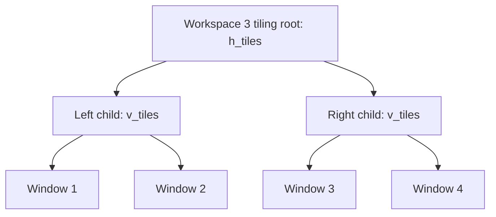

# AeroSpace Workspace 3: Deterministic 2×2 Tiling and Meta-Key Allocation

This report explains the implementation of a four-window, equal-area layout on AeroSpace workspace `3`, the command sequence used to create it, and the configuration change that makes the layout repeatable with `alt-shift-0`. It also analyzes the interaction between AeroSpace's `alt-*` bindings and Zsh/Readline Meta-key commands. The implementation is small, but it exposes several general rules about AeroSpace's tree model: a visual grid is represented as nested containers, `layout` changes container state rather than directly assigning screen coordinates, and `join-with` is the correct structural operation when normalization flattening is enabled.

> [!summary]
> - Workspace `3` now uses a horizontal root containing two vertical child containers. Each child contains two windows, producing a 2×2 layout.
> - The current configuration uses `alt-shift-0` to rebuild and balance that layout for the four-window case.
> - `alt-b` and `alt-f` were removed because they conflict with common Zsh/Readline word-navigation commands. Other Meta bindings remain intentionally unchanged.

## 1. The problem

AeroSpace does not model a grid as four independent rectangles. It manages a tree of tiling containers. A four-window 2×2 arrangement therefore requires two levels of structure: one container divides the monitor horizontally into two columns, and each column contains a vertical container dividing its area between two windows.

The initial request was operational: arrange the four windows currently present on workspace `3` so that each occupies one quarter of the monitor. The resulting requirements were precise:

1. Keep all four windows on workspace `3`.
2. Create two columns.
3. Put two windows in each column.
4. Make all four areas equal.
5. Provide a keyboard shortcut for repeating the arrangement.
6. Preserve Zsh/Readline's common Meta-word commands where possible.

The last requirement affects the shortcut design. In terminal applications, `alt` is commonly used as the Meta modifier. Readline binds `Meta-b` to backward-word and `Meta-f` to forward-word in its Emacs keymap. AeroSpace bindings for those keys prevent the terminal from receiving the corresponding command. The final configuration therefore removes both `alt-b` and `alt-f`, while leaving the other existing bindings in place until they are deliberately reviewed.

## 2. Observed state and evidence

The active AeroSpace installation reported version `0.21.3-Beta` for both the client and the server. The relevant configuration file is:

```text
/Users/manuel.odendahl/.aerospace.toml
```

The configuration has the following properties relevant to this layout:

```toml
config-version = 2
enable-normalization-flatten-containers = true
default-root-container-layout = 'tiles'
default-root-container-orientation = 'auto'
gaps.inner.horizontal = 0
gaps.inner.vertical = 0
gaps.outer.left = 0
gaps.outer.bottom = 0
gaps.outer.top = 0
gaps.outer.right = 0
```

Workspace `3` was focused during the operation and contained these four windows, in the order returned by `aerospace list-windows --workspace 3`:

| Window ID | Application | Window title |
|---:|---|---|
| `618` | Google Chrome | `AeroSpace Commands - Google Chrome - Manuel (Work)` |
| `1924` | Unity | `SampleScene - vh-tec-hub-smoke - Windows, Mac, Linux - Unity 2021.3.10f1 Personal (Personal) <Metal>` |
| `1778` | Unity Hub | `Unity Hub 3.21.1` |
| `1156` | kitty | `π - manuel.odendahl` |

The zero gap configuration is important. AeroSpace still has to account for macOS display geometry and any application-specific constraints, but it does not intentionally subtract spacing between the four tiles. `balance-sizes` then equalizes the available space at the relevant containers.

## 3. AeroSpace's layout data model

The key distinction is between a window and a container. A window is a leaf in the tiling tree. A container has an orientation and contains one or more child nodes. The orientation controls how the children are arranged:

- A horizontal tiling container places its children from left to right.
- A vertical tiling container places its children from top to bottom.
- A tiling layout determines that the node participates in the tiling tree rather than being floating or accordion-managed.

The desired arrangement can be written as:

```text
h_tiles
├── v_tiles
│   ├── window 1
│   └── window 2
└── v_tiles
    ├── window 3
    └── window 4
```

The root's horizontal split creates two equal-width columns. Each child container's vertical split creates two equal-height windows. If all four leaves have equal weights, each leaf receives one quarter of the monitor's usable area.



This is not equivalent to setting four absolute rectangles. The tree remains active after the operation. When a window closes, when a new window joins the workspace, or when the user moves a node, AeroSpace applies tree operations and normalization rules to the resulting structure.

### 3.1 `layout` and `layout --root`

The `layout` command changes the layout of the focused node by default. The `--root` option changes the layout of the workspace's tiling root instead. The root form is useful here because the first structural decision is independent of the currently focused leaf:

```bash
aerospace layout --workspace 3 --root h_tiles
```

`h_tiles` is a combined layout-and-orientation value. It requests tiled layout with horizontal orientation. The equivalent conceptual state is:

```text
layout = tiles
orientation = horizontal
```

The configuration already contains this binding:

```toml
alt-slash = 'layout tiles horizontal vertical'
```

That command toggles among layout/orientation states for the focused context. It does not, by itself, construct the nested two-column tree required for four equal quarters.

### 3.2 `flatten-workspace-tree`

The first operation in the layout sequence is:

```bash
aerospace flatten-workspace-tree --workspace 3
```

Flattening removes unnecessary intermediate containers from the workspace tree. It establishes a predictable starting point before the new pairings are made. It does not create the final grid; it normalizes the existing structure so the following joins operate on a known arrangement.

The behavior is affected by this configuration setting:

```toml
enable-normalization-flatten-containers = true
```

That setting is relevant to the `split` command. AeroSpace's documentation states that `split` has no effect when flatten-containers normalization is enabled, and recommends `join-with` for this configuration. The implementation therefore uses `join-with`, not `split`.

### 3.3 `join-with`

`join-with` takes the focused window and the nearest node in a specified direction and places them under a common parent container:

```bash
aerospace join-with left
```

When the focused second window is joined with the first window to its left, AeroSpace creates a child container containing that pair. With a horizontal root, the pair becomes one child of the root while the remaining windows remain siblings. Repeating this operation on the fourth window joins it with the third and produces the second child container.

The two joins implement this transformation:

```text
Before:

h_tiles
├── window 1
├── window 2
├── window 3
└── window 4

After joining window 2 with window 1:

h_tiles
├── v_tiles
│   ├── window 1
│   └── window 2
├── window 3
└── window 4

After joining window 4 with window 3:

h_tiles
├── v_tiles
│   ├── window 1
│   └── window 2
└── v_tiles
    ├── window 3
    └── window 4
```

The parent orientation produced by `join-with` is determined by the directional relationship and the existing tree. The resulting structure was checked operationally by observing the four windows after the command sequence and by balancing the workspace. The important invariant is not the name of an intermediate container; it is that the root has two children and each child has two leaves.

### 3.4 `balance-sizes`

AeroSpace maintains resize state in the tiling tree. The command:

```bash
aerospace balance-sizes
```

rebalances the current workspace so sibling nodes receive equal proportions. It is the final step because the tree must exist before the weights can be balanced. Running it before creating the two child containers would only balance the previous structure.

## 4. The command sequence used in practice

The actual command sequence used for the existing windows was:

```bash
set -e
aerospace workspace 3
aerospace flatten-workspace-tree --workspace 3
aerospace layout --workspace 3 --root h_tiles
aerospace join-with --window-id 1924 left
aerospace join-with --window-id 1156 left
aerospace balance-sizes
```

The first join selected Unity window `1924`, which was the second window in the reported workspace order. The second selected kitty window `1156`, which was the fourth. Explicit window IDs made the one-time operation independent of whichever window happened to have focus when the command was started.

The workspace was already focused, so AeroSpace printed this informational message:

```text
Workspace '3' is already focused. Tip: use --fail-if-noop to exit with non-zero code
```

This was not an error. All subsequent commands completed successfully, and the workspace still contained the expected four windows:

```text
618    Google Chrome
1924   Unity
1778   Unity Hub
1156   kitty
```

The explicit-ID form is preferable for a one-time repair when the window order and IDs are known. It is not suitable as a permanent configuration binding because window IDs change when applications restart.

## 5. The repeatable keyboard binding

The persistent binding was added under `[mode.main.binding]`:

```toml
# Arrange the four windows on workspace 3 as a balanced 2x2 grid.
alt-shift-0 = [
    'workspace 3',
    'flatten-workspace-tree',
    'layout --root h_tiles',
    'focus left',
    'focus left',
    'focus left',
    'focus right',
    'join-with left',
    'focus right',
    'focus right',
    'join-with left',
    'balance-sizes',
]
```

AeroSpace supports a command list as the value of a binding. The list is evaluated in order. The binding avoids window IDs and navigates the current tree using focus commands before joining the pairs.

### 5.1 Why the focus sequence starts at the left edge

The current focus is not a reliable starting point. The first three `focus left` commands move focus toward the left edge. Once focus is at the leftmost node, the `focus right` command selects the second window. The first `join-with left` then joins that second window to the first.

After the first join, the focused node remains within the newly formed pair. Two `focus right` commands move through the next siblings until the fourth window is selected. The final `join-with left` joins the fourth window to the third.

The sequence can be expressed as a state transition:


This is a deliberately narrow binding. It assumes:

- workspace `3` contains exactly four tiled windows;
- the windows have a stable left-to-right order before the binding runs;
- focus movement reaches each intended sibling;
- the four windows are intended to be rebuilt rather than preserving custom split ratios.

If those assumptions do not hold, the binding can produce a different tree or fail to produce a 2×2 layout. That behavior is preferable to hiding the assumptions: the binding is a convenience for a known four-window workspace, not a general-purpose grid solver.

### 5.2 Why the binding uses `h_tiles` rather than cycling layouts

The command `layout tiles horizontal vertical` is useful interactively because it toggles between orientations. It does not express the complete desired invariant. The binding needs a deterministic root orientation every time it runs, so it uses:

```toml
'layout --root h_tiles'
```

That command sets the root state rather than toggling based on the previous state. Deterministic commands are important for repeatable bindings: pressing the shortcut twice should rebuild the same structural form rather than alternate between horizontal and vertical roots.

### 5.3 Reload behavior

After editing the file, the configuration was reloaded with:

```bash
aerospace reload-config
```

The reload completed without output or error. The two disabled bindings were verified absent:

```bash
grep -nE "alt-(b|f)\\s*=" /Users/manuel.odendahl/.aerospace.toml
```

The command produced no output, confirming that neither direct `alt-b` nor direct `alt-f` remains in the main binding table. Shifted bindings such as `alt-shift-b` remain present because they perform a different action and do not consume the unshifted Meta sequence in the same way.

## 6. Meta keys, Zsh, and Readline

Terminal applications commonly encode `alt` as a Meta modifier. In an Emacs-style Readline keymap, Meta commands are represented by an escape-prefixed character sequence. For example, `Meta-b` is commonly bound to backward-word and `Meta-f` to forward-word. If AeroSpace captures those key combinations at the macOS level, the terminal does not receive them and Readline cannot execute its editing command.

The original configuration contained:

```toml
alt-b = 'workspace B'
alt-f = 'workspace F'
```

Both bindings were removed. This preserves two common word-navigation commands for shell input editing.

The remaining configuration includes many other `alt-*` bindings. Their risk is not uniform because the meaning of a Meta sequence depends on the shell, Readline keymap, terminal emulator, and application receiving the input. The following table records the likely conflicts without disabling them:

| AeroSpace binding | Existing AeroSpace action | Common shell-side meaning or risk |
|---|---|---|
| `alt-d` | Workspace `D` | `Meta-d`: kill forward word |
| `alt-a` | Workspace `A` | `Meta-a`: backward sentence in Readline Emacs mode; shell-specific behavior varies |
| `alt-c` | Workspace `C` | `Meta-c`: capitalize word |
| `alt-t` | Workspace `T` | `Meta-t`: transpose words |
| `alt-u` | Workspace `U` | `Meta-u`: uppercase word |
| `alt-v` | Workspace `V` | `Meta-v`: previous screen/page in Readline |
| `alt-w` | Workspace `W` | `Meta-w`: copy region in common Readline maps |
| `alt-r` | Workspace `R` | `Meta-r`: revert line in Readline |
| `alt-1`–`alt-9` | Workspaces `1`–`9` | Meta digits participate in numeric arguments |
| `alt-minus` | Resize focused window | Meta-minus can begin a negative numeric argument |
| `alt-slash` | Toggle tile orientation | Meta-slash is used by some Readline configurations for completion |
| `alt-h` | Focus left | `Meta-h` is commonly bound to help or backward-kill behavior depending on shell/application |
| `alt-j`, `alt-k`, `alt-l` | Focus down/up/right | These may be application-specific Meta commands even when Readline does not assign a standard editing function |
| `alt-tab` | Previous workspace | Terminal applications generally treat Tab specially; interception is expected |

`alt-f` and `alt-b` were the first keys to disable because they are direct word-navigation commands and were explicitly needed during shell use. The remaining bindings should be reviewed based on actual workflow rather than removed in bulk. A future audit should test the active Zsh keymap with `bindkey`, identify which sequences are currently bound, and then decide whether workspace navigation should move to another modifier family.

### 6.1 Why `alt-shift-0` is a different case

The new binding is `alt-shift-0`, not `alt-0`. Readline's common numeric-argument binding is associated with unshifted Meta digits. The shifted combination is a distinct key event and does not replace `Meta-0` in the normal terminal input path. It therefore provides the layout shortcut without taking the existing `alt-0` slot, which is not currently used by this configuration anyway.

## 7. Configuration diff as a behavioral change

The relevant behavior changes are small enough to describe directly:

```diff
-    alt-b = 'workspace B'
-    alt-f = 'workspace F'
+    # Arrange the four windows on workspace 3 as a balanced 2x2 grid.
+    alt-shift-0 = [
+        'workspace 3',
+        'flatten-workspace-tree',
+        'layout --root h_tiles',
+        'focus left',
+        'focus left',
+        'focus left',
+        'focus right',
+        'join-with left',
+        'focus right',
+        'focus right',
+        'join-with left',
+        'balance-sizes',
+    ]
```

The shifted workspace bindings remain unchanged. In particular, `alt-shift-3` still moves the focused node to workspace `3`; it does not conflict with `alt-shift-0`.

The change is intentionally local to the user configuration. It does not change AeroSpace's global defaults, macOS keyboard preferences, terminal settings, or Zsh configuration. That separation matters because the layout operation belongs to the window manager while Meta-word editing belongs to the terminal's input stack.

## 8. Failure modes and operational boundaries

### 8.1 Fewer than four windows

With fewer than four windows, the binding's focus and join assumptions no longer describe the target structure. The first join may fail because there is no node in the requested direction, or it may join an unintended pair. The command list has no conditional count check.

A safer general-purpose implementation would use a script that queries `aerospace list-windows --workspace 3 --json`, verifies that exactly four tiled windows are present, and only then invokes the layout sequence. That would require an external executable binding through `exec-and-forget`, which is not part of the current change.

### 8.2 More than four windows

With five or more windows, `flatten-workspace-tree` and the focus sequence do not isolate four windows from the remainder. The second join can group a different pair depending on the current spatial order. The binding should therefore be considered a four-window preset, not a command for arbitrary workspace contents.

### 8.3 Floating windows

The layout commands operate on the tiling tree. A floating window is not a leaf in that tree in the same way as a tiled window. The workspace can therefore contain four visible windows while still failing to produce four tiled quarters if one or more windows are floating. The service binding already contains:

```toml
f = ['layout floating tiling', 'mode main']
```

That command can be used to return a focused window to tiling, but the preset does not force every workspace window into the tiling tree.

### 8.4 Application constraints

AeroSpace can allocate equal geometry, but an application may enforce a minimum window size, a fixed aspect ratio, or a native full-screen state. Unity and Unity Hub can also change their own window state during startup. The layout tree can be correct while the rendered result is constrained by the application.

### 8.5 Re-running the preset

The preset starts with `flatten-workspace-tree`, sets the root orientation, then creates the pairings again. It is intended to repair the known four-window workspace after the user has changed the tree. It should not be used while preserving custom unequal sizes or a deliberately nested layout.

## 9. Verification procedure

The following checks validate the configuration without relying on visual inspection alone:

```bash
# Confirm the AeroSpace client/server versions.
aerospace --version

# List the current workspace windows.
aerospace list-windows --workspace 3 --json

# Validate that the config reloads.
aerospace reload-config

# Confirm the removed unshifted shell-conflicting bindings are absent.
grep -nE "alt-(b|f)\\s*=" ~/.aerospace.toml

# Execute the preset manually through the same command semantics if needed.
aerospace trigger-binding alt-shift-0
```

The final command can be used for a live test after applications are in the expected four-window state. It should be run only when rebuilding workspace `3` is acceptable. The configuration reload itself was already tested successfully; the new binding's full runtime path should be tested once with exactly the four intended tiled windows.

A visual verification should check four properties:

1. The workspace is `3`.
2. There are two columns of equal width.
3. Each column contains two windows of equal height.
4. The gaps match the configured zero-gap policy.

## 10. Alternative designs considered

### 10.1 Using only `layout tiles horizontal vertical`

This command toggles the orientation of the current layout context. It is useful for interactive orientation changes, but it does not create the two nested containers required for a 2×2 arrangement. It was not sufficient as the complete solution.

### 10.2 Using `split`

`split` exists for i3 compatibility. AeroSpace's command documentation warns that it has no effect when flatten-containers normalization is enabled. Since the active configuration explicitly enables that normalization, `split` would make the preset dependent on changing a global normalization policy. `join-with` directly expresses the required operation and remains compatible with the current policy.

### 10.3 Using absolute window placement

Absolute placement would bypass the tiling tree and would not preserve AeroSpace's normal focus, move, close, and resize semantics. It would also require monitor dimensions and safe-area calculations. The nested tiling tree is the native representation of the requested layout and remains correct when monitor geometry changes.

### 10.4 Moving all workspace navigation away from Meta

A complete migration away from `alt-*` would protect more Zsh/Readline commands, but it would also change the established navigation scheme:

```toml
alt-h = 'focus left'
alt-j = 'focus down'
alt-k = 'focus up'
alt-l = 'focus right'
```

The current change is intentionally incremental. It restores the two most important word-navigation commands first and leaves the rest available for a later, evidence-based keymap review.

## 11. Reimplementation sketch

The essential operation can be represented in pseudocode as follows:

```text
function arrangeWorkspace3AsGrid():
    focus workspace "3"
    flatten workspace tree
    set workspace root to horizontal tiles

    focus left edge
    focus second window
    join focused window with node to the left

    focus fourth window
    join focused window with node to the left

    balance all sibling sizes
```

The structural algorithm is:

```text
function makeGrid(windows):
    require length(windows) == 4

    root = horizontalTiles()
    leftColumn = verticalTiles(windows[0], windows[1])
    rightColumn = verticalTiles(windows[2], windows[3])
    root.children = [leftColumn, rightColumn]
    balance(root)
```

A robust future implementation would separate discovery from mutation:

```text
function arrangeWorkspace(workspace):
    windows = listWindows(workspace)
    tiled = filter(isTiled, windows)

    if length(tiled) != 4:
        return error("expected exactly four tiled windows")

    order = determineSpatialOrder(tiled)
    if order is not leftToRight:
        reorder(order)

    flatten(workspace)
    setRoot(workspace, horizontalTiles)
    join(order[1], left)
    join(order[3], left)
    balance(workspace)
```

The current TOML binding intentionally implements the smaller version. It is appropriate for a known personal workspace, while the second version is the right direction if the preset becomes a reusable command.

## 12. Current status

The implementation is complete for the intended four-window workflow:

- The one-time command sequence was executed successfully on workspace `3`.
- The four observed windows remained on the workspace after the operation.
- The persistent shortcut was added to `/Users/manuel.odendahl/.aerospace.toml`.
- AeroSpace reloaded the configuration successfully.
- The unshifted `alt-b` and `alt-f` bindings were removed.
- Other potentially conflicting Meta bindings remain unchanged by design.

The layout preset has one explicit operational boundary: it assumes exactly four tiled windows in a stable left-to-right ordering. That boundary is documented in the configuration report rather than hidden behind additional scripting.

## 13. Open questions

### Should the preset validate the window count?

A validation wrapper would prevent accidental changes when workspace `3` has a different number of windows. The trade-off is another executable, a command-output parser, and an error-reporting path. The current binding is simpler and appropriate while workspace `3` remains a controlled four-window workspace.

### Should the preset use a dedicated AeroSpace binding mode?

A service-mode command could make the operation less likely to run accidentally and would group maintenance commands with the existing reset and floating/tiling actions. The current direct binding is faster to invoke and matches the user's request for a keyboard shortcut.

### Which additional Meta bindings should move?

The likely next candidates are `alt-d`, `alt-a`, `alt-c`, `alt-t`, `alt-u`, `alt-v`, `alt-w`, and the Meta digit bindings. A proper decision should begin with the active Zsh map:

```bash
bindkey | grep -E "'\\e[bdfactuvwr]|'\\e[0-9]"
```

The exact command may need adjustment for the chosen Zsh keymap. The important point is to inspect actual bindings before changing the remaining AeroSpace navigation scheme.

### How should dynamically changing workspaces be handled?

If windows are frequently opened and closed, a script can derive a stable spatial order from window metadata and create the grid only when four eligible windows exist. That would turn the current personal preset into a general-purpose layout operation, but it is outside the scope of this change.

## References

### AeroSpace command documentation

| Reference | URL | Relevance |
|---|---|---|
| AeroSpace commands: `layout` | https://nikitabobko.github.io/AeroSpace/commands#layout | Defines `h_tiles`, `v_tiles`, root targeting, and layout toggling. |
| AeroSpace commands: `join-with` | https://nikitabobko.github.io/AeroSpace/commands#join-with | Defines joining a focused window with the nearest node in a direction. |
| AeroSpace commands: `split` | https://nikitabobko.github.io/AeroSpace/commands#split | Documents the normalization limitation and recommends `join-with`. |
| AeroSpace commands: `flatten-workspace-tree` | https://nikitabobko.github.io/AeroSpace/commands#flatten-workspace-tree | Defines the workspace-tree normalization operation. |
| AeroSpace commands: `balance-sizes` | https://nikitabobko.github.io/AeroSpace/commands#balance-sizes | Defines equalization of sibling sizes. |
| AeroSpace guide: normalization | https://nikitabobko.github.io/AeroSpace/guide#normalization | Explains the active flatten-container normalization setting. |
| AeroSpace guide: layouts | https://nikitabobko.github.io/AeroSpace/guide#layouts | Describes tiling and container orientation. |

### Local implementation evidence

| Artifact | Description |
|---|---|
| `/Users/manuel.odendahl/.aerospace.toml` | Active AeroSpace configuration, including normalization, gaps, bindings, and the `alt-shift-0` preset. |
| `aerospace --version` | Reported AeroSpace client/server version `0.21.3-Beta`. |
| `aerospace list-windows --workspace 3 --json` | Recorded the four windows present during the layout operation. |
| `aerospace reload-config` | Confirmed that the updated TOML configuration parses and loads. |

### Shell editing references

| Reference | URL | Relevance |
|---|---|---|
| GNU Readline Reference Manual: Commands For Moving | https://tiswww.case.edu/php/chet/readline/readline.html#SEC8 | Documents common Meta word and sentence movement commands. |
| GNU Readline Reference Manual: Killing And Yanking | https://tiswww.case.edu/php/chet/readline/readline.html#SEC9 | Documents common Meta word deletion and region-copy commands. |
| Zsh ZLE documentation | https://zsh.sourceforge.io/Doc/Release/Zsh-Line-Editor.html | Defines Zsh's line editor and keymap behavior. |

## Conclusion

The 2×2 layout works because it is represented as a nested AeroSpace tree rather than as four independent screen positions. The implementation establishes a horizontal root, joins windows into two vertical pairs, and balances the resulting siblings. `join-with` is the correct structural command for the active normalization policy, while `layout --root h_tiles` provides a deterministic root state for repeatable execution.

The shortcut design also treats window management and shell editing as competing consumers of the same Meta key space. Removing `alt-b` and `alt-f` restores the most direct word-navigation commands without redesigning the established AeroSpace navigation scheme. The configuration now provides a useful four-window preset and leaves a clear path for a later, measured review of the remaining Meta bindings.
