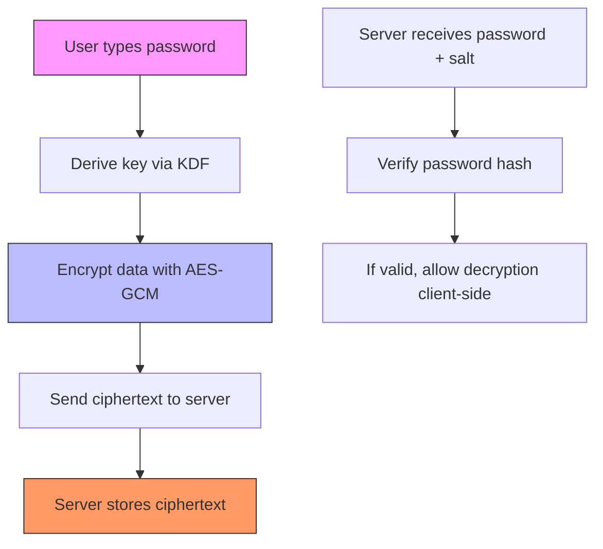

# Hashing and Key Derivation for Client-Side Encryption

This course teaches the fundamentals of cryptographic hashing, key derivation functions, and client-side encryption patterns used in zero-knowledge systems. It covers the theory, the standards, the libraries, and the common failure modes.

> [!summary]
> - **Hashing converts arbitrary data into fixed-length digests.** SHA-256, SHA-3, and Argon2 serve different purposes: integrity verification, general hashing, and password hashing respectively.
> - **Key derivation functions transform passwords into encryption keys.** PBKDF2, scrypt, and Argon2 are memory-hard KDFs designed to resist GPU and ASIC attacks through computational cost.
> - **Client-side encryption uses Web Crypto API to derive keys from passwords in the browser.** AES-GCM encrypts data locally before transmission; the server never sees the plaintext or the key [[bitwarden-kdf-algorithms]][[github-secure-auth-system]].
> - **Per-user salts and proper parameter selection are non-negotiable.** Salt defeats precomputation attacks. Iterations, memory, and parallelism must be tuned to current hardware [[crypto-se-argon2-salt-benefit]].

## Why This Course Exists

You are building or evaluating a system where users need to store sensitive data (API keys, passwords, secrets) on a server without the server being able to read them. This is the zero-knowledge pattern used by Bitwarden, 1Password, and similar products.

The security of this pattern depends entirely on three cryptographic primitives: hashing for integrity and authentication, key derivation for password-to-key conversion, and symmetric encryption for data confidentiality. If any of these are implemented incorrectly, the entire zero-knowledge guarantee collapses.

This course explains how to implement these primitives correctly, using the Web Crypto API for browser-based applications and standard libraries for server-side code.

Sources for this course are stored in the `sources/` folder alongside this note. Inline citations use numeric references matching the reference list.

## Chapter 1: Hashing Fundamentals

### What Is a Hash Function?

A hash function takes input of arbitrary length and produces a fixed-length output called a digest. The output is deterministic — the same input always produces the same output — and it is designed to be one-way, meaning it is computationally infeasible to reconstruct the input from the digest.

Hash functions have three key properties:

- **Irreversible**: Feeding the digest into another function should not produce the original input.
- **Non-correlatable**: Small changes to the input result in large, unpredictable changes to the digest (avalanche effect).
- **Unique**: Finding two different inputs that produce the same digest (a collision) is mathematically infeasible.

```
Input: "hello world"
Hash(SHA-256):  "b94d27b9934d3e08a52e52d7da7dabfac484efe37a5380ee9088f7ace2efcde9"

Input: "hello worlD"  (one character changed)
Hash(SHA-256):  "7d865e959b2466918c9863afca942d0fb89d7c9ac0c99bafc3749504ded97730"
```

The avalanche effect means that changing a single bit in the input completely changes the output. This is critical for integrity verification: if an attacker modifies even one byte of a file, the hash changes completely, making tampering detectable.

### Hash Functions vs Key Derivation Functions

Not all hash functions are suitable for password hashing. SHA-256 and SHA-3 are fast — they are designed to be fast. This makes them vulnerable to brute-force attacks when used for password storage, because an attacker can compute billions of hashes per second on a GPU.

Key derivation functions are designed to be slow and memory-hard. They introduce computational cost intentionally, making brute-force attacks impractical even with expensive hardware.

| Function | Purpose | Speed | Memory-Hard |
|----------|---------|-------|-------------|
| SHA-256 | Integrity, data deduplication | Fast (ns) | No |
| SHA-3 | General hashing, signatures | Fast (ns) | No |
| Argon2 | Password hashing, key derivation | Slow (ms) | Yes |
| scrypt | Password hashing, key derivation | Slow (ms) | Yes |
| PBKDF2 | Password hashing, key derivation | Slow (ms) | No |

**Working rule:** Use SHA-256/SHA-3 for integrity verification and general hashing. Use Argon2, scrypt, or PBKDF2 for password hashing and key derivation. Never use SHA-256 for password hashing [[owasp-password-storage]].

### Salt: The Per-User Defense

A salt is random data appended to the password before hashing. Its purpose is to defeat precomputation attacks.

Without salt, an attacker can compute a rainbow table — a precomputed table of common passwords and their hashes. If two users have the same password, they have the same hash, revealing password reuse.

With a per-user salt (≥16 bytes, cryptographically random), each password is hashed uniquely. Rainbow tables become useless because the attacker would need to compute a separate table for every user, every time a new salt is generated [[crypto-se-argon2-salt-benefit]].

```python
# Correct: per-user salt
salt = os.urandom(16)  # 128-bit random salt
key = argon2.hash(password, salt=salt, time_cost=3, memory_cost=65536)

# Incorrect: static salt or no salt
key = argon2.hash(password, salt=b"static-salt-here")  # Vulnerable to rainbow tables
```

## Chapter 2: Key Derivation Functions

### What Is a KDF?

A key derivation function (KDF) transforms a password into a cryptographic key. It is a specialized hash function designed to be computationally expensive and memory-intensive, making brute-force attacks impractical.

The KDF takes three inputs:
- **Password**: The user's secret (passphrase, master password).
- **Salt**: Per-user random data (≥16 bytes).
- **Parameters**: Computational cost (iterations, memory, parallelism).

The KDF produces an output of fixed length, typically 256 bits (32 bytes) for AES-256 encryption.

### PBKDF2

PBKDF2 (Password-Based Key Derivation Function 2) applies a hash function (HMAC-SHA256 or HMAC-SHA512) repeatedly to the password and salt.

```
DerivedKey = PBKDF2(password, salt, iterations, dkLen)
```

Each iteration applies HMAC to the result of the previous iteration. The `iterations` parameter controls the cost. OWASP recommends ≥100,000 iterations for SHA-256 [[owasp-password-storage]].

**Pros:**
- Widely supported, available in Web Crypto API.
- Simple to implement.

**Cons:**
- Not memory-hard. GPU and ASIC attacks are effective [[wicg-better-kdf-webcrypto]].
- Requires high iteration counts to be secure (≥100,000) [[owasp-password-storage]].
- Older standard, less robust against modern hardware [[wicg-better-kdf-webcrypto]].

**When to use:** Web Crypto API applications where Argon2 is not available [[wicg-better-kdf-webcrypto]]. Always use ≥100,000 iterations [[owasp-password-storage]].

### Argon2

Argon2 is the winner of the 2015 Password Hashing Competition. It is memory-hard, meaning it requires significant RAM to compute, which makes GPU and ASIC attacks impractical.

Argon2 has three variants:
- **Argon2d**: Optimized for resistance against GPU cracking, vulnerable to side-channel attacks.
- **Argon2i**: Optimized for resistance against side-channel attacks, less GPU-resistant.
- **Argon2id** (recommended): Hybrid of Argon2d and Argon2i, used for password hashing and key derivation.

**Parameters:**
- `time_cost`: Number of iterations (typically 2-4).
- `memory_cost`: Memory usage in KB (typically 65536 = 64 MB).
- `parallelism`: Degree of parallelism (typically 1-4).
- `salt`: Per-user random data (≥16 bytes).
- `key_len`: Output length in bytes (typically 32 for AES-256).

```python
# Argon2id key derivation
import argon2
ph = argon2.PasswordHasher(time_cost=3, memory_cost=65536, parallelism=1)
hash = ph.hash(password, salt=salt)
key = ph.hash(password, salt=salt).encode()  # 32 bytes for AES-256
```

**When to use:** New applications where you have control over the library. Argon2id is the current gold standard for password hashing and key derivation.

### scrypt

scrypt is another memory-hard KDF, designed by Colin Percival for the Tarsnap backup service. It requires significant memory and is less vulnerable to hardware-accelerated attacks than PBKDF2.

**When to use:** If Argon2 is unavailable but you need memory-hard key derivation. Web Crypto API does not support scrypt natively.

## Chapter 3: Client-Side Encryption

### The Zero-Knowledge Pattern

Client-side encryption is the core of zero-knowledge architecture. The user's data is encrypted in the browser before it is sent to the server. The server stores the ciphertext but cannot decrypt it without the user's key.

The key is derived from the user's password using a KDF. The password is never transmitted to the server. The server only receives the encrypted data and the parameters needed to verify the password (a salted hash) [[github-secure-auth-system]].

This pattern is used by Bitwarden, 1Password, and other zero-knowledge vaults [[bitwarden-kdf-algorithms]][[allpasshub-zero-knowledge-arch]].



### Web Crypto API

The Web Crypto API provides a browser-native interface for cryptographic operations. It includes:

- **SubtleCrypto**: Low-level cryptographic operations.
- **crypto.subtle.digest()**: SHA-256, SHA-384, SHA-512 hashing.
- **crypto.subtle.deriveKey()**: PBKDF2 key derivation.
- **crypto.subtle.importKey()**: Import encryption keys.
- **crypto.subtle.encrypt()**: AES-GCM encryption/decryption.

```javascript
// Derive key from password using PBKDF2
async function deriveKey(password, salt) {
  const encoder = new TextEncoder();
  const keyMaterial = await crypto.subtle.importKey(
    'raw',
    encoder.encode(password),
    'PBKDF2',
    false,
    ['deriveKey']
  );
  
  return await crypto.subtle.deriveKey(
    {
      name: 'PBKDF2',
      salt: salt,
      iterations: 100000,
      hash: 'SHA-256'
    },
    keyMaterial,
    { name: 'AES-GCM', length: 256 },
    false,
    ['encrypt', 'decrypt']
  );
}

// Encrypt data
async function encrypt(key, plaintext) {
  const encoder = new TextEncoder();
  const iv = crypto.getRandomValues(new Uint8Array(12)); // 96-bit IV
  const ciphertext = await crypto.subtle.encrypt(
    { name: 'AES-GCM', iv: iv },
    key,
    encoder.encode(plaintext)
  );
  return { ciphertext, iv };
}

// Decrypt data
async function decrypt(key, { ciphertext, iv }) {
  const decrypted = await crypto.subtle.decrypt(
    { name: 'AES-GCM', iv: iv },
    key,
    ciphertext
  );
  const decoder = new TextDecoder();
  return decoder.decode(decrypted);
}
```

### AES-GCM Encryption

AES-GCM (Advanced Encryption Standard in Galois/Counter Mode) provides authenticated encryption. It ensures both confidentiality and integrity: the data cannot be read without the key, and tampering is detectable.

**Parameters:**
- **Key**: 256-bit key derived from KDF.
- **IV (Initialization Vector)**: 96-bit random value, unique per encryption. Never reuse IV with the same key.
- **Plaintext**: The data to encrypt (e.g., API key).
- **AAD (Additional Authenticated Data)**: Optional metadata that is authenticated but not encrypted (e.g., user ID).

```javascript
// Encrypt API key
const iv = crypto.getRandomValues(new Uint8Array(12));
const { ciphertext } = await encrypt(key, 'sk-proj-abc123...');

// Send to server: { ciphertext, iv, salt }
// Server stores ciphertext and salt. Never stores plaintext or key.
```

### Parameter Selection

The security of client-side encryption depends on parameter selection. These parameters must be updated periodically as hardware improves.

| Parameter | Recommended Value | Update Frequency |
|-----------|------------------|------------------|
| PBKDF2 iterations | ≥100,000 (SHA-256) | Every 1-2 years |
| Argon2 time_cost | 2-4 | Every 2-3 years |
| Argon2 memory_cost | 65,536 KB (64 MB) | Every 2-3 years |
| Argon2 parallelism | 1-4 | As needed |
| AES key length | 256 bits | Every 5-10 years |
| IV length | 96 bits (12 bytes) | No change needed |

**Working rule:** Set parameters so that key derivation takes 100-500 ms on a typical client device. This provides strong resistance against brute-force without making the user wait excessively for login.

## Chapter 4: Failure Modes and Anti-Patterns

### Anti-Pattern 1: Server-Side Encryption Only

```javascript
// INCORRECT: Server holds the key
app.post('/store-api-key', async (req) => {
  const encrypted = encrypt(req.apiKey, serverSecretKey);
  db.save({ userId: req.userId, encrypted });
});
```

If the server is compromised, the attacker gets the plaintext API key. The server is a single point of failure.

**Fix:** Derive the key client-side from the user's password. Never transmit the key or plaintext data to the server.

### Anti-Pattern 2: Client-Side Hashing Without Encryption

```javascript
// INCORRECT: Only hashing, not encrypting
app.post('/login', async (req) => {
  const hash = await crypto.subtle.digest('SHA-256', req.password);
  if (hash === storedHash) {
    // User authenticated, but API key is still in plaintext on server
  }
});
```

Client-side hashing without encryption is authentication, not confidentiality. The API key is still stored in plaintext on the server.

**Fix:** Use client-side encryption (AES-GCM) to protect the data, not just client-side hashing for authentication.

### Anti-Pattern 3: Weak Salt or No Salt

```javascript
// INCORRECT: Static salt
const salt = new Uint8Array([1, 2, 3, 4, 5, 6, 7, 8, 9, 10, 11, 12, 13, 14, 15, 16]);
const key = await deriveKey(password, salt);
```

Static salt makes rainbow tables feasible. All users with the same password have the same derived key.

**Fix:** Generate a per-user random salt (≥16 bytes) on first account creation. Store the salt with the encrypted data.

### Anti-Pattern 4: Reusing IV

```javascript
// INCORRECT: Reusing IV with same key
const iv = new Uint8Array(12); // Zero IV, reused for all encryptions
const ciphertext1 = await encrypt(key, 'api-key-1');
const ciphertext2 = await encrypt(key, 'api-key-2');
```

Reusing IV with the same key in AES-GCM completely breaks confidentiality. An attacker can recover both plaintexts by XORing the ciphertexts.

**Fix:** Generate a fresh random IV for every encryption. IV does not need to be secret, but it must be unique per key.

### Anti-Pattern 5: Hardcoded KDF Parameters

```javascript
// INCORRECT: Hardcoded iterations, not updated
const iterations = 10000;  // Too low for current standards
const key = await deriveKey(password, salt, iterations);
```

Parameters that were secure five years ago may be insecure today. Hardware improves, and attack costs decrease.

**Fix:** Store the KDF parameters (iterations, memory_cost, etc.) with the user's record. Allow server-side migration to stronger parameters without changing the user's password.

## Chapter 5: Working Rules

1. **Use Argon2id if available, PBKDF2-SHA256 if not.** Argon2id is the current gold standard. PBKDF2 is acceptable for Web Crypto API applications where Argon2 is unavailable.

2. **Always use per-user salts.** Generate 16+ bytes of random data per user. Never reuse salts.

3. **Derive encryption keys, not just hashes.** The KDF output is used for AES-GCM encryption, not just authentication.

4. **Use AES-GCM for authenticated encryption.** It provides confidentiality and integrity in one primitive.

5. **Generate fresh IVs for every encryption.** Never reuse IV with the same key. IV does not need to be secret.

6. **Tune KDF parameters to 100-500 ms on client hardware.** This provides strong brute-force resistance without excessive wait times.

7. **Never store plaintext keys on the server.** The server stores only ciphertext, salt, and KDF parameters.

8. **Allow parameter migration.** Store KDF parameters with user records. Allow server-side migration to stronger parameters without requiring user intervention.

9. **Validate user password strength.** KDF delays brute-force; it does not eliminate the need for strong passwords. Enforce minimum password length and complexity.

10. **Do not roll your own crypto.** Use battle-tested libraries: Web Crypto API for browsers, libsodium or Go's `crypto` package for servers.

## Chapter 6: Exercise Guide

### Exercise 1a: Key Generation and Exchange

Generate an X25519 keypair using libsodium (or `age-keygen`). Exchange public keys with yourself (two separate keypairs). Encrypt a message from Alice to Bob using `crypto_box` (ephemeral key + static receiver key). Decrypt and verify integrity.

**Goal:** Understand asymmetric key exchange and encryption.

### Exercise 1b: Digital Signatures

Sign a JSON document with Ed25519. Verify the signature with the public key. Tamper with the document and show verification fails.

**Goal:** Understand non-repudiation and integrity verification.

### Exercise 1c: Hashing and KDF

Hash a password with Argon2id (use `argon2` CLI or libsodium). Derive an encryption key from a user passphrase using PBKDF2 (Web Crypto API) or Argon2id. Encrypt a mock API key string using AES-256-GCM with the derived key.

**Goal:** Understand password hashing, key derivation, and client-side encryption.

**Deliverable:** A small Go or Python program in `scripts/` that exercises each of the above, plus a writeup of what guarantees each provides.

> [!note] Implementation Context
> This exercise is part of the LLM proxy identity research project. Full exercise plan and ticket: `/home/manuel/code/wesen/claw-stuff/ttmp/2026/06/06/identity-research--identity-system-research-for-llm-proxy/`

## Key Points

- Hashing converts arbitrary data into fixed-length digests. SHA-256, SHA-3, and Argon2 serve different purposes: integrity verification, general hashing, and password hashing respectively.
- Key derivation functions transform passwords into encryption keys. PBKDF2, scrypt, and Argon2 are memory-hard KDFs designed to resist GPU and ASIC attacks through computational cost.
- Client-side encryption uses Web Crypto API to derive keys from passwords in the browser. AES-GCM encrypts data locally before transmission; the server never sees the plaintext or the key [[github-secure-auth-system]][[bitwarden-kdf-algorithms]].
- Per-user salts and proper parameter selection are non-negotiable. Salt defeats precomputation attacks. Iterations, memory, and parallelism must be tuned to current hardware.
- The zero-knowledge pattern is well-established and used in production by Bitwarden, 1Password, KeePassXC, and other products [[bitwarden-kdf-algorithms]][[allpasshub-zero-knowledge-arch]]. It requires correct implementation of hashing, KDF, and encryption primitives.

## Next Steps

After completing this course and the exercises:
- Evaluate whether to use PBKDF2 (Web Crypto API) or Argon2id (WebAssembly binding) for your application [[wicg-better-kdf-webcrypto]].
- Design the user flow for password entry, key derivation, and encryption.
- Implement the three-tier storage model: ciphertext, salt, and KDF parameters.
- Add parameter migration support for future-proofing.

## References

1. [owasp-password-storage.md](sources/owasp-password-storage.md) — OWASP Password Storage Cheat Sheet. Authoritative industry best practices for password hashing and key derivation. Recommends Argon2id as the standard, PBKDF2 with ≥100,000 iterations if Argon2 is unavailable, and per-user salts ≥16 bytes.
2. [bitwarden-kdf-algorithms.md](sources/bitwarden-kdf-algorithms.md) — Bitwarden KDF Algorithms. Real-world zero-knowledge vault implementation showing how a production product uses KDFs. Supports PBKDF2-SHA256/SHA512 and Argon2.
3. [github-secure-auth-system.md](sources/github-secure-auth-system.md) — Secure Authentication System. Open-source zero-knowledge architecture with Argon2 and PBKDF2. All vault encryption happens in the browser; server lacks the key.
4. [allpasshub-zero-knowledge-arch.md](sources/allpasshub-zero-knowledge-arch.md) — AllPassHub Zero-Knowledge Architecture. Modern zero-knowledge architecture using AES-128 with client-side key derivation.
5. [wicg-better-kdf-webcrypto.md](sources/wicg-better-kdf-webcrypto.md) — WICG Proposal: Better KDF in WebCrypto. Shows the limitations of WebCrypto's built-in PBKDF2 and the push for Argon2id. PBKDF2 is old and vulnerable to GPU/ASIC attacks.
6. [security-se-client-side-server-side-hash.md](sources/security-se-client-side-server-side-hash.md) — Security StackExchange: Client-Side vs Server-Side Hashing. Discussion of when to hash client-side vs server-side and algorithm selection.
7. [crypto-se-argon2-salt-benefit.md](sources/crypto-se-argon2-salt-benefit.md) — Crypto StackExchange: Argon2 Salt Benefits. Explains why per-user salts matter for memory-hard KDFs like Argon2. Uses per-user salt and password in Argon2i to generate a key and nonce for AES-GCM encryption.

## Source Files

All source files are copied into the `sources/` folder alongside this note:

- `sources/owasp-password-storage.md` — OWASP Password Storage Cheat Sheet
- `sources/bitwarden-kdf-algorithms.md` — Bitwarden KDF Algorithms
- `sources/github-secure-auth-system.md` — GitHub: Secure Authentication System
- `sources/allpasshub-zero-knowledge-arch.md` — AllPassHub Zero-Knowledge Architecture
- `sources/wicg-better-kdf-webcrypto.md` — WICG: Better KDF in WebCrypto
- `sources/security-se-client-side-server-side-hash.md` — Security StackExchange: Client-Side Hashing
- `sources/crypto-se-argon2-salt-benefit.md` — Crypto StackExchange: Argon2 Salt Benefits
