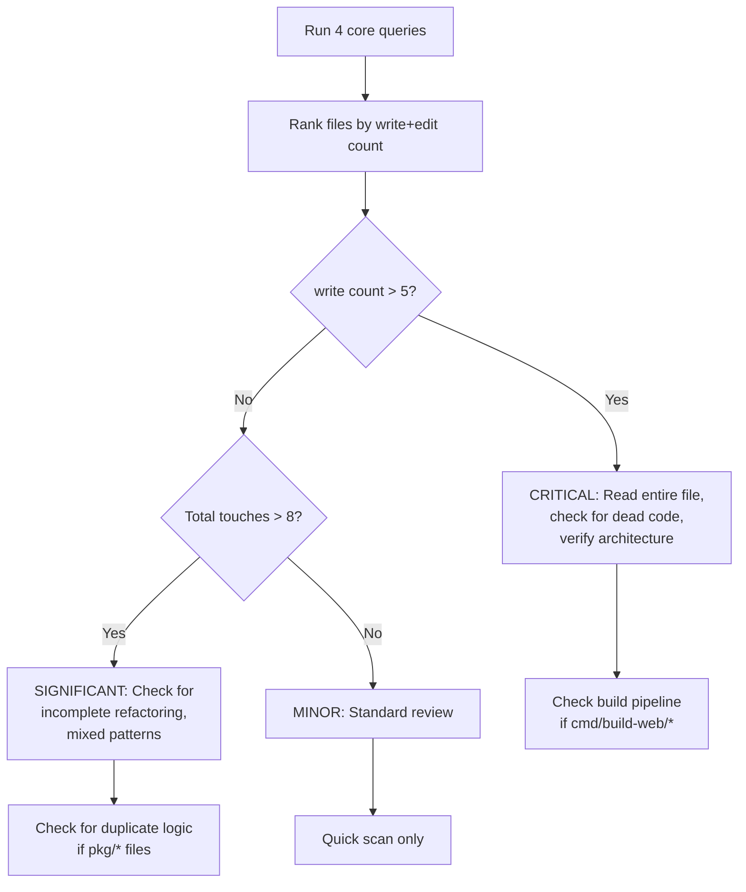

# Code Review with go-minitrace: Post-Session Analysis Playbook

A workflow for using `go-minitrace` to analyze a completed Pi or Codex coding session, extract evidence about what confused the agent, what was rewritten repeatedly, and where the resulting code needs extra scrutiny. Then use that evidence to drive a targeted code review before merging.

> [!summary]
> 1. Convert the session JSONL → minitrace JSON with `go-minitrace convert pi`
> 2. Run 4–6 SQL queries against the archive to find churn, build cycles, and confusion patterns
> 3. Map high-churn files to code review priorities
> 4. Write findings into a docmgr ticket with diary + findings documents
> 5. The entire process takes 30–60 minutes for a typical session

Derived from the GLAZE-HELP-REVIEW session (2026-04-08), which analyzed a 21-hour, 1132-turn Pi session that produced the glazed help browser.

---

## When to Use This Pattern

Use transcript-driven code review when:

- A coding agent ran a long session (4+ hours) and you want to understand what happened before reviewing the diff
- The resulting code has areas of uncertainty — things that were rewritten, experimental approaches, or build pipeline struggles
- You want evidence-based priorities for what to review, not just "read the whole diff"
- You are preparing a PR and want to document known issues proactively

Do not use this when:

- The session was short (< 1 hour) and the diff is small — just read the diff
- You only need a surface-level review — standard code review is faster
- The session was smooth with few build failures — the transcript won't add much

---

## Prerequisites

### go-minitrace installed

```bash
# From the go-minitrace repo
cd ~/code/wesen/corporate-headquarters/go-minitrace
go install ./cmd/go-minitrace
```

### Session location

Pi sessions live under:
```
~/.pi/agent/sessions/--slugged-cwd--/*.jsonl
```

Find the right session by timestamp or by looking at the directory name matching your project.

### docmgr initialized in the target repo

```bash
cd /path/to/repo
docmgr status --summary-only
docmgr init --seed-vocabulary
```

---

## Step 1: Convert the Session

Use `--source-session` for a single file. The conversion produces one `.minitrace.json` file per session.

```bash
SESSION="~/.pi/agent/sessions/--my-project--/2026-04-08T00-21-48-462Z_abc.jsonl"
OUTPUT="./analysis/review"

go-minitrace convert pi \
  --source-session "$SESSION" \
  --output-dir "$OUTPUT"
```

The output tells you turn count, tool call count, and quality rating. Record these — they set expectations for how thorough the review needs to be.

**What to watch for:**
- **> 500 turns**: The agent was doing a lot. Expect churn.
- **> 50 go-build / npm-build calls**: The agent was struggling with tooling.
- **Read ratio < 0.3**: The agent was executing more than reading — trial-and-error mode.

---

## Step 2: Run the Four Core Queries

These four queries give you 80% of the insight. All are saved as reusable SQL below.

### Query 1: Tool frequency

Tells you the balance of reading vs writing vs building.

```sql
-- tool-frequency.sql
SELECT
  json_extract(tc, '$.tool_name') AS tool_name,
  COUNT(*) AS calls
FROM sessions_base, UNNEST(tool_calls) AS t(tc)
GROUP BY tool_name
ORDER BY calls DESC;
```

**Interpretation:**
- `bash` >> `read`: agent was in trial-and-error mode
- `write` >> `edit`: agent was rewriting whole files instead of targeted edits
- High `playwright_browser_*`: agent was debugging UI issues visually

### Query 2: File touch frequency

Tells you which files were rewritten most — the high-churn files that need the most review.

```sql
-- file-touch-frequency.sql
SELECT
  json_extract(tc, '$.input.file_path') AS file_path,
  json_extract(tc, '$.tool_name') AS tool,
  COUNT(*) AS count
FROM sessions_base, UNNEST(tool_calls) AS t(tc)
WHERE json_extract(tc, '$.tool_name') IN ('"read"', '"write"', '"edit"')
  AND json_extract(tc, '$.input.file_path') IS NOT NULL
GROUP BY tool, file_path
ORDER BY count DESC
LIMIT 40;
```

**The key insight**: files with `write` count >> `edit` count were rewritten from scratch multiple times. This means the agent didn't have a clear plan for them — they need extra scrutiny.

**Interpretation:**
- A file with `write: 10` and `edit: 2` was rewritten 10 times — architectural confusion
- A file with `write: 1` and `edit: 15` was incrementally refined — probably more stable
- `read` count >> `write` + `edit` for a file means the agent kept re-reading it to understand it — the file may be unclear

### Query 3: Build/test cycle count

Tells you how much time was spent on compilation vs actual feature work.

```sql
-- build-test-counts.sql
SELECT
  CASE
    WHEN CAST(json_extract(tc, '$.input.command') AS VARCHAR) LIKE '%go build%' THEN 'go-build'
    WHEN CAST(json_extract(tc, '$.input.command') AS VARCHAR) LIKE '%go test%' THEN 'go-test'
    WHEN CAST(json_extract(tc, '$.input.command') AS VARCHAR) LIKE '%pnpm build%' THEN 'pnpm-build'
    WHEN CAST(json_extract(tc, '$.input.command') AS VARCHAR) LIKE '%npm run build%' THEN 'npm-build'
    ELSE 'other'
  END AS cmd_type,
  COUNT(*) AS count
FROM sessions_base, UNNEST(tool_calls) AS t(tc)
WHERE json_extract(tc, '$.tool_name') = '"bash"'
  AND (
    CAST(json_extract(tc, '$.input.command') AS VARCHAR) LIKE '%go build%'
    OR CAST(json_extract(tc, '$.input.command') AS VARCHAR) LIKE '%go test%'
    OR CAST(json_extract(tc, '$.input.command') AS VARCHAR) LIKE '%pnpm build%'
    OR CAST(json_extract(tc, '$.input.command') AS VARCHAR) LIKE '%npm run build%'
  )
GROUP BY cmd_type
ORDER BY count DESC;
```

**Interpretation:**
- > 50 build cycles in a session signals significant tooling or architecture problems
- The ratio of `go-build` to `go-test` tells you if the agent was focused on getting things to compile (high ratio) vs verifying behavior (low ratio)

### Query 4: Rewrite timestamps

Tells you when churn happened — clustered rewrites indicate specific points of confusion.

```sql
-- rewrite-timestamps.sql
SELECT
  json_extract(tc, '$.input.file_path') AS file_path,
  json_extract(tc, '$.tool_name') AS tool,
  COUNT(*) AS times_touched,
  MIN(json_extract(tc, '$.timestamp')) AS first_touch,
  MAX(json_extract(tc, '$.timestamp')) AS last_touch
FROM sessions_base, UNNEST(tool_calls) AS t(tc)
WHERE json_extract(tc, '$.tool_name') IN ('"write"', '"edit"')
  AND json_extract(tc, '$.input.file_path') IS NOT NULL
GROUP BY file_path, tool
HAVING COUNT(*) > 3
ORDER BY times_touched DESC;
```

**Interpretation:**
- Files touched over a wide time span (first_touch to last_touch > 2 hours) were revisited multiple times — the agent kept coming back to fix things
- Files touched in a narrow burst (< 30 minutes) with high count were a single confused episode

---

## Step 3: Map Churn to Code Review Priorities

This is the core intellectual step. Take the query results and create a ranked list of files/functions to review.



### Priority mapping rules

| Churn pattern | Review priority | What to look for |
|---|---|---|
| `write` > 5 for a single file | CRITICAL | Agent rewrote from scratch — look for abandoned approaches, dead code, mixed patterns |
| `go-build` > 50 in session | CRITICAL | Build pipeline is fragile — review embed rules, toolchain config, go.mod |
| `edit` > 10 for a single file | SIGNIFICANT | Agent couldn't get it right — look for subtle bugs, edge cases |
| `read` > 10 for a single file | SIGNIFICANT | File was confusing — look for unclear structure, missing comments |
| All counts < 5 | MINOR | Standard review sufficient |

### The confusion-to-code mapping

After identifying high-churn files, read them with specific questions in mind:

1. **Files written many times**: Does this file mix two approaches? Are there dead code paths from abandoned attempts?
2. **Files with many edits**: Is there duplicated logic that should be shared? Are there subtle inconsistencies between similar functions?
3. **Files read many times**: Is the architecture unclear from the code alone? Would a comment or doc help?

---

## Step 4: Look for Specific Anti-Patterns

Based on what high-churn files suggest, check for these common anti-patterns from agent sessions:

### Dead compatibility wrappers

Agents often create compatibility shims during refactoring, then forget to remove them. Look for:
- Files named `compat.go`, `bridge.go`, `shim.go`, `legacy.go`
- Structs that wrap another struct with no added behavior
- Functions that just call another function with the same signature

### Duplicated parsing/loading logic

When an agent refactors from in-memory to database-backed storage, it often creates the new loading code without removing the old. Look for:
- Two `LoadFromX()` functions that parse the same format
- Two `HelpSystem` or similar "root" types
- Type aliases that re-export everything from another package

### O(N) evaluation patterns

When an agent bridges old and new query systems, it sometimes evaluates predicates one-at-a-time instead of passing them to the database. Look for:
- Loops over all records that create temporary resources per iteration
- `evaluatePredicate()` or similar functions that open a new database connection per call
- Any `for _, item := range allItems { if matches(item) { ... } }` pattern that should be a database query

### Bypassed abstractions

When an agent struggles with a build tag or conditional compilation, it sometimes inlines the logic instead of using the abstraction. Look for:
- Raw `LIKE` queries in handlers when a `TextSearch()` function exists
- Direct file I/O when a filesystem abstraction exists
- Hardcoded values that should come from configuration

---

## Step 5: Write the Review Documents

Use docmgr to create a ticket with three documents:

### Document structure

```
ttmp/.../GLAZE-REVIEW-.../
├── reference/01-diary.md              # Step-by-step analysis diary
├── analysis/01-session-analysis.md    # Session stats and patterns
├── design-doc/01-review-findings.md   # Prioritized findings
└── scripts/                            # All SQL queries and shell scripts
```

### Diary format

Follow the diary skill format strictly. Each step should cover:
- What you queried and what you found
- Which files the finding maps to
- What to look for in those files
- Severity classification (CRITICAL / SIGNIFICANT / MINOR)

### Findings format

Prioritize findings with a table:

```markdown
| # | Severity | Finding | File |
|---|----------|---------|------|
| 1 | CRITICAL | Description | path |
```

Then for each finding:
- **What**: Describe the issue in 1–2 sentences
- **Why it matters**: Impact on correctness, performance, or maintainability
- **Fix**: Concrete remediation steps
- **Code snippet**: Show the problematic code

---

## Reusable SQL Scripts

Save these in the ticket's `scripts/` directory with numerical prefixes. They work with any Pi session converted to minitrace format.

### The stable queries

These four queries work without modification on any minitrace archive:

| Script | Purpose | Works on |
|--------|---------|----------|
| `01-tool-frequency.sql` | How often each tool was called | All sessions |
| `02-file-touch-frequency.sql` | Which files were read/written/edited most | All sessions |
| `03-build-cycle-counts.sql` | How many build/test cycles | Go, Node, Python |
| `04-rewrite-timestamps.sql` | When churn happened | All sessions |

### Invoking queries

```bash
go-minitrace query duckdb \
  --archive-glob './analysis/review/active/*/*.minitrace.json' \
  --sql-file scripts/01-tool-frequency.sql
```

Or inline:

```bash
go-minitrace query duckdb \
  --archive-glob './analysis/review/active/*/*.minitrace.json' \
  --sql "SELECT COUNT(*) FROM sessions_base"
```

---

## The JSON Column Gotcha

The most common frustration when writing minitrace queries is the JSON type system. Here is the definitive reference.

### `tool_calls` is a JSON array of JSON objects

After `UNNEST(tool_calls) AS t(tc)`, the `tc` variable is a JSON object. You cannot use `tc` directly in string comparisons — you must use `json_extract()`.

### String comparisons require double-quoting

`json_extract(tc, '$.tool_name')` returns a JSON string **including the quotes**. So to compare:

```sql
-- WRONG: this tries to compare the JSON value '"read"' with the SQL string 'read'
WHERE json_extract(tc, '$.tool_name') = 'read'

-- CORRECT: compare JSON string to JSON string
WHERE json_extract(tc, '$.tool_name') = '"read"'

-- CORRECT: use IN with double-quoted values
WHERE json_extract(tc, '$.tool_name') IN ('"read"', '"write"', '"edit"')
```

### Extracting nested fields

For tool input fields like `file_path`:

```sql
json_extract(tc, '$.input.file_path')  -- returns the file path as a string
```

For the bash `command` field:

```sql
CAST(json_extract(tc, '$.input.command') AS VARCHAR)  -- cast to VARCHAR for LIKE
```

The `CAST(... AS VARCHAR)` is needed for `LIKE` comparisons because the raw JSON value may not compare correctly with SQL string patterns.

### Checking types

When unsure about the schema:

```sql
SELECT
  typeof(tool_calls) AS arr_type,
  length(tool_calls) AS arr_len,
  typeof(tool_calls[1]) AS elem_type,
  SUBSTR(CAST(tool_calls[1] AS VARCHAR), 1, 100) AS sample
FROM sessions_base
LIMIT 1;
```

This will tell you if you're dealing with `JSON[]` of `JSON` elements (the normal case for Pi sessions).

---

## Complete Worked Example

Here is the exact sequence for the GLAZE-HELP-REVIEW session, with commands you can adapt:

### Setup

```bash
cd /path/to/repo
docmgr ticket create-ticket \
  --ticket REVIEW-ID \
  --title "Pre-PR Code Review: Project Name" \
  --topics code-review

docmgr doc add --ticket REVIEW-ID --doc-type reference --title "Diary"
docmgr doc add --ticket REVIEW-ID --doc-type analysis --title "Session Analysis"
docmgr doc add --ticket REVIEW-ID --doc-type design-doc --title "Review Findings"
```

### Convert

```bash
go-minitrace convert pi \
  --source-session "~/.pi/agent/sessions/--project--/session.jsonl" \
  --output-dir ./analysis/review
```

### Query

```bash
# Preset for quick overview
go-minitrace query duckdb \
  --archive-glob './analysis/review/active/*/*.minitrace.json' \
  --preset framework-summary

# Custom queries
go-minitrace query duckdb \
  --archive-glob './analysis/review/active/*/*.minitrace.json' \
  --sql-file scripts/01-tool-frequency.sql
```

### Review

1. Read the top 3–5 highest-churn files
2. Check for the four anti-patterns (dead compat, duplicated logic, O(N) eval, bypassed abstractions)
3. Write findings into the design-doc document
4. Relate files with `docmgr doc relate`

### Deliver

```bash
docmgr task check --ticket REVIEW-ID --id 1,2,3
docmgr changelog update --ticket REVIEW-ID \
  --entry "Completed review: N critical, M significant, K minor findings"
docmgr doctor --ticket REVIEW-ID
```

---

## Timing Reference

| Activity | Time |
|----------|------|
| Convert session to minitrace | 1 min |
| Run 4 core queries + interpret | 10 min |
| Read top 3–5 high-churn files | 15 min |
| Check anti-patterns in those files | 10 min |
| Write diary + findings documents | 15 min |
| docmgr bookkeeping | 5 min |
| **Total** | **~60 min** |

For sessions under 4 hours with < 200 turns, skip the full analysis and just run the tool frequency + file touch queries — the review can be done in 20 minutes.

---

## Related Notes

- [[Guidelines Index]] — all research institute guidelines
- [[Code Review as Research Conversation]] — how to review research code differently from production code
- [[docmgr Ticket Workflow]] — docmgr commands and conventions
- [[Agent-Assisted Research Patterns]] — working with AI coding agents
