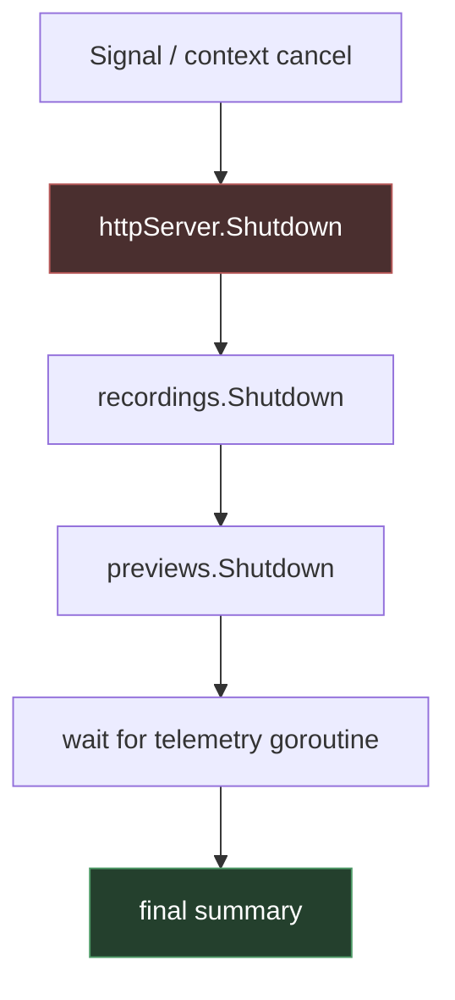

# Designing Process Supervision and Cancellation in Local Tools

A guideline for designing local tools that own long-lived managers and Unix subprocesses. This is aimed at colleagues building CLI-launched servers, automation tools, notebook-style runtimes, media tools, or any system where `Ctrl-C` should stop not just the top-level process but the entire runtime tree cleanly and explainably.

> [!summary]
> 1. Treat any long-lived local server with background work as a **runtime supervisor**.
> 2. Encode ownership in constructors, not by convention.
> 3. Add manager-level `Shutdown(ctx)` contracts before trying to “fix” shutdown by random context surgery.
> 4. Never wait on worker completion while holding the manager lock.
> 5. Add lifecycle logs first; otherwise shutdown bugs become folklore instead of engineering.

## Scope of this guideline

This note covers the class of systems that:

- are launched from a CLI,
- run as a long-lived foreground process,
- expose some interactive control surface (HTTP, websocket, TUI, REPL, etc.),
- spawn background work over time,
- may spawn Unix subprocesses,
- need bounded and diagnosable shutdown behavior.

This is **not** a guide for large distributed systems or Kubernetes orchestration. It is for the local-tool / local-server / advanced CLI space.

## Rule 1: Name the real thing

If your server starts background work, it is not just a server.

It is a **runtime supervisor**.

That naming change matters because it changes how you structure code:

- a plain request handler may be stateless,
- a supervisor owns long-lived work and shutdown policy.

If you call it “just the web server,” people will naturally put the shutdown logic in the wrong places.

## Rule 2: Make ownership visible in constructors

Do not rely on comments, conventions, or post-construction mutation to explain who owns a runtime.

Prefer this:

```go
runtimeCtx := signalBoundContext(ctx)
server := NewServer(runtimeCtx, cfg)
```

and inside:

```go
recordings := NewRecordingManager(runtimeCtx, ...)
previews := NewPreviewManager(runtimeCtx, ...)
```

Avoid this shape unless you have a very strong reason:

```go
server := NewServer(...)
server.SetRuntimeContext(ctx)
```

Why:

- constructor-time ownership is explicit,
- it prevents “work started before ownership was bound,”
- it makes tests easier to reason about,
- it reduces lifecycle mutation and hidden state changes.

## Rule 3: Cancellation is the trigger, not the policy

A common design mistake is to assume that once everything has a `context.Context`, shutdown is solved.

It is not.

Cancellation answers only:

- when shutdown should begin.

It does **not** answer:

- in what order to stop things,
- how long to wait,
- how to escalate,
- what to log,
- what to report when something is still alive.

So the pattern should be:

- context cancellation triggers shutdown,
- explicit shutdown code implements the policy.

## Rule 4: Managers need bounded shutdown contracts

If a manager owns long-lived work, give it a shutdown API.

Typical shape:

```go
func (m *Manager) Shutdown(ctx context.Context) error
```

That method should:

1. snapshot the work it owns,
2. request cancellation,
3. wait for completion,
4. respect the caller’s deadline,
5. return a meaningful error on timeout.

This is much better than making the top-level server know every detail of internal cancel funcs and done channels.

### Good shutdown contract properties

- bounded by caller deadline,
- no hidden infinite waits,
- logs start/done/timeout,
- can be called even when no work is active,
- does not require the caller to know the manager’s internal state machine.

## Rule 5: Never wait while holding the manager lock

This is one of the most important practical rules in this whole space.

Do **not** do this:

```go
m.mu.Lock()
defer m.mu.Unlock()
worker.cancel()
<-worker.done
```

Why this is bad:

- the worker may need the same lock to finish,
- callers may deadlock on accessors,
- shutdown hangs become timing-sensitive and hard to reproduce.

Instead:

1. snapshot mutable state under lock,
2. unlock,
3. cancel workers,
4. wait outside the lock.

### Safe pattern

```go
m.mu.Lock()
workers := snapshotWorkers(m)
m.mu.Unlock()

for _, w := range workers {
    w.cancel()
}
for _, w := range workers {
    select {
    case <-w.done:
    case <-ctx.Done():
        return ctx.Err()
    }
}
```

## Rule 6: Use staged shutdown order

A reliable shutdown order for local servers is usually:

1. stop intake,
2. stop manager-owned work,
3. wait for runtime participants,
4. emit final summary.

### Why this order works

Stopping intake first prevents new work from entering during shutdown.

If you cancel internal workers first while the intake surface is still live, you can get ugly races:

- a request creates a new preview during shutdown,
- the frontend reconnects while state is half-torn-down,
- the server looks “mostly dead” but still accepts work.

### Example order



## Rule 7: Add lifecycle logs before fancy fixes

If shutdown is misbehaving, the first engineering move should usually be **observability**, not another speculative control-flow rewrite.

Add logs for:

- runtime start,
- shutdown trigger,
- manager shutdown begin/done,
- subprocess start,
- subprocess wait begin/done,
- stop escalation steps,
- final summary.

### Minimum useful fields

- event name,
- component,
- session / preview / worker ID,
- pid when relevant,
- reason,
- timeout,
- result.

Without these logs, people tend to argue from intuition and memory instead of evidence.

## Rule 8: Distinguish process lifecycle logs from process output logs

Raw stderr/stdout is useful, but it is not the same thing as lifecycle evidence.

You need both:

### Process output logs

These are application logs coming *from* the subprocess:

- ffmpeg stderr,
- tool stdout,
- media pipeline errors.

### Lifecycle logs

These are supervisor logs *about* the subprocess:

- process start requested,
- pid assigned,
- graceful stop requested,
- signal sent,
- wait began,
- wait completed,
- timeout occurred.

Do not collapse those into one bucket.

## Rule 9: Use the right shutdown shape for each subsystem

Do not force symmetry for its own sake.

Some subsystems want:

- `Shutdown(ctx)` because they own dynamic worker sets.

Others are naturally:

- `Run(ctx)` loops that should simply exit when the runtime context is canceled.

The important thing is not that every subsystem has the same API. The important thing is that the top-level runtime can stop all owned work clearly and boundedly.

## Rule 10: Be honest about subprocess hardening stages

There are levels of subprocess robustness.

### Level 1: best-effort graceful stop

- cancel context,
- maybe close stdin,
- maybe send a sentinel command,
- wait.

### Level 2: bounded escalation

- graceful request,
- wait,
- `SIGTERM`,
- wait,
- `SIGKILL`.

### Level 3: process-group hardening

- run child in its own process group,
- kill the whole group on escalation.

Do not pretend Level 1 is Level 3.

It is fine to stop at Level 1 or 2 for a while, but document what level you are actually at.

## Rule 11: Prefer focused shutdown tests before OS-level integration tests

You do want real integration tests eventually, but not as your first or only line of defense.

### Start with deterministic manager tests

Test things like:

- active session shuts down successfully,
- inactive manager shutdown is a no-op,
- timeout returns the right error,
- wait happens outside locks.

These tests are cheap and reliable.

### Add runtime/integration tests later

Those should prove things like:

- the server stops new work during shutdown,
- live preview/recording work drains,
- child processes do not leak.

But these tests are more expensive and easier to make flaky. Earn them after the abstractions are stable.

## Rule 12: Manual validation still matters

In this class of tools, a single good manual run is often worth a lot.

For example:

- build binary,
- launch real `serve`,
- let the real frontend connect,
- send `SIGINT`,
- inspect structured logs,
- confirm final summary state.

That kind of run catches things synthetic tests miss, especially around eager frontend behavior, browser auto-open side effects, or in-flight streaming requests.

## Checklist for colleagues

Use this when designing a new local runtime:

- [ ] Does the top-level process own a single runtime context?
- [ ] Are managers constructed with that context rather than patched later?
- [ ] Does each long-lived manager have a bounded shutdown contract when needed?
- [ ] Do shutdown waits happen outside locks?
- [ ] Is shutdown order explicit and documented?
- [ ] Are process lifecycle logs separate from process output logs?
- [ ] Is there a final runtime summary?
- [ ] Are there deterministic manager-level tests?
- [ ] Is there at least one real manual shutdown validation run?
- [ ] Is the current subprocess hardening level documented honestly?

## Anti-patterns

### Anti-pattern: “Everything has a context, so we’re done.”

False. You still need ordering, waiting, deadlines, and evidence.

### Anti-pattern: “The server contains the managers, therefore it owns them.”

False unless the work they start is also rooted under the server’s runtime context.

### Anti-pattern: “We can just kill the process on timeout.”

Sometimes true, but too simplistic. You still need to know whether:

- the right process is being killed,
- children remain,
- logs explain why escalation happened.

### Anti-pattern: “We’ll add tests after the shutdown code is done.”

Often a mistake. Cancellation code is easiest to stabilize incrementally.

## Suggested implementation sequence

If you are starting from a messy system, use this order:

1. add lifecycle logs,
2. make ownership explicit in constructors,
3. add manager `Shutdown(ctx)` APIs,
4. stage top-level server shutdown,
5. run real manual validation,
6. harden subprocess escalation,
7. add tougher integration tests.

This sequence is not arbitrary. Each stage gives you better visibility and better invariants for the next one.

## Related notes

- [[Guidelines Index]]
- [[Process Supervision and Cancellation: Designing Reliable Long-Lived Local Servers]]
- [[PROJ - Screencast Studio - Architecture and Runtime Deep Dive]]
