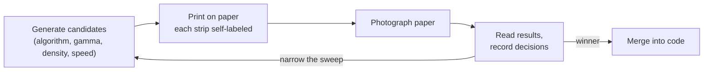

# Dithering

## Simulating Continuous Tone with Black and White

A thermal print head can do two things. It can heat a spot, or it can leave the spot alone. There is no middle state. A dot is either burned or it is not, and the paper records that single binary decision as either dark or light.

A photograph, rendered on a screen, is not binary. A pixel of a face might carry a gray value of 100, meaning a dark-ish skin tone; a pixel of sky might carry 180, a pale gray. The screen produces these intermediate tones by modulating the brightness of each pixel directly. The thermal printer cannot. Its dots are black or white, and a region of skin or sky must be represented entirely by the arrangement of those black and white dots.

This is the problem of dithering: given a grayscale image and a device that can only print black or white, decide for each pixel whether to burn a dot, in such a way that the eye, averaging over a small neighborhood, reads the original tone. The choice of *which* dots to burn determines whether a photograph survives the conversion.

---

## Why a Single Threshold Fails

The simplest conversion is a fixed threshold. For each pixel, compute a luminance value between 0 and 255, and burn a dot if the luminance is below some cutoff:

```
out(x, y) = luminance(x, y) < 128
```

This rule is correct for content that is already close to black and white. Text should be thresholded. A QR code should be thresholded. A line drawing should be thresholded. In each of these cases the original is symbolic — a black stroke on a white field — and the threshold preserves the symbol crisply.

The rule fails for continuous tone. Consider a smooth gradient from white to black. A threshold turns the gradient into a cliff: everything lighter than the cutoff becomes paper, everything darker becomes ink, and the entire middle of the gradient disappears. There is no gray. There is only a hard boundary.

A face is a gradient, many times over. The cheek is a gradient from highlight to shadow. The shadow under the chin is a gradient from lit skin to dark recess. A fixed threshold collapses each of these gradients into a single edge, and the face becomes a high-contrast mask with no interior. The eyes may survive. The structure of the face does not.

The threshold also fails in the opposite direction for bright, thin features. A whisker, rendered as a one-pixel-wide stroke at luminance 180, sits above the cutoff of 128 and is discarded entirely. The whisker was present in the original. It is absent in the print. No adjustment of the threshold recovers it: lowering the threshold to catch the whisker also turns the entire background gray into black.

The threshold is not wrong. It is incomplete. It is the right tool for some content and the wrong tool for other content, and a page that mixes text and photographs cannot be served by a single threshold applied to the whole page.

---

## The Three Families

Dithering algorithms fall into three families, distinguished by how they decide which dots to burn. Each family trades a different resource for the ability to simulate gray.

The first family is thresholding, including its adaptive variants. The second is ordered dithering, in which a fixed pattern of thresholds is tiled across the image. The third is error diffusion, in which the quantization error from one pixel is pushed forward to influence its neighbors. The three differ in whether they preserve local detail, whether they introduce visible patterns, and whether they can be parallelized.

The table below sketches the trade space before we develop each family in turn.

| Family | Basic idea | Strength | Weakness |
|--------|------------|----------|----------|
| Fixed threshold | Compare each pixel to one constant | Crisp, fast, deterministic | Loses midtones entirely |
| Adaptive threshold | Compare each pixel to its local neighborhood | Handles uneven lighting, line art | Can amplify noise |
| Ordered (Bayer) | Compare each pixel to a tiled threshold matrix | Fast, parallelizable, no error state | Visible cross-hatch pattern |
| Error diffusion | Push quantization error to neighbors | Preserves tone and detail | Sequential; directional artifacts |

---

## Ordered Dithering: A Pattern of Thresholds

Ordered dithering replaces the single global threshold with a matrix of thresholds that tiles across the image. Each pixel is compared not to a constant but to the threshold at its position in the tile. The classic example is the 4×4 Bayer matrix:

```
 0  8  2 10
12  4 14  6
 3 11  1  9
15  7 13  5
```

The values encode the order in which dots appear as the desired tone darkens. A region that should be 10 percent gray receives only the dots whose matrix position is below the 10 percent cutoff — a sparse, regular scattering. A region that should be 50 percent gray receives all dots whose matrix position is below the 50 percent cutoff, which is half of them. The pattern is deterministic, and because each pixel is independent of every other, the computation parallelizes trivially.

```
matrix = bayer4
for y, x:
    t = (matrix[y mod 4][x mod 4] + 0.5) / 16 * 255
    output[y][x] = gray[y][x] < t
```

The strength of ordered dithering is its weakness made visible. The pattern repeats, and the repetition is itself a texture. On a screen, a Bayer-dithered photograph shows a distinct cross-hatch, a retro screen-door effect that competes with the image's own detail. Sometimes this is charming. Sometimes it destroys the photograph.

On thermal paper, the cross-hatch has an additional problem. Thermal dots spread. A regular grid of dots, printed on a medium that enlarges each dot, tends to merge into a solid mass at the grid spacing, and the regularity that made the pattern predictable on screen makes it muddy on paper. Ordered dithering is fast and stable, but it is rarely the right choice for a photograph on a thermal printer. It is, however, the right choice when determinism matters more than tonal fidelity — when the same input must produce the same output on every render, with no state carried between pixels.

---

## Error Diffusion: A Local Mistake Becomes a Correction

Error diffusion begins, like thresholding, with a single-pixel decision. The difference is what happens next.

When the algorithm decides that a pixel of luminance 100 should become black, it has made an error. The pixel wanted to be 39 percent gray (100 out of 255), and the algorithm printed it as 100 percent black. The error is the difference between what the pixel wanted and what it got. Error diffusion does not throw that error away. It distributes the error to neighboring pixels that have not yet been processed, adjusting their values so that the local average tracks the original tone.

```
old = gray[x, y]
new = 0 if old < 128 else 255      # quantize to black or white
out[x, y] = (new == 0)
error = old - new
distribute error to future neighbors, weighted
```

If one pixel is forced to be too dark, a nearby pixel becomes more likely to be light, and over a region the average darkness approximates the original. A 40 percent gray region, processed this way, produces a pattern in which roughly 40 percent of the dots are black — not in a regular grid, but in a texture that the eye averages into gray.

The choice of which neighbors receive the error, and in what proportion, defines the algorithm. The two kernels that matter most for thermal printing differ by a single number: how much of the error they actually diffuse.

### Floyd–Steinberg

Floyd–Steinberg is the canonical error-diffusion algorithm. It diffuses the entire quantization error across four neighbors:

```
            X   7/16
3/16   5/16   1/16
```

The `X` is the current pixel. The weights show where the error goes: seven-sixteenths to the right, three-sixteenths down-left, five-sixteenths down, one-sixteenth down-right. The sum is one; no error is lost.

```
for y from top to bottom:
    for x from left to right:
        old = work[y][x]
        new = 0 if old < 128 else 255
        out[y][x] = (new == 0)
        error = old - new
        work[y][x+1]   += error * 7/16
        work[y+1][x-1] += error * 3/16
        work[y+1][x]   += error * 5/16
        work[y+1][x+1] += error * 1/16
```

Floyd–Steinberg reproduces tone accurately. It is the standard against which other error-diffusion algorithms are measured. But it has two failure modes that matter on a thermal printer. It produces correlated "worm" artifacts in smooth regions, where the error propagates along diagonal paths and creates visible streaks. And because it diffuses the full error, it tends to print slightly dark on a medium where each dot spreads.

### Atkinson

Atkinson dithering, developed by Bill Atkinson for the original Macintosh, diffuses the error across six neighbors but distributes only three-quarters of it:

```
        X   1   1
  1   1   1
        1
÷ 8
```

Each tap carries one-eighth of the error. Six taps carry six-eighths. The remaining two-eighths — one quarter of the total error — is discarded.

This is the central fact about Atkinson, and on a thermal printer it is the central virtue. Discarding a quarter of the error at every pixel makes the algorithm print lighter. The output is no longer tonally accurate — the local average no longer tracks the input exactly — but on a medium where each burned dot spreads and darkens, a lighter algorithm produces a more accurate *perceived* result. The medium's dot gain has already darkened the output; an algorithm that under-inks compensates.

Atkinson also produces cleaner texture than Floyd–Steinberg in smooth regions. The wider, more uniform distribution of error suppresses the worm artifacts, and the discarded error prevents the accumulation that creates dark clusters.

The choice between them is not abstract. It is a choice about the medium. Floyd–Steinberg is the right answer on a device that produces dots of exactly the size requested. Atkinson is the right answer on a device where each dot is larger than requested — which is to say, on thermal paper.

---

## The Medium Is Nonlinear

Dithering decides the dot pattern, but the input to dithering is a grayscale image, and that image can be reshaped before the dots are placed. The reshaping matters because thermal paper does not reproduce gray linearly.

A region covered by 50 percent black dots does not print as 50 percent gray. Each dot spreads — the heat that produced it migrates outward into the paper, darkening a larger area than the single pixel the algorithm specified. A 50 percent dot pattern prints closer to 65 percent dark. The effect, called dot gain, is a property of the medium, not of the algorithm, and it makes every dithered image print darker than it appears on screen.

The compensation is a tone curve applied to the grayscale before dithering. The curve is a gamma function on the normalized gray value:

$$v' = 255 \cdot \left(\frac{v}{255}\right)^{\gamma}$$

The direction of the exponent is the part that is most often gotten backwards, so it is worth stating plainly. With this convention, a gamma below 1 lightens the midtones, because raising a number between 0 and 1 to a fractional power makes it larger. A gamma above 1 darkens them. The goal on thermal paper is to lighten — to push the midtones up before dithering so that the dot-gain-darkened result lands where we want it — and the right gamma is therefore below 1.

On the K118 class, paper-verified testing settled on a gamma of 0.8. A gamma sweep printed at a fixed density made the choice unambiguous. At gamma 1.4 the shadows crushed and the gray ramp collapsed to black in its lower half. At gamma 0.7 the shadows opened but the highlights washed out. At 0.8 the gray ramp reproduced as a smooth gradient, and a cat portrait that had been a black mass under a fixed threshold acquired fur, whiskers, and eye detail.

The tone curve is not a finishing touch applied to taste. It is the second of three independent levers, and without it no dithering algorithm produces an accurate photograph on thermal paper. The three levers are worth keeping distinct, because they interact and because only paper resolves the interaction.

| Lever | Where it lives | What it controls |
|-------|----------------|------------------|
| Tone curve (gamma, brightness, contrast) | Host, before dithering | Pre-compensates dot gain; sets perceived lightness |
| 1-bit conversion (threshold, ordered, error diffusion) | Host, the rasterizer | How gray is simulated with dots |
| Heat (density, speed) | Firmware | How dark every dot physically burns |

A dark image can be produced by a dense dot pattern, or by a sparse pattern burned hot, and those two routes do not look the same on paper. That is why the interaction, not any single lever, is the thing to calibrate.

---

## The Loop That Only Paper Closes

None of these decisions can be made from a screen preview. Dot gain, bleed, and power droop do not exist on a screen. The screen shows the dithered bitmap as it would appear on a perfect binary display — sharp dots, exact density, no spreading. The paper shows the same bitmap after the medium has enlarged every dot and the power rail has sagged under the load.

The calibration method is therefore a closed loop. A small harness generates candidate bitmaps — each combination of algorithm, gamma, density, and speed — and prints them. Each strip carries a header that names its own parameters, printed in the same job, so a photograph of a strip is self-describing. The strips are photographed and read. The observations narrow the next sweep. Only a setting that won on paper is merged into the production code.



The self-labeling detail is what makes the loop efficient. Because every strip prints its own parameters as a header, there is never ambiguity about which photograph corresponds to which setting, and every visual difference can be attributed to a known cause. Without it, physical test strips become anonymous paper fossils within an hour of printing.

On the K118, the loop produced a winner. Atkinson dithering with gamma 0.8, printed at a density around 20 and a speed of 80, gave the best combination of tonal detail and restraint. Floyd–Steinberg was a close second but denser in the shadows. Bayer showed its grid. The fixed threshold destroyed the photograph. The finding is not that Atkinson is universally best. It is that a medium with dot gain rewards an algorithm that deliberately under-inks, and that the right answer can only be read from paper.

---

## When Not to Dither

The discussion so far has treated dithering as the answer to continuous tone. It is — but only for continuous tone. A page is not one kind of object, and the same page may contain text, a photograph, and a QR code, each of which wants a different treatment.

Text is symbolic. The browser has converted font outlines into antialiased pixels, but the intent is crisp black strokes on white. Running error diffusion across text makes the glyph edges noisy. A dithered `e` is technically tonal, but it is worse as text. Text should be thresholded.

QR codes and barcodes are machine-readable binary patterns. Dithering them is wrong, because the dithering introduces dots where the pattern specifies none and removes dots where the pattern specifies one. A dithered QR code may fail to scan. A dithered barcode may read as the wrong number. Codes should be thresholded sharply at the correct module size.

Line art — a simple black icon, a diagram, a rule — is already binary in intent. Thresholding preserves it. Dithering adds noise to content that wanted to be crisp.

The consequence is architectural. A page that mixes these content types cannot be served by a single dithering policy applied to the whole page. The current production path, which renders the page in a browser, screenshots it, and thresholds or dithers the screenshot as a single image, has no way to know which pixels are text and which are photograph — because by the time the rasterizer sees them, they have all been flattened into one image.

The design direction this implies is block-aware, or segmented, rasterization. Text regions are thresholded. Photograph regions are dithered. Codes are thresholded at their native size. Each region can then be printed at its own heat, because the heat that makes text crisp and dark is not the heat that keeps a photograph from turning to mud. That scheme is the subject of the final article, where the dithering decision meets the typography decision and the two are reconciled on a single page.

---

## The Bitmap Contract

Whatever algorithm is chosen, the output must reach the printer in a form the firmware understands. For the K118, that form is a packed one-bit bitmap: one bit per pixel, eight pixels per byte, most-significant bit first, rows padded to a multiple of eight pixels. The packing is mechanical, but it is the contract the rasterizer must honor, and a rasterization change alters which bits are set without ever altering the byte layout.

```go
bytesPerRow := (width + 7) / 8
data := make([]byte, bytesPerRow * height)
for y := 0; y < height; y++ {
    for x := 0; x < width; x++ {
        if dithered[y][x] == 1 {
            data[y*bytesPerRow + x/8] |= byte(0x80) >> (x % 8)
        }
    }
}
```

The packed bytes are wrapped in the `GS v 0` command described in the previous article and sent as a single continuous stream. The dithering algorithm chose which bits to set. The packing chose which bytes carry them. The streaming contract chose how those bytes reach the head. The photograph's survival depends on all three.

---

## What Dithering Cannot Do

Dithering solves the problem of continuous tone on a binary device. It does not solve the problem of small text, which is a different failure with a different cause.

A small glyph — eight or nine pixels tall — fails on a thermal printer for a reason that has nothing to do with the dithering algorithm. The font was rendered with anti-aliasing, which represents sub-pixel strokes as light-gray pixels. The downstream threshold, whether fixed or adaptive, discards those light-gray pixels, and the strokes vanish before the bitmap reaches the printer. No dithering algorithm recovers them, because the information was lost upstream.

The article that follows descends into the font rasterizer itself, to the scanline algorithm that converts TrueType outlines into the antialiased pixels a browser composites. The failure modes there are subtle — a scale divisor chosen from the wrong font metric, a winding value corrupted by a coordinate transform, a span endpoint whose coverage is lost to a truncated loop bound — and each is a small, localized defect whose global effect is a glyph that looks almost right. Dithering cannot fix them. Only the rasterizer can.
