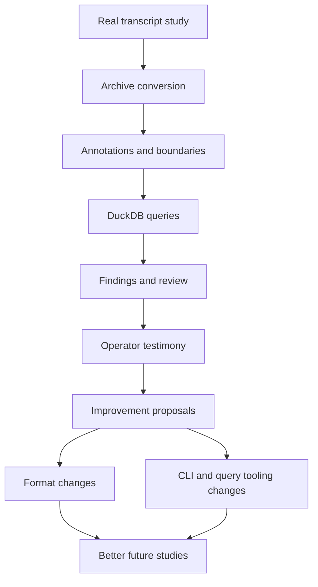

# Improving Minitrace and Transcript Analysis

This ongoing project collects practical field reports, design ideas, and concrete improvement proposals for `go-minitrace` and the broader minitrace format. The immediate trigger was a detailed comparative study of two coding-agent sessions implementing the same Phase 1 feature in separate `go-minitrace` repositories, but the goal of this project is broader: gather repeated operator experience until the pain points and missing abstractions become obvious enough to guide product and format evolution.

> [!summary]
> This project exists to turn real transcript-analysis work into concrete design pressure on minitrace.
> 1. collect detailed user/operator testimonials from serious investigations
> 2. preserve the exact friction points, workarounds, and missing abstractions
> 3. turn those experiences into a prioritized improvement agenda for the minitrace format and `go-minitrace`

## Why this project exists

`go-minitrace` is already strong enough to support serious retrospective analysis of coding-agent sessions. In the recent MiniMax vs GPT-5.4 Phase 1 comparison, it was the right tool for:

- converting Pi session JSONL into a durable archive
- attaching explicit annotations to boundary events
- running DuckDB queries over transcript structure
- grounding claims about timing, tool use, repair loops, and code-boundary state in reproducible evidence

At the same time, the investigation surfaced several recurring friction points:

- annotations are conceptually first-class, but not yet query-first-class in DuckDB
- path normalization across repos/sessions is tedious and easy to get wrong
- implementation-window analysis is common, but there is no first-class span/window concept
- failure analysis still requires regex-heavy inspection of freeform `bash` output
- continuation/split-turn session lineage is not captured strongly enough for easy cross-session reasoning

These are not hypothetical complaints. They emerged during a real comparative engineering review where small tooling gaps repeatedly translated into extra SQL, extra shell glue, or temporarily misleading conclusions.

## Current project status

The project is in its initial evidence-gathering phase.

What exists already:

- one detailed testimonial/report based on a real `go-minitrace` investigation:
  - [[REPORT - Testimonial - Using go-minitrace for Comparative Transcript Analysis]]
- one triggering comparison ticket with concrete scripts, queries, annotations, and findings:
  - `/home/manuel/workspaces/2026-04-08/sqleton-minitrace/go-minitrace/ttmp/2026/04/08/MINIMAX-VS-GPT-COMPARE--compare-minimax-vs-gpt-5-4-implementation-approaches-sqleton-minitrace`
- one guiding methodology note already in the Institute section:
  - [[Code Review with go-minitrace]]

What is still incomplete:

- a stable taxonomy of transcript-analysis use cases
- a map of which pain points belong to the archive format versus the CLI/tooling layer
- comparative experience reports from more than one operator / more than one analysis style
- a prioritized implementation roadmap for minitrace improvements

## Related completed work

The **Minitrace Query Commands** feature ([[PROJ - Minitrace Query Commands - Sqleton-Inspired SQL Verb System]]) added a sqleton-inspired SQL verb/query command system to go-minitrace, including:
- SQL command files with YAML metadata preambles (`/* sqleton ... */`)
- `.alias.yaml` shortcuts with pre-applied defaults
- Repository-based command discovery (embedded + external roots)
- CLI subgroup: `go-minitrace query commands <name>`
- v2 API: `GET/POST /api/v2/query-commands`
- Web UI: Query Editor sidebar with dynamic forms and SQL preview

This directly addresses the "command classification should be built into the core tool versus provided as reusable query packs" question from the open issues below.

## Project shape

At a high level, this project has four layers:

1. **Field evidence collection**
   - real-world investigative tasks
   - detailed testimonials
   - preserved failures and workarounds
2. **Pattern extraction**
   - recurring analysis idioms
   - recurring friction points
   - recurring query shapes
3. **Product/format proposals**
   - CLI improvements
   - archive/view/schema improvements
   - annotation/span/path-normalization improvements
4. **Validation**
   - re-run later studies using improved tooling
   - compare reduction in ad hoc SQL and shell glue

## Architecture

## Current seed artifacts

### Triggering report

- [[REPORT - Testimonial - Using go-minitrace for Comparative Transcript Analysis]]

### Relevant vault notes

- [[Code Review with go-minitrace]]

### Relevant repo/workspace paths

- GPT repo: `/home/manuel/workspaces/2026-04-08/sqleton-minitrace/go-minitrace`
- MiniMax repo: `/home/manuel/workspaces/2026-04-08/sqleton-minitrace-minimax/go-minitrace`
- Comparison ticket:
  - `/home/manuel/workspaces/2026-04-08/sqleton-minitrace/go-minitrace/ttmp/2026/04/08/MINIMAX-VS-GPT-COMPARE--compare-minimax-vs-gpt-5-4-implementation-approaches-sqleton-minitrace`

## Open questions

- Which minitrace concepts deserve format-level representation rather than helper SQL views?
- Should annotations, spans, and derived events all live inside the archive, or should some remain working-state-only constructs?
- How much command classification should be built into the core tool versus provided as reusable query packs? *(Partially addressed: query commands are now built-in with repository discovery)*
- What is the minimum first-class VCS/repo metadata needed to make coding-agent transcript analysis much easier?
- Can we define a canonical "coding-session comparison" workflow that serves as a default product feature?

## Near-term next steps

### Completed

- [[PROJ - Minitrace Query Commands - Sqleton-Inspired SQL Verb System]] - command classification built into the tool via repository-backed query commands

### Pending

- collect additional testimonials from future `go-minitrace` studies
- cluster pain points into format, view, and CLI buckets
- draft a proposal note for first-class annotation/spans/path-normalization support
- draft a proposal note for built-in comparison and failure-analysis workflows
- validate whether future studies need fewer one-off scripts after applying the proposals

## Project working rule

> [!important]
> Every proposed improvement should be traceable back to a real investigative task, a concrete failure mode, or repeated analysis boilerplate observed in practice.
