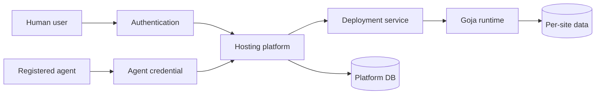
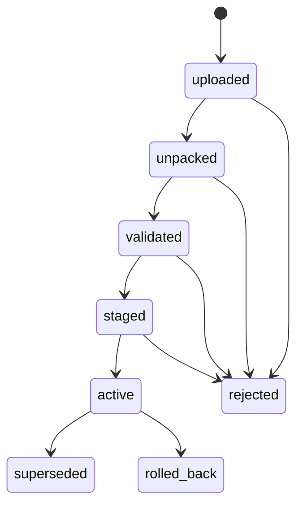
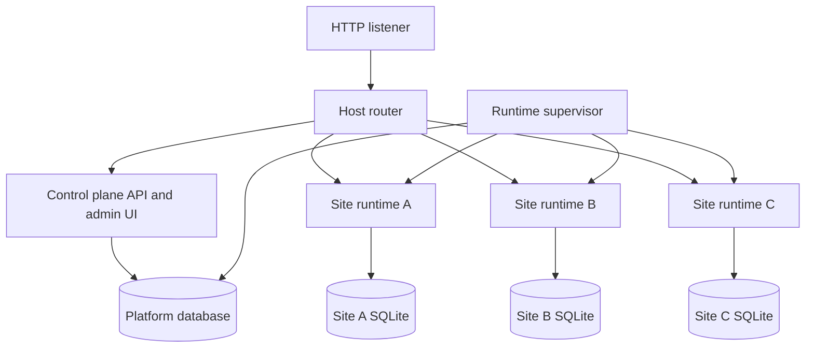
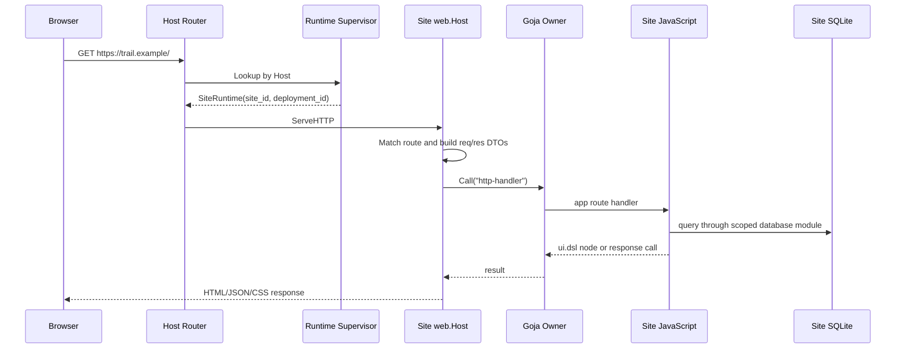
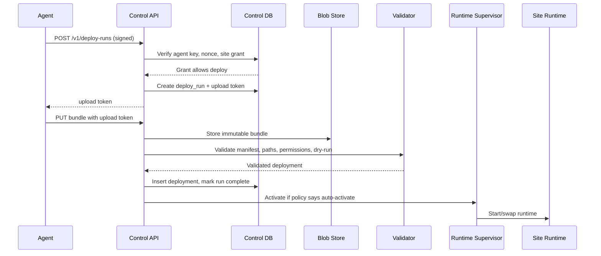

# Goja Sites Hosting Service

This proposal describes a real hosting service for small websites written in server-side JavaScript and executed by Go through `goja`. The existing `goja-site` project already proves the core idea: Go owns the HTTP server, SQLite connection, route registry, Goja runtime, native modules, and HTML rendering, while JavaScript owns the site behavior. The new project turns that trusted single-owner host into a multi-user product where people can sign up, create sites, deploy code, invite agents, and inspect what those agents changed.

The goal is not to rebuild Node, Vercel, Netlify, or a Kubernetes platform. The goal is smaller and more interesting: build a capability-mediated Goja Platform-as-a-Service for compact server-rendered applications, where every side effect is visible to the host and every machine actor operates under explicit delegated authority.

> [!summary]
> Build a multi-tenant Go service that hosts many isolated Goja sites. Humans sign up and manage sites through an admin console. Sites are deployed by humans or enrolled agents. The platform stores users, orgs, sites, deployments, agent credentials, authorization scopes, audit events, runtime state, and per-site data. The design reuses `goja-site` for runtime hosting, `Agent Enroll` for agent identity and run tokens, `Wish Git` for scoped deploy policy, and the PARC KB patterns for Keycloak auth, host-mediated sandboxing, Goja owner-thread execution, and application-native authorization.

---

## 1. What we are building

A hosting platform has three jobs. It must know who is allowed to do something. It must accept a package of code and configuration. It must run that package safely enough that one user's site cannot accidentally become another user's site.

For this project, a **site** is a directory of JavaScript files plus optional assets and a per-site data store. The JavaScript code uses the same programming model as the existing `goja-site` prototype:

```javascript
const express = require("express");
const ui = require("ui.dsl");
const db = require("database");

const app = express.app();

app.get("/", (req, res) => {
  return ui.page({ title: "Hello" },
    ui.main(
      ui.h1("Hello from Goja"),
      ui.p("This page was rendered by server-side JavaScript hosted in Go.")
    )
  );
});
```

The hosting service wraps this programming model in product concepts:

| Product concept | Meaning |
|---|---|
| User | A human account that signs up and logs in. |
| Organization | A tenant boundary for users, sites, agents, and billing. |
| Site | A named hosted application such as `crm.example.host`. |
| Deployment | An immutable uploaded version of a site's code and assets. |
| Runtime instance | The live Goja runtime serving one site at one deployment. |
| Agent | A machine identity registered by a user or admin. |
| Agent credential | An Ed25519 key or similar credential proving which agent is speaking. |
| Deploy token/run token | A short-lived scoped credential allowing one deployment operation. |
| Admin console | A human UI for users, sites, deployments, agents, logs, and policy. |

The first version should feel like this:

1. A user signs up or logs in.
2. The user creates an organization and a site named `trail-notes`.
3. The platform assigns `trail-notes.host.example` or accepts a verified custom domain.
4. The user deploys a bundle from the CLI.
5. The platform validates the bundle, stores it as a deployment, starts or reloads the site's Goja runtime, and routes traffic by Host header.
6. The user registers an agent and grants it permission to deploy only one site, optionally only from a specific branch or path.
7. The agent obtains a short-lived deploy credential and pushes an update.
8. The admin page shows who deployed what, which files changed, which runtime is live, and whether the site is healthy.

The phrase “real hosting service” matters. The current `goja-site` prototype can serve multiple trusted sites from a YAML file. The new service must make hosting a persistent product with identity, authorization, deployments, rollback, audit, and operational controls.

---

## 2. The mental model for interns

Before talking about tables and routes, it helps to separate four systems that often get confused.



Authentication answers “who is this?” Authorization answers “may this identity do this operation?” Deployment answers “what code version should run?” Runtime answers “how does this HTTP request become a page?”

If these four systems are not separated, the platform becomes unsafe quickly. A valid login cookie should not imply permission to deploy every site. A registered agent key should not imply permission to read every user's deployments. A Goja script should not be able to open arbitrary files just because the host happens to have a filesystem. This is why the proposal is built around the same principles captured in [[Fundamentals/access-control-models]] and [[Fundamentals/host-mediated-sandbox-principles]].

The central rule is:

```text
Humans authenticate broadly.
The application authorizes narrowly.
Agents receive delegated credentials.
Goja sites receive only explicit host capabilities.
```

A new intern should be able to debug the system by asking four questions in order:

1. Which identity is making the request: human, agent, deploy run, or public browser visitor?
2. Which database row grants this identity permission for this exact action?
3. Which deployment version and site runtime does the request target?
4. Which host capability is the Goja script using, and where is that capability mediated?

---

## 3. Existing technical solution: `goja-site`

The existing project `/home/manuel/code/wesen/2026-05-03--goja-hosting-site` is the foundation. The PARC article [[ARTICLE - Goja Site - Hosting Server Architecture Deep Dive]] explains it as a trusted JavaScript website host in Go. The important technical idea is role separation:

```text
Go owns infrastructure.
JavaScript owns application behavior.
ui.dsl owns HTML values.
web.Host owns HTTP dispatch.
```

The current `pkg/app.Server` owns one site's resources:

```go
type Server struct {
    cfg     Config
    db      *sql.DB
    runtime *engine.Runtime
    host    *web.Host
    httpSrv *http.Server
}
```

That structure is almost exactly what a hosted platform needs for each runtime instance. The platform will not invent a new runtime model. It should lift this object into a site-runtime supervisor that can create, start, stop, reload, and inspect many instances.

### 3.1 Express-style routing

`goja-site` exposes a tiny Express-inspired module:

```javascript
const express = require("express");
const app = express.app();

app.get("/hello/:name", (req, res) => {
  return ui.h1("Hello " + req.params.name);
});
```

The Go side does not give JavaScript a socket. JavaScript registers handlers into a Go-owned route registry. When a request arrives, Go parses it, creates a request DTO and response object, and calls the JavaScript handler through the Goja runtime owner. This remains the right model for a hosting service because the platform can insert policy, limits, logging, request IDs, and tenant context before JavaScript code runs.

### 3.2 `ui.dsl` as safe server-side HTML

The `ui.dsl` module lets JavaScript build HTML as values rather than strings:

```javascript
ui.page({ title: "Demo" },
  ui.link({ rel: "stylesheet", href: "/style.css" }),
  ui.main(
    ui.h1("Hello"),
    ui.p("Rendered from server-side JavaScript")
  )
)
```

The renderer escapes text and attributes. This matters in a hosted service because users will build pages from form data, URL parameters, and database rows. The platform cannot guarantee every site author remembers escaping rules. Providing a default value-based HTML DSL reduces the chance that small sites become cross-site-scripting factories.

### 3.3 Per-site SQLite and `db.guard`

The prototype gives each site a database module backed by a Go-owned SQLite connection. It also contains `pkg/dbguard`, which meters writes and can call a JavaScript cleanup callback when a database exceeds configured limits. That is a useful seed for hosted quotas:

- soft per-site database size limit;
- hard limit that can reject writes;
- cleanup callback for application-owned retention policy;
- admin-visible usage statistics.

The hosting service should keep this idea, but make quota policy platform-owned rather than script-owned. A script may register cleanup behavior, but the host decides limits and enforcement.

### 3.4 Multi-site serving already exists, but it is static

The current `serve-multi` command reads YAML such as:

```yaml
addr: ":8080"
dataDir: "/data/sites"
baseDomain: "kanban.yolo.scapegoat.dev"
sites:
  - name: trail
    scriptsDir: /app/sites/trail/scripts
  - name: editorial
    scriptsDir: /app/sites/editorial/scripts
```

`pkg/app.MultiServer` dispatches by Host header:

```go
func (m *MultiServer) ServeHTTP(w http.ResponseWriter, r *http.Request) {
    host := normalizeHost(r.Host)
    site := m.sites[host]
    if site == nil {
        http.Error(w, "unknown goja-site host", http.StatusNotFound)
        return
    }
    site.ServeHTTP(w, r)
}
```

This is the right prototype for request routing. It is not enough for a product because sites are fixed at process startup, there is no user model, no deployment history, no agent model, no audit trail, and no control plane API. The new project should keep Host-header routing but replace static YAML with a platform database and runtime supervisor.

---

## 4. Existing technical solution: agent enrollment

The project `/home/manuel/code/wesen/2026-05-03--agent-enroll` is the best existing model for machine actors. Its core idea matches [[Tribal/application-native-authorization]]: Keycloak authenticates humans, but the Go application owns agent, run, and task authorization.

Agent Enroll uses three credential layers:

| Layer | Question answered | Example in Agent Enroll | Proposed hosting equivalent |
|---|---|---|---|
| Human token | Which human is logged in? | Keycloak JWT | Signup/admin session token |
| Agent key | Which machine is speaking? | Ed25519 signed request | Registered deploy agent key |
| Run token | What may it do right now? | Opaque task-bound run token | Short-lived site deployment token |

The signed request code is directly relevant. An agent signs a canonical string:

```go
func CanonicalString(method, path string, body []byte, timestamp, nonce string) string {
    sum := sha256.Sum256(body)
    return strings.Join([]string{
        strings.ToUpper(method),
        path,
        hex.EncodeToString(sum[:]),
        timestamp,
        nonce,
    }, "\n")
}
```

The server checks timestamp freshness, verifies the Ed25519 signature, and stores the nonce to prevent replay. This pattern should be reused for deploy agents. A deploy agent should not receive a human's session cookie or refresh token. It should prove its own identity with its own key, then request a narrow operation credential from the platform.

For hosting, the equivalent flow is:

```text
Human creates agent
  -> platform stores agent public key
Human grants agent deploy permission on site S
Agent signs POST /v1/deploy-runs
  -> platform verifies agent signature and grant
  -> platform creates deploy_run row and short-lived upload token
Agent uploads bundle with upload token
  -> platform validates bundle and creates deployment
  -> runtime supervisor activates deployment if policy allows
```

This gives good failure containment. If the agent key leaks, it only has the grants attached to that agent. If the upload token leaks, it expires quickly and is bound to one deploy run. If a human leaves an organization, the platform can revoke their memberships and agent grants without touching Keycloak realm internals.

---

## 5. Existing technical solution: Wish Git and scoped pushes

The project `/home/manuel/code/wesen/2026-05-01--wish-git` is relevant because it solved scoped writes by agents. It used Keycloak for human auth, application-owned policy rows for authorization, short-lived SSH certificates for delegation, and Git hooks for enforcement.

The policy model is compact:

```go
type RunContext struct {
    RunID          string
    UserID         string
    RepoID         string
    AllowedActions []string
    AllowedRefs    []string
    AllowedPaths   []string
    ExpiresAt      time.Time
    Status         string
}
```

The key functions are easy to teach:

```go
func AllowsAction(run RunContext, action string, now time.Time) bool
func AllowsRef(run RunContext, ref string) bool
func AllowsPath(run RunContext, path string) bool
```

The hosting service needs the same idea, but applied to deployment bundles instead of Git refs:

| Wish Git concept | Hosting-service concept |
|---|---|
| Repository | Site |
| Ref pattern | Environment or channel, such as `production`, `preview/*`, `dev` |
| Path pattern | Allowed bundle paths, such as `scripts/**` and `assets/**` |
| SSH certificate | Short-lived deploy token or signed upload session |
| Pre-receive hook | Bundle validator and deployment policy gate |
| Agent run | Deploy run |

Wish Git also demonstrates a defense-in-depth habit. Even if the SSH server accepted a command, the Git pre-receive hook checked ref and path policy again. The hosting equivalent should validate at multiple layers:

1. The API checks that the human or agent can create a deploy run for the target site.
2. The upload endpoint checks that the token is bound to that run and site.
3. The bundle validator checks file paths, manifest, size limits, forbidden files, and optional signatures.
4. The runtime supervisor only activates a deployment that passed validation.
5. The audit log records each step.

---

## 6. Authentication and signup

The PARC KB entry [[Tribal/keycloak-oauth-in-go-services]] recommends Keycloak for human authentication and local JWT validation in Go services. The principle is: Keycloak proves identity, but the application decides permissions.

For this hosting service, there are two viable first-version choices:

### Option A: Keycloak-backed signup

Users sign up through Keycloak or a managed identity provider. The hosting platform validates JWTs locally using JWKS keys, resolves `(issuer, subject)` into a local `users` row, and creates a local session or signed cookie for browser use.

This is the most consistent with existing projects. It reuses the patterns from BYOK Host, Wish Git, and Agent Enroll. It also avoids writing password storage, reset flows, email verification, and account hardening in the first version.

### Option B: Local email/password signup

The platform stores password hashes and owns the whole account flow. This may be attractive for a self-contained demo, but it is more security-sensitive and less aligned with the existing PARC stack.

### Recommendation

Use Keycloak or OIDC for v1 human authentication, but store all product authorization in the platform database. The platform should normalize identity as:

```text
users.id = internal UUID
users.issuer = OIDC issuer URL
users.subject = OIDC subject claim
users.email = display/contact attribute, not primary key
```

The signup event is then a local provisioning step:

```text
First valid OIDC login
  -> find user by (issuer, subject)
  -> if none, create user
  -> if no org, offer create organization flow
  -> issue browser session cookie
```

The admin console should not ask “is this token valid?” for every product action. It should ask “does this local user have a membership or role granting this exact operation?”

---

## 7. Authorization model

The platform's authorization model should be application-native. This means Keycloak roles may help decide whether to show a global admin link, but all site-level policy lives in platform tables.

A first version can use simple role-based authorization:

| Role | Scope | Permissions |
|---|---|---|
| `platform_admin` | Whole installation | Manage all users, orgs, sites, agents, domains, deployments, quotas. |
| `org_owner` | One organization | Manage org members, sites, agents, billing, destructive actions. |
| `org_developer` | One organization | Create deployments and manage non-destructive site config. |
| `org_viewer` | One organization | View sites, deployments, logs, and audit events. |
| `agent` | Explicit grants | Perform only the granted machine operations. |

For site-specific grants, store rows rather than embedding complicated policy in roles:

```sql
site_grants(
  site_id,
  principal_type,  -- user, agent, group later
  principal_id,
  can_view,
  can_deploy,
  can_rollback,
  can_manage_domains,
  can_manage_env,
  allowed_channels,
  allowed_paths,
  expires_at
)
```

This table is intentionally boring. Boring policy tables are good because they are queryable, testable, and explainable to interns. A missing `WHERE site_id = ?` in a policy query is obvious in code review. A hidden role transform inside the IdP is not.

The most important rule from [[Fundamentals/access-control-models]] is that credentials should narrow authority:

```text
Human OIDC token -> local user identity -> org/site grant -> deploy run -> upload token -> deployment
```

Each arrow loses power. It should never gain power.

---

## 8. Deployment model

A deployment is an immutable version of a site. The runtime may change which deployment is active, but a deployment record itself should not be edited after validation. This gives rollback, audit, reproducibility, and incident investigation.

### 8.1 Bundle format

A deploy bundle should be a tarball or zip with a manifest:

```text
site.tar.gz
  goja-site.json
  scripts/app.js
  scripts/routes.js
  assets/style.css
  assets/logo.svg
```

Example manifest:

```json
{
  "name": "trail-notes",
  "runtime": "goja-site/v1",
  "entry": "scripts",
  "assets": "assets",
  "permissions": {
    "database": true,
    "network": [],
    "filesystem": "site-readonly-assets",
    "timers": true
  },
  "limits": {
    "maxRequestMs": 2000,
    "maxDbBytes": 52428800
  }
}
```

The manifest should be declarative. It does not grant permissions by itself. It asks for permissions. The host compares requested permissions with site policy and either accepts, denies, or strips capabilities.

This is the direct application of [[Tribal/data-only-vs-host-access-module-split]]. Data-only modules can be default. Host-access modules are explicit. The current prototype enables `fs`, `path`, `time`, and `timer` through middleware. In a real hosting service, `fs` should not be a default unrestricted module. It should become a controlled asset capability, or be disabled unless a site is trusted.

### 8.2 Validation pipeline

A deployment should move through explicit states:



Validation should check:

- The bundle has a manifest.
- Paths are relative and do not contain `..` or absolute prefixes.
- File count and total size are under quota.
- JavaScript files parse or at least load in a dry-run runtime.
- Requested permissions are allowed by site policy.
- Static assets use allowed MIME types and sizes.
- Optional checks pass: lint, route discovery, health check, smoke request to `/`.

This is the hosting version of a Git pre-receive hook. The validator is the last place to reject bad code before it becomes a runtime.

### 8.3 Activation and rollback

Activation should be a pointer update:

```text
sites.active_deployment_id = deployments.id
```

The runtime supervisor sees the pointer change and starts a new runtime for that deployment. Once the new runtime passes a health check, the router swaps traffic. The old runtime remains available briefly for graceful in-flight request completion, then shuts down.

Rollback is the same operation in reverse: set `active_deployment_id` to a previous validated deployment and restart/swap.

---

## 9. Runtime architecture

The runtime architecture should keep the core shape of `goja-site`, but add supervision.



The router does Host-header dispatch, as `MultiServer` already does. The difference is that the target map is dynamic and supervised:

```go
type RuntimeSupervisor interface {
    GetByHost(host string) (*SiteRuntime, bool)
    Activate(ctx context.Context, siteID, deploymentID string) error
    Stop(ctx context.Context, siteID string) error
    Restart(ctx context.Context, siteID string) error
    Status(ctx context.Context, siteID string) RuntimeStatus
}
```

Each `SiteRuntime` owns:

- site ID and deployment ID;
- resolved hostnames;
- scripts directory or unpacked bundle path;
- per-site database handle;
- Goja runtime and owner;
- `web.Host` route registry;
- module capability set;
- request counters and error counters;
- lifecycle timestamps.

The runtime should obey [[Tribal/goja-execution-model]]: a Goja runtime is not goroutine-safe. HTTP handlers may run concurrently, but JavaScript execution must enter through the runtime owner. If one site becomes slow, it should not block the whole platform. This is why each site needs its own runtime owner and eventually its own process or worker pool if stronger isolation is required.

### 9.1 Isolation levels

There are three possible isolation levels. The proposal recommends starting with level 1 and designing interfaces so level 2 can be added later.

| Level | Description | Pros | Cons |
|---|---|---|---|
| 1. In-process per-site runtime | One Go process, one Goja runtime per site. | Simple, fast, reuses prototype directly. | A malicious or buggy script can consume process CPU/memory. |
| 2. Worker process per site/group | Supervisor runs site runtimes in child processes. | Crash isolation and resource limits are easier. | Requires IPC and process lifecycle management. |
| 3. MicroVM/container per site | Firecracker/container boundary around site runtime. | Stronger tenant isolation. | Operationally much heavier. |

The first version can be honest: this is a controlled beta hosting service, not an arbitrary untrusted-code cloud. But the API should be capability-mediated from the start so moving from in-process to worker processes does not change the user model.

### 9.2 Capability set for hosted Goja

The current prototype exposes useful modules. A hosted product should classify them:

| Module | Default? | Reason |
|---|---|---|
| `ui.dsl` | Yes | Data-to-HTML values with escaping. |
| `express` | Yes | Route registration API. |
| `path` | Maybe | Data-only path manipulation is okay if not tied to real FS access. |
| `time`, `timer` | Yes with limits | Timers coordinate behavior but need cleanup on runtime shutdown. |
| `database` / `db` | Yes, scoped | Must be bound to one site's database only. |
| `db.guard` | Host-configured | Site can observe stats and register cleanup; host owns limits. |
| `fs` | No unrestricted default | Filesystem access is host access; expose only site asset reads or remove. |
| `http/fetch` | No unrestricted default | Network egress requires allowlist and logging. |
| `exec` | Never in v1 | Process execution is too powerful for hosted scripts. |

This table should be part of the project README because it teaches the security model in one page.

---

## 10. Data storage

The platform has two kinds of state:

1. **Control-plane state**: users, orgs, sites, deployments, agents, grants, domains, audit logs, usage, billing, runtime status.
2. **Site state**: each hosted site's application database and uploaded assets.

The KB entry [[Tribal/sqlite-as-application-database]] says SQLite is excellent for single-user or small-team tools, but it also notes that Wish Git used Postgres for multi-user concurrent writes. A real hosting service has multiple users and agents deploying at the same time. That pushes the control plane toward Postgres sooner than a local tool would.

### Recommendation

Use Postgres for the control plane and per-site SQLite for v1 site data.

This split matches responsibilities:

| Store | Technology | Why |
|---|---|---|
| Control DB | Postgres | Concurrent users, agents, deployments, audit, admin queries, row locking. |
| Site DB | SQLite file per site | Simple app persistence, easy backup/export, matches existing `goja-site` model. |
| Deployment blobs | Filesystem/object storage | Bundles and assets are blobs; do not bloat control DB. |
| Logs/events | Postgres initially, object storage later | Queryable audit in v1; long-term retention later. |

A first local-dev build could use SQLite for everything to move faster, but the architecture should not assume the control DB is a single-writer file. If this is intended to become a real hosted service, Postgres is the safer control-plane default.

### 10.1 First-pass schema

The schema should start with explicit product objects:

```sql
users(id, issuer, subject, email, created_at, last_login_at)
orgs(id, name, slug, created_at)
memberships(org_id, user_id, role, created_at)

sites(id, org_id, name, slug, primary_host, status, active_deployment_id, created_at)
site_domains(id, site_id, hostname, verified_at, status)
site_config(site_id, config_json, updated_at)
site_quotas(site_id, db_max_bytes, bundle_max_bytes, request_timeout_ms)

deployments(id, site_id, created_by_type, created_by_id, version, bundle_path, manifest_json, status, created_at, activated_at)
deploy_runs(id, site_id, agent_id, requested_by_user_id, status, scopes, expires_at, created_at, finished_at)

agents(id, org_id, name, status, created_by_user_id, created_at, last_seen_at)
agent_keys(id, agent_id, public_key, status, created_at, revoked_at)
agent_site_grants(agent_id, site_id, can_deploy, can_rollback, allowed_channels, allowed_paths, expires_at)
agent_nonces(agent_id, nonce, seen_at)

audit_log(id, org_id, actor_type, actor_id, action, resource_type, resource_id, metadata_json, created_at)
```

The exact schema will evolve, but the important thing is that authorization facts are rows. They are not comments in code, not Keycloak role names, and not implicit directory ownership.

---

## 11. Admin console

The admin page is not an afterthought. It is the human interface to the control plane. If the admin console is weak, operators will debug by shelling into directories and reading database rows manually, which bypasses the product model.

The first admin console should have these pages:

| Page | Purpose |
|---|---|
| Overview | Show orgs, site count, active runtimes, failed deployments, recent audit events. |
| Users | List users, org memberships, roles, last login. |
| Sites | List sites, hosts, active deployment, runtime health, quotas. |
| Site detail | Show deployments, config, domains, environment variables, logs, database stats. |
| Deployment detail | Show manifest, files, validation output, actor, timestamps, activation/rollback actions. |
| Agents | List agents, status, keys, grants, last seen, revoke actions. |
| Audit log | Query who did what, when, from where, and with which credential. |
| Platform settings | Base domains, auth settings, quotas, runtime policy. |

For v1, the admin UI can be a small React/Vite SPA served by Go, following patterns from Agent Enroll's `web/dashboard` and the go-web frontend embed conventions used elsewhere. The site runtime itself should not serve the platform admin UI. The admin UI belongs to the control plane, not to any user's Goja site.

### 11.1 Admin actions should be API calls with audit events

Every destructive or security-relevant admin action should produce an audit event:

```text
site.create
site.domain.add
site.deployment.activate
site.deployment.rollback
agent.create
agent.key.revoke
agent.site_grant.update
user.membership.update
quota.update
```

Audit events are not merely logs. They are part of the security model. They let a user answer: “Which agent pushed the broken version?” and “Who granted that agent production deploy permission?”

### 11.2 User dashboard research: Agent Enroll as the closest existing UI

The closest existing dashboard is the Agent Enroll React/Vite UI at `/home/manuel/code/wesen/2026-05-03--agent-enroll/web/dashboard/src`. It is not a hosting dashboard, but it already solves the shape of a logged-in user workspace for organizations, agents, enrollment tokens, runs, usage, and audit. That makes it the best UI starting point for this project.

The useful pattern begins in `App.tsx`. The app wraps pages in an `AppShell`, checks the browser session with `useBrowserSession`, and protects organization routes with `RequireSession`. The route table is small and understandable:

```tsx
<Route path="/orgs/:orgId/agents" element={<RequireSession session={session}><AgentsPage /></RequireSession>} />
<Route path="/orgs/:orgId/usage" element={<RequireSession session={session}><UsagePage /></RequireSession>} />
<Route path="/orgs/:orgId/audit" element={<RequireSession session={session}><AuditPage /></RequireSession>} />
```

For the hosting service, the same dashboard skeleton becomes:

```tsx
<Route path="/orgs/:orgId/sites" element={<SitesPage />} />
<Route path="/orgs/:orgId/sites/:siteId" element={<SiteDetailPage />} />
<Route path="/orgs/:orgId/sites/:siteId/deployments/:deploymentId" element={<DeploymentDetailPage />} />
<Route path="/orgs/:orgId/agents" element={<AgentsPage />} />
<Route path="/orgs/:orgId/tokens" element={<BotTokensPage />} />
<Route path="/orgs/:orgId/audit" element={<AuditPage />} />
```

The important lesson is not the specific CSS style. The lesson is that the dashboard should be a first-class control plane client. It calls the same `/v1` API as the CLI, uses the same authorization checks, and displays the same audit-backed state.

The Agent Enroll `AgentsPage.tsx` is especially relevant. It lists agents, polls running runs every 15 seconds, creates enrollment tokens, shows a one-time token panel, and revokes agents through a confirmation dialog. This maps directly to site-deploy agents:

| Agent Enroll dashboard object | Hosting dashboard equivalent |
|---|---|
| Board | Site |
| Task run | Deploy run |
| Enrollment token | Bot/agent registration token |
| Agent revoke | Revoke deploy bot and outstanding deploy tokens |
| Usage page | Site request/storage/deployment usage |
| Audit page | Site, token, deployment, and agent audit trail |

The token UI is also worth reusing conceptually. `EnrollmentTokenPanel.tsx` shows the secret once through `SecretRevealBox` and provides a copyable command through `CommandCopyBox`:

```tsx
<SecretRevealBox label="Enrollment Token" secret={token} />
<CommandCopyBox title="Headless enrollment command" command={`kanban-agent enroll --token ${token}`} />
```

The hosting dashboard should do the same for bot tokens and deploy agents:

```tsx
<SecretRevealBox label="Bot Registration Token" secret={token} />
<CommandCopyBox title="Register bot" command={`goja-host-agent enroll --token ${token}`} />
<CommandCopyBox title="Deploy site" command={`goja-host-agent deploy ./site --site ${siteSlug}`} />
```

This one-time reveal pattern is a good product and security habit. Users can copy the token, but the platform does not need to show it again. The database should store only a token hash, as Agent Enroll does for run tokens and enrollment tokens.

The API client in `api/kanbanApi.ts` uses Redux Toolkit Query with typed endpoints, bearer-token header preparation, cache tags, and invalidation after mutations. That gives the hosting dashboard a concrete implementation model:

```tsx
listSites: builder.query<{ sites: Site[] }, { org_id: string }>({ ... })
createDeployment: builder.mutation<Deployment, { site_id: string; bundle: File }>({ ... })
createBotToken: builder.mutation<BotTokenResponse, { site_id: string; expires_in_seconds: number }>({ ... })
revokeAgent: builder.mutation<{ ok: boolean }, { agent_id: string }>({ ... })
listAuditLog: builder.query<{ events: AuditEvent[] }, AuditQuery>({ ... })
```

The hosting project should therefore include a **user dashboard**, not only an operator admin console. The distinction matters:

| UI surface | Audience | Scope |
|---|---|---|
| User dashboard | Normal org users and developers | Their orgs, sites, deployments, bot tokens, usage, and audit events. |
| Platform admin console | Installation operators | All users, all orgs, global runtime health, quotas, domain policy, abuse response. |

For v1, these can be two role-gated areas in one embedded SPA. The left navigation should make the product model visible:

```text
Organization switcher
  Sites
    Site detail
    Deployments
    Domains
    Environment / capabilities
    Logs
  Bot tokens / Agents
  Usage
  Audit log
  Members
Platform admin, if role allows
```

The dashboard MVP should include these user-facing workflows:

1. **Create a site**: choose name, slug, base-domain hostname, and starter template.
2. **See deployment instructions**: copy `goja-host deploy ./site --site <slug>`.
3. **Upload or activate deployment**: upload bundle, inspect validation, activate or rollback.
4. **Manage bot tokens and agents**: create one-time enrollment token, copy enrollment command, list agents, revoke agent.
5. **Grant deploy permissions**: select a site and allowed channels/paths for an agent.
6. **Inspect usage**: requests, errors, database size, bundle size, deployment count.
7. **Read audit trail**: filter by actor, action, site, deployment, agent, and time.

This dashboard research should be treated as part of the implementation plan. The backend API should be designed so every dashboard action is a normal API mutation with a typed request, a typed response, cache invalidation, and an audit event. If an action cannot be represented cleanly in the API client, the product model is probably unclear.

---

## 12. CLI and agent workflows

Users and agents need a command-line path. A web UI alone is too clumsy for deployment.

### 12.1 Human CLI

A human developer should be able to run:

```bash
goja-host login
goja-host sites create trail-notes --org parc
goja-host deploy ./site --site trail-notes --message "Add field notes page"
goja-host deployments list --site trail-notes
goja-host rollback --site trail-notes --to dep_123
```

The CLI can use browser OAuth with PKCE, similar to the existing Keycloak CLI patterns. It stores the user's token locally and calls the control-plane API.

### 12.2 Agent CLI/API

An agent should use its own key:

```bash
goja-host-agent keygen
goja-host-agent enroll --token enroll_...
goja-host-agent deploy ./site --site trail-notes
```

The agent deploy flow should not require a browser and should not contain a human token. It should look like Agent Enroll:

```text
Agent signs request with Ed25519 key
  -> platform verifies key, timestamp, nonce
  -> platform checks agent_site_grants
  -> platform creates deploy_run
  -> platform returns short-lived upload URL/token
Agent uploads bundle
  -> platform validates and records deployment
```

### 12.3 Push and configure sites

“Push” and “configure” are separate actions. A deployment bundle changes code. A configuration update changes platform-owned settings such as domains, environment variables, quotas, and runtime capability policy.

This separation matters because an agent may be allowed to push code but not change secrets or domains. The policy should distinguish:

- `site:deploy`
- `site:rollback`
- `site:config:read`
- `site:config:write`
- `site:secrets:write`
- `site:domains:write`

For v1, environment variables and secrets can be minimal. If secrets are added, they must be host-mediated. A Goja script should ask the host for a named secret, and the host should decide whether that site and deployment may access it. The script should not read a process-wide environment.

---

## 13. Request path: public visitor to hosted site

A public visitor request should be easy to trace:



The router should add request context fields such as request ID, site ID, deployment ID, and tenant ID before the request reaches the site's host. The site JavaScript may see a safe subset through `req.platform`, for example:

```javascript
app.get("/debug", (req, res) => {
  res.json({
    site: req.platform.siteName,
    deployment: req.platform.deploymentId,
    requestId: req.platform.requestId
  });
});
```

This is useful for debugging, but it must not expose secrets or cross-tenant information.

---

## 14. Request path: agent deploy

An agent deploy path is longer because it is security-sensitive:



The important teaching point is that the agent key is not the deployment permission by itself. It proves identity. The grant row authorizes. The upload token delegates one operation. The validator enforces package policy. Activation changes live traffic.

---

## 15. Security model and threat boundaries

The service should be explicit about what it protects against in v1.

### 15.1 In scope for v1

- One user should not be able to manage another user's site without membership or grants.
- One agent should not be able to deploy to sites outside its grants.
- A leaked run/upload token should expire quickly and be bound to one deploy run.
- A site script should only receive the database, asset, network, and secret capabilities granted by the host.
- A site should not read another site's SQLite file through ordinary APIs.
- Deployment bundles should not write outside their site storage directory.
- Admin actions should be auditable.

### 15.2 Not fully solved by in-process v1

- A malicious Goja script may consume CPU or memory in the shared process.
- A Goja interpreter bug or native module bug may compromise process memory.
- Strong tenant isolation comparable to containers or microVMs is not provided by an in-process runtime.
- Fine-grained JavaScript CPU preemption and memory accounting may require more engineering.

This honesty is important. The existing `goja-site` article says the prototype is not a secure sandbox for untrusted code. The hosting service can improve mediation and policy, but in-process Goja is still a weaker boundary than a worker process, container, or Firecracker VM. The platform should start by targeting trusted beta users and small internal apps, while keeping the architecture ready for stronger runtime isolation.

---

## 16. MVP scope

The MVP should be deliberately small. It should prove the full product loop without trying to solve every hosting feature.

### 16.1 MVP features

1. **Human auth and signup**
   - OIDC/Keycloak login.
   - Local user provisioning by `(issuer, subject)`.
   - Organization creation.

2. **Site management**
   - Create/list/delete sites.
   - Assign subdomain under a configured base domain.
   - View runtime status.

3. **Deployment API and CLI**
   - Upload tar/zip bundle with manifest.
   - Validate paths, size, manifest, and script load.
   - Store immutable deployment.
   - Activate and rollback deployments.

4. **Runtime supervisor**
   - Serve multiple sites by Host header.
   - Start one Goja runtime per active site.
   - Stop/restart runtimes.
   - Expose health/status.

5. **Agent enrollment**
   - Register agent with Ed25519 public key.
   - Grant deploy permission to one site.
   - Verify signed agent requests with timestamp and nonce.
   - Issue short-lived upload/deploy tokens.

6. **Admin console**
   - Users/orgs/sites/deployments/agents/audit views.
   - Manual activate/rollback/revoke actions.

7. **Audit and usage**
   - Audit all authz-sensitive actions.
   - Track deployment count, bundle sizes, DB size, request counts.

### 16.2 Non-goals for MVP

- Billing automation.
- Arbitrary npm package support.
- Full Node compatibility.
- Unrestricted network egress.
- Custom domains with automated DNS/TLS.
- Multi-region hosting.
- Strong container or microVM isolation.
- Horizontal runtime scaling.
- Collaborative real-time editor.

These non-goals keep the first version shippable.

---

## 17. Implementation phases

### Phase 0: Repository scaffold and design skeleton

Create a new Go repository, likely under `/home/manuel/code/wesen/2026-05-11--goja-sites-hosting-service` or the preferred naming convention. Add a CLI/server binary, Makefile, CI, basic config loading, logging, and an empty control API.

Deliverables:

- `cmd/goja-hostd` server.
- `cmd/goja-host` CLI.
- `internal/config`, `internal/store`, `internal/httpapi`.
- Initial README with capability model.

### Phase 1: Control plane database and auth

Implement users, orgs, memberships, sites, and audit tables. Add OIDC/Keycloak local JWT validation and browser/session support.

Deliverables:

- Login/callback or bearer-token flow.
- `GET /v1/me`.
- Org/site CRUD.
- Integration tests for membership authorization.

### Phase 2: Static deployment and runtime supervisor

Port the `goja-site` runtime into a library dependency or copy/refactor it into the new service. Implement deployment upload, validation, storage, activation, and Host-header dispatch.

Deliverables:

- `POST /v1/sites/{site}/deployments`.
- `POST /v1/deployments/{id}/activate`.
- Runtime map by host.
- Per-site SQLite DB creation.
- Smoke test: deploy hello site and GET `/` by Host header.

### Phase 3: Admin console

Build a small embedded SPA for users, sites, deployments, agents, and audit events. The admin console should call the same API as the CLI.

Deliverables:

- Site list and detail pages.
- Deployment list/detail with validation output.
- Activate/rollback buttons.
- Audit log page.

### Phase 4: Agent registration and deploy runs

Reuse Agent Enroll's signed request pattern. Add agent keys, grants, nonces, deploy runs, and short-lived upload tokens.

Deliverables:

- Agent key registration.
- Agent grant management.
- Signed `POST /v1/deploy-runs`.
- Agent deploy CLI.
- Replay and unauthorized-site tests.

### Phase 5: Capability hardening and quotas

Turn runtime modules into explicit capability sets. Remove unrestricted `fs` from default hosted runtimes. Add DB guard policy, bundle quotas, request timeouts, and network egress policy stubs.

Deliverables:

- Capability manifest validation.
- Host-owned DB quotas.
- Request timeout handling.
- Admin-visible usage stats.

### Phase 6: Operational polish

Add backups, export/import, deployment pruning, better logs, health checks, and optional custom domain verification.

Deliverables:

- Backup per-site SQLite and deployment metadata.
- Runtime event stream.
- Domain verification proof record.
- Production runbook.

---

## 18. Testing strategy

The tests should prove the boundaries, not just happy paths.

| Test area | What to prove |
|---|---|
| Authn | Invalid issuer/audience is rejected. Valid token provisions or resolves local user. |
| Authz | User from org A cannot deploy site in org B. Missing `site_id` filters fail tests. |
| Agent signatures | Bad signature, old timestamp, and replayed nonce are rejected. |
| Deploy runs | Upload token is bound to one site/run and expires. |
| Bundle validation | `../evil.js`, absolute paths, oversized bundles, and forbidden permissions are rejected. |
| Runtime dispatch | Host `a.example` cannot route to site `b`. |
| Goja owner discipline | Concurrent HTTP requests do not touch a runtime outside its owner. |
| Rollback | Previous deployment can become active without mutating deployment records. |
| Audit | Every security-relevant action creates an audit row. |
| Quotas | DB hard limit blocks writes and soft limit records warnings. |

A browser-level Playwright smoke test should deploy a site, visit it, submit a form, and verify persistence. This is valuable because it crosses all layers: CLI/API, deployment, runtime, Goja handler, `ui.dsl`, SQLite, and browser response.

---

## 19. Open design questions

1. **Should the control plane start on Postgres immediately?** The recommendation is yes for a real hosted service, but SQLite may accelerate a prototype. If SQLite is used first, keep the storage interface and migrations ready for Postgres.

2. **Should deployments be Git-based or bundle-based in v1?** Bundle-based deployment is simpler. Git-based deployment can reuse more of Wish Git but adds SSH server and repository management complexity. A good path is bundle-based v1, Git remote later.

3. **How strong must runtime isolation be before inviting external users?** In-process runtimes are acceptable for trusted/internal beta. Public untrusted hosting should require worker processes or stronger isolation.

4. **What is the first supported capability set?** The safe default should be `express`, `ui.dsl`, scoped `database`, `time/timer`, and static assets. Unrestricted `fs` and network should not be default.

5. **How do custom domains and TLS work?** V1 can use base-domain subdomains only. Custom domains require DNS verification, certificate issuance, and renewal.

6. **How do secrets work?** V1 can defer secrets. If added, secrets must be host-mediated and deployment/site-scoped, not process environment variables exposed wholesale.

---

## 20. Why this project is worth doing

This project is interesting because it combines several lines of work into a coherent product.

`goja-site` proved that small server-rendered JavaScript sites can run inside a Go host with a pleasant Express-like API and safe HTML DSL. Agent Enroll proved that machine actors can be registered, scoped, and given short-lived run tokens without receiving human credentials. Wish Git proved that agent writes can be constrained by path/ref policy and enforced again at the boundary where data changes. The PARC KB entries give the conceptual frame: host-mediated capabilities, application-native authorization, local JWT validation, owner-thread Goja execution, and SQLite as a per-application database.

The hosting service is the natural next step. It turns a prototype runtime into a product boundary.

The core insight is simple enough for an intern to remember:

```text
The platform is the building manager.
Each Goja site is a tenant.
Users own leases.
Agents receive temporary key cards.
Deployments are immutable room layouts.
The host decides which doors each key opens.
```

If we keep that model visible in the code, the project can grow without becoming mysterious. The runtime supervisor, deployment validator, admin console, agent authorization, and module capability system are all expressions of the same design: guests compute; the host mediates authority.

---

## 21. Suggested first milestone checklist

- [ ] Create repository and server skeleton.
- [ ] Add control-plane schema for users, orgs, memberships, sites, deployments, agents, grants, audit.
- [ ] Add OIDC/Keycloak human authentication and local user provisioning.
- [ ] Port or import `goja-site` runtime components.
- [ ] Implement static bundle deployment with manifest validation.
- [ ] Implement Host-header runtime dispatch from database-backed sites.
- [ ] Add minimal CLI: login, create site, deploy, list deployments, rollback.
- [ ] Add minimal admin console pages for sites, deployments, agents, audit.
- [ ] Add Ed25519 signed agent requests and deploy run tokens.
- [ ] Add tests for cross-org denial, replay denial, bad bundle denial, and successful deployed page rendering.

---

## 22. Source map for implementers

| Topic | Source to read first | Why it matters |
|---|---|---|
| Goja site runtime | [[ARTICLE - Goja Site - Hosting Server Architecture Deep Dive]] | Explains `Server`, `web.Host`, `express`, `ui.dsl`, `database`, and runtime owner flow. |
| Multi-site dispatch | `/home/manuel/code/wesen/2026-05-03--goja-hosting-site/pkg/app/multi_server.go` | Shows Host-header routing across isolated site servers. |
| Runtime config | `/home/manuel/code/wesen/2026-05-03--goja-hosting-site/pkg/app/multi_config.go` | Shows current static site config and name/host normalization. |
| DB quotas | `/home/manuel/code/wesen/2026-05-03--goja-hosting-site/pkg/dbguard/guard.go` | Seed for per-site database limits and cleanup callbacks. |
| Human/agent/delegation model | [[Fundamentals/access-control-models]] | Defines authn/authz/delegation separation. |
| Keycloak in Go | [[Tribal/keycloak-oauth-in-go-services]] | Explains local JWT validation and why Keycloak is not the policy engine. |
| App-owned authorization | [[Tribal/application-native-authorization]] | Explains human -> agent -> run narrowing. |
| Agent signed requests | `/home/manuel/code/wesen/2026-05-03--agent-enroll/internal/agent/signature.go` | Reusable Ed25519 timestamp/nonce request authentication. |
| Run tokens | `/home/manuel/code/wesen/2026-05-03--agent-enroll/internal/runs/runs.go` | Reusable pattern for short-lived opaque operation tokens. |
| User dashboard shell | `/home/manuel/code/wesen/2026-05-03--agent-enroll/web/dashboard/src/App.tsx` | Shows authenticated app shell, protected org routes, and page layout. |
| Agent/token dashboard | `/home/manuel/code/wesen/2026-05-03--agent-enroll/web/dashboard/src/pages/AgentsPage.tsx` | Closest existing model for listing agents, polling runs, creating enrollment tokens, and revoking agents. |
| One-time token UI | `/home/manuel/code/wesen/2026-05-03--agent-enroll/web/dashboard/src/components/organisms/EnrollmentTokenPanel.tsx` | Shows secret reveal plus copyable headless enrollment command. |
| Typed dashboard API client | `/home/manuel/code/wesen/2026-05-03--agent-enroll/web/dashboard/src/api/kanbanApi.ts` | RTK Query pattern for typed endpoints, bearer auth, cache tags, and invalidation. |
| Scoped write policy | `/home/manuel/code/wesen/2026-05-01--wish-git/internal/policy/authorize.go` | Simple path/action/ref authorization functions. |
| Boundary enforcement | `/home/manuel/code/wesen/2026-05-01--wish-git/internal/githook/pre_receive.go` | Model for validating writes at the final mutation boundary. |
| Host-mediated sandboxing | [[Fundamentals/host-mediated-sandbox-principles]] | Explains why Goja modules must be capabilities, not ambient power. |
| Goja owner thread | [[Tribal/goja-execution-model]] | Explains why all runtime calls go through one owner. |
| Module capability split | [[Tribal/data-only-vs-host-access-module-split]] | Explains safe default modules vs host-access modules. |
| Per-site SQLite | [[Tribal/sqlite-as-application-database]] | Explains when SQLite is appropriate and when Postgres is better. |

---

## 23. Proposed project name

Working names:

- `goja-host`
- `goja-sites`
- `goja-forge`
- `golem-sites`
- `scriptstead`

The clearest name for v1 is `goja-host`: it says what it does and matches the CLI shape.

```bash
goja-hostd serve
goja-host login
goja-host deploy ./site --site trail-notes
goja-host-agent deploy ./site --site trail-notes
```

A more product-like name can come later. The implementation should start with boring names that teach the architecture.
