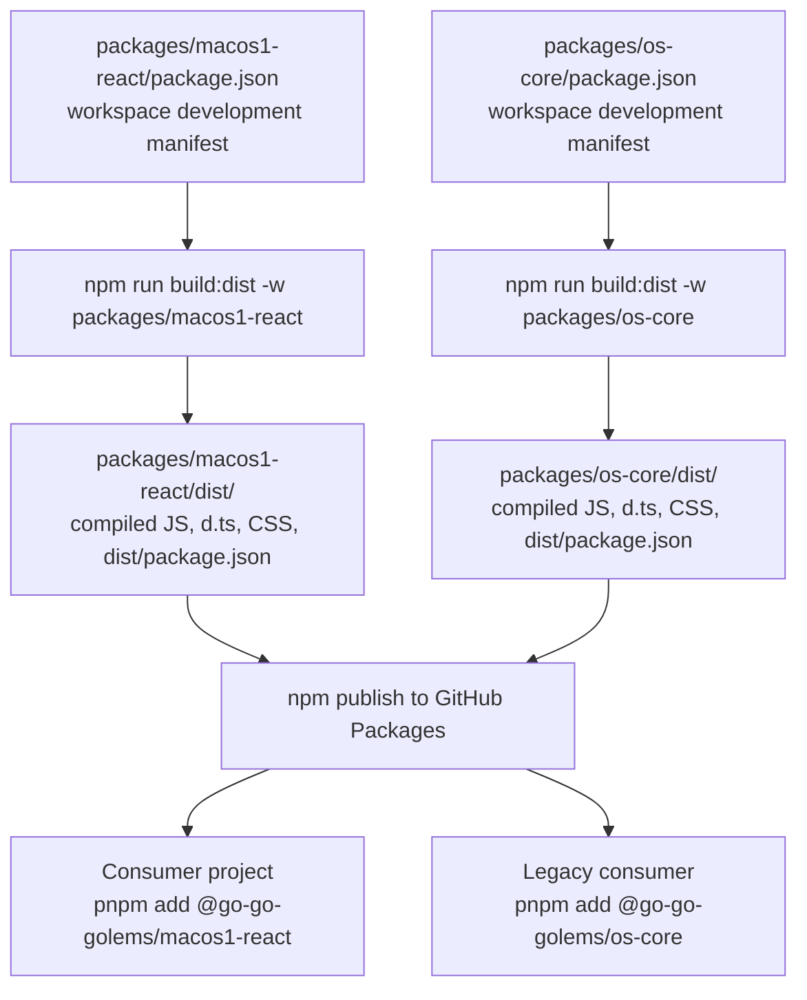

# Publishing and Consuming macos1-react and os-core from go-go-os-frontend

This note explains how package publishing works in the `go-go-os-frontend` monorepo, why the extracted `@go-go-golems/macos1-react` package is slightly different from a normal single-package npm project, how the existing GitHub Packages publishing flow works, and how a new project should install and import these packages.

The intended reader is an intern or junior engineer who already knows basic npm usage but does not yet have a good mental model for monorepo publishing, generated `dist/` manifests, workspace dependency rewriting, GitHub Packages authentication, or compatibility-facade package design.

> [!summary]
> - In this repo, packages are not published directly from `packages/*`; they are published from generated `dist/` directories.
> - `build:dist` is the important step: it compiles TypeScript, copies CSS/assets, and creates a publishable `dist/package.json`.
> - `@go-go-golems/macos1-react` should be published before, or together with, `@go-go-golems/os-core`, because `os-core` now depends on it.
> - New projects should generally import `@go-go-golems/macos1-react` directly. Existing projects can keep importing `@go-go-golems/os-core` through the compatibility facade.
> - GitHub Packages authentication and registry configuration are required both for publishing and for consuming scoped packages.

## Why this note exists

The `go-go-os-frontend` repository already had a publishing system for existing packages such as `@go-go-golems/os-core`, `@go-go-golems/os-shell`, and related packages. During the extraction work, a new package was created:

- `@go-go-golems/macos1-react`

This package now owns:

- the `macos1` theme wrapper and CSS
- base widget primitives
- approved richer widget primitives
- presentational shell/windowing components

At the same time, `@go-go-golems/os-core` was turned into a compatibility facade for many of those presentational pieces. That means `os-core` is no longer fully self-contained as a published artifact. It now has a real dependency on `@go-go-golems/macos1-react`.

This changes the release and consumption story in a few important ways:

1. `macos1-react` itself must now be publishable.
2. `os-core` should no longer be published alone without also ensuring that `macos1-react` exists at the same publish version.
3. New consumers should generally use the new package directly, while old consumers keep working through compatibility exports.

## When to use this guide

Use this guide when you need to:

- publish `@go-go-golems/macos1-react`
- publish `@go-go-golems/os-core` after the compatibility-facade refactor
- understand what `build:dist` actually does
- explain why some package manifests point at `src/` while published packages point at `dist/`
- set up a new project to install and use packages from GitHub Packages
- decide whether a new consumer should import `os-core` or `macos1-react`

## Core mental model

The easiest way to understand this repo is to separate three different worlds:

1. **workspace development world**
2. **publish artifact world**
3. **consumer project world**

### 1. Workspace development world

Inside the monorepo, packages often point to source files directly.

Examples:

- `/home/manuel/workspaces/2026-03-02/os-openai-app-server/wesen-os/workspace-links/go-go-os-frontend/packages/os-core/package.json`
- `/home/manuel/workspaces/2026-03-02/os-openai-app-server/wesen-os/workspace-links/go-go-os-frontend/packages/macos1-react/package.json`

In this world:

- TypeScript compilers and Vite often consume `src/...`
- workspace dependencies may be written as `workspace:*`
- local package aliases may point at package source directories
- `private: true` may appear even though a publishable artifact is still produced later

This is the world optimized for local development, refactoring, and monorepo ergonomics.

### 2. Publish artifact world

This repo does **not** publish raw source packages directly. Instead, it builds a publishable `dist/` directory for each package.

That `dist/` directory contains:

- compiled `.js`
- generated `.d.ts`
- copied `.css`
- copied static assets
- generated `dist/package.json`
- copied `README.md` when present

This is the world npm actually sees.

### 3. Consumer project world

A downstream project installing packages from GitHub Packages does **not** know anything about your monorepo aliases, `workspace:*`, or source layout.

It only sees a normal published package with:

- a package name
- a version
- normal dependencies
- normal `exports`
- files inside the published tarball

That means your publishing system must convert the workspace-friendly source package into a normal published package.

## Architecture diagram



## The key repo files

These files define the publishing system or are important to understanding it:

### Root scripts

- `/home/manuel/workspaces/2026-03-02/os-openai-app-server/wesen-os/workspace-links/go-go-os-frontend/package.json`
- `/home/manuel/workspaces/2026-03-02/os-openai-app-server/wesen-os/workspace-links/go-go-os-frontend/scripts/packages/build-dist.mjs`
- `/home/manuel/workspaces/2026-03-02/os-openai-app-server/wesen-os/workspace-links/go-go-os-frontend/scripts/packages/publish-github-package.mjs`
- `/home/manuel/workspaces/2026-03-02/os-openai-app-server/wesen-os/workspace-links/go-go-os-frontend/scripts/packages/publish-github-package-set.mjs`
- `/home/manuel/workspaces/2026-03-02/os-openai-app-server/wesen-os/workspace-links/go-go-os-frontend/scripts/packages/package-sets.mjs`

### CI workflow

- `/home/manuel/workspaces/2026-03-02/os-openai-app-server/wesen-os/workspace-links/go-go-os-frontend/.github/workflows/publish-github-package-canary.yml`

### Relevant package manifests

- `/home/manuel/workspaces/2026-03-02/os-openai-app-server/wesen-os/workspace-links/go-go-os-frontend/packages/macos1-react/package.json`
- `/home/manuel/workspaces/2026-03-02/os-openai-app-server/wesen-os/workspace-links/go-go-os-frontend/packages/os-core/package.json`

## Understanding the package manifests

### Source manifest versus publish manifest

One of the most confusing things for newcomers is that the package manifest you edit is not always the package manifest that gets published.

For example, the source manifest for `os-core` still contains things like:

- `private: true`
- `exports` pointing to `./src/...`
- `main: "src/index.ts"`
- `types: "src/index.ts"`
- dependency on `"@go-go-golems/macos1-react": "workspace:*"`

A newcomer might think:

> "This cannot possibly be a publishable npm package. It points at TypeScript source files."

That is true for the source manifest.

But the repo solves this by generating a **different manifest in `dist/package.json`** during `build:dist`.

### Why this is done

This pattern is useful because the source manifest is optimized for:

- local TypeScript builds
- Storybook and Vite workspace development
- intra-monorepo imports
- source-level debugging

while the publish manifest is optimized for:

- actual package consumers
- real JS file targets
- real type file targets
- concrete dependency versions

## What `build:dist` really does

The most important script in this entire publishing story is:

- `scripts/packages/build-dist.mjs`

Conceptually, it does roughly this:

```text
1. delete old dist/
2. run TypeScript build into dist/
3. copy CSS and other publishable assets into dist/
4. generate dist/package.json
5. rewrite exports/main/types to point at dist outputs
6. rewrite workspace dependencies to actual versions
7. copy README if present
```

### Why this matters

Without this step, publishing would fail or produce broken packages because:

- consumers cannot use your raw TypeScript source layout reliably
- `workspace:*` is not a normal external dependency version
- CSS and other assets need to be copied into the published package
- `exports` must point to actual `.js` and `.d.ts` files

## Publishing flow in this repo

There are two main publishing styles already supported by the repo:

1. **local/scripted publishing**
2. **GitHub Actions canary publishing**

## Local publishing flow

This is useful when:

- you want to test a package locally
- you want to dry-run a publish
- you want to publish one or two packages manually
- you want to understand the mechanics before using CI

### Step 1: build the publish artifact

From the repo root:

```bash
cd /home/manuel/workspaces/2026-03-02/os-openai-app-server/wesen-os/workspace-links/go-go-os-frontend

npm run build:dist -w packages/macos1-react
npm run build:dist -w packages/os-core
```

This produces:

- `packages/macos1-react/dist/...`
- `packages/os-core/dist/...`

### Step 2: dry-run the publish

Use the repo's publish helper:

```bash
NODE_AUTH_TOKEN=YOUR_GITHUB_PACKAGES_TOKEN \
node scripts/packages/publish-github-package.mjs packages/macos1-react --tag canary --version-suffix canary.1 --dry-run
```

Then, for `os-core`:

```bash
NODE_AUTH_TOKEN=YOUR_GITHUB_PACKAGES_TOKEN \
node scripts/packages/publish-github-package.mjs packages/os-core --tag canary --version-suffix canary.1 --dry-run
```

### Step 3: real publish

When the dry run looks correct:

```bash
NODE_AUTH_TOKEN=YOUR_GITHUB_PACKAGES_TOKEN \
node scripts/packages/publish-github-package.mjs packages/macos1-react --tag canary --version-suffix canary.1

NODE_AUTH_TOKEN=YOUR_GITHUB_PACKAGES_TOKEN \
node scripts/packages/publish-github-package.mjs packages/os-core --tag canary --version-suffix canary.1
```

## What the publish script actually does

The helper script:

- reads `dist/package.json`
- optionally adds a version suffix like `-canary.1`
- rewrites internal workspace package dependency versions to that publish version
- runs `npm publish` from the package's `dist/` directory

That means the real publish target is **not** `packages/macos1-react/`; it is:

- `packages/macos1-react/dist/`

and likewise for `os-core`.

## GitHub Actions canary flow

The repo already includes a canary publishing workflow:

- `.github/workflows/publish-github-package-canary.yml`

This workflow does the following:

1. checks out the repo
2. installs dependencies
3. resolves a package set
4. typechecks the selected packages
5. runs tests where present
6. runs `build:dist`
7. runs a pack-smoke check
8. publishes to GitHub Packages

### Important concept: package sets

The workflow does not publish arbitrary packages one by one. Instead, it publishes named sets defined in:

- `scripts/packages/package-sets.mjs`

At the time of writing, those sets include things like:

- `os-core`
- `os-shell-stack`
- `os-inventory-stack`

### Current important caveat

Because `os-core` now depends on `macos1-react`, the package-set definitions should be updated so that `macos1-react` is included before `os-core`.

The simplest fix is to change the `os-core` set from roughly:

```js
'os-core': ['packages/os-core']
```

to:

```js
'os-core': ['packages/macos1-react', 'packages/os-core']
```

And likewise include `macos1-react` in larger publish sets that contain `os-core`.

### Why this matters

If CI publishes `os-core` but does not publish `macos1-react`, the published `os-core` package may point at a dependency version that consumers cannot actually fetch.

## Why `macos1-react` and `os-core` should publish together

This is one of the most important release rules after the extraction.

`os-core` now depends on:

- `@go-go-golems/macos1-react`

Therefore:

- `os-core` should no longer be treated as a standalone release artifact
- `macos1-react` should be published first, or in the same publish run
- both should usually share the same publish version or version suffix

### Recommended rule

If you publish:

- `@go-go-golems/macos1-react@0.1.0-canary.7`

then you should also publish:

- `@go-go-golems/os-core@0.1.0-canary.7`

This keeps the dependency graph coherent.

## Versioning concepts

### You cannot publish the same version twice

npm registries, including GitHub Packages, do not let you overwrite an already published version.

So if `0.1.0` is already published, you must either:

- bump the base version to `0.1.1` or `0.2.0`, or
- publish a prerelease/canary version like `0.1.0-canary.1`

### What `--version-suffix` does

The repo's publish helper supports:

- `--version-suffix canary.1`

If the base version is `0.1.0`, this becomes:

- `0.1.0-canary.1`

If the base version already had a prerelease component, the suffix is appended in a compatible way.

### What `--tag` does

The npm dist-tag is separate from the semver version.

Examples:

- `--tag latest`
- `--tag canary`

This controls what a user gets when they install with or without an explicit tag.

For example:

```bash
pnpm add @go-go-golems/macos1-react@canary
```

asks npm for the version currently assigned to the `canary` dist-tag.

## Authentication and registry configuration

These packages use:

```json
"publishConfig": {
  "registry": "https://npm.pkg.github.com"
}
```

That means they are published to **GitHub Packages**, not the public npm registry.

### Publishing auth

For local publishing, you need an auth token with package publishing rights.

The simplest pattern is:

```bash
export NODE_AUTH_TOKEN=YOUR_GITHUB_PACKAGES_TOKEN
```

or inline:

```bash
NODE_AUTH_TOKEN=YOUR_GITHUB_PACKAGES_TOKEN node scripts/packages/publish-github-package.mjs ...
```

### CI auth

The GitHub Actions workflow already uses:

- `secrets.GITHUB_TOKEN`
- `packages: write`

so CI publishing is already set up in the normal GitHub Packages style.

## How consumers install these packages

A downstream project must know that the `@go-go-golems` scope lives on GitHub Packages.

### `.npmrc` for a consumer project

A typical consumer `.npmrc` should contain something like:

```ini
@go-go-golems:registry=https://npm.pkg.github.com
//npm.pkg.github.com/:_authToken=${GITHUB_PACKAGES_TOKEN}
always-auth=true
```

This tells the package manager:

- packages under the `@go-go-golems` scope come from GitHub Packages
- authenticate using the provided token

### Install examples

For new projects that should use the extracted UI package directly:

```bash
pnpm add @go-go-golems/macos1-react
```

For an existing project that still wants the compatibility facade:

```bash
pnpm add @go-go-golems/os-core
```

## Which package should new projects use?

### Recommendation

For **new** projects, prefer:

- `@go-go-golems/macos1-react`

For **existing** projects that already depend on runtime/stateful desktop APIs, keep using:

- `@go-go-golems/os-core`

### Why

`macos1-react` is now the canonical owner of:

- theme wrapper
- theme CSS
- base primitives
- richer approved primitives
- presentational shell components

`os-core` still owns:

- runtime/controller desktop logic
- Redux/state helpers
- notifications slice and related state
- windowing orchestration logic
- compatibility exports for older consumers

So new UI consumers should usually talk to the new package directly.

## How to import `macos1-react` in a new project

### 1. Import the theme CSS side effects

```ts
import '@go-go-golems/macos1-react/theme';
```

This loads the package CSS, including:

- token definitions
- primitive styles
- shell styles
- theme overlays
- compatibility selectors

### 2. Wrap your UI in `Macos1Theme`

```tsx
import { Macos1Theme } from '@go-go-golems/macos1-react';
```

Example:

```tsx
import '@go-go-golems/macos1-react/theme';
import { Macos1Theme } from '@go-go-golems/macos1-react';
import { Btn, Checkbox } from '@go-go-golems/macos1-react/primitives';

export function App() {
  return (
    <Macos1Theme theme="theme-macos1">
      <div style={{ padding: 16 }}>
        <Btn>Save</Btn>
        <Checkbox label="Enable feature" checked={true} onChange={() => {}} />
      </div>
    </Macos1Theme>
  );
}
```

### Why the wrapper matters

The theme wrapper renders:

- `data-widget="macos1"`

which is the scope root required by the package CSS.

Without this wrapper, you may have successfully installed the package but still see unstyled components.

### 3. Use subpath imports for feature groups

Recommended import patterns:

```ts
import { Macos1Theme, PARTS } from '@go-go-golems/macos1-react';
import { Btn, Checkbox, ContextMenu } from '@go-go-golems/macos1-react/primitives';
import { WindowLayer, DesktopMenuBar } from '@go-go-golems/macos1-react/shell';
```

This is clearer and more future-proof than trying to expose every component from the top-level package entry.

## How compatibility imports work for older projects

Older consumers can still do things like:

```ts
import '@go-go-golems/os-core/theme';
import { Btn, Checkbox, ContextMenu } from '@go-go-golems/os-core';
import { WindowLayer } from '@go-go-golems/os-core/desktop-react';
```

After the compatibility refactor, these import paths continue to work because `os-core` now re-exports or delegates many presentational pieces to `macos1-react`.

That means an older project does not need a big-bang migration just to stay functional.

## Publish sequence recommended for interns

If you are asked to publish this safely, follow this exact sequence.

### Phase 1: sanity-check code state

Run from repo root:

```bash
npm run build:dist -w packages/macos1-react
npm run build:dist -w packages/os-core
npm run typecheck -w packages/macos1-react
npm run typecheck -w packages/os-core
```

If you are doing a wider publish set, run the relevant package tests too.

### Phase 2: verify publish package set wiring

Before using CI canary publishing, confirm that:

- `scripts/packages/package-sets.mjs` includes `packages/macos1-react` before `packages/os-core`
- any larger publish set that includes `os-core` also includes `macos1-react`

### Phase 3: dry-run local publish

```bash
NODE_AUTH_TOKEN=YOUR_GITHUB_PACKAGES_TOKEN \
node scripts/packages/publish-github-package.mjs packages/macos1-react --tag canary --version-suffix canary.1 --dry-run

NODE_AUTH_TOKEN=YOUR_GITHUB_PACKAGES_TOKEN \
node scripts/packages/publish-github-package.mjs packages/os-core --tag canary --version-suffix canary.1 --dry-run
```

Check that:

- the package names are correct
- the publish version is correct
- the publish target is `dist/`
- the dependency graph makes sense

### Phase 4: real publish

```bash
NODE_AUTH_TOKEN=YOUR_GITHUB_PACKAGES_TOKEN \
node scripts/packages/publish-github-package.mjs packages/macos1-react --tag canary --version-suffix canary.1

NODE_AUTH_TOKEN=YOUR_GITHUB_PACKAGES_TOKEN \
node scripts/packages/publish-github-package.mjs packages/os-core --tag canary --version-suffix canary.1
```

### Phase 5: consume from a fresh project

In a separate test project:

1. add `.npmrc` for the `@go-go-golems` scope
2. install the new version
3. import the package
4. verify CSS and components actually render

## Consumer validation checklist

For `macos1-react`:

- `import '@go-go-golems/macos1-react/theme'` resolves
- `Macos1Theme` renders `data-widget="macos1"`
- primitives render with CSS
- shell components render with CSS

For `os-core` compatibility:

- `import '@go-go-golems/os-core/theme'` resolves
- `Btn`, `Checkbox`, `ContextMenu` resolve from `@go-go-golems/os-core`
- shell components resolve from `@go-go-golems/os-core/desktop-react`
- CSS still flows through the facade

## Common failure modes

### Failure mode 1: publishing `os-core` without `macos1-react`

Symptom:

- consumer install fails or resolves a missing dependency version

Cause:

- `os-core` now has a real dependency on `macos1-react`

Fix:

- publish `macos1-react` first or publish them together in one set

### Failure mode 2: forgetting `build:dist`

Symptom:

- package publishes broken metadata
- exports point at wrong files
- CSS/assets are missing

Cause:

- tried to treat the source manifest like a publish manifest

Fix:

- always run `build:dist` before publishing

### Failure mode 3: CSS loads in the monorepo but not in a consumer app

Symptom:

- components render but are unstyled

Common causes:

- forgot `import '@go-go-golems/macos1-react/theme'`
- forgot to wrap UI in `Macos1Theme`
- consumer bundler does not include CSS side effects correctly

Fix:

- ensure both the CSS import and theme wrapper exist
- verify the consumer bundler respects package CSS side effects

### Failure mode 4: wrong registry configuration

Symptom:

- install fails with 404 or auth errors

Cause:

- consumer project does not know that `@go-go-golems/*` comes from GitHub Packages

Fix:

- add the proper scoped `.npmrc` configuration

### Failure mode 5: trying to republish the same version

Symptom:

- npm publish fails saying the version already exists

Cause:

- package versions are immutable in the registry

Fix:

- bump the version or use a new canary suffix

## Anti-patterns

Avoid these mistakes:

- publishing `packages/macos1-react` directly instead of `packages/macos1-react/dist`
- assuming `private: true` in the source manifest means the package can never be published in this repo
- publishing `os-core` alone after the extraction
- telling new consumers to use `os-core` for presentational UI when `macos1-react` is the canonical new package
- forgetting to document the registry setup for GitHub Packages

## Recommended implementation sequence for maintainers

If the goal is to make this publishing story fully polished, the next maintenance sequence should be:

1. update `scripts/packages/package-sets.mjs` so `macos1-react` is included before `os-core`
2. optionally add a dedicated package-set name for `macos1-react + os-core`
3. dry-run the GitHub Actions canary workflow
4. publish a canary pair of versions
5. test installation in a clean external project
6. document the recommended import path for new projects as `macos1-react`

## Working rules

These are the practical rules an intern should remember.

1. **Do not publish raw source packages.** Publish from `dist/`.
2. **Always run `build:dist` first.**
3. **Treat `macos1-react` and `os-core` as a pair.**
4. **Prefer direct imports from `macos1-react` for new UI projects.**
5. **Use `os-core` for compatibility or runtime/controller needs.**
6. **Never assume monorepo alias behavior exists in external consumers.**
7. **If CSS seems missing, check theme import and theme wrapper first.**
8. **If publish fails, check version reuse and registry auth before changing code.**

## Pseudocode: how the publish system should be thought about

```text
for each package we want to release:
    build a clean dist/ artifact
    generate a publish manifest in dist/package.json
    rewrite workspace dependencies to real versions
    optionally add prerelease suffix
    publish dist/ to GitHub Packages

if os-core depends on macos1-react:
    publish macos1-react first
    then publish os-core with same version suffix
```

## Example new-project import patterns

### Direct `macos1-react` usage

```tsx
import '@go-go-golems/macos1-react/theme';
import { Macos1Theme } from '@go-go-golems/macos1-react';
import { Btn, Checkbox } from '@go-go-golems/macos1-react/primitives';

export function App() {
  return (
    <Macos1Theme theme="theme-macos1">
      <div style={{ padding: 24 }}>
        <Btn>Launch</Btn>
        <Checkbox label="Show advanced options" checked={false} onChange={() => {}} />
      </div>
    </Macos1Theme>
  );
}
```

### Compatibility `os-core` usage

```tsx
import '@go-go-golems/os-core/theme';
import { Btn, Checkbox } from '@go-go-golems/os-core';
import { WindowLayer } from '@go-go-golems/os-core/desktop-react';
```

Use the compatibility form only if the project already depends on `os-core` semantics or needs local runtime/controller APIs from that package.

## Final recommendation

For new work, think of the package world like this:

- `@go-go-golems/macos1-react` is the **real presentational package**
- `@go-go-golems/os-core` is the **compatibility and runtime package**

That framing makes most decisions easier:

- publish `macos1-react` whenever you publish `os-core`
- teach new consumers `macos1-react`
- let old consumers keep working through `os-core`

## Related notes

- [[Playbook: Self-Contained Go/Wasm + JavaScript Browser Applications]]
