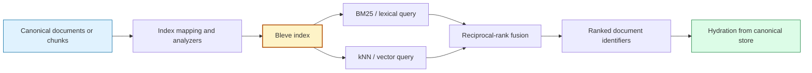
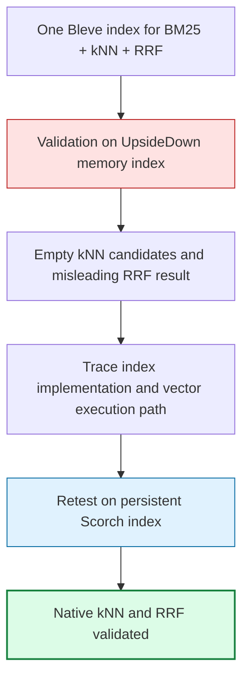

# Bleve — Full-Text, Vector, and Hybrid Search in Go

Bleve is a Go search library used across this vault for full-text retrieval,
BM25 ranking, persisted search indexes, vector search through FAISS, and hybrid
lexical-semantic retrieval. The reports gathered here cover more than the
library API. They record how Bleve behaves as a derived index, how its index
type affects available query modes, how native vector dependencies are built,
how it is exposed to JavaScript, and how malformed persisted postings must be
handled.

This MOC is organized by engineering concern rather than by project or date.
Several reports describe application repositories rather than the upstream
Bleve repository, but each contributes direct implementation or operational
evidence about Bleve.

> [!summary]
> - **Lexical search:** Bleve provides field-aware indexing and BM25 retrieval
>   while an application database or source corpus remains canonical.
> - **Vector search:** Bleve's vector path requires Scorch, the `vectors` build
>   tag, CGO, and a compatible Bleve-maintained FAISS build.
> - **Hybrid retrieval:** lexical and vector candidates can be combined through
>   native reciprocal-rank fusion, but index type and IVF probe configuration
>   must be validated empirically.
> - **Artifact custody:** persisted indexes are derived, versioned artifacts.
>   They must be rebuildable and their compressed postings must fail with
>   errors rather than process panics when damaged.

## Core system model

An application should distinguish canonical records from the index that makes
those records searchable. Bleve stores analyzed fields, term dictionaries,
postings, and optional vectors. It does not replace the application's source
of truth.



This separation produces three practical rules:

- index mappings, analyzers, vector dimensions, and backend versions are part
  of the artifact identity;
- search results should carry stable source identifiers so the application can
  hydrate canonical records;
- a local index may be deleted and rebuilt without repeating expensive
  ingestion or embedding work when those inputs are retained independently.

## Recommended reading path

1. Start with the Readwise Viewer port for the smallest complete BM25 lifecycle.
2. Read the RAG Evaluation retrieval foundation for BM25, exact vector search,
   and application-level RRF over one corpus.
3. Read the FAISS build report and playbook before enabling Bleve vector fields.
4. Read the two Transcript RAG Bleve reports together. The July 9 report
   records the failed experiment; the July 13 report identifies the invalid
   test configuration and supersedes its retrieval conclusion.
5. Read the Zapx report for persisted-index corruption, defensive decoding, and
   rebuild procedures.

## Lexical indexes and application lifecycle

- [[ARTICLE - Readwise Viewer Bleve Search Port]] — the clearest small-system
  account of treating SQLite as canonical and Bleve as a disposable BM25
  projection. It covers field boosts, normalization, batch rebuilding,
  identifier hydration, API reuse, and removal of a parallel FTS5 path.

- [[ARTICLE - RAG Evaluation System - Search Retrieval Foundation Deep Dive]] —
  establishes BM25 over persisted chunks, query-vector search over retained
  embeddings, and reciprocal-rank fusion. It is useful for understanding where
  Bleve ends and the larger retrieval pipeline begins.

- [[ARTICLE - Publish Vault Memory Architecture - Reload-Safe Persistent Search Indexes]]
  — production evidence for moving an in-memory Bleve index to persistent
  per-snapshot directories. It explains reload-time heap duplication, atomic
  snapshot publication, stale-index cleanup, and memory measurements from the
  deployed service.

## Native vector search and FAISS

- [[ARTICLE - Building FAISS for Bleve Vector Search]] — detailed source build
  and linker investigation for Bleve's FAISS-backed vector support. It records
  the `vectors` build tag, Bleve-maintained FAISS fork, C/C++ shared libraries,
  CGO flags, runtime linker requirements, and a validated KNN experiment.

- [[Research/playbooks/bleve-faiss-vector-search|Playbook - Building Bleve-compatible FAISS for vector search]]
  — current procedural checklist for reproducing the compatible FAISS
  installation without replacing unrelated system libraries.

- [[PROJECT REPORT - Transcript RAG - Final Hybrid Architecture and IVF Probe Auto-Tune]]
  — explains application-level tuning of FAISS IVF probe parameters and the
  resulting recall-latency operating point.

Vector support has a stricter runtime contract than ordinary lexical search:

```text
Bleve vector query is available only when:
    binary was built with -tags=vectors
    AND compatible FAISS libraries are present
    AND index implementation is Scorch
    AND indexed/query vectors have the declared dimension
    AND ANN probe parameters are suitable for the corpus
```

## Hybrid retrieval and corrected experimental evidence

- [[PROJECT REPORT - Transcript RAG Bleve - Hybrid Search, Empirical Findings, and the Corrected Architecture]]
  — a valuable negative experiment, but not the current architectural
  conclusion. Tests against an UpsideDown memory index produced empty vector
  candidates, apparent near-zero kNN recall, and an apparent failure of native
  RRF union. Preserve this report because it shows the evidence and the
  incorrect assumption that generated it.

- [[PROJECT REPORT - Transcript RAG Bleve - goja-bleve 0.0.6 and the Native RRF Restoration]]
  — the authoritative correction. Re-testing with a persistent Scorch index
  produced 100% kNN recall in the fixture and a true lexical-union-semantic RRF
  result. `goja-bleve` 0.0.6 also made its memory index use Scorch and exposed
  IVF probe controls.

The two reports should be read as one empirical sequence:



The durable lesson is not that memory indexes are generally invalid. It is that
the selected index implementation must support the feature being measured.
Benchmark fixtures must exercise the same backend class as production.

## JavaScript and xgoja integration

- [[goja-bleve]] — dedicated project map for the native JavaScript binding and
  its application reports.

- [[ARTICLE - Goja Bleve - Native Search Bindings for JavaScript RAG Pipelines]]
  — explains how JavaScript receives fluent builders while Go retains typed
  mappings, queries, batches, indexes, and search requests through hidden native
  references.

- [[ARTICLE - Goja Bleve - Shipping a Vector RAG Runtime with xgoja]] — covers
  generated host composition, build-time linker environment, jsverb command
  design, reopened vector-index mappings, explicit zero-valued sizes, and
  single-use batch behavior.

These reports are the right place to study the binding boundary. The current
MOC remains focused on Bleve's indexing, retrieval, and operational contracts.

## Persistence, corruption, and defensive decoding

- [[PROJECT REPORT - Zapx - Defensive Varint Decoding for Corrupt Bleve Postings]]
  — corpus-level diagnosis of one malformed `goja` posting in a 44,738-record
  index. It narrows the failure to a truncated Zapx varint, adds an in-loop
  bounds check returning `io.ErrUnexpectedEOF`, retains the corrupt artifact,
  and rebuilds a healthy index with zero provider calls.

The report establishes two separate facts:

```text
fixed:
    corrupt encoded input no longer causes a process panic

not established:
    which writer, publication, or storage event truncated the original segment
```

An index manifest can validate identity and declared counts without proving
that every compressed posting is decodable. Systems that depend on persisted
Bleve indexes should therefore retain canonical inputs, publish indexes
immutably, surface corruption errors, and support deterministic rebuilding.

## Other application evidence

- [[PROJECT REPORT - Transcript RAG Workbench - Durable Retrieval, Embedded UI, and Private Evaluation]]
  — useful context for corpus identity, embedding generations, and isolated
  retrieval evaluation, although its main store is SQLite rather than Bleve.

- [[ARTICLE - Transcript RAG Summarization - Multi-Representation Retrieval and Local Structured Generation]]
  — shows how multiple text representations affect the records supplied to a
  hybrid search backend.

- [[ARTICLE - rag-ttc - Architecture of a Reproducible Go RAG Evaluation System]]
  — places Bleve behind a small lexical-index interface alongside exact vector
  search, fusion, caching, and experiment artifact custody.

## Upstream source map

The analyzed upstream checkout is Bleve `v2.6.0` at
`d8f2ab9a11166223bc4997143efda40ec98045e7`.

| Concern | Upstream location |
|---|---|
| Public index and query APIs | `index.go`, `query.go`, `search.go` |
| Index mappings and analyzers | `mapping/`, `analysis/` |
| Search queries and collectors | `search/query/`, `search/collector/` |
| Scorch index implementation | `index/scorch/` |
| Vector query integration | vector-tagged Scorch and search code |
| Persisted segment encoding | `github.com/blevesearch/zapx/v17` |
| FAISS bridge | `github.com/blevesearch/go-faiss` |

Application-specific mappings, identifiers, fusion policy, and hydration do not
belong to upstream Bleve. They remain responsibilities of the calling project.

## Current boundaries and open questions

- The Zapx decoder fix exists on local branch
  `task/memuvarint-truncated-eof` at commit `807a92c`; it has not yet been
  described here as an upstream release.
- The creation mechanism for the retained malformed posting remains unknown.
- FAISS installation and runtime linking remain platform-sensitive and must be
  tested in the exact build and deployment environment.
- ANN recall claims are meaningful only for a named corpus, mapping, index
  implementation, vector model, and probe configuration.
- A successful index open or document-count check is not a complete integrity
  scan of compressed postings.

## Working rules

- Keep canonical records outside Bleve and make the index rebuildable.
- Version mappings, analyzers, dimensions, backend releases, and ANN settings.
- Use Scorch for vector experiments and verify the actual index implementation.
- Measure lexical, vector, and fused rankings separately before interpreting
  the hybrid result.
- Preserve stable identifiers through indexing and hydrate results from the
  canonical store.
- Convert malformed encoded data into explicit errors, never silent values or
  process panics.
- Retain failed immutable artifacts when practical; rebuild into a new
  directory instead of mutating the failed index in place.

## Related project maps

- [[goja-bleve]] — JavaScript bindings and vector RAG runtime.
- [[rag-evaluation-system]] — the original TTC retrieval laboratory.
- [[rag-ttc]] — explicit Go experiments and reproducible artifact custody.
- [[goja-text]] — source-preserving chunking and representation preparation.
- [[geppetto]] — embedding and generation provider configuration.
