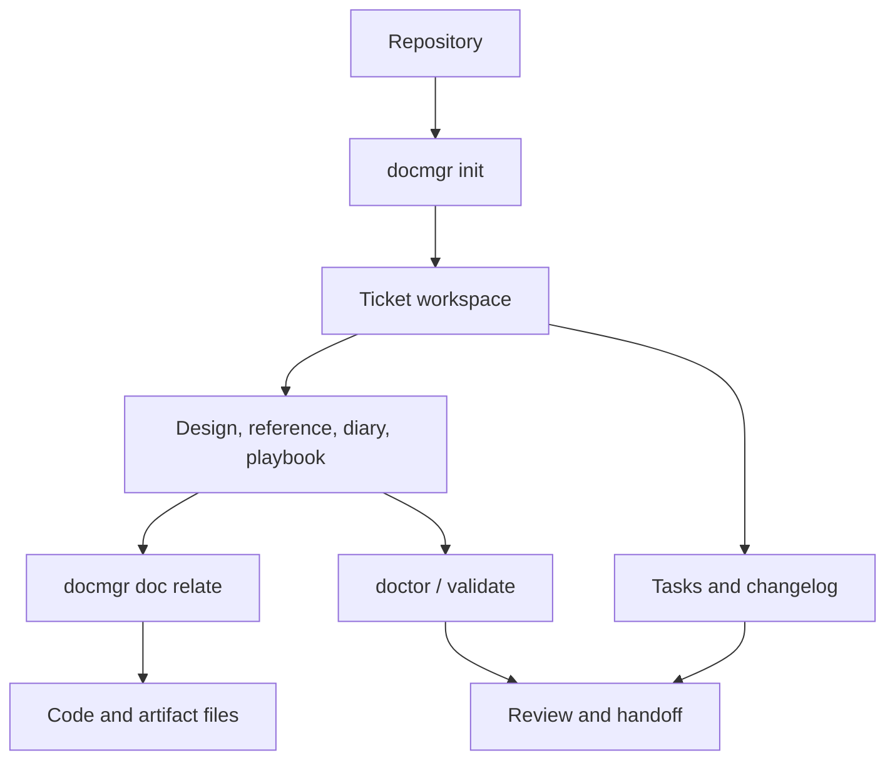

# docmgr — Ticketed Documentation and Research Workspace

`docmgr` is the documentation-management layer used to give engineering work a durable workspace. It organizes tickets, design notes, reference documents, diaries, scripts, tasks, changelogs, metadata, vocabulary, and file relationships under `ttmp/`. The key idea is that implementation and reasoning should remain connected: a ticket explains the work, a diary preserves the path taken, and `docmgr doc relate` links the document back to the code or artifact it describes.

> [!summary]
> - **Workspace discipline:** every investigation gets a bounded ticket directory with predictable document types and scripts.
> - **Bidirectional provenance:** documents relate to source files, and changelogs/tasks preserve why changes happened.
> - **Validation:** frontmatter, vocabulary, document structure, and stale-ticket hygiene are checked by the CLI rather than remembered informally.

## The workflow model



A ticket is more than a folder. It is the unit of scope, chronology, and review. The recommended loop is to create the ticket before implementation, add the design or reference document, keep investigation history in a diary, store scripts under the ticket, relate important files, and update the changelog as work advances.

## Core document roles

- **Index:** the ticket overview, status, links, tasks, and structure.
- **Design document:** problem statement, proposed solution, alternatives, decisions, and open questions.
- **Reference:** stable API contracts, schemas, command references, or implementation facts.
- **Diary:** chronological record of prompts, actions, failures, discoveries, and validation.
- **Playbook:** repeatable command sequence or operational method.
- **Script:** executable investigation or migration helper stored under `scripts/`.
- **Task list and changelog:** explicit progress and durable project history.

Keep these roles distinct. A diary is not a design doc, and a generated report should not become the only record of how evidence was produced.

## Commands and boundaries

```bash
docmgr ticket create-ticket --ticket TICKET-ID --title "Title" --topics topic1,topic2
docmgr doc add --ticket TICKET-ID --doc-type analysis --title "Analysis"
docmgr doc relate --doc ttmp/.../reference/01-analysis.md \
  --file-note "/abs/path/to/file.go:Why this file matters"
docmgr task add --ticket TICKET-ID --text "Implement the first vertical slice"
docmgr changelog update --ticket TICKET-ID \
  --entry "Implemented and validated the first slice" \
  --file-note "/abs/path/to/file.go:Implementation entry point"
docmgr doctor --ticket TICKET-ID --stale-after 30
docmgr validate frontmatter --doc ttmp/.../reference/01-analysis.md --suggest-fixes
```

The `--file-note` format is deliberately `absolute/path:reason`. Relate files to the focused subdocument rather than putting every relationship on `index.md`. Keep the related-file set small enough that it explains the ticket instead of becoming an inventory dump.

## Where to read the surrounding practice

- [[ARTICLE - Docmgrignore - Workspace-Owned Ignore Policy]] — how `.docmgrignore` keeps workspace metadata out of unrelated scans.
- [[ARTICLE - Micro-Context Maps - Extracting Navigable Work Boundaries from Project Diaries]] — extracting compact navigation from ticket history.
- [[ARTICLE - Research Operations - Reproducible Deep Research for Vault OIDC GitHub Integration]] — using ticketed research and evidence in a broader operation.
- [[ARTICLE - Playbook - Phased Scaffolding for Complex Systems]] — staging complex implementation without losing reviewability.
- [[building-knowledge-base]] — turning project material into durable KB entries.
- [[creating-mocs]] — creating the MOCs that map ticket and project reports after they accumulate.
- [[researchctl]] — a related tool whose research graph and evidence workflow follows similar explicit-boundary principles.

## Common failure modes

- Creating code before the ticket has a stated question or acceptance boundary.
- Putting temporary scripts in the repository root instead of the ticket's `scripts/` directory.
- Using `docmgr relate` instead of the correct `docmgr doc relate` command.
- Passing a relative or unquoted `--file-note`, making provenance ambiguous.
- Treating generated ticket metadata as application documents during recursive scans.
- Updating code without updating the diary or changelog, leaving the implementation path unrecoverable.
- Letting vocabulary drift make valid documents appear invalid, or weakening validation instead of fixing the vocabulary.

## Repository map

Repository: `/home/manuel/code/wesen/go-go-golems/docmgr`

| Concern | Location |
|---|---|
| CLI commands | `cmd/` |
| Document and ticket operations | repository command packages |
| Templates | `ttmp/_templates/` |
| Guidelines | `ttmp/_guidelines/` |
| Vocabulary | `ttmp/vocabulary.yaml` |
| Workspace configuration | `.ttmp.yaml` |

## Working rules

- Create the ticket before the work becomes difficult to reconstruct.
- Read the diary before resuming an active ticket.
- Relate code and material evidence with absolute paths and reasons.
- Record failures verbatim instead of rewriting history after the fix.
- Keep generated views rebuildable and hand-authored reasoning explicit.
- Validate before handoff and stage only intended ticket or code files.
