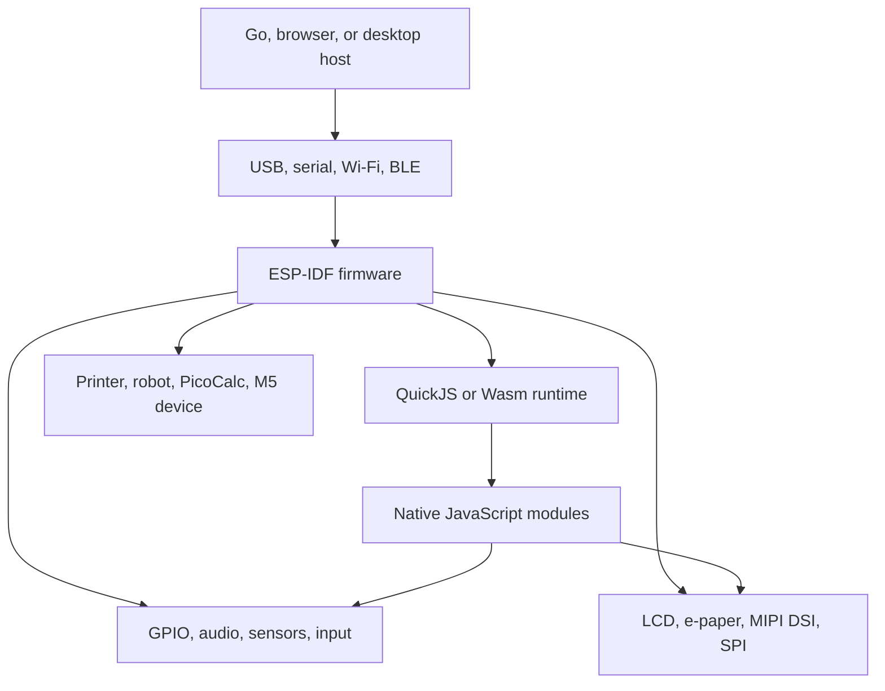

# ESP32 Projects — Firmware, Displays, Connectivity, and Embedded JavaScript

This map gathers the ESP32 and M5Stack work across the vault: ESP-IDF bring-up, GPIO and LED experiments, Wi-Fi and Bluetooth, audio, displays, e-paper, thermal printers, PicoCalc, M5Dial, embedded JavaScript, and Wasm/QuickJS investigations. The projects are varied, but they share one practical concern: turn incomplete hardware documentation and fragile device behavior into small, testable firmware stages with observable boundaries.

> [!summary]
> - **Bring-up first:** establish power, transport, console, GPIO, and display assumptions before building features.
> - **Device pipeline:** firmware often bridges browser/host input, network or serial transport, rendering, and physical output.
> - **Runtime experiments:** ESP32-P4 and ESP32-S3 work explore QuickJS, Wasm, native modules, and host-testable embedded APIs.

## Platform map

Read this map by device and pipeline rather than by date. The oldest PaperS3 and Cardputer reports establish hardware bring-up habits; the ESP32-S3 printer and provisioning work establishes connectivity and transport patterns; the ESP32-P4 work extends those patterns into display pipelines and embedded runtimes.

## Bring-up and firmware foundations

- [[PROJ - PaperS3 Firmware - Setup and Build Workflow]] — firmware build and device setup.
- [[PROJ - M5 Tab5 - Getting Acquainted]] — initial hardware orientation.
- [[ARTICLE - M5 Tab5 - Reference Firmware and Hardware Docs Onboarding]] — reference firmware and documentation method.
- [[Research/KB/Tribal/esp-idf-firmware-patterns]] — recurring ESP-IDF firmware patterns.
- [[Research/KB/On-Ramp/esp-idf-console-repl-bring-up]] — console and REPL orientation.
- [[ARTICLE - M5 Tab5 - Display Bring-Up Failure and Display Architecture]] — display initialization and failure analysis.

## GPIO, LEDs, input, and small device experiments

- [[PROJ - Cardputer ADV Animation UI - Experimental Minimap Firmware]] — Cardputer UI and animation.
- [[ARTICLE - M5StackChan - Building and Deploying a Custom App on Real Hardware]] — deploying a custom app to a real device.
- [[ARTICLE - M5StackChan - Deep Dive Technical Analysis of a Kawaii Desktop Robot Platform]] — platform architecture.
- [[ARTICLE - M5StackChan - Measuring Draw Performance and Display Pipeline Limits]] — display performance.
- [[ARTICLE - PicoCalc Keyboard Reset and I2C Recovery - ESP32-P4 Host Investigation]] — input bus and recovery investigation.

## Wi-Fi, Bluetooth, and provisioning

- [[PROJ - Cardputer Web Demo - Bluetooth Architecture And Bringup]] — browser/device Bluetooth architecture.
- [[PROJ - Cardputer Web Serial Demo - Architecture And Build]] — Web Serial transport.
- [[PROJ - Cardputer Web Serial Demo - Technical Project Report]] — end-to-end web serial report.
- [[ARTICLE - ATOMS3R BLE Provisioning Firmware Analysis]] — firmware protocol analysis.
- [[ARTICLE - ATOMS3R BLE Provisioning Firmware Implementation Guide]] — implementation sequence.
- [[ARTICLE - ATOMS3R BLE Provisioning - Project Report]] — project-level result.
- [[ARTICLE - BLE WiFi Provisioning with ESP32 - User Developer Guide]] — reusable provisioning workflow.
- [[ARTICLE - ESP32 WiFi Architecture Comparison - ESP-Hosted vs Native WiFi Measured HTTP Throughput]] — transport architecture comparison.
- [[ARTICLE - WiFi Throughput Benchmark on ESP32-P4 with ESP-Hosted - Measured Results and Bottleneck Analysis]] — measured bottlenecks.
- [[ARTICLE - Optimizing WiFi Image Upload on ESP32-P4 - From 6 Seconds to Sub-Second]] — applied network optimization.

## Displays, e-paper, and rendering pipelines

- [[PROJ - PaperS3 E-Reader - Interactive Book Reader on E-Ink]] — e-ink reader architecture.
- [[PROJ - PaperS3 WAMR Debugging - Embedded Wasm Root Cause]] — Wasm and e-paper debugging.
- [[ARTICLE - PaperS3 EPD Qualification - What Software Success Did Not Prove]] — hardware qualification limits.
- [[Research/KB/On-Ramp/e-ink-display-driving]] — e-ink display fundamentals.
- [[ARTICLE - ESP32-P4 MIPI DSI Image Blitter - Browser-to-Display Pipeline on the M5Stack Tab5]] — browser-to-display data path.
- [[ARTICLE - ESP32-P4 PicoCalc Display Optimization - Queued SPI and Dirty Rectangles]] — display scheduling and dirty regions.
- [[ARTICLE - M5Dial Dithered 3D Scene Viewer - Software Rendering on ESP32-S3]] — software rendering.
- [[ARTICLE - M5Dial Proper 3D Renderer - Building a Z-Buffered Planet and Terrain on ESP32-S3]] — depth-buffered rendering.
- [[Research/KB/Tribal/browser-side-processing-for-embedded]] — browser/embedded processing boundary.

## Audio and thermal output

- [[PROJ - Wi-Fi Audio Cues Lab - ESP32-S3 Audio Feedback for Wi-Fi Events]] — audio event feedback.
- [[PROJ - Wi-Fi Audio Cues Lab - ESP-IDF Sample for Audio Cues on AtomS3R with Atomic Echo Base]] — audio hardware bring-up.
- [[ARTICLE - ATOM-PRINTER Firmware - Technical Deep Dive]] — printer firmware and transport.
- [[PROJ - SToMS3R - AtomS3R Lite Thermal Printer Firmware]] — thermal printer firmware.
- [[ARTICLE - Deep Research - Thermal Receipt Printer Banding Under Low Serial Feed]] — serial-feed failure analysis.
- [[ARTICLE - Thermal Receipt Printers - K118 Mechanics Commands and Firmware Control]] — printer commands and mechanics.
- [[ARTICLE - Almanach Studio - A Self-Hosted Thermal Almanac Designer for ESP32]] — application and rendering pipeline.
- [[Research/KB/On-Ramp/esc-pos-thermal-printer]] — ESC/POS orientation.
- [[Research/KB/Tribal/serial-protocols-from-go]] — serial transport pattern.

## Embedded JavaScript and Wasm

- [[ARTICLE - Native QuickJS on ESP32-P4 - Removing Wasm from the Firmware Stack]] — native QuickJS tradeoffs.
- [[ARTICLE - QuickJS Wasm on ESP32-P4 - Device Bring-Up and Two WAMR Embedding Crashes]] — Wasm runtime failures.
- [[ARTICLE - QuickJS Wasm on WAMR - Running a JS Engine Inside a Wasm Sandbox]] — embedded Wasm architecture.
- [[PROJ - fastschema qjs on Wazero - From-Source Build and the qjsc Plugin Pipeline]] — build pipeline.
- [[ARTICLE - ESP32-P4 QuickJS Internals - Porting Runtime Ownership and Extension APIs]] — runtime ownership and extensions.
- [[ARTICLE - ESP32-P4 Visual QuickJS REPL - From Engine Bring-Up to PicoCalc Interface]] — interactive embedded runtime.
- [[ARTICLE - ESP32-S3 QuickJS HTTP and Fetch - From Firmware Static Serving to Host-Testable APIs]] — host-testable networking API.
- [[ARTICLE - ESP32-S3 QuickJS HTTP and Fetch - Owner Tasks Promises and Stored Scripts]] — async and stored-script behavior.
- [[ARTICLE - PicoCalc QuickJS DSL - Native and Portable Runtime Deep Dive]] — portable/native DSL boundary.
- [[ARTICLE - QuickJS Native Modules on ESP32-S3 - Implementing Firmware JavaScript Namespaces]] — firmware module namespaces.
- [[Research/KB/On-Ramp/wasm-from-go]] — Wasm orientation.

## Recommended reading path

1. Start with ESP-IDF firmware patterns and one device bring-up report.
2. Choose a transport branch: Web Serial/BLE, Wi-Fi, or provisioning.
3. Choose an output branch: display/e-paper, audio, or thermal printer.
4. Read the relevant performance or failure report before changing the runtime.
5. Read the QuickJS/Wasm branch when the device needs an embedded scripting layer.

## Working rules

- Prove the hardware path in a minimal bring-up before adding application architecture.
- Keep transport, rendering, runtime, and physical-device layers separately observable.
- Record pin maps, board revisions, power assumptions, and reference firmware versions.
- Treat successful software initialization as weaker evidence than physical qualification.
- Keep host-testable APIs where possible, but validate them against the real device boundary.
- Prefer bounded experiments with measured throughput, frame timing, serial feed behavior, and failure artifacts.
- Preserve the exact firmware/build configuration that produced a hardware result.

## Repository map

Primary workspace: `/home/manuel/code/wesen/corporate-headquarters/esp32-s3-m5`

| Concern | Workspace examples |
|---|---|
| ESP32-C6 small experiments | `0042-*` through `0065-*` |
| ESP32-P4/PicoCalc | `0097-esp32-p4-picocalc-bringup`, `0098-esp32-p4-wifi6-webserver`, `0099-esp32-p4-picocalc-display-keyboard` |
| Device firmware and demos | board-specific project directories |
| Vault research | `Projects/` reports and `Research/KB/` entries |

## Boundaries and open questions

- Which platform-specific patterns deserve promotion into new Tribal entries rather than remaining in this map?
- How should the ESP32-P4 QuickJS, display, and Wi-Fi work converge into a reusable runtime profile?
- Which hardware measurements need repeatable fixtures and automated capture before conclusions can be trusted?
