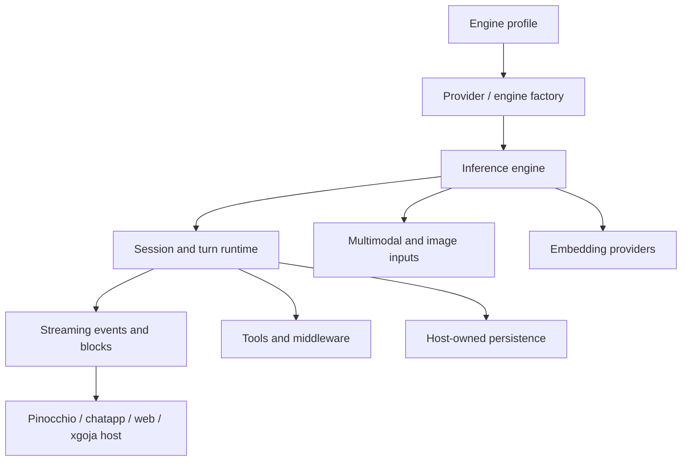

# Geppetto — Go LLM Runtime, Engines, Profiles, and Sessions

Geppetto is the Go runtime layer for model inference, provider engines, engine profiles, streaming events, tools, middleware, embeddings, and JavaScript-facing APIs. It provides the model-facing semantics that applications such as Pinocchio, CoinVault, and generated Goja hosts consume. The important boundary is between **engine configuration** and **runtime behavior**: profiles select a provider and model capability, while sessions, turns, middleware, tools, and events define what an application does with that provider.

> [!summary]
> - **Engine layer:** provider factories, model profiles, OpenAI/chat-completion/Open Responses paths, embeddings, and multimodal inputs.
> - **Session layer:** explicit sessions, turns, blocks, middleware, tools, streaming events, and persistence boundaries.
> - **Host layer:** Go, JavaScript, Pinocchio, xgoja, and chat applications can consume the same runtime contracts.

## Architecture

Geppetto should not own every application concern. Storage, UI projections, host authentication, and transport protocols are intentionally layered around the runtime. This is why a Pinocchio chatapp can change its TUI/RPC transport without redefining provider semantics, and why the JavaScript API can wrap sessions and agents without exposing raw internal state indiscriminately.

## Capability areas

### Engines, profiles, and provider boundaries

- [[loading-pinocchio-geppetto-profiles-for-llm-and-embeddings-inference]] — playbook for loading engine and embedding profiles for LLM and embeddings inference, reusing `geppetto/pkg/cli/bootstrap` (`AppBootstrapConfig`, `ResolveCLIEngineSettings`, `ResolveCLIProfileRuntime`) and `geppetto/pkg/sections`.
- [[PROJ - Geppetto - Opinionated JS APIs and Engine Profiles]] — engine profiles and the opinionated JavaScript surface.
- [[PROJ - Geppetto - Open Responses and Chat Boundary Cutover]] — provider routing and response normalization.
- [[PROJ - Geppetto - OpenAI Responses Image Support]] — multimodal response handling.
- [[PROJ - Geppetto Embedding Profiles - Profile-Backed Vector Search]] — embedding profiles.
- [[ARTICLE - Geppetto Gemini SDK Modernization - Gemini 3 Flash Deep Dive]] — provider modernization.
- [[Research/KB/Tribal/geppetto-engine-config-vs-runtime-behavior]] — the configuration/runtime boundary.

### Sessions, turns, agents, and JavaScript

- [[ARTICLE - Geppetto JS Bindings - Wrapper First Hard Cutover]] — wrapper-first native bindings.
- [[ARTICLE - Geppetto JS Overhaul - Wrapper First Agents Events and Storage Boundaries]] — agents, events, and storage seams.
- [[ARTICLE - Geppetto JS Session API - From Turns to Sessions]] — explicit sessions and continuation semantics.
- [[ARTICLE - Building a Tool-Using Go Chat Agent - Geppetto Goja and Glazed]] — tool-using agent composition.
- [[ARTICLE - From eval_js to Persistent Agent Runtime - Replsession Logging and Streaming Events]] — persistent runtime sessions.
- [[Research/KB/Tribal/session-turn-blocks-chat-applications]] — shared session/turn/block model.

### Streaming, chat, and host integration

- [[PROJ - Scopedjs Runtime and Demo - Geppetto and Pinocchio]] — early runtime/host relationship.
- [[PROJ - CoinVault - RAG Web Chat for Gold Coin Inventory]] — application integration.
- [[ARTICLE - Observer Instrumentation - Geppetto Pinocchio Sessionstream Deep Dive]] — observability across the runtime boundary.
- [[ARTICLE - Canonical Chat Event Protocol - Provider Streams to Browser State]] — provider events to UI state.
- [[ARTICLE - Sessionstream Chatapp CoinVault Cleanup - Protobuf Ordinals and Transcript Segments]] — persistence and event ordering.
- [[ARTICLE - go-go-goja - Runtime Architecture Cleanup and Geppetto Provider Integration]] — generated host integration.

### Current adjacent systems

- [[pinocchio]] — CLI, TUI, RPC, chatapp, persistence, and host policy.
- [[glazed]] — structured CLI, settings, help, and output framework.
- [[go-go-goja]] — JavaScript runtime and generated application host.
- [[goja-bleve]] — embedding and retrieval consumer.

## Recommended reading path

1. Read the engine-profile tribal entry and the opinionated JS API report.
2. Read the Open Responses cutover report for provider and response boundaries.
3. Read the session API and session/turn/block notes for runtime semantics.
4. Read the Pinocchio structured-stream and observer reports for host integration.
5. Read the embedding, RAG, and tool-using-agent reports for application use.

## Working rules

- Keep engine configuration separate from runtime behavior and application policy.
- Make sessions and turns explicit; do not smuggle continuation state through provider-specific payloads.
- Treat event streams as contracts with identity, ordering, and completion semantics.
- Keep storage host-owned when the application needs a different persistence or resume policy.
- Normalize provider-specific responses at the engine boundary before exposing them to applications.
- Use wrapper-first JavaScript APIs that preserve Go ownership and stable semantics.
- Distinguish segment completion, run completion, and persistence completion.

## Repository map

Repository: `/home/manuel/code/wesen/go-go-golems/geppetto`

| Concern | Location |
|---|---|
| Engine and inference contracts | `pkg/inference`, `pkg/engineprofiles` |
| Sessions, turns, and steps | `pkg/turns`, `pkg/steps` |
| Events and observability | `pkg/events`, `pkg/observability` |
| JavaScript bindings | `pkg/js` |
| Embeddings | `pkg/embeddings` |
| Profiles and specs | `pkg/spec`, `pkg/engineprofiles` |
| Examples and docs | `examples/`, `docs/` |
