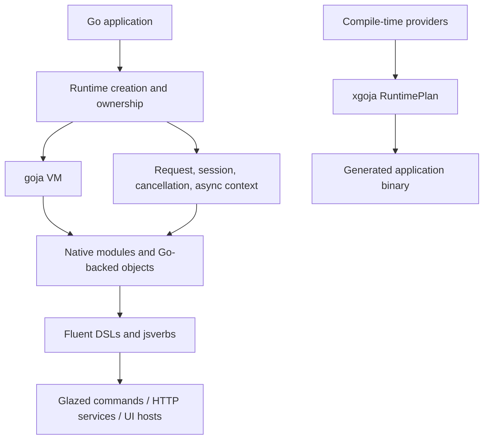

# go-go-goja — Go-Hosted JavaScript Runtimes and Generated Applications

`go-go-goja` is the Go-side runtime and tooling ecosystem for embedding JavaScript with goja. It combines explicit runtime ownership, native modules, fluent Go-backed objects, jsverbs/Glazed command generation, xgoja compile-time provider composition, HTTP serving, storage, async boundaries, and reusable application hosts. The central design problem is not simply “run JavaScript”; it is to make JavaScript capabilities composable while keeping Go in control of lifecycle, permissions, context, scheduling, and generated-binary composition.

> [!summary]
> - **Runtime:** create and own goja runtimes with explicit context, session, thread, and async semantics.
> - **Modules and DSLs:** expose typed Go capabilities as JavaScript modules and fluent builders.
> - **xgoja:** compose providers and source graphs at build time into focused generated hosts rather than one ambient mega-runtime.

## Architecture map

The runtime is the boundary that makes the rest safe. A module should not invent its own lifecycle or reach into process-global state; it should receive the runtime/context capabilities its host intentionally provides. xgoja then makes the module set and application profile explicit at build time.

## Capability areas

### Runtime ownership and execution

- [[ARTICLE - go-go-goja Runtime System - Creation Context Scheduling and Modules]] — runtime construction, scheduling, and module ownership.
- [[ARTICLE - go-go-goja Context Management - Runtime Request and Async Call Context]] — request context and asynchronous work.
- [[Research/KB/Tribal/goja-execution-model]] — sessions, thread safety, and async invariants.
- [[PROJ - go-go-goja REPL API - Profiles, IIFE Rewriting, and AST-Driven Session Semantics]] — interactive runtime semantics.
- [[PROJ - Goja REPL Hardening]] — hardening the interactive boundary.

### Native modules and Go-backed JavaScript

- [[Research/KB/Tribal/goja-embedding-in-go]] — baseline embedding pattern.
- [[ARTICLE - Designing DSLs with go-go-goja - Go-Backed JavaScript APIs]] — fluent API design.
- [[ARTICLE - Goja Fluent-Builder DSLs - Designing Typed Composable Grammars in Go for JavaScript]] — typed composable builder grammar.
- [[ARTICLE - go-go-goja Protobuf Builders - Goja Native Fluent Proto Construction]] — structured native objects.
- [[ARTICLE - go-go-goja - Adding Transaction Support to the Goja DB Module]] — stateful module boundaries.
- [[ARTICLE - Report - Go Go Goja EventEmitter Implementation]] — event delivery.
- [[ARTICLE - Report - Go Go Goja fswatch Implementation]] — host-side filesystem events.

### xgoja and generated hosts

- [[ARTICLE - xgoja - Compile-Time Goja Module Composition and jsverbs Mounting]] — compile-time composition model.
- [[ARTICLE - xgoja - Generated Goja Applications Provider Architecture and Runtime Profiles]] — provider architecture and profiles.
- [[ARTICLE - New XGoja - Source Graphs Provider Plans and the V2 Runtime Compiler]] — source graphs and provider plans.
- [[ARTICLE - xgoja v2 RuntimePlan Hard Cutover - Technical Deep Dive]] — the hard-cut runtime-plan transition.
- [[ARTICLE - Playbook - Building go-go-goja xgoja Provider Packages]] — provider package implementation workflow.
- [[PROJ - XGoja Provider Support - Third-Party Package Rollout]] — rolling providers into existing packages.

### Applications and integrations

- [[PROJ - go-go-goja jsverbs - JavaScript to Glazed Commands]] — JavaScript-defined structured CLI commands.
- [[ARTICLE - xgoja - Building a Query Tool with Jsverbs and Embedded Modules]] — a generated query application.
- [[ARTICLE - go-go-goja - HTTP Serve Support for xgoja Generated Verbs]] — HTTP serving from generated verbs.
- [[ARTICLE - xgoja - HTTP Serve, Hot Reload, and Runtime Service Architecture]] — service lifecycle and reloads.
- [[ARTICLE - go-go-goja Express Auth - From Planned Routes to Generated Host Auth]] — route and host authentication.
- [[ARTICLE - go-go-goja Programmatic Auth After Rate Limiting - Deep Dive]] — auth ordering and route policy.
- [[ARTICLE - xgoja - Build Environments and Jsverb Command Design for Vector RAG Tools (gpt-5.5 medium)]] — RAG tool host design.

## Recommended reading path

1. Start with the runtime-system report and the goja execution-model tribal entry.
2. Read the native-module and fluent-builder notes to understand the JavaScript API boundary.
3. Read xgoja provider and RuntimePlan reports to understand generated binaries.
4. Read one integration note such as jsverbs, HTTP serve, or Express Auth.
5. Use the application reports for concrete constraints and failure modes.

## Working rules

- Keep goja runtime ownership explicit; do not treat a runtime as a globally shareable object.
- Marshal work back to the owning runtime thread when callbacks or async results cross Go boundaries.
- Keep module capabilities narrow and host-provided.
- Use plain JSON-shaped values at stable boundaries when that improves interoperability.
- Prefer wrapper-first APIs over leaking internal Go objects directly.
- Compose providers at build time with xgoja rather than exposing every module to every binary.
- Treat generated hosts as products with their own configuration, help, assets, and release behavior.

## Related knowledge

- [[goja-text]] and [[goja-bleve]] — sibling native modules built on the same host/runtime ecosystem.
- [[researchctl]] — another Goja-backed DSL and generated-host use case.
- [[Research/KB/Tribal/data-only-vs-host-access-module-split]] — capability separation pattern.
- [[Research/KB/Tribal/dsl-normalized-config-compiled-plan]] — normalize and compile declarative input before execution.

## Repository map

Repository: `/home/manuel/code/wesen/go-go-golems/go-go-goja`

| Concern | Location |
|---|---|
| Runtime and context | runtime packages |
| Native modules | module/provider packages |
| xgoja composition | xgoja/provider packages |
| jsverbs and Glazed | jsverbs packages |
| Generated examples | `examples/` |
| Runtime and provider tests | package tests and integration fixtures |
