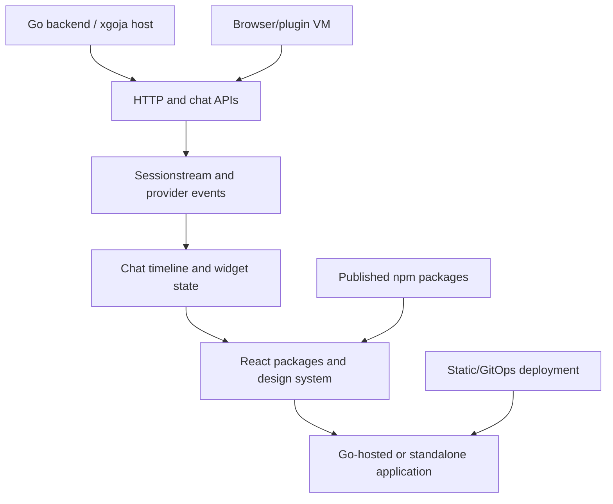

# go-go-os — Chat, Widgets, and Go-Hosted Frontend Applications

`go-go-os` is the application surface where the Go runtime, chat providers, sessionstream events, widget DSLs, React packages, and generated/static deployments meet. The work spans frontend packages, backend services, chat overlays, browser plugin VMs, shared design-system components, and application shells that can be consumed as public packages or hosted as a coherent system.

> [!summary]
> - **Application shell:** Go-hosted services and React/TypeScript packages share explicit APIs and deployment boundaries.
> - **Chat surface:** provider-owned timelines, sessionstream events, widgets, tools, and persistence become user-facing applications.
> - **Package system:** frontend and shared packages are published, consumed standalone, and deployed through static or GitOps targets.

## Architecture

The important boundaries are package versus application, provider events versus UI projection, and generated/static output versus live backend behavior. The reports repeatedly show that a frontend package is only reusable when its contracts, styles, assets, and runtime assumptions are explicit.

## Capability areas

### Frontend packages and shared hosting

- [[ARTICLE - go-go-os Examples - Public Packages and Shared Static Hosting]] — public examples and static hosting.
- [[ARTICLE - go-go-os Frontend npm Packages - Publishing and Standalone Consumption]] — package publication and consumption.
- [[ARTICLE - Building a Reusable CLIM React Package]] — reusable React package boundaries.
- [[ARTICLE - Trusted npm Publishing for Go Go Golems React Packages]] — publishing security.
- [[ARTICLE - NPM Publishing for Go Go Golems Packages with Vault OIDC]] — package delivery credentials.

### Chat, timelines, and widgets

- [[ARTICLE - Chat Overlay API - Sessionstream Widget Runtime Deep Dive]] — streamed widget runtime.
- [[ARTICLE - Chat Overlay API - Two Proposals for a Typed Widget Streaming Architecture]] — typed widget protocol.
- [[ARTICLE - React Chat Upstreaming - Provider-Owned Timeline Stats and Renderers]] — provider-owned timeline state.
- [[ARTICLE - Generic ChatProvider - From Overlay Runtime to Provider Backed Web Chat]] — provider-backed web chat.
- [[PROJECT REPORT - Browser Plugin VM - Stateful Feed Middleware Runtime Deep Dive]] — stateful browser plugin execution.
- [[Research/KB/Projects/widget-dsl]] — intent-level widgets and IR.
- [[Research/KB/Projects/sessionstream]] — event and timeline contracts.

### Product and migration reports

- [[PROJ - wesen-os - 2026-07 Stocktake, Consolidation, and Chatapp Migration]] — current platform consolidation.
- [[PROJ - wesen-os - Assistant Chat Parity and Generated HyperCard Apps]] — application parity and generated apps.
- [[ARTICLE - ChatProvider Web Chat Cleanup - Provider Runtime Timeline Adapters and Example Architecture]] — web chat architecture.
- [[ARTICLE - Goja HTTP Composition - Mountable Handlers and Sessionstream WebSockets]] — host/API composition.

### Documentation and deployment

- [[ARTICLE - Agent a14y for Go-Hosted React Docs - Converting docsctl from SPA Shell to Agent-Readable Site]] — agent-readable Go-hosted docs.
- [[ARTICLE - Static-Sites Deployment - A Three-Contract Model for Shipments]] — static delivery contracts.
- [[ARTICLE - ArgoCD Reorganization - From Flat List to Structured Platform]] — deployment organization.
- [[Projects/2026/06/06/ARGOCD Reorg/PROJ - Hetzner K3s Platform — ArgoCD Reorganization and Cleanup]] — platform deployment.

## Recommended reading path

1. Read the package/public-hosting reports.
2. Read the sessionstream and widget MOCs for state and UI contracts.
3. Read the provider-owned timeline and chat overlay reports.
4. Read the browser plugin VM and generated-app reports.
5. Read a deployment/a14y report before changing the application shell.

## Working rules

- Define package contracts independently from application wiring.
- Treat provider events and UI projections as different models.
- Make widget state, actions, and persistence explicit.
- Keep static package consumption possible without importing the whole application.
- Test browser, backend, generated, and static deployment boundaries separately.
- Publish only artifacts with explicit runtime, asset, and style contracts.

## Repository map

Primary repositories: `/home/manuel/code/wesen/go-go-golems/go-go-os-frontend`, `/home/manuel/code/wesen/go-go-golems/go-go-os-backend`, and `/home/manuel/code/wesen/go-go-golems/go-go-os-chat`.

| Concern | Location |
|---|---|
| Frontend packages | `go-go-os-frontend/packages/` |
| Backend services | `go-go-os-backend/` |
| Chat and provider adapters | `go-go-os-chat/` |
| Widget/IR integration | frontend and xgoja/widget packages |
| Deployment | Argo CD, static hosting, and Go host repositories |
