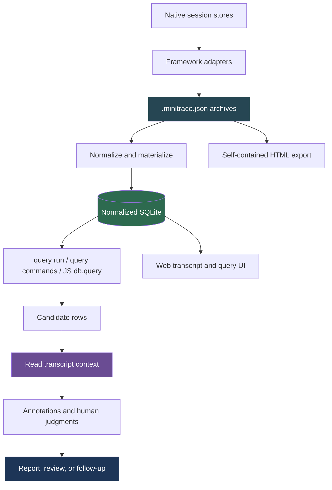

# go-minitrace — Transcript Analysis and Evidence Workbench

`go-minitrace` turns coding-agent session logs into portable, queryable evidence. It converts native Pi, Codex, Claude Code, GitHub Copilot CLI, claude.ai, and Geppetto/Pinocchio sessions into `.minitrace.json` archives, materializes them into a normalized SQLite database, exposes reusable SQL and JavaScript query commands, and provides transcript, annotation, web, and self-contained export views for human review.

> [!summary]
> - **Reduction pipeline:** discover and convert raw sessions, query structured rows, then reopen the transcript to interpret what the metrics mean.
> - **Current engine:** normalized SQLite through `go-minitrace query run`; the former DuckDB command family is removed.
> - **Evidence discipline:** SQL finds candidates, while transcript context, preserved failures, join keys, annotations, and portable exports support the conclusion.

## The core mental model



The essential method is a reduction ladder:

1. Start from a bounded research or review question.
2. Discover candidate sessions using metadata or content grep.
3. Convert only the relevant native sessions into archives.
4. Query normalized tables to reduce thousands of turns and tool calls to a small candidate set.
5. Reopen the source transcript around each candidate.
6. Preserve judgments, artifacts, and caveats in annotations or reports.

A metric without transcript inspection is a lead, not a conclusion.

## Current query engine

The current analytical path is the normalized SQLite engine. The migration guide and historical-note status are tracked in [[ARTICLE - go-minitrace Query Engine Migration - DuckDB to Normalized SQLite]].

```bash
go-minitrace query run \
  --archive-glob './analysis/*/active/*/*.minitrace.json' \
  --preset session-list
```

```bash
go-minitrace query run \
  --archive-glob './analysis/*/active/*/*.minitrace.json' \
  --sql-file ./queries/tool-failures.sql \
  --max-rows 5000
```

The main tables are:

- `sessions` — session identity, framework, model, timing, counts, branch, and environment fields.
- `turns` — ordered messages, roles, content, thinking, and token usage.
- `tool_calls` — tool name, operation type, file path, command, success, error, exit code, and duration.
- `files`, `events`, `attachments`, `annotations`, `handovers`, and `metrics` — supporting evidence and review data.

The query runner is sandboxed and read-only. The same basic boundary backs CLI queries, structured query commands, JavaScript handlers, and the web query surface. A `sessions_base` compatibility view preserves some session-level legacy SQL, but queries that previously used `UNNEST` over nested tool calls or turns must use the normalized tables directly.

For migration details, start with [[ARTICLE - go-minitrace Query Engine Migration - DuckDB to Normalized SQLite]]. Do not copy old `go-minitrace query duckdb` commands from historical notes.

## Query surfaces

### CLI and structured commands

Use `query run` for ad hoc SQL and named presets. Store reusable SQL or JavaScript analysis commands in a repository so an investigation's narrowing logic becomes a durable artifact rather than terminal history.

### JavaScript handlers

The `minitrace` JavaScript module exposes a builder-composed database handle. A handler can query normalized tables, compose structured commands, and emit machine-readable rows without bypassing the query sandbox.

### Web UI

The web application provides session browsing, transcript blocks, query workbenches, query libraries, artifact summaries, and navigation from aggregate results back into narrative context.

### Portable export

The HTML export produces a self-contained reader with embedded payload, JavaScript, and CSS. It is intended for offline review, ticket handoff, and durable sharing without a running server or database.

## Evidence and annotation model

The tool keeps several kinds of truth separate:

- **Raw archive:** portable converted session data.
- **Normalized query database:** rebuildable analytical view.
- **Transcript reader:** narrative and operational context.
- **Annotations:** human-authored classifications and judgments over sessions, turns, or tool calls.
- **Reports:** interpreted conclusions with explicit evidence and limitations.

This separation prevents an aggregate query from becoming an unsupported claim. It also preserves raw failures, exact join keys, and the distinction between agent behavior, user decisions, environment failures, and successful implementation work.

Important join keys include `session_id` across session-level data and `tool_use_id` or turn/tool-call relationships where framework adapters provide them. Losing these keys makes it impossible to navigate from a hook event or aggregate row to the exact transcript evidence.

## Common analysis workflows

### Session archaeology

Use discovery, content grep, and targeted conversion to locate the few sessions relevant to a repository, pull request, incident, or design decision. This is especially useful when the recorded working directory is a workspace rather than the repository named in the conversation.

### Tool and failure analysis

Query `tool_calls` for error rates, operation types, file touches, command durations, and retry patterns. Then inspect representative turns to distinguish a tool failure from a failed user instruction, an environment problem, or a deliberate recovery step.

### Cross-model comparison

Hold task scope and archive selection constant, compare normalized session metrics, then read enough transcript and produced code to explain the observed differences. Read counts, edit counts, token totals, and duration are signals; they require semantic interpretation.

### Nightly or batch review

Convert a bounded time window, run a stable preset/query bundle, inspect anomalies, and synthesize a report. Preserve the query repository and the input selection so the batch can be repeated or audited.

### Code review and incident reconstruction

Use queries to find relevant turns, tool calls, files, commits, and failures. Reconstruct the implementation sequence from transcript evidence and repository history, then write a review report that distinguishes what was observed from what is inferred.

## Related notes

### Current architecture and engine

- [[PROJ - go-minitrace - The Normalized SQLite Query Engine]] — current query-engine architecture, normalized schema, cache fingerprinting, and shared sandbox.
- [[ARTICLE - go-minitrace Query Engine Migration - DuckDB to Normalized SQLite]] — authoritative migration and stale-note deprecation map.
- [[PROJECT REPORT - go-minitrace Skill Repair and PR 95 Session Recovery]] — current example of repairing the workflow, finding a workspace-cwd-hidden session, and reconstructing a PR.

### Core product surfaces

- [[PROJ - go-minitrace - Web UI and Transcript Explorer]] — browser session list, transcript blocks, query workbench, and query library.
- [[PROJ - go-minitrace - Annotation System]] — human-authored annotations and synchronization over transcript evidence.
- [[PROJ - go-minitrace HTML Transcript Export - Reader Architecture]] — portable single-file transcript reader.

### Methods and playbooks

- [[transcript-analysis-with-go-minitrace]] — tribal workflow note; follow its current SQLite warning before using commands.
- [[ARTICLE - Playbook - Efficient Past Transcript Analysis with go-minitrace]] — efficient archive/query/read workflow.
- [[ARTICLE - Playbook - Analyzing Coding-Agent Sessions with go-minitrace]] — reusable analysis process.
- [[ARTICLE - Textbook - Transcript Analysis with go-minitrace]] — longer pedagogical treatment; historical DuckDB commands require migration.
- [[Code Review with go-minitrace]] — institute guideline for transcript-backed code review.

### Applications and case studies

- [[PROJ - Nightly Transcript Review - 2026-04-16]] — repeatable nightly review pipeline.
- [[PROJ - Cross-Model Transcript Analysis - Minimax M2.7 vs GPT-5.4]] — comparative model analysis.
- [[ARTICLE - Transcript Mining - Using go-minitrace to Find and Fix Tool-Call Churn in Agent Sessions]] — mining tool-call behavior for process improvement.
- [[ARTICLE - Project Report - Tracing the Loupedeck Serial Bug with Transcript Analysis]] — concrete bug investigation.
- [[ARTICLE - Textbook - Transcript Analysis with go-minitrace]] — literate method and command-authoring approach.
- [[ARTICLE - Transcript RAG Playground - Conversation Units, Immutable Generations, and Embedding Identity]] — composing transcript archives into a retrieval system.

## Repository map

Canonical repository: `/home/manuel/code/wesen/corporate-headquarters/go-minitrace`

| Concern | Likely source area |
|---|---|
| CLI and query commands | `cmd/go-minitrace/cmds/` |
| Native-format adapters | `pkg/adapters/` |
| Normalized SQLite schema and query runner | `pkg/minitracedb/` |
| Archive conversion and discovery | `pkg/` and `cmd/go-minitrace/cmds/convert/` |
| Annotations | `pkg/annotate/`, `cmd/go-minitrace/cmds/annotate/` |
| HTML export | `pkg/exporthtml/`, `web/src/export/` |
| Web UI and transcript reader | `web/` and `cmd/go-minitrace/cmds/serve/` |

## Working rules

- Query to narrow; read the transcript to interpret.
- Preserve raw archives and exact join keys.
- Keep query commands reusable and versioned with the investigation.
- Use normalized tables and real typed columns where available.
- Treat tool metrics as evidence about process, not automatic explanations of quality.
- Preserve failures and negative results; they often explain the real cause.
- Keep annotations separate from raw session data.
- Export a portable reader when the result must outlive the local server.
- Link new go-minitrace notes to this MOC and to the current migration guide.
