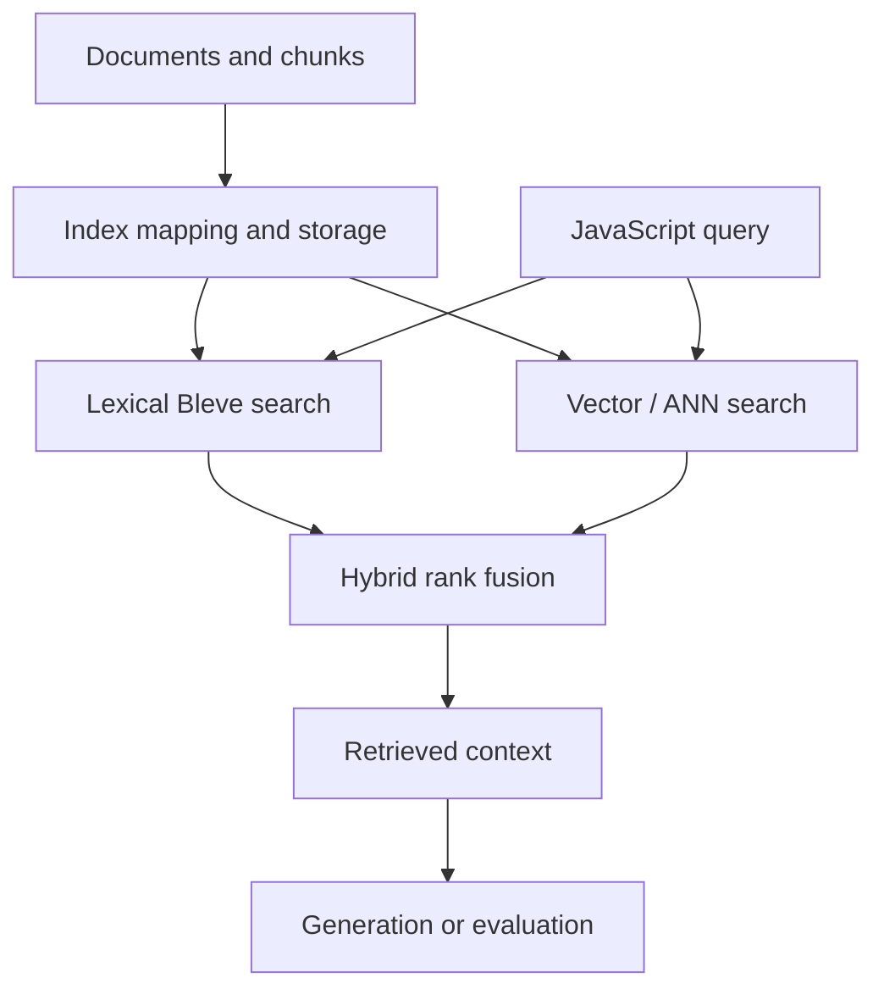

# goja-bleve — Native Vector and Hybrid Search for JavaScript RAG

`goja-bleve` brings Bleve indexing and search into JavaScript applications hosted by goja and xgoja. It supports native bindings for lexical and vector search, RAG-oriented query workflows, and hybrid retrieval where lexical and semantic rankings are combined. The project exists at the boundary between a high-performance Go search engine and a JavaScript-authored retrieval application: the binding must expose useful search primitives without hiding index lifecycle, scoring, memory, or reproducibility concerns.

> [!summary]
> - **Native search:** Bleve indexes and queries are exposed through a Go-backed JavaScript module.
> - **Vector retrieval:** approximate nearest-neighbor search and embedding-backed fields support semantic RAG.
> - **Hybrid ranking:** lexical and vector evidence can be combined and then consumed by xgoja-generated tools.

## Search pipeline

The JavaScript API is an application surface over native search state. Index creation, mapping, vector dimensions, query limits, and result provenance must remain explicit enough that a reader can reproduce a ranking and diagnose a poor retrieval result.

## Capability areas

### Native bindings and module shape

- [[ARTICLE - Goja Bleve - Native Search Bindings for JavaScript RAG Pipelines]] — core binding and API surface.
- [[ARTICLE - Goja Bleve - Shipping a Vector RAG Runtime with xgoja]] — packaging the module into a generated host.
- [[ARTICLE - Goja Fluent-Builder DSLs - Designing Typed Composable Grammars in Go for JavaScript]] — fluent API design context.
- [[Research/KB/Tribal/goja-embedding-in-go]] — runtime and native-module boundary.

### Vector search and indexing

- [[ARTICLE - Building FAISS for Bleve Vector Search]] — vector-search implementation and ANN considerations.
- [[PROJECT REPORT - Transcript RAG Bleve - Hybrid Search, Empirical Findings, and the Corrected Architecture]] — empirical comparison and architecture correction.
- [[PROJECT REPORT - Transcript RAG Bleve - goja-bleve 0.0.6 and the Native RRF Restoration]] — release and ranking restoration.
- [[PROJECT REPORT - Transcript RAG - Final Hybrid Architecture and IVF Probe Auto-Tune]] — probe selection and tuning.

### Application and corpus integration

- [[PROJECT REPORT - Transcript RAG - Analyzing agentsview Vector Search and Recreating It in JavaScript]] — reverse-engineering and recreating a retrieval system.
- [[ARTICLE - Transcript RAG Playground - Conversation Units, Immutable Generations, and Embedding Identity]] — durable corpus generations and retrieval identity.
- [[ARTICLE - Transcript RAG Summarization - Multi-Representation Retrieval and Local Structured Generation]] — retrieval feeding multiple representations.
- [[PROJECT REPORT - Transcript RAG - Self-Contained Pi Corpus and Representation Retrieval]] — self-contained corpus application.

## Recommended reading path

1. Start with the native binding article.
2. Read the xgoja packaging article to understand how the module reaches an executable.
3. Read the FAISS/vector article for ANN and index design.
4. Read the hybrid empirical report and the RRF restoration report for correctness and regression lessons.
5. Read the Transcript RAG reports for corpus, tuning, and application context.

## Working rules

- Keep embedding dimensions, field mappings, and index configuration versioned with the corpus.
- Preserve document/chunk IDs and source provenance through indexing and retrieval.
- Distinguish lexical score, vector distance, fused rank, and final application score.
- Validate ranking behavior with fixed fixtures before tuning ANN parameters.
- Treat approximate search as an operating point with recall/latency tradeoffs, not as an invisible implementation detail.
- Keep native resources and index lifecycles owned by Go while exposing explicit handles to JavaScript.
- Make release changes such as RRF restoration and version bumps observable in retrieval regression tests.

## Related notes

- [[goja-text]] — source parsing and source-preserving chunking companion.
- [[go-go-goja]] — host runtime and xgoja composition.
- [[ARTICLE - Deep Dive - xgoja Scripting for RAG Evaluation Systems]] — evaluation and generated-host scripting.
- [[Research/KB/Tribal/dsl-normalized-config-compiled-plan]] — declarative configuration and compiled execution plans.

## Repository map

Repository: `/home/manuel/code/wesen/go-go-golems/goja-bleve`

| Concern | Location |
|---|---|
| Bleve bindings | Go module source |
| JavaScript module | native module/provider packages |
| Vector indexing and search | vector/ANN packages |
| Hybrid ranking | fusion and query packages |
| xgoja integration | provider and generated-host examples |
| Retrieval tests | fixtures and regression tests |
