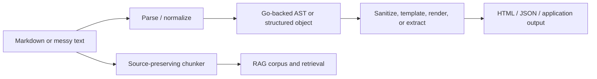

# goja-text — Go-Backed Text, Markdown, and Source-Preserving Pipelines

`goja-text` exposes Go's text-processing and Markdown capabilities to JavaScript hosts. Its work spans Markdown AST bindings, sanitization and structured extraction, template/HTML rendering, and source-preserving chunking for retrieval pipelines. The recurring design concern is preserving enough source identity and structure that JavaScript can compose text transformations without losing the boundaries needed for rendering, debugging, citation, or later retrieval.

> [!summary]
> - **Structured text:** parse Markdown into Go-backed objects rather than flattening everything to strings.
> - **Safe transformation:** sanitize and extract structured data from messy input while keeping policy explicit.
> - **Retrieval:** chunk source text with provenance so downstream RAG systems can cite and reconstruct context.

## Pipeline model

The module should be understood as a boundary between JavaScript ergonomics and Go's mature parsing/rendering libraries. The host owns the runtime and capability policy; goja-text owns the text representation and transformations.

## Capability areas

### Markdown AST and Go-backed objects

- [[PROJ - Goja Text - Go-Backed Markdown AST Bindings]] — exposing structured Markdown nodes to JavaScript.
- [[ARTICLE - Fluent Builders with Go-Backed Objects for JavaScript]] — the general object/builder technique.
- [[ARTICLE - Lazy Data Structures over goja Proxy - Go-Backed On-Demand JavaScript Objects]] — lazy projection and proxy tradeoffs.
- [[ARTICLE - goja Binding Mechanisms - The Cost of Exposing Go to JavaScript]] — binding design and performance constraints.

### Sanitization and rendering

- [[PROJ - Goja Text - Sanitizing and Extracting Structured Data from Messy Text]] — recovery, normalization, and structured extraction.
- [[PROJ - goja-text - Template and HTML Rendering Module]] — template and HTML output boundary.
- [[ARTICLE - Goja Fluent-Builder DSLs - Designing Typed Composable Grammars in Go for JavaScript]] — typed JS composition patterns.

### Source-preserving retrieval

- [[PROJ - goja-text - Source-Preserving Chunking for JavaScript RAG Pipelines]] — chunk identity, offsets, and source lineage.
- [[PROJECT REPORT - Transcript RAG - Self-Contained Pi Corpus and Representation Retrieval]] — applying source-preserving text to a durable transcript corpus.
- [[ARTICLE - Transcript RAG Summarization - Multi-Representation Retrieval and Local Structured Generation]] — downstream representations and summaries.
- [[ARTICLE - Deep Dive - xgoja Scripting for RAG Evaluation Systems]] — generated-host scripting and evaluation.

## Recommended reading path

1. Read the Markdown AST report to understand the representation boundary.
2. Read the sanitization report for messy-input policy and failure modes.
3. Read the template/rendering report for output ownership.
4. Read the source-preserving chunking report for retrieval identity.
5. Follow the Transcript RAG reports to see how the module composes into a larger system.

## Design rules

- Keep source offsets, stable IDs, and origin metadata when downstream users need citations or reconstruction.
- Separate parsing, normalization, transformation, and rendering; do not hide all four stages behind one opaque helper.
- Make sanitization policy explicit because “recovered” text is not necessarily faithful text.
- Prefer Go-backed structured objects when structure matters, but avoid exposing an unbounded internal object graph.
- Treat HTML rendering as an output boundary with escaping and ownership rules.
- Make chunking deterministic and preserve enough provenance to explain why a retrieved fragment exists.
- Test both malformed inputs and semantic preservation, not only successful parsing.

## Related notes

- [[go-go-goja]] — host/runtime and generated-binary ecosystem.
- [[goja-bleve]] — sibling native retrieval module.
- [[Research/KB/Tribal/goja-embedding-in-go]] — embedding and module registration.
- [[Research/KB/Tribal/canonical-doc-model-across-delivery-modes]] — keeping one document model across outputs.
- [[ARTICLE - Exporting WordPress WooCommerce Data into a RAG SQLite Corpus]] — source ingestion context.

## Repository map

Repository: `/home/manuel/code/wesen/go-go-golems/goja-text`

| Concern | Location |
|---|---|
| Go-backed text and Markdown types | package source |
| JavaScript native module | module registration package |
| Sanitization and extraction | parser/normalization packages |
| Templates and HTML | rendering packages |
| Chunking and provenance | chunking packages |
| Host integration | go-go-goja/xgoja provider packages |
