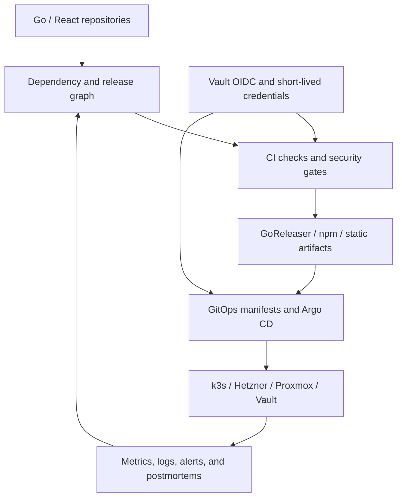

# Infrastructure and Release — Go-Go-Golems Platforms, CI, and Delivery

This map gathers the infrastructure and release work that turns Go repositories and web applications into deployable, observable, maintainable systems. It connects local release-train tooling, dependency-order analysis, GoReleaser and Homebrew publishing, GitHub/Vault OIDC, Argo CD and k3s platforms, static-site delivery, and production incident recovery.

> [!summary]
> - **Platform:** Terraform, Vault, k3s, Argo CD, DNS, ingress, and observability provide the runtime substrate.
> - **Release:** dependency graphs, ordered PRs, CI gates, GoReleaser, npm/Homebrew publishing, and rollout automation provide delivery discipline.
> - **Evidence:** postmortems and release reports preserve failure modes instead of reducing operations to a green pipeline.

## Architecture



The recurring invariant is dependency order. A release is not a single repository operation: libraries, providers, generated hosts, images, manifests, and downstream applications must be updated in an order that keeps the workspace and deployed system coherent. Infrastructure work follows the same rule: credentials, storage, identity, ingress, workload, and observability have ordering constraints.

## Capability areas

### Release trains and tooling

- [[ARTICLE - Managing Go-Go-Golems Release Trains]] — dependency graph, bump ordering, PR readiness, and rollout.
- [[ARTICLE - ggg - Codex-Aware Release Tooling for Go-Go-Golems]] — release orchestration tooling.
- [[ARTICLE - ggg Rollout Automation - Real-World Testing and Implementation]] — real rollout behavior.
- [[Research/KB/Tribal/dependency-ordered-release-train]] — reusable release-train pattern.
- [[ARTICLE - Bump-Goja - A Go Ecosystem Migration Playbook]] — dependency migration.
- [[ARTICLE - Logcopter - Package Scoped Logging for Go CLIs]] — package-level observability in released binaries.

### CI/CD, credentials, and publishing

- [[ARTICLE - Vault OIDC for GitHub Actions - Secretless CI GitOps]] — secretless CI.
- [[Projects/2026/07/17/PROJECT REPORT - Vault Backed Binary Releases - Sqleton Pilot and GitHub App Publishing]] — Vault-backed GoReleaser split-build pilot, GitHub App tap/GitOps authority, Argo CD read-only repository authentication recovery, live bootstrap proof, and residual production gates.
- [[Research/playbooks/infra/PLAYBOOK - Vault Backed Go Binary Releases]] — procedure for new binary repositories and migration of existing GitHub Actions release secrets.
- [[Projects/2026/05/26/ARTICLE - Vault OIDC for CI/CD Docs Publishing - Designing Short-Lived Package-Scoped Credentials]] — scoped publishing credentials.
- [[ARTICLE - NPM Publishing for Go Go Golems Packages with Vault OIDC]] — npm delivery.
- [[ARTICLE - Trusted npm Publishing for Go Go Golems React Packages]] — trusted frontend package publishing.
- [[ARTICLE - Static-Sites Deployment - A Three-Contract Model for Shipments]] — static artifact contracts.
- [[Research/playbooks/infra/PLAYBOOK - Vite Static Site on the Shared K3s Host]] — Vite/React/TypeScript static builds, `/site` artifact images, the shared Caddy/PVC publisher Job, GitOps `static-publisher-job` handoff, Vault image pulls, and HTTPS activation.
- [[ARTICLE - Git Repository Consolidation - Migrating Corporate Submodules and Worktrees]] — repository topology.

### Platforms and GitOps

- [[PROJ - Coolify Hetzner - Self-Hosted Deployment Platform]] — initial self-hosted platform.
- [[PROJ - Hetzner K3s Platform - Single-Node GitOps Bring-Up]] — k3s foundation.
- [[PROJ - K3s Migration Program - From Coolify to GitOps Platform]] — platform migration.
- [[PROJ - Vault on K3s - Auth and Secret Delivery Platform]] — Vault delivery.
- [[PROJECT REPORT - ZITADEL SES SMTP - Vault Backed Verification and Recovery]] — production ZITADEL email verification and password recovery through Vault-backed SES, including Login V2 gate versus asynchronous delivery semantics. Sets the standard that the SMTP credential value stays out of Terraform state; its recommended per-application IAM sending principal is first realized in the maillist report below.
- [[Research/playbooks/infra/PLAYBOOK - Production ZITADEL for a Single Go Web Application on k3s]] — ordered single-application deployment through DNS, TLS, Vault/VSO, PostgreSQL bootstrap, the official chart, Terraform PKCE resources, SMTP, GitOps, and browser acceptance.
- [[Research/playbooks/infra/PLAYBOOK - Production Multi-Tenant ZITADEL SaaS Platform on k3s]] — expansion into tenant-owned organizations, isolated namespaces/Vault paths/databases, organization-scoped OIDC, delegated administration, billing, self-service onboarding, and cross-tenant acceptance.
- [[PROJECT REPORT - Stripe Billing - End to End Subscription Infrastructure and Acceptance]] — Terraform catalog ownership, hosted Checkout and Portal, signed webhook convergence, Tax, Test Clocks, Vault delivery, quota enforcement, and production rollout boundaries.
- [[ARTICLE - Deep Dive - Completing the ZITADEL SaaS Tenant Control Plane]] — completed self-service tenant identity control plane with generated organization IDs, organization-scoped OIDC, verified administrator continuation, PostgreSQL concurrency controls, live browser acceptance, and idempotent cleanup.
- [[PROJ - Terraform Infra - Vault Platform Bring-Up, Auth Hardening, and Hair-Booking Handoff]] — infrastructure-as-code and auth.
- [[PROJ - wesen terraform - Infra Session Report]] — Terraform operations.
- [[ARTICLE - ArgoCD Reorganization - From Flat List to Structured Platform]] — Argo CD organization.
- [[PROJ - Hetzner K3s Platform — ArgoCD Reorganization and Cleanup]] — platform cleanup.
- [[Projects/2026/07/18/PROJECT REPORT - Crib K3s Loki Alloy Grafana Observability]] — Argo-managed Loki and Alloy logging, Grafana provisioning, least-privilege RBAC, live validation, and the remaining Grafana TLS secret distribution issue.
- [[Projects/2026/07/17/PROJECT REPORT - Vault Backed Binary Releases - Sqleton Pilot and GitHub App Publishing]] — GitHub App separation for GitOps writers and Argo CD repository readers; recovery of `wesen/crib-k3s` comparison health.
- [[Projects/2026/07/31/PROJECT REPORT - Hyperslop Mailing List - Double Opt-In Service from Zero to Production]] — a double opt-in signup service taken from an empty repository to production across four repositories; covers the anti-enumeration property a synchronous send silently broke, a tombstone that left its confirmation token working, Caddy's `try_files` fallback answering any unrouted POST with HTTP 200, the SES identity/credential distinction and why the SMTP credential must stay out of Terraform state, and the AppProject allowlist that is not applied by merging.

### Production operations and failure recovery

- [[ARTICLE - Debugging a k3s Post-Reboot Outage]] — recovery and observability.
- [[ARTICLE - Hetzner k3s Resize Postmortem - Capacity, Reboot, and Recovery]] — capacity and reboot failure.
- [[ARTICLE - Incident Deep Dive - Terraform State Drift from an Uncommitted Crib DNS Apply]] — infrastructure state drift.
- [[ARTICLE - Observability - Hetzner K3s Metrics Logging and Alerting]] — platform observability.
- [[PROJ - Serve Artifacts - Deploying to K3s with GitOps]] — application delivery.
- [[ARTICLE - Deploying Glazed Help Browser to Argo CD - Production Deep Dive]] — Go/web deployment case study.
- [[Research/playbooks/infra/PLAYBOOK - Argo CD Application with a local-path PVC on k3s]] — procedure for deploying a stateful application through Argo CD without deadlocking on `WaitForFirstConsumer`; covers the sync-wave invariant, file layout, Vault secrets, and the `validate_gitops.sh` check that enforces it.
- [[Research/playbooks/infra/PLAYBOOK - Restic Backups to the Crib NAS]] — procedure for encrypted, deduplicated, scheduled restic backups from a laptop to TrueNAS over SFTP; covers TrueNAS dataset/user provisioning, Vault password escrow, the critical `sftp.args` option, systemd/launchd scheduling, and restore validation. Parameterized scripts at `Research/playbooks/infra/scripts/restic-crib-backup/`.
- [[PROJECT REPORT - Restic Backup Scope Design - From 1.7T Home to a 247G Recovery Unit]] — scope investigation that turned a 1.7T home directory into a 247G restic recovery unit; covers the 3-tier classification (back up / exclude / handle separately), the dry-run that corrected a twofold underestimate, the 99-line excludes file, and the permission-denied service-owned state pattern.
- [[PROJECT REPORT - Tailscale on TrueNAS - Making Restic Backups Work From Any Network]] — Tailscale installation on TrueNAS SCALE 23.10.2 via the community catalog app; covers the `hostNetwork` decision, cached state from a wrong-tailnet auth key, and the update from LAN IP to Tailscale hostname so backups work from any network.

## Vault — how credentials actually work here

Vault is the single source of every runtime and CI credential on this platform. This section
is the concrete operational reference: where a secret lives, who creates it, who may read it,
and which file in which repository declares that.

**Server.** `https://vault.yolo.scapegoat.dev`, running on Hetzner k3s under Argo CD
(`gitops/kustomize/vault`), auto-unsealed with AWS KMS (`seal "awskms"`). The earlier
Vault-on-Coolify deployment at `vault.app.scapegoat.dev` is retired; March 2026 notes
describing it are historical.

### The four ways in

| Auth mount | Who | How the identity is proven | Where it is declared |
|---|---|---|---|
| `auth/oidc` | Humans (operators) | Keycloak realm `infra` at `https://auth.scapegoat.dev/realms/infra`, group-gated | `scripts/bootstrap-vault-oidc.sh`, `vault/policies/operators/*.hcl` (k3s repo) |
| `auth/kubernetes` | Workload Pods | ServiceAccount name + namespace | `vault/roles/kubernetes/<app>.json` + `vault/policies/kubernetes/<app>.hcl` (k3s repo) |
| `auth/github-actions` | CI workflows | GitHub Actions OIDC JWT, bound to repo/branch/event | `vault/roles/github-actions/*.json` (k3s repo) **and** `terraform/vault/github-actions/envs/k3s/main.tf` — see the split-brain warning below |
| `auth/approle` | The one workload VSO cannot bind by ServiceAccount | role id (in git) + secret id (in a Secret) | `gitops/kustomize/platform-cert-issuer/vault-auth.yaml` — cert-manager reading its DigitalOcean DNS-01 token |

Operator login is still Keycloak even though ZITADEL supersedes Keycloak for new application
identity. Do not "fix" this by pointing Vault at ZITADEL without a plan; it is the path by
which every bootstrap script authenticates.

### The KV layout

KV v2 mounted at `kv/`. Four top-level prefixes, and the prefix determines who can read it:

```text
kv/apps/<app>/<env>/<secret>        runtime secrets, read by that app's Pod only
kv/ci/github/<repo>/<credential>    CI credentials, read by that repo's workflow only
kv/infra/<service>/<scope>          shared cluster services (postgres, mysql, redis,
                                    monitoring/grafana-oauth, backups/object-storage)
kv/platform/<component>/<env>/...   platform components (cert-manager/prod/digitalocean)
```

Note the API path is `kv/data/...` in a policy and `kv/...` in a `vault kv` command. A policy
must grant both `kv/data/<path>` and `kv/metadata/<path>`.

### The rule that decides what Terraform may own

Terraform owns the **boundary**; Vault owns the **credential value**. Declare the identity,
the policy, the role, and the scope in Terraform, where a plan is reviewable and nothing
secret appears. Create the credential itself out-of-band and write it straight to Vault.

The failure this prevents is concrete: `aws_iam_access_key` stores both `secret` and
`ses_smtp_password_v4` in state, which extends their lifetime into every state snapshot,
plan, log, and state-reader's permissions. See
[[Projects/2026/07/26/PROJECT REPORT - ZITADEL SES SMTP - Vault Backed Verification and Recovery]]
for the rule and
[[Projects/2026/07/31/PROJECT REPORT - Hyperslop Mailing List - Double Opt-In Service from Zero to Production]]
for what violating it looks like and the rotation that reverses it. Reverting is a rotation,
not a detach: the value is already in state history, so it must be replaced and the old one
deleted.

### Delivery into a Pod

The Vault Secrets Operator renders a Vault path into a Kubernetes `Secret`. Three CRDs, all
in the application's own kustomize package:

- `VaultConnection` — the server address.
- `VaultAuth` — which `auth/kubernetes` role this ServiceAccount uses.
- `VaultStaticSecret` — `mount: kv`, `type: kv-v2`, `path: apps/<app>/<env>/<secret>`,
  `refreshAfter`, and the `Secret` to create.

Give these `argocd.argoproj.io/sync-wave: "-1"` so the Secret exists before the Deployment.

**Environment variables sourced from a Secret do not refresh in a running container.** VSO
updating the Secret is not enough — a credential rotation needs `kubectl rollout restart`.
This is the most commonly missed step in a rotation.

### Adding a new application: the concrete path

1. Write `vault/policies/kubernetes/<app>.hcl` granting `kv/data/apps/<app>/<env>/*` and the
   matching `kv/metadata/...`, and nothing else. Name explicitly which paths it must *not*
   read if a neighbouring app has a similar one.
2. Write `vault/roles/kubernetes/<app>.json` with `bound_service_account_names`,
   `bound_service_account_namespaces`, `policies`, and `token_ttl`.
3. `bash scripts/bootstrap-vault-kubernetes-auth.sh` (needs `VAULT_ADDR` and an operator token
   from `vault login -method=oidc role=operators`). It picks up both files.
4. Seed the KV path by hand.
5. Add the three VSO resources to the app's kustomize package.
6. `bash scripts/validate-vault-kubernetes-auth.sh`.

The policy and role files are the durable artifact; the script is only the applier. A path
that exists in Vault but has no file in git is drift.

### Where to look

**Cross-repository playbooks** (this vault, `Research/playbooks/infra/`):

- [[Research/playbooks/infra/PLAYBOOK - Onboarding a Source Repository to the GitOps Image Pipeline]]
  — the orchestration view: what happens in which repository and in what order.
- [[Research/playbooks/infra/PLAYBOOK - Per-Application SES Sending Identity]] — SES identity,
  IAM principal, the credential-out-of-state rule, and Vault delivery.
- [[Research/playbooks/infra/PLAYBOOK - Argo CD Application with a local-path PVC on k3s]]
- [[Research/playbooks/infra/PLAYBOOK - Vault Backed Go Binary Releases]]

**Playbooks and procedures** (`wesen/2026-03-27--hetzner-k3s/docs/`):

- `app-runtime-secrets-and-identity-provisioning-playbook.md` — the main one: provisioning
  runtime secrets and identity for a new app.
- `github-actions-vault-oidc-playbook.md` — the CI auth path.
- `vault-backed-postgres-bootstrap-job-pattern.md` — a Job that reads Vault to bootstrap a database.
- `vault-snapshot-and-server-backup-playbook.md` — Raft snapshots and host backups.
- `keycloak-vault-smtp-reconciler-pattern.md` — reconciling mutable provider state (Keycloak's
  SMTP config) from Vault, since Argo cannot declare it and Terraform would persist it in state.
- `argocd-private-gitops-repo-secret.md` — Argo CD's own read credential, separate from CI's.

**Declarations:** `vault/policies/{operators,kubernetes,github-actions}/` and
`vault/roles/{kubernetes,github-actions}/` in the k3s repo;
`terraform/vault/github-actions/envs/k3s/` in the terraform repo.

**Scripts** (k3s repo `scripts/`): `bootstrap-vault-oidc.sh`,
`bootstrap-vault-kubernetes-auth.sh`, `bootstrap-vault-github-actions-oidc.sh`,
`bootstrap-vault-aws-kms-secret.sh`, and a `validate-*` counterpart for each.

**Origin tickets:** `HK3S-0002`–`HK3S-0007` (Vault on k3s, Kubernetes auth, VSO, first app),
`HK3S-0014` (Vault-backed GHCR pull secrets), `HK3S-0017` (snapshots and backups),
`HK3S-0026` (operator membership in Terraform), `HK3S-0028` (GitHub Actions OIDC);
`TF-004`/`TF-008`/`TF-009`/`TF-010` in the terraform repo (the Coolify-era design, auth
hardening, audit logging, and the first SES handoff).

**Reports:** [[PROJ - Vault on K3s - Auth and Secret Delivery Platform]],
[[ARTICLE - Report - Terraform Managed Vault Admin Access Through Keycloak OIDC]] (still
current — this is the operator login),
[[Projects/2026/04/02/PROJ - Glazed Secret Redaction and Vault Bootstrap - Technical Project Report]],
[[ARTICLE - Backup Architecture - TrueNAS with Vault Credentials]].

## GitHub authentication, tokens, and CI/CD

Four distinct GitHub credentials operate here and they are routinely confused. Each has a
different holder, lifetime, and blast radius.

| Credential | Held by | Purpose | Status |
|---|---|---|---|
| GitHub App installation token, minted per run from an App key in Vault | CI workflows | Open GitOps PRs against `wesen/2026-03-27--hetzner-k3s` | **Current** |
| PAT at `kv/ci/github/<repo>/gitops-pr-token` | CI workflows | Same | **Deprecated** |
| PAT in a source-repo GitHub Actions secret (`GITOPS_PR_TOKEN`) | CI workflows | Same | **Deprecated, oldest** |
| Argo CD repository read credential | Argo CD, in-cluster | List refs, render manifests, sync | Current, separate concern — `docs/argocd-private-gitops-repo-secret.md` |
| GHCR image-pull credential in `kv/apps/<app>/<env>/image-pull` | The Pod's ServiceAccount | Pull a private image | Current |

### The three `gitops_pr_token_source` modes

The shared workflow is `go-go-golems/infra-tooling/.github/workflows/publish-ghcr-image.yml@main`.

```yaml
gitops_pr_token_source: github_app          # use this
vault_role: <repo>-gitops-pr
gitops_app_secret_path: kv/data/ci/github/<repo>/gitops-pr-app
gitops_app_owner: wesen
gitops_app_repositories: 2026-03-27--hetzner-k3s
```

All four App inputs are required; the preflight rejects the run without the last two, and
that error is easy to misread as a Vault problem.

`vault` mode is deprecated. The Vault OIDC exchange it uses is unchanged and still correct —
what is wrong is what CI reads afterwards: a long-lived PAT.

When such a PAT expires, the Vault steps still succeed, so the log reads as though credential
retrieval worked. The failure lands at **`git clone`**: `open_gitops_pr.py` embeds the token
in the clone URL (`https://x-access-token:<token>@github.com/...`) and clones the GitOps repo
before it ever calls `gh`. Two messages have been seen there — `Invalid username or token.
Password authentication is not supported for Git operations.` (Glazed, 2026-07-17, the one
TF-012 and the migration playbook document) and `Bad credentials` (publish-vault,
2026-06-01). `GH_TOKEN=<token> gh api user` confirms a dead credential in one step.

`secret` mode is older still. To move a repository off either, follow
`go-go-golems/infra-tooling/docs/go-go-golems/playbooks/github-app-gitops-pr-migration-playbook.md`.

**Diagnostic:** check the pull request **actor**, never the commit author.

```sh
gh pr list --repo wesen/2026-03-27--hetzner-k3s --state all \
  --json number,author,headRefName \
  --jq '.[] | select(.headRefName|test("automation/")) | "\(.number) \(.author.login)"'
```

App mode shows `app/wesen-gitops-pr-bot`; PAT mode shows the PAT owner's username.
`open_gitops_pr.py` hardcodes `github-actions[bot]` as the git author in every mode unless
`GITOPS_PR_GIT_AUTHOR_NAME` overrides it, so the commit author is identical for both and
distinguishes nothing.

### The Vault role binding

```json
{
  "role_type": "jwt",
  "user_claim": "repository",
  "bound_audiences": ["https://vault.yolo.scapegoat.dev"],
  "bound_claims": {
    "repository_owner": "hyperslop-systems",
    "repository": "hyperslop-systems/maillist",
    "ref": "refs/heads/main",
    "event_name": "push"
  },
  "policies": ["gha-<repo>-gitops-pr"],
  "ttl": "10m"
}
```

`event_name: push` means a `workflow_dispatch` run cannot authenticate. Re-running a failed
publish by hand fails at the Vault step with a claim mismatch, which reads like a
misconfiguration rather than a deliberate restriction. Never reuse another repository's role.

### Two authorities for the same object

GitHub Actions Vault roles are declared in **two** places:

- `terraform/vault/github-actions/envs/k3s/main.tf`, in the `local.gitops_pr_roles` map.
- `2026-03-27--hetzner-k3s/vault/roles/github-actions/*.json`, applied by a shell script.

`bot-signup-gitops-pr` and `hair-booking-gitops-pr` are declared in **both**; whichever ran
last wins. Before adding a role, check both. Consolidating them is unfinished work.

### Known drift, as of 2026-07-31

`TF-012-GITOPS-GITHUB-APP-MIGRATION` (terraform repo, 2026-07-17) migrated ten workflows to
App mode and is marked complete. Auditing `origin/main` for every source repository confirms
it held. Three items remain, all of a different kind:

- **`hyperslop-systems/infra` is on PAT mode.** It reads
  `kv/ci/github/hyperslop-systems-infra/gitops-pr-token`, and it works — recent GitOps PRs are
  authored by `github-actions[bot]`. The repository was created *after* the migration closed,
  from the then-current onboarding steps, which still prescribed PAT mode. A completed
  migration does not stay complete while the documentation that produces new repositories
  still describes the old shape.
- **Three workflows read another source's Vault path.** `maillist`, `datalab`, and `clim-jsx`
  point at `tiny-idp/gitops-pr-app` and `react-pbui/gitops-pr-app` respectively. App mode is
  correct; the path is not. TF-012's decision record chose one installed App identity with
  **per-source Vault paths**, and explicitly rejected a shared path, because per-source paths
  keep each policy narrow and make ownership visible. Borrowing a path re-creates the shared
  credential the migration removed, one level down.
- **`go-go-datadrop` was renamed to `hyperslop-systems/datalab`.** The Vault policy and role
  files kept the old name and bound `repository: go-go-golems/go-go-datadrop`, which no longer
  pushes, while the live role `datalab-gitops-pr` that the workflow actually uses was declared
  in no file in either repository. A rename leaves a role bound to a dead repository name and
  a working role that exists only in Vault.

> [!warning] How to audit this correctly
> An earlier pass of this audit was wrong twice. `rg` skips hidden directories by default, so
> a search that does not pass `--hidden` silently misses every `.github/workflows/` file. And
> local checkouts sit on stale feature branches — five repositories looked like they were on
> PAT mode when `origin/main` had already been migrated. Audit with
> `git show origin/main:<path>`, never the working tree.

### Where to look

- `wesen/2026-03-27--hetzner-k3s/docs/github-actions-vault-oidc-playbook.md` — the auth path
  and onboarding steps.
- `wesen/2026-03-27--hetzner-k3s/docs/app-deployment-pipeline.md` — the full source-to-cluster
  pipeline and its per-repo checklist.
- `go-go-golems/infra-tooling/docs/platform/source-repo-to-gitops-pr.md` — the caller contract
  for the shared workflow.
- `go-go-golems/infra-tooling/docs/go-go-golems/playbooks/private-go-module-authentication-playbook.md`
  — the **other** GitHub App credential: read access to private
  `github.com/hyperslop-systems/*` Go modules at build time. Different scope, different bound
  claims, and easy to confuse with the GitOps PR credential.
- `go-go-golems/infra-tooling/.github/workflows/publish-ghcr-image.yml` — the authority on
  which inputs exist; read it before trusting any prose about them.
- `terraform/ttmp/2026/07/17/TF-012-GITOPS-GITHUB-APP-MIGRATION--*` — the migration ticket,
  its design doc and investigation diary.
- `wesen/2026-03-27--hetzner-k3s/ttmp/2026/05/02/HK3S-0028--*` — the original OIDC enablement.

**Reports:** [[Projects/2026/06/01/ARTICLE - GitHub App Tokens for GitOps PR Automation]]
(the current design),
[[Projects/2026/07/17/PROJECT REPORT - Vault Backed Binary Releases - Sqleton Pilot and GitHub App Publishing]]
(App separation for release publishing and Argo CD readers),
[[Projects/2026/05/02/ARTICLE - Vault OIDC for GitHub Actions - Secretless CI GitOps]]
(deprecated credential, current mechanism),
[[Projects/2026/05/26/ARTICLE - Vault OIDC for CI/CD Docs Publishing - Designing Short-Lived Package-Scoped Credentials]],
[[Projects/2026/05/02/ARTICLE - Research - Vault OIDC and Short-Lived GitHub App Tokens for GitOps PR Automation]].

## Recommended reading path

1. Read the release-train article and dependency-order tribal entry.
2. Read the Vault OIDC and publishing notes for credential boundaries.
3. Read the k3s/Argo CD platform reports.
4. Read one incident/postmortem before changing production automation.
5. Follow the Glazed, Geppetto, Pinocchio, and go-go-goja MOCs for repository-specific release consumers.

## Working rules

- Build release order from actual dependency edges, not directory order.
- Keep `GOWORK=off` and workspace-mode validation semantics explicit.
- Use short-lived, package-scoped credentials for CI and publishing.
- Treat CI failures as release-train feedback, not isolated repository noise.
- Keep GitOps manifests, secrets, rollout waves, and observability boundaries explicit.
- Preserve postmortems and failed rollout evidence.
- Separate artifact creation, publication, deployment, and health verification.

## Related project maps

- [[glazed]] — CLI/help artifacts and package publishing.
- [[geppetto]] and [[pinocchio]] — major Go application release consumers.
- [[go-go-goja]] — generated hosts and provider release graph.
- [[tiny-idp]] — deployable identity service.
- [[docmgr]] — ticketed implementation and operational history.

## Repository map

Primary repository: `/home/manuel/code/wesen/go-go-golems/infra-tooling`

Related repositories include `go-go-infra`, `go-go-golems-github`, `go-go-goja`, `glazed`, `geppetto`, `pinocchio`, and deployed application repositories.

| Concern | Location |
|---|---|
| Release graph and rollout tooling | `infra-tooling`, `ggg` packages |
| Terraform and platform modules | `go-go-infra`, Terraform repositories |
| CI and publishing workflows | repository `.github/`, Vault OIDC tooling |
| GitOps manifests | Argo CD/application repositories |
| Operations evidence | dated project reports and incident notes |
