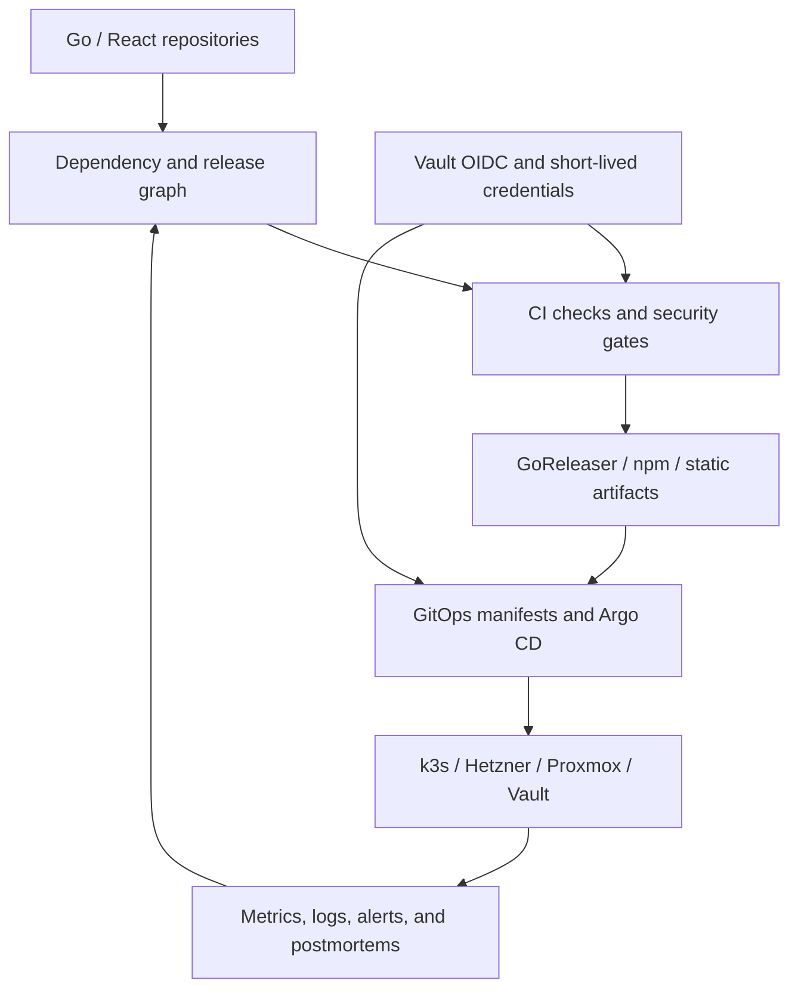

# Infrastructure and Release — Go-Go-Golems Platforms, CI, and Delivery

This map gathers the infrastructure and release work that turns Go repositories and web applications into deployable, observable, maintainable systems. It connects local release-train tooling, dependency-order analysis, GoReleaser and Homebrew publishing, GitHub/Vault OIDC, Argo CD and k3s platforms, static-site delivery, and production incident recovery.

> [!summary]
> - **Platform:** Terraform, Vault, k3s, Argo CD, DNS, ingress, and observability provide the runtime substrate.
> - **Release:** dependency graphs, ordered PRs, CI gates, GoReleaser, npm/Homebrew publishing, and rollout automation provide delivery discipline.
> - **Evidence:** postmortems and release reports preserve failure modes instead of reducing operations to a green pipeline.

## Architecture

The recurring invariant is dependency order. A release is not a single repository operation: libraries, providers, generated hosts, images, manifests, and downstream applications must be updated in an order that keeps the workspace and deployed system coherent. Infrastructure work follows the same rule: credentials, storage, identity, ingress, workload, and observability have ordering constraints.

## Capability areas

### Release trains and tooling

- [[ARTICLE - Managing Go-Go-Golems Release Trains]] — dependency graph, bump ordering, PR readiness, and rollout.
- [[ARTICLE - ggg - Codex-Aware Release Tooling for Go-Go-Golems]] — release orchestration tooling.
- [[ARTICLE - ggg Rollout Automation - Real-World Testing and Implementation]] — real rollout behavior.
- [[Research/KB/Tribal/dependency-ordered-release-train]] — reusable release-train pattern.
- [[ARTICLE - Bump-Goja - A Go Ecosystem Migration Playbook]] — dependency migration.
- [[ARTICLE - Logcopter - Package Scoped Logging for Go CLIs]] — package-level observability in released binaries.

### CI/CD, credentials, and publishing

- [[ARTICLE - Vault OIDC for GitHub Actions - Secretless CI GitOps]] — secretless CI.
- [[Projects/2026/07/17/PROJECT REPORT - Vault Backed Binary Releases - Sqleton Pilot and GitHub App Publishing]] — Vault-backed GoReleaser split-build pilot, GitHub App tap/GitOps authority, Argo CD read-only repository authentication recovery, live bootstrap proof, and residual production gates.
- [[Research/playbooks/infra/PLAYBOOK - Vault Backed Go Binary Releases]] — procedure for new binary repositories and migration of existing GitHub Actions release secrets.
- [[Projects/2026/05/26/ARTICLE - Vault OIDC for CI/CD Docs Publishing - Designing Short-Lived Package-Scoped Credentials]] — scoped publishing credentials.
- [[ARTICLE - NPM Publishing for Go Go Golems Packages with Vault OIDC]] — npm delivery.
- [[ARTICLE - Trusted npm Publishing for Go Go Golems React Packages]] — trusted frontend package publishing.
- [[ARTICLE - Static-Sites Deployment - A Three-Contract Model for Shipments]] — static artifact contracts.
- [[ARTICLE - Git Repository Consolidation - Migrating Corporate Submodules and Worktrees]] — repository topology.

### Platforms and GitOps

- [[PROJ - Coolify Hetzner - Self-Hosted Deployment Platform]] — initial self-hosted platform.
- [[PROJ - Hetzner K3s Platform - Single-Node GitOps Bring-Up]] — k3s foundation.
- [[PROJ - K3s Migration Program - From Coolify to GitOps Platform]] — platform migration.
- [[PROJ - Vault on K3s - Auth and Secret Delivery Platform]] — Vault delivery.
- [[PROJECT REPORT - ZITADEL SES SMTP - Vault Backed Verification and Recovery]] — production ZITADEL email verification and password recovery through Vault-backed SES, including Login V2 gate versus asynchronous delivery semantics.
- [[Research/playbooks/infra/PLAYBOOK - Production ZITADEL for a Single Go Web Application on k3s]] — ordered single-application deployment through DNS, TLS, Vault/VSO, PostgreSQL bootstrap, the official chart, Terraform PKCE resources, SMTP, GitOps, and browser acceptance.
- [[Research/playbooks/infra/PLAYBOOK - Production Multi-Tenant ZITADEL SaaS Platform on k3s]] — expansion into tenant-owned organizations, isolated namespaces/Vault paths/databases, organization-scoped OIDC, delegated administration, billing, self-service onboarding, and cross-tenant acceptance.
- [[PROJECT REPORT - Stripe Billing - End to End Subscription Infrastructure and Acceptance]] — Terraform catalog ownership, hosted Checkout and Portal, signed webhook convergence, Tax, Test Clocks, Vault delivery, quota enforcement, and production rollout boundaries.
- [[ARTICLE - Deep Dive - Completing the ZITADEL SaaS Tenant Control Plane]] — completed self-service tenant identity control plane with generated organization IDs, organization-scoped OIDC, verified administrator continuation, PostgreSQL concurrency controls, live browser acceptance, and idempotent cleanup.
- [[PROJ - Terraform Infra - Vault Platform Bring-Up, Auth Hardening, and Hair-Booking Handoff]] — infrastructure-as-code and auth.
- [[PROJ - wesen terraform - Infra Session Report]] — Terraform operations.
- [[ARTICLE - ArgoCD Reorganization - From Flat List to Structured Platform]] — Argo CD organization.
- [[PROJ - Hetzner K3s Platform — ArgoCD Reorganization and Cleanup]] — platform cleanup.
- [[Projects/2026/07/18/PROJECT REPORT - Crib K3s Loki Alloy Grafana Observability]] — Argo-managed Loki and Alloy logging, Grafana provisioning, least-privilege RBAC, live validation, and the remaining Grafana TLS secret distribution issue.
- [[Projects/2026/07/17/PROJECT REPORT - Vault Backed Binary Releases - Sqleton Pilot and GitHub App Publishing]] — GitHub App separation for GitOps writers and Argo CD repository readers; recovery of `wesen/crib-k3s` comparison health.
- [[Projects/2026/07/31/PROJECT REPORT - Hyperslop Mailing List - Double Opt-In Service from Zero to Production]] — a double opt-in signup service taken from an empty repository to production across four repositories; covers the anti-enumeration property a synchronous send silently broke, a tombstone that left its confirmation token working, Caddy's `try_files` fallback answering any unrouted POST with HTTP 200, the SES identity/credential distinction and terraform-managed SMTP derivation, and the AppProject allowlist that is not applied by merging.

### Production operations and failure recovery

- [[ARTICLE - Debugging a k3s Post-Reboot Outage]] — recovery and observability.
- [[ARTICLE - Hetzner k3s Resize Postmortem - Capacity, Reboot, and Recovery]] — capacity and reboot failure.
- [[ARTICLE - Incident Deep Dive - Terraform State Drift from an Uncommitted Crib DNS Apply]] — infrastructure state drift.
- [[ARTICLE - Observability - Hetzner K3s Metrics Logging and Alerting]] — platform observability.
- [[PROJ - Serve Artifacts - Deploying to K3s with GitOps]] — application delivery.
- [[ARTICLE - Deploying Glazed Help Browser to Argo CD - Production Deep Dive]] — Go/web deployment case study.
- [[Research/playbooks/infra/PLAYBOOK - Argo CD Application with a local-path PVC on k3s]] — procedure for deploying a stateful application through Argo CD without deadlocking on `WaitForFirstConsumer`; covers the sync-wave invariant, file layout, Vault secrets, and the `validate_gitops.sh` check that enforces it.
- [[Research/playbooks/infra/PLAYBOOK - Restic Backups to the Crib NAS]] — procedure for encrypted, deduplicated, scheduled restic backups from a laptop to TrueNAS over SFTP; covers TrueNAS dataset/user provisioning, Vault password escrow, the critical `sftp.args` option, systemd/launchd scheduling, and restore validation. Parameterized scripts at `Research/playbooks/infra/scripts/restic-crib-backup/`.
- [[PROJECT REPORT - Restic Backup Scope Design - From 1.7T Home to a 247G Recovery Unit]] — scope investigation that turned a 1.7T home directory into a 247G restic recovery unit; covers the 3-tier classification (back up / exclude / handle separately), the dry-run that corrected a twofold underestimate, the 99-line excludes file, and the permission-denied service-owned state pattern.
- [[PROJECT REPORT - Tailscale on TrueNAS - Making Restic Backups Work From Any Network]] — Tailscale installation on TrueNAS SCALE 23.10.2 via the community catalog app; covers the `hostNetwork` decision, cached state from a wrong-tailnet auth key, and the update from LAN IP to Tailscale hostname so backups work from any network.

## Recommended reading path

1. Read the release-train article and dependency-order tribal entry.
2. Read the Vault OIDC and publishing notes for credential boundaries.
3. Read the k3s/Argo CD platform reports.
4. Read one incident/postmortem before changing production automation.
5. Follow the Glazed, Geppetto, Pinocchio, and go-go-goja MOCs for repository-specific release consumers.

## Working rules

- Build release order from actual dependency edges, not directory order.
- Keep `GOWORK=off` and workspace-mode validation semantics explicit.
- Use short-lived, package-scoped credentials for CI and publishing.
- Treat CI failures as release-train feedback, not isolated repository noise.
- Keep GitOps manifests, secrets, rollout waves, and observability boundaries explicit.
- Preserve postmortems and failed rollout evidence.
- Separate artifact creation, publication, deployment, and health verification.

## Related project maps

- [[glazed]] — CLI/help artifacts and package publishing.
- [[geppetto]] and [[pinocchio]] — major Go application release consumers.
- [[go-go-goja]] — generated hosts and provider release graph.
- [[tiny-idp]] — deployable identity service.
- [[docmgr]] — ticketed implementation and operational history.

## Repository map

Primary repository: `/home/manuel/code/wesen/go-go-golems/infra-tooling`

Related repositories include `go-go-infra`, `go-go-golems-github`, `go-go-goja`, `glazed`, `geppetto`, `pinocchio`, and deployed application repositories.

| Concern | Location |
|---|---|
| Release graph and rollout tooling | `infra-tooling`, `ggg` packages |
| Terraform and platform modules | `go-go-infra`, Terraform repositories |
| CI and publishing workflows | repository `.github/`, Vault OIDC tooling |
| GitOps manifests | Argo CD/application repositories |
| Operations evidence | dated project reports and incident notes |
